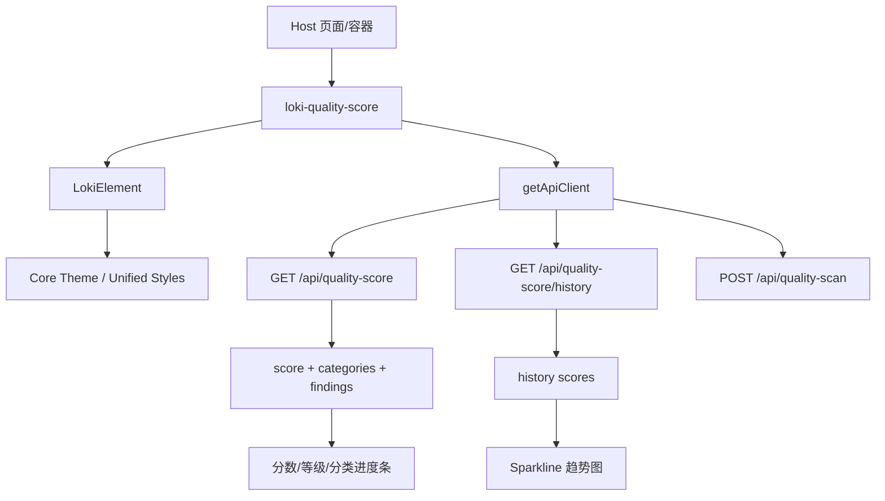
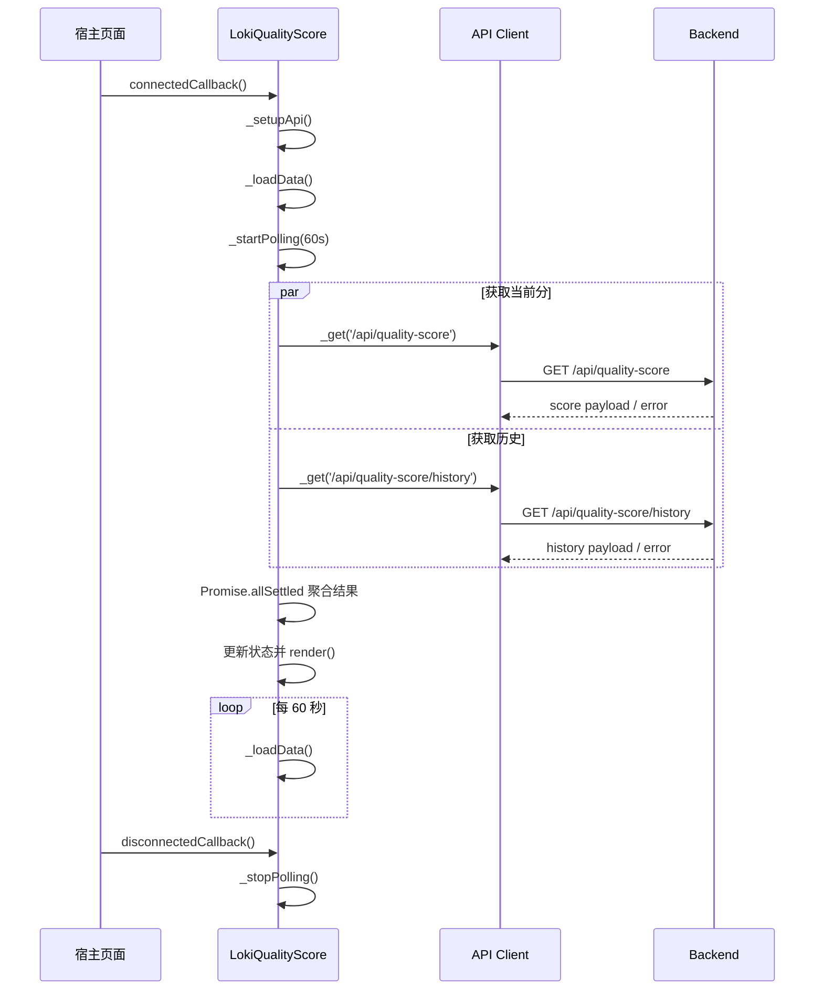
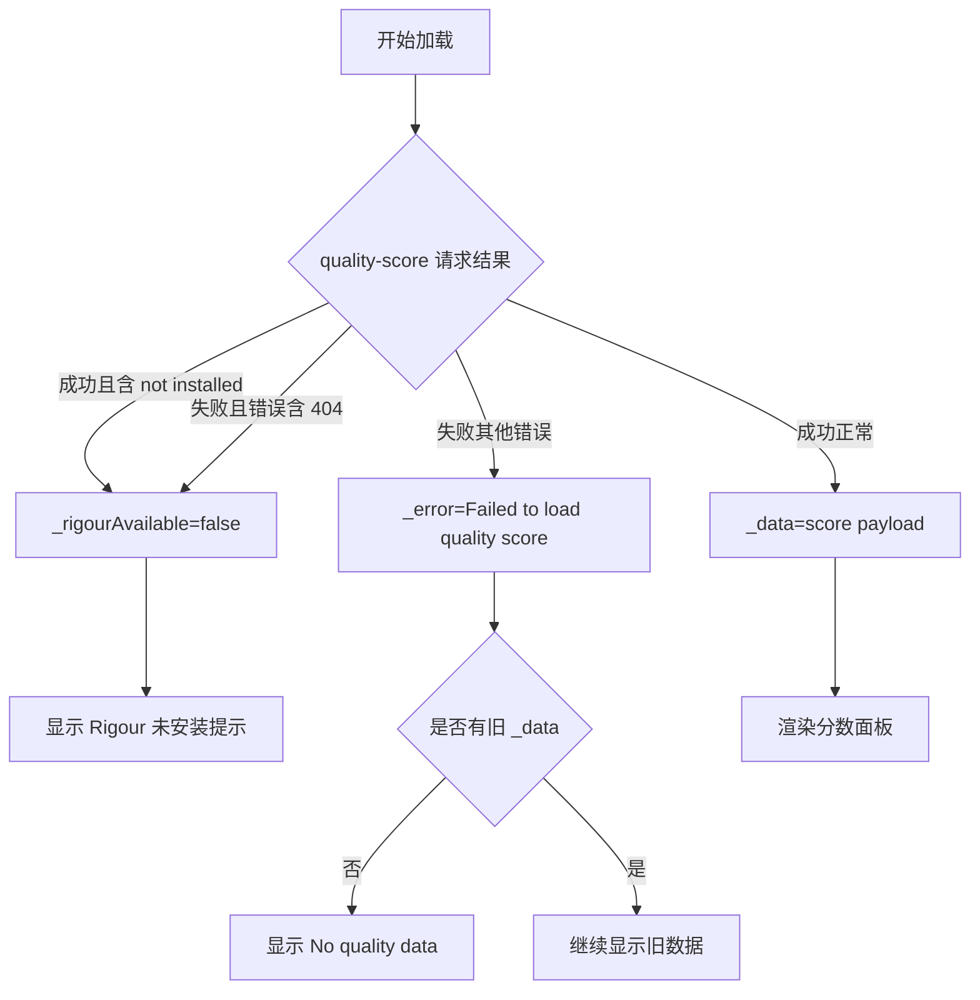

# quality_score 模块文档

## 模块简介与设计动机

`quality_score` 模块是 Dashboard UI 中 **Cost and Quality Components** 子域的质量评分可视化模块，核心实现为 `dashboard-ui.components.loki-quality-score.LokiQualityScore`（自定义元素标签：`<loki-quality-score>`）。它的主要职责不是计算质量分本身，而是把后端分析引擎输出的质量信号（总分、分类得分、发现项严重级别、历史趋势）组织成可读性高、可持续刷新、可手动触发扫描的统一界面。

这个模块存在的根本原因是：在多任务、多代理和多阶段执行系统中，开发者需要一个“连续信号面板”来判断质量是否在改善，而不仅仅是某一刻的 pass/fail。与质量门控（`quality_gates`）相比，`quality_score` 更偏向趋势与诊断；与成本看板（`cost_dashboard`）结合时，它可以帮助回答“质量提升是否伴随成本上升”这类运营问题。关于父级分组与相邻模块职责，可参考 [Cost and Quality Components.md](Cost and Quality Components.md) 与 [quality_gates_component.md](quality_gates_component.md)。

---

## 系统定位与依赖关系

从系统结构看，`quality_score` 位于 Dashboard UI 层，向下依赖统一主题基类与 API 客户端，向上作为页面中的质量观测卡片被嵌入。它不持久化数据，也不承载质量规则执行逻辑。



上图体现了该模块的分层原则：`LokiQualityScore` 负责“状态编排 + 渲染”，`LokiElement` 提供主题与基础生命周期能力，后端 API 提供业务数据。这样可以降低组件复杂度，也让前后端职责边界更清晰。关于主题与基础样式机制，可参考 [Core Theme.md](Core Theme.md) 与 [Unified Styles.md](Unified Styles.md)；关于 API 客户端行为，可参考 [API 客户端.md](API 客户端.md)。

---

## 核心组件：`LokiQualityScore`

### 类职责

`LokiQualityScore` 是一个继承自 `LokiElement` 的 Web Component。它在挂载后会初始化 API 客户端、并发请求当前质量分和历史数据、启动轮询刷新，并在用户点击时触发即时扫描。组件通过内部状态驱动渲染分支，覆盖加载中、引擎不可用、无数据、正常展示等运行场景。

### 观察属性（`observedAttributes`）

组件监听两个属性：`api-url` 与 `theme`。`api-url` 用于指定后端基地址，`theme` 用于触发主题应用。

### 内部状态字段

| 字段 | 类型 | 含义 | 典型来源 |
|---|---|---|---|
| `_data` | `object \| null` | 当前质量快照 | `/api/quality-score` |
| `_history` | `Array` | 历史分数序列（最多保留 10 条） | `/api/quality-score/history` |
| `_error` | `string \| null` | 当前错误信息 | 请求异常或扫描异常 |
| `_loading` | `boolean` | 首次加载标记 | 组件初始化 |
| `_scanning` | `boolean` | 是否正在手动扫描 | `Run Scan` 按钮触发 |
| `_rigourAvailable` | `boolean` | 质量引擎是否可用 | 返回内容中 `not installed` 或 404 推断 |
| `_api` | `object \| null` | API 客户端实例 | `getApiClient()` |
| `_pollInterval` | `number \| null` | 轮询句柄 | `setInterval` |

---

## 生命周期与运行流程

组件在生命周期中遵循“挂载即拉取 + 定时刷新 + 卸载清理”的标准节奏：



这个流程最关键的设计点是 `Promise.allSettled`：当前分和历史分互不阻塞，降低了单接口短时失败带来的整体不可用风险。

---

## 核心方法逐一解析

### `connectedCallback()`

该方法在组件插入 DOM 后触发。它先调用父类逻辑完成主题/基础能力初始化，再执行 `_setupApi()`、`_loadData()` 和 `_startPolling()`。

- 参数：无
- 返回值：无
- 副作用：创建 API 客户端、发起请求、创建轮询定时器

### `disconnectedCallback()`

该方法在组件从 DOM 移除时触发，核心动作是 `_stopPolling()`，防止卸载后继续发请求。

- 参数：无
- 返回值：无
- 副作用：清理轮询定时器

### `attributeChangedCallback(name, oldValue, newValue)`

这个方法处理运行期属性变更。当 `api-url` 变化且 `_api` 已存在时，组件会直接更新 `this._api.baseUrl` 并重新加载数据；当 `theme` 变化时调用 `_applyTheme()`。

- 参数：`name`、`oldValue`、`newValue`
- 返回值：无
- 副作用：可能触发网络请求和重新渲染

> 注意：这里直接改写客户端实例的 `baseUrl`，如果 API 客户端在其他组件中被共享，可能引入跨组件影响，详见“限制与坑点”。

### `_setupApi()`

读取 `api-url` 属性；若未提供则回落到 `window.location.origin`，然后通过 `getApiClient({ baseUrl })` 初始化客户端。

- 参数：无
- 返回值：无
- 副作用：写入 `_api`

### `_loadData()`

这是模块最核心的数据装载函数。它并发调用两个接口并分开处理结果：

1. `/api/quality-score` 成功时写入 `_data`；若返回体 `error` 中包含 `not installed`，则切到 `_rigourAvailable=false`。
2. `/api/quality-score` 失败时，若错误消息含 `404`，也视作引擎不可用；否则设置 `_error='Failed to load quality score'`。
3. `/api/quality-score/history` 成功时，支持两种结构：数组或 `{ scores: [...] }`，并统一截断为最后 10 条。
4. 最终设置 `_loading=false` 并执行 `render()`。

- 参数：无
- 返回值：`Promise<void>`
- 副作用：更新 `_data/_history/_error/_rigourAvailable/_loading`，触发重渲染

### `_triggerScan()`

该方法由按钮点击触发，用于主动发起质量扫描。函数使用 `_scanning` 作为并发保护，避免重复提交。

- 参数：无
- 返回值：`Promise<void>`
- 副作用：
  - 将 `_scanning` 置为 `true`（按钮禁用）
  - `POST /api/quality-scan`
  - 成功后再次 `_loadData()` 刷新结果
  - 结束时恢复 `_scanning=false`

### `_startPolling()` / `_stopPolling()`

`_startPolling()` 以 60 秒间隔执行 `_loadData()`；`_stopPolling()` 负责清理 interval。

- 参数：无
- 返回值：无
- 副作用：创建/销毁计时器

### `_getGrade(score)`

该方法把分数映射为字母等级和颜色：

- `>= 90` → `A`
- `>= 80` → `B`
- `>= 70` → `C`
- `>= 60` → `D`
- `< 60` → `F`

返回结构：`{ grade, color }`。

### `_renderSparkline(scores)`

将历史序列转换为固定尺寸 SVG 折线图。函数会提取值（支持 number 或 `{ score }`），做 min-max 归一化后生成 `polyline` 点串，并在尾点绘制 `circle`。当有效点数小于 2 时返回空字符串。

- 参数：`scores: Array<number | {score:number}>`
- 返回值：`string`（SVG 片段或空串）
- 副作用：无

### `render()`

`render()` 是状态到 UI 的唯一出口，按以下优先级分支：

1. `_loading`：显示加载态。
2. `!_rigourAvailable`：显示“Rigour not installed”提示。
3. `_error && !_data`：显示空数据提示。
4. 正常态：展示分数、等级、趋势、分类评分、发现项与扫描按钮。

函数最后会给 `#scan-btn` 绑定点击事件。由于每次全量替换 `shadowRoot.innerHTML`，旧节点会被销毁，因此不会在同一节点上累积监听器。

---

## 数据契约与渲染语义

### 当前评分接口（`GET /api/quality-score`）

建议后端至少返回以下字段：

```json
{
  "score": 82,
  "categories": {
    "security": 90,
    "code_quality": 78,
    "compliance": 84,
    "best_practices": 75
  },
  "findings": {
    "critical": 0,
    "major": 2,
    "minor": 5,
    "info": 12
  }
}
```

### 历史接口（`GET /api/quality-score/history`）

兼容两种返回形态：

```json
[70, 73, 75, 79, 82]
```

```json
{ "scores": [{ "score": 70 }, { "score": 82 }] }
```

### 扫描触发接口（`POST /api/quality-scan`）

请求体为空对象 `{}`，用于发起一次即时扫描。组件不依赖固定响应体，只要求请求成功后能再次获取更新数据。

---

## UI 决策流与异常分支



该决策流展示了组件“尽量可用”的策略：出现非致命错误时优先保留旧数据，不会轻易清空界面。

---

## 使用与配置

### 基础用法

```html
<loki-quality-score></loki-quality-score>
```

### 指定后端地址与主题

```html
<loki-quality-score api-url="http://localhost:57374" theme="dark"></loki-quality-score>
```

### 运行期动态切换

```javascript
const scoreEl = document.querySelector('loki-quality-score');
scoreEl.setAttribute('api-url', 'https://your-api.example.com');
scoreEl.setAttribute('theme', 'light');
```

在运行期修改 `api-url` 会立即触发重新拉取数据，因此适合在多环境调试面板中动态切换后端。

---

## 扩展建议

如果需要扩展该模块，建议遵循当前“内部状态驱动 + 单入口 render”的模式。这样能保证逻辑集中、调试路径清晰。常见扩展方向包括：

- 增加 `poll-ms` 属性使轮询间隔可配置。
- 引入 `visibilitychange` 监听，在后台标签页暂停轮询（可借鉴 `LokiQualityGates` 的策略，见 [quality_gates_component.md](quality_gates_component.md)）。
- 支持动态类别渲染，避免前端硬编码 4 个类别。
- 为错误状态增加可见提示横幅（即使仍显示旧数据）。

下面给出一个最小扩展示例（可配置轮询间隔）：

```javascript
static get observedAttributes() {
  return ['api-url', 'theme', 'poll-ms'];
}

_startPolling() {
  const ms = Number(this.getAttribute('poll-ms')) || 60000;
  this._pollInterval = setInterval(() => this._loadData(), ms);
}
```

---

## 边界条件、错误处理与已知限制

1. 组件通过字符串匹配（`not installed`、`404`）推断 Rigour 可用性，这种方式对后端错误文案格式有隐含依赖。
2. `_escapeHtml()` 已实现但目前几乎未用于模板插值；当前渲染数据主要是数字，风险可控，但未来若展示文本型后端字段应显式转义。
3. 当扫描失败或拉取失败但仍有旧 `_data` 时，界面可能继续显示旧数据而不显著提示“数据已过期”。
4. 分类键是硬编码白名单（`security/code_quality/compliance/best_practices`），后端新增类别不会自动显示。
5. 轮询不区分页面可见性，后台页也会继续请求，可能带来不必要流量。
6. 动态修改 `this._api.baseUrl` 的方式在共享 API 实例场景下可能影响其他组件。

---

## 测试与验证建议

建议在联调和回归测试中至少覆盖以下场景：

- 首次加载成功：分数、等级、分类条、发现项、趋势图正常。
- 历史接口失败但当前分成功：主面板仍可显示，趋势图可缺省。
- 当前分返回 `not installed` 或接口 404：显示 Rigour 未安装提示。
- 扫描中重复点击：按钮应禁用，避免重复请求。
- 卸载后检查：应停止轮询，不再触发请求。

---

## 与其他模块的协作关系

`quality_score` 建议与以下模块组合使用，以形成完整治理闭环：

- [quality_gates_component.md](quality_gates_component.md)：提供离散 gate 状态（pass/fail/pending）。
- [cost_dashboard_component.md](cost_dashboard_component.md)：补充成本维度，评估质量/成本平衡。
- [LokiQualityScore.md](LokiQualityScore.md)：已有组件级说明，可作为快速索引页。

这种组合可以把“趋势（score）—决策（gate）—资源（cost）”三条链路统一到同一控制面板中。
