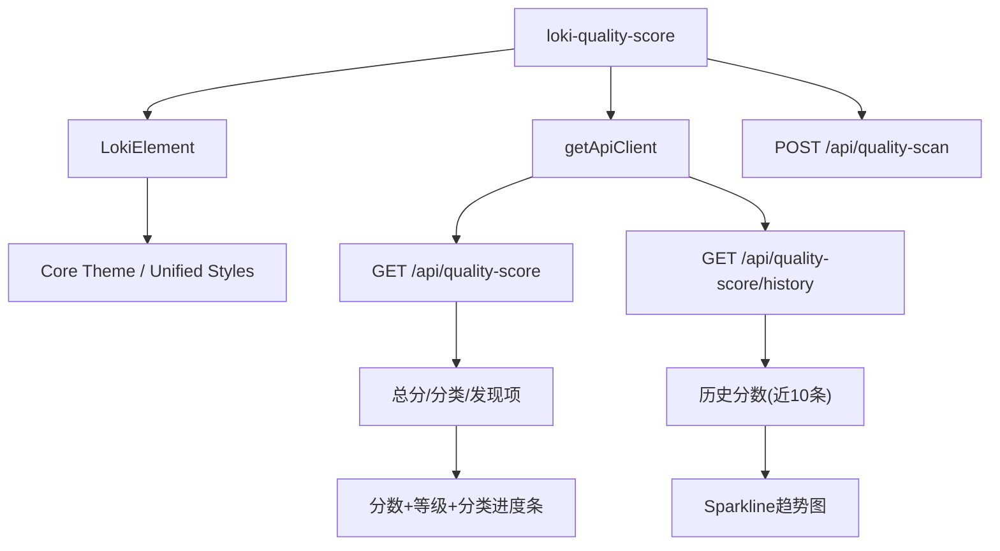
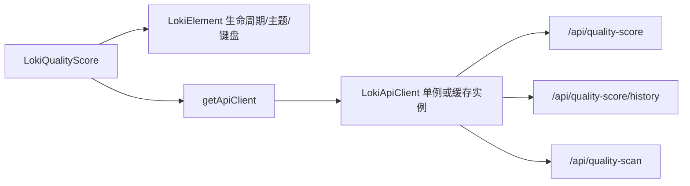
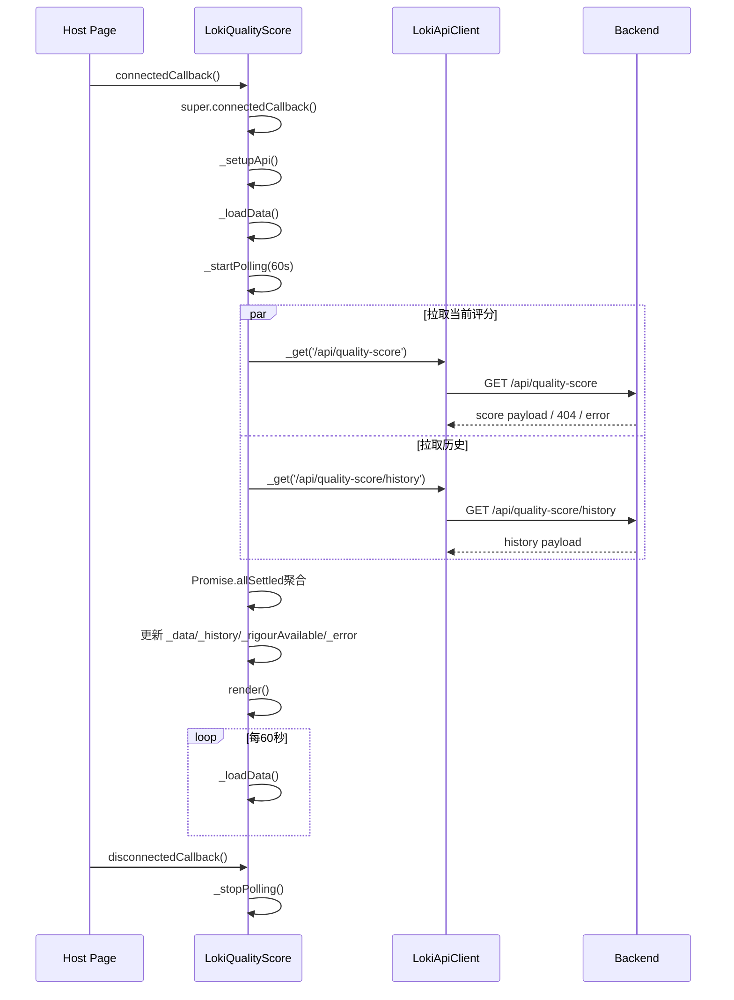
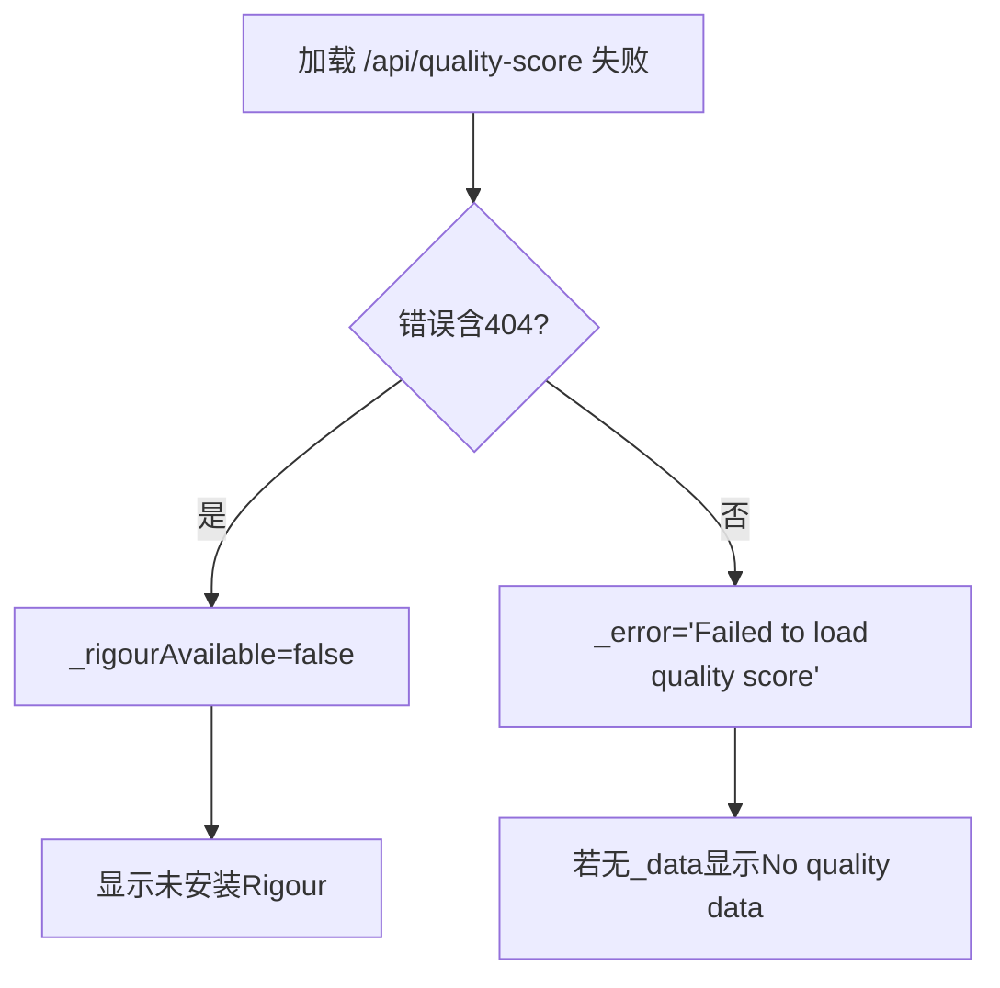

# quality_score_component 模块文档

## 模块简介

`quality_score_component` 是 Dashboard UI 中 `Cost and Quality Components` 分组下的质量评分可视化模块，核心实现为 Web Component `dashboard-ui.components.loki-quality-score.LokiQualityScore`（标签名：`<loki-quality-score>`）。该组件的目标不是替代后端分析引擎，而是把质量分析结果（总分、分类分、严重级别问题、历史趋势）压缩成一个可快速判读的面板，帮助用户在任务执行过程中持续观察“质量是否在改善”。

从设计取舍上看，这个组件强调三件事：第一，状态容错（`Promise.allSettled` 允许当前分与历史分独立失败）；第二，运行期可操作性（提供 `Run Scan` 触发即时扫描）；第三，低维护的数据适配（兼容历史数据返回数组或 `{ scores: [...] }` 两种结构）。它与 `quality_gates_component` 的关系是互补而非替代：Gate 更偏“是否放行”的离散判断，Score 更偏“质量水平与趋势”的连续信号。相关上层定位可参考 [Cost and Quality Components.md](Cost and Quality Components.md) 与 [quality_gates_component.md](quality_gates_component.md)。

---

## 系统位置与依赖关系



该组件继承 `LokiElement`，因此天然拥有主题令牌注入、Shadow DOM 隔离与基础生命周期能力；网络层并未直接写 `fetch`，而是通过 `getApiClient` 复用 Dashboard UI 的统一 API 客户端实例（见 [API 客户端.md](API 客户端.md) 与 [Core Theme.md](Core Theme.md)）。

---

## 与基类与客户端基础设施的协同机制

`LokiQualityScore` 的实现非常“轻”，这种轻量并不是功能不足，而是明确把跨组件共性能力下沉到了 `LokiElement` 与统一 API 客户端层。继承 `LokiElement` 后，组件在挂载时会自动完成 Shadow DOM 初始化、主题事件监听（`loki-theme-change`）以及基础键盘处理器挂载，这意味着质量评分组件本身无需重复处理主题 token 注入和全局主题切换逻辑，只需要在 `render()` 中使用设计变量（如 `--loki-accent`、`--loki-error`）即可同步系统视觉风格。有关主题与样式系统的完整机制可直接参考 [Core Theme.md](Core Theme.md) 与 [Unified Styles.md](Unified Styles.md)。

在数据访问侧，组件通过 `getApiClient({ baseUrl })` 获取统一客户端实例。该模式的价值在于统一鉴权、错误封装和请求行为，避免每个 Web Component 各自维护 `fetch` 细节；但它也引入了一个重要的工程约束：实例可能被复用，因此组件内对 `this._api.baseUrl` 的改写并非纯局部行为。在单页面里如果存在多个指向不同后端的组件，必须谨慎处理 `api-url` 动态更新策略，必要时应在 API 客户端层提供“强制新实例”能力，而不是直接改写共享实例属性。



上图强调了一个常被忽略的事实：`LokiQualityScore` 是“展示与编排层”，而不是“协议与状态基础设施层”。这种分层让组件本身容易维护，也让未来替换后端 API 或主题系统时具备更好的可演进性。

---

## 核心类：`LokiQualityScore`

### 类职责

`LokiQualityScore` 负责完整的前端展示链路：初始化 API 客户端、并发拉取当前评分和历史评分、定时刷新、触发扫描、根据状态分支渲染不同 UI（加载中/未安装引擎/无数据/正常数据）。它不实现任何质量打分算法，所有分析语义都来自后端接口。

### 可观察属性

组件监听以下属性：

- `api-url`：后端 API 根地址，变化后更新 `this._api.baseUrl` 并立即重拉数据。
- `theme`：主题属性，变化后调用 `_applyTheme()`。

### 内部状态模型

组件运行依赖以下私有状态：

- `_data`: 当前评分快照，通常包含 `score`、`categories`、`findings`。
- `_history`: 历史评分数组，渲染趋势图时只取最近 10 条。
- `_error`: 错误文案；当没有可用数据时会显示空状态。
- `_loading`: 首次加载状态。
- `_scanning`: 手动扫描中的互斥标志。
- `_rigourAvailable`: 是否可用 Rigour 引擎（基于错误内容/404 推断）。
- `_api`: API 客户端实例。
- `_pollInterval`: 60 秒轮询句柄。

---

## 生命周期与主流程



这个流程的关键点在于 `Promise.allSettled`：即使历史接口失败，只要当前评分成功，主面板仍可展示；反过来当前评分失败时，历史数据也不会影响错误分支判断。该策略能降低“单接口抖动导致整个组件不可用”的概率。

---

## 关键方法详解

### `connectedCallback()` / `disconnectedCallback()`

`connectedCallback()` 先执行父类挂载逻辑，再进行 `_setupApi()`、`_loadData()`、`_startPolling()`。`disconnectedCallback()` 对称调用 `_stopPolling()`，避免组件被卸载后仍持续请求。

**副作用**：
- 挂载时触发网络请求和定时器创建。
- 卸载时清理定时器。

### `attributeChangedCallback(name, oldValue, newValue)`

该方法处理运行期配置变更。`api-url` 变化且 `_api` 已初始化时，会直接修改客户端 `baseUrl` 并重新拉取；`theme` 变化只进行主题应用。

**注意**：`LokiApiClient` 采用按 baseUrl 缓存实例的单例策略，但这里是“修改现有实例的 `baseUrl`”，如果多个组件共享同一个实例，可能发生地址串改（见下文“限制与坑点”）。

### `_setupApi()`

读取 `api-url` 属性，默认 `window.location.origin`，再调用 `getApiClient({ baseUrl })` 获取客户端。

```js
const apiUrl = this.getAttribute('api-url') || window.location.origin;
this._api = getApiClient({ baseUrl: apiUrl });
```

### `_loadData(): Promise<void>`

组件核心数据入口。它并发请求 `/api/quality-score` 与 `/api/quality-score/history`，并按如下规则处理：

1. 当前评分成功：
   - 若返回体中含 `error` 且包含 `not installed`，判定 Rigour 不可用，进入“未安装”状态。
   - 否则写入 `_data`。
2. 当前评分失败：
   - 若错误消息含 `404`，同样判定 Rigour 不可用（当作后端未启用相关能力）。
   - 其他错误写入 `_error='Failed to load quality score'`。
3. 历史评分成功：兼容数组或对象结构，统一截断为最后 10 条。
4. 最终统一设置 `_loading=false` 并 `render()`。

**返回值**：无显式返回（状态驱动渲染）。  
**副作用**：更新多个内部状态并重绘。

### `_triggerScan(): Promise<void>`

该方法用于点击 `Run Scan` 后触发即时扫描，使用 `_scanning` 作为互斥锁防止重复提交：

1. `_scanning=true` 并先 render（按钮禁用+小 spinner）。
2. `POST /api/quality-scan`。
3. 成功后调用 `_loadData()` 立即刷新面板。
4. 最终 `_scanning=false` 并再次 render。

**错误处理**：扫描失败仅设置 `_error = err.message`，不清理现有 `_data`，因此“旧数据 + 新错误”可能并存。

### `_startPolling()` / `_stopPolling()`

- `_startPolling()`：`setInterval(() => this._loadData(), 60000)`。
- `_stopPolling()`：清理 interval 并置空句柄。

这是最小实现的定时刷新；与 `quality_gates_component` 不同，它没有监听页面可见性，不会在后台自动降频或暂停。

### `_getGrade(score)`

把数值分映射为字母等级与颜色：

- `>=90` => A
- `>=80` => B
- `>=70` => C
- `>=60` => D
- `<60` => F

返回形如 `{ grade, color }`，用于 badge 渲染。

### `_renderSparkline(scores)`

接收历史序列并生成内联 SVG 折线图。该函数会：

1. 支持数据项是 number 或 `{ score }`。
2. 计算 min/max 并归一化到固定画布（120x32）。
3. 输出 `<polyline>` 与末端 `<circle>`。

当历史少于 2 个点时直接返回空字符串，不渲染趋势块。

### `render()`

`render()` 是单入口全量重绘：构建样式字符串后，依据状态进入不同分支：

- `_loading`：显示 Loading。
- `!_rigourAvailable`：显示“Rigour not installed”与安装提示。
- `this._error && !this._data`：显示 `No quality data available`。
- 正常：显示评分、等级、趋势、分类条、发现项徽章与扫描按钮。

渲染完成后会为 `#scan-btn` 绑定 click 事件。由于每次都是替换 `innerHTML`，旧按钮节点会被销毁，监听器不会累积到同一 DOM 节点。

---

## 渲染数据语义与前端契约

当前评分接口在前端的最小可工作数据结构可理解为：

```json
{
  "score": 82,
  "categories": {
    "security": 90,
    "code_quality": 78,
    "compliance": 84,
    "best_practices": 75
  },
  "findings": {
    "critical": 0,
    "major": 2,
    "minor": 5,
    "info": 12
  }
}
```

历史接口可接受两种结构：

```json
[70, 73, 75, 79, 82]
```

或：

```json
{ "scores": [{ "score": 70 }, { "score": 82 }] }
```

组件固定展示四个分类键：`security`、`code_quality`、`compliance`、`best_practices`。缺失值按 `0` 处理，未知额外分类不会展示。

---

## 使用方式

### 基础挂载

```html
<loki-quality-score></loki-quality-score>
```

### 指定 API 与主题

```html
<loki-quality-score api-url="http://localhost:57374" theme="dark"></loki-quality-score>
```

### 运行时修改

```js
const el = document.querySelector('loki-quality-score');
el.setAttribute('api-url', 'https://your-api.example.com');
el.setAttribute('theme', 'light');
```

---

## 扩展与二次开发建议

如果你要扩展此组件，建议优先沿着“状态机 + 渲染分支”的现有模式迭代，而不要把业务逻辑散落到 DOM 事件里。常见扩展点包括：增加分类维度、支持可配置轮询频率、引入时间范围筛选、增强错误分层（网络错误 vs 权限错误 vs 功能未启用）。

一个较安全的扩展示例是增加轮询间隔属性：

```js
static get observedAttributes() {
  return ['api-url', 'theme', 'poll-ms'];
}
```

再在 `attributeChangedCallback` 中重新启动轮询。这样可保持外部可配置，又不破坏现有 API。

---

## 边界条件、错误场景与已知限制



当前实现有几个需要特别注意的点：

- `_escapeHtml()` 已实现但未实际用于模板插值，当前模板主要插入数字和固定标签，风险较低；若后续加入后端返回文本（例如规则描述），应立即接入转义。
- 未做页面可见性优化，后台标签页仍会每 60 秒轮询一次。
- `api-url` 改写的是共享 API 客户端实例的 `baseUrl`，在多组件混用多后端时可能互相影响。
- 当 `_error` 存在但 `_data` 仍有旧值时，UI 仍展示旧数据，不会显式暴露错误横幅，可能造成“数据已过期但看起来正常”的错觉。
- 分类字段是前端硬编码白名单，后端新增类别不会自动出现。

---

## 与其他模块的协作建议

在质量治理视角上，建议把本组件与以下模块组合使用：

- [quality_gates_component.md](quality_gates_component.md)：用于放行决策与 gate 状态。
- [cost_dashboard_component.md](cost_dashboard_component.md)：用于成本与质量联动分析（例如“质量提升是否伴随成本上升”）。
- [LokiQualityScore.md](LokiQualityScore.md)：若你需要组件级别说明（如已有英文/HTML 版）。

这样可以形成“分数趋势 + 门控状态 + 成本约束”的完整观测闭环。
