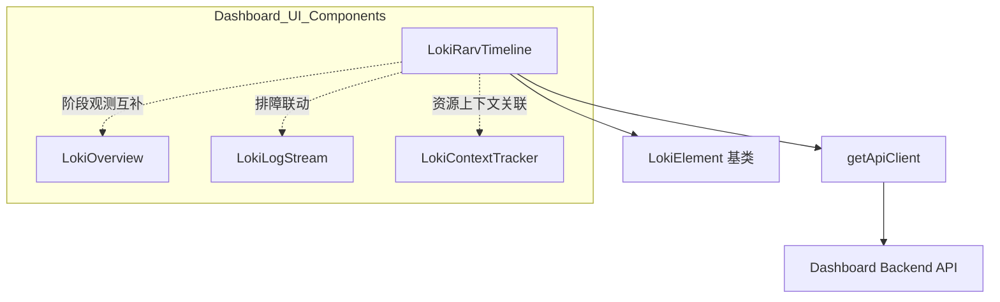
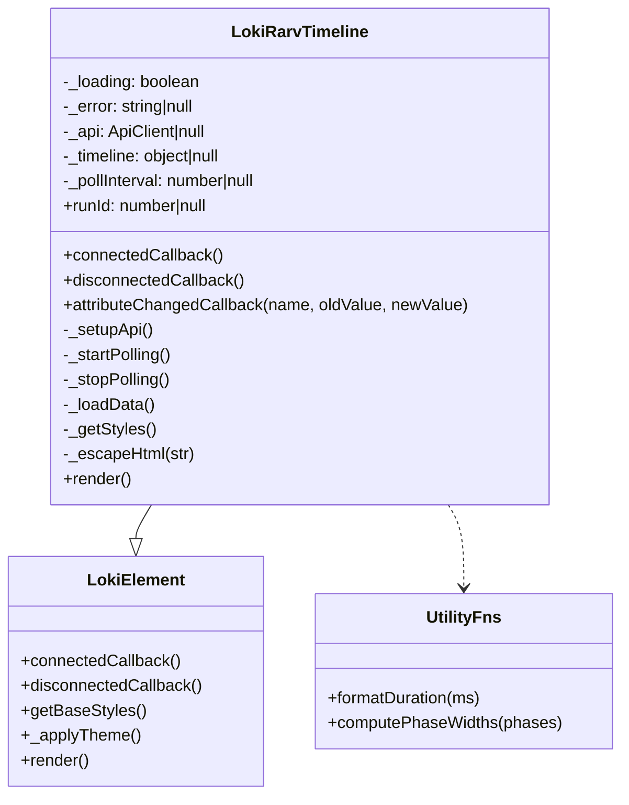
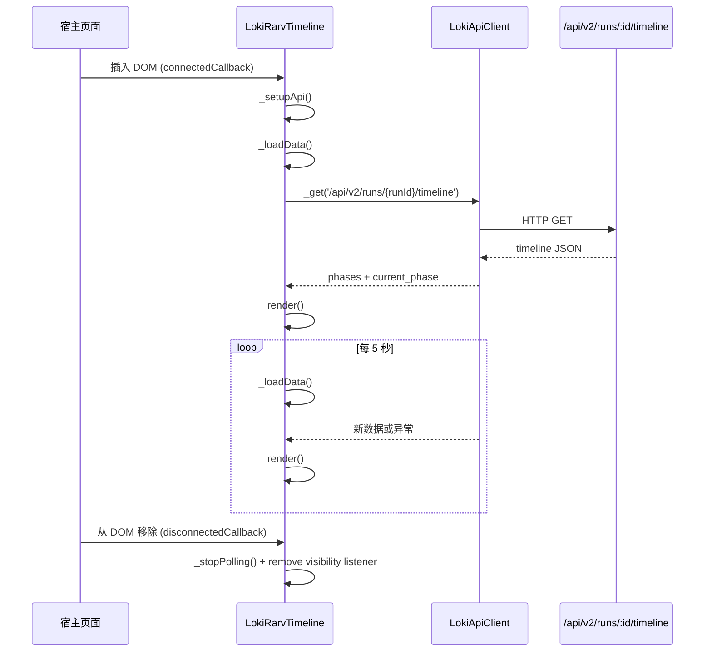
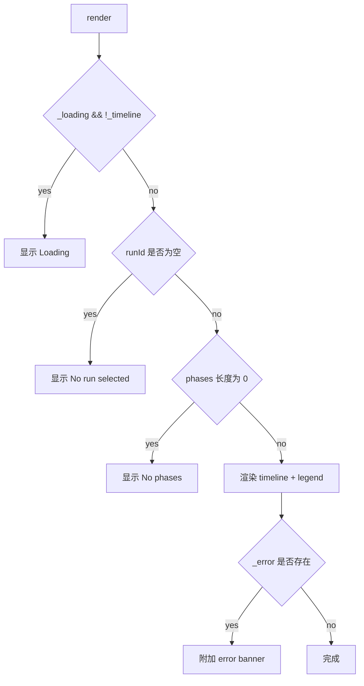
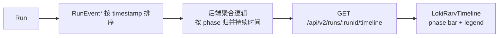

# rarv_phase_timeline_observability 模块文档

## 模块概述

`rarv_phase_timeline_observability` 模块的核心实现是 `dashboard-ui.components.loki-rarv-timeline.LokiRarvTimeline`。它的职责是把一次 run 在 RARV（Reason / Act / Reflect / Verify）循环中的阶段执行轨迹可视化为横向时间轴，并持续刷新以反映实时进展。这个模块存在的根本原因，是在“高层状态”和“底层日志”之间补齐一个中层观测面：开发者既能看到当前卡在哪个阶段，也能通过各阶段宽度快速判断耗时结构是否异常。

在系统中，`LokiOverview`（见 [LokiOverview.md](LokiOverview.md)）更偏全局状态摘要，`LokiLogStream`（见 [LokiLogStream.md](LokiLogStream.md)）更偏事件细节流，而本模块提供的是“过程切片”。因此它并不是替代其他观测组件，而是帮助你把它们串成一个更完整的诊断链路：先看 timeline 判断问题发生在 Reason/Act/Reflect/Verify 的哪一段，再去日志组件做深挖，最后回到 overview 校验系统态是否恢复。

从实现风格看，该组件遵循 Dashboard UI 的统一模式：基于 Web Component，继承 `LokiElement`，运行在 Shadow DOM 内部，依赖统一主题 Token，并通过 API 轮询拉取后端数据。它不持有业务领域状态，也不直接控制 run 生命周期，因此耦合度低、可嵌入性强。

---

## 在整体架构中的位置



`LokiRarvTimeline` 与其它 observability 组件共享同一 UI 基础设施（主题、样式、组件生命周期）但数据语义不同。它消费的是 run 级别的 phase timeline；`LokiContextTracker` 关注 token/context 负载；`LokiLogStream` 关注时间序列日志；`LokiOverview` 汇总 session 运行态。将它们拆分成独立组件的好处是可按页面场景自由组合，也降低了单组件复杂度。

---

## 组件与依赖的内部关系



`LokiRarvTimeline` 的内部结构非常克制：它用 `_timeline` 表示当前快照，用 `_loading` 和 `_error` 表示请求状态，用 `_pollInterval` 与 `visibilitychange` 控制刷新节奏。这样的状态模型有明显优点：你可以很直观地推导每个 UI 分支是由哪个状态触发的，也容易在测试中构造输入并断言渲染结果。

---

## 数据流与执行流程



这个流程里最关键的行为是“前台轮询，后台暂停”。组件在文档隐藏时暂停定时器，在恢复可见时立即补拉一次数据并重启轮询，避免页面后台长期占用网络与 CPU。这个策略同样出现在 `LokiContextTracker` 一类组件中，属于 Dashboard UI 观测组件常见的资源治理模式。

---

## 核心常量与工具函数

### PHASE_CONFIG 与 PHASE_ORDER

`PHASE_CONFIG` 定义了 `reason/act/reflect/verify` 的颜色和展示标签。组件渲染时按 phase 名称查表，查不到则回退到默认文本色与原始 phase 名字。这个回退策略让后端扩展新 phase 时前端不会崩溃，但视觉语义会退化，因此新增阶段后应同步更新该配置。

`PHASE_ORDER` 在当前实现中仅声明未使用，这意味着阶段展示顺序完全依赖后端返回顺序，而不是前端固定顺序。维护者如果希望 UI 顺序稳定，应在渲染前按 `PHASE_ORDER` 做排序（并为未知 phase 定义尾部策略）。

### `formatDuration(ms)`

`formatDuration` 将毫秒格式化为可读字符串。它处理了负值与空值（返回 `--`），并按秒/分/小时分层显示。该函数是纯函数，无副作用，适合单元测试，也是 tooltip 与图例时间文本的一致来源。

### `computePhaseWidths(phases)`

这个函数负责把 `duration_ms` 映射到百分比宽度。总时长为 0 时采用均分策略，避免除零和“全空白条”问题。返回值包含 `phase`、`pct`、`duration` 三个字段，后续渲染还会再施加 `Math.max(pct, 2)` 的最小宽度保护，防止极短阶段在视觉上完全不可见。

---

## `LokiRarvTimeline` 逐方法解析

### 构造与属性

构造函数初始化 `_loading/_error/_api/_timeline/_pollInterval`。`runId` 通过 attribute 映射，getter 从 `run-id` 解析 `int`，setter 则同步写回 attribute。这种写法使组件既可 declarative（HTML 属性）使用，也可 imperative（JS 属性）驱动。

`observedAttributes` 返回 `['run-id', 'api-url', 'theme']`，意味着这三个属性变化会触发 `attributeChangedCallback`。

### 生命周期：`connectedCallback` / `disconnectedCallback`

`connectedCallback` 调用顺序是：先 `super.connectedCallback()`（确保主题与基础渲染环境就绪），再 `_setupApi()` 初始化客户端，再 `_loadData()` 首次拉取，然后 `_startPolling()` 启动周期刷新。

`disconnectedCallback` 会调用 `_stopPolling()`，它不仅清理 interval，也会移除 `visibilitychange` 监听器。这一清理非常关键，否则在页面频繁挂载/卸载组件时会造成定时器泄漏与重复请求。

### 属性变更：`attributeChangedCallback`

当 `api-url` 变化且 `_api` 已存在时，组件会直接修改 `this._api.baseUrl` 并重新加载数据。`run-id` 变化时直接触发 `_loadData()`。`theme` 变化时调用 `_applyTheme()`，沿用 `LokiElement` 的主题机制。

这里有一个实现注意点：`LokiElement` 内部主题状态由 `_theme` 持有并通过全局 `loki-theme-change` 更新，当前组件在 attribute 变化时只调用 `_applyTheme()`，并未显式把 `newValue` 同步到 `_theme`。在某些主题切换路径中，这可能导致主题来源不一致（取决于外层是否同时触发全局主题事件）。

### API 初始化：`_setupApi()`

`_setupApi` 从 `api-url` 读取 baseUrl，没有则使用 `window.location.origin`，然后调用 `getApiClient`。这使组件默认可直接部署在同源 dashboard 环境，也允许跨域或多环境调试时显式指定后端地址。

### 轮询控制：`_startPolling()` / `_stopPolling()`

`_startPolling` 固定每 5000ms 执行 `_loadData()`。同时注册页面可见性监听：隐藏时停止轮询，恢复时先立即加载一次再恢复 interval。`_stopPolling` 负责二者对称清理。

这种实现是典型“拉模型”而非“推模型”。它的优点是简单、可预测、对后端要求低；缺点是存在刷新延迟与空转请求。如果后续接入 `WebSocketClient`（见 [api_client_and_realtime.md](api_client_and_realtime.md)），可考虑做“WebSocket 推送 + polling 回退”。

### 数据加载：`_loadData()`

`_loadData` 先读取 `runId`。若为空，直接清空 `_timeline` 并渲染空态，不发送请求。若有值，则进入 try/catch/finally：

- `try` 中设置 `_loading = true`，调用 `this._api._get('/api/v2/runs/${runId}/timeline')`。
- 成功后更新 `_timeline` 并清空 `_error`。
- 失败后设置 `_error` 文本，但不会清空旧 `_timeline`。
- `finally` 里统一把 `_loading` 置 `false`，随后 `render()`。

“不清空旧数据”的策略让页面在临时网络抖动时仍保留最近一次成功快照，可提高可用性；代价是用户可能误以为当前显示的是最新数据，因此错误横幅在这里非常重要。

### 渲染与安全：`render()` + `_escapeHtml()`

`render` 按状态分支构造内容：加载态、未选 run 空态、无 phases 空态、正常时间轴。正常路径下会构建两部分：上方 `timeline-bar`（按比例分段）和下方 `legend`（阶段标签+耗时+ACTIVE 标记）。

`_escapeHtml` 用于错误文本输出，避免将异常消息原样注入 HTML。虽然此处主要是错误 banner，但仍是必要的防御式编码。

---

## 视图状态机与交互语义



视觉上，`current_phase` 对应的 segment 会应用 `current` 类并产生 pulse 动画，图例会显示 `ACTIVE` 标签。对于百分比较小的段，bar 内文本会隐藏（`pw.pct > 12` 才显示 label），以避免拥挤，但 tooltip 仍保留完整时长信息。

---

## 数据契约与后端接口约定

组件默认调用：

```http
GET /api/v2/runs/{runId}/timeline
```

可兼容的数据形态如下：

```json
{
  "phases": [
    { "phase": "reason", "duration_ms": 1400 },
    { "phase": "act", "duration_ms": 5200 },
    { "phase": "reflect", "duration_ms": 2100 },
    { "phase": "verify", "duration_ms": 900 }
  ],
  "current_phase": "act"
}
```

其中 `phases` 为空时会显示“暂无阶段记录”空态；`duration_ms` 缺失按 `0` 处理；未知 phase 会回退到默认色。接口契约的详细后端上下文请参考 [Dashboard Backend.md](Dashboard Backend.md) 与 [api_surface_and_transport.md](api_surface_and_transport.md)。

---

## 与 Dashboard Backend 数据模型的对应关系

虽然该组件直接消费的是聚合后的 timeline API，而不是原始 ORM 对象，但从语义上它与 `dashboard.models.Run`、`dashboard.models.RunEvent` 强相关。`Run` 是一次执行实体，`RunEvent` 是按时间排序的阶段/事件序列，timeline 接口通常就是在服务层把这些事件压缩成“每个 phase 的累计时长 + 当前 phase”的投影视图。



这个分层设计的价值在于，前端组件不需要理解事件级细节（例如 phase-enter/phase-exit 的配对算法），只需消费稳定的读模型。若后端未来调整事件采样粒度或新增事件类型，只要 timeline API 契约不破坏，组件无需改动。

---

## 配置与运行参数说明

该组件的可配置面集中在 HTML attributes，配置简单但语义明确。`run-id` 是唯一决定数据域的参数；`api-url` 决定请求目标环境；`theme` 决定视觉主题覆盖。由于组件会在属性变更后自动触发重载/重绘，通常不需要手动调用刷新方法。

```html
<loki-rarv-timeline
  run-id="128"
  api-url="https://dashboard.example.com"
  theme="light">
</loki-rarv-timeline>
```

在运维和灰度场景中，一个常见模式是由外层容器统一下发 `api-url`，并根据用户选中的 run 动态更新 `run-id`。组件内部会立即请求新 run 的 timeline，因此切换体验是“属性驱动”的，而不是“命令驱动”的。

---


## 使用方式与集成示例

### 基础用法

```html
<loki-rarv-timeline run-id="42"></loki-rarv-timeline>
```

### 指定后端与主题

```html
<loki-rarv-timeline
  run-id="42"
  api-url="http://localhost:57374"
  theme="dark">
</loki-rarv-timeline>
```

### 运行时联动（与任务板/概览组件）

```javascript
const timeline = document.querySelector('loki-rarv-timeline');

// 由外层选择行为驱动 run 切换
window.addEventListener('run-selected', (e) => {
  timeline.runId = e.detail.runId;
});

// 切换到测试环境后端
timeline.setAttribute('api-url', 'https://staging.example.com');
```

实践中，最常见的布局是把本组件和 [LokiOverview.md](LokiOverview.md)、[LokiLogStream.md](LokiLogStream.md) 放在同一页面：timeline 先定位问题阶段，overview 校验系统态，log-stream 深入事件因果。

---

## 可扩展性设计建议

当前实现已经可用，但扩展空间很明确。首先可把固定轮询周期提升为配置项（例如 `poll-ms`）；其次可引入阶段排序策略，让 `PHASE_ORDER` 真正生效；再者可增加组件事件（如 `phase-selected`），支持点击某段后联动日志过滤或指标钻取。

一个典型扩展示意：

```javascript
this.dispatchEvent(new CustomEvent('phase-selected', {
  detail: { runId: this.runId, phase: selectedPhase },
  bubbles: true,
  composed: true,
}));
```

随后父容器可监听该事件并调用日志组件过滤接口，形成“阶段 -> 日志”的闭环排障体验。

---

## 边界条件、错误处理与限制

该组件在异常和边界情况下总体表现稳健：无 `run-id` 时不请求，空 phases 时提供明确文案，网络异常时展示错误横幅并继续轮询自愈，同时通过 `_escapeHtml` 避免错误文本注入。

需要维护者重点关注的限制包括：其一，`PHASE_ORDER` 当前未参与渲染流程，展示顺序受后端返回影响；其二，轮询间隔硬编码为 5 秒，无法按场景调优；其三，`getApiClient` 若为共享实例工厂，直接修改 `baseUrl` 可能产生跨组件副作用；其四，失败后保留旧 `_timeline` 会带来“旧数据 + 新错误”并存语义，虽然可用性更高，但需要在 UX 文案上明确“数据可能非最新”。

---

## 测试与运维建议

建议将测试分为三层。第一层是纯函数测试，覆盖 `formatDuration` 和 `computePhaseWidths` 的临界输入（空值、负值、全零、极大值）。第二层是组件生命周期测试，验证挂载/卸载后 interval 和 visibility listener 是否对称清理。第三层是集成测试，模拟接口成功、失败、慢响应与 run-id 切换，观察 UI 分支是否符合预期。

线上排障时，如果用户反馈 timeline 不刷新，可按以下顺序检查：是否设置了正确 `run-id`，浏览器标签页是否长期 hidden 导致暂停轮询，`/api/v2/runs/{id}/timeline` 是否可达，后端是否确实产生了 phase 数据。若需要更实时体验，可考虑在后续版本引入 WebSocket 推送并以轮询作为降级路径。

---

## 参考文档

- 模块总览：[`Monitoring and Observability Components.md`](Monitoring and Observability Components.md)
- 基础主题系统：[`Core Theme.md`](Core Theme.md)、[`Unified Styles.md`](Unified Styles.md)
- 关联观测组件：[`LokiOverview.md`](LokiOverview.md)、[`LokiLogStream.md`](LokiLogStream.md)、[`LokiContextTracker.md`](LokiContextTracker.md)
- 后端与 API 面：[`Dashboard Backend.md`](Dashboard Backend.md)、[`api_surface_and_transport.md`](api_surface_and_transport.md)

以上文档建议配套阅读，避免在本文件重复描述通用主题机制、后端全局路由与其它组件内部细节。
