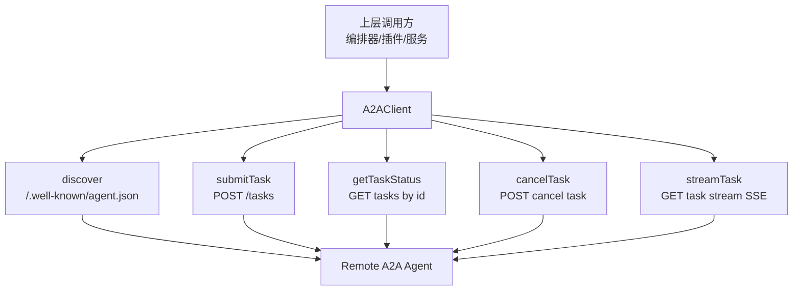
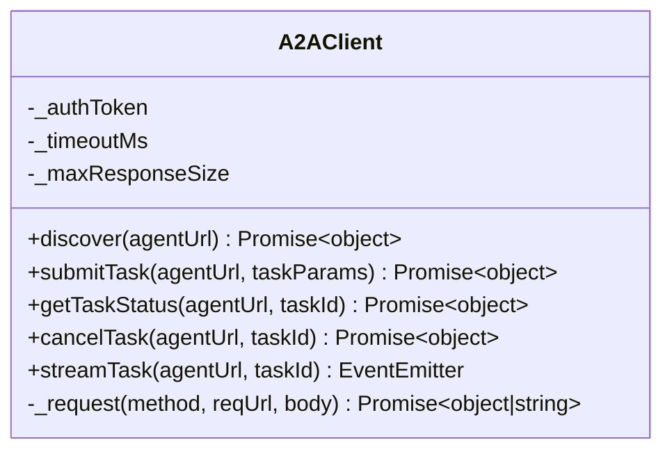
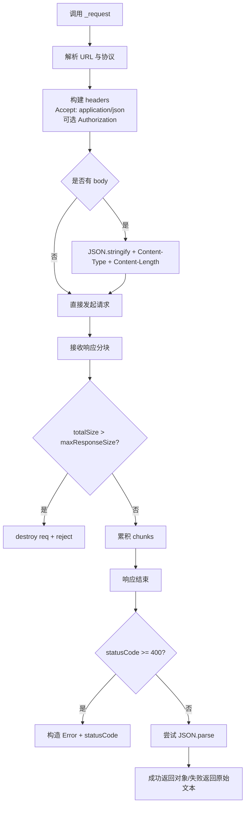
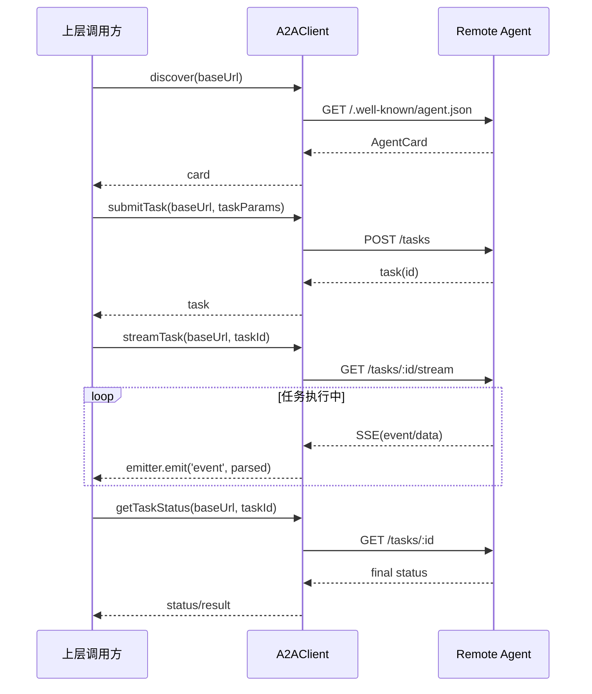

# remote_agent_client 模块文档

## 1. 模块定位与设计动机

`remote_agent_client` 对应 A2A 协议中的客户端实现，核心代码组件是 `src.protocols.a2a.client.A2AClient`。它的职责很明确：在本地系统中作为“远程 Agent 的统一入口”，完成远程 Agent 发现、任务提交、状态查询、任务取消以及基于 SSE 的任务流式订阅。

这个模块存在的原因，是把“跨进程/跨服务的 Agent 协作”从业务逻辑中剥离出来。上层调用方（例如编排层、策略层、插件或 SDK 适配层）不需要关心 Node.js 原生 `http/https` 细节、Header 拼接、超时处理、响应体大小保护、SSE 文本分帧等底层问题，只需要使用一组稳定 API 即可与外部 A2A Agent 通信。

从设计取舍看，`A2AClient` 采用了轻量实现：不依赖第三方 HTTP 库，也不引入复杂状态机。这样做的好处是依赖少、可移植性高、运行时行为可预测；代价是某些高级能力（自动重试、SSE 重连、更完整 SSE 规范支持）需要在调用方或扩展类中自行实现。

---

## 2. 在系统中的位置与关系

`remote_agent_client` 位于 `A2A Protocol` 子树下，和 Agent 描述、任务生命周期管理、SSE 事件流处理构成完整协议闭环。



上图体现了该模块的核心价值：它将远程 Agent 的多个 HTTP 端点抽象为一致的客户端方法。相比上层直接拼 URL 并调用 HTTP，这种封装更容易统一认证、超时与错误语义。

与其他 A2A 子模块的关系建议参考：
- Agent 卡片结构与发现语义：[`agent_discovery_card.md`](agent_discovery_card.md)
- 任务生命周期服务端视角：[`A2A Protocol - TaskManager.md`](A2A%20Protocol%20-%20TaskManager.md)
- SSE 服务端流定义：[`A2A Protocol - SSEStream.md`](A2A%20Protocol%20-%20SSEStream.md)

---

## 3. 核心组件：`A2AClient`

### 3.1 构造函数与配置

```javascript
new A2AClient(opts)
```

`opts` 参数：

- `authToken?: string`：可选 Bearer Token。若提供，所有请求自动附带 `Authorization: Bearer <token>`。
- `timeoutMs?: number`：请求超时（毫秒），默认 `30000`。
- `maxResponseSize?: number`：最大响应体字节数，默认 `10 * 1024 * 1024`（10MB）。

构造后内部保存为 `_authToken`、`_timeoutMs`、`_maxResponseSize`，由所有请求路径复用。这意味着建议在同一配置场景下复用同一个实例，而不是频繁新建。

### 3.2 对外方法总览



`A2AClient` 的公开方法都围绕“构造目标 URL + 调用统一请求逻辑（或 SSE 逻辑）”展开。这样设计使每个 API 的行为风格一致，利于排障和扩展。

---

## 4. 方法级深度解析

## 4.1 `discover(agentUrl)`

### 功能
读取远程 Agent 的标准发现文档：`/.well-known/agent.json`。

### 内部工作方式
方法会先把 `agentUrl` 末尾多余 `/` 去掉，再拼接固定路径后调用 `_request('GET', cardUrl)`。

### 参数与返回
- 参数：`agentUrl: string`
- 返回：`Promise<object>`（通常是 Agent Card JSON）

### 副作用与注意点
- 依赖远端是否遵循 A2A 发现约定。
- 若远端返回非 JSON，`_request` 会返回原始字符串，不会强制失败。

---

## 4.2 `submitTask(agentUrl, taskParams)`

### 功能
向远程 Agent 提交任务，默认请求端点为 `POST /tasks`。

### 内部工作方式
和 `discover` 一样先规范化 URL，然后调用 `_request('POST', taskUrl, taskParams)`。`_request` 会自动序列化 JSON 并注入 `Content-Type` 与 `Content-Length`。

### 参数与返回
- `agentUrl: string`
- `taskParams: object`（常见字段：`skill`, `input`, `metadata`）
- 返回：`Promise<object>`（任务创建结果）

### 副作用与注意点
- 该方法不做参数 schema 校验，错误主要由远端返回（4xx/5xx）。
- 远端错误会以 `Error('HTTP <status>: <body前200字符>')` 形式抛出，附带 `err.statusCode`。

---

## 4.3 `getTaskStatus(agentUrl, taskId)`

### 功能
查询远程任务状态，端点 `GET /tasks/:id`。

### 内部工作方式
`taskId` 会通过 `encodeURIComponent` 编码后放入路径，避免路径注入和特殊字符问题。

### 参数与返回
- `agentUrl: string`
- `taskId: string`
- 返回：`Promise<object>`（任务状态对象）

### 副作用与注意点
- 对不存在任务，通常远端返回 `404`，客户端会抛出带状态码错误。

---

## 4.4 `cancelTask(agentUrl, taskId)`

### 功能
取消远程任务，端点 `POST /tasks/:id/cancel`。

### 内部工作方式
同样进行 `taskId` 编码并调用 `_request`。

### 参数与返回
- `agentUrl: string`
- `taskId: string`
- 返回：`Promise<object>`（取消后的任务视图或操作结果）

### 副作用与注意点
- 语义幂等性由服务端决定；本模块不保证“重复取消”的统一返回格式。

---

## 4.5 `streamTask(agentUrl, taskId)`

### 功能
以 SSE 方式订阅任务更新，端点 `GET /tasks/:id/stream`。

### 内部工作方式
`streamTask` 不走 `_request`，而是单独建立 `GET` 长连接并返回 `EventEmitter`：
- 请求头固定包含 `Accept: text/event-stream`
- 若配置了 `authToken`，自动附带 Bearer 认证
- 仅当响应码为 `200` 才开始读取流
- 按 `\n\n` 分块进行 SSE 报文分帧
- 每个分帧交给 `_parseSSE`，解析后发出 `event` 事件
- 流结束发出 `end`，底层错误发出 `error`
- 对外提供 `emitter.abort()` 主动断连

### 返回值
`EventEmitter`，可能触发的事件：
- `event`: `{ event, data }`
- `error`: `Error`
- `end`: 无参数

### 典型使用
```javascript
const stream = client.streamTask(agentUrl, taskId);

stream.on('event', (evt) => {
  // evt.event 可能是 state/progress/output 等，取决于服务端定义
  console.log(evt.event, evt.data);
});

stream.on('error', (err) => {
  console.error('stream error:', err.message);
});

stream.on('end', () => {
  console.log('stream ended');
});

// 需要时主动取消
// stream.abort();
```

### 关键边界
当前实现是“最小 SSE 支持”，只解析 `event:` 与 `data:`，不处理 `id:`、`retry:`、注释行、跨多行 `data:` 合并，也不做断线自动重连。对复杂 SSE 场景需在外层增强。

---

## 5. 核心内部机制

## 5.1 `_request(method, reqUrl, body)`

这是非流式 API 的统一底层传输函数，负责以下行为：



该函数把“鉴权、超时、体积保护、错误映射”全部集中，确保各业务方法的传输语义一致。尤其 `maxResponseSize` 限制可避免异常大响应导致内存压力。

## 5.2 `_parseSSE(text)`

该辅助函数从单个 SSE 分帧文本中提取：
- `event: xxx`
- `data: yyy`

若不存在 `data`，返回 `null`；若 `data` 是 JSON 字符串，尝试解析为对象，否则保留原字符串。返回结构统一为：`{ event, data }`。

---

## 6. 端到端交互流程



该流程推荐用于长任务：先发现能力，再提交任务并以 SSE 监听进度，最后通过一次状态查询获取最终一致视图。

---

## 7. 配置建议与运行策略

在生产环境中，`timeoutMs` 和 `maxResponseSize` 需要按业务分层配置。实时控制场景可设较短超时，离线分析任务应设更长超时并优先使用 `streamTask`。`maxResponseSize` 不是越大越好；如果任务结果可能很大，建议让远端返回对象存储引用而非超大内联 JSON。

建议把 `A2AClient` 放在应用级单例或连接池管理范围内，统一管理认证令牌和网络策略。如果需要多租户隔离，按租户或凭证创建多个 client 实例，避免 token 串用。

示例：

```javascript
const client = new A2AClient({
  authToken: process.env.A2A_TOKEN,
  timeoutMs: 45_000,
  maxResponseSize: 5 * 1024 * 1024
});
```

---

## 8. 错误模型、边界条件与已知限制

## 8.1 错误模型

- 网络或 DNS 异常：`req.on('error')` 直接 reject。
- 请求超时：触发 `timeout` 后 `req.destroy()`，并 reject `Request timeout`。
- HTTP 错误：`statusCode >= 400` 时 reject，错误对象带 `statusCode`。
- 响应过大：超过 `maxResponseSize` 立即销毁请求并抛错。
- SSE 非 200：触发 `emitter.emit('error', Error('Stream failed with status ...'))`。

## 8.2 关键边界条件

- `agentUrl` 必须是合法 `http://` 或 `https://` URL；否则 `new URL()` 会抛异常。
- 末尾斜杠会被清理，避免 `//tasks` 这类路径问题。
- `taskId` 会 URL 编码；上层不必手动编码。
- 非 JSON 正常响应会以字符串返回，上层应做类型分支处理。

## 8.3 已知限制

- 无自动重试与退避。
- 无请求级取消（非 SSE 请求未暴露 abort API）。
- SSE 解析仅覆盖基础字段，不是完整规范实现。
- 无 SSE 自动重连与 Last-Event-ID 支持。
- 流式处理中以 `\n\n` 作为事件边界，面对某些非标准换行变体可能需要额外兼容层。

---

## 9. 扩展与二次封装建议

如果你要在企业场景中直接使用，通常会在 `A2AClient` 外包一层“可靠性适配器”：增加重试、熔断、指标埋点、日志脱敏、错误码标准化。由于 `A2AClient` 接口已经稳定，这层扩展实现成本较低。

一个常见实践是保留 `A2AClient` 作为“纯传输层”，在更上层建立领域服务：

```javascript
class ReliableRemoteAgentClient {
  constructor(a2aClient) {
    this.client = a2aClient;
  }

  async submitWithRetry(agentUrl, taskParams, retries = 3) {
    let lastErr;
    for (let i = 0; i < retries; i++) {
      try {
        return await this.client.submitTask(agentUrl, taskParams);
      } catch (e) {
        lastErr = e;
        if (e.statusCode && e.statusCode < 500) break; // 非瞬时错误不重试
        await new Promise(r => setTimeout(r, 300 * (i + 1)));
      }
    }
    throw lastErr;
  }
}
```

---

## 10. 与其他模块文档的衔接

为避免重复，以下主题建议直接阅读对应文档：

- A2A 发现文档（Agent Card 字段、能力描述）：[`agent_discovery_card.md`](agent_discovery_card.md)
- 服务端任务状态机与事件定义：[`A2A Protocol - TaskManager.md`](A2A%20Protocol%20-%20TaskManager.md)
- SSE 服务端发送模型与事件规范：[`A2A Protocol - SSEStream.md`](A2A%20Protocol%20-%20SSEStream.md)
- 若需和更广泛运行时/管理平面集成，可参考 API 与 Dashboard 文档入口：[`A2A Protocol.md`](A2A%20Protocol.md)、[`API Server & Services.md`](API%20Server%20&%20Services.md)

---

## 11. 最小可运行示例

```javascript
const { A2AClient } = require('../src/protocols/a2a/client');

async function run() {
  const agentUrl = 'https://agent.example.com';
  const client = new A2AClient({ authToken: process.env.A2A_TOKEN });

  const card = await client.discover(agentUrl);
  console.log('agent:', card.name);

  const task = await client.submitTask(agentUrl, {
    skill: 'summarize',
    input: { text: 'Long text...' },
    metadata: { source: 'demo' }
  });

  const stream = client.streamTask(agentUrl, task.id);
  stream.on('event', (e) => console.log('[event]', e.event, e.data));
  stream.on('error', (e) => console.error('[stream error]', e.message));

  const final = await client.getTaskStatus(agentUrl, task.id);
  console.log('final:', final);

  stream.abort();
}

run().catch(err => {
  console.error(err);
  process.exit(1);
});
```

这个示例展示了模块最核心的组合方式：发现 → 提交 → 订阅 → 查询收敛状态。对绝大多数远程 Agent 调用场景，这个模式已经足够。
