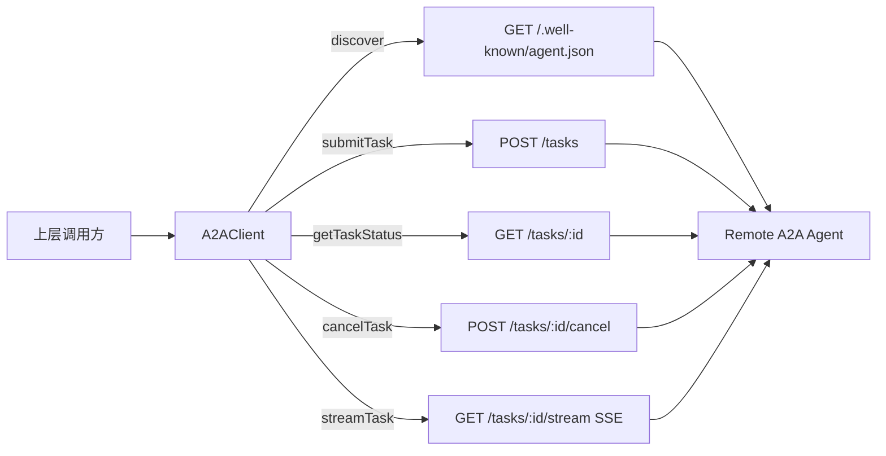

# remote_invocation_client 深度解析

`remote_invocation_client`（当前核心实现为 `src.protocols.a2a.client.A2AClient`）可以把它想成“远程 Agent 的统一拨号台”：上层只说“我要发现这个 Agent”“我要提交任务”“我要订阅任务进度”，它负责把这些意图翻译成稳定的 HTTP/SSE 调用、鉴权头、超时控制和错误语义。这个模块存在的关键原因是：如果每个调用方都自己拼 URL、自己处理超时和流解析，系统会很快出现行为分叉（有的地方会超时重试，有的不会；有的会解析 SSE，有的会漏事件），最终让跨 Agent 协作变得不可预测。

## 架构角色与数据流

从架构角色上看，`A2AClient` 是一个**协议网关型客户端**：它不做业务决策，不维护任务状态机，而是把“本地调用语义”映射为“远端 A2A HTTP 端点协议”。



这个图有两个重要信息。第一，除了 `streamTask`，其余调用都收敛到同一个内部 `_request()` 传输路径，因此鉴权、超时、响应大小限制、HTTP 错误处理都具备一致行为。第二，`streamTask` 单独走长连接路径，这不是“重复造轮子”，而是因为 SSE 与普通 request/response 在连接生命周期上本质不同：它不是一次性收包，而是持续接收事件帧。

## 1) 它到底解决了什么问题？

在 A2A 场景里，本地系统需要与外部 Agent 协作。一个朴素实现会是“哪里要调用远端就在哪里写 `http.request`”。短期看很快，长期会失控：

- URL 规范化不一致（`agentUrl` 末尾 `/` 处理不统一，容易出现双斜杠路径）。
- 认证注入分散（某些调用漏 `Authorization`）。
- 错误模型不统一（有的地方抛原始网络错误，有的地方吞掉状态码）。
- 内存风险不可控（大响应未限制，可能把进程拖垮）。
- SSE 解析到处复制粘贴（事件边界和 JSON 解析逻辑不一致）。

`A2AClient` 的设计意图就是把这些“跨调用点重复且容易出错的传输细节”集中在一个最小内核里。

## 2) 心智模型：把它当作“远程任务总线适配器”

理解这个模块最有效的方式是：**它不是 SDK 里的业务对象模型，而是一个薄而硬的 transport adapter**。

“薄”指它只做协议和传输层的必要工作，不做策略（不自动重试、不自动重连、不做 schema 校验）；“硬”指它对关键安全/稳定边界有明确兜底（超时、最大响应体、统一错误出口）。

可以用机场安检类比：

- 旅客（上层调用）只关心“我要登机”（提交任务/查询状态）。
- 安检通道（`A2AClient`）不决定你去哪，只负责按规则检查证件（auth header）、控制节奏（timeout）、拦截违禁物（超大响应）、并把信息标准化给后续系统（统一返回/错误）。

## 3) 关键操作的数据流（端到端）

### 发现远程 Agent：`discover(agentUrl)`

`discover()` 将 `agentUrl` 去除尾部斜杠后拼接 `/.well-known/agent.json`，再调用 `_request('GET', cardUrl)`。其价值不在“拼了一个路径”，而在于把发现请求纳入统一传输治理：同样吃到 `authToken`、`timeoutMs` 与 `maxResponseSize` 的约束。

### 提交任务：`submitTask(agentUrl, taskParams)`

`submitTask()` 调用 `_request('POST', taskUrl, taskParams)`。`_request()` 会在有 `body` 时执行 `JSON.stringify`，并补齐 `Content-Type` 与 `Content-Length`。这让调用方无需重复序列化细节，也减少“body 已经是字符串却再次编码”这类常见错误（当前实现隐含契约：传入的是对象而非预编码字符串）。

### 查询 / 取消：`getTaskStatus()` 与 `cancelTask()`

两者都对 `taskId` 使用 `encodeURIComponent`。这看似细节，实则是协议边界的防护：任务 ID 如果含有 `/`、`?` 等字符，未经编码会破坏路径语义，甚至触发错误路由。

### 流式订阅：`streamTask(agentUrl, taskId)`

这条路径返回 `EventEmitter` 而不是 `Promise`，因为调用语义不是“一次结果”，而是“持续事件”。内部流程是：

1. 发起 `GET /tasks/:id/stream`，`Accept: text/event-stream`。
2. 响应码非 `200`，立即 `emit('error')`。
3. 持续读取字节流，按 `\n\n` 分帧。
4. 每帧用 `_parseSSE()` 提取 `event:` 与 `data:`。
5. 产出标准事件：`emit('event', { event, data })`。
6. 连接结束发 `end`，网络问题发 `error`。
7. 暴露 `emitter.abort()`，允许调用方主动销毁请求。

这里的设计重点是“把流式复杂性压在客户端内部，但把生命周期控制权交给调用方（`abort`）”。

## 4) 组件深潜：`A2AClient` 与 `_parseSSE`

### `new A2AClient(opts)`

构造参数只有三个：`authToken`、`timeoutMs`（默认 `30000`）、`maxResponseSize`（默认 `10MB`）。这组参数揭示了模块关注点：认证、时延控制、内存上限。它没有引入 retry policy、proxy、TLS 高级配置等可变项，说明该模块刻意保持“低配置面”，避免成为一个庞杂网络框架。

### `_request(method, reqUrl, body)`

这是非流式路径的核心。它做了四件决定性的事：

1. 基于 `new url.URL(reqUrl)` 选择 `http` 或 `https`。
2. 统一 header 基线：`Accept: application/json`，可选 `Authorization`。
3. 流式累积响应时检查 `totalSize`，超过 `maxResponseSize` 立刻 `req.destroy()` 并 `reject`。
4. 结束时按状态码与内容作双分支：`statusCode >= 400` 抛错误（附 `err.statusCode`），否则尝试 `JSON.parse`，失败则返回原始文本。

第四点是很有意图的：它没有强制“成功响应必须是 JSON”，而是允许文本回落。这提升了兼容性（面对非严格实现的远端也可工作），代价是调用方要处理“返回值可能是 object 或 string”的类型分歧。

### `function _parseSSE(text)`

这是一个“最小可用”SSE 解析器，只识别 `event: ` 和 `data: ` 前缀，取最后一次出现值；有 `data` 才返回，且尝试 JSON 解析。它的目标不是完整实现 SSE 规范，而是覆盖当前 A2A 事件流最常见子集。

## 5) 依赖关系与契约分析

基于源码，`A2AClient` 的硬依赖是 Node.js 内建模块：`https`、`http`、`events`、`url`。这意味着它在运行时上几乎零外部包耦合，部署稳定性高。

在你提供的组件元数据里，`A2AClient` 标记了若干 external deps（如 `dashboard.frontend.src.api.on`、`mcp.server.emit`、`state.manager.get` 等），但这些符号**并未出现在当前源码文件的 import/require 或调用路径中**。因此，从代码可验证视角，不能把它们当作真实直接依赖；更可能是跨仓库图谱的弱关联或符号级统计噪声。

调用方契约方面，上游必须满足这些隐含前提：

- `agentUrl` 必须是合法绝对 URL（可被 `new URL()` 解析）。
- 远端 `/tasks` 与 `/.well-known/agent.json` 端点遵循约定。
- 对于 `streamTask`，调用方应消费 `error` 事件并在不再需要时调用 `abort()`，否则会保留活跃连接。

下游（远端 Agent）契约方面，本模块默认：

- 非 2xx 错误通过 HTTP 状态码表达。
- SSE 使用空行分隔事件块（`\n\n`）。
- 若返回 JSON，格式可被 `JSON.parse` 正常解析。

## 6) 关键设计取舍

这个模块的设计取舍非常鲜明：

它优先选择了**可预测的基础正确性**，而不是“功能齐全的客户端框架化”。例如没有自动重试和 SSE 自动重连，短期看少功能，长期看减少了隐式副作用：谁来重试、重试多少次、哪些状态码可重试，应由更高层结合业务幂等性决定。

它还选择了**最小依赖面**（只用 Node 内建库），牺牲了高级 HTTP 客户端生态能力（拦截器、连接池高级策略、开箱即用 observability）。这个取舍适合协议层核心组件：可移植、可审计、行为透明。

在类型处理上，它选择了**兼容性优先**（JSON parse 失败就返回字符串），而不是强类型严格性。这样对异构远端更友好，但会把一部分类型判别责任留给调用层。

## 7) 使用方式与实践建议

典型调用链如下：先 `discover`，再 `submitTask`，同时 `streamTask` 订阅进度，最后 `getTaskStatus` 收敛最终状态。

```javascript
const { A2AClient } = require('./src/protocols/a2a/client');

const client = new A2AClient({
  authToken: process.env.A2A_TOKEN,
  timeoutMs: 30000,
  maxResponseSize: 10 * 1024 * 1024,
});

async function run(agentUrl) {
  const card = await client.discover(agentUrl);
  const task = await client.submitTask(agentUrl, {
    skill: 'summarize',
    input: { text: '...' },
    metadata: { source: 'demo' },
  });

  const stream = client.streamTask(agentUrl, task.id);
  stream.on('event', (evt) => console.log(evt.event, evt.data));
  stream.on('error', (err) => console.error('stream error', err.message));
  stream.on('end', () => console.log('stream end'));

  const finalStatus = await client.getTaskStatus(agentUrl, task.id);
  stream.abort();
  return finalStatus;
}
```

如果要扩展，推荐在外层包一层“可靠性适配器”（重试、熔断、指标、日志），而不是直接把这些策略塞进 `A2AClient`。这样可以保持该模块作为稳定底座。

## 8) 新贡献者最该注意的边界与坑

第一，`_request()` 的返回并不保证总是对象，可能是字符串。任何上层在解构字段前都应做类型判断。

第二，`streamTask()` 的 SSE 解析是简化实现，不支持完整 SSE 语义（例如 `id:`、`retry:`、多行 `data:` 合并逻辑等）。如果未来接入更复杂 SSE 服务端，这里会是首要演进点。

第三，`maxResponseSize` 是按内存累计 chunks 做硬截断。它能防止内存爆炸，但也意味着合法大响应会被直接中断。对于大结果，建议远端返回引用而非内联大 payload。

第四，错误传播模型是“尽快失败”：HTTP `>=400` 直接 reject，且只截取前 200 字符错误体放入消息。这有助于避免巨量日志，但调试时可能需要结合服务端日志还原完整错误上下文。

第五，当前非流式请求没有对外暴露 abort 接口；如果你需要请求级取消能力，要么在外层封装超时/取消控制，要么扩展内部实现。

## 9) 与其他模块的关系（参考阅读）

为了理解完整 A2A 调用链，建议串联阅读以下文档（避免在本文件重复协议细节）：

- [A2A Protocol](A2A%20Protocol.md)
- [A2A Protocol - AgentCard](A2A%20Protocol%20-%20AgentCard.md)
- [A2A Protocol - TaskManager](A2A%20Protocol%20-%20TaskManager.md)
- [A2A Protocol - SSEStream](A2A%20Protocol%20-%20SSEStream.md)

如果你把 `remote_invocation_client` 放在更大系统中使用，也可对照：

- [MCP Protocol](MCP%20Protocol.md)
- [Policy Engine](Policy%20Engine.md)
