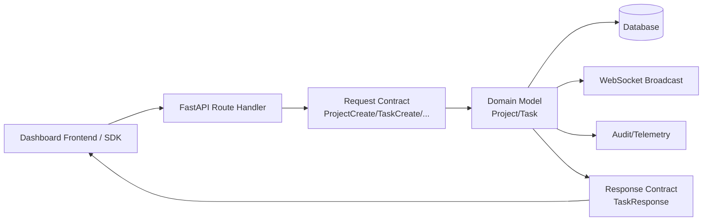
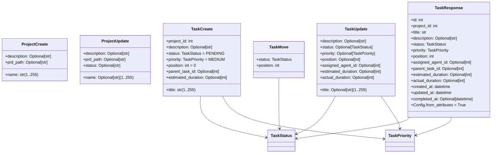
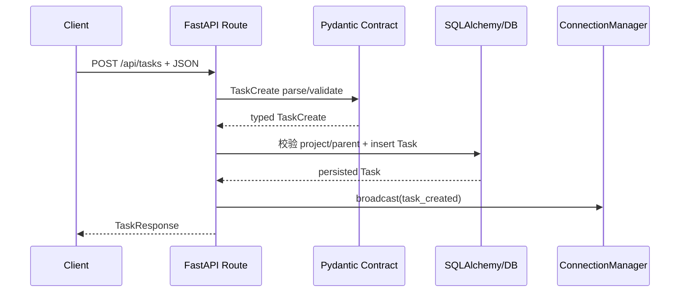

# request_response_contracts 模块文档

## 1. 模块概述与设计目标

`request_response_contracts` 模块对应 `dashboard.server` 中与任务/项目写接口最相关的一组 Pydantic 请求与响应模型：`TaskCreate`、`TaskUpdate`、`TaskMove`、`TaskResponse`、`ProjectCreate`、`ProjectUpdate`。它们是 Dashboard Backend API 的“契约层（contract layer）”，负责把 HTTP JSON 负载转换为结构化对象，并在进入业务逻辑前完成基础校验。

这个模块存在的核心原因是：在 API 边界上把“外部输入的不确定性”收敛成“内部可预测的数据形状”。如果没有这些契约，路由函数需要到处做类型检查、长度检查、可选字段处理，代码会变得脆弱且难维护。通过 Pydantic contract，服务端可以在请求进入业务逻辑前统一拒绝非法输入，从而提升错误可解释性、降低运行期异常、并让前后端接口演进更可控。

从系统分层上看，它位于 Dashboard Backend 的 `api_surface_and_transport` 与 `domain_models_and_persistence` 之间：向上贴近 FastAPI 路由，向下对齐 SQLAlchemy 模型和枚举。你可以把它理解为“面向 API 的输入输出 DTO（Data Transfer Object）层”。

---

## 2. 在整体系统中的位置



上图展示了该模块的边界作用：请求先被 contract 解析和校验，再进入数据库操作；响应通过 `TaskResponse` 等模型返回给调用方。这样 API 的稳定性不依赖于 ORM 内部细节。

更完整的传输层内容（例如 `ConnectionManager`、鉴权、限流、注册中心接口）请参考 [api_surface_and_transport.md](api_surface_and_transport.md)。与数据库实体及状态枚举的深度说明请参考 [domain_models_and_persistence.md](domain_models_and_persistence.md)。

---

## 3. 组件关系与契约职责



这些组件并不直接操作数据库，它们的职责是约束字段、声明默认值、并定义 API 可见的数据形态。真正的“业务校验”发生在路由层（例如 `create_task` 会检查 `project_id` 是否存在、`parent_task_id` 是否属于同项目）。

---

## 4. 逐个核心组件详解

## 4.1 `ProjectCreate`

`ProjectCreate` 用于 `POST /api/projects` 请求体。它定义了创建项目时允许客户端提交的数据：`name` 必填且长度 1~255；`description` 与 `prd_path` 可选。

`name` 的长度限制是第一道输入防线，主要避免空字符串和过长名称。注意它只做结构级校验，不负责“名称是否重复”之类语义校验（当前路由也未做唯一性约束，是否允许重名取决于数据库 schema 与业务策略）。

示例：

```json
{
  "name": "Payment Modernization",
  "description": "Migrate billing pipeline",
  "prd_path": "docs/prd/payment.md"
}
```

---

## 4.2 `ProjectUpdate`

`ProjectUpdate` 用于 `PUT /api/projects/{project_id}`。它是典型的“部分更新模型”：所有字段都可选，服务端通过 `model_dump(exclude_unset=True)` 仅提取客户端显式提供的字段并写入实体。

这种设计允许前端按需 patch，不必每次提交完整对象，也降低了并发编辑时误覆盖未修改字段的风险。`status` 被建模为 `Optional[str]`，而不是强枚举，这意味着它具备更高灵活性，但也更依赖上层业务约束避免非法状态值进入数据库。

---

## 4.3 `TaskCreate`

`TaskCreate` 用于 `POST /api/tasks`。它承载了任务创建时的最小且完整契约：

- `project_id` 是必填外键锚点；
- `title` 必填并限制 1~255；
- `status` 默认 `TaskStatus.PENDING`；
- `priority` 默认 `TaskPriority.MEDIUM`；
- `position` 默认 `0`；
- `parent_task_id` 支持任务层级；
- `estimated_duration` 支持工时估算。

其中 `status` 和 `priority` 绑定到 `dashboard.models.TaskStatus` / `TaskPriority` 枚举，确保输入值必须落在系统定义集合中（例如 `in_progress` 合法，`doing` 非法）。

需要强调的是：`TaskCreate` 只保证字段“长什么样”，不保证“引用是否合法”。例如 `project_id` 是否存在、`parent_task_id` 是否属于同项目，是路由函数内的二次业务校验逻辑。

---

## 4.4 `TaskUpdate`

`TaskUpdate` 用于 `PUT /api/tasks/{task_id}`，是任务实体的部分更新契约。它允许修改标题、描述、状态、优先级、排序位置、分配 agent、预计/实际耗时。

这个模型的关键价值在于“稀疏更新（sparse update）”：当调用方只传 `{"status": "done"}` 时，不会影响其他字段。配合路由层逻辑，状态变为 `DONE` 时会自动补写 `completed_at`。也就是说，`TaskUpdate` 与业务流程协作定义了任务生命周期状态变化的 API 行为。

---

## 4.5 `TaskMove`

`TaskMove` 用于 `POST /api/tasks/{task_id}/move`，语义是 Kanban 拖拽。相比 `TaskUpdate`，它是一个“意图更强”的专用契约：只接受 `status` 与 `position`。

这种专门模型能显式区分“通用属性更新”与“看板移动操作”，使后端更容易实现审计、广播和状态转换逻辑（比如从非 DONE 移入 DONE 时设置 `completed_at`，移出 DONE 时清空 `completed_at`）。

---

## 4.6 `TaskResponse`

`TaskResponse` 是任务查询与写操作回包使用的统一响应模型。它覆盖任务主字段与时间字段，并设置 `Config.from_attributes = True`，允许直接从 SQLAlchemy ORM 对象构建响应（如 `TaskResponse.model_validate(db_task)`）。

这保证了 API 输出结构稳定，不直接暴露 ORM 私有属性，也让 OpenAPI 文档自动生成准确 schema。对前端和 SDK 来说，`TaskResponse` 是最重要的“读取契约”，决定了列表、详情、看板渲染的数据基线。

---

## 5. 典型请求流与内部工作机制



这个流程体现了 contract 的核心价值：

1. 在进入数据库之前做结构校验；
2. 路由中叠加业务校验；
3. 输出由响应契约统一封装；
4. 同步触发实时广播供前端更新 UI。

---

## 6. 使用与扩展建议

在新增字段时，建议遵循“请求与响应分离演进”的策略：先在 `TaskCreate/TaskUpdate` 增加可选字段并保持向后兼容，再在 `TaskResponse` 输出该字段，最后由前端渐进消费。

示例（Python SDK/测试调用）：

```python
payload = {
    "project_id": 12,
    "title": "Implement retry strategy",
    "priority": "high",
    "status": "pending"
}
resp = client.post("/api/tasks", json=payload)
resp.raise_for_status()
print(resp.json()["id"])
```

看板移动示例：

```json
POST /api/tasks/42/move
{
  "status": "in_progress",
  "position": 3
}
```

如果你要扩展状态机（例如新增 `blocked`），必须同步修改：

1. `dashboard.models.TaskStatus` 枚举；
2. 本模块中所有引用 `TaskStatus` 的 contract；
3. 前端列映射与筛选逻辑（见 [Dashboard Frontend.md](Dashboard Frontend.md)）；
4. 依赖状态值的统计/聚合接口。

---

## 7. 边界条件、错误行为与已知限制

契约层常见错误是 Pydantic 422（字段缺失、类型不匹配、枚举非法、长度违规）。但以下问题不会由 contract 单独发现：

- `project_id` 指向不存在项目（由路由返回 404）；
- `parent_task_id` 跨项目引用（由路由返回 400）；
- `ProjectUpdate.status` 传入任意字符串（契约允许，需业务端约束）；
- 数值语义约束不足（如 `position`、`estimated_duration` 未声明 `ge=0`，可能出现负值）。

另外，`TaskUpdate` 与 `TaskMove` 都能改状态，若客户端混用两个端点，可能在审计和事件语义上产生不一致（`task_updated` vs `task_moved`）。实践上建议：属性编辑走 `TaskUpdate`，拖拽排序走 `TaskMove`。

---

## 8. 与其他模块文档的关联

为了避免重复，本文件只聚焦请求/响应契约。建议结合下列文档一起阅读：

- 传输层、认证、限流、WebSocket、基础路由行为：[`api_surface_and_transport.md`](api_surface_and_transport.md)
- ORM 实体、状态枚举、关系映射、持久化模型：[`domain_models_and_persistence.md`](domain_models_and_persistence.md)
- 运行/会话控制类请求体（如 `StartRequest`）：[`session_control_runtime.md`](session_control_runtime.md)
- API Key 与策略相关契约：[`api_key_and_policy_management.md`](api_key_and_policy_management.md)

这四份文档与本文共同组成 Dashboard Backend 合同层与服务层的完整认知闭环。
