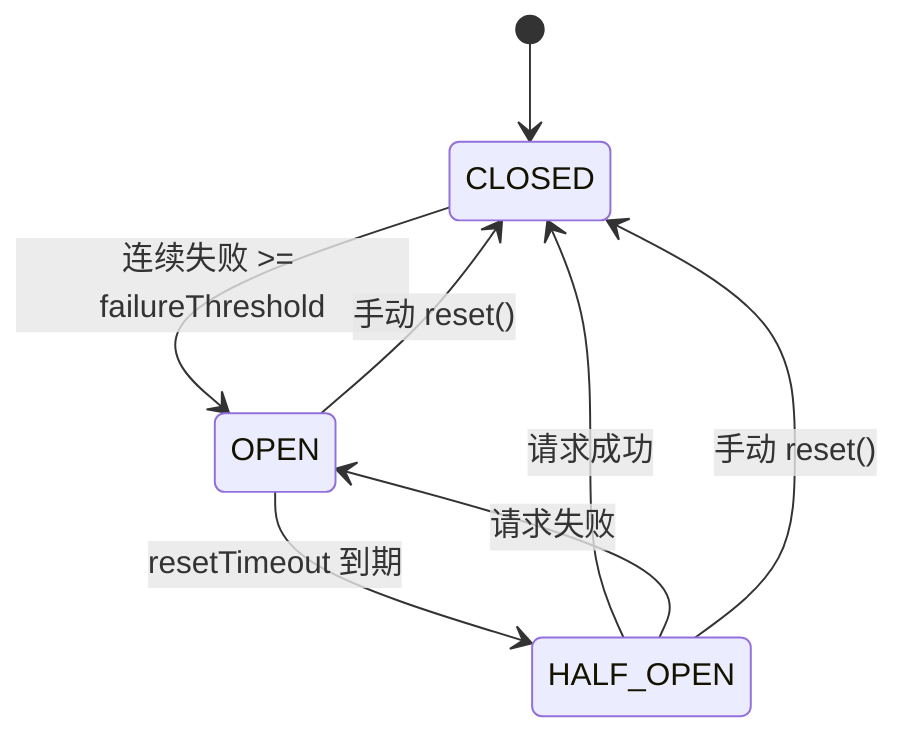

# resilience_control 模块文档

## 概述

`resilience_control` 模块是 MCP（Model Context Protocol）协议栈中的关键弹性控制组件，其核心功能是通过熔断器（Circuit Breaker）模式来保护系统免受不稳定或故障服务的影响。该模块位于 `src/protocols/mcp-circuit-breaker.js` 文件中，为 MCP 客户端连接提供自动化的故障检测、快速失败和恢复机制。

在分布式系统和微服务架构中，服务间的依赖关系错综复杂。当某个下游服务出现故障或响应缓慢时，如果上游服务继续不断地向其发送请求，不仅会导致资源浪费（如线程阻塞、连接池耗尽），还可能引发级联故障，最终导致整个系统崩溃。`resilience_control` 模块通过实现熔断器模式，有效解决了这一问题。

### 设计理念与核心价值

熔断器模式的设计灵感来源于电力系统中的保险丝。当电流过大时，保险丝会自动熔断，切断电路，防止设备损坏。类似地，当服务调用失败率达到一定阈值时，熔断器会"打开"，拒绝后续的请求，避免系统资源被无效消耗。经过一段预设的冷却时间后，熔断器会进入"半开"状态，允许少量请求通过以探测服务是否已恢复。如果探测成功，熔断器关闭，恢复正常调用；如果失败，则重新打开。

`resilience_control` 模块的核心价值体现在以下几个方面：

1. **系统稳定性保障**：防止因单个服务故障导致整个系统雪崩。
2. **资源保护**：避免线程、连接等宝贵资源被长时间占用在等待无响应的服务上。
3. **快速失败**：立即拒绝请求，减少用户等待时间，提升用户体验。
4. **自动恢复**：无需人工干预，系统能自动探测并恢复到正常状态。
5. **可观测性**：提供清晰的状态转换事件，便于监控和告警。

该模块与 MCP 协议栈中的其他组件紧密协作，特别是与 `MCPClient` 和 `MCPClientManager` 配合使用，为 MCP 服务器连接提供了强大的弹性保障。

## 核心组件详解

### CircuitBreaker 类

`CircuitBreaker` 类是 `resilience_control` 模块的唯一核心组件，它是一个基于 Node.js `EventEmitter` 的状态机，实现了完整的熔断器模式逻辑。

#### 状态机设计

`CircuitBreaker` 维护三种核心状态，这些状态定义在模块导出的 `STATE` 常量对象中：

- **`CLOSED`**: 正常操作状态。所有请求都正常通过熔断器执行。这是熔断器的初始状态。
- **`OPEN`**: 故障状态。当连续失败次数达到配置的阈值时，熔断器会打开。在此状态下，所有请求都会被立即拒绝，并抛出 `'CIRCUIT_OPEN'` 错误，而不会实际执行请求函数。
- **`HALF_OPEN`**: 恢复测试状态。当熔断器处于 `OPEN` 状态一段时间（由 `resetTimeout` 配置）后，会自动转换到此状态。在此状态下，只允许一个请求通过以测试服务是否已恢复。如果该请求成功，熔断器将关闭；如果失败，熔断器将重新打开。



#### 构造函数与配置

`CircuitBreaker` 的构造函数接受一个可选的配置对象，用于自定义熔断器的行为：

```javascript
const { CircuitBreaker } = require('src/protocols/mcp-circuit-breaker');

const breaker = new CircuitBreaker({
  failureThreshold: 5,    // 默认: 3
  resetTimeout: 60000     // 默认: 30000 (30秒)
});
```

- **`failureThreshold`** (number, default: 3): 触发熔断器打开所需的连续失败次数。这个值需要根据具体服务的稳定性和业务容忍度来设置。对于关键服务，可以设置较低的阈值（如2-3）以快速保护系统；对于非关键服务，可以设置较高的阈值以避免因偶发错误导致不必要的熔断。
  
- **`resetTimeout`** (number, default: 30000): 熔断器从 `OPEN` 状态自动转换到 `HALF_OPEN` 状态的等待时间（毫秒）。这个值应该考虑服务恢复所需的平均时间。如果设置得太短，可能会在服务尚未完全恢复时就进行探测，导致熔断器反复开关；如果设置得太长，则会延长系统的不可用时间。

#### 核心方法

##### `execute(fn)`

这是使用熔断器最主要的方法。它接受一个异步函数 `fn` 作为参数，并根据当前熔断器状态决定是否执行该函数。

- **当状态为 `CLOSED` 或 `HALF_OPEN` 时**：执行传入的函数 `fn`。
  - 如果 `fn` 成功返回，调用内部的 `_onSuccess()` 方法，重置失败计数。如果当前是 `HALF_OPEN` 状态，则转换到 `CLOSED` 状态。
  - 如果 `fn` 抛出异常，调用内部的 `_onFailure()` 方法，增加失败计数。如果当前是 `HALF_OPEN` 状态，则立即转换到 `OPEN` 状态；如果当前是 `CLOSED` 状态且失败计数达到阈值，则转换到 `OPEN` 状态。

- **当状态为 `OPEN` 时**：
  - 首先检查是否已经过了 `resetTimeout` 时间。如果是，则自动转换到 `HALF_OPEN` 状态，然后执行函数。
  - 如果还没到重置时间，则立即抛出一个带有 `code: 'CIRCUIT_OPEN'` 的错误，并触发 `'rejected'` 事件。

```javascript
try {
  const result = await breaker.execute(async () => {
    // 可能失败的操作，如 API 调用、数据库查询等
    return await riskyOperation();
  });
  console.log('操作成功:', result);
} catch (err) {
  if (err.code === 'CIRCUIT_OPEN') {
    console.log('熔断器已打开，请求被拒绝');
    // 可以在这里实现降级逻辑
  } else {
    console.log('操作失败:', err.message);
  }
}
```

##### `recordSuccess()` 和 `recordFailure()`

这两个方法提供了手动记录成功和失败的机制，适用于无法直接使用 `execute()` 方法的场景。例如，当你的操作逻辑比较复杂，或者你需要在多个地方分别记录结果时。

```javascript
// 自定义操作流程
let success = false;
try {
  await prepareOperation();
  await performOperation();
  await finalizeOperation();
  success = true;
} finally {
  if (success) {
    breaker.recordSuccess();
  } else {
    breaker.recordFailure();
  }
}
```

##### `reset()`

此方法用于手动将熔断器重置为 `CLOSED` 状态，并清零失败计数。这在以下场景非常有用：
- 管理员确认下游服务已经修复，希望立即恢复调用。
- 在测试环境中，需要重置熔断器状态以进行新一轮测试。

```javascript
// 手动重置熔断器
breaker.reset();
console.assert(breaker.state === 'CLOSED');
console.assert(breaker.failureCount === 0);
```

##### `destroy()`

这是一个重要的资源清理方法。它会清除内部的定时器（用于 `OPEN` 到 `HALF_OPEN` 的自动转换）并移除所有事件监听器。在应用程序关闭或不再需要熔断器实例时，务必调用此方法，以防止内存泄漏和阻止 Node.js 进程正常退出。

```javascript
// 应用关闭前清理
process.on('SIGINT', () => {
  breaker.destroy();
  process.exit(0);
});
```

#### 事件系统

`CircuitBreaker` 继承自 `EventEmitter`，会在状态发生改变时发出相应的事件，这对于监控和告警至关重要：

- **`'open'`**: 当熔断器转换到 `OPEN` 状态时触发。这是最关键的告警事件，表明服务出现了严重问题。
- **`'half-open'`**: 当熔断器转换到 `HALF_OPEN` 状态时触发。表明系统正在尝试自动恢复。
- **`'closed'`**: 当熔断器转换到 `CLOSED` 状态时触发。表明服务已恢复正常。
- **`'rejected'`**: 当请求因熔断器处于 `OPEN` 状态而被拒绝时触发。可用于统计被拒绝的请求数量。

```javascript
breaker.on('open', () => {
  console.error('🚨 熔断器已打开！服务可能已宕机。');
  // 发送告警通知到监控系统
  sendAlert('Circuit breaker opened for service X');
});

breaker.on('closed', () => {
  console.log('✅ 熔断器已关闭，服务恢复正常。');
  // 记录恢复时间，用于计算 MTTR (平均恢复时间)
  recordRecoveryTime();
});
```

## 与其他模块的集成

`resilience_control` 模块并非孤立存在，它深度集成于 MCP 协议栈中，为整个系统的弹性提供了基础支持。

### 与 MCPClientManager 的集成

`MCPClientManager` 是管理多个 MCP 客户端连接的核心组件。在其 `discoverTools` 和 `callTool` 方法中，`CircuitBreaker` 被用来包装对 `MCPClient` 的调用。

在 `MCPClientManager` 的初始化过程中，它会为每个配置的 MCP 服务器创建一个 `CircuitBreaker` 实例。当尝试连接服务器或调用工具时，这些操作都会通过对应的熔断器执行：

```javascript
// MCPClientManager 内部代码片段
var tools = await breaker.execute(function() { 
  return client.connect(); 
});

// ...

return breaker.execute(function() { 
  return client.callTool(toolName, args); 
});
```

这种集成方式确保了即使某个 MCP 服务器变得不稳定或无响应，也不会影响 `MCPClientManager` 管理的其他服务器，更不会导致整个应用崩溃。同时，`MCPClientManager` 还提供了 `getServerState` 方法，允许外部查询特定服务器的熔断器状态，这对于构建管理界面和监控面板非常有用。

### 与 Transport 层的关系

虽然 `CircuitBreaker` 主要作用于客户端调用层面，但它间接保护了底层的传输层（`SSETransport` 和 `StdioTransport`）。当熔断器打开时，它阻止了对 `MCPClient` 的调用，从而也避免了向底层传输层发送无效的请求。这减轻了传输层的压力，并防止了因大量无效请求导致的资源耗尽问题。

### 与 OAuthValidator 的协同

`OAuthValidator` 负责请求的身份验证和授权。虽然它不直接与 `CircuitBreaker` 交互，但两者共同构成了 MCP 服务的安全和弹性防线。`OAuthValidator` 确保只有合法的请求才能到达业务逻辑层，而 `CircuitBreaker` 则确保这些合法的请求不会因为下游服务的故障而拖垮整个系统。一个健壮的 MCP 服务应该同时具备这两层保护。

## 使用模式与最佳实践

### 基本使用模式

最简单的使用模式就是直接包装一个可能失败的异步操作：

```javascript
const apiBreaker = new CircuitBreaker({ 
  failureThreshold: 3, 
  resetTimeout: 10000 
});

async function fetchUserData(userId) {
  return apiBreaker.execute(() => 
    fetch(`/api/users/${userId}`).then(r => r.json())
  );
}
```

### 高级使用模式：封装服务类

为了更好地组织代码和复用逻辑，推荐将 `CircuitBreaker` 封装在一个服务类中：

```javascript
class ResilientService {
  constructor(name, options = {}) {
    this.name = name;
    this.breaker = new CircuitBreaker(options);
    this._setupListeners();
  }

  _setupListeners() {
    this.breaker.on('open', () => this._onOpen());
    this.breaker.on('closed', () => this._onClosed());
  }

  async call(operation) {
    try {
      return await this.breaker.execute(operation);
    } catch (err) {
      if (err.code === 'CIRCUIT_OPEN') {
        return this._getFallback(); // 降级处理
      }
      throw err; // 重新抛出原始错误
    }
  }

  _onOpen() {
    logError(`Service ${this.name} is down`);
    notifyTeam(`[${this.name}] Circuit breaker opened!`);
  }

  _onClosed() {
    logInfo(`Service ${this.name} is back online`);
  }

  _getFallback() {
    // 返回缓存数据、默认值或空结果
    return { error: 'Service temporarily unavailable' };
  }
}

// 使用
const userService = new ResilientService('user-api', { failureThreshold: 2 });
const user = await userService.call(() => fetchUser(id));
```

### 配置建议

- **`failureThreshold`**: 对于高可用性要求的服务，建议设置为 2-3。对于可以容忍更多失败的服务，可以设置为 5 或更高。
- **`resetTimeout`**: 应该大于服务的平均恢复时间。可以通过观察历史数据来确定。一个常见的起点是 30 秒（30000ms）。
- **不要对所有操作使用同一个熔断器**: 应该为不同的服务或操作类型创建独立的熔断器实例。这样，一个服务的故障不会影响到其他服务。

### 监控与告警

- **必须监听 `'open'` 事件**: 这是最重要的告警信号，应立即通知运维团队。
- **记录状态转换日志**: 详细记录每次状态转换的时间点，用于事后分析和优化配置。
- **暴露指标**: 将熔断器的状态、失败计数等信息暴露给 Prometheus 等监控系统，以便在仪表盘中可视化。

### 资源管理

- **始终调用 `destroy()`**: 在应用生命周期结束时，确保清理所有熔断器实例。
- **避免内存泄漏**: 不要创建大量短期存在的熔断器实例而不清理。

## 注意事项与限制

### 错误处理的粒度

`CircuitBreaker` 将所有抛出的异常都视为失败。这意味着即使是编程错误（如 `TypeError`）也会增加失败计数并可能导致熔断。在实际应用中，你可能需要在 `execute` 的回调函数内部进行更精细的错误处理，只对特定类型的错误（如网络超时、HTTP 5xx 错误）进行熔断，而让其他错误直接抛出。

```javascript
await breaker.execute(async () => {
  try {
    return await riskyOperation();
  } catch (err) {
    // 只有特定错误才被视为"失败"
    if (isTransientError(err)) {
      throw err; // 这会让熔断器记录失败
    } else {
      // 其他错误直接抛出，不影响熔断器状态
      throw new ApplicationError(err.message);
    }
  }
});
```

### 并发与 HALF_OPEN 状态

在 `HALF_OPEN` 状态下，理论上只应允许一个请求通过。然而，在高并发场景下，可能会有多个请求几乎同时到达，导致多个请求都被允许执行。当前的实现没有对此进行额外的同步控制。如果这是一个关键问题，可以在应用层添加一个请求队列或锁机制。

### 状态持久化

`CircuitBreaker` 的状态（包括失败计数和打开时间）仅存在于内存中。如果应用重启，所有状态都会丢失，熔断器会回到初始的 `CLOSED` 状态。对于需要跨重启保持状态的场景，需要自行实现状态持久化逻辑，例如将状态存储在 Redis 中。

### 与重试机制的结合

熔断器模式通常与重试机制结合使用，但需要注意顺序。正确的做法是**先重试，再熔断**。即，在单次请求内部进行有限次数的重试，如果仍然失败，则让熔断器记录这次"最终"的失败。如果反过来，先熔断再重试，可能会导致熔断器过早打开。

## 总结

`resilience_control` 模块通过 `CircuitBreaker` 类为 MCP 协议栈提供了至关重要的弹性能力。它不仅仅是一个简单的错误计数器，而是一个完整的状态机，能够智能地处理服务故障、保护系统资源并促进自动恢复。通过理解其工作原理、正确配置参数、遵循最佳实践并与监控系统集成，开发者可以显著提高其应用的可靠性和稳定性。在现代分布式系统中，这样的弹性控制机制已不再是可选项，而是必备的基础组件。