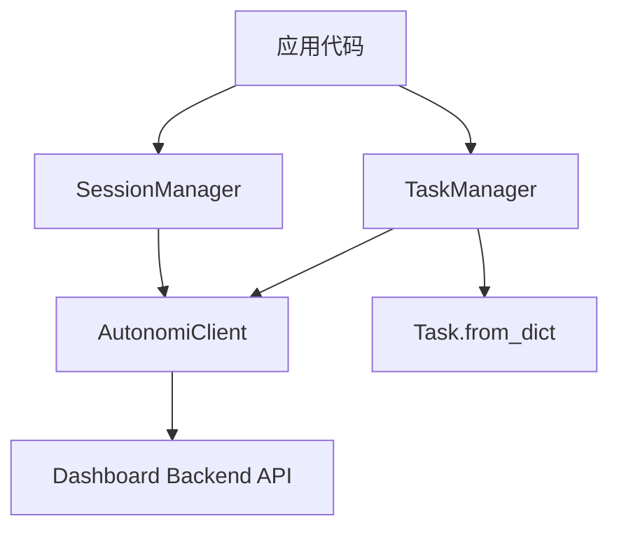
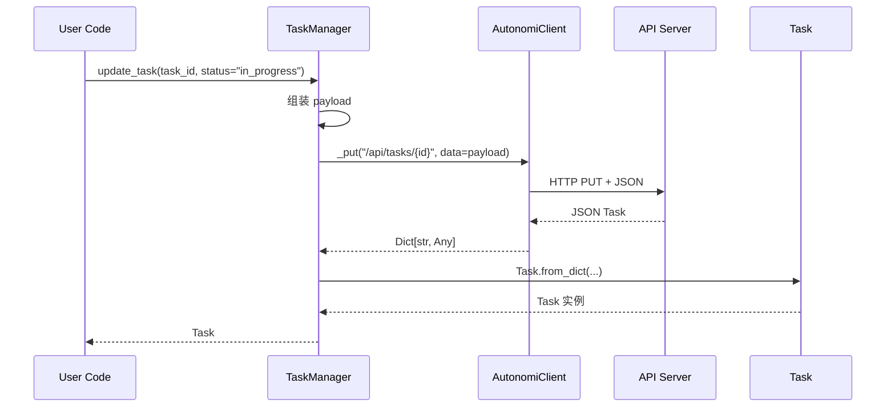
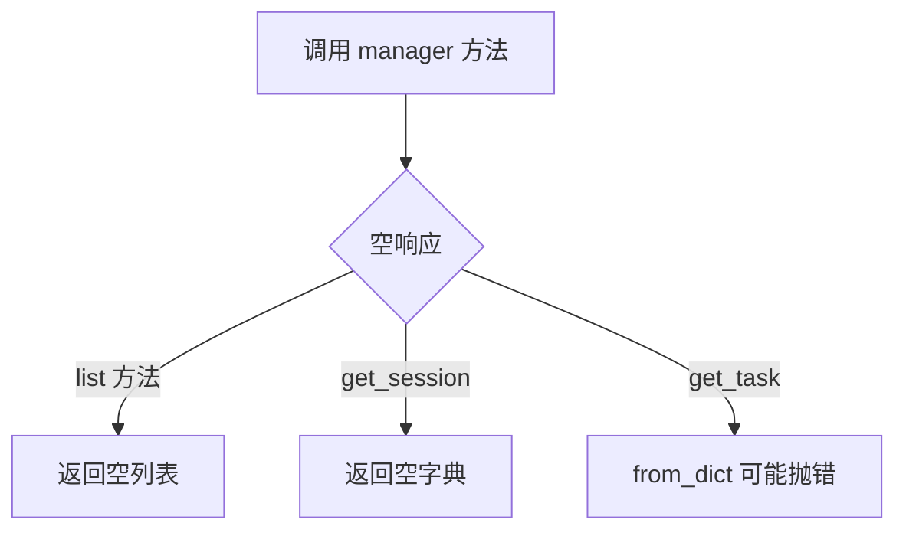
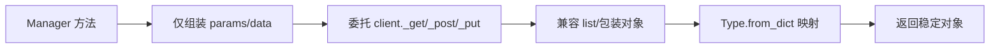

# resource_managers 模块文档

## 概述：模块作用、存在理由与设计取向

`sdk.python.loki_mode_sdk` 中的 `resource_managers` 子模块由两个核心组件组成：`TaskManager` 与 `SessionManager`。它们的职责不是实现新的业务规则，而是把底层 `AutonomiClient` 的通用 HTTP 能力，组织成面向资源域（task/session）的高可读接口。

这个模块存在的核心价值是减少调用方重复劳动。若没有它，开发者需要在业务代码中反复拼接 URL、管理 query/body、兼容不同响应形态（列表直返或 `{items_key: [...]}`）、再做字典到对象的转换。`resource_managers` 把这套样板逻辑下沉后，调用者可以围绕“我要做什么”编程，而不是围绕“我要怎么发请求”编程。

从架构分层看，它位于 Python SDK 的“资源操作层”：上接应用脚本、自动化服务、CI 作业，下接 `AutonomiClient`（传输与错误模型）和类型契约（`Task`）。它本身保持“薄封装”原则：不做本地缓存、不做重试队列、不做复杂状态机，重点是参数组织、响应归一化与类型映射。关于底层传输细节请参考 [core_client_transport.md](core_client_transport.md)，关于数据模型请参考 [Python SDK - 类型定义.md](Python SDK - 类型定义.md)。

---

## 模块架构与依赖关系



这张图展示了 `resource_managers` 的边界：两个管理器都只依赖同一个 `AutonomiClient` 实例，管理器之间没有耦合。`TaskManager` 返回强类型对象（`Task`），而 `SessionManager` 当前返回原始字典结构。这种“部分类型化”的设计通常意味着后端会话模型仍在演进，SDK 先保持兼容性优先。

---

## 端到端调用流程（以任务更新为例）



这个流程体现了职责切分：管理器负责“资源语义”和“请求参数最小化”，客户端负责“传输与异常”，类型类负责“数据反序列化”。因此排障时通常可按层定位：参数问题先看 manager、网络与状态码先看 client、字段缺失先看 `from_dict` 与后端契约。

---

## 核心组件详解

## 1) TaskManager

`TaskManager` 提供任务资源的常见 CRUD 子集（list/get/create/update）。它是本模块中类型化最完整的管理器，所有方法都返回 `Task` 或 `List[Task]`。

### 构造函数

```python
TaskManager(client: AutonomiClient)
```

构造时仅保存客户端引用，不触发网络请求，也不校验连通性。

### `list_tasks(project_id: Optional[str] = None, status: Optional[str] = None) -> List[Task]`

该方法调用 `GET /api/tasks`，并按传入参数构造 query string。内部行为有三个关键点：

- 只在参数非 `None` 时附加到查询参数，避免发送无意义字段。
- 兼容两种响应形态：直接列表 `[...]` 或包装对象 `{"tasks": [...]}`。
- 对每条记录执行 `Task.from_dict`，将字典转换为 SDK 类型对象。

若后端返回空体或 `None`，方法返回空列表 `[]`。

### `get_task(task_id: str) -> Task`

调用 `GET /api/tasks/{task_id}` 并直接映射为 `Task`。该方法**没有空值兜底**，如果返回结构缺失关键字段（例如 `id`），`Task.from_dict` 会触发异常。这种策略倾向“快速失败”，适合单资源精确查询场景。

### `create_task(project_id: str, title: str, description: Optional[str] = None, priority: str = "medium") -> Task`

调用 `POST /api/tasks`。请求体包含：

- 必填：`project_id`、`title`、`priority`
- 可选：`description`（仅在非 `None` 时发送）

注意该方法不会在客户端校验 `priority` 枚举合法性，非法值将由服务端拒绝并通过 `AutonomiClient` 抛出 HTTP 相关异常。

### `update_task(task_id: str, status: Optional[str] = None, priority: Optional[str] = None) -> Task`

调用 `PUT /api/tasks/{task_id}`。只发送显式提供的字段。若两个参数都为 `None`，会发送空对象 `{}`。这会带来一个语义边界：不同服务端版本可能把空更新视为 no-op，也可能返回校验错误。

### 典型示例

```python
from loki_mode_sdk.client import AutonomiClient
from loki_mode_sdk.tasks import TaskManager

client = AutonomiClient(base_url="http://localhost:57374", token="loki_xxx")
tasks = TaskManager(client)

# 创建任务
new_task = tasks.create_task(
    project_id="proj_001",
    title="Refactor scheduler",
    description="split stages",
    priority="high",
)

# 更新状态
updated = tasks.update_task(new_task.id, status="in_progress")

# 过滤查询
active = tasks.list_tasks(project_id="proj_001", status="in_progress")
print(len(active))
```

---

## 2) SessionManager

`SessionManager` 管理会话读取能力，目前提供“列表”和“详情”两个接口。与 `TaskManager` 不同，它返回原始字典结构，说明此处优先考虑后端结构兼容而非强类型约束。

### 构造函数

```python
SessionManager(client: AutonomiClient)
```

### `list_sessions(project_id: str) -> List[Dict[str, Any]]`

调用 `GET /api/projects/{project_id}/sessions`，并兼容：

- 直接返回列表 `[...]`
- 包装返回 `{"sessions": [...]}`

若响应为空，返回 `[]`。

### `get_session(session_id: str) -> Dict[str, Any]`

调用 `GET /api/sessions/{session_id}`。若响应为空，返回 `{}` 而不是抛错。

这个设计降低了调用方判空复杂度，但也可能掩盖后端异常空返回。因此在关键流程里建议校验 `id`、`status` 等关键字段。

### 典型示例

```python
from loki_mode_sdk.client import AutonomiClient
from loki_mode_sdk.sessions import SessionManager

client = AutonomiClient(token="loki_xxx")
sessions = SessionManager(client)

items = sessions.list_sessions("proj_001")
for s in items:
    print(s.get("id"), s.get("status"))

detail = sessions.get_session("sess_001")
if not detail.get("id"):
    print("session not found or empty response")
```

---

## 返回值、副作用与异常语义

`resource_managers` 的主要副作用是发起 HTTP 请求，并在 create/update 场景触发后端状态变化。它本身不维护本地缓存，因此每次调用都反映服务端当下状态。

异常方面，本模块几乎不拦截底层错误。`AutonomiClient` 在遇到 4xx/5xx 时会抛出映射异常（并尝试从响应体提取 `detail`/`message`）。因此你应在业务层统一捕获 SDK 异常，并依据 status code 做重试、降级或提示。

---

## 行为边界、坑点与限制



需要重点注意三个“非对称行为”：

1. 空值策略不一致：`list_*` 返回 `[]`，`get_session` 返回 `{}`，`get_task` 倾向直接失败。
2. 枚举值不在客户端校验：如 `priority`、`status` 不合法会在服务端失败。
3. 更新接口允许空 payload：当 `update_task(status=None, priority=None)` 时，可能被后端视为无效更新并返回 400。

---

## 配置与使用建议

本模块没有独立配置对象，行为主要由 `AutonomiClient` 决定：

- `base_url`：控制访问的 control plane 地址。
- `token`：控制鉴权上下文。
- `timeout`：影响每次 manager 调用的阻塞上限。

在工程实践中，建议全局复用一个 `AutonomiClient` 实例并注入多个 manager，以保持连接参数和认证一致。

```python
from loki_mode_sdk.client import AutonomiClient
from loki_mode_sdk.tasks import TaskManager
from loki_mode_sdk.sessions import SessionManager
from loki_mode_sdk.events import EventStream

client = AutonomiClient(base_url="https://api.example.com", token="loki_xxx", timeout=20)

tasks = TaskManager(client)
sessions = SessionManager(client)
events = EventStream(client)
```

---

## 可扩展性：如何新增一个 Resource Manager

当你要扩展 `resource_managers`（例如新增 `RunManager`）时，建议遵循现有模式：



这能确保 SDK 代码风格一致，便于测试与维护。尤其不要在 manager 层吞掉传输异常，否则上层将难以区分“业务空结果”和“请求失败”。

---

## 与其他模块文档的关系

为了避免重复，以下主题建议结合其他文档阅读：

- `AutonomiClient` 请求链路、认证、错误映射：见 [core_client_transport.md](core_client_transport.md)
- Python SDK 类型契约（`Task`、`RunEvent` 等）：见 [Python SDK - 类型定义.md](Python SDK - 类型定义.md)
- SDK 总体分层与模块地图：见 [Python SDK.md](Python SDK.md)
- 前端/WebSocket 实时机制（与轮询模式对比）：见 [api_client_and_realtime.md](api_client_and_realtime.md)

---

## 总结

`resource_managers` 是 Python SDK 的资源语义入口层。`TaskManager` 负责任务生命周期基础操作，`SessionManager` 提供会话读取接口，`EventStream` 提供运行事件轮询能力。它的设计关键词是“薄封装、低依赖、易组合”：通过最小规则把底层 HTTP 能力变成可直接使用的业务 API，同时把复杂性（传输错误、鉴权、超时）留在统一的 `AutonomiClient` 层处理。