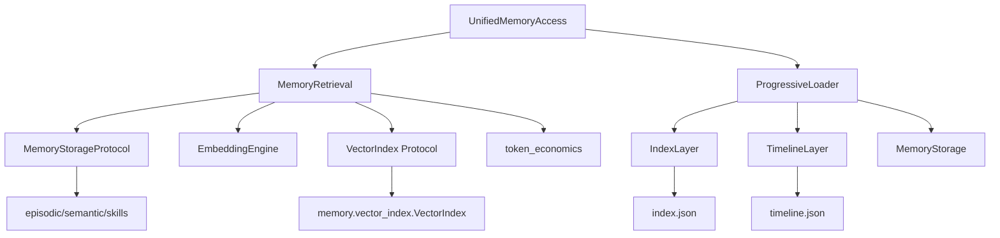
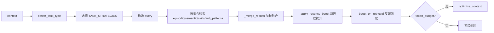
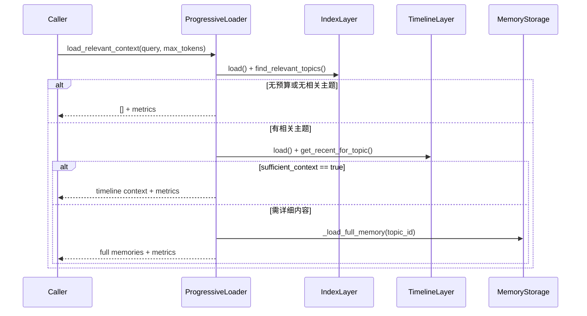

# retrieval_and_progressive_loading 模块文档

## 1. 模块定位与设计动机

`retrieval_and_progressive_loading` 是 Memory System 中连接“记忆检索质量”和“上下文成本控制”的关键模块。它由两部分组成：一部分是 `memory.retrieval` 中的任务感知检索能力（核心包括 `MemoryStorageProtocol`、`VectorIndex` 协议与 `MemoryRetrieval` 实现），另一部分是 `memory.layers.loader` 中的 `ProgressiveLoader` 三层渐进加载器。两者共同解决同一个系统级问题：**在有限 token 预算内，尽可能返回最相关、最可执行、且可解释的历史记忆**。

从架构上看，这个模块并不负责“生产记忆”（那是 `memory.engine.*` 的职责），而是负责“消费记忆”：按照任务上下文、命名空间边界、时间新鲜度、重要性以及成本预算，对已有记忆做检索、排序、裁剪和分层展开。它的存在，使得代理在复杂任务中不必每次都加载完整记忆库，也不必依赖单一检索策略。

如果你先前看过系统总览，建议将本文与 [Memory System.md](Memory System.md)、[Retrieval.md](Retrieval.md)、[Progressive Loader.md](Progressive Loader.md)、[Vector Index.md](Vector Index.md) 结合阅读：本文聚焦“检索 + 渐进加载”这一组合模块如何协同工作，而不是重复整个内存系统基础定义。

---

## 2. 在整体系统中的位置



这个关系图反映了一个重要事实：`MemoryRetrieval` 和 `ProgressiveLoader` 走的是两条互补路径。前者偏“检索与排序”（哪条记忆更相关），后者偏“信息分层展开”（先给摘要还是给全文）。在运行时，调用方可以只用其中一条，也可以组合使用。

---

## 3. 核心抽象与组件关系

### 3.1 `MemoryStorageProtocol`：存储后端契约

`MemoryStorageProtocol` 定义了检索层对存储层的最小能力要求。它要求实现端提供：

- `read_json(filepath)`：读取记忆文件。
- `list_files(subpath, pattern)`：按目录和通配规则列举记忆文件。
- `calculate_importance(memory, task_type)`：计算重要性分数（可选使用任务类型）。
- `boost_on_retrieval(memory, boost)`：命中后提升重要性，形成“use it or lose it”反馈。

这意味着检索模块不与具体文件系统、数据库实现强绑定。你可以替换为本地文件、对象存储或数据库驱动，只要协议兼容即可。

### 3.2 `VectorIndex`（Protocol）：向量检索后端契约

在 `memory.retrieval` 中，`VectorIndex` 是协议而非具体实现。它要求支持 `add/search/remove/save/load`。这样设计允许你接入不同向量引擎：

- 内置 `memory.vector_index.VectorIndex`（numpy，本地轻量）；
- 第三方向量库（如 FAISS/Qdrant/Pinecone）的适配器。

检索层只关心行为，不关心底层实现细节。

### 3.3 `ProgressiveLoader`：分层披露执行器

`ProgressiveLoader` 将记忆上下文分为三层：

1. `Layer 1`：`IndexLayer` 的主题索引（低成本概览）；
2. `Layer 2`：`TimelineLayer` 的近期行动/决策（中等成本上下文）；
3. `Layer 3`：完整 episode/pattern/skill（高成本细节）。

它通过预算和充足性判断控制是否进入下一层，避免在多数请求上过度加载全文记忆。

---

## 4. `memory.retrieval` 详解

> 说明：文件中的“核心组件”标注为 `VectorIndex` 与 `MemoryStorageProtocol`，但真实业务主类是 `MemoryRetrieval`。下面按实际调用价值展开。

### 4.1 任务感知策略：`TASK_STRATEGIES` 与 `TASK_SIGNALS`

模块预置了五类任务策略：`exploration`、`implementation`、`debugging`、`review`、`refactoring`。每类策略都会对四类记忆集合分配权重：`episodic`、`semantic`、`skills`、`anti_patterns`。

`detect_task_type(context)` 的判定依据是三组信号：

- `goal` 中的关键词（权重 2）；
- `action_type` 中的动作信号（权重 3）；
- `phase` 中的阶段信号（权重 4，最强）。

如果完全无匹配，会回退到 `implementation`。这是一种保守默认值，适合“多数任务最终落到实现动作”的场景。

### 4.2 主入口：`retrieve_task_aware(context, top_k, token_budget)`

这是最常用入口，内部流程可以概括为：



关键行为要点：

- 每个参与集合会先取 `top_k * 2`，给后续融合留出重排空间。
- `_score_result` 将 `base_score * task_weight * importance_factor * confidence` 组合，重要性通过 `0.7 + 0.3*importance` 注入。
- `_apply_recency_boost` 对 30 天内条目做线性加分。
- 若存储实现支持 `boost_on_retrieval`，Top 结果会被轻微加权提升，形成长期强化信号。

### 4.3 多检索模态与回退路径

`retrieve_by_similarity` 在满足“有 embedding engine + 有该 collection 的 vector index”时走向量检索，否则自动回退到关键词检索。这个双轨设计保证了：

- 高质量环境可用语义相似度；
- 降级环境仍可工作，不因缺少向量基础设施而不可用。

关键词检索分 collection 有差异化规则，例如 `skills` 对 `name` 的匹配分更高，`semantic` 会受 `confidence` 影响，`anti_patterns` 偏重 `what_fails` 字段。

### 4.4 命名空间检索：隔离、继承与跨域

`MemoryRetrieval` 支持三种命名空间工作模式：

- `with_namespace(ns)`：创建同配置的新检索实例，切换逻辑命名空间；
- `retrieve_cross_namespace(...)`：跨多个命名空间检索并合并，非当前命名空间默认分数乘 `0.9`；
- `retrieve_with_inheritance(...)`：沿继承链（当前 -> 父 -> global）检索。

这使知识既可项目隔离，也可被父域复用，适合多仓库/多租户共享经验。

### 4.5 时间检索与全域搜索

- `retrieve_by_temporal(since, until)`：跨集合按时间过滤，episode 从日期目录扫描，semantic 按 `last_used` 过滤。
- `search_all_namespaces(query)`：枚举所有 namespace 做关键词搜索，适合迁移或全局排查。

### 4.6 预算检索：`retrieve_with_budget`

该方法提供两种模式：

- `progressive=False`：先广泛检索，再 `optimize_context` 压缩进预算；
- `progressive=True`：调用 `_progressive_retrieve`，按层构建上下文（索引/摘要/详情）。

返回结构统一为：

```python
{
  "memories": [...],
  "metrics": {...},
  "task_type": "..."
}
```

### 4.7 索引生命周期：`build_indices/save_indices/load_indices`

`build_indices` 会按 collection 读取存储内容、生成 embedding 并写入对应向量索引。`save_indices/load_indices` 则负责持久化。注意实现中对路径解析使用了“能力探测”方式（`hasattr(self.storage, '_resolve_path')`），以适应具备 namespace 路径重写能力的存储实现。

---

## 5. `memory.layers.loader.ProgressiveLoader` 详解

### 5.1 `TokenMetrics`

`TokenMetrics` 是一个轻量统计对象，记录三层 token 使用并通过 `calculate_savings(total_available)` 计算节省率。它是调优预算阈值、分析成本收益的重要观测面。

### 5.2 主流程：`load_relevant_context(query, max_tokens)`



这一流程的核心不是“总是返回最多内容”，而是“在足够回答问题时尽早停止”。`sufficient_context` 当前采用启发式规则：有 3 条以上上下文通常视为足够；若 query 带有 `exactly/details/full/...` 等细节词，则倾向继续加载全文。

### 5.3 与 `IndexLayer` / `TimelineLayer` 的关系

`ProgressiveLoader` 依赖：

- `IndexLayer.find_relevant_topics`：通过 topic summary + relevance_score 做第一轮筛选；
- `TimelineLayer.get_recent_for_topic`：拉取特定 topic 的近期 action/decision；
- `_load_full_memory`：必要时回源 `MemoryStorage.load_episode/load_pattern/load_skill`。

因此它是“层控制器”，不自建语义索引，也不直接负责向量检索。

---

## 6. 关键数据流与评分机制

### 6.1 检索评分合成

最终排序不是单一 `_score`，而是多因素乘积：相关性、任务权重、重要性、置信度，以及可选的新近度提升。随后还可能被 `optimize_context` 二次重排（importance/recency/relevance 加权 + layer 偏好）。

这类“先召回后重排再预算裁剪”的结构，与搜索系统常见的 multi-stage retrieval 类似，优势是能平衡召回率和成本。

### 6.2 渐进层优先级

在 `optimize_context` 中默认偏好层级为 `Layer1 > Layer2 > Layer3`（boost 分别约 `1.1/1.0/0.9`）。这解释了为什么即便全文很相关，也可能因为预算被摘要层挤出：这是有意的 token-first 策略。

---

## 7. 配置、使用与扩展示例

### 7.1 基础使用：任务感知检索

```python
from memory.retrieval import MemoryRetrieval
from memory.storage import MemoryStorage
from memory.vector_index import VectorIndex

storage = MemoryStorage(".loki/memory")
retrieval = MemoryRetrieval(
    storage=storage,
    embedding_engine=None,  # 无 embedding 时自动回退关键词检索
    vector_indices={
        "episodic": VectorIndex(dimension=384),
        "semantic": VectorIndex(dimension=384),
        "skills": VectorIndex(dimension=384),
    },
    namespace="project-a",
)

context = {
    "goal": "fix failing tests in auth flow",
    "phase": "debugging",
    "action_type": "run_test",
}

results = retrieval.retrieve_task_aware(context, top_k=5, token_budget=1200)
```

### 7.2 渐进加载使用

```python
from memory.layers.index_layer import IndexLayer
from memory.layers.timeline_layer import TimelineLayer
from memory.layers.loader import ProgressiveLoader

loader = ProgressiveLoader(
    base_path=".loki/memory",
    index_layer=IndexLayer(".loki/memory"),
    timeline_layer=TimelineLayer(".loki/memory"),
)

memories, metrics = loader.load_relevant_context(
    query="why did we change retry policy last week",
    max_tokens=1500,
)

print(metrics.total_tokens, metrics.estimated_savings_percent)
```

### 7.3 扩展点建议

若你要扩展该模块，优先考虑这些稳定扩展点：

- 实现自定义 `MemoryStorageProtocol`，接数据库或对象存储；
- 实现自定义 `VectorIndex` 适配器接外部向量服务；
- 调整 `TASK_SIGNALS/TASK_STRATEGIES` 以适配你的任务域；
- 覆盖 `sufficient_context` 启发式，使其更贴合业务查询语言。

---

## 8. 边界条件、错误处理与限制

### 8.1 常见边界与降级行为

- 无 `embedding_engine` 或无对应 index：自动回退关键词检索。
- 索引文件不存在：`load_indices` 静默跳过。
- 时间戳格式异常：在时间过滤或 recency 计算中被忽略，不会中断检索。
- `NamespaceManager` 不可导入：继承检索回退为当前 + 可选 global。

### 8.2 需要特别注意的实现细节

- `retrieve_task_aware` 中“提升重要性”是副作用（会写回存储语义），这会影响后续排序。
- `retrieve_cross_namespace` 会就地给结果字典加 `_namespace`，并可能修改 `_weighted_score`。
- `save_indices/load_indices` 依赖底层 index 的文件格式约定（例如 `.npz` + `.json` sidecar）。
- `ProgressiveLoader` 的 `sufficient_context` 是启发式而非语义理解，可能误判“看似足够但细节不足”的请求。

### 8.3 已知限制

- 任务类型检测主要依赖英文关键词信号，跨语言场景准确率有限。
- 关键词检索是 substring/简单打分，不具备高级语义消歧能力。
- 渐进加载的层预算比例（如 20%/40%）是经验值，不一定适合所有业务。

---

## 9. 维护与调优建议

建议把调优分两步做：先调“召回质量”，再调“预算效率”。

第一步关注 `TASK_SIGNALS`、`TASK_STRATEGIES`、向量模型维度和索引覆盖率，目标是提高 top-k 命中率；第二步关注 `token_budget`、`sufficient_context` 阈值、`optimize_context` 的三项权重，目标是提高“单位 token 的有效信息密度”。

如果你在生产环境落地，建议额外采集这些指标：任务类型识别分布、各集合命中率、层级展开比例、平均节省率、最终答复质量与 token 使用的相关性。这样可以形成闭环，持续校正策略。

---

## 10. 参考文档

- [Memory System.md](Memory System.md)
- [Retrieval.md](Retrieval.md)
- [Progressive Loader.md](Progressive Loader.md)
- [Vector Index.md](Vector Index.md)
- [Unified Access.md](Unified Access.md)
