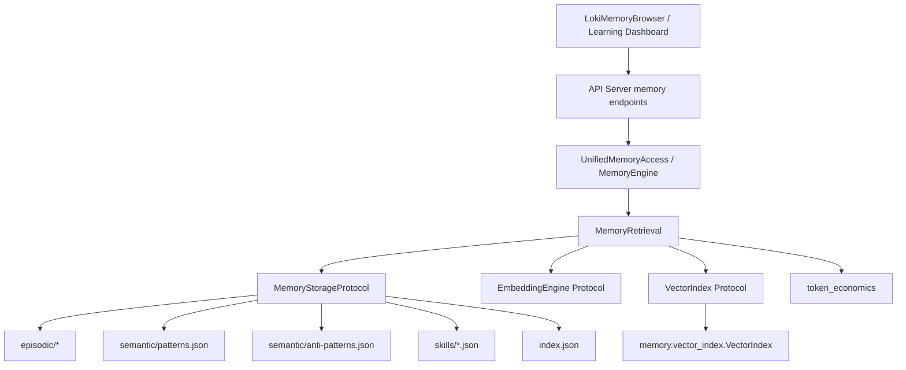
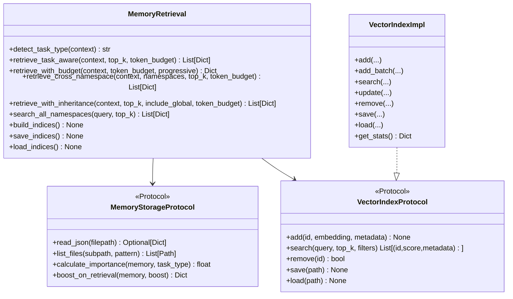
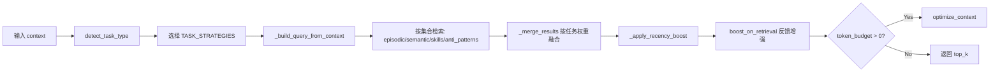
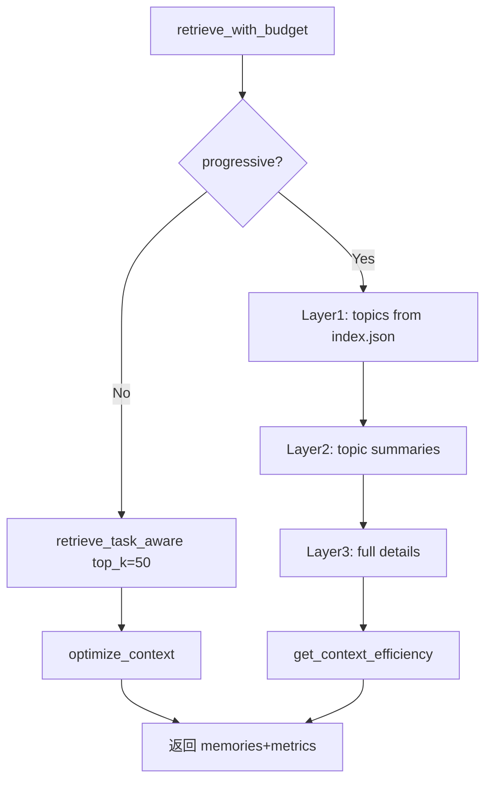
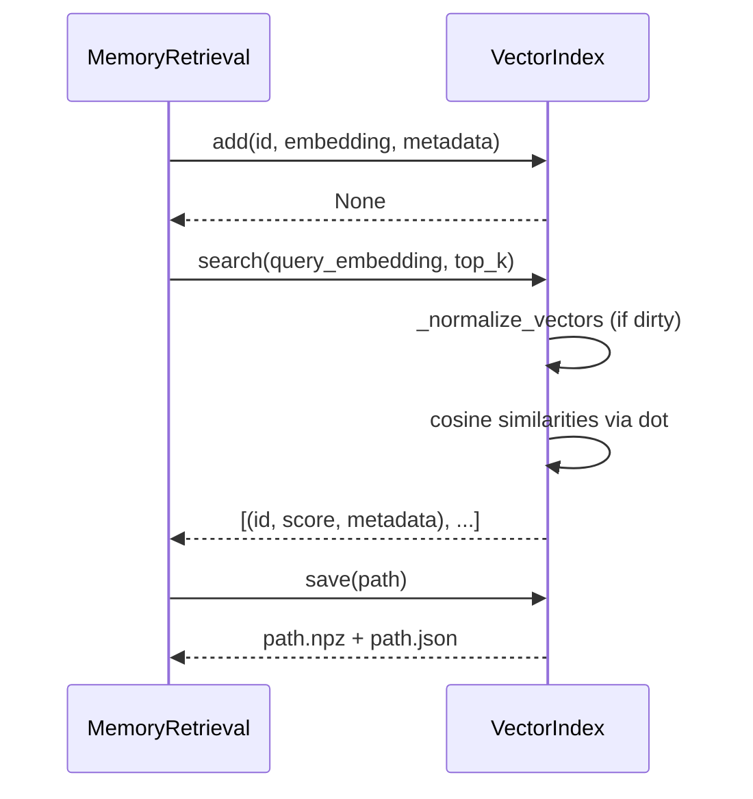

# retrieval_and_vector_indexing 模块文档

## 引言：模块职责、存在原因与设计取舍

`retrieval_and_vector_indexing` 是 Memory System 中负责“把历史记忆变成可用上下文”的核心检索子模块，覆盖两个关键实现面：

- `memory.retrieval`：任务感知检索编排（task-aware retrieval orchestration）
- `memory.vector_index`：本地轻量向量索引（numpy-based vector index）

该模块存在的直接原因是：内存系统中的记忆（episodic / semantic / skills / anti-patterns）体量会持续增长，如果每次都全量加载，不仅 token 成本不可控，而且会引入大量与当前任务无关的信息噪声。`MemoryRetrieval` 通过任务类型检测、集合加权、相关性融合、时效性加权与 token 预算裁剪，将“可检索”转化为“可执行上下文”。

从设计上看，本模块采用了典型的“策略编排 + 抽象协议 + 可替换后端”模式。`memory.retrieval` 不直接绑定某个向量库或某种存储，而是依赖 `MemoryStorageProtocol` 与 `VectorIndex` 协议；`memory.vector_index.VectorIndex` 则提供默认实现（纯 numpy、无 FAISS 依赖），确保在最小依赖环境下仍可运行。这样的设计让系统在本地开发、离线环境与生产扩展场景之间都能平衡。

如果你希望先了解 Memory System 全貌，建议先阅读 [Memory System.md](Memory System.md)；若你关心 embedding/切块细节，请参考 [embedding_and_vector_infra.md](embedding_and_vector_infra.md)；若需要已有检索总览，可对照 [Retrieval.md](Retrieval.md) 与 [Vector Index.md](Vector Index.md)。本文不重复这些文档的通用部分，而聚焦当前模块的内部机制与可扩展点。

---

## 1. 在整体系统中的架构位置



在系统分层上，这个模块位于“记忆数据层”与“上层应用层（API/Dashboard/SDK）”之间。它向上提供可消费的结果集合（带评分、来源、命名空间、层级等元信息），向下依赖存储和向量检索能力。也就是说，它不是一个单纯“查数据库”的模块，而是一个检索决策层。

---

## 2. 核心组件总览与关系



这个关系图展示了一个关键事实：`MemoryRetrieval` 使用的是“能力接口”，而不是“固定实现”。因此你可以替换存储实现、替换向量后端，甚至并行接入多个 collection 的不同索引实现，而无需修改检索编排逻辑。

---

## 3. `memory.retrieval` 深入说明

> 文件中的核心组件标注是 `VectorIndex`（协议）和 `MemoryStorageProtocol`（协议），但业务入口实际上是 `MemoryRetrieval`。本节按实际调用路径展开。

### 3.1 协议层：`MemoryStorageProtocol`

`MemoryStorageProtocol` 规定了检索层要求的最小存储能力。`read_json` 与 `list_files` 解决基础 I/O，`calculate_importance` 与 `boost_on_retrieval` 则把“记忆价值演化”交给存储层实现。这种分工避免了检索层硬编码重要性模型。

参数和返回行为上，`read_json(filepath)` 允许返回 `None`，这意味着上层必须容忍文件缺失或数据不可读；`boost_on_retrieval(memory, boost)` 返回更新后的 memory（或同结构对象），便于调用方后续写回或复用。

### 3.2 协议层：`VectorIndex`（在 retrieval.py 中）

`memory.retrieval.VectorIndex` 是一个协议，不是具体类。它只定义向量索引最小行为：`add/search/remove/save/load`。其中 `search` 返回 `(id, score, metadata)` 三元组列表；`filters` 参数在协议中预留给后端过滤逻辑，但默认 `memory.vector_index.VectorIndex` 实现使用的是 `filter_fn` 风格（语义略有差异，见“兼容性注意事项”章节）。

### 3.3 任务策略与自动任务识别

`TASK_STRATEGIES` 内置 5 种策略，分别为 `exploration / implementation / debugging / review / refactoring`。每种策略都定义了四类记忆源权重：

- `episodic`
- `semantic`
- `skills`
- `anti_patterns`

`detect_task_type(context)` 会从 `goal`、`action_type`、`phase` 三个字段打分：关键词权重 2、动作权重 3、阶段权重 4。若没有任何命中，默认回退 `implementation`。这个默认值反映了“工程任务大多数最终落地为实现动作”的设计假设。

### 3.4 主检索入口：`retrieve_task_aware`

`retrieve_task_aware(context, top_k=5, token_budget=None)` 的处理流程如下：



关键点在于它并非“一次检索一次返回”，而是先放大召回、再融合重排、最后按预算压缩。每个 collection 通常先取 `top_k * 2`，这样在融合阶段不会因为早期截断而错失跨集合高价值条目。

### 3.5 检索模式：向量相似度与关键词回退

`retrieve_by_similarity(query, collection, top_k)` 仅在“有 `embedding_engine` 且该 collection 存在索引”时生效，否则自动回退 `retrieve_by_keyword`。这个降级链非常关键：它保证即使 embedding 服务不可用，系统仍能以关键词模式提供基本可用性。

关键词路径在不同集合有定制评分规则。例如：

- episodic 更看重 `context.goal`，`phase` 次之
- semantic 会把 `confidence` 乘入分数
- skills 对 `name` 的匹配权重大于 `description`
- anti-patterns 对 `what_fails` 权重更高

### 3.6 排序机制：相关性、重要性、置信度、时效性

`_score_result` 的核心公式可概括为：

```text
weighted_score = base_score * task_weight * (0.7 + 0.3*importance) * confidence
```

这意味着重要性并不会完全主导排序，而是以 30% 可变因子参与。随后 `_apply_recency_boost` 还会对 30 天内条目施加线性提升（默认最高 10%）。因此最终结果是“多因素叠加排序”，而不是单一向量相似度排序。

### 3.7 命名空间能力：隔离、继承、跨域

模块支持三种命名空间检索模式：

- `with_namespace(namespace)`：创建新实例并切换命名空间
- `retrieve_cross_namespace(context, namespaces, ...)`：跨指定 namespaces 合并结果；非当前命名空间默认打 0.9 折
- `retrieve_with_inheritance(context, ...)`：沿继承链检索（当前 -> 父级 -> global）

这使模块既能满足项目隔离，也能支持经验复用和跨项目迁移。

### 3.8 时间窗口检索与全命名空间搜索

`retrieve_by_temporal(since, until)` 通过目录日期（episodic）和 `last_used`（semantic）双路径过滤，适合“回看某个阶段发生了什么”。`search_all_namespaces(query, top_k)` 则偏全局探索/迁移场景。

### 3.9 Token 预算优化与渐进检索

`retrieve_with_budget(context, token_budget, progressive=True)` 提供两种模式：

- `progressive=False`：先取较大量结果，再 `optimize_context` 裁剪
- `progressive=True`：走 `_progressive_retrieve`，按 Layer1/2/3 渐进加载



这一路径与 `memory.layers.loader.ProgressiveLoader` 在思路上相近，但实现位置不同。若你需要 Loader 细节，参见 [retrieval_and_progressive_loading.md](retrieval_and_progressive_loading.md)。

### 3.10 索引生命周期管理

`build_indices()` 按 collection 扫描存储并生成向量；`save_indices()` / `load_indices()` 负责持久化。实现中有几个工程细节：

- 支持通过 `storage._resolve_path` 进行 namespace-aware 路径解析
- `load_indices()` 会检查 `{path}.npz` 是否存在再加载
- 若没有 embedding engine，`build_indices()` 会静默返回

---

## 4. `memory.vector_index.VectorIndex` 深入说明

`memory.vector_index.VectorIndex` 是默认向量后端实现，采用纯 numpy 结构。它不是 ANN（近似近邻）索引，而是全量余弦相似计算，适合中小规模内存与低依赖环境。

### 4.1 内部数据结构

- `embeddings: List[np.ndarray]`
- `ids: List[str]`
- `metadata: List[Dict]`
- `_id_to_index: Dict[str, int]`
- `_normalized` + `_normalized_embeddings`（查询时归一化缓存）

这是一种“写入置脏、查询懒归一化”的策略：增删改后只重置 `_normalized=False`，下一次 `search` 再批量归一化，平衡了写入开销与查询吞吐。

### 4.2 关键方法行为

`__init__(dimension=384)`：设置向量维度，默认适配 MiniLM 类 embedding。维度是强约束。

`add(id, embedding, metadata=None)`：
当 id 已存在时转为 `update`，保证幂等；当维度不匹配时抛 `ValueError`。

`add_batch(ids, embeddings, metadata=None)`：
严格校验 2D shape、数量一致性、metadata 对齐，再逐条调用 `add`。

`search(query, top_k=5, filter_fn=None)`：
先校验 query 维度，再归一化 query 与索引向量，之后矩阵点积计算余弦相似并排序。

`update(id, embedding=None, metadata=None)`：
支持仅改 embedding 或仅改 metadata；id 不存在返回 `False`。

`remove(id)`：
删除后会重建 `_id_to_index`，因此单次删除是 O(n) 成本。

`save(path)` / `load(path)`：
采用双文件格式：`{path}.npz`（向量矩阵 + dimension）和 `{path}.json`（ids + metadata）。这是数值效率与可读性之间的折中方案。

`get_stats()`：
返回 count / dimension / memory_bytes（估算值）。

### 4.3 向量索引执行流程



---

## 5. 参数、返回值与副作用（开发者速查）

### 5.1 `MemoryRetrieval` 常用入口

- `retrieve_task_aware(context, top_k=5, token_budget=None) -> List[Dict]`
  - 输入：任务上下文（推荐含 `goal/phase/action_type/files`）
  - 输出：包含 `_score`、`_weighted_score`、`_source` 等字段的结果列表
  - 副作用：若存储支持 `boost_on_retrieval`，会提升命中条目重要性

- `retrieve_with_budget(context, token_budget, progressive=True) -> Dict`
  - 输出结构：`{"memories": [...], "metrics": {...}, "task_type": "..."}`
  - 副作用：可能触发多阶段检索，计算 token 统计

- `build_indices() / save_indices() / load_indices() -> None`
  - 副作用：构建/覆盖内存中的索引状态，并读写磁盘

### 5.2 `VectorIndex` 常用入口

- `add(id, embedding, metadata=None) -> None`
- `search(query, top_k=5, filter_fn=None) -> List[(id, score, metadata)]`
- `update(id, embedding=None, metadata=None) -> bool`
- `remove(id) -> bool`
- `save(path) / load(path) -> None`

---

## 6. 使用示例

### 6.1 最小可用检索（仅关键词路径）

```python
from memory.retrieval import MemoryRetrieval

retrieval = MemoryRetrieval(storage=my_storage)

context = {
    "goal": "fix failing integration test for webhook handler",
    "phase": "debugging",
    "action_type": "run_test",
    "files": ["src/integrations/jira/webhook-handler.py"]
}

results = retrieval.retrieve_task_aware(context, top_k=5)
for r in results:
    print(r.get("_source"), r.get("_weighted_score"), r.get("id"))
```

### 6.2 启用向量检索与索引持久化

```python
from memory.retrieval import MemoryRetrieval
from memory.vector_index import VectorIndex

vector_indices = {
    "episodic": VectorIndex(dimension=384),
    "semantic": VectorIndex(dimension=384),
    "skills": VectorIndex(dimension=384),
    "anti_patterns": VectorIndex(dimension=384),
}

retrieval = MemoryRetrieval(
    storage=my_storage,
    embedding_engine=my_embedding_engine,
    vector_indices=vector_indices,
    base_path=".loki/memory",
    namespace="project-a",
)

retrieval.build_indices()
retrieval.save_indices()

# 重启后
retrieval.load_indices()
```

### 6.3 跨命名空间检索

```python
results = retrieval.retrieve_cross_namespace(
    context={"goal": "review architecture for auth flow", "phase": "review"},
    namespaces=["project-a", "platform-shared", "global"],
    top_k=4,
    token_budget=1200,
)
```

---

## 7. 配置与扩展建议

在扩展本模块时，优先考虑“协议兼容”而不是直接改 `MemoryRetrieval` 逻辑。实践上你可以通过实现 `MemoryStorageProtocol` 来接数据库/对象存储，通过实现 `VectorIndex` 协议接外部向量数据库。这样可以保持上层 API 不变，减少变更面。

若要替换默认 `memory.vector_index.VectorIndex`，需要特别注意 `search` 签名差异：`memory.retrieval` 的协议是 `filters` 参数，而默认实现是 `filter_fn`。当前调用路径未使用该过滤参数，因此短期无冲突；但在你引入过滤能力时，应统一接口适配层，避免运行期参数不匹配。

---

## 8. 边界条件、错误条件与已知限制

### 8.1 错误与异常行为

`VectorIndex.add/search/update` 在维度不一致时会抛 `ValueError`，这是最常见配置错误之一。`load(path)` 在缺失 `.npz` 或 `.json` 时会抛 `FileNotFoundError`。`MemoryRetrieval` 侧很多路径采取“软失败”策略（例如缺 embedding engine 自动回退关键词），所以问题可能表现为“效果下降而非直接报错”。

### 8.2 行为限制

默认向量实现是全量扫描，不适合超大规模（百万级）向量库；在这种情况下应考虑 ANN 后端。关键词匹配是简单 `in` 子串规则，缺少词形归一与语言学处理，中文/多语言场景召回质量会受限。任务识别依赖英文关键词信号，对非英语 goal 需要自定义 `TASK_SIGNALS`。

### 8.3 数据质量与排序偏差

排序高度依赖 memory 的 `importance`、`confidence`、时间戳字段质量。如果上游写入不规范（缺字段、时区不一致、字符串格式异常），会导致分数偏差或 recency boost 失效。虽然实现里对解析失败做了容错，但不会自动修复数据。

### 8.4 副作用与一致性

`boost_on_retrieval` 会改变记忆重要性，属于有状态副作用。如果你的存储后端最终一致（eventual consistency）或异步写回，短时间内多并发检索可能看到不同排序结果。这是预期现象，不应误判为算法不稳定。

---

## 9. 与其他模块的协作关系

本模块与 `memory.engine.SemanticMemory / EpisodicMemory / ProceduralMemory` 的关系是“生产-消费分离”：engine 负责写入和固化记忆结构，本模块负责查询与裁剪。对外 API 通常经由 `memory.unified_access.UnifiedMemoryAccess` 暴露，并最终映射到 API Server 的 memory 类型契约（可参考 [api_type_contracts.md](api_type_contracts.md) 与 [API Server & Services.md](API Server & Services.md)）。

在 UI 侧，`dashboard-ui` 的 `LokiMemoryBrowser` 与学习看板组件消费的是检索结果视图，而非底层索引结构；因此索引实现替换通常不会影响前端协议，只会影响召回质量与延迟表现。

---

## 10. 维护者检查清单（建议）

在日常维护中，建议把以下检查纳入回归流程：

- 维度一致性：embedding 输出维度与各 collection 索引维度一致。
- 冷启动行为：无索引文件、无 embedding provider、空存储时仍可返回可解释结果。
- 命名空间隔离：切换 namespace 后不会误读其他项目数据。
- 分数可解释性：抽样验证 `_score`、`_weighted_score`、recency 与重要性加成是否符合预期。
- token 预算稳定性：`retrieve_with_budget` 在不同预算下返回层级分布是否可控。

这份清单的目标不是追求“唯一正确排序”，而是确保检索行为在真实工程中稳定、可诊断、可演进。
