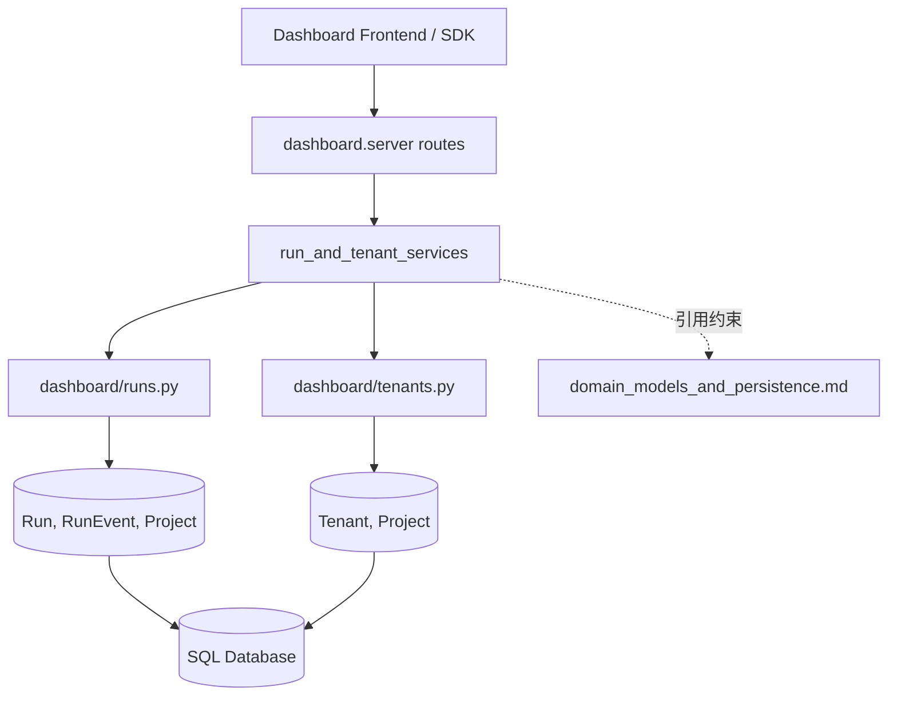
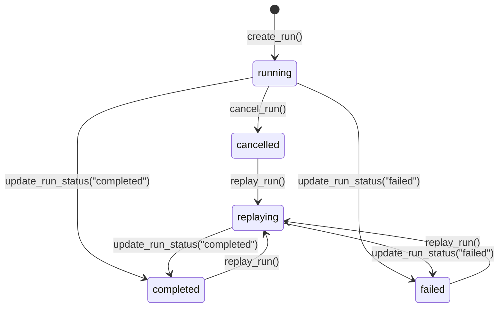
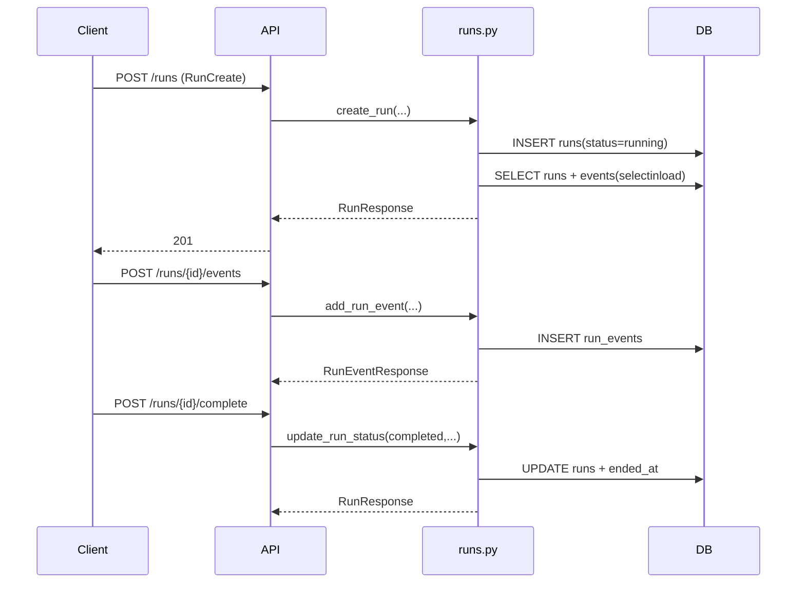
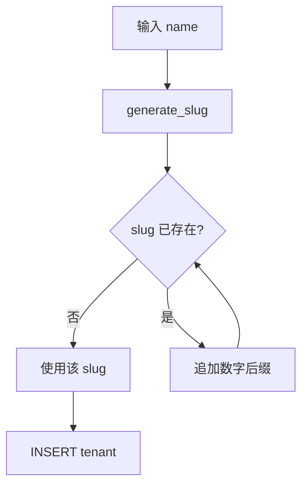

# run_and_tenant_services 模块文档

## 模块简介

`run_and_tenant_services` 是 Dashboard Backend 中面向“运行管理（Run lifecycle）”与“租户管理（Tenant isolation）”的服务层模块。它的核心价值在于：在不暴露底层 ORM 细节的前提下，为 API 层提供稳定、可演进的业务操作语义。这个模块并不定义数据库结构本身，而是围绕 `dashboard.models.Run / RunEvent / Tenant / Project` 这些领域模型，提供创建、查询、更新、取消、重放、时间线聚合以及租户 CRUD 等高频能力。

从设计意图看，这个模块解决了两个现实问题。第一，Run 数据中包含 `config`、`result_summary`、`details` 等 JSON 文本字段，调用方希望拿到结构化字典而不是字符串，因此模块统一承担序列化/反序列化与容错解析。第二，租户需要可读可路由的 slug，同时要保持历史兼容（`Project.tenant_id` 可空），因此模块提供了自动 slug 生成与冲突规避策略，避免 API 层重复实现。

如果把 Dashboard Backend 看成分层系统，那么该模块处于“API 契约层”和“领域模型层”之间：上接请求/响应模型（如 `RunCreate`、`TenantCreate`、`TenantUpdate`），下接异步 SQLAlchemy 会话与数据库事务。建议先阅读 [domain_models_and_persistence.md](domain_models_and_persistence.md) 了解实体约束，再配合 [api_surface_and_transport.md](api_surface_and_transport.md) 理解路由接入方式。

---

## 在整体架构中的位置



这个关系图体现了一个关键点：`run_and_tenant_services` 是“服务行为层”，不是“模型定义层”。它通过 `AsyncSession` 执行读写，通过 Pydantic schema 对外输出稳定数据形态。换句话说，数据库可以持续演进，但只要服务层契约保持稳定，上层调用方就不需要感知内部字段存储方式（例如 JSON string）。

---

## 组件总览与职责边界

### `dashboard.runs.RunCreate`

`RunCreate` 是创建运行实例时的输入契约，字段包含 `project_id`、`trigger`（默认 `manual`）和可选 `config`。它并不直接写数据库，而是作为 API 层和 `create_run` 服务函数之间的数据边界，确保请求体最小化且语义明确。

### `dashboard.tenants.TenantCreate`

`TenantCreate` 用于创建租户，要求 `name` 非空且长度 1~255，支持可选 `description` 与 `settings`。这里的字段校验来自 Pydantic `Field` 约束，能在进入数据库前拦截明显无效输入。

### `dashboard.tenants.TenantUpdate`

`TenantUpdate` 是部分更新契约，所有字段均可选。服务层遵循“仅更新非 None 参数”的策略，这使得 PATCH 风格更新更自然，但也带来一个语义差异：当前实现无法通过传 `None` 显式清空已有字段（例如 description/settings），因为 `None` 会被当成“忽略该字段”。

---

## Run 子模块详解（`dashboard/runs.py`）

## 数据模型与响应模型

Run 服务围绕四个 Pydantic 输出模型组织：`RunEventResponse`、`RunResponse`、`RunTimelineResponse` 与输入模型 `RunCreate`。其中 `RunResponse` 可携带 `events`，但在列表场景（`list_runs`）默认不带事件以减少 payload。

内部还使用 `_run_to_response(run, include_events=True)` 作为统一转换器。该函数会尝试解析 `run.config`、`run.result_summary`、`RunEvent.details` 三类 JSON 文本；解析失败时降级为 `None`，不会抛异常。这个“容错解析”对于处理历史脏数据或手工写入数据非常关键。

## 运行生命周期流程



这个状态图并不是数据库层强约束，而是服务层当前逻辑的“事实状态机”。例如 `cancel_run` 会阻止对终态（`completed/failed/cancelled`）再次取消；`replay_run` 会阻止从 `running/replaying` 发起重放，但允许终态 run 派生子 run。

### `create_run(db, project_id, trigger="manual", config=None) -> RunResponse`

该函数将 `config` 序列化为 JSON 字符串落库，初始状态固定为 `running`。写入后使用 `selectinload(Run.events)` 重新查询，避免异步环境下的 lazy-load 问题。返回值是已完成结构化转换的 `RunResponse`。

副作用是向数据库插入一条 `runs` 记录；函数只 `flush`，不 `commit`，因此事务提交由调用方控制。

### `get_run(db, run_id) -> Optional[RunResponse]`

按 ID 获取单个 run，并预加载事件列表。不存在返回 `None`。这是典型查询接口，不修改状态。

### `list_runs(db, project_id=None, status=None, limit=50, offset=0) -> list[RunResponse]`

支持项目与状态过滤，按 `created_at desc` 排序并分页。虽然查询时预加载了 `events`，但响应转换使用 `include_events=False`，因此默认不返回事件细节，适合列表页快速展示。

### `cancel_run(db, run_id) -> Optional[RunResponse]`

该函数具备“可重复调用但有状态门禁”的特征。若 run 不存在返回 `None`；若 run 已处于终态，也返回 `None`（不会返回当前对象）。仅当 run 处于活动态时，才将其状态置为 `cancelled`，并设置 `ended_at=now(UTC)`。

需要注意，文档字符串写了“Idempotent”，但实现上对终态返回 `None`，而不是返回同一资源快照，因此严格来说更接近“无副作用重复调用”，而不是典型 REST 幂等返回语义。

### `replay_run(db, run_id, config_overrides=None) -> Optional[RunResponse]`

重放会读取父 run，拒绝 `running/replaying` 父节点，然后合并配置：`parent_config.update(config_overrides)`。新 run 的关键特征是：

- `trigger="replay"`
- `status="replaying"`
- `parent_run_id=<parent.id>`

这使系统可以追踪 run lineage（来源链路），便于排障与回归分析。

### `get_run_timeline(db, run_id) -> Optional[RunTimelineResponse]`

返回 run 的事件序列与可选执行时长。时长只在 `started_at` 和 `ended_at` 都存在时计算。事件顺序来自 ORM 关系配置 `order_by="RunEvent.timestamp"`（见模型定义），因此调用方无需再次排序。

### `add_run_event(db, run_id, event_type, phase=None, details=None) -> RunEventResponse`

为指定 run 追加时间线事件，`details` 以 JSON 文本持久化。函数不校验 `run_id` 是否存在，依赖数据库外键约束兜底；若外键失败，异常会向上抛出，调用方应在 API 层转成合适错误码。

### `update_run_status(db, run_id, status, result_summary=None) -> Optional[RunResponse]`

更新 run 状态并可选写入 `result_summary`。当状态变为终态（`completed/failed/cancelled`）且 `ended_at` 为空时，会自动补齐结束时间。与其他写接口一致，函数只 `flush` 不 `commit`。

## Run 数据流示意



---

## Tenant 子模块详解（`dashboard/tenants.py`）

## 设计目标

Tenant 服务聚焦“多租户命名空间与项目隔离”。系统允许 `Project.tenant_id=None`，因此租户能力是“默认可用但非强制绑定”，这对老数据兼容和渐进迁移非常重要。

## slug 生成与冲突处理

`generate_slug(name)` 的规则是：小写化、空格/下划线转 `-`、去除非 `[a-z0-9-]` 字符、合并连续 `-`、去首尾 `-`。例如：

- `"Acme Corp" -> "acme-corp"`
- `"Team__A++" -> "team-a"`

创建租户时，`create_tenant` 会检测 slug 是否已存在，冲突则加后缀 `-2/-3/...`。



这个机制避免了 URL 级冲突，但请注意它只在创建路径使用。`update_tenant` 改名时仅直接 `tenant.slug = generate_slug(name)`，没有做冲突探测，若命中唯一索引冲突会在 flush/commit 时抛异常。

### `create_tenant(db, name, description=None, settings=None) -> Tenant`

创建租户并自动生成唯一 slug。`settings` 会通过 `_serialize_settings` 存为 JSON 文本。返回 ORM `Tenant` 实体（不是 `TenantResponse`），因此 API 层通常还需要调用 `_tenant_to_response` 或自行映射。

### `get_tenant(db, tenant_id) -> Optional[Tenant>` / `get_tenant_by_slug(db, slug)`

分别按主键和 slug 查询，未命中返回 `None`。无副作用。

### `list_tenants(db) -> list[Tenant]`

按租户名称排序返回全量列表。对于大规模租户场景目前无分页参数，调用方应谨慎直接暴露到公网接口。

### `update_tenant(db, tenant_id, name=None, description=None, settings=None) -> Optional[Tenant]`

仅更新非 None 字段；若改名则重算 slug。函数不检查 slug 冲突，也不支持部分 JSON merge（`settings` 是整字段覆盖）。

### `delete_tenant(db, tenant_id) -> bool`

删除租户。由于模型关系和外键配置为级联，关联项目会被删除，进而影响项目下游实体。该操作是高风险破坏性操作，建议在 API 层做二次确认与审计记录。

### `get_tenant_projects(db, tenant_id) -> list[Project]`

按 `Project.created_at` 升序列出租户下项目，用于租户详情页或资源统计。

---

## 关键实现细节与行为约束

## JSON 文本字段的容错策略

Run 和 Tenant 都把部分动态配置存成 `Text`。服务层读取时采用“失败即 None”策略，优点是稳定、不会因单条脏数据拖垮接口；代价是错误数据会被静默吞掉，排障时需要结合数据库原始值和日志定位。

## AsyncSession 与事务边界

所有写操作只执行 `flush`，不执行 `commit`。这意味着多个服务函数可以被上层组合在同一个事务中，但也要求调用方明确负责提交或回滚。若调用方忘记提交，前端可能拿到成功响应却在后续读不到数据。

## eager loading 的必要性

Run 查询多处使用 `selectinload(Run.events)`。在 SQLAlchemy 异步模式下，离开会话上下文后触发 lazy-load 容易报错（如 greenlet/context 问题），因此这种预加载是稳定性设计而不是性能偶然。

---

## 错误场景、边界条件与已知限制

1. `cancel_run` 对终态返回 `None`，调用方无法区分“run 不存在”与“run 已终态不可取消”，需要额外查询做细粒度错误提示。
2. `replay_run` 仅阻止 `running/replaying` 父节点，未校验父节点所属项目的额外业务策略（如项目已归档）。
3. `update_tenant` 改名未处理 slug 冲突，可能触发数据库唯一键异常。
4. `list_tenants` 无分页；租户数量大时可能带来内存与响应时延问题。
5. JSON 解析失败静默降级 `None`，可能掩盖数据质量问题；建议在运维侧增加一致性巡检。
6. `add_run_event` 不先查 run 存在性，外键错误会以数据库异常形式暴露，不是业务友好的 404。

---

## 使用示例

### 1）创建并完成一个 Run

```python
from dashboard.runs import create_run, add_run_event, update_run_status

run = await create_run(db, project_id=42, trigger="manual", config={"mode": "fast"})
await add_run_event(db, run.id, event_type="phase", phase="planning", details={"step": 1})
run_done = await update_run_status(db, run.id, "completed", result_summary={"score": 0.93})
await db.commit()
```

### 2）重放历史 Run 并覆盖配置

```python
from dashboard.runs import replay_run

new_run = await replay_run(db, run_id=1001, config_overrides={"temperature": 0.2})
if new_run is None:
    # 父 run 不存在，或仍在 running/replaying
    ...
await db.commit()
```

### 3）创建与更新 Tenant

```python
from dashboard.tenants import create_tenant, update_tenant

tenant = await create_tenant(
    db,
    name="Acme Corp",
    description="Enterprise tenant",
    settings={"quota": {"runs_per_day": 500}}
)

tenant = await update_tenant(
    db,
    tenant_id=tenant.id,
    name="Acme Platform",
    settings={"quota": {"runs_per_day": 800}}
)

await db.commit()
```

---

## 扩展建议

当你准备扩展本模块时，优先保持“服务层负责语义、模型层负责约束”的分工。例如新增 Run 状态枚举时，应先定义状态迁移规则（允许从哪里到哪里），再考虑数据库兼容；新增 Tenant 设置项时，应尽量在 API 层增加 schema 校验，避免纯 JSON 文本导致配置漂移。

如果需要跨模块协作：

- 运行态可观测与事件流，请参考 [runtime_services.md](runtime_services.md)。
- 实体关系与外键副作用，请参考 [domain_models_and_persistence.md](domain_models_and_persistence.md)。
- API 接入和鉴权/限流，请参考 [api_surface_and_transport.md](api_surface_and_transport.md)。

通过这种分层阅读路径，新开发者可以快速建立从“请求 -> 服务 -> 模型 -> 数据”的完整心智模型。