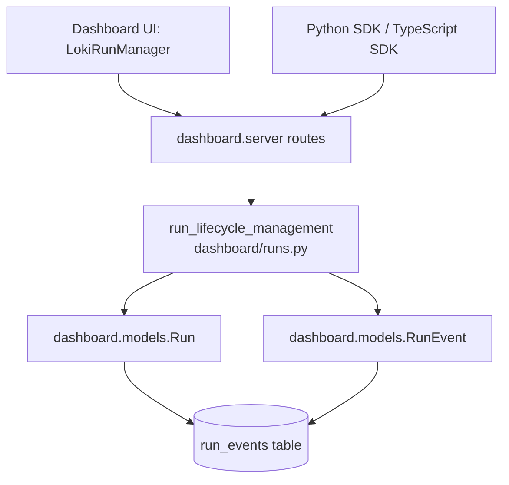
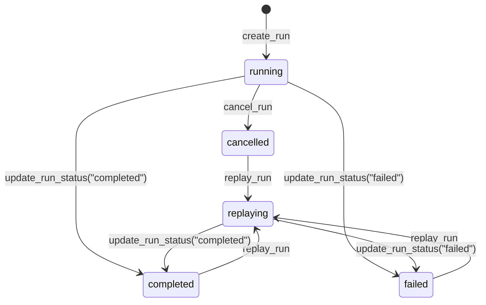
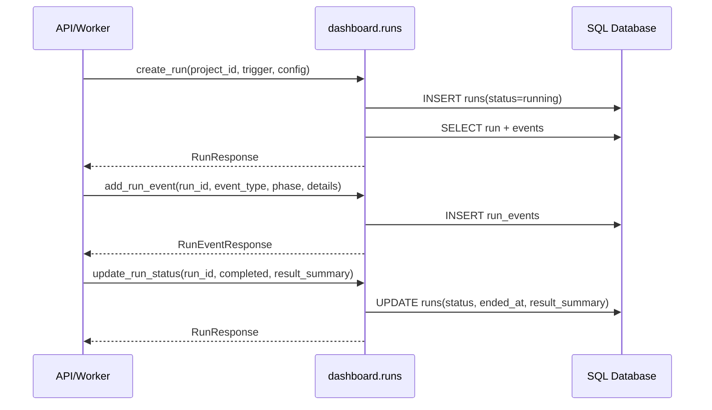
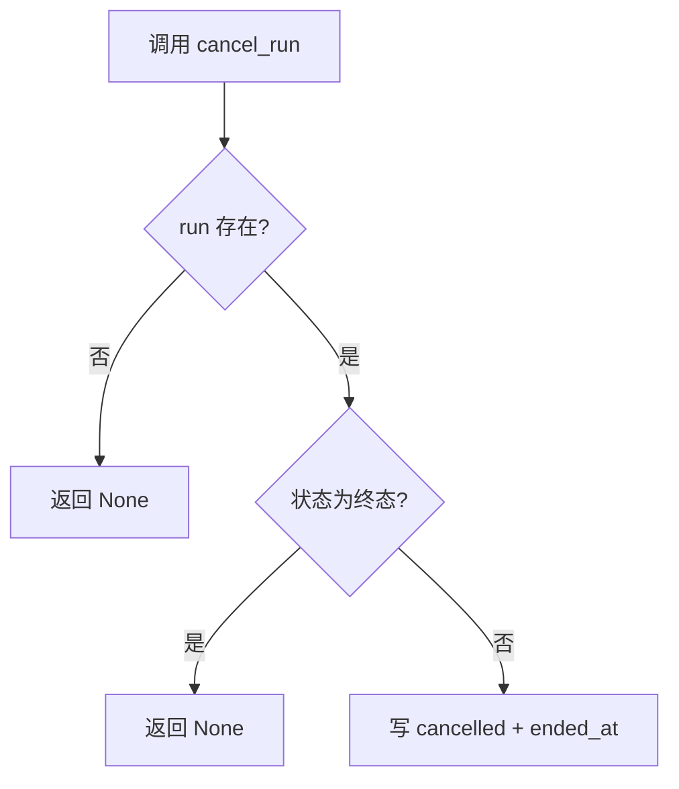

# run_lifecycle_management 模块文档

## 模块概述与设计动机

`run_lifecycle_management` 对应 Dashboard Backend 中的运行生命周期管理能力，核心代码位于 `dashboard/runs.py`。这个模块解决的是一个非常具体但关键的问题：系统中的一次“执行”不仅要有最终结果，还要有完整的过程可追溯性。为此，模块将一次执行抽象为 `Run`，并通过 `RunEvent` 记录执行过程中的阶段事件（phase timeline），从而支持运行列表、运行详情、取消、重放、状态更新和时间线可视化。

该模块存在的根本原因是把“会话执行”与“运行控制”解耦。`Session` 更偏向会话上下文本体，而 `Run` 更偏向操作层面的可管理对象，具备独立的触发来源（`trigger`）、运行配置（`config`）、结果摘要（`result_summary`）和谱系关系（`parent_run_id`）。这种建模使前端控制台（例如 `LokiRunManager`）可以直接围绕 Run 做运维动作，而不必深入 Session 内部状态。

从系统分层看，`run_lifecycle_management` 位于 API 路由层与持久化模型层之间，向上提供稳定的 Pydantic 响应结构，向下使用 SQLAlchemy `AsyncSession` 执行异步查询/写入。若你需要先了解实体字段和关系约束，建议先阅读 [domain_models_and_persistence.md](domain_models_and_persistence.md)；若你要理解路由暴露方式和传输层契约，可参考 [api_surface_and_transport.md](api_surface_and_transport.md) 与 [task_board_and_run_operations.md](task_board_and_run_operations.md)。

---

## 架构位置与依赖关系



这个结构说明了模块的边界：它不是 HTTP 层（不直接处理请求对象），也不是 ORM 定义层（不定义表结构），而是“生命周期行为编排层”。它负责把数据库中的字符串存储字段（如 JSON 文本）转换为 API 可消费的结构化对象，并对生命周期动作施加基本业务约束。

---

## 数据模型与核心组件

## `RunCreate`（核心组件）

`RunCreate` 是本模块在模块树中标记的核心组件。它是一个输入 schema，描述“创建新 run 时，调用方必须或可以提供哪些信息”。字段如下：

- `project_id: int`：必填，run 所属项目。
- `trigger: str = "manual"`：可选，触发来源，默认手动触发。
- `config: Optional[dict] = None`：可选，运行配置，最终会被序列化成 JSON 文本写入数据库。

虽然 `RunCreate` 本身很小，但它定义了创建动作的最小契约，并且影响后续可追踪性：`trigger` 用于审计 run 来源，`config` 用于复现实验条件，`project_id` 用于多项目隔离。

## 关联响应模型

模块内部还定义了 `RunEventResponse`、`RunResponse`、`RunTimelineResponse` 三个输出模型。它们共同作用是屏蔽 ORM 与存储细节，把返回数据统一为结构化 JSON 友好对象。尤其 `RunResponse` 同时包含执行元信息与可选事件列表，是列表页和详情页共享的统一载体。

## ORM 依赖（来自 `dashboard.models`）

`Run` 实体承载状态、配置、结果、开始结束时间以及父子重放关系；`RunEvent` 实体承载事件类型、阶段和事件细节。二者通过 `Run.events` 关联，并按 `RunEvent.timestamp` 排序。这意味着 timeline 输出天然有序，不需要每次在服务层再手动排序。

---

## 内部转换机制：`_run_to_response`

`_run_to_response(run, include_events=True)` 是本模块的一条关键内部通道。它把 ORM 对象转换成 Pydantic 响应对象，并在转换过程中做三类 JSON 容错解析：`run.config`、`run.result_summary`、`event.details`。如果字段不是合法 JSON，函数不会抛错，而是降级为 `None`。

这种策略的好处是接口稳定，单条脏数据不会拖垮整个请求；代价是数据问题可能被“温和隐藏”，调用方只能看到字段缺失。对运维来说，建议把“JSON 解析失败次数”纳入日志或监控，否则长期会积累不可见的数据质量风险。

---

## 生命周期与状态流转



这里要特别注意：这是“服务层事实状态机”，不是数据库强约束状态机。数据库本身通常只保存字符串状态；真正的“允许/拒绝某动作”逻辑在函数里实现。例如 `replay_run` 显式禁止从 `running/replaying` 父 run 发起重放，但不会禁止自定义其他终态字符串进入系统。

---

## 关键函数详解

## `create_run(db, project_id, trigger="manual", config=None) -> RunResponse`

此函数用于创建一个新 run。它会将 `config` 转为 JSON 文本，创建 `Run(status="running")`，执行 `flush` 生成主键后，再次查询并 `selectinload(Run.events)` 返回完整对象。

参数方面，`db` 是活动的 `AsyncSession`；`project_id` 必须有效；`trigger` 用于标识来源；`config` 可空。返回值始终是结构化 `RunResponse`。副作用是插入一条 run 记录，但不会 `commit`，事务提交由上层控制。

## `get_run(db, run_id) -> Optional[RunResponse]`

按 ID 获取单个 run 并附带事件，找不到返回 `None`。这是纯查询接口，无写入副作用。该函数适合详情页或后续动作前的存在性检查。

## `list_runs(db, project_id=None, status=None, limit=50, offset=0) -> list[RunResponse]`

该函数支持按项目和状态过滤，并按 `created_at desc` 分页。尽管查询里预加载了 events，返回时使用 `include_events=False`，因此列表默认不返回事件体，目的是控制响应体大小与序列化成本。

`limit/offset` 是最主要的可配置行为参数。当前实现没有对 `limit` 上限做硬限制，API 层应自行添加防护，避免大查询拖垮数据库与应用内存。

## `cancel_run(db, run_id) -> Optional[RunResponse]`

函数语义是取消活动中的 run。它先查询 run；不存在返回 `None`。如果当前状态已是终态（`completed/failed/cancelled`），也返回 `None`。只有活动态才会被置为 `cancelled` 并补写 `ended_at=UTC now`。

文档字符串写了“Idempotent”，但实现上重复取消终态时返回 `None`，并不返回同一资源快照。所以它是“重复调用无副作用”，但不是严格意义上最友好的幂等响应契约。调用方若要区分“不存在”与“不可取消”，需额外查询状态。

## `replay_run(db, run_id, config_overrides=None) -> Optional[RunResponse]`

此函数基于历史 run 创建新 run，用于复跑或参数对比实验。它会读取父 run，拒绝 `running/replaying` 父节点，然后把父配置与覆盖配置合并（`parent_config.update(config_overrides)`），创建新 run：`trigger="replay"`、`status="replaying"`、`parent_run_id=<parent.id>`。

这个设计使 lineage（谱系）天然可追踪。你可以从任意 run 逆向找到来源链，也能对比同一父 run 下不同参数重放结果。

## `get_run_timeline(db, run_id) -> Optional[RunTimelineResponse]`

该函数返回有序事件列表与可选运行时长。时长仅在 `started_at` 和 `ended_at` 同时存在时计算；运行中 run 会返回 `duration_seconds=None`。这对前端很关键：UI 需要区分“未知时长”与“真实为 0 秒”。

## `add_run_event(db, run_id, event_type, phase=None, details=None) -> RunEventResponse`

此函数追加 timeline 事件，把 `details` 序列化为 JSON 文本并写入 `run_events`。它不先验证 run 是否存在，而是依赖外键约束；因此错误通常会以数据库异常形式上抛。API 层应把这类异常转换为业务可理解错误（如 404 或 409），避免把底层错误直接暴露给客户端。

## `update_run_status(db, run_id, status, result_summary=None) -> Optional[RunResponse]`

该函数更新状态并可选写入 `result_summary`。当状态进入终态且 `ended_at` 为空时，自动补结束时间。函数同样只做 `flush`，不做 `commit`，允许调用方把“更新状态 + 写事件 + 其他变更”放在同一事务中原子提交。

---

## 交互时序与数据流



这个流程体现了模块的典型使用方式：先创建 run，再持续写入阶段事件，最后落终态和结果摘要。对 UI 与审计来说，这比只写最终结果更有价值，因为中间过程可解释、可定位、可回放。

---

## 配置、扩展与定制建议

如果你想扩展本模块，建议优先保持以下兼容约束。首先，状态值虽然是字符串，但应维护一组“被服务层识别的终态集合”，否则 `cancel_run`、`replay_run`、`update_run_status` 的行为会出现偏差。其次，若你计划把 `config/result_summary/details` 改为原生 JSON 列，应同步调整 `_run_to_response` 的解析逻辑，避免重复 `json.loads`。

在扩展能力方面，一个常见需求是增加更细粒度的状态迁移校验（例如禁止从 `failed` 直接回到 `running`）。这类能力建议集中放在服务层函数中实现，而不要散落到 API 路由，以保持规则单一来源。

---

## 边界条件、错误条件与已知限制



当前实现有几个需要特别注意的行为约束。第一，多个函数用 `None` 同时表示“资源不存在”与“当前状态不允许操作”，这会降低错误语义分辨率。第二，`add_run_event` 依赖数据库外键做存在性校验，API 侧若不拦截会泄露底层异常细节。第三，JSON 解析失败是静默降级策略，短期提升稳定性，长期可能掩盖数据污染。第四，所有写接口只 `flush` 不 `commit`，调用方若遗漏提交，会出现“看似成功但数据未持久化”的问题。

此外，`list_runs` 默认不返回 events，这是性能导向设计；如果你在列表页直接需要事件详情，应考虑新增专门 endpoint 或显式参数，而不是盲目把列表改成全量事件返回。

---

## 实用示例

### 创建运行并记录时间线

```python
from dashboard.runs import create_run, add_run_event, update_run_status

run = await create_run(
    db,
    project_id=12,
    trigger="manual",
    config={"mode": "safe", "temperature": 0.1},
)

await add_run_event(db, run.id, event_type="phase_started", phase="planning", details={"step": 1})
await add_run_event(db, run.id, event_type="phase_completed", phase="planning", details={"tokens": 438})

run_done = await update_run_status(
    db,
    run_id=run.id,
    status="completed",
    result_summary={"quality_score": 0.94, "cost": 1.27},
)

await db.commit()
```

### 重放历史运行并覆盖配置

```python
from dashboard.runs import replay_run

new_run = await replay_run(
    db,
    run_id=1001,
    config_overrides={"temperature": 0.0, "max_steps": 12},
)

if new_run is None:
    # 父 run 不存在，或父 run 仍在 running/replaying
    ...

await db.commit()
```

---

## 与其他文档的关系

本文件聚焦 run 生命周期服务行为，不重复展开路由层和前端组件细节。你可以结合以下文档形成完整视图：

- [domain_models_and_persistence.md](domain_models_and_persistence.md)：`Run` / `RunEvent` 的字段与关系约束。
- [api_surface_and_transport.md](api_surface_and_transport.md)：对外 API 暴露与请求/响应传输语义。
- [task_board_and_run_operations.md](task_board_and_run_operations.md)：前端 `LokiRunManager` 如何消费运行列表、取消与重放能力。
- [run_and_tenant_services.md](run_and_tenant_services.md)：运行与租户服务的并行视角与组合实践。
