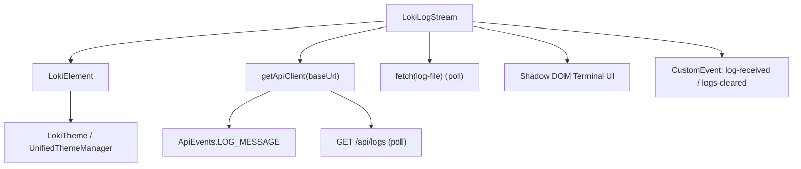
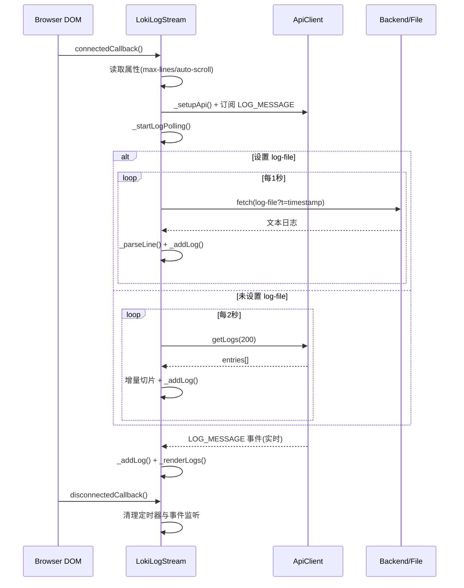
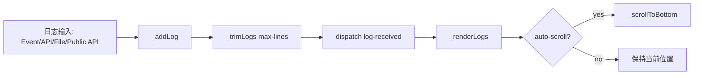
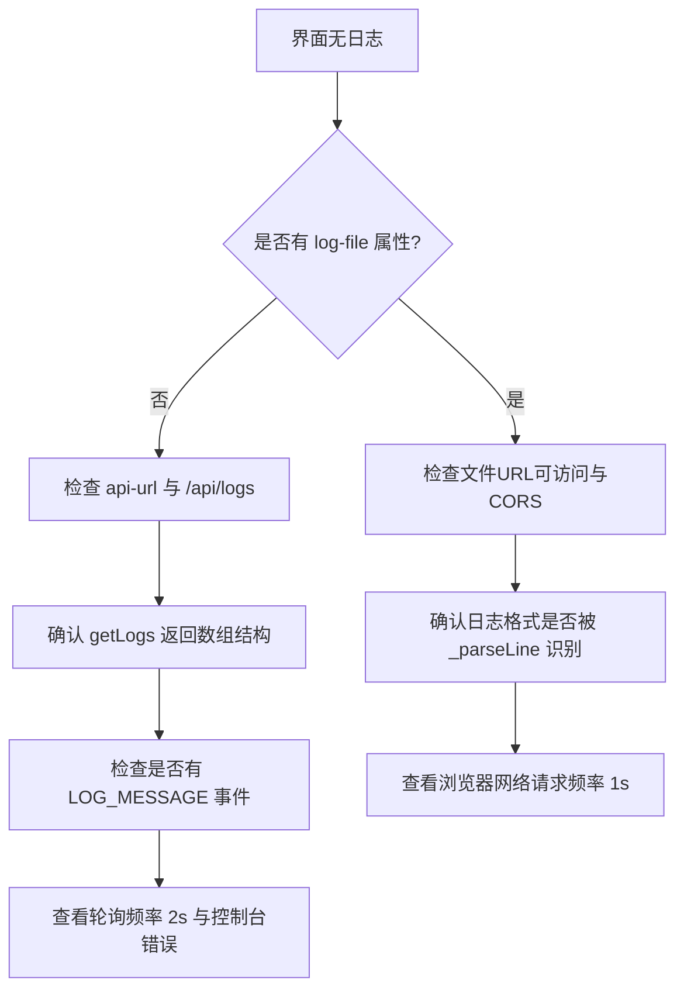

# runtime_log_streaming_and_terminal_view

## 模块简介

`runtime_log_streaming_and_terminal_view` 是 Dashboard UI 中“Monitoring and Observability Components”下的实时运行日志可视化模块，核心组件是 `dashboard-ui.components.loki-log-stream.LokiLogStream`。它解决的问题非常明确：把后端/运行时分散产生的日志流（API 轮询、文件轮询、事件推送）统一呈现在一个终端风格视图中，让开发者和运维人员在不离开 Dashboard 的前提下观察 agent 执行过程、定位错误、筛选关注级别，并导出日志用于离线分析。

这个模块存在的设计动机是“低耦合实时可见性”。它并不要求后端必须提供某一种单一传输机制，而是采用“事件 + 轮询兜底”的混合模式：优先通过 API client 的 `LOG_MESSAGE` 事件实时接收，辅以 `/api/logs` 轮询；如果部署环境更偏静态或无标准日志 API，还可以直接读取 `log-file`。这种设计使组件可以在本地开发、单机运行、以及不同后端演进阶段都可工作。

在系统定位上，它与 [LokiOverview.md](./LokiOverview.md)、[LokiAppStatus.md](./LokiAppStatus.md)、[LokiContextTracker.md](./LokiContextTracker.md) 同属“观测域”组件，但关注点更底层：它展示的是原始日志线，而非聚合指标或状态摘要。主题与基础交互能力由 [Core Theme.md](./Core%20Theme.md) 和 [Unified Styles.md](./Unified%20Styles.md) 提供。

---

## 架构与依赖关系



该结构体现了三层职责分离。`LokiElement` 负责主题、键盘处理和基础生命周期；`LokiLogStream` 负责日志采集、内存缓冲、过滤与渲染；外层页面只需监听组件事件或调用公开 API，不需要感知内部拉取策略。这种分层使模块扩展（新增日志来源、增强过滤策略）时不必改动主题或宿主页面逻辑。

---

## 生命周期与运行流程



运行时采用“并行可用”的理念：事件流、API 轮询、文件轮询不是严格互斥关系（除 `log-file` 与 API 轮询二选一外，事件监听始终存在）。这既提高了实时性，也提升了在网络抖动或接口暂不可用时的可恢复性。

---

## 核心组件详解：`LokiLogStream`

### 类职责

`LokiLogStream` 是一个 Web Component（`customElements.define('loki-log-stream', LokiLogStream)`），承担四项核心职责：日志采集、日志缓存、日志过滤、终端渲染。内部状态以 `_logs` 为中心，围绕容量控制（`_maxLines`）、显示控制（`_autoScroll`）、过滤条件（`_filter`、`_levelFilter`）和连接句柄（`_api`、定时器、事件 handler）运行。

### 可观察属性（observedAttributes）

组件声明了以下属性：`api-url`、`max-lines`、`auto-scroll`、`theme`、`log-file`。

- `api-url`：变更时更新 `this._api.baseUrl`。
- `max-lines`：变更后立即裁剪缓存并重绘。
- `auto-scroll`：通过属性存在性判断布尔值，并重绘按钮状态。
- `theme`：触发 `_applyTheme()`，由父类主题系统实际应用。
- `log-file`：虽然被观察，但当前实现**没有在 `attributeChangedCallback` 中处理切换逻辑**（见“限制与注意事项”）。

### 关键方法行为

#### `_setupApi()`

输入：无（读取 `api-url` 属性）。
输出：无。
副作用：创建 API client、绑定 `LOG_MESSAGE` 监听器。

这一步将实时事件接入组件：每次收到事件都会调用 `_addLog(e.detail)`。

#### `_startLogPolling()` / `_stopLogPolling()`

输入：无。
输出：无。
副作用：设置或清理 `setInterval`。

- 若存在 `log-file`，启动 `_pollLogFile(logFile)`（1 秒）。
- 否则启动 `_pollApiLogs()`（2 秒）。
- `_stopLogPolling()` 清理 `_pollInterval` 和 `_apiPollInterval`。

#### `_pollApiLogs()`

输入：无。
输出：Promise<void>（内部循环轮询）。
副作用：调用 `this._api.getLogs(200)`，将新日志转入 `_logs`。

它通过局部变量 `lastCount` 做增量切片：仅处理 `entries.slice(lastCount)`。异常被吞掉（静默重试），保证 UI 不因后端短时不可用崩溃。

#### `_pollLogFile(logFile)`

输入：`logFile: string`。
输出：Promise<void>（内部循环轮询）。
副作用：`fetch` 文件内容、按行增量读取、逐行解析并写入缓存。

它通过 `?t=${Date.now()}` 规避缓存，按“总行数增长”识别新日志。读取或网络错误同样静默处理。

#### `_parseLine(line)`

输入：`line: string`。
输出：`{timestamp, level, message}`。

支持三种格式：
1. `[TIMESTAMP] [LEVEL] message`
2. `HH:mm:ss LEVEL message`
3. 无法匹配时回落到 `info + 当前时间`

#### `_addLog(log)`

输入：`log: object|string`。
输出：无。
副作用：写入 `_logs`、触发 `log-received` 事件、重渲染、可能自动滚动。

该方法是所有日志入口的统一落点，会标准化字段并分配 `id`。

#### `_getFilteredLogs()`

输入：无。
输出：过滤后的日志数组。

过滤规则是“级别 AND 文本”，其中文本过滤对 `message` 做 `toLowerCase().includes(...)`。

#### `_renderLogs()` 与 `render()`

- `render()` 负责整体模板（头部控制区、日志区、计数区）与事件绑定。
- `_renderLogs()` 负责仅更新日志区内容（innerHTML）。

两者组合实现了“粗粒度重建 + 局部高频刷新”的平衡：属性切换时通常全量 `render()`，日志频繁到达时主要走 `_renderLogs()`。

#### 公共 API

- `addLog(message, level='info')`：外部主动注入日志。
- `clear()`：清空缓存并触发 `logs-cleared`。

这两个方法使组件不仅能做“后端日志 viewer”，也能用于“前端运行过程追踪面板”。

---

## 日志处理与渲染数据流



这个流的关键是 `_trimLogs()` 在每次入队后立即执行，确保内存上界可控；日志渲染前使用 `_escapeHtml`，避免日志文本被浏览器当作 HTML 执行，从而降低 XSS 风险。

---

## 配置与使用

### 基础用法

```html
<loki-log-stream></loki-log-stream>
```

默认行为：以当前站点为 `api-url`，最多保留 500 行；若未声明 `auto-scroll` 属性，初始值会按属性存在性解析（详见注意事项）。

### API 轮询 + 事件流

```html
<loki-log-stream
  api-url="http://localhost:57374"
  max-lines="1000"
  auto-scroll>
</loki-log-stream>
```

### 文件轮询模式

```html
<loki-log-stream
  log-file="/runtime/loki.log"
  max-lines="800"
  theme="dark">
</loki-log-stream>
```

### JS 侧控制与事件订阅

```javascript
const stream = document.querySelector('loki-log-stream');

stream.addEventListener('log-received', (e) => {
  // e.detail: { id, timestamp, level, message }
  console.debug('new log', e.detail);
});

stream.addEventListener('logs-cleared', () => {
  console.info('log buffer cleared');
});

stream.addLog('Manual checkpoint reached', 'step');
stream.clear();
```

---

## 方法级行为参考（内部实现视角）

下面补充一份更偏维护者视角的方法说明，方便你在排查缺陷或重构时快速定位责任边界。

### 生命周期方法

`connectedCallback()` 在组件挂载时完成三件事：第一，读取 `max-lines` 和 `auto-scroll` 初始配置；第二，初始化 API client 并订阅 `ApiEvents.LOG_MESSAGE`；第三，启动轮询策略。它没有等待首次渲染完成才开始采集日志，因此日志可能在首帧后立即进入 `_logs`。

`disconnectedCallback()` 是资源回收关键点。它会停止所有轮询定时器，并解除 `LOG_MESSAGE` 事件监听。如果宿主频繁创建/销毁组件，这个回收路径能避免重复订阅导致的“同一条日志重复显示”。

`attributeChangedCallback(name, oldValue, newValue)` 只处理部分属性。`api-url` 会直接改写现有 client 的 `baseUrl`，`max-lines` 会触发裁剪与重绘，`auto-scroll` 会重算布尔值并重绘，`theme` 触发主题应用。`log-file` 当前未在此处处理，这是后续可改进点。

### 数据采集方法

`_setupApi()` 的输入来自组件属性，输出是内部 `_api` 与 `_logMessageHandler` 的建立。其副作用是注册事件监听，组件从这一步开始具备“被动接收日志推送”的能力。

`_startLogPolling()` 是采集策略分发器：若有 `log-file`，走 `_pollLogFile()`；否则走 `_pollApiLogs()`。这里的设计强调“最少配置即可工作”，但也意味着策略切换时要显式重建组件才能确保一致性。

`_pollApiLogs()` 通过 `getLogs(200)` 定期抓取日志快照，并用 `lastCount` 做简单增量。该策略实现成本低，但假设服务端结果是追加型数组；若服务端分页或重置，增量推断会出现偏差。

`_pollLogFile(logFile)` 采用全文读取 + 按行增量。优点是通用、无需后端 API；代价是文件大时网络与解析开销会随轮询增加。生产环境通常建议把 `log-file` 指向轻量、可轮转的输出文件。

`_stopLogPolling()` 是轮询生命周期的唯一出口，维护时应保证任何新增定时器都纳入这里统一释放。

### 解析、缓冲与过滤方法

`_parseLine(line)` 承担“非结构化日志归一化”职责。它先尝试严格格式，再尝试简化格式，最后回退到默认 `info`。这使组件能容忍多种日志源，但也会牺牲部分结构精度（例如无法识别 traceId）。

`_addLog(log)` 是核心写入路径。它会标准化字段、生成 `id`、写入 `_logs`、执行容量裁剪、派发 `log-received`、触发日志区刷新，并在需要时自动滚动。任何新增来源都建议通过该方法进入，避免绕过统一约束。

`_trimLogs()` 实现固定窗口缓存。它不做分级缓存或持久化，属于纯内存策略，适合 UI 观察，不适合长期审计留存。

`_setFilter(filter)` 与 `_setLevelFilter(level)` 只更新过滤状态并重绘，不影响原始缓存。也就是说筛选是“视图层过滤”，而非“数据层删除”。

`_getFilteredLogs()` 是典型的同步过滤函数，复杂度随 `_logs` 线性增长。当 `max-lines` 较大且日志高频时，这里会成为渲染热点。

### 渲染与交互方法

`render()` 负责绘制完整终端框架，并重新绑定头部控件事件。由于它会重建 Shadow DOM，维护时应避免在高频路径中调用。

`_renderLogs()` 只更新日志输出区，属于高频路径。它会对 `timestamp/level/message` 做 HTML 转义后再拼接 `innerHTML`，在安全和实现简洁之间做了折中。

`_scrollToBottom()` 使用 `requestAnimationFrame`，确保滚动发生在浏览器下一帧，避免同步布局抖动。

`_downloadLogs()` 导出的是当前缓存 `_logs`，格式为 `[timestamp] [LEVEL] message` 文本。它不包含过滤器状态，也不附带 JSON 元数据。

`_attachEventListeners()` 把输入框、下拉框、按钮与内部方法关联。每次 `render()` 都会重新建立监听，因此逻辑保持“DOM 即状态”的简单模型。

### 对外公开方法

`addLog(message, level='info')` 适合让宿主页面注入业务日志，例如“手动标记检查点”或“前端动作回执”。

`clear()` 对应 UI 上的 Clear 操作，用于清空可视缓冲，不影响后端日志源。

---


## 可扩展点（如何扩展该模块）


如果你准备扩展模块，建议优先在以下点位改造：

1. 新日志来源：新增 `_startLogPolling` 分支，例如 SSE 专用端点或 IndexedDB replay。
2. 新过滤器：扩展 `_getFilteredLogs()`，增加时间窗、正则、来源字段过滤。
3. 日志格式解析：扩展 `_parseLine()` 支持 JSON 日志（如 `{"level":"error","msg":"..."}`）。
4. 交互能力：在 `LokiElement.registerShortcut()` 基础上增加快捷键（例如 `Ctrl+L` 清屏）。
5. 渲染性能：当日志量极高时，引入虚拟列表替代整段 `innerHTML` 重绘。

---

## 边界条件、错误处理与限制

### 已实现的容错策略

- API/文件读取失败时静默忽略，定时器继续工作。
- 日志文本统一 HTML 转义，降低注入风险。
- `max-lines` 强制裁剪，避免无限增长。

### 需要特别注意的行为

1. **`auto-scroll` 默认值语义**：构造函数中 `_autoScroll = true`，但连接时使用 `hasAttribute('auto-scroll')` 重新赋值。这意味着未写属性时最终是 `false`。如果你期望默认自动滚动，需要显式写上 `auto-scroll`。
2. **`log-file` 属性动态切换不会自动重启轮询**：虽然被观察，但 `attributeChangedCallback` 未处理它。运行中切换 `log-file` 可能不生效，建议先移除再重新挂载组件，或补充实现。
3. **API 增量策略依赖 `lastCount`**：若后端 `/api/logs` 返回窗口截断或重置，可能出现漏读/重复。
4. **文件轮询依赖“行数增长”**：日志文件被 truncate/rotate 时，`lastSize` 逻辑可能失真，导致新增日志被忽略，需额外处理 inode/大小回退。
5. **渲染频率与性能**：高吞吐日志下每条都触发 `_renderLogs()`，可能产生主线程压力。
6. **下载行为是全量 `_logs`，不是过滤结果**：即使 UI 正在筛选，下载仍包含全部缓存。

### 常见故障排查建议



---

## 与其他模块的关系（避免重复理解）

- 主题、设计令牌与可访问性基线：参见 [Core Theme.md](./Core%20Theme.md)、[Unified Styles.md](./Unified%20Styles.md)
- 观测域整体分工：参见 [Monitoring and Observability Components.md](./Monitoring%20and%20Observability%20Components.md)
- 指标总览与状态层视图：参见 [LokiOverview.md](./LokiOverview.md)、[LokiAppStatus.md](./LokiAppStatus.md)
- 若只关注单组件 API 速览，可参考现有 [LokiLogStream.md](./LokiLogStream.md)

---

## 结论

`runtime_log_streaming_and_terminal_view` 的价值在于把“实时日志可见性”做成了一个可嵌入、可配置、可扩展的终端式组件。它的工程取舍偏向实用主义：多来源接入、失败静默重试、简单直接的渲染和过滤逻辑。对大多数项目阶段而言，这能快速提供可用观测能力；当系统进入超高吞吐或严格审计阶段，则应进一步增强增量同步算法、文件轮转感知、虚拟化渲染与导出策略。