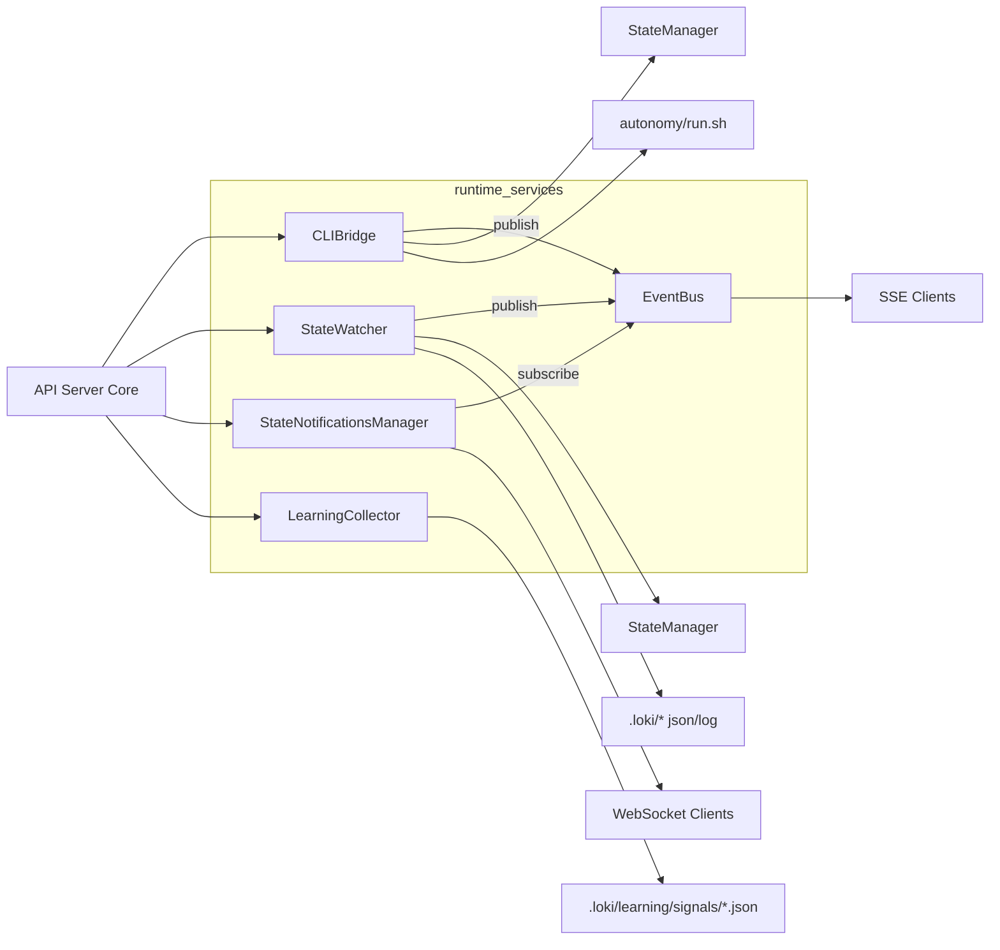
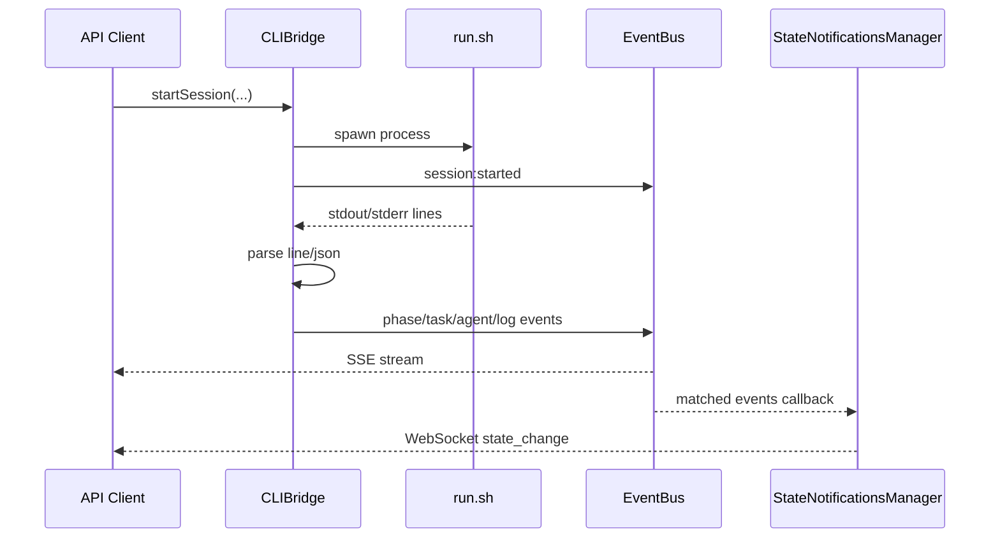
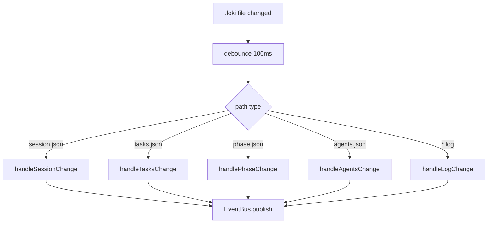
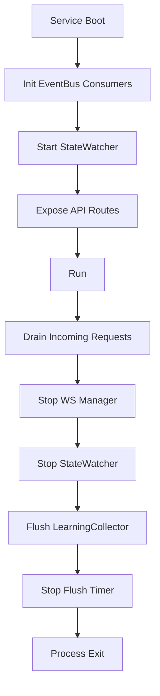

# runtime_services 模块文档

## 1. 模块定位与存在价值

`runtime_services` 是 API 服务层中的“运行时协调层”。如果说 [api_server_core](api_server_core.md) 负责 HTTP 路由、请求接入与中间件编排，那么 `runtime_services` 负责把“真实运行中的状态变化”转成可观测、可订阅、可回放、可学习的数据流。它的核心作用不是执行业务算法本身，而是把 CLI 进程、文件状态、WebSocket/SSE 推送与学习信号采集统一在一个稳定的运行时接口中。

该模块存在的原因很直接：系统底层仍以 CLI 和 `.loki` 文件体系为事实来源（source of truth）之一，但上层 Dashboard、SDK、VSCode 扩展需要实时、结构化、跨协议的反馈。`runtime_services` 提供了桥接（CLIBridge）、分发（EventBus）、监听（StateWatcher / StateNotificationsManager）和归档学习（LearningCollector）四种能力，把“离散的运行事实”转换为“统一的服务事件模型”。

从系统边界看，这一模块连接了三类对象：

- 向下连接执行与状态面：`autonomy/run.sh`、`.loki/sessions/*`、日志文件。
- 向上连接 API 消费面：SSE 客户端、WebSocket 客户端、路由处理器。
- 横向连接治理能力：学习系统（signals）、状态管理系统（StateManager）、类型契约层（API Types/Event Types）。

---

## 2. 整体架构与组件关系



上图体现了一个关键设计：`EventBus` 是模块内的“中心消息面”，但并不承担状态存储；状态仍以 `.loki` 文件为主，读取写入由 `StateManager` 统一封装。`CLIBridge` 和 `StateWatcher` 都会产生事件，前者偏向“进程输出实时解释”，后者偏向“文件状态变化事实”。`StateNotificationsManager` 则把部分事件二次转译为 WebSocket 通知，形成与 SSE 并行的推送通道。

---

## 3. 核心组件详解

## 3.1 `api.services.cli-bridge.CLIBridge`

`CLIBridge` 是 CLI 会话生命周期的运行时代理。它负责启动 `run.sh`、维护进程映射、解析 stdout/stderr、发布结构化事件，并提供会话/任务查询与人工输入注入能力。

### 3.1.1 内部状态与构造逻辑

构造函数会解析 `LOKI_DIR` 环境变量，默认回退到项目根路径并拼出 `autonomy/run.sh`。同时会创建一个 `StateManager`，配置为 `enableWatch: false`、`enableEvents: false`，表示该对象只做“按需读取状态文件”，不承担监听职责（监听由 `StateWatcher` 负责）。

关键内部成员包括：

- `runningProcesses: Map<string, RunningProcess>`：会话 ID 到子进程句柄的映射。
- `sessions: Map<string, Session>`：内存会话缓存，减少磁盘读取。
- `stateManager`：读取 `sessions/<id>/session.json`、`tasks.json` 等文件。

### 3.1.2 `startSession(prdPath?, provider?, options?)`

该方法会生成 `session_<timestamp>_<uuid8>` 形式的会话 ID，拼装 CLI 参数并 `spawn` 子进程。执行后会：

1. 创建初始 `Session`（`status: "starting"`）。
2. 启动命令并写入环境变量 `LOKI_SESSION_ID`、`LOKI_API_MODE=true`。
3. 更新会话到 `running`，记录 PID。
4. 异步启动 `streamOutput()` 处理 stdout/stderr。
5. 通过 `emitSessionEvent("session:started", ...)` 发布事件。

返回值为 `Promise<Session>`，即当前内存会话快照。

### 3.1.3 `stopSession(sessionId)`

停止策略是“先温和后强制”：先 `SIGTERM`，等待 5 秒，如仍在运行则 `SIGKILL`。此过程会先发出 `session:stopped`（语义上表示“收到停止请求”），完成后将内存状态置为 `stopped` 并移除 `runningProcesses` 记录。

返回 `boolean` 表示是否成功找到并处理该运行会话，不会抛出细粒度业务错误。

### 3.1.4 `getSession` / `listSessions` / `getTasks`

这三者体现“内存优先，文件回退”的读取策略：

- `getSession` 先查 `sessions` Map，再查 `sessions/<id>/session.json`。
- `listSessions` 会枚举 `.loki/sessions/*.json` 并合并进内存结果。
- `getTasks` 从 `sessions/<id>/tasks.json` 中读取 `tasks` 数组，并执行字段兼容与状态映射（例如 `in progress` → `running`，`done` → `completed`）。

这种策略可以让 API 在进程重启后仍可读取历史会话，但也意味着“内存态与磁盘态短时不一致”是允许的。

### 3.1.5 `injectInput(sessionId, input)`

优先写入 `input.fifo`，失败后仅记录 `warn` 日志并返回 `false`。目前代码没有真正走 stdin fallback（只在注释中说明可能路径），因此调用方应把 `false` 当作常见情况处理，而非异常。

### 3.1.6 输出解析：`streamOutput` / `processOutputLine` / `processJsonEvent`

这组方法是 CLIBridge 最核心的“语义提取管线”。

- `streamOutput` 并发读取 stdout/stderr，按行切分，逐行交给 `processOutputLine`。
- `processOutputLine` 先尝试 JSON 事件，再匹配结构化日志，再做 phase/agent 文本识别，最后兜底为普通 log 事件。
- `processJsonEvent` 按 `type` 分派 `phase/task/agent`，未知类型转成 `log:info`。

当子进程退出后，`streamOutput` 会根据 `status.success` 发送 `session:completed` 或 `session:failed`。

### 3.1.7 `executeCommand(args, timeout?)` 的行为注意

该方法看起来支持超时，但代码创建了 `AbortController` 却没有把 `signal` 传给 `Deno.Command`，因此 **timeout 实际不会中断 `command.output()`**。目前超时计时器仅触发 `controller.abort()`，但不会影响命令执行。这是一个需要修复的实现缺口。

---

## 3.2 `api.services.event-bus.EventBus`

`EventBus` 是运行时事件分发枢纽，实现了内存级 pub/sub 与事件历史回放（非持久化）。它与 [Event Bus](Event Bus.md) 的职责一致，但这里是 `runtime_services` 的具体服务实现。

### 3.2.1 数据结构

- `subscriptions: Map<string, Subscription>`：订阅表。
- `eventHistory: AnySSEEvent[]`：历史事件，默认最多 1000 条。
- `eventCounter`：自增序号，用于生成 `evt_<n>_<ts>`。

事件类型契约来自 `api.types.events`，包括 `session:*`、`phase:*`、`task:*`、`agent:*`、`log:*`、`heartbeat` 等。

### 3.2.2 关键 API

`subscribe(filter, callback)` 返回 `subscriptionId`，后续可 `unsubscribe(id)`。`publish(type, sessionId, data)` 会构造标准 `SSEEvent<T>`，先写历史再分发。订阅回调异常会被捕获，不会影响其他订阅者。

`getHistory(filter, limit)` 支持按类型、sessionId、日志级别回看历史，适合 SSE 重连后的短窗口补偿。

### 3.2.3 过滤机制

`matchesFilter` 支持三层过滤：

1. `types`：事件类型白名单。
2. `sessionId`：会话粒度隔离。
3. `minLevel`：仅对 `log:*` 生效，级别顺序 `debug < info < warn < error`。

注意 `minLevel` 对非日志事件无效。

### 3.2.4 便利发射函数

模块导出了 `emitSessionEvent / emitPhaseEvent / emitTaskEvent / emitAgentEvent / emitLogEvent / emitHeartbeat`，让调用方无需手写事件类型拼接，减少类型错误概率。

---

## 3.3 `api.services.learning-collector.LearningCollector`

`LearningCollector` 的目标是“把 API 运行信号沉淀为学习数据”，并且不阻塞主请求路径。它采用内存缓冲 + 周期 flush 的模式，将信号写入 `.loki/learning/signals/*.json`。

### 3.3.1 信号模型

支持的信号类型包括：

- `user_preference`
- `error_pattern`
- `success_pattern`
- `tool_efficiency`
- `workflow_pattern`（常量存在）
- `context_relevance`

并且标记来源（`api/cli/vscode/mcp/memory/dashboard`）与结果（`success/failure/partial/unknown`）。

### 3.3.2 缓冲与刷盘策略

构造时启动定时器，每 5 秒触发 `flush()`；缓冲达到 50 条也会立即刷盘。`flush()` 会逐条调用 `emitSignal()`，写文件失败仅记录错误，不会抛给业务层。

这意味着该组件优先保障 API 响应性能，而非强一致写入。

### 3.3.3 主要发射接口

- `emitUserPreference(...)`
- `emitErrorPattern(...)`
- `emitSuccessPattern(...)`
- `emitToolEfficiency(...)`
- `emitContextRelevance(...)`

此外还提供场景化接口：

- `emitApiRequest(...)`：根据 success 自动转为效率或错误模式信号。
- `emitMemoryRetrieval(...)`：同时发 relevance + efficiency 两类信号。
- `emitSessionOperation(...)`：会话 start/stop/pause/resume 的成功失败归因。
- `emitSettingsChange(...)`：偏好变化记录。

### 3.3.4 生命周期管理

`setEnabled(false)` 可全局停采；`stopFlushTimer()` 用于服务关闭时停止定时器。生产环境应在进程退出前主动 `await flush()`，否则缓冲区信号可能丢失。

---

## 3.4 `api.services.state-notifications.StateNotificationsManager`

该组件提供 WebSocket 推送通道，将状态变化发送给前端或其他订阅客户端。它本质是 EventBus 的二次消费者 + WS 会话管理器。

### 3.4.1 连接与订阅模型

每个客户端维护：

- `id`
- `socket`
- `filter.files`（文件路径过滤，`null` 表示全部）
- `filter.changeTypes`（变更类型过滤）

连接建立后，客户端可发送：

```json
{ "type": "subscribe", "files": ["sessions/a/tasks.json"], "changeTypes": ["update"] }
```

或发送 `{"type":"unsubscribe"}` 恢复全量模式。

### 3.4.2 与 EventBus 的集成

构造函数会订阅 `session:*` 和 `phase:*` 事件，并转成统一 `StateNotification` 广播。该通知结构包含 `filePath/changeType/source/diff` 等字段。

### 3.4.3 外部入口函数

- `handleStateNotificationsWebSocket(req)`：处理 WebSocket upgrade。
- `notifyStateChange(...)`：供状态层主动推送真实文件变更。
- `getConnectedClientCount()`：监控连接数。

### 3.4.4 设计上的注意点

EventBus 转发路径里，`changeType` 固定为 `"update"` 且 `filePath` 可能是 `"unknown"`（当事件 data 不含 filePath）。因此该通道混合了“真实文件变更通知”和“语义状态事件通知”，消费者需要区分 `source` 字段（`event-bus` vs 其他 source）。

---

## 3.5 `api.services.state-watcher.StateWatcher`

`StateWatcher` 负责监听 `.loki` 文件系统变化，并把变化翻译成事件总线消息。它是文件事实到事件事实的自动同步器。

### 3.5.1 初始化与启动

构造函数确定 `watchDir = <LOKI_DIR>/.loki`，并创建 `StateManager({ enableWatch: true, enableEvents: true })`。`start()` 会：

1. 确保目录存在。
2. 加载初始 sessions/tasks。
3. 启动 `Deno.watchFs(..., recursive: true)`。
4. 启动 10 秒一次 heartbeat。
5. 异步消费文件事件流。

### 3.5.2 变更处理管线

处理逻辑分三层：

- `handleFileChange`：按路径去抖（100ms）。
- `processFileChange`：过滤后缀（仅 `.json/.log`），按路径路由。
- 专项处理器：`handleSessionChange / handleTasksChange / handlePhaseChange / handleAgentsChange / handleGlobalStateChange / handleLogChange`。

这种设计避免了单个“大而全”分支函数，也降低频繁写盘时的事件风暴。

### 3.5.3 事件生成策略

- `session.json`：检测新增、状态变化、phase 变化。
- `tasks.json`：检测新任务与状态迁移。
- `phase.json`：直接发 `phase:started`，携带 progress。
- `agents.json`：对 active agents 发 `agent:spawned`。
- `state.json`：发全局日志事件。
- `*.log`：增量 tail，新行转 `log:info`。

### 3.5.4 心跳与统计

`emitHeartbeat()` 会对所有 running session 发 `heartbeat`，携带 `uptime/activeAgents/queuedTasks`。其中 `queuedTasks` 来自任务状态聚合。

需要注意，当前实现中 `activeAgents` 变量未被实际累加，始终为 `0`，属于已知统计缺口。

---

## 4. 关键运行流程

## 4.1 从会话启动到 SSE/WS 分发



这条链路说明：SSE 与 WebSocket 的数据源可以相同（都来自 EventBus），但协议和消息结构不同。SSE 更事件原生，WS 更偏“状态通知封装”。

## 4.2 文件驱动的状态同步



该流程在 CLI 输出不可用、或存在外部进程直接写状态文件时尤其关键，保证事件流不会只依赖单一来源。

---

## 5. 配置、使用与扩展

## 5.1 关键配置项

- `LOKI_DIR`：决定 `run.sh` 与 `.loki` 根目录定位。未设置时按源码相对路径推断。
- `CLIBridge.startSession(provider)`：支持 `claude | codex | gemini`。
- `LearningCollector`：`maxBufferSize=50`，`flushIntervalMs=5000`（当前为类内常量，需改码才能调整）。
- `StateWatcher`：`debounceDelay=100ms`，heartbeat 间隔 10 秒。

## 5.2 典型使用示例

```typescript
import { cliBridge } from "./api/services/cli-bridge.ts";
import { eventBus } from "./api/services/event-bus.ts";
import { learningCollector } from "./api/services/learning-collector.ts";

// 1) 订阅某个会话事件
const subId = eventBus.subscribe(
  { sessionId: "session_xxx" },
  (evt) => console.log(evt.type, evt.data)
);

// 2) 启动会话
const session = await cliBridge.startSession("docs/prd.md", "claude", { verbose: true });

// 3) 记录 API 调用学习信号
const start = Date.now();
learningCollector.emitApiRequest("/sessions/start", "POST", start, true, { statusCode: 200 });

// 4) 停止订阅
eventBus.unsubscribe(subId);
```

## 5.3 扩展建议

扩展事件类型时应先扩展 `api.types.events.EventType`（见 [API Types](API Types.md)），再补充 `emitXxxEvent` 便利函数，最后在 `CLIBridge` 或 `StateWatcher` 中接入新事件发射点。这样可以维持类型安全闭环，避免“字符串事件名漂移”。

如果要支持新的学习信号类型，建议新增 `createXxxSignal` + `emitXxx(...)` 成对实现，保持现有模式一致，并在进程退出流程中显式 flush，避免缓冲丢失。

---

## 6. 边界条件、错误场景与已知限制

`runtime_services` 的目标是高可用和低耦合，因此很多错误路径采用“吞错 + 日志”策略。调用方需要意识到它不是强事务系统。

主要注意点如下：

- `CLIBridge.executeCommand` 的 timeout 当前不生效（未绑定 abort signal）。
- `injectInput` 在 FIFO 不存在时不会回退 stdin，仅返回 `false`。
- `StateNotificationsManager` 从 EventBus 转发时，`filePath` 可能是 `unknown`，`changeType` 固定 `update`。
- `StateWatcher` 心跳中的 `activeAgents` 当前恒为 0。
- 事件历史仅内存保存（1000 条），进程重启即丢失。
- `StateWatcher` 与 `CLIBridge` 可能同时对同一事实发事件，客户端应基于 `event.id/type/timestamp` 做幂等处理。
- 绝大多数组件都以单例导出（`cliBridge`、`eventBus`、`stateWatcher`、`stateNotifications`、`learningCollector`），测试时若并行运行需注意全局状态互相影响。

---

## 7. 部署、运维与可扩展实践

在生产环境里，`runtime_services` 的稳定性通常不取决于某个单独类，而取决于 **进程生命周期管理** 与 **事件消费策略**。这几个服务默认都以单例常驻内存运行，因此应用启动顺序建议是：先初始化事件消费端（SSE/WebSocket 路由），再启动 `StateWatcher`，最后开放会话创建接口。这样可以避免在系统冷启动早期丢失关键 `session:started` 或首批 `log:*` 事件。

对于停止流程，建议显式执行“先停入口、再清理后台”的次序：先禁止新会话创建与新 WebSocket 连接，再依次 `stateNotifications.stop()`、`stateWatcher.stop()`、`learningCollector.flush()` 与 `learningCollector.stopFlushTimer()`。如果跳过 flush，学习信号缓冲区中的数据会丢失；如果跳过 `stop()`，可能残留文件监听器与定时器，导致进程无法干净退出。



上图体现的是推荐的运行手册（runbook）顺序。其核心思想是“先断流、再排空、后退出”。对于高并发场景，这比直接 `SIGTERM` 后等待系统自然回收更可控。

### 7.1 典型集成模式（API 路由层）

下面示例展示了路由层如何将会话控制、事件总线与学习采集串在一起。示例不依赖具体 Web 框架，重点是调用顺序和错误处理语义。

```typescript
import { cliBridge } from "./api/services/cli-bridge.ts";
import { eventBus } from "./api/services/event-bus.ts";
import { learningCollector } from "./api/services/learning-collector.ts";

export async function startSessionHandler(req: Request): Promise<Response> {
  const start = Date.now();
  try {
    const body = await req.json();
    const session = await cliBridge.startSession(body.prdPath, body.provider, {
      dryRun: body.dryRun,
      verbose: body.verbose,
    });

    learningCollector.emitSessionOperation("start", session.id, true, {
      provider: session.provider,
      durationMs: Date.now() - start,
      context: { entrypoint: "POST /sessions" },
    });

    return Response.json(session, { status: 201 });
  } catch (error) {
    learningCollector.emitSessionOperation("start", "unknown", false, {
      errorMessage: String(error),
      durationMs: Date.now() - start,
      context: { entrypoint: "POST /sessions" },
    });
    return Response.json({ error: "failed_to_start_session" }, { status: 500 });
  }
}

export function streamEvents(sessionId: string) {
  const subscriptionId = eventBus.subscribe({ sessionId }, (event) => {
    // 写入 SSE response stream
    // writer.write(`data: ${JSON.stringify(event)}\n\n`)
  });

  return () => eventBus.unsubscribe(subscriptionId);
}
```

这个模式的重点是：业务成功与失败都应该发学习信号，以免训练数据只覆盖“成功样本”；同时 SSE 订阅必须返回反注册函数，避免长连接结束后泄漏订阅。

### 7.2 WebSocket 客户端消息约定

`StateNotificationsManager` 的协议非常轻量，但调用方仍应遵守消息契约。连接后建议先发送一次 `subscribe`，即使你希望全量订阅，也可以显式声明意图，便于客户端状态机保持一致。

```json
{ "type": "subscribe", "files": ["sessions/session_1/tasks.json"], "changeTypes": ["update"] }
```

服务端可能返回以下控制消息：`connected`、`subscribed`、`unsubscribed`、`error` 与 `state_change`。其中 `state_change` 既可能来自真实状态文件变更，也可能来自 EventBus 语义事件映射，因此消费端不应假设 `filePath` 必然可定位到磁盘实体文件。

### 7.3 扩展点设计建议

扩展 `runtime_services` 时，建议优先遵循“事件先行、状态后补”的兼容策略：先引入新事件类型并保持旧字段不变，再逐步在 `data` 中增加可选字段。这样可以确保已有 SSE/WS 客户端不因 schema 突变而中断。

如果你需要引入新的输出解析规则（例如从 CLI 日志识别新的 agent 生命周期事件），建议把规则加入 `CLIBridge.processOutputLine` 的“结构化检测层”，并保证未知格式仍能落到 `emitLogEvent` 兜底路径。该兜底策略是线上排障的最后防线，不建议移除。

---


## 8. 与其他模块的关系

为了避免重复阅读，建议结合以下文档：

- [api_server_core](api_server_core.md)：了解路由如何调用这些 runtime services。
- [Event Bus](Event Bus.md)：事件模型与过滤机制的通用说明。
- [State Management](State Management.md)：`StateManager` 的缓存、订阅、版本化细节。
- [API Types](API Types.md)：`Session`、`Task`、`HealthResponse` 等契约定义。
- [State Watcher](State Watcher.md)、[State Notifications](State Notifications.md)、[Learning Collector](Learning Collector.md)、[CLI Bridge](CLI Bridge.md)：组件级补充说明。

从维护视角看，`runtime_services` 是“运行态中台”：它让 CLI 世界与 API 世界保持同步，但不取代任一方的职责。理解这一点有助于在扩展功能时做出更稳定的边界划分。