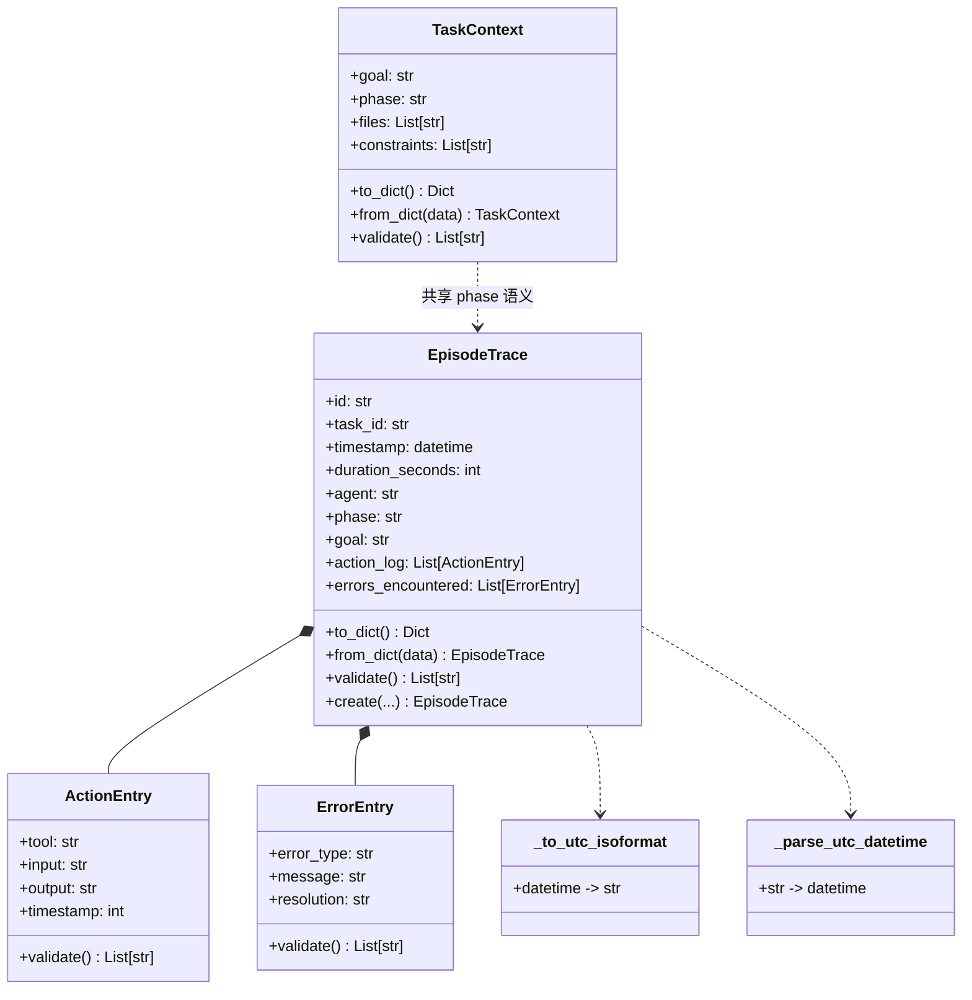
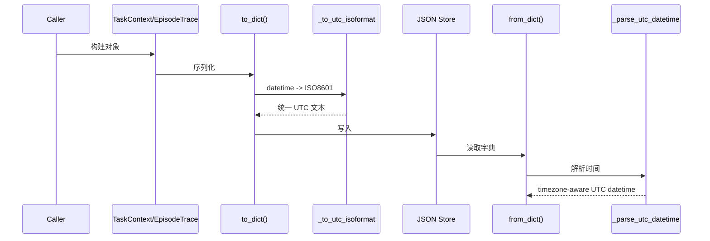

# schemas_and_task_context 模块文档

## 模块概述与存在意义

`schemas_and_task_context` 对应源码 `memory/schemas.py` 中的两个核心契约：`memory.schemas.EpisodeTrace` 与 `memory.schemas.TaskContext`。它们是 Memory System 在“执行事实记录”和“任务语义上下文”两个层面的标准数据结构。这个模块之所以重要，不在于它执行复杂算法，而在于它为上层引擎、检索、API、UI 提供了一套稳定且可验证的数据边界：什么是一次可追溯的任务执行，什么是一次可复用的任务上下文。

从系统设计角度看，该模块的目标是把“记忆对象的定义”与“记忆对象的处理”彻底分离。`EpisodeTrace` 关注事实采样与审计可回放，`TaskContext` 关注最小语义载荷和跨模块传递一致性。这样一来，`MemoryEngine`、`Retrieval`、`UnifiedMemoryAccess` 在演进检索策略或存储实现时，不必反复改写基础字段语义，降低了系统耦合与迁移成本。

如果你要先理解 Memory System 的总体架构，再深入本模块，建议先阅读 [Memory System.md](Memory System.md)；若你更关心本文件中其它 schema（如 `SemanticPattern`、`ProceduralSkill`），可参考 [Schemas.md](Schemas.md)。

---

## 在整体系统中的位置


这条链路体现了两个核心对象的职责分工：`TaskContext` 在任务执行前后提供轻量语义输入，`EpisodeTrace` 在执行过程中沉淀完整事实记录。检索层主要消费 `EpisodeTrace` 的行为、错误、文件、结果等字段，而 UI 和 SDK 则通过序列化结果查看执行轨迹与调试信息。

---

## 组件关系与内部结构



`EpisodeTrace` 是聚合根，`ActionEntry` 与 `ErrorEntry` 是嵌套细粒度事件。`TaskContext` 虽然独立，但和 `EpisodeTrace` 使用一致的 RARV phase 语义（`REASON/ACT/REFLECT/VERIFY`），确保同一任务在“上下文输入”和“执行记录”之间不会出现阶段语义漂移。

---

## 核心组件详解：EpisodeTrace

### 职责

`EpisodeTrace` 描述“一次任务执行发生了什么”。它不仅记录结果（`success/failure/partial`），也记录过程（动作、错误、读写文件、token 成本）和生命周期元数据（importance、access_count）。这使它既可用于检索召回，也可用于审计、复盘、学习抽取。

### 关键字段与语义

- 标识与关联：`id`、`task_id`
- 时间与资源：`timestamp`、`duration_seconds`、`tokens_used`
- 执行语义：`agent`、`phase`、`goal`
- 行为与异常：`action_log: List[ActionEntry]`、`errors_encountered: List[ErrorEntry]`
- 产物与变更面：`artifacts_produced`、`files_read`、`files_modified`、`git_commit`
- 生命周期属性：`importance`、`last_accessed`、`access_count`

### 内部工作方式

`to_dict()` 在序列化时会把 `phase`、`goal`、`files_involved` 放入 `context` 子结构，其中 `files_involved` 来自 `files_read + files_modified` 去重合并。这个设计对外暴露了统一上下文结构，同时保留顶层执行统计字段。

`from_dict()` 的反序列化具备较强兼容性：它优先读取 `context.phase/context.goal`，若不存在再回退到顶层字段；时间字段同时支持 ISO 字符串和 `datetime`；若缺失 `timestamp`，会使用当前 UTC 时间兜底。

`validate()` 不抛异常，而是返回错误列表。这种“聚合错误”模式适合批处理、审计导入、离线修复流程，因为调用方能一次拿到全部问题并统一处理。

### 方法签名与行为说明

```python
EpisodeTrace.create(
    task_id: str,
    agent: str,
    goal: str,
    phase: str = "ACT",
    id_prefix: str = "ep",
) -> EpisodeTrace
```

该工厂方法会生成形如 `ep-YYYY-MM-DD-xxxxxxxx` 的 ID，自动注入 UTC 时间和基础默认值。需要注意：它不会自动调用 `validate()`，调用方若要求强一致写入，应在落库前显式校验。

### 使用示例

```python
from memory.schemas import EpisodeTrace, ActionEntry, ErrorEntry

trace = EpisodeTrace.create(
    task_id="task-1001",
    agent="planner-agent",
    goal="修复 websocket 重连抖动",
    phase="ACT",
)

trace.action_log.append(ActionEntry(
    tool="edit_file",
    input="dashboard/frontend/src/api.ts",
    output="retry backoff logic updated",
    timestamp=18,
))

trace.errors_encountered.append(ErrorEntry(
    error_type="integration_test",
    message="flaky reconnect assertion",
    resolution="stabilize timeout and event ordering",
))

errors = trace.validate()
if errors:
    raise ValueError("; ".join(errors))

payload = trace.to_dict()  # 可直接 JSON dump
```

---

## 核心组件详解：TaskContext

### 职责

`TaskContext` 是任务执行上下文的最小语义模型。它表达“为什么做（goal）”“做到哪一步（phase）”“涉及哪些文件（files）”“有什么限制（constraints）”。与 `EpisodeTrace` 相比，它更适合高频传递、检索前置拼装、Prompt 注入。

### 字段与校验逻辑

`goal` 是硬性必填；`phase` 若存在则必须属于 `VALID_PHASES`；`files` 与 `constraints` 默认空列表。`to_dict()` 输出键名为 `files_involved`，而 `from_dict()` 同时兼容 `files_involved` 与 `files`，体现了向后兼容考虑。

### 使用示例

```python
from memory.schemas import TaskContext

ctx = TaskContext(
    goal="实现 tenant 级别审计过滤",
    phase="REASON",
    files=["dashboard/server.py", "dashboard/models.py"],
    constraints=["不得改变现有 API response schema"],
)

ctx_errors = ctx.validate()
if ctx_errors:
    print("invalid context:", ctx_errors)

serialized = ctx.to_dict()
restored = TaskContext.from_dict(serialized)
```

---

## 序列化、时间处理与数据流



`_to_utc_isoformat()` 与 `_parse_utc_datetime()` 构成该模块时间语义一致性的核心。它们处理 `Z`、`+00:00` 和 naive datetime，但有一个前提：naive 时间会被视为 UTC。如果上游把 naive 时间当本地时区传入，会产生隐式偏移风险。

---

## 边界行为、错误条件与已知限制

本模块的错误主要分两类：结构不完整与语义越界。前者例如 `EpisodeTrace.id/task_id/agent/goal` 缺失，后者例如 `phase` 不在合法集合、`importance` 不在 `[0,1]`、`duration_seconds` 为负值。因为 `validate()` 采用返回列表而非抛异常，若调用方忘记调用校验，非法对象仍可能被序列化并传播。

另一个常见陷阱是字段别名兼容带来的“静默回退”：`from_dict()` 大量使用 `dict.get(..., default)`，当输入字段拼写错误时，系统不会立即报错，而是填默认值并继续。这有利于兼容旧数据，但也可能掩盖集成错误。实践上建议在导入后立即执行 `validate()`，并把错误上报到审计日志。

`EpisodeTrace.to_dict()` 对 `files_involved` 做去重时使用 `set`，这意味着文件顺序不稳定。如果你的消费侧依赖顺序（例如 UI diff 或确定性哈希），请改用 `files_read/files_modified` 原字段，不要依赖 `context.files_involved` 的顺序。

---

## 扩展与定制建议

若你想扩展 `EpisodeTrace` 或 `TaskContext`，建议遵循“先兼容、后收敛”的演进策略。先在 `from_dict()` 提供新旧键兼容映射，再在 `validate()` 添加约束，最后在上游调用链逐步切换。这样可避免旧存量数据一次性失效。

对于 phase 扩展（例如新增 `PLAN`），必须同步更新 `TaskContext.VALID_PHASES` 与 `EpisodeTrace.VALID_PHASES`，并审查依赖 RARV 阶段的模块（如监控时间线、任务看板、策略门控）。如果只改一处，会出现上下文和轨迹阶段不一致的问题。

当你需要新增执行成本字段（如 `latency_ms`、`api_cost_usd`），建议保持“可选 + 默认值 + validate 边界”三件套，并确保 `to_dict()/from_dict()` 双向对称，防止存储和加载时信息丢失。

---

## 与其他模块的协作关系（避免重复）

本模块只定义契约，不负责存储调度与检索决策。具体协作职责建议按以下文档分层阅读：

- 记忆编排与写入生命周期：见 [memory_engine_and_wrappers.md](memory_engine_and_wrappers.md)
- 检索排序、向量召回与预算控制：见 [retrieval_and_progressive_loading.md](retrieval_and_progressive_loading.md)
- 统一入口与跨项目访问：见 [unified_access_and_cross_project.md](unified_access_and_cross_project.md)
- Memory System 总体架构与导航：见 [Memory System.md](Memory System.md)

---

## 维护者速查结论

`schemas_and_task_context` 是 Memory System 的稳定数据边界层。`TaskContext` 提供轻量、可传递的任务语义；`EpisodeTrace` 提供完整、可审计的执行事实。维护这个模块的核心不是“加字段”，而是保证三件事：语义一致（尤其 phase）、序列化对称（to/from 一致）、校验可执行（调用链真实使用 validate）。只要这三件事稳定，上层能力可以自由演进而不破坏系统整体一致性。
