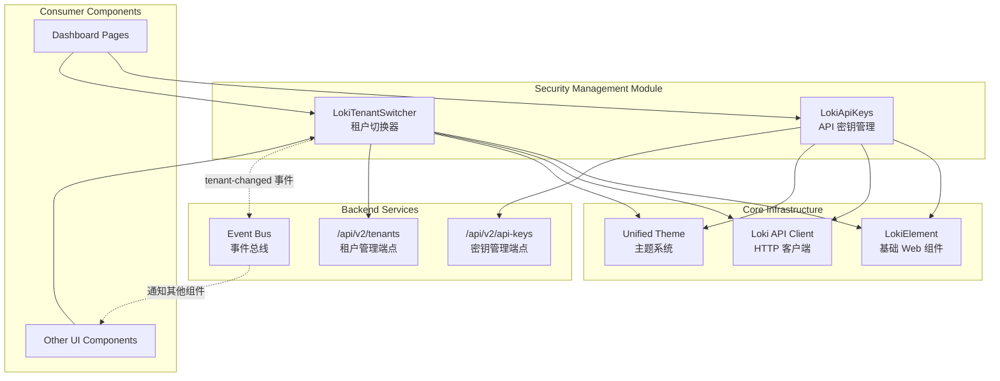
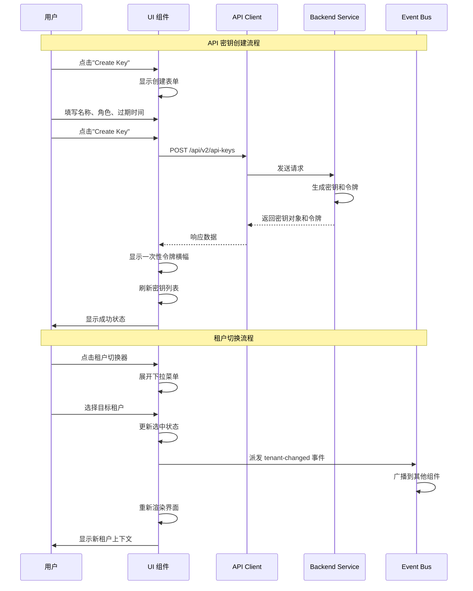

# Security Management Module

## 概述

Security Management 模块是 Loki Dashboard UI 系统中负责安全认证和多租户管理的核心前端组件集合。该模块提供了两个关键的 Web 组件：`LokiApiKeys` 用于 API 密钥的全生命周期管理，`LokiTenantSwitcher` 用于多租户环境下的上下文切换。这两个组件共同构成了系统安全访问控制的用户界面层，确保用户能够安全地管理认证凭据并在多租户环境中灵活切换工作上下文。

### 设计目标

本模块的设计遵循以下核心原则：

**安全性优先**：API 密钥作为敏感认证凭据，其管理界面必须遵循安全最佳实践。密钥值仅在创建时显示一次，之后以掩码形式展示，防止意外泄露。密钥轮换功能支持宽限期配置，确保在轮换过程中服务不中断。

**多租户支持**：现代 SaaS 系统通常需要支持多租户架构。`LokiTenantSwitcher` 组件允许用户在不同的租户上下文之间快速切换，同时保持界面的简洁性和操作的直观性。

**用户体验**：所有安全操作都通过确认对话框、状态反馈和错误处理来确保用户清楚了解其操作的后果。界面采用响应式设计，支持明暗主题切换，与整个 Loki 设计系统保持一致。

**API 驱动架构**：组件通过 RESTful API 与后端服务通信，采用松耦合设计，便于独立开发和测试。所有 API 调用都包含错误处理和加载状态管理。

### 模块定位

Security Management 模块位于 Dashboard UI Components 的 Administration and Infrastructure Components 层级，与 [Audit Compliance](audit_compliance.md) 和 [System Monitoring](system_monitoring.md) 模块共同构成系统的管理基础设施。它依赖于 [Dashboard Backend](dashboard_backend.md) 提供的 API 端点，并与 [Core Theme](core_theme.md) 和 [Unified Styles](unified_styles.md) 模块共享设计系统和样式规范。

## 架构设计

### 组件关系图



### 数据流架构



### 依赖关系

| 依赖模块 | 依赖类型 | 说明 |
|---------|---------|------|
| [Core Theme](core_theme.md) | 强依赖 | 继承 `LokiElement` 基类，获取基础样式和主题支持 |
| [Unified Styles](unified_styles.md) | 强依赖 | 使用统一的设计令牌和样式变量 |
| [API Client](api_client.md) | 强依赖 | 通过 `getApiClient` 获取 HTTP 客户端实例 |
| [Dashboard Backend](dashboard_backend.md) | 运行时依赖 | 消费 `/api/v2/api-keys` 和 `/api/v2/tenants` 端点 |
| [Event Bus](event_bus.md) | 可选依赖 | 租户切换事件可通过事件总线广播 |

## 核心组件详解

### LokiApiKeys

`LokiApiKeys` 是一个完整的 API 密钥管理界面组件，提供密钥的创建、查看、轮换和删除功能。该组件采用 Web Components 标准构建，可独立嵌入任何支持 Custom Elements 的页面中。

#### 组件签名

```javascript
/**
 * @class LokiApiKeys
 * @extends LokiElement
 * @property {string} api-url - API 基础 URL
 * @property {string} theme - 'light' 或 'dark'
 */
```

#### HTML 使用示例

```html
<!-- 基本用法 -->
<loki-api-keys api-url="http://localhost:57374" theme="dark"></loki-api-keys>

<!-- 使用默认 API URL（当前域名） -->
<loki-api-keys theme="light"></loki-api-keys>
```

#### 内部状态管理

组件维护以下内部状态变量：

| 状态变量 | 类型 | 说明 |
|---------|------|------|
| `_loading` | boolean | 加载状态标志 |
| `_error` | string\|null | 错误消息 |
| `_api` | ApiClient | API 客户端实例 |
| `_keys` | Array | 密钥列表数据 |
| `_showCreateForm` | boolean | 是否显示创建表单 |
| `_newToken` | string\|null | 创建后的一次性令牌 |
| `_confirmDeleteId` | string\|null | 待确认删除的密钥 ID |
| `_rotateKeyId` | string\|null | 正在轮换的密钥 ID |
| `_rotateGracePeriod` | string | 轮换宽限期（小时） |
| `_createName` | string | 创建表单 - 名称 |
| `_createRole` | string | 创建表单 - 角色 |
| `_createExpiration` | string | 创建表单 - 过期日期 |

#### 生命周期方法

**connectedCallback()**

组件连接到 DOM 时调用，执行以下操作：
1. 调用父类 `connectedCallback()` 初始化主题系统
2. 通过 `_setupApi()` 配置 API 客户端
3. 通过 `_loadData()` 加载初始密钥列表

```javascript
connectedCallback() {
  super.connectedCallback();
  this._setupApi();
  this._loadData();
}
```

**attributeChangedCallback(name, oldValue, newValue)**

监听属性变化并作出响应：
- `api-url` 变化：更新 API 客户端的 baseUrl 并重新加载数据
- `theme` 变化：应用新的主题样式

```javascript
attributeChangedCallback(name, oldValue, newValue) {
  if (oldValue === newValue) return;
  if (name === 'api-url' && this._api) {
    this._api.baseUrl = newValue;
    this._loadData();
  }
  if (name === 'theme') {
    this._applyTheme();
  }
}
```

**disconnectedCallback()**

组件从 DOM 移除时调用，执行清理操作。当前实现中主要调用父类方法，但预留了扩展点用于清理定时器等资源。

#### 核心操作方法

**_loadData()**

从后端加载 API 密钥列表：

```javascript
async _loadData() {
  try {
    this._loading = true;
    this.render();

    const data = await this._api._get('/api/v2/api-keys');
    this._keys = Array.isArray(data) ? data : (data?.keys || []);
    this._error = null;
  } catch (err) {
    this._error = `Failed to load API keys: ${err.message}`;
  } finally {
    this._loading = false;
  }

  this.render();
}
```

**行为说明**：
- 设置加载状态并触发首次渲染显示加载指示器
- 调用 GET `/api/v2/api-keys` 端点
- 支持两种响应格式：直接返回数组或包含 `keys` 属性的对象
- 错误处理捕获异常并设置错误消息
- 加载完成后触发第二次渲染显示数据

**_createKey()**

创建新的 API 密钥：

```javascript
async _createKey() {
  if (!this._createName.trim()) {
    this._error = 'Key name is required.';
    this.render();
    return;
  }

  try {
    const payload = {
      name: this._createName.trim(),
      role: this._createRole,
    };
    if (this._createExpiration) {
      payload.expiration = this._createExpiration;
    }

    const result = await this._api._post('/api/v2/api-keys', payload);
    this._newToken = result?.token || result?.key || null;
    this._showCreateForm = false;
    this._createName = '';
    this._createRole = 'read';
    this._createExpiration = '';
    this._error = null;
    await this._loadData();
  } catch (err) {
    this._error = `Create failed: ${err.message}`;
    this.render();
  }
}
```

**安全特性**：
- 名称字段必填验证
- 令牌仅在创建响应中返回一次，存储在 `_newToken` 中供一次性显示
- 创建成功后自动清空表单并关闭创建界面
- 自动刷新密钥列表显示新密钥

**_rotateKey(keyId)**

轮换指定密钥：

```javascript
async _rotateKey(keyId) {
  try {
    const payload = {
      grace_period_hours: parseInt(this._rotateGracePeriod, 10) || 24,
    };
    const result = await this._api._post(`/api/v2/api-keys/${keyId}/rotate`, payload);
    this._newToken = result?.token || result?.key || null;
    this._rotateKeyId = null;
    this._error = null;
    await this._loadData();
  } catch (err) {
    this._error = `Rotate failed: ${err.message}`;
    this.render();
  }
}
```

**宽限期机制**：
- 默认宽限期为 24 小时
- 宽限期内旧密钥仍然有效，确保服务不中断
- 轮换后生成新令牌，同样仅显示一次

**_deleteKey(keyId)**

删除指定密钥：

```javascript
async _deleteKey(keyId) {
  try {
    await this._api._delete(`/api/v2/api-keys/${keyId}`);
    this._confirmDeleteId = null;
    this._error = null;
    await this._loadData();
  } catch (err) {
    this._error = `Delete failed: ${err.message}`;
    this._confirmDeleteId = null;
    this.render();
  }
}
```

**安全确认**：
- 删除操作需要二次确认（通过 `_confirmDeleteId` 状态控制）
- 确认对话框防止误操作
- 删除失败时保持确认状态允许重试

#### 辅助函数

**formatKeyTime(timestamp)**

格式化时间戳显示：

```javascript
export function formatKeyTime(timestamp) {
  if (!timestamp) return 'Never';
  try {
    const d = new Date(timestamp);
    return d.toLocaleString([], {
      month: 'short',
      day: 'numeric',
      year: 'numeric',
      hour: '2-digit',
      minute: '2-digit',
    });
  } catch {
    return String(timestamp);
  }
}
```

**maskToken(token)**

掩码处理令牌字符串（用于表格显示）：

```javascript
export function maskToken(token) {
  if (!token || token.length < 12) return '****';
  return token.slice(0, 4) + '****' + token.slice(-4);
}
```

**_escapeHtml(str)**

HTML 转义防止 XSS 攻击：

```javascript
_escapeHtml(str) {
  if (!str) return '';
  return String(str)
    .replace(/&/g, '&amp;')
    .replace(/</g, '&lt;')
    .replace(/>/g, '&gt;')
    .replace(/"/g, '&quot;');
}
```

#### 渲染结构

组件采用 Shadow DOM 封装，渲染结构如下：

```
┌─────────────────────────────────────────────────┐
│  Header                                         │
│  ┌─────────────────┐  ┌─────────────────┐      │
│  │ API Keys (标题)  │  │ Create Key 按钮  │      │
│  └─────────────────┘  └─────────────────┘      │
├─────────────────────────────────────────────────┤
│  New Token Banner (仅创建后显示）                 │
│  ┌─────────────────────────────────────────┐   │
│  │ API Key Created                         │   │
│  │ Copy this token now...                  │   │
│  │ [令牌值 - 可全选复制]                    │   │
│  │ Dismiss                                 │   │
│  └─────────────────────────────────────────┘   │
├─────────────────────────────────────────────────┤
│  Create Form (仅创建模式显示）                    │
│  ┌─────────────────────────────────────────┐   │
│  │ Create New API Key                      │   │
│  │ Name: [输入框]  Role: [下拉]  Expiration: [日期]│
│  │ [Create Key] [Cancel]                   │   │
│  └─────────────────────────────────────────┘   │
├─────────────────────────────────────────────────┤
│  Keys Table                                     │
│  ┌─────────────────────────────────────────┐   │
│  │ Name │ Role │ Created │ Last Used │ ... │   │
│  │──────│──────│─────────│───────────│─────│   │
│  │ key1 │ read │ Jan 1   │ Jan 2     │ ... │   │
│  │      │      │         │           │     │   │
│  └─────────────────────────────────────────┘   │
├─────────────────────────────────────────────────┤
│  Error Banner (仅错误时显示）                     │
└─────────────────────────────────────────────────┘
```

#### 事件处理

组件通过 `_attachEventListeners()` 方法绑定以下交互事件：

| 事件源 | 事件类型 | 处理逻辑 |
|-------|---------|---------|
| Create Key 按钮 | click | 显示创建表单 |
| Dismiss Token 按钮 | click | 隐藏一次性令牌横幅 |
| Submit Create 按钮 | click | 调用 `_createKey()` |
| Cancel Create 按钮 | click | 关闭创建表单 |
| Delete 按钮 | click | 设置 `_confirmDeleteId` 显示确认 |
| Confirm Delete 按钮 | click | 调用 `_deleteKey()` |
| Cancel Delete 按钮 | click | 清除确认状态 |
| Rotate 按钮 | click | 设置 `_rotateKeyId` 显示轮换输入 |
| Confirm Rotate 按钮 | click | 调用 `_rotateKey()` |
| Cancel Rotate 按钮 | click | 清除轮换状态 |

### LokiTenantSwitcher

`LokiTenantSwitcher` 是一个多租户上下文切换器组件，以下拉菜单形式提供租户选择功能。该组件在用户切换租户时派发自定义事件，允许其他组件响应上下文变化。

#### 组件签名

```javascript
/**
 * @class LokiTenantSwitcher
 * @extends LokiElement
 * @fires tenant-changed - 当用户选择不同租户时触发
 * @property {string} api-url - API 基础 URL
 * @property {string} theme - 'light' 或 'dark'
 */
```

#### HTML 使用示例

```html
<!-- 基本用法 -->
<loki-tenant-switcher api-url="http://localhost:57374" theme="dark"></loki-tenant-switcher>

<!-- 监听租户切换事件 -->
<script>
  const switcher = document.querySelector('loki-tenant-switcher');
  switcher.addEventListener('tenant-changed', (e) => {
    console.log('切换到租户:', e.detail.tenantId, e.detail.tenantName);
    // 更新其他组件的租户上下文
  });
</script>
```

#### 内部状态管理

| 状态变量 | 类型 | 说明 |
|---------|------|------|
| `_loading` | boolean | 加载状态标志 |
| `_error` | string\|null | 错误消息 |
| `_api` | ApiClient | API 客户端实例 |
| `_tenants` | Array | 租户列表数据 |
| `_selectedTenantId` | string\|null | 当前选中的租户 ID |
| `_dropdownOpen` | boolean | 下拉菜单展开状态 |
| `_outsideClickHandler` | Function | 外部点击处理函数 |

#### 生命周期方法

**connectedCallback()**

```javascript
connectedCallback() {
  super.connectedCallback();
  this._setupApi();
  this._loadData();

  // 点击外部关闭下拉菜单
  this._outsideClickHandler = (e) => {
    if (this._dropdownOpen && !this.contains(e.target)) {
      this._dropdownOpen = false;
      this.render();
    }
  };
  document.addEventListener('click', this._outsideClickHandler);
}
```

**关键特性**：
- 注册全局点击事件监听器实现点击外部关闭下拉菜单
- 使用 `contains()` 判断点击是否在组件内部

**disconnectedCallback()**

```javascript
disconnectedCallback() {
  super.disconnectedCallback();
  if (this._outsideClickHandler) {
    document.removeEventListener('click', this._outsideClickHandler);
    this._outsideClickHandler = null;
  }
}
```

**内存泄漏防护**：
- 移除全局事件监听器防止内存泄漏
- 清除处理函数引用

#### 核心操作方法

**_loadData()**

加载租户列表：

```javascript
async _loadData() {
  try {
    this._loading = true;
    const data = await this._api._get('/api/v2/tenants');
    this._tenants = Array.isArray(data) ? data : (data?.tenants || []);
    this._error = null;
  } catch (err) {
    this._error = `Failed to load tenants: ${err.message}`;
  } finally {
    this._loading = false;
  }

  this.render();
}
```

**_toggleDropdown()**

切换下拉菜单展开状态：

```javascript
_toggleDropdown() {
  this._dropdownOpen = !this._dropdownOpen;
  this.render();
}
```

**_selectTenant(tenantId, tenantName)**

选择租户并派发事件：

```javascript
_selectTenant(tenantId, tenantName) {
  this._selectedTenantId = tenantId;
  this._dropdownOpen = false;
  this.render();

  this.dispatchEvent(new CustomEvent('tenant-changed', {
    detail: { tenantId, tenantName },
    bubbles: true,
    composed: true,
  }));
}
```

**事件特性**：
- `bubbles: true` - 事件可冒泡到父元素
- `composed: true` - 事件可穿越 Shadow DOM 边界
- `detail` 对象包含 `tenantId` 和 `tenantName`

**_getSelectedTenant()**

获取当前选中的租户对象：

```javascript
_getSelectedTenant() {
  if (this._selectedTenantId == null) return null;
  return this._tenants.find(t => (t.id || t.slug) === this._selectedTenantId) || null;
}
```

#### 辅助函数

**formatTenantLabel(tenant)**

格式化租户显示标签：

```javascript
export function formatTenantLabel(tenant) {
  if (!tenant) return 'Unknown';
  if (tenant.slug && tenant.name) {
    return `${tenant.name} (${tenant.slug})`;
  }
  return tenant.name || tenant.slug || 'Unknown';
}
```

**显示格式**：`租户名称 (租户 slug)`

#### 渲染结构

```
┌─────────────────────────────────────┐
│  Trigger Button                     │
│  ┌─────────────────────────────┐   │
│  │ All Tenants / 租户名称    ▼ │   │
│  └─────────────────────────────┘   │
├─────────────────────────────────────┤
│  Dropdown (仅展开时显示）              │
│  ┌─────────────────────────────┐   │
│  │ All Tenants           *     │   │
│  │────────────────────────────│   │
│  │ Tenant A (tenant-a)         │   │
│  │ Tenant B (tenant-b)   *     │   │
│  │ Tenant C (tenant-c)         │   │
│  └─────────────────────────────┘   │
└─────────────────────────────────────┘
```

#### 事件处理

| 事件源 | 事件类型 | 处理逻辑 |
|-------|---------|---------|
| Trigger 按钮 | click | 切换下拉菜单状态（阻止冒泡） |
| Dropdown 项 | click | 调用 `_selectTenant()`（阻止冒泡） |
| Document | click | 点击外部关闭下拉菜单 |

## API 接口规范

### API 密钥端点

#### GET /api/v2/api-keys

获取 API 密钥列表。

**响应格式**：
```json
[
  {
    "id": "key_abc123",
    "name": "CI/CD Pipeline",
    "role": "read",
    "status": "active",
    "created_at": "2024-01-15T10:30:00Z",
    "last_used_at": "2024-01-20T14:22:00Z",
    "expiration": "2024-12-31T23:59:59Z"
  }
]
```

或

```json
{
  "keys": [...]
}
```

**字段说明**：
| 字段 | 类型 | 说明 |
|-----|------|------|
| id | string | 密钥唯一标识符 |
| name | string | 密钥名称（用户定义） |
| role | string | 角色：read/write/admin |
| status | string | 状态：active/expired/revoked |
| created_at | string | 创建时间（ISO 8601） |
| last_used_at | string\|null | 最后使用时间 |
| expiration | string\|null | 过期时间 |

#### POST /api/v2/api-keys

创建新的 API 密钥。

**请求体**：
```json
{
  "name": "CI/CD Pipeline",
  "role": "read",
  "expiration": "2024-12-31"
}
```

**字段约束**：
| 字段 | 必填 | 类型 | 说明 |
|-----|------|------|------|
| name | 是 | string | 密钥名称，1-100 字符 |
| role | 是 | string | 角色：read/write/admin |
| expiration | 否 | string | 过期日期（YYYY-MM-DD） |

**响应格式**：
```json
{
  "id": "key_abc123",
  "name": "CI/CD Pipeline",
  "role": "read",
  "token": "sk_live_abc123...xyz789",
  "created_at": "2024-01-15T10:30:00Z"
}
```

**安全注意**：`token` 字段仅在创建响应中返回，后续请求不再包含。

#### POST /api/v2/api-keys/{keyId}/rotate

轮换 API 密钥。

**路径参数**：
| 参数 | 类型 | 说明 |
|-----|------|------|
| keyId | string | 密钥 ID |

**请求体**：
```json
{
  "grace_period_hours": 24
}
```

**响应格式**：
```json
{
  "id": "key_abc123",
  "token": "sk_live_new456...uvw012",
  "rotated_at": "2024-01-20T15:00:00Z"
}
```

#### DELETE /api/v2/api-keys/{keyId}

删除 API 密钥。

**路径参数**：
| 参数 | 类型 | 说明 |
|-----|------|------|
| keyId | string | 密钥 ID |

**响应**：204 No Content

### 租户管理端点

#### GET /api/v2/tenants

获取租户列表。

**响应格式**：
```json
[
  {
    "id": "tenant_abc123",
    "slug": "acme-corp",
    "name": "Acme Corporation",
    "created_at": "2024-01-01T00:00:00Z"
  }
]
```

或

```json
{
  "tenants": [...]
}
```

**字段说明**：
| 字段 | 类型 | 说明 |
|-----|------|------|
| id | string | 租户唯一标识符 |
| slug | string | 租户 slug（URL 友好） |
| name | string | 租户显示名称 |
| created_at | string | 创建时间 |

## 配置选项

### 组件属性

两个组件都支持以下属性配置：

| 属性 | 类型 | 默认值 | 说明 |
|-----|------|--------|------|
| api-url | string | window.location.origin | API 服务器基础 URL |
| theme | string | 继承父元素 | 主题模式：light/dark |

### 主题变量

组件使用以下 CSS 自定义属性（设计令牌）：

| 变量 | 说明 | 默认值（Light） | 默认值（Dark） |
|-----|------|----------------|----------------|
| --loki-font-family | 字体族 | 'Inter', -apple-system, sans-serif | 同左 |
| --loki-text-primary | 主文本颜色 | #201515 | #ECEAE3 |
| --loki-text-secondary | 次要文本颜色 | #36342E | #939084 |
| --loki-text-muted | 淡化文本颜色 | #939084 | #6B685E |
| --loki-bg-card | 卡片背景 | #ffffff | #1A1A1E |
| --loki-bg-tertiary | 三级背景 | #ECEAE3 | #2A2A2E |
| --loki-bg-hover | 悬停背景 | #1f1f23 | #3A3A3E |
| --loki-border | 边框颜色 | #ECEAE3 | #3A3A3E |
| --loki-border-light | 浅色边框 | #C5C0B1 | #4A4A4E |
| --loki-accent | 强调色 | #553DE9 | #7B61FF |
| --loki-accent-muted | 淡化强调色 | rgba(139, 92, 246, 0.15) | 同左 |
| --loki-green | 成功色 | #22c55e | #16a34a |
| --loki-green-muted | 淡化成功色 | rgba(34, 197, 94, 0.15) | 同左 |
| --loki-red | 危险色 | #ef4444 | #dc2626 |
| --loki-red-muted | 淡化危险色 | rgba(239, 68, 68, 0.15) | 同左 |
| --loki-yellow | 警告色 | #eab308 | #ca8a04 |
| --loki-yellow-muted | 淡化警告色 | rgba(234, 179, 8, 0.15) | 同左 |

## 使用场景

### 场景一：新用户创建第一个 API 密钥

```javascript
// 1. 用户访问 API Keys 页面
// 2. 组件加载显示空状态
// 3. 用户点击"Create Key"按钮
// 4. 填写表单：
//    - Name: "My First Key"
//    - Role: "read"
//    - Expiration: (可选)
// 5. 点击"Create Key"提交
// 6. 显示一次性令牌横幅
// 7. 用户复制令牌
// 8. 点击"Dismiss"关闭横幅
```

**注意事项**：
- 令牌仅在创建时显示一次，关闭后无法再次查看
- 建议用户立即将令牌保存到安全位置
- 丢失令牌需要轮换操作生成新令牌

### 场景二：定期密钥轮换

```javascript
// 1. 用户找到需要轮换的密钥
// 2. 点击"Rotate"按钮
// 3. 输入宽限期（默认 24 小时）
// 4. 点击"Go"确认
// 5. 显示新令牌
// 6. 更新所有使用该密钥的客户端
// 7. 宽限期结束后旧密钥自动失效
```

**宽限期建议**：
- CI/CD 管道：24-48 小时
- 生产服务：4-12 小时
- 开发环境：1-2 小时

### 场景三：多租户工作流

```javascript
// 1. 用户属于多个租户
// 2. 点击租户切换器
// 3. 选择目标租户
// 4. 组件派发 tenant-changed 事件
// 5. 其他组件监听事件并更新数据
// 6. 用户在新租户上下文中工作
```

**事件监听示例**：

```javascript
// 在父组件或页面中
const switcher = document.querySelector('loki-tenant-switcher');
const taskBoard = document.querySelector('loki-task-board');
const memoryBrowser = document.querySelector('loki-memory-browser');

switcher.addEventListener('tenant-changed', (e) => {
  const { tenantId, tenantName } = e.detail;
  
  // 更新所有子组件的租户上下文
  taskBoard.setAttribute('tenant-id', tenantId);
  memoryBrowser.setAttribute('tenant-id', tenantId);
  
  // 可选：保存到本地存储
  localStorage.setItem('selected-tenant-id', tenantId);
});

// 页面加载时恢复上次选择的租户
const savedTenantId = localStorage.getItem('selected-tenant-id');
if (savedTenantId) {
  switcher._selectedTenantId = savedTenantId;
}
```

### 场景四：密钥泄露应急响应

```javascript
// 1. 发现密钥可能泄露
// 2. 立即找到对应密钥
// 3. 点击"Rotate"生成新密钥
// 4. 设置宽限期为 0（立即生效）
// 5. 更新所有客户端使用新密钥
// 6. 可选：删除旧密钥记录
```

## 扩展与定制

### 扩展 LokiApiKeys

#### 添加自定义角色

```javascript
// 继承并扩展组件
class CustomApiKeys extends LokiApiKeys {
  _getRoles() {
    return [
      { value: 'read', label: 'Read Only' },
      { value: 'write', label: 'Read & Write' },
      { value: 'admin', label: 'Administrator' },
      { value: 'billing', label: 'Billing Manager' },  // 自定义角色
      { value: 'audit', label: 'Audit Viewer' },       // 自定义角色
    ];
  }
  
  render() {
    // 调用父类渲染
    super.render();
    
    // 添加自定义逻辑
    // ...
  }
}

customElements.define('custom-api-keys', CustomApiKeys);
```

#### 添加密钥使用统计

```javascript
class AnalyticsApiKeys extends LokiApiKeys {
  async _loadData() {
    await super._loadData();
    
    // 加载额外使用统计
    for (const key of this._keys) {
      const stats = await this._api._get(`/api/v2/api-keys/${key.id}/stats`);
      key.usage_count = stats?.usage_count || 0;
      key.last_24h_requests = stats?.last_24h_requests || 0;
    }
    
    this.render();
  }
  
  _getStyles() {
    return super._getStyles() + `
      .usage-stats {
        font-size: 10px;
        color: var(--loki-text-muted);
      }
    `;
  }
}
```

### 扩展 LokiTenantSwitcher

#### 添加租户创建功能

```javascript
class CreatableTenantSwitcher extends LokiTenantSwitcher {
  _showCreateTenant() {
    const name = prompt('Enter new tenant name:');
    if (!name) return;
    
    this._api._post('/api/v2/tenants', { name })
      .then(() => this._loadData())
      .catch(err => alert('Failed to create tenant: ' + err.message));
  }
  
  render() {
    super.render();
    
    const s = this.shadowRoot;
    if (!s) return;
    
    // 添加创建按钮
    const createBtn = document.createElement('button');
    createBtn.textContent = '+ New Tenant';
    createBtn.className = 'create-tenant-btn';
    createBtn.onclick = () => this._showCreateTenant();
    
    const header = s.querySelector('.header');
    if (header) header.appendChild(createBtn);
  }
}
```

#### 添加租户搜索功能

```javascript
class SearchableTenantSwitcher extends LokiTenantSwitcher {
  constructor() {
    super();
    this._searchQuery = '';
  }
  
  _getFilteredTenants() {
    if (!this._searchQuery) return this._tenants;
    
    const query = this._searchQuery.toLowerCase();
    return this._tenants.filter(t => 
      (t.name && t.name.toLowerCase().includes(query)) ||
      (t.slug && t.slug.toLowerCase().includes(query))
    );
  }
  
  render() {
    // 使用过滤后的租户列表
    const originalTenants = this._tenants;
    this._tenants = this._getFilteredTenants();
    super.render();
    this._tenants = originalTenants;
  }
}
```

## 错误处理

### 常见错误场景

| 错误类型 | 触发条件 | 用户可见消息 | 建议操作 |
|---------|---------|-------------|---------|
| 网络错误 | API 服务器不可达 | "Failed to load API keys: Network error" | 检查网络连接，刷新页面 |
| 认证失败 | Token 过期或无效 | "Failed to load API keys: 401 Unauthorized" | 重新登录，检查会话 |
| 权限不足 | 用户无 API 密钥管理权限 | "Failed to load API keys: 403 Forbidden" | 联系管理员获取权限 |
| 创建失败 | 名称重复或格式无效 | "Create failed: Name already exists" | 使用唯一名称重试 |
| 轮换失败 | 密钥不存在或已删除 | "Rotate failed: Key not found" | 刷新列表确认密钥状态 |
| 删除失败 | 密钥正在使用中 | "Delete failed: Key is in use" | 先轮换密钥再删除 |

### 错误恢复策略

```javascript
// 组件内部错误处理模式
async _loadData() {
  try {
    this._loading = true;
    this.render();
    
    const data = await this._api._get('/api/v2/api-keys');
    this._keys = Array.isArray(data) ? data : (data?.keys || []);
    this._error = null;
  } catch (err) {
    // 分类处理不同错误
    if (err.status === 401) {
      this._error = 'Session expired. Please log in again.';
      // 可选：触发全局登出
      // window.dispatchEvent(new CustomEvent('auth-required'));
    } else if (err.status === 403) {
      this._error = 'You do not have permission to manage API keys.';
    } else if (err.status === 503) {
      this._error = 'Service temporarily unavailable. Please try again later.';
    } else {
      this._error = `Failed to load API keys: ${err.message}`;
    }
  } finally {
    this._loading = false;
    this.render();
  }
}
```

## 安全考虑

### 令牌处理最佳实践

1. **一次性显示**：令牌仅在创建/轮换响应中显示一次，之后不再可读
2. **掩码显示**：表格中使用 `maskToken()` 函数显示部分令牌
3. **安全传输**：所有 API 通信必须使用 HTTPS
4. **本地存储**：避免在 localStorage 中存储完整令牌
5. **剪贴板清理**：建议用户复制后立即清理剪贴板

### XSS 防护

所有用户输入都通过 `_escapeHtml()` 函数处理：

```javascript
_escapeHtml(str) {
  if (!str) return '';
  return String(str)
    .replace(/&/g, '&amp;')
    .replace(/</g, '&lt;')
    .replace(/>/g, '&gt;')
    .replace(/"/g, '&quot;');
}
```

### CSRF 防护

- 所有状态修改操作（创建、轮换、删除）都使用 POST/DELETE 方法
- 后端应验证 CSRF Token 或 SameSite Cookie 属性
- 组件本身不处理认证，依赖 API Client 的认证机制

### 权限模型

| 角色 | 创建密钥 | 查看密钥 | 轮换密钥 | 删除密钥 | 切换租户 |
|-----|---------|---------|---------|---------|---------|
| read | ✗ | ✓ | ✗ | ✗ | ✓ |
| write | ✓ | ✓ | ✓ | ✗ | ✓ |
| admin | ✓ | ✓ | ✓ | ✓ | ✓ |

## 性能优化

### 渲染优化

1. **条件渲染**：仅在状态变化时调用 `render()`
2. **Shadow DOM**：使用 Shadow DOM 隔离样式，减少 CSS 重计算
3. **事件委托**：使用 `querySelectorAll` 批量绑定事件

### 数据加载优化

```javascript
// 避免重复加载
async _loadData() {
  if (this._loading) return;  // 防止并发请求
  
  try {
    this._loading = true;
    // ...
  } finally {
    this._loading = false;
  }
}
```

### 内存管理

```javascript
disconnectedCallback() {
  super.disconnectedCallback();
  // LokiTenantSwitcher 清理全局事件监听器
  if (this._outsideClickHandler) {
    document.removeEventListener('click', this._outsideClickHandler);
    this._outsideClickHandler = null;
  }
  // 清理其他资源（定时器、Interval 等）
}
```

## 测试指南

### 单元测试示例

```javascript
import { LokiApiKeys, formatKeyTime, maskToken } from './loki-api-keys.js';

describe('LokiApiKeys', () => {
  describe('formatKeyTime', () => {
    it('should format valid timestamp', () => {
      const result = formatKeyTime('2024-01-15T10:30:00Z');
      expect(result).toMatch(/\w+ \d+, \d+, \d+:\d+/);
    });
    
    it('should return "Never" for null', () => {
      expect(formatKeyTime(null)).toBe('Never');
    });
    
    it('should return original string for invalid date', () => {
      expect(formatKeyTime('invalid')).toBe('invalid');
    });
  });
  
  describe('maskToken', () => {
    it('should mask long tokens', () => {
      expect(maskToken('sk_live_abc123xyz789'))
        .toBe('sk_l****z789');
    });
    
    it('should return **** for short tokens', () => {
      expect(maskToken('short')).toBe('****');
    });
    
    it('should return **** for empty string', () => {
      expect(maskToken('')).toBe('****');
    });
  });
  
  describe('Component', () => {
    it('should render without errors', async () => {
      const el = document.createElement('loki-api-keys');
      document.body.appendChild(el);
      await el.updateComplete;
      expect(el.shadowRoot).toBeTruthy();
    });
    
    it('should respond to api-url attribute changes', async () => {
      const el = document.createElement('loki-api-keys');
      el.setAttribute('api-url', 'http://test.com');
      document.body.appendChild(el);
      await el.updateComplete;
      expect(el._api.baseUrl).toBe('http://test.com');
    });
  });
});
```

### 集成测试场景

```javascript
describe('Integration Tests', () => {
  it('should complete full key lifecycle', async () => {
    // 1. Create key
    const createResponse = await api.post('/api/v2/api-keys', {
      name: 'Test Key',
      role: 'read'
    });
    expect(createResponse.token).toBeDefined();
    
    // 2. List keys
    const listResponse = await api.get('/api/v2/api-keys');
    expect(listResponse.length).toBeGreaterThan(0);
    
    // 3. Rotate key
    const rotateResponse = await api.post(
      `/api/v2/api-keys/${createResponse.id}/rotate`,
      { grace_period_hours: 1 }
    );
    expect(rotateResponse.token).toBeDefined();
    expect(rotateResponse.token).not.toBe(createResponse.token);
    
    // 4. Delete key
    await api.delete(`/api/v2/api-keys/${createResponse.id}`);
    
    // 5. Verify deletion
    const finalList = await api.get('/api/v2/api-keys');
    expect(finalList.find(k => k.id === createResponse.id)).toBeUndefined();
  });
  
  it('should emit tenant-changed event', async () => {
    const switcher = document.createElement('loki-tenant-switcher');
    document.body.appendChild(switcher);
    
    const eventPromise = new Promise(resolve => {
      switcher.addEventListener('tenant-changed', resolve);
    });
    
    // Simulate tenant selection
    switcher._selectTenant('tenant-123', 'Test Tenant');
    
    const event = await eventPromise;
    expect(event.detail.tenantId).toBe('tenant-123');
    expect(event.detail.tenantName).toBe('Test Tenant');
  });
});
```

## 相关模块

- [Dashboard Backend](dashboard_backend.md) - 提供 API 密钥和租户管理的后端端点
- [Core Theme](core_theme.md) - 提供基础 Web 组件类和主题系统
- [Unified Styles](unified_styles.md) - 提供统一的设计令牌和样式规范
- [API Client](api_client.md) - 提供 HTTP 客户端封装
- [Audit Compliance](audit_compliance.md) - 记录密钥管理操作的审计日志
- [Event Bus](event_bus.md) - 支持租户切换事件的广播和订阅

## 版本历史

| 版本 | 日期 | 变更说明 |
|-----|------|---------|
| 1.0.0 | 2024-01-01 | 初始版本，包含 LokiApiKeys 和 LokiTenantSwitcher |
| 1.1.0 | 2024-02-15 | 添加密钥轮换宽限期配置 |
| 1.2.0 | 2024-03-20 | 添加租户切换事件广播功能 |
| 1.3.0 | 2024-04-10 | 改进错误处理和加载状态显示 |

## 故障排查

### 问题：密钥列表无法加载

**可能原因**：
1. API 服务器不可达
2. 认证 Token 过期
3. 用户无权限

**排查步骤**：
```javascript
// 1. 检查网络请求
const response = await fetch('/api/v2/api-keys');
console.log('Status:', response.status);

// 2. 检查认证
const authHeader = localStorage.getItem('auth-token');
console.log('Auth token exists:', !!authHeader);

// 3. 检查权限
const user = await fetch('/api/v2/user').then(r => r.json());
console.log('User roles:', user.roles);
```

### 问题：租户切换后数据未更新

**可能原因**：
1. 其他组件未监听 tenant-changed 事件
2. 事件未正确冒泡
3. 组件未重新加载数据

**排查步骤**：
```javascript
// 1. 验证事件派发
switcher.addEventListener('tenant-changed', (e) => {
  console.log('Event received:', e.detail);
});

// 2. 检查事件配置
console.log('Event bubbles:', event.bubbles);
console.log('Event composed:', event.composed);

// 3. 手动触发数据刷新
taskBoard._loadData();
memoryBrowser._loadData();
```

### 问题：主题切换不生效

**可能原因**：
1. CSS 变量未正确定义
2. 组件未调用 `_applyTheme()`
3. Shadow DOM 样式隔离问题

**排查步骤**：
```javascript
// 1. 检查 CSS 变量
const styles = getComputedStyle(document.documentElement);
console.log('--loki-bg-card:', styles.getPropertyValue('--loki-bg-card'));

// 2. 手动应用主题
component._applyTheme();
component.render();

// 3. 检查 Shadow DOM
const shadowStyles = component.shadowRoot.querySelector('style');
console.log('Shadow styles:', shadowStyles.textContent);
```
