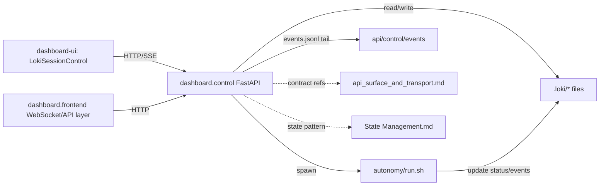
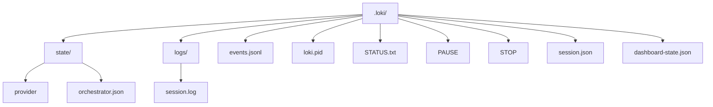
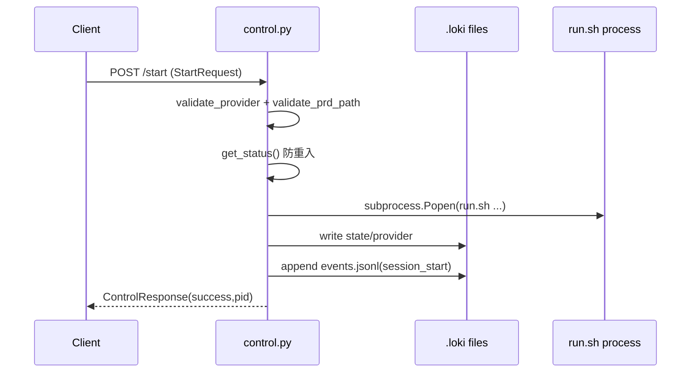
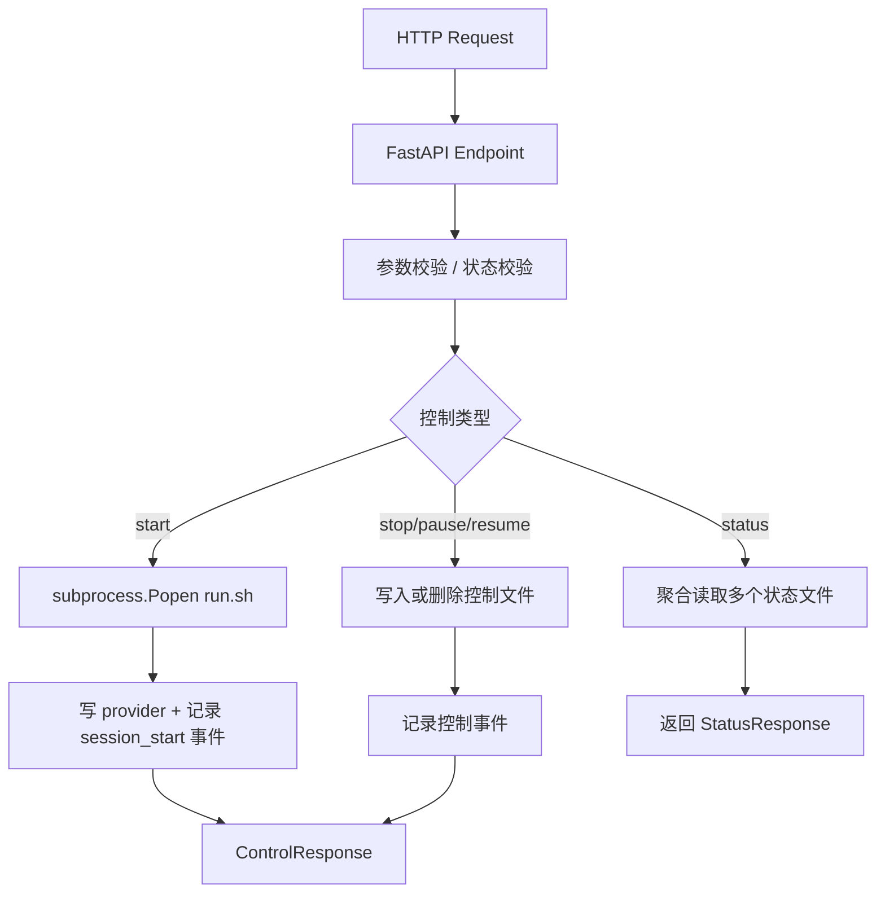
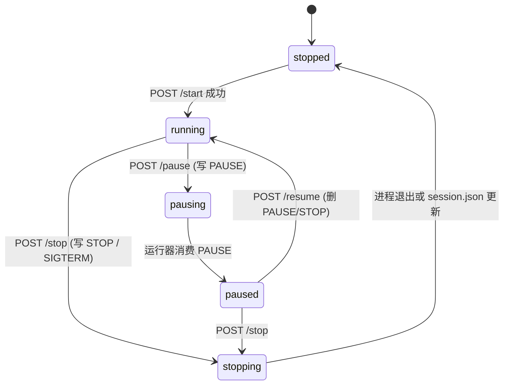
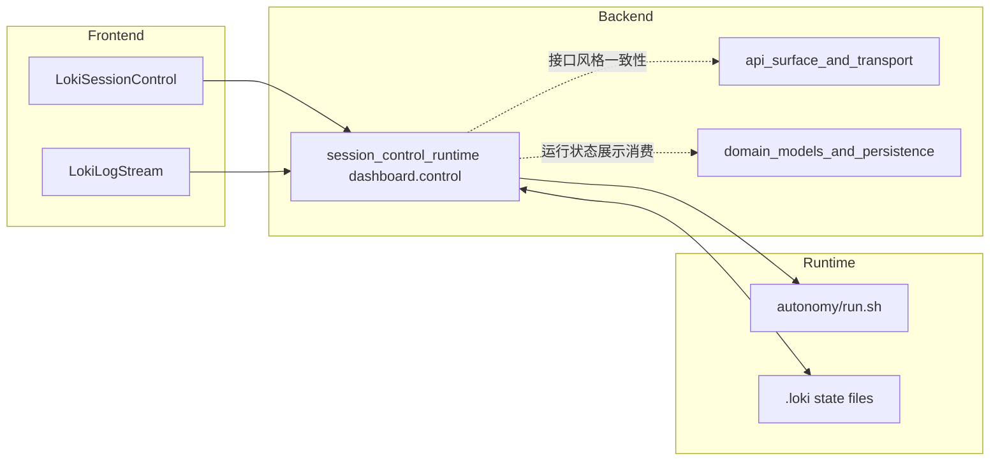

# session_control_runtime 模块文档

## 模块概览

`session_control_runtime` 对应后端文件 `dashboard/control.py`，它实现了一组轻量但关键的会话控制 API：启动、停止、暂停、恢复、状态查询、事件流和日志读取。这个模块存在的核心原因是把“Loki 运行时会话控制”从复杂的调度执行逻辑中剥离出来，以一个稳定的 HTTP 接口暴露给 Dashboard、CLI 或其他自动化工具，从而让控制面（control plane）和执行面（data/execution plane）解耦。

从设计上看，它并不尝试直接管理完整任务生命周期，而是采用**文件信号 + 进程探活 + SSE 推送**的策略：运行器通过 `run.sh` 启动，控制命令通过写入 `PAUSE`/`STOP` 等控制文件发送，状态通过读取 `.loki` 目录内若干状态文件聚合，前端通过 `/api/control/events` 获取实时更新。这种实现简单、可观测、跨进程边界清晰，且易于在本地开发环境和单机部署中快速落地。

---

## 在系统中的位置与职责边界

在 Dashboard Backend 模块树中，`session_control_runtime` 目前核心组件是 `dashboard.control.StartRequest`，但实际文件同时定义了完整控制 API。它与其他模块的关系如下：



这个模块的职责是“控制入口与状态聚合”，而不是“业务任务编排引擎”。真正执行任务的是 `run.sh` 与其下游运行时；这个模块只负责：

- 接收控制请求并校验输入；
- 启动/终止执行进程或写入控制信号文件；
- 统一读取散落状态并返回结构化响应；
- 向前端提供 SSE 增量事件流。

关于 Dashboard 更广泛 API 结构建议参考 [api_surface_and_transport.md](api_surface_and_transport.md)，关于状态文件与通知机制可参考 [State Management.md](State%20Management.md)。

---

## 核心数据模型

### `StartRequest`

`StartRequest` 是该模块在模块树中标记的核心组件，用于 `/api/control/start` 的请求体。字段如下：

```python
class StartRequest(BaseModel):
    prd: Optional[str] = None
    provider: str = "claude"
    parallel: bool = False
    background: bool = True
```

- `prd`: 可选的 PRD 文件路径。若提供，会作为 `run.sh` 的尾随参数传入。
- `provider`: 模型供应商，默认 `claude`。当前仅允许 `claude`、`codex`、`gemini`。
- `parallel`: 是否开启并行执行模式，对应 `--parallel`。
- `background`: 是否后台启动，对应 `--bg`。

`StartRequest` 内置两个显式校验方法：

1. `validate_provider()`：白名单校验，非允许值抛出 `ValueError`。
2. `validate_prd_path()`：路径安全与存在性校验，包含以下保护：
   - 禁止出现 `..` 路径穿越片段；
   - 路径必须存在且是文件；
   - 路径需位于当前工作目录或用户 Home 目录内。

这意味着它不是简单 schema，而是携带了控制接口最关键的输入安全策略。

### 其他响应模型

文件中还定义：

- `StatusResponse`: `/api/control/status` 返回的会话快照（状态、PID、阶段、任务、provider、iteration 等）。
- `ControlResponse`: 启停/暂停/恢复接口通用返回体（`success/message/pid`）。

这两个模型确保控制 API 对前端稳定输出，不暴露底层状态文件细节。

---

## 运行时文件与状态约定

模块大量依赖 `.loki` 目录约定：



关键点是：控制状态并非全由内存持有，而是通过文件实现跨进程共享。这带来两个特征：

第一，重启 API 进程后仍能恢复大部分状态识别能力（因为状态在磁盘）。  
第二，状态一致性依赖写入原子性和约定文件格式，所以模块引入了 `atomic_write_json()` 来降低竞态风险。

---

## 关键函数与内部机制

## `find_skill_dir()`

该函数在多个候选目录中定位 skill 根目录，判定条件是同时存在 `SKILL.md` 与 `autonomy/run.sh`。如果全部失败则回退到当前工作目录。它使部署位置更灵活，支持用户目录、源码目录、本地执行目录三类场景。

## `atomic_write_json(file_path, data, use_lock=True)`

这是本模块并发安全的核心基础设施：

1. 在目标目录创建临时文件；
2. 可选加 `flock` 排他锁（平台不支持时降级）；
3. 写入 JSON、`flush`、`fsync`；
4. `os.rename` 原子替换目标文件；
5. 出错时清理临时文件并抛 `RuntimeError`。

该函数主要用于更新 `session.json` 等关键状态，避免 TOCTOU 问题和写半截文件。

## `get_status()`

`get_status()` 是状态聚合核心。它不是读取单一数据源，而是多源合并：

- `loki.pid` + `os.kill(pid, 0)`：判断进程是否存活；
- `session.json`：当没有 PID 但有“skill-invoked”会话时，尝试识别为运行中；
- 6 小时陈旧检查：`session.json.status == running` 且 `startedAt` 过老会被回写为 `stopped`；
- `PAUSE` / `STOP` 文件存在性：决定运行态细分为 `paused` 或 `stopping`；
- `dashboard-state.json`：提取 `phase`、`iteration`、`complexity`、待办任务数量；
- `state/provider`：读取 provider；
- `state/orchestrator.json`：提取 `currentTask`。

最终返回 `StatusResponse`，并附加当前 UTC 时间戳。

---

## API 端点说明

### 1) `GET /api/control/health`

返回最小健康信息：`{"status":"ok","version":...}`。适合探针和基本连通性检查。

### 2) `GET /api/control/status`

调用 `get_status()` 返回聚合状态。前端控制面板通常以此作为页面初始状态来源。

### 3) `POST /api/control/start`

启动流程：



行为细节：

- 若当前状态是 `running`，返回 `409` 冲突，防止重复启动。
- 若找不到 `run.sh`，返回 `500`。
- 子进程标准输出和错误被丢弃到 `DEVNULL`，日志依赖运行器自身写文件。
- `start_new_session=True` 让新进程脱离当前进程会话，减少 API 进程退出时对子进程影响。

### 4) `POST /api/control/stop`

停止采取“温和 + 直接”双路径：

- 写入 `STOP` 文件，通知运行器优雅停机；
- 读取 `loki.pid` 并尝试发送 `SIGTERM`；
- 若存在 `session.json`，将 `status` 原子改写为 `stopped`；
- 记录 `session_stop` 事件。

### 5) `POST /api/control/pause`

写 `PAUSE` 文件并记录 `session_pause` 事件。语义是“当前任务完成后暂停”，具体何时生效由运行器轮询/检查逻辑决定。

### 6) `POST /api/control/resume`

删除 `PAUSE` 和 `STOP` 文件并写 `session_resume` 事件。这里体现了文件信号机制的简洁性：恢复动作本质是移除阻塞条件。

### 7) `GET /api/control/events`

返回 SSE 流：

- 连接建立时先发一次当前 `status`；
- 每 2 秒推送一个 `event: status`；
- 同时 tail `events.jsonl` 新增行，并以 `event: log` 推送。

这是 Dashboard 实时会话面板的主要数据源之一（前端组件见 [LokiSessionControl.md](LokiSessionControl.md)）。

### 8) `GET /api/control/logs?lines=50`

读取 `.loki/logs/session.log` 末尾 N 行，`lines` 被限制在 `1..10000`。用于日志面板按需拉取。

---

## 配置项与部署行为

模块支持以下环境变量：

- `LOKI_DIR`：运行时目录，默认 `.loki`。
- `LOKI_DASHBOARD_CORS`：允许的 CORS origins，默认 `http://localhost:57374,http://127.0.0.1:57374`。
- `LOKI_DASHBOARD_PORT`：直接运行时 uvicorn 端口，默认 `57374`。
- `LOKI_DASHBOARD_HOST`：直接运行时 uvicorn 主机，默认 `127.0.0.1`。

本地启动示例：

```bash
uvicorn dashboard.control:app --host 0.0.0.0 --port 57374
```

调用示例：

```bash
curl -X POST http://127.0.0.1:57374/api/control/start \
  -H "Content-Type: application/json" \
  -d '{"provider":"claude","parallel":false,"background":true}'
```

SSE 监听示例：

```bash
curl -N http://127.0.0.1:57374/api/control/events
```

---

## 扩展建议

如果你要扩展该模块（例如新增 `restart`、`step`、`cancel_task`），建议遵循当前约束：

先保证“文件信号语义”与运行器一致，再定义 API 行为。不要只加接口不加运行器解释逻辑，否则会出现“响应成功但实际无效”的假控制。

实现层面建议复用三种模式：

- 输入校验模式：像 `StartRequest` 一样，把关键安全校验放到模型方法；
- 状态聚合模式：在 `get_status()` 集中读取，避免分散端点各读各的；
- 事件记录模式：所有控制动作都 `emit_event`，确保审计与回放可追踪。

若未来要改为消息总线驱动，可参考 API 服务侧事件系统文档 [runtime_services.md](runtime_services.md) 与 [Event Bus.md](Event%20Bus.md)，逐步把文件 tail 迁移为统一事件通道。

---

## 边界条件、错误与已知限制

这个模块整体稳健，但有一些明确限制与运维注意事项：

- `fcntl.flock` 在部分平台（尤其非 Unix）可能不可用，代码会降级为无锁；这意味着跨平台强一致写保护能力不同。
- `start_session` 启动子进程后并不保证业务已真正进入运行态，只保证进程已被拉起；真实状态仍依赖后续状态文件更新。
- `get_status()` 使用文件快照拼接，存在短暂读到“混合时刻”数据的可能（例如 phase 与 currentTask 来自不同写入周期）。
- `session.json` 的 6 小时陈旧判断是经验阈值，不一定适配超长任务；若任务天然 >6h 可能误判并回写 `stopped`。
- `/api/control/events` 是轮询 + 文件尾读实现，连接很多时可能增加 I/O 开销；大规模并发场景需要更强事件分发层。
- `logs` 接口一次性读取整个日志文件再切片，超大文件场景会有内存压力。

错误码语义上，最需要前端正确处理的是：

- `400`：参数校验失败（provider 或 PRD 路径）；
- `409`：已有运行会话，拒绝重复启动；
- `500`：运行环境或内部异常（如 `run.sh` 缺失、子进程启动失败）。

---

## 测试与排障建议

排障时建议先看三类证据：

1. `/api/control/status` 返回值，确认状态机视角；
2. `.loki/events.jsonl` 与 `/api/control/events` 输出，确认控制命令是否被记录；
3. `.loki/logs/session.log`，确认执行器是否实际响应控制文件。

如果出现“点了暂停但不停”，优先检查运行器是否实现了对 `PAUSE` 文件的检查；控制 API 只负责发信号，不负责执行器内部中断策略。

---

## 与相关文档的关系

- Dashboard 后端整体： [Dashboard Backend.md](Dashboard%20Backend.md)
- API 传输与接口面： [api_surface_and_transport.md](api_surface_and_transport.md)
- 前端会话控制组件： [LokiSessionControl.md](LokiSessionControl.md)
- 状态管理基础设施： [State Management.md](State%20Management.md)
- 运行时服务（事件、状态观察等）： [runtime_services.md](runtime_services.md)

本文件聚焦 `session_control_runtime` 的控制路径与内部机制，不重复上述模块中更广泛的系统性内容。


---

## 内部实现深潜：从请求到进程控制的完整执行链

为了帮助首次接触该模块的开发者快速建立“代码级心智模型”，下面按照调用路径把内部机制拆开说明。可以把 `dashboard/control.py` 理解为一个薄控制层：它不掌握复杂调度逻辑，而是负责把 HTTP 请求转换成文件信号、进程操作和状态聚合。



这条链路的设计价值在于“控制面幂等可重试，执行面可独立演进”。API 本身做的事情非常可预测：接收、校验、落盘、发信号、回包。它不会把业务执行细节耦合在请求线程内，因此接口延迟和故障模型都更可控。

### `StartRequest`：输入契约与安全边界

`StartRequest` 除了字段定义，还承载了显式的安全校验逻辑，这一点在扩展时非常关键。`validate_provider()` 本质是供应商白名单守卫，防止未知 provider 被拼接到命令行参数中。`validate_prd_path()` 则建立了路径层面的三重边界：禁止路径穿越片段、要求目标存在且为文件、限制路径落在当前工作目录或用户 Home 下。它的返回值是 `None`，但通过异常驱动错误分支：任何校验失败都由上层端点捕获并映射为 HTTP 400。

这种“模型内校验 + 端点层转换为 HTTPException”的分层让输入治理更清晰。后续若新增字段（例如 `profile`、`maxIterations`），建议继续沿用这个模式，把可复用的安全规则放在请求模型方法中，而不是散落在端点函数里。

### `atomic_write_json(file_path, data, use_lock=True)`：状态文件一致性保障

这个函数接收目标路径、字典数据和是否加锁开关，返回值同样是 `None`。它的副作用是创建临时文件、写盘、原子替换目标文件。错误时抛出 `RuntimeError`，由调用方决定吞掉还是上抛。与普通 `write_text()` 相比，它显式解决了两个问题：其一是写入中断导致半文件，借助临时文件 + `os.rename` 避免此类损坏；其二是并发写竞争，在支持 `fcntl` 的平台上增加排他锁。

需要注意，该函数并不保证“跨平台同等锁语义”。在不支持 `flock` 的环境里会自动降级为无锁但仍原子替换，所以它保证“单次写入原子”，不保证“多写者串行化”。

### `get_status()`：多源状态拼装器

`get_status()` 无参数，返回 `StatusResponse`。它是模块内部最值得阅读的函数，因为它把运行态识别做成了“分层证据汇聚”：先看 PID 与进程存活，再看 `session.json` 的 skill-invoked 场景兜底，再叠加 `PAUSE/STOP` 信号决定细粒度状态。随后继续从 `dashboard-state.json`、`state/provider`、`state/orchestrator.json` 抽取 UI 所需字段。

这意味着 `StatusResponse` 的每个字段可能来自不同文件、不同写入周期。模块接受这种“最终一致性快照”而不是严格事务一致性，因为控制面更看重可用性和低耦合。你在排障时如果看到 `currentPhase` 和 `currentTask` 轻微不匹配，通常是正常瞬时现象，不一定是 bug。

### `start_session(request)`：子进程拉起与防重入

`start_session` 的参数是 `StartRequest`，返回 `ControlResponse`，主要副作用包括启动新进程、写入 `state/provider`、追加 `events.jsonl`。它先做输入校验，再做状态防重入校验（运行中返回 409），然后确认 `RUN_SH` 存在，最后用 `subprocess.Popen` 拉起执行器。这里使用 `start_new_session=True` 的意义是把运行进程从当前会话剥离，降低 API 宕机对执行进程的连带影响。

需要特别理解：接口返回成功仅代表“进程已尝试启动”，不代表任务一定已进入稳定运行态。真正的运行态确认应通过后续 `/api/control/status` 或 `/api/control/events` 观察。

### `stop_session()`：优雅停机优先，强制信号兜底

`stop_session` 无输入，返回 `ControlResponse`。它先写 `STOP` 文件以触发运行器的优雅退出路径，再尝试对 PID 发 `SIGTERM`。若检测到 `session.json`，会把 `status` 改为 `stopped` 并用 `atomic_write_json` 落盘。这里的副作用包括文件写入、进程信号发送和事件日志写入。

这条路径体现了典型“协作式终止”思想：控制层尽量不做 `SIGKILL` 级别的暴力终止，把清理动作交给运行器自己完成。如果你需要“立即停止”，应新增明确语义的 API，而不是在现有 stop 中偷偷改变行为。

### `pause_session()` 与 `resume_session()`：基于文件信号的软控制

`pause_session` 创建 `PAUSE` 文件并记录事件，`resume_session` 删除 `PAUSE`/`STOP` 后记录恢复事件，两者都返回 `ControlResponse`。它们本质不直接操作任务队列，而是修改运行器可见的控制信号。因而暂停并非“瞬时硬中断”，而是“在运行器检查到信号后生效”。

这种设计的优势是实现简单且对执行器侵入小，代价是生效时机受运行器轮询频率影响。前端应该把文案表达为“正在请求暂停/恢复”，避免向用户暗示强实时保证。

### `stream_events()`：状态心跳 + 增量事件双通道

`stream_events` 返回 `StreamingResponse`，内部异步生成器持续产出 SSE 消息。它先发一次完整状态，然后每 2 秒推送一次 `event: status`，同时监控 `events.jsonl` 的文件长度变化，把新增行以 `event: log` 推送。副作用是持续文件 I/O 与长连接占用。

从协议语义看，这条 SSE 不只是日志流，而是“状态心跳 + 事件补充”的复合流。前端消费时应同时处理默认 `data` 消息、`status` 事件和 `log` 事件，不能只订阅一种类型。

### `get_logs(lines=50)`：按需回溯日志

该接口参数 `lines` 被裁剪到 `1..10000`，返回 `{logs, total}`。实现上是读取完整 `session.log` 后切片末尾 N 行，因此在超大日志文件场景会带来线性内存开销。它适合开发与中小规模部署，不适合作为高吞吐日志查询后端。

---

## 状态机语义与控制文件优先级

下面这张状态图描述了控制 API 观测到的外部状态语义。请注意，这是“控制层可见状态”，不是执行引擎内部完整状态机。



在实现细节上，`get_status()` 对 `PAUSE` 与 `STOP` 的判定顺序是先看 `PAUSE` 再看 `STOP`。这意味着二者同时存在时，会优先显示 `paused` 而不是 `stopping`。这是一个值得记录的“观察层优先级”约定：它不会影响底层运行器行为，但会影响 UI 呈现和运维判断。

---

## 依赖关系与跨模块协作

`session_control_runtime` 与 Dashboard 其他子模块不是强耦合调用关系，而是“契约协作关系”。它向上提供 HTTP/SSE 控制面，向下依赖文件约定和 `run.sh` 执行器，因此在模块边界上非常清晰。



如果你在阅读系统时需要全貌，建议把本文件与 [session_overview_and_gate_signals.md](session_overview_and_gate_signals.md)、[app_runner_health_and_control.md](app_runner_health_and_control.md)、[runtime_services.md](runtime_services.md) 对照阅读：前者解释会话阶段与门控信号，后者解释更广泛的运行时服务与观测机制。

---

## 典型使用模式与扩展示例

下面给出一个更贴近生产脚本的调用序列。它展示了如何以“启动 → 订阅事件 → 条件暂停 → 恢复 → 停止”的方式消费本模块。

```bash
# 1) 启动会话
curl -sS -X POST http://127.0.0.1:57374/api/control/start \
  -H "Content-Type: application/json" \
  -d '{"provider":"gemini","parallel":true,"background":true,"prd":"./docs/PRD.md"}'

# 2) 订阅 SSE（另开终端）
curl -N http://127.0.0.1:57374/api/control/events

# 3) 暂停
curl -sS -X POST http://127.0.0.1:57374/api/control/pause

# 4) 恢复
curl -sS -X POST http://127.0.0.1:57374/api/control/resume

# 5) 停止
curl -sS -X POST http://127.0.0.1:57374/api/control/stop
```

如果你希望扩展一个 `POST /api/control/restart`，比较稳妥的实现策略不是直接重用 start，而是显式串联“stop 信号发出并确认状态收敛到 stopped，再发起 start”，并在超时路径给出可诊断错误。这样可以避免出现两个运行器竞争 `.loki` 状态文件的情况。

---

## 故障模式、边界条件与运维提示（补充）

这个模块最容易被误解的点在于：它实现的是“控制信号与观测接口”，不是“执行引擎本体”。因此许多问题看起来像 API 异常，实际是运行器未按约定消费控制文件。实践上建议把问题拆成三层定位：接口是否成功返回、控制文件是否落盘、运行器是否响应信号。

此外还要注意几个经常踩坑的操作细节。第一，`LOKI_DIR` 若在容器中映射为只读卷，会导致控制文件写入失败，表现为 stop/pause/resume 行为失效。第二，`events.jsonl` 与 `session.log` 长期不做轮转会让 SSE 与日志读取开销持续上升，建议结合部署环境做 logrotate。第三，CORS 默认只放通 localhost；如果前后端分离部署到不同域名，必须正确设置 `LOKI_DASHBOARD_CORS`，否则浏览器会在预检阶段失败。

最后，对于安全边界要有现实预期。`validate_prd_path()` 能显著降低路径滥用风险，但它不是通用沙箱；一旦 `run.sh` 自身接受更广泛参数或加载外部脚本，整体安全性仍取决于运行器实现与部署隔离策略。

---

## 维护者速查：函数级接口摘要

| 组件 | 输入 | 输出 | 主要副作用 | 失败行为 |
|---|---|---|---|---|
| `StartRequest.validate_provider` | `provider` | `None` | 无 | `ValueError` |
| `StartRequest.validate_prd_path` | `prd` | `None` | 文件系统检查 | `ValueError` |
| `atomic_write_json` | `file_path, data, use_lock` | `None` | 临时文件写入、原子替换 | `RuntimeError` |
| `get_status` | 无 | `StatusResponse` | 读取多个状态文件 | 内部容错后返回降级字段 |
| `start_session` | `StartRequest` | `ControlResponse` | 拉起子进程、写 provider、写事件 | `HTTPException(400/409/500)` |
| `stop_session` | 无 | `ControlResponse` | 写 STOP、发 SIGTERM、写事件 | 尽量吞异常并返回成功信号 |
| `pause_session` | 无 | `ControlResponse` | 写 PAUSE、写事件 | 文件写失败会抛出 500 |
| `resume_session` | 无 | `ControlResponse` | 删除控制文件、写事件 | 删除失败被吞掉，通常仍返回成功 |
| `stream_events` | 无 | `StreamingResponse` | 长连接、定期读取状态和事件文件 | 连接断开由客户端重连 |
| `get_logs` | `lines` | `dict(logs,total)` | 全量读日志文件再切片 | 文件不存在返回空列表 |

这张表用于快速检索，不替代前文的语义解释。真正修改行为前，建议先阅读对应函数实现与状态文件约定。
