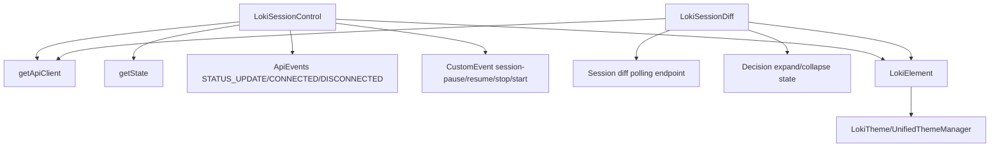
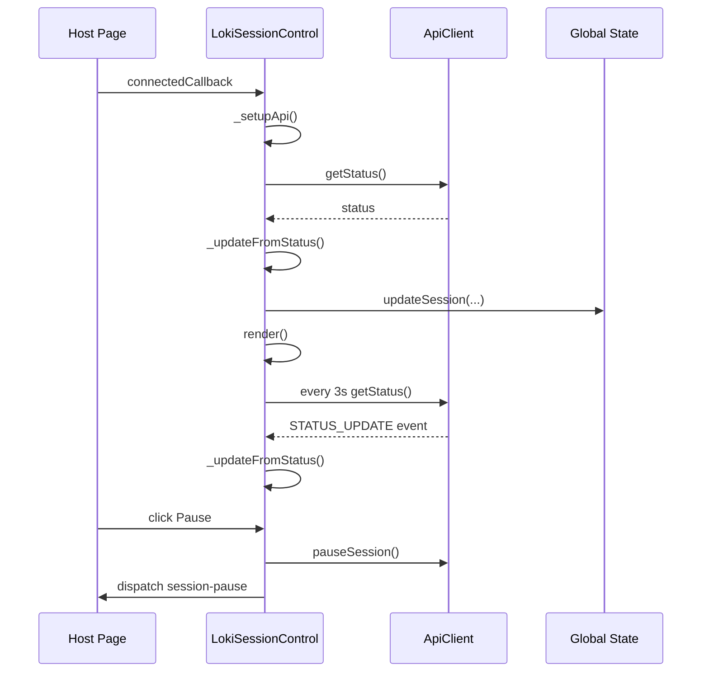
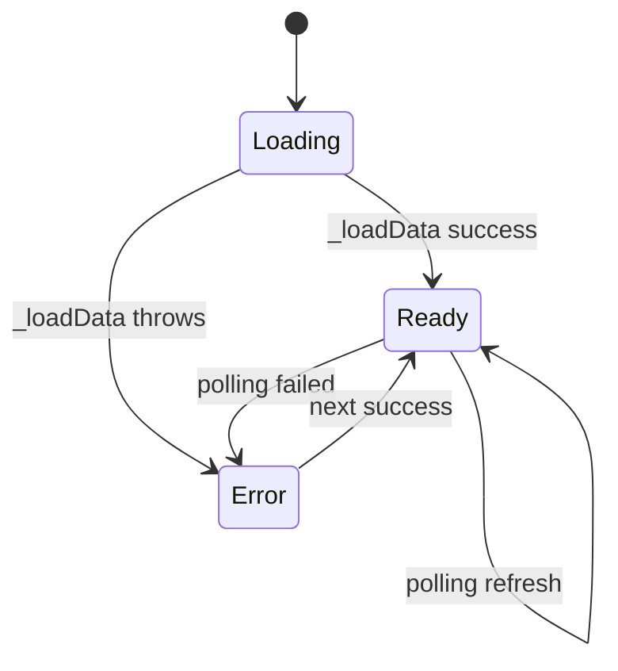
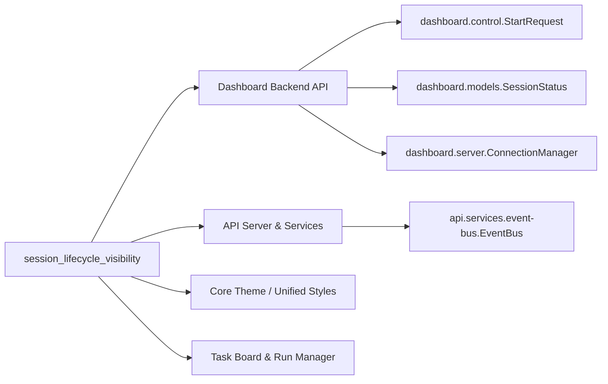
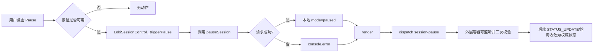

# session_lifecycle_visibility 模块文档

## 1. 模块定位与设计目标

`session_lifecycle_visibility` 是 Dashboard UI 中“Task and Session Management Components”下的一个可视化子模块，核心由 `LokiSessionControl` 与 `LokiSessionDiff` 两个 Web Component 组成。这个模块要解决的不是“执行任务”本身，而是“让操作者在会话生命周期中始终看得见、控得住、能追溯”。前者通过实时状态与控制按钮管理正在运行的会话，后者通过会话差异摘要帮助用户在恢复上下文时快速知道“上次到这次发生了什么变化”。

从系统层面看，这个模块处在“控制平面与观测平面交汇处”：它向下依赖 Dashboard/API Server 暴露的状态与控制接口，向上为页面容器或宿主应用抛出事件，便于外层编排更复杂流程（例如确认弹窗、审计记录、联动刷新任务看板）。它存在的核心原因是降低会话运行的操作不确定性和恢复成本，尤其适用于长时运行、跨阶段协作、需要快速切换上下文的场景。

---

## 2. 核心组件与职责边界

本模块仅包含两个核心组件：

- `dashboard-ui.components.loki-session-control.LokiSessionControl`
- `dashboard-ui.components.loki-session-diff.LokiSessionDiff`

它们都继承自 `LokiElement`（来自 `Core Theme`），因此共享主题、Shadow DOM、基础样式 token、键盘处理框架等底层能力。关于主题系统与基础样式机制的细节，请参考 [Core Theme.md](Core%20Theme.md) 与 [Unified Styles.md](Unified%20Styles.md)。

### 2.1 组件关系图



该关系体现了一个关键设计：`LokiSessionControl` 同时使用**事件推送 + 主动轮询**获取状态，强调控制及时性；`LokiSessionDiff` 则是以较低频率轮询获取“恢复摘要”，强调信息补全与阅读体验。两者共享 API client 与主题基座，但不会互相直接调用，降低了耦合。

---

## 3. LokiSessionControl 深度解析

### 3.1 功能概览

`LokiSessionControl` 提供会话生命周期控制（Pause/Resume/Stop）与运行态可视化（mode、phase、complexity、iteration、uptime、connected、version、agent/task 统计）。组件支持 `compact` 紧凑模式与完整模式，适应侧边栏和主面板两种密度。

该组件在连接后会立即加载状态并启动 3 秒轮询，同时监听 `ApiEvents.STATUS_UPDATE`、`CONNECTED`、`DISCONNECTED`。这意味着它能在“主动兜底刷新”与“事件驱动瞬时更新”之间取得平衡。

### 3.2 输入属性（Attributes）

| 属性 | 类型 | 默认值 | 作用 |
|---|---|---|---|
| `api-url` | string | `window.location.origin` | API 基地址，变更后会立即刷新状态 |
| `theme` | string | 自动探测 | 强制主题，触发 `_applyTheme()` |
| `compact` | boolean attribute | false | 存在即启用紧凑布局 |

### 3.3 输出事件（CustomEvent）

| 事件名 | 触发时机 | `detail` |
|---|---|---|
| `session-start` | `_triggerStart()` 被调用时 | 当前 `_status` |
| `session-pause` | pause 操作结束后（成功或失败都会 dispatch） | 当前 `_status` |
| `session-resume` | resume 操作结束后（成功或失败都会 dispatch） | 当前 `_status` |
| `session-stop` | stop 操作结束后（成功或失败都会 dispatch） | 当前 `_status` |

### 3.4 状态结构与后端字段映射

组件内部 `_status` 结构：

```js
{
  mode, phase, iteration, complexity,
  connected, version, uptime,
  activeAgents, pendingTasks
}
```

映射关系来自 `getStatus()` 返回值：

- `status.status -> mode`
- `status.uptime_seconds -> uptime`
- `status.running_agents -> activeAgents`
- `status.pending_tasks -> pendingTasks`
- `status.phase / iteration / complexity -> 同名字段`

并且 `_updateFromStatus()` 还会调用全局状态容器：

```js
this._state.updateSession({
  connected: true,
  mode: this._status.mode,
  lastSync: new Date().toISOString(),
});
```

这使它不仅是“显示组件”，也是全局 session 状态的一个同步源。

### 3.5 生命周期与内部流程



关键点在于，`connectedCallback()` 中先 `super.connectedCallback()`，确保主题与基类初始化完成，再接入 API 与轮询。`disconnectedCallback()` 会停止轮询并解除事件绑定，避免内存泄漏。

### 3.6 控制行为语义

Pause/Resume/Stop 按钮采用“本地状态快速反馈 + 后端调用”的模式：请求成功后会立刻更新 `mode` 并重渲染；失败时只打印 `console.error`，随后依然 dispatch 对应事件。因此，外层监听器若需要“只在成功时执行”，不能仅根据事件名判断，建议结合后续 `STATUS_UPDATE` 或主动复查 `getStatus()`。

此外，组件代码中定义了 `_triggerStart()` 与 `session-start`，但当前模板并未渲染 `start-btn`。这表示“Start 事件接口保留但 UI 入口未启用”。扩展时要么补充按钮，要么在外层触发。

### 3.7 使用示例

```html
<loki-session-control
  api-url="http://localhost:57374"
  theme="dark"
></loki-session-control>

<script type="module">
  const el = document.querySelector('loki-session-control');

  el.addEventListener('session-pause', (e) => {
    console.log('pause requested/status=', e.detail);
  });

  el.addEventListener('session-stop', async () => {
    // 推荐：在关键动作后做一次权威状态校验
    // const status = await api.getStatus();
  });
</script>
```

若用于侧栏，可直接加 `compact`：

```html
<loki-session-control compact></loki-session-control>
```

---

## 4. LokiSessionDiff 深度解析

### 4.1 功能概览

`LokiSessionDiff` 以 30 秒频率轮询 `/api/session-diff`，展示“会话恢复摘要”：覆盖周期 `period`、任务计数 `counts`、高亮事项 `highlights`、决策列表 `decisions`（可折叠 reasoning）。它解决的是“恢复上下文速度”问题，而不是实时控制。

### 4.2 输入属性

| 属性 | 类型 | 默认值 | 作用 |
|---|---|---|---|
| `api-url` | string | `window.location.origin` | API 基地址，变化后立即重拉数据 |
| `theme` | string | 自动探测 | 应用主题 |

### 4.3 数据契约（期望形状）

组件对返回结构采用容错读取：

```json
{
  "period": "2026-02-01 ~ 2026-02-02",
  "counts": {
    "tasks_created": 12,
    "tasks_completed": 8,
    "tasks_blocked": 2,
    "errors": 1
  },
  "highlights": ["..."],
  "decisions": [
    {"title": "...", "reasoning": "..."}
  ]
}
```

它同时兼容 `decision/rationale` 作为替代字段，因此后端字段改名时具备一定韧性。

### 4.4 加载与渲染状态机



实现上 `_loading` 只在首次加载前为 `true`，之后即便轮询失败也走“error fallback UI”（显示 `No session diff available`）。这是一种偏保守的展示策略：避免卡在 spinner，但会隐藏具体错误细节。

### 4.5 决策展开机制

`_expandedDecisions` 使用 `Set<number>` 存储展开项索引。点击决策头部调用 `_toggleDecision(index)`，然后整组件重渲染。该策略简单直观，但注意索引是基于当前数组位置：如果后端在轮询间隔内重排 `decisions`，用户展开态可能“错位”到新项。

### 4.6 使用示例

```html
<loki-session-diff api-url="http://localhost:57374"></loki-session-diff>
```

与 SessionControl 联动的页面布局示例：

```html
<section>
  <loki-session-control id="ctl"></loki-session-control>
  <loki-session-diff id="diff"></loki-session-diff>
</section>

<script type="module">
  const ctl = document.getElementById('ctl');
  const diff = document.getElementById('diff');

  ctl.addEventListener('session-resume', () => {
    // 可选：触发容器逻辑，例如提示“恢复后请查看 Session Resume”
    diff.scrollIntoView({ behavior: 'smooth', block: 'start' });
  });
</script>
```

---

## 5. 模块在整体系统中的位置

### 5.1 跨模块依赖与协作



`session_lifecycle_visibility` 前端组件本身不直接操作数据库或任务实体，它依赖后端聚合后的会话态与差异摘要。与 `LokiTaskBoard`、`LokiRunManager` 的关系是“并列协作”：前者偏控制与恢复摘要，后者偏任务/运行对象管理。建议在系统文档中将它们合并理解为“会话操作层 + 执行对象层”。

### 5.2 与实时通道的关系

`LokiSessionControl` 监听 API 事件（`STATUS_UPDATE/CONNECTED/DISCONNECTED`）并且保留轮询兜底。因此即使 WebSocket/推送链路（可参考 `dashboard.server.ConnectionManager`）出现抖动，界面仍会在 3 秒内恢复到可接受一致性。

---

## 6. 配置与扩展指南

### 6.1 推荐配置策略

在同一页面部署多个组件时，建议统一设置 `api-url`，并通过容器层管理，避免出现组件间访问不同 backend 的隐性分裂。主题建议交给全局 `LokiTheme/UnifiedThemeManager` 管理，除非需要局部强制主题。

### 6.2 扩展点一：补齐 Start 按钮

当前 `LokiSessionControl` 已有 `_triggerStart()` 与事件协议，但未渲染 `start-btn`。若业务需要“启动会话”，可以在 `render()` 中加入按钮并在 `_attachEventListeners()` 复用现有逻辑。后端请求可对接 Dashboard Backend 的启动契约（可参考 `dashboard.control.StartRequest` 校验约束）。

### 6.3 扩展点二：动作确认与权限门禁

组件内部默认“点击即请求”。如果要加风险控制（例如 Stop 二次确认、RBAC 权限），推荐在外层监听 `session-stop` 前拦截并改造交互流，或者 fork 组件将 `_triggerStop()` 改成确认后再调用 API。

### 6.4 扩展点三：Diff 的稳定展开键

若后端 `decisions` 具备稳定 id，建议把 `_expandedDecisions` 从 index 集合改为 id 集合，避免轮询后项目重排导致展开态漂移。

---

## 7. 边界条件、错误处理与已知限制

### 7.1 LokiSessionControl

- 网络失败时会把 `mode` 置为 `offline` 并重渲染，但不会显示错误详情。
- Pause/Resume/Stop 失败时仅 `console.error`，仍 dispatch 事件，存在“事件语义不等于成功语义”的陷阱。
- 同时采用事件监听与轮询，极端情况下可能产生短时间重复渲染。
- `start-btn` 未实际渲染，`session-start` 在默认 UI 路径下不会触发。

### 7.2 LokiSessionDiff

- 使用 `this._api._get('/api/session-diff')`（私有风格方法），说明对 API client 内部实现有一定耦合。
- 错误状态统一展示为 `No session diff available`，不暴露异常原因，不利于一线排障。
- 折叠态按数组索引保存，数据重排会导致展开项错位。
- 轮询间隔固定 30 秒，当前无属性化配置，不适合对时效要求很高的场景。

---

## 8. 测试与运维建议

建议至少覆盖以下测试路径：

1. 生命周期测试：挂载/卸载后定时器和事件监听是否完全清理。
2. 异常测试：API 超时、5xx、断网后的 UI 行为是否符合预期。
3. 并发测试：事件推送与轮询同时更新时是否出现 UI 闪烁或状态回跳。
4. 安全测试：`phase/complexity/decision` 等文本字段 XSS 防护（组件已做 escape，应回归验证）。
5. 兼容测试：`compact` 模式与默认模式在不同主题下可读性与可操作性。

---

## 9. 与其他文档的参考关系

为避免重复，以下主题建议直接阅读对应模块文档：

- 主题与设计 token： [Core Theme.md](Core%20Theme.md)、[Unified Styles.md](Unified%20Styles.md)
- 任务与运行对象管理： [task_board_and_run_operations.md](task_board_and_run_operations.md)、[LokiTaskBoard.md](LokiTaskBoard.md)、[LokiRunManager.md](LokiRunManager.md)
- Dashboard 后端 API 与连接层： [Dashboard Backend.md](Dashboard%20Backend.md)、[api_surface_and_transport.md](api_surface_and_transport.md)
- 运行时事件与服务侧状态传播： [API Server & Services.md](API%20Server%20&%20Services.md)、[runtime_services.md](runtime_services.md)

---

## 10. 最小接入清单（实践）

当你第一次把该模块接入新页面时，最低建议是：渲染 `loki-session-control` + `loki-session-diff`，统一 `api-url`，监听至少 `session-stop` 事件并做二次确认/审计记录，再配合任务面板实现完整操作闭环。这样可以在不改组件源码的前提下，快速获得“可控 + 可见 + 可恢复”的会话管理体验。


## 11. 内部方法级行为说明（维护者视角）

本节补充前文中最容易在维护时被忽略的“方法级”语义，重点解释每个关键函数如何改变组件状态、触发渲染，以及它们的副作用边界。

### 11.1 `LokiSessionControl` 关键方法

`_setupApi()` 会基于 `api-url` 构造 API client，并注册三个事件监听器：`STATUS_UPDATE`、`CONNECTED`、`DISCONNECTED`。这里的副作用是双向的：一方面组件接收推送，另一方面组件在 `disconnectedCallback` 必须完整反注册，否则同一个自定义元素重复挂载时会造成重复监听与重复渲染。当前实现已经保存 handler 引用并在卸载时移除，符合 Web Component 的生命周期清理规范。

`_loadStatus()` 与 `_startPolling()` 都会调用 `getStatus()`，差异在于前者用于首屏拉取，后者用于周期兜底（3 秒）。它们的错误处理策略一致：一旦异常，组件将 `connected=false`、`mode='offline'` 并重渲染。也就是说，UI 并不区分“网络断连”“认证失败”“后端 5xx”，这有利于界面简单，但会把故障分类责任留给外层日志与运维体系。

`_updateFromStatus(status)` 是状态归一化入口。它将后端字段映射到 `_status`，并通过 `this._state.updateSession(...)` 写入全局会话快照。这个写操作是该组件最重要的跨组件副作用，意味着其他组件（例如任务看板、概览面板）可以在不直接依赖 SessionControl 的情况下读取到会话连接态与最近同步时间。

`_triggerPause()`、`_triggerResume()`、`_triggerStop()` 采用统一流程：调用后端动作接口 -> 本地更新 `mode` -> `render()` -> dispatch 自定义事件。需要强调的是，即便 API 调用失败，事件仍然会 dispatch；因此事件语义更接近“用户触发了动作意图”，而不是“动作已经成功提交并生效”。

### 11.2 `LokiSessionDiff` 关键方法

`_loadData()` 通过 `this._api._get('/api/session-diff')` 获取摘要数据。这里使用了 `_get` 这种偏内部的方法名，体现出与 API Client 实现细节的轻耦合风险。如果未来 client 收敛为公开 `get(path)` 风格，维护时应优先替换此处以降低升级成本。

`_toggleDecision(index)` 只负责更新 `_expandedDecisions` 并重渲染，不执行任何网络操作。它的性能特征是“全量重渲染 + 小集合状态保存”，在决策列表规模较小时简单可靠；若后续要支持上百条 decision，建议引入 keyed 渲染策略或最小化 DOM 更新。

`render()` 维护了三种主状态分支：`loading`、`error`、`ready`。其中 `error` 分支目前落地文案为 “No session diff available”，并未把 `_error` 透传给用户。这个设计适合面向业务用户的低噪声展示，但不利于排障；常见改进做法是在 `dev` 环境显示错误详情，在 `prod` 环境显示通用文案。

---

## 12. 建议的扩展实现片段

以下示例用于展示“如何在不破坏现有设计的前提下”扩展能力。

### 12.1 为 SessionControl 增加可配置轮询间隔

```javascript
// 建议新增 observed attribute: poll-ms
static get observedAttributes() {
  return ['api-url', 'theme', 'compact', 'poll-ms'];
}

_startPolling() {
  const pollMs = Number(this.getAttribute('poll-ms') || 3000);
  this._ownPollInterval = setInterval(async () => {
    try {
      const status = await this._api.getStatus();
      this._updateFromStatus(status);
    } catch {
      this._status.connected = false;
      this._status.mode = 'offline';
      this.render();
    }
  }, Math.max(1000, pollMs));
}
```

这个改动保持默认行为不变，同时允许在高频监控页面与低频概览页面之间按需调节请求压力。

### 12.2 为 SessionDiff 增加“稳定 ID 展开态”

```javascript
_toggleDecision(decision) {
  const key = decision.id || decision.title || JSON.stringify(decision);
  if (this._expandedDecisions.has(key)) {
    this._expandedDecisions.delete(key);
  } else {
    this._expandedDecisions.add(key);
  }
  this.render();
}
```

当后端返回顺序变化时，这种方式可以避免“用户刚展开 A，刷新后变成展开 B”的体验问题。

### 12.3 在容器层实现“动作确认 + 成功校验”

```javascript
const ctl = document.querySelector('loki-session-control');

ctl.addEventListener('session-stop', async () => {
  // 事件只表示动作触发，建议二次校验权威状态
  const status = await api.getStatus();
  if (status.status !== 'stopped') {
    showToast('Stop request sent, waiting for backend confirmation...');
  }
});
```

这类容器策略可以在不修改组件源码的情况下提升流程可靠性，并与审计日志串联。


---

## 13. 方法级参考（参数、返回值、副作用速查）

为了方便维护者快速定位行为，这里给出两个核心组件的“方法级速查”。这一节偏工程手册视角，适合在修改代码前快速确认影响面。

### 13.1 `LokiSessionControl` 方法速查

| 方法 | 参数 | 返回值 | 主要副作用 |
|---|---|---|---|
| `connectedCallback()` | 无 | `void` | 初始化 API、首轮加载状态、启动 3s 轮询 |
| `disconnectedCallback()` | 无 | `void` | 停止轮询、移除 API 事件监听，避免泄漏 |
| `attributeChangedCallback(name, oldValue, newValue)` | 字符串属性变更参数 | `void` | `api-url` 变更会重指向 client 并刷新；`theme` 触发主题应用；`compact` 触发重渲染 |
| `_setupApi()` | 无 | `void` | 建立 API client，注册 `STATUS_UPDATE/CONNECTED/DISCONNECTED` 监听 |
| `_loadStatus()` | 无 | `Promise<void>` | 拉取 `/status`；失败时切离线态并重渲染 |
| `_updateFromStatus(status)` | 后端状态对象 | `void` | 归一化本地 `_status`，更新全局 state session 快照，触发渲染 |
| `_startPolling()` | 无 | `void` | 启动 3s 定时器周期拉取状态 |
| `_stopPolling()` | 无 | `void` | 清理定时器句柄 |
| `_formatUptime(seconds)` | number | `string` | 纯函数，无副作用；用于可读化 uptime |
| `_escapeHtml(str)` | any | `string` | 纯函数，HTML 转义，降低 XSS 风险 |
| `_getStatusClass()` | 无 | `string` | 纯函数，映射状态点样式类 |
| `_getStatusLabel()` | 无 | `string` | 纯函数，映射 UI 文本（AUTONOMOUS/PAUSED 等） |
| `_triggerStart()` | 无 | `void` | 仅派发 `session-start`（默认模板无 start 按钮入口） |
| `_triggerPause()` | 无 | `Promise<void>` | 调 pause API，尝试更新 `mode=paused`，派发 `session-pause` |
| `_triggerResume()` | 无 | `Promise<void>` | 调 resume API，尝试更新 `mode=running`，派发 `session-resume` |
| `_triggerStop()` | 无 | `Promise<void>` | 调 stop API，尝试更新 `mode=stopped`，派发 `session-stop` |
| `render()` | 无 | `void` | 重建 Shadow DOM 内容并重新绑定按钮事件 |
| `_attachEventListeners()` | 无 | `void` | 为按钮绑定点击事件到对应触发方法 |

这里最重要的维护注意点是：`render()` 每次都会重建 `shadowRoot.innerHTML`，因此事件监听必须在每次渲染后重新绑定。当前实现已经遵循这一原则。

### 13.2 `LokiSessionDiff` 方法速查

| 方法 | 参数 | 返回值 | 主要副作用 |
|---|---|---|---|
| `connectedCallback()` | 无 | `void` | 初始化 API、首轮加载、启动 30s 轮询 |
| `disconnectedCallback()` | 无 | `void` | 停止轮询 |
| `attributeChangedCallback(name, oldValue, newValue)` | 字符串属性变更参数 | `void` | `api-url` 变化时重拉数据；`theme` 变化时应用主题 |
| `_setupApi()` | 无 | `void` | 建立 API client |
| `_loadData()` | 无 | `Promise<void>` | 请求 `/api/session-diff`，设置 `data/error/loading` 并重渲染 |
| `_startPolling()` | 无 | `void` | 启动 30s 轮询 |
| `_stopPolling()` | 无 | `void` | 清理轮询定时器 |
| `_escapeHtml(str)` | string | `string` | 纯函数，字符串 HTML 转义 |
| `_toggleDecision(index)` | number | `void` | 修改展开态集合并重渲染 |
| `render()` | 无 | `void` | 根据 loading/error/ready 三态重建 Shadow DOM，并绑定决策展开按钮 |

`LokiSessionDiff` 的关键副作用集中在 `_loadData()`：它既负责远程数据获取，也负责 UI 状态机推进（loading→ready/error）。如果将来需要引入缓存层或请求去抖，这个方法是首选改造点。

---

## 14. 过程流图：一次“暂停会话”从点击到状态收敛



这个流程反映了该组件的设计哲学：优先保持 UI 可交互与反馈及时，再由后续推送/轮询回到后端权威状态。对高风险动作，应在容器层补“确认 + 成功校验”。
