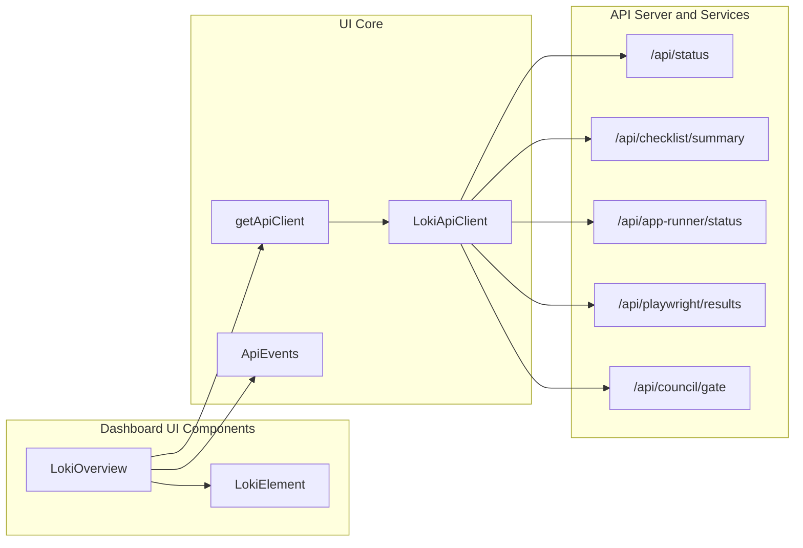
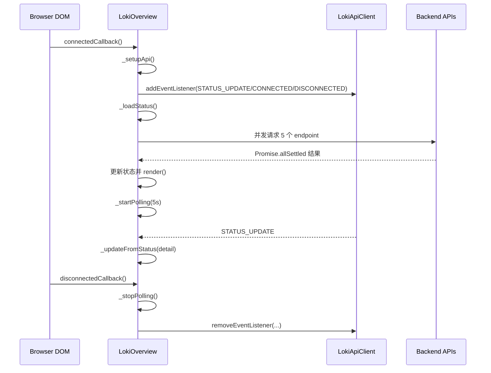
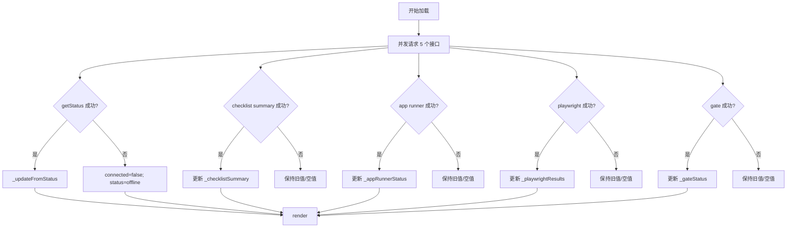

# session_overview_and_gate_signals 模块文档

## 模块简介

`session_overview_and_gate_signals` 模块是 Dashboard UI 中“全局态势感知”层的一部分，核心组件为 `dashboard-ui.components.loki-overview.LokiOverview`（`<loki-overview>` Web Component）。它的职责不是提供深度操作能力，而是把当前会话与关键质量门信号（gate signals）汇总成一组高密度、可快速扫读的状态卡片，帮助操作者在数秒内回答三个问题：系统是否在线、当前迭代是否健康、是否存在阻断交付的门禁风险。

从设计意图看，这个模块位于“监控与可观测性”子域中，承担的是“入口摘要（overview as control-plane snapshot）”角色：它通过一次批量请求同时抓取 Session 状态、PRD 清单汇总、App Runner 状态、Playwright 验证结果、Council Gate 结论，再以统一视觉语义（状态点、颜色、短文本）进行呈现。这个定位使它成为多个专用面板（例如 checklist、app runner、quality gates）的上游导航层：先在 Overview 发现异常，再进入对应细分组件做根因分析与处置。

---

## 在系统中的位置与依赖关系

`LokiOverview` 运行在 Dashboard UI 组件层，继承 `LokiElement` 以复用统一主题系统与基础样式，通过 `getApiClient` 获取 `LokiApiClient` 单例并调用若干 API 方法。它本身不维护业务规则引擎，也不直接执行控制操作（如 stop/restart），而是聚合并展示由 API Server / Runtime Services / Policy Engine 计算出的结果。



上图的关键点在于：`LokiOverview` 同时依赖“推送事件”与“主动轮询”两种更新路径。推送依靠 `ApiEvents.STATUS_UPDATE` 等事件，轮询则每 5 秒执行 `_loadStatus()`。这种“双轨策略”在网络不稳定或 WebSocket 不连续时能够维持可见性，但也带来一定冗余请求成本（后文会讨论限制与优化方向）。

可配套阅读：
- [LokiAppStatus.md](LokiAppStatus.md)
- [LokiChecklistViewer.md](LokiChecklistViewer.md)
- [LokiQualityGates.md](LokiQualityGates.md)
- [Monitoring and Observability Components.md](Monitoring and Observability Components.md)
- [Core Theme.md](Core Theme.md)

---
## 与后端能力域的映射关系

虽然 `LokiOverview` 只是一层 UI 组件，但它聚合的数据实际上跨越了多个后端能力域。`/api/status` 主要对应 API Server 与 runtime 状态聚合链路（可参考 [API Server & Services.md](API Server & Services.md)）；`/api/checklist/summary` 与 `PRD`/质量核验链路相关（可参考 [quality_gate_execution.md](quality_gate_execution.md) 与 [LokiChecklistViewer.md](LokiChecklistViewer.md)）；`/api/council/gate` 反映的是治理与审批门策略结果（可参考 [council_runtime_governance.md](council_runtime_governance.md) 与 [Policy Engine.md](Policy Engine.md)）；`App Runner` 与 `Playwright` 则连接运行健康与验证反馈闭环（可参考 [LokiAppStatus.md](LokiAppStatus.md)）。

这种跨域汇总解释了模块存在的必要性：它减少了操作者在多个面板间切换的成本，并把“运行态、验证态、门禁态”压缩到同一观察窗口中。

---


## 核心组件：`LokiOverview`

### 组件职责

`LokiOverview` 提供一个响应式网格卡片区，展示以下信息：

- Session：`status`
- Phase：`phase`
- Iteration：`iteration`
- Provider：`provider`
- Agents：`running_agents`
- Tasks：`pending_tasks`
- PRD Progress：checklist summary
- App Runner：runtime 状态
- Verification：Playwright smoke 结果
- Council Gate：门禁通过/阻断
- Uptime：`uptime_seconds` 格式化后
- Complexity：`complexity`

它通过状态点（`active/paused/stopped/error/offline`）和文本标签（例如 `PASSED/BLOCKED`）统一传达“可运行性 + 质量门信号”。

### 对外接口（Attributes）

组件监听两个属性：

1. `api-url`
   - 含义：API 基础地址。
   - 默认值：`window.location.origin`。
   - 行为：属性变更时会更新 `this._api.baseUrl` 并立即重新加载状态。

2. `theme`
   - 含义：主题（`light` / `dark` / 其他 `LokiTheme` 支持项）。
   - 行为：触发 `_applyTheme()`，由父类 `LokiElement` 注入主题变量。

### 内部状态模型

组件使用 `_data` 保存会话概览核心字段，并维护若干扩展卡片数据：

- `_data`: `status/phase/iteration/provider/running_agents/pending_tasks/uptime_seconds/complexity/connected`
- `_checklistSummary`: PRD 汇总
- `_appRunnerStatus`: App Runner 状态
- `_playwrightResults`: 自动化验证结果
- `_gateStatus`: Council Gate 结果

这是一种“主状态 + 扩展状态”分层模型：`_data` 对应基础运行态，扩展状态用于质量与交付信号。

---

## 生命周期与更新机制



这里有三个重要实现决策：

第一，初始化时先 `_setupApi()` 再 `_loadStatus()`，确保事件监听已注册，降低首次加载与实时事件竞争导致的数据空窗。第二，`_loadStatus()` 使用 `Promise.allSettled()`，使单个子接口失败不会阻断其他卡片更新。第三，`disconnectedCallback()` 中显式移除事件监听并清理轮询，避免组件卸载后的后台活动与潜在内存泄漏。

---

## 关键方法详解

### `connectedCallback()` / `disconnectedCallback()`

`connectedCallback()` 按顺序执行父类逻辑、API 初始化、首次加载、启动轮询。`disconnectedCallback()` 则执行反向清理：停止轮询并移除在 `_setupApi()` 中注册的事件处理器。

副作用主要有两类：
- 网络副作用：触发多个 API 请求。
- 事件副作用：向 `LokiApiClient` 注册/注销监听器。

### `attributeChangedCallback(name, oldValue, newValue)`

当 `api-url` 变化且 `_api` 已存在时，组件不会重建 client 实例，而是直接覆写 `baseUrl` 并重新拉取数据。这个策略简单高效，但要注意：`getApiClient` 背后是按 baseUrl 缓存的单例工厂；此处改写 `baseUrl` 实际上是“修改现有实例配置”，在多组件共享同实例时可能影响彼此的目标地址（属于全局副作用，见“限制”章节）。

### `_setupApi()`

该方法执行以下逻辑：

1. 解析 `api-url` 或回退到 `window.location.origin`
2. 调用 `getApiClient({ baseUrl })`
3. 定义三个事件处理器：
   - `STATUS_UPDATE`: 调用 `_updateFromStatus(e.detail)`
   - `CONNECTED`: `connected=true` + `render()`
   - `DISCONNECTED`: `connected=false`、`status=offline` + `render()`
4. 注册到 `ApiEvents`

这意味着 `LokiOverview` 可以在服务端推送状态时“近实时”更新，不必完全等待下一次 5 秒轮询。

### `_loadStatus()`

该方法是模块的核心聚合器。它并发读取：

```javascript
await Promise.allSettled([
  this._api.getStatus(),
  this._api.getChecklistSummary(),
  this._api.getAppRunnerStatus(),
  this._api.getPlaywrightResults(),
  this._api.getCouncilGate(),
]);
```

为什么使用 `allSettled` 而不是 `all`：因为 Overview 的目标是“最大可用信息展示”，而非“全有或全无”。例如 `Playwright` 接口临时失败时，Session 与 Gate 仍可刷新。异常路径下，组件会将主状态降级为 `offline` 并触发重渲染。

返回值：无显式返回（`Promise<void>` 语义）。

### `_updateFromStatus(status)`

该方法负责把 `/api/status` 结果映射到 `_data`。它保留旧状态并进行字段级回退，例如：
- `status.status || 'offline'`
- `iteration != null ? iteration : null`
- `running_agents || 0`

这种写法保证了 UI 不会出现 `undefined`，但也引入一个可观察行为：若后端返回空字符串或 `0`，会被部分默认逻辑覆盖（如 `running_agents` 用 `||`，`0` 仍为 0 没问题；字符串字段空值会回退为 null）。

### `_startPolling()` / `_stopPolling()`

`_startPolling()` 固定每 5 秒调用 `_loadStatus()`，失败时将状态置为离线。`_stopPolling()` 清理定时器并置空句柄。该实现简单稳定，但未像 `LokiAppStatus` / `LokiChecklistViewer` 那样根据 `document.hidden` 暂停轮询，因此后台标签页仍持续请求。

### 呈现辅助方法

- `_formatUptime(seconds)`：把秒数转成人类可读格式，负值或空值输出 `--`。
- `_getStatusDotClass()`：把 session 状态映射到 dot 样式类。
- `_escapeHtml(str)`：对 `& < > "` 做转义，避免插值 HTML 注入。

### 子卡片渲染方法

1. `_renderAppRunnerCard()`
   - 数据源：`_appRunnerStatus`
   - 状态：`running/starting/crashed/stopped/not_initialized`
   - 输出：标签 + 端口 + 可选 method

2. `_renderPlaywrightCard()`
   - 数据源：`_playwrightResults`
   - 关键字段：`passed`, `verified_at`, `checks`
   - 行为：失败时显示失败检查数量

3. `_renderChecklistCard()`
   - 数据源：`_checklistSummary.summary`
   - 行为：显示 `verified/total`、百分比进度条、failing 数

4. `_renderCouncilGateCard()`
   - 数据源：`_gateStatus`
   - 行为：`blocked` 显示 `critical_failures`；否则显示 `PASSED`

### `render()`

`render()` 将所有已准备数据插入 Shadow DOM。样式采用 `this.getBaseStyles()` + 组件局部 CSS，确保主题变量统一。布局使用 `grid-template-columns: repeat(auto-fit, minmax(160px, 1fr))`，在窄屏下自动折行。

---

## 数据流与状态降级策略



这个数据流体现了“部分可用优先”的原则：只要 `/api/status` 失败，整体 session 会显示离线；但其他业务卡片仍可保留上一轮成功值或空态占位（`--` / `N/A`），用户不会看到整个面板崩溃。

---

## 使用方式与配置

### 基本使用

```html
<loki-overview api-url="http://localhost:57374" theme="dark"></loki-overview>
```

如果不提供 `api-url`，默认使用当前页面来源。组件会在挂载后自动开始拉取和轮询，不需要额外调用初始化函数。

### 在应用中动态切换 API 地址

```javascript
const overview = document.querySelector('loki-overview');
overview.setAttribute('api-url', 'https://my-server.example.com');
```

设置后会立即触发重新加载。若多个组件共享同一个 `LokiApiClient` 实例，建议统一管理 baseUrl，避免互相覆盖。

### 主题控制

```javascript
const overview = document.querySelector('loki-overview');
overview.setAttribute('theme', 'light'); // 或 dark / high-contrast 等
```

主题底层由 `LokiElement + LokiTheme` 体系控制，支持系统偏好与显式覆盖。

---

## 与相邻模块的职责边界

`session_overview_and_gate_signals` 只做“摘要聚合与信号提醒”，不负责深入交互。出现异常后，建议跳转到下列模块：

- PRD 细项、waiver 操作：见 [LokiChecklistViewer.md](LokiChecklistViewer.md)
- App 运行日志与控制（restart/stop）：见 [LokiAppStatus.md](LokiAppStatus.md)
- 全量 gate 列表与历史状态：见 [LokiQualityGates.md](LokiQualityGates.md)

这种分层有助于保持 Overview 的低认知负荷：首屏只显示“是否有问题”，细节下钻交给专用页面。

---

## 可扩展性与二次开发建议

扩展该组件时，建议遵循“新增信号卡片不破坏主状态”的原则。典型做法是：

1. 在构造函数新增私有字段，例如 `_costSummary`。
2. 在 `_loadStatus()` 的 `Promise.allSettled` 中加入新 API 调用。
3. 增加 `_renderXxxCard()` 子渲染函数，保持单卡片职责单一。
4. 在 `render()` 网格中插入模板片段。

示例（伪代码）：

```javascript
const [status, cost] = await Promise.allSettled([
  this._api.getStatus(),
  this._api.getCost(),
]);

if (cost.status === 'fulfilled') {
  this._costSummary = cost.value;
}
```

如果要降低请求压力，可引入与 `LokiApiClient` 自适应轮询一致的策略：在 `document.hidden` 时降低频率或暂停轮询。

---

## 边界条件、错误处理与已知限制

### 边界条件

- `uptime_seconds <= 0` 时显示 `--`。
- `playwrightResults` 缺失 `verified_at` 时视为无可用结果。
- `checklistSummary.total` 不存在时显示 `--`，不绘制有效进度百分比。
- `gateStatus.status` 缺失时显示 `N/A`。

### 错误与降级

- 任一子接口失败不会阻断整体渲染（`allSettled`）。
- 若 `getStatus()` 失败，强制主状态为 `offline`。
- WebSocket 断开事件会立即把状态打成离线，直到下一次成功加载恢复。

### 已知限制 / gotchas

1. **轮询与事件并存可能重复渲染**：高频状态变化时，事件更新和 5 秒轮询都可能触发 UI 刷新。
2. **未实现页面可见性感知**：后台标签页仍保持轮询，可能增加无效流量。
3. **`baseUrl` 修改是共享实例级副作用**：`getApiClient` 按 URL 缓存单例，直接修改 `this._api.baseUrl` 可能影响同实例使用者。
4. **部分状态颜色变量未完全消费**：如 `_renderAppRunnerCard()` 中定义了 `color` 但模板主要依赖 dot class；这是可读性问题，不影响功能。
5. **默认文本具有产品语义假设**：例如 provider 默认 `CLAUDE`、complexity 默认 `STANDARD`，若后端语义扩展需同步前端文案策略。

---

## 测试与验证建议

建议至少覆盖以下场景：

- 首次加载：5 个接口全部成功，卡片完整展示。
- 部分失败：除 `status` 外某一接口失败，确认仅对应卡片降级。
- 主接口失败：`/api/status` 超时，确认 Session 显示 `OFFLINE`。
- 事件驱动：模拟 `ApiEvents.STATUS_UPDATE`，确认无需轮询也能更新。
- 属性变更：运行中切换 `api-url`、`theme`，确认行为符合预期。
- 卸载回收：组件移除后不再发起轮询，无事件监听泄漏。

---

## 结论

`session_overview_and_gate_signals` 模块通过 `LokiOverview` 把运行态、质量态和门禁态汇聚为单屏摘要，是运维观察与研发决策的“第一眼组件”。它的核心价值在于跨域聚合与稳健降级：即使后端部分接口异常，用户仍能看到可行动的信息。对于维护者而言，最重要的工程关注点是更新路径治理（事件 vs 轮询）、共享 API client 的副作用控制，以及新增卡片时对整体可读性和请求成本的平衡。
