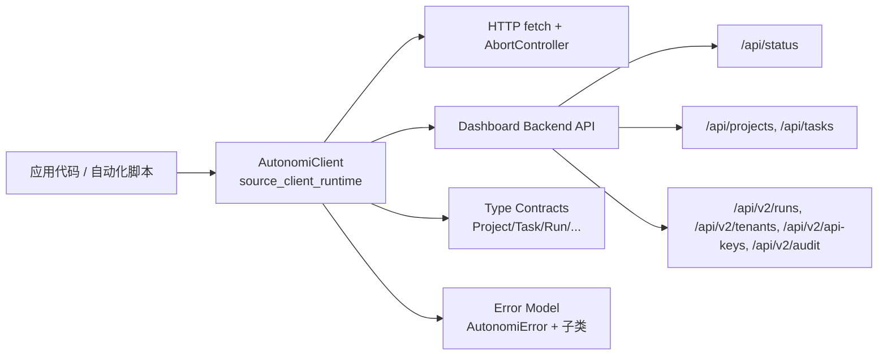
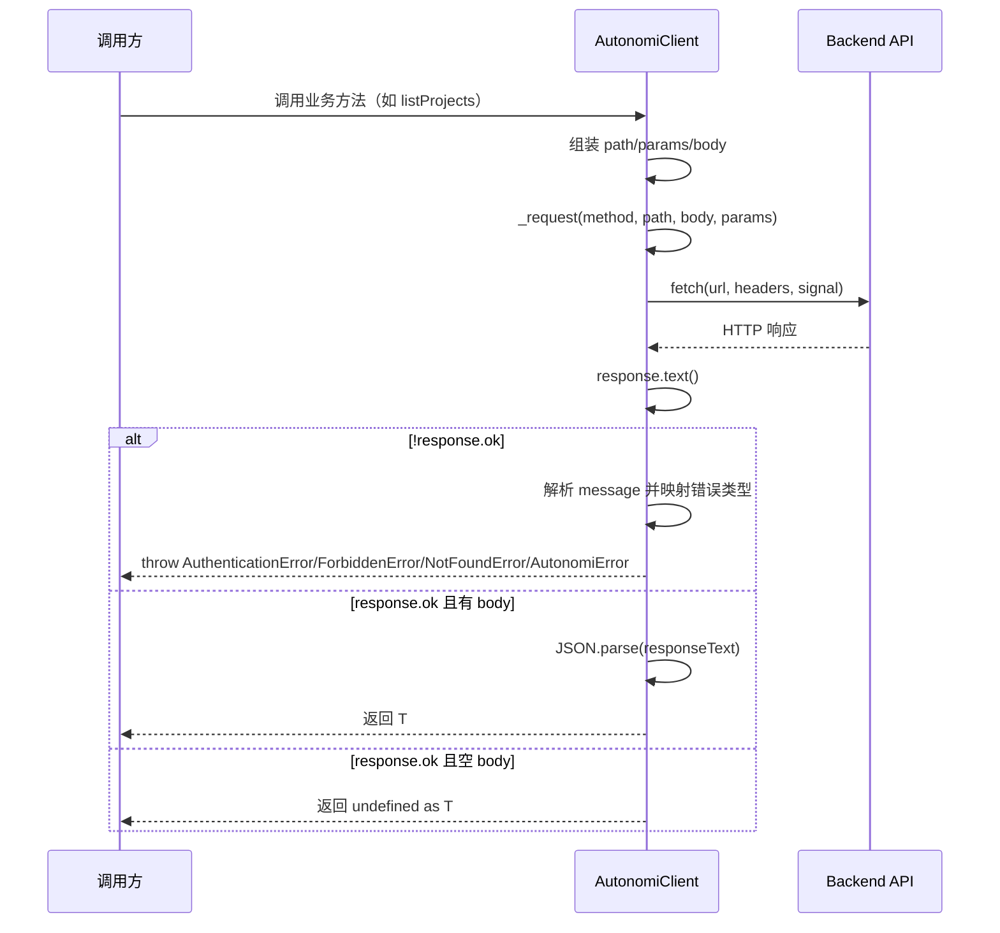
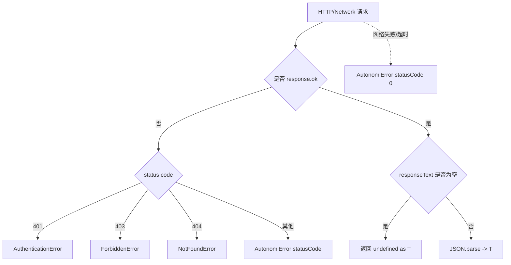

# source_client_runtime（`sdk.typescript.src.client.AutonomiClient`）

## 模块简介

`source_client_runtime` 是 TypeScript SDK 在“源码层（`src`）”的运行时入口模块，核心只暴露一个高价值对象：`AutonomiClient`。这个类把底层 HTTP 调用、认证头注入、超时控制、错误归一化和 API 资源方法封装到统一客户端中，让业务代码不需要直接操作 `fetch`、URL 拼接和状态码分支。它存在的根本原因是将“控制平面 API 的协议细节”与“上层业务逻辑”解耦，形成可测试、可维护、可扩展的 SDK 访问层。

从系统视角看，这个模块位于 **TypeScript SDK / client_core / source_client_runtime**，是前端工具链、Node.js 脚本、CI 自动化、甚至其他 SDK 适配层调用平台能力时最常见的入口。它与 Dashboard Backend 的 HTTP API（尤其是 `api_surface_and_transport.md` 与 `v2_admin_and_governance_api.md` 所描述的接口面）直接对齐，并通过 `sdk.typescript.src.types`（分发时对应 `sdk.typescript.dist.types.d.*`）提供强类型结果。

---

## 设计目标与设计取舍

这个模块的设计非常“薄而稳”：它不试图实现复杂的中间件系统、自动重试策略或缓存层，而是优先保证调用路径清晰、错误语义明确、依赖最小化。代码中明确依赖 Node 18+ 的内置 `fetch` 与 `AbortController`，避免引入外部 HTTP 库，这使得 SDK 在运行时更轻量，部署行为更可预测。

这种设计带来两个直接结果。第一，使用门槛低，开发者只需提供 `baseUrl`（可选 `token` 和 `timeout`）即可开始调用。第二，扩展时需要在应用层显式增加重试、限流、断路器或 observability 钩子，而不是期待客户端自动处理全部故障场景。这种“基础能力内聚，高级策略外置”的模式，在 SDK 设计中是典型且合理的。

---

## 模块在整体系统中的位置



上图反映了它的关键边界：`AutonomiClient` 对上提供面向资源的语义方法（例如 `createTask`、`listRuns`），对下负责将方法调用翻译为 HTTP 请求，并将响应翻译成强类型对象或标准化异常。这让调用端可以把精力放在业务编排，而不是通讯细节。

可参考：
- 接口面与后端契约：[`api_surface_and_transport.md`](api_surface_and_transport.md)、[`v2_admin_and_governance_api.md`](v2_admin_and_governance_api.md)
- TypeScript SDK 全局视图：[`TypeScript SDK.md`](TypeScript%20SDK.md)
- 错误模型（若已有独立说明）：[`error_model.md`](error_model.md)

---

## 内部结构与请求生命周期



整个流程的核心是 `_request<T>()`。公开方法几乎都是“薄封装”：负责构造路径、可选查询参数和请求体，然后委托 `_request` 执行。这保证了行为一致性——所有接口共享同一超时策略、头部构建逻辑、错误映射逻辑。

---

## 核心类详解：`AutonomiClient`

### 构造函数

```ts
constructor(options: ClientOptions)
```

构造函数接收 `ClientOptions`，包含：
- `baseUrl: string`（必填）
- `token?: string`（可选）
- `timeout?: number`（毫秒，默认 `30000`）

内部行为有两个关键点。其一，`baseUrl` 会通过 `replace(/\/$/, '')` 去除末尾单个 `/`，避免后续路径拼接出现双斜杠。其二，`timeout` 为全局默认超时，作用于所有请求。

### 私有方法 `_request<T>()`

```ts
async _request<T>(
  method: string,
  path: string,
  body?: unknown,
  params?: Record<string, string>
): Promise<T>
```

这是模块真正的运行时引擎。它执行以下步骤：先拼接 URL，再将 `params` 通过 `URLSearchParams` 形成查询串，然后构造默认 `Content-Type: application/json` 头，若存在 `token` 则附加 `Authorization: Bearer <token>`。随后创建 `AbortController`，用 `setTimeout` 触发超时取消。

请求完成后统一读取 `response.text()`，而不是直接 `response.json()`。这让模块在错误分支中可以先拿到原始文本，尝试解析 `error` / `message` / `detail` 字段，提升错误信息可读性。若状态码非 2xx，将按状态码映射为：
- `401 -> AuthenticationError`
- `403 -> ForbiddenError`
- `404 -> NotFoundError`
- 其他 -> `AutonomiError(statusCode)`

若响应成功但 body 为空，返回 `undefined as T`；否则执行 `JSON.parse(responseText)`。

**副作用与约束：**

- 所有请求都默认带 `Content-Type: application/json`，即便某些 `GET`/`DELETE` 可能不严格需要。
- 仅支持 JSON 响应模型；若服务端返回非 JSON 且非空文本，在成功分支会触发 `JSON.parse` 异常。
- 网络错误和超时中断都落入 `catch` 并包装为 `AutonomiError(msg, 0)`，状态码 0 表示“非 HTTP 层失败”。

---

## API 能力分组说明

下面按资源域介绍公开方法。每个方法最终都通过 `_request` 执行，因此继承同样的超时、错误映射和鉴权头逻辑。

### 1）Status

`getStatus(): Promise<Record<string, unknown>>` 调用 `GET /api/status`，通常用于健康检查或连接探测。返回结构为弱类型字典，调用方应按部署环境做字段存在性判断。

### 2）Projects

`listProjects()`、`getProject(projectId)` 和 `createProject(name, description?)` 对应项目列表、详情和创建。`createProject` 在 `description === undefined` 时不会下发该字段，有助于保持请求体简洁并避免后端对空值语义的歧义。

### 3）Tasks

`listTasks(projectId?, status?)` 支持组合过滤，参数会被序列化为查询字符串 `project_id`、`status`。`createTask(projectId, title, description?)` 会将 `project_id` 放入 body，字段命名与后端 snake_case 对齐。

### 4）API Keys（v2）

`listApiKeys()`、`createApiKey(name, role?)`、`rotateApiKey(identifier, gracePeriodHours?)`、`deleteApiKey(identifier)` 面向密钥生命周期。`createApiKey` 返回 `ApiKey & { token: string }`，意味着仅创建时会拿到可展示的明文 token（典型安全模式）；后续查询通常不会再次返回完整凭据。

### 5）Runs（v2）

`listRuns(projectId?, status?)`、`getRun(runId)`、`cancelRun(runId)`、`replayRun(runId)`、`getRunTimeline(runId)` 支撑运行态追踪与控制。特别是 `cancelRun` 与 `replayRun` 使用 `POST` 触发动作型端点，而非资源替换型 `PUT/PATCH`。

### 6）Tenants（v2）

`listTenants()`、`getTenant(tenantId)`、`createTenant(name, description?)`、`deleteTenant(tenantId)` 提供租户管理能力，适合多租户控制平面的自动化场景。

### 7）Audit

`queryAudit(params?: AuditQueryParams)` 将可选时间范围、动作和条数限制编码为查询参数；`verifyAudit()` 调用 `/api/audit/verify`，返回 `{ valid, entries_checked }`，用于审计链路完整性校验。

---

## 关键类型契约（与 `types` 模块协作）

`AutonomiClient` 依赖的主要返回类型来自 `./types.js`（分发后体现在 `dist/types.d.ts`）。例如：

- `Project`: `id/name/status/tenant_id/created_at/...`
- `Task`: `project_id/title/status/priority`
- `Run` 与 `RunEvent`: 运行生命周期与时间线事件
- `Tenant`: 多租户元数据
- `ApiKey`: 密钥元数据（含 scopes、role、过期信息）
- `AuditEntry` / `AuditVerifyResult`

这些类型描述了“客户端预期的后端响应形状”，但不保证运行时强校验。也就是说，若后端响应与类型声明不一致，TypeScript 无法在运行时自动兜底，调用方仍需在关键路径做必要断言。

可参考：[`type_contracts.md`](type_contracts.md)、[`api_contracts_and_events.md`](api_contracts_and_events.md)

---

## 错误模型与异常处理实践



该模型最大的价值在于调用方可以按错误类型做精确分支。例如认证失效时触发 token 刷新流程，404 时返回业务“对象不存在”，其他错误统一打日志并重试（若业务允许）。

示例：

```ts
import { AutonomiClient } from './client.js';
import { AuthenticationError, NotFoundError } from './errors.js';

try {
  const client = new AutonomiClient({ baseUrl: 'https://control.example.com', token: process.env.API_TOKEN });
  const task = await client.getTask(123);
  console.log(task.title);
} catch (err) {
  if (err instanceof AuthenticationError) {
    // 引导重新认证或刷新 token
  } else if (err instanceof NotFoundError) {
    // 任务不存在，给出业务提示
  } else {
    // 其他错误统一处理
  }
}
```

---

## 使用方式与配置建议

### 最小可用示例

```ts
import { AutonomiClient } from '@autonomi/sdk';

const client = new AutonomiClient({
  baseUrl: 'http://localhost:8080',
  token: process.env.AUTONOMI_TOKEN,
  timeout: 30_000,
});

const projects = await client.listProjects();
console.log(projects.map(p => `${p.id}:${p.name}`));
```

### 常见工作流示例：项目 + 任务 + 运行追踪

```ts
const project = await client.createProject('SDK Demo', 'created by script');
const task = await client.createTask(project.id, 'Collect runtime metrics');

const runs = await client.listRuns(project.id, 'running');
for (const run of runs) {
  const timeline = await client.getRunTimeline(run.id);
  console.log(run.id, timeline.length);
}
```

### 配置建议

- `baseUrl` 建议使用显式协议和端口，例如 `https://api.company.com`。
- `timeout` 在内网可适当降低（如 5~10s）以提升故障感知速度；跨地域网络可提高至 30~60s。
- `token` 为空时可访问公开端点，但大多数管理接口会返回 401/403。

---

## 可扩展性与二次封装建议

当前 `AutonomiClient` 没有中间件插槽，但你可以通过“组合而非继承”的方式扩展：在外层包装一个 `DomainClient`，内部调用 `AutonomiClient`，补充重试、日志、指标打点、幂等键或缓存策略。这样可以避免直接改动 SDK 源码并减少升级冲突。

如果你确实需要新增资源方法（例如新的 `/api/v2/...` 端点），推荐遵循现有模式：新增一个公开方法，仅负责参数整理，然后调用 `_request<T>()`。这样可以自动继承统一错误语义与超时策略。

---

## 边界情况、限制与运维注意事项

这个模块在工程上足够稳健，但仍有几个必须明确的行为约束：

- **仅 JSON 成功响应**：成功分支固定 `JSON.parse`，若后端返回纯文本会抛异常。
- **空响应处理为 `undefined as T`**：对 `void` 方法合理，但若调用方错误声明了非空 `T`，可能产生运行时语义偏差。
- **无内建重试**：临时网络抖动、429 或 5xx 需调用方自行重试。
- **无分页迭代抽象**：`list*` 方法直接返回数组，若后端后续引入分页，SDK 可能需要版本演进。
- **URL 参数无深层对象编码**：`params` 仅支持 `Record<string, string>`，不支持数组/嵌套对象自动序列化。
- **错误体字段提取有限**：仅尝试 `error/message/detail`，其他结构将退回原始文本。

在生产中，建议配合以下策略：
- 在调用层实现指数退避重试（仅针对幂等读取接口）。
- 对 `AutonomiError.statusCode === 0` 单独监控，识别网络与超时问题。
- 记录 `responseBody`（注意脱敏）以加速排障。

---

## 与分发产物（dist）的一致性说明

模块树中 `distribution_artifacts` 下的 `sdk.typescript.dist.client.AutonomiClient` 和 `sdk.typescript.dist.client.d.AutonomiClient` 分别对应构建后的 JS 与声明文件。其方法签名与 `src` 基本保持一致，意味着文档中的行为解释可直接映射到 npm 包使用场景。若出现差异，通常是构建版本滞后或发布流程问题，应优先核对 `dist` 与 `src` 的同步状态。

---

## 总结

`source_client_runtime` 的核心价值不在“功能数量”，而在“访问一致性”。`AutonomiClient` 用非常小的实现体积提供了稳定的 API 访问骨架：统一请求构建、统一超时取消、统一错误语义、统一资源方法组织。对大多数集成场景来说，这种设计已经足够支撑可靠开发；而对更复杂的企业级治理需求，则可以在其外层平滑叠加重试、审计、指标与策略控制能力。
