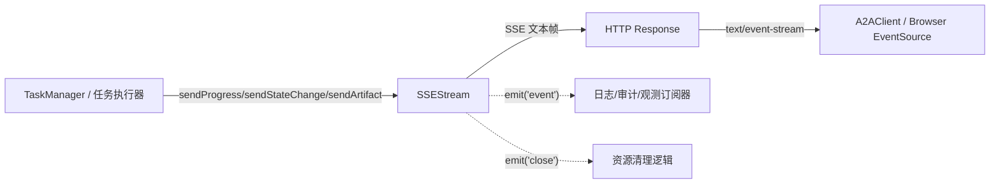
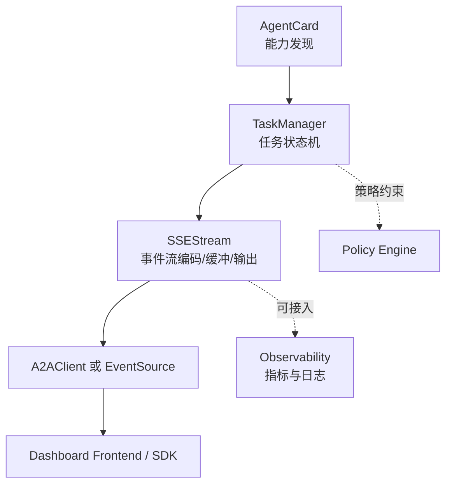
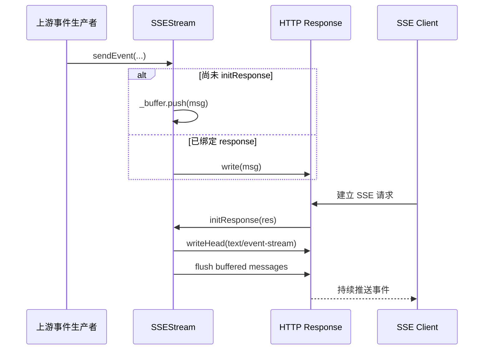
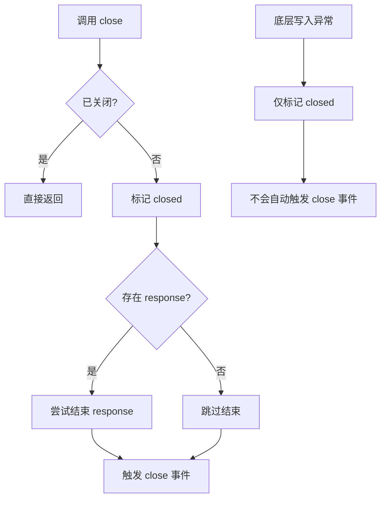

# sse_event_streaming 模块文档

## 模块简介

`sse_event_streaming` 模块是 A2A（Agent-to-Agent）协议中的实时事件推送层，核心实现为 `src.protocols.a2a.streaming.SSEStream`。它的职责是把任务执行过程中的“进度变化、状态切换、产物输出”等信息，以 Server-Sent Events（SSE）格式稳定地推送给下游消费者（通常是 A2A 客户端、Web 前端或桥接服务）。

这个模块存在的价值在于：A2A 任务通常持续时间较长，且执行状态具有阶段性变化；如果仅靠轮询会带来延迟、额外负载和状态不一致风险。`SSEStream` 通过长连接单向推送，降低了系统复杂度，并且通过“先缓冲后刷新”的策略解决了“事件早于 HTTP 响应建立”的时序问题。

从系统分层角度看，它位于 A2A 协议子系统的传输边界，向上承接 `TaskManager` 等任务生命周期模块产生的领域事件，向下使用 Node.js HTTP response 写入 SSE 帧。若要理解 A2A 调用链全貌，建议同时阅读 [A2A Protocol - TaskManager](A2A Protocol - TaskManager.md) 与 [A2A Protocol - A2AClient](A2A Protocol - A2AClient.md)。

---

## 核心组件与设计动机

### `SSEStream`（`src.protocols.a2a.streaming.SSEStream`）

`SSEStream` 继承自 Node.js `EventEmitter`，这意味着它既是“输出通道”，又是“内部可观测对象”。模块内部把事件处理拆成两层：第一层是业务语义事件（`progress` / `artifact` / `state`），第二层是底层传输写入（`_writeOrBuffer` / `_writeRaw`）。这样的拆分使得调用方只关心语义，不必重复拼接 SSE 文本协议。

构造函数接收可选配置 `opts`：

- `opts.res`：可直接注入 HTTP response。
- `opts.maxBufferSize`：缓冲上限，默认 `1000`。

内部状态包括：

- `_res`：当前绑定的 response，为 `null` 时进入缓冲模式。
- `_closed`：流关闭标记，关闭后 `sendEvent` 直接返回。
- `_buffer`：尚未绑定 response 时暂存的 SSE 原始消息。
- `_maxBufferSize`：缓冲区容量控制，超限时丢弃最旧消息。

该设计体现了一个明确取舍：优先保证接口简单与低耦合，而不是引入复杂的 ACK、重传、持久化机制。它适用于“可接受短暂丢失、强调实时可见性”的任务状态流场景。

---

## 架构关系与模块位置



在这条链路中，`SSEStream` 是协议适配层而非任务编排层。它不决定任务状态，也不做权限校验、重试策略和业务路由；这些应该分别由 A2A 的任务管理、认证与策略模块承担。`SSEStream` 仅负责“把已经发生的事件，以 SSE 兼容格式可靠写出或短暂缓存”。

---

## 与 A2A 相邻模块的职责边界

`SSEStream` 在 A2A 协议中的定位非常“薄”：它不是任务引擎，也不是客户端 SDK，而是把上游已经确定的任务事件转成可流式消费的 SSE 帧。实践中，它通常由 [A2A Protocol - TaskManager](A2A Protocol - TaskManager.md) 驱动，由 [A2A Protocol - A2AClient](A2A Protocol - A2AClient.md) 或浏览器 `EventSource` 消费。`AgentCard` 提供的是代理能力发现与元数据，不参与流式传输；这让 `SSEStream` 可以在不关心 agent capability 细节的情况下复用到不同任务类型。

从跨协议视角看，A2A 的 `SSEStream` 与 MCP 侧的传输层组件（见 [Transport](Transport.md)）都使用了 SSE 这一机制，但职责并不完全相同：A2A 更偏向“任务生命周期事件输出”，而 MCP 传输更偏向“协议消息双端适配与会话管理”。因此在维护时不建议把 MCP 传输策略（如连接治理、重试编排）直接拷贝进 `SSEStream`，而应通过上层编排模块来统一治理。



上图体现了一个关键维护原则：`SSEStream` 保持“只做流式输出”的单一职责，避免演变成任务编排、策略执行和观测写入的耦合中心。这样既能控制复杂度，也能让协议层升级更可预测。


## 关键流程说明

### 1）连接建立与缓冲刷新



这个流程解决的是典型竞态：任务事件可能在客户端连接到来前已经产生。通过 `_buffer`，模块允许生产者先发事件，等 `initResponse` 执行后再批量冲刷。

### 2）关闭与异常路径



这里有一个非常重要的行为差异：
- 显式调用 `close()` 会触发 `emit('close')`。
- `_writeRaw()` 写入异常只会把 `_closed` 置为 `true`，**不会自动触发 `close` 事件**。

因此如果你依赖 `close` 做资源清理，建议在上层增加连接健康探测或发送返回值检查，避免“已经关闭但未触发清理回调”的隐性泄漏。

---

## API 详解（按方法）

### `constructor(opts)`

构建流对象并初始化内部状态。`opts` 为空时模块进入“可先发后绑”模式。

**参数**

- `opts?: object`
- `opts.res?: object`（Node.js HTTP response）
- `opts.maxBufferSize?: number`（默认 `1000`）

**返回值**

- `SSEStream` 实例

**副作用**

- 初始化内存缓冲区。
- 不会触发网络写入。

---

### `initResponse(res)`

将 response 绑定到流，并写入 SSE 必需响应头，然后冲刷此前缓冲的原始消息。

**参数**

- `res: object`（需具备 `writeHead` 与 `write`/`end` 能力）

**返回值**

- 无

**内部行为**

1. `this._res = res`
2. `res.writeHead(200, { Content-Type, Cache-Control, Connection })`
3. 按缓冲顺序逐条 `_writeRaw`
4. 清空 `_buffer`

**注意**

- 该方法未做 `headers already sent` 保护；如果上层已写过头，`writeHead` 可能抛错。
- 即使流已 `_closed=true`，代码仍允许调用 `initResponse`，但后续 `sendEvent` 不再发送。

---

### `sendEvent(event, data)`

发送任意类型事件，是所有语义方法的底层入口。

**参数**

- `event: string`：SSE `event:` 字段。
- `data: any`：若非字符串则执行 `JSON.stringify(data)`。

**返回值**

- 无

**副作用**

- `_closed` 为真时直接返回，不抛错。
- 生成 `event: ...\ndata: ...\n\n` 格式消息。
- 触发 `_writeOrBuffer`。
- `emit('event', { event, data })`。

**边界条件**

- `JSON.stringify` 遇到循环引用会抛异常，方法本身不捕获，异常会向上传播。

---

### `sendProgress(taskId, message, progress)`

发送 `progress` 类型事件。`progress` 为 falsy 时会写成 `null`（注意 `0` 会被转换成 `null`，这是实现细节）。

**参数**

- `taskId: string`
- `message: string`
- `progress?: number`

**事件载荷结构**

```json
{
  "taskId": "...",
  "message": "...",
  "progress": 42,
  "timestamp": "2026-01-01T00:00:00.000Z"
}
```

**实现注意**

由于使用 `progress || null`，如果传入 `0`，最终会得到 `null`。若业务需要精确表达 `0%`，建议在扩展时改为 `progress ?? null`。

---

### `sendArtifact(taskId, artifact)`

发送 `artifact` 类型事件，用于传递任务中间/最终产物。

**参数**

- `taskId: string`
- `artifact: any`

**特点**

- 自动补充 ISO 时间戳。
- 不限制 `artifact` 结构，但受 JSON 序列化能力约束。

---

### `sendStateChange(taskId, oldState, newState)`

发送 `state` 事件，表达状态机跃迁。

**参数**

- `taskId: string`
- `oldState: string`
- `newState: string`

**语义建议**

建议上游保证状态合法性（例如仅允许 `queued -> running -> completed/failed`），该模块不会校验跃迁规则。

---

### `close()`

关闭流，结束 response，并广播 `close` 事件。

**参数 / 返回值**

- 无

**副作用**

- 幂等：重复调用不会重复 end。
- 若 `_res` 存在，尝试 `res.end()`（错误被吞掉）。
- `emit('close')`。

---

### `isClosed()` / `getBuffer()`

`isClosed()` 返回流关闭状态。`getBuffer()` 返回缓冲区浅拷贝，适合监控或调试，不会暴露内部数组引用。

---

## 数据格式与协议兼容性

模块输出标准 SSE 文本块：

```text
event: progress
data: {"taskId":"T-1","message":"running","progress":20,"timestamp":"..."}

```

由于仅写 `event` 和 `data` 字段，当前实现不包含 `id`、`retry`、注释心跳（`: keep-alive`）等增强特性。如果部署链路中存在会中断空闲连接的反向代理，建议上层增加定时心跳写入。

---

## 使用与配置建议

### 最小用法

```javascript
const { SSEStream } = require('./src/protocols/a2a/streaming');

function handleSSE(req, res, taskManager, taskId) {
  const stream = new SSEStream({ maxBufferSize: 2000 });
  stream.initResponse(res);

  const onProgress = (msg, pct) => stream.sendProgress(taskId, msg, pct);
  const onState = (from, to) => stream.sendStateChange(taskId, from, to);

  taskManager.on('progress:' + taskId, onProgress);
  taskManager.on('state:' + taskId, onState);

  req.on('close', () => {
    taskManager.off('progress:' + taskId, onProgress);
    taskManager.off('state:' + taskId, onState);
    stream.close();
  });
}
```

### 配置取舍

- `maxBufferSize` 越大，连接前事件丢失越少，但内存占用越高。
- 如果任务事件频率高且客户端连接慢，建议同时配置上游限流或批处理，避免缓冲区长期高水位。

---

## 可扩展点（扩展而非改写）

常见扩展方式是在不破坏现有调用点的前提下封装子类或装饰器：

```javascript
class EnhancedSSEStream extends SSEStream {
  sendProgress(taskId, message, progress) {
    // 修复 0 被置 null 的问题
    return this.sendEvent('progress', {
      taskId,
      message,
      progress: progress ?? null,
      timestamp: new Date().toISOString(),
    });
  }

  sendHeartbeat() {
    if (!this.isClosed() && this._res) {
      this._writeRaw(': keep-alive\n\n');
    }
  }
}
```

如果你计划加入断线重连语义（Last-Event-ID）、事件编号、持久化重放，不建议直接把复杂逻辑塞进当前类，而应在更高层引入“事件日志 + 游标管理”组件，再让 `SSEStream` 保持传输职责单一。

---

## 边界条件、错误与限制

### 1. 序列化异常

`sendEvent` 对非字符串执行 `JSON.stringify`，循环引用会直接抛异常。生产环境建议在上层做数据清洗或 try/catch 包装。

### 2. 写入失败后的生命周期不完整

`_writeRaw` 捕获写异常后仅设置 `_closed=true`，不会 `emit('close')`，也不会主动 `end`。这可能导致依赖 `close` 事件做资源回收的代码未执行。

### 3. 进度值 `0` 丢失语义

`sendProgress` 的 `progress || null` 会把 `0` 转为 `null`。这会影响前端进度条的“刚启动”显示。

### 4. 无背压控制

模块使用 `res.write` 但不处理背压（例如 `write()` 返回 `false` 的 drain 策略）。在高吞吐或慢客户端场景，可能造成内存压力。

### 5. 无协议级心跳

长连接在某些网关下可能被空闲断开。当前实现未内建心跳，需要调用方自行补充。

### 6. 单 response 绑定模型

一个 `SSEStream` 实例只维护一个 `_res`。如需多客户端广播，应由上层维护“每连接一个流实例”或“单事件源 + 多流分发器”。

---

## 与系统其他模块的协作建议

在完整系统中，推荐按职责分离协作：

- A2A 任务状态来源：参考 [A2A Protocol - TaskManager](A2A Protocol - TaskManager.md)
- A2A 远程调用消费端：参考 [A2A Protocol - A2AClient](A2A Protocol - A2AClient.md)
- 若需要统一全局事件治理，可结合 API 服务侧事件总线思路（见 [Event Bus](Event Bus.md)）进行桥接，但不要把总线策略耦合进 `SSEStream`。

---

## 总结

`sse_event_streaming` 模块以极简实现提供了 A2A 场景下可用的实时事件流能力：语义化事件发送、连接前缓冲、连接后持续推送，以及基础关闭语义。它的优势是轻量、易集成、可观测；它的边界是缺少强一致重放、背压与心跳等高级能力。对大多数“任务进度可视化与状态通知”场景，它是合适的基础构件；对“高可靠事件分发”场景，应在上层补齐日志、重放与连接治理机制。
