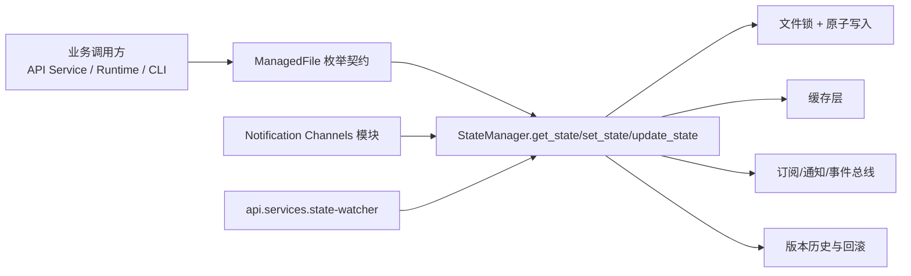
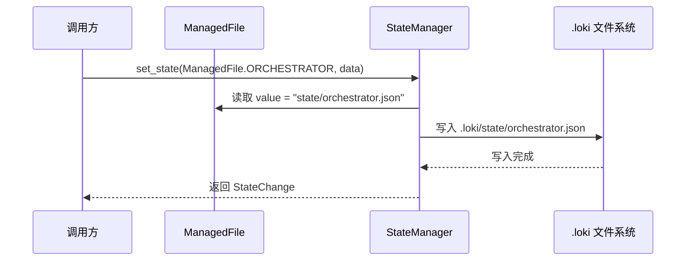
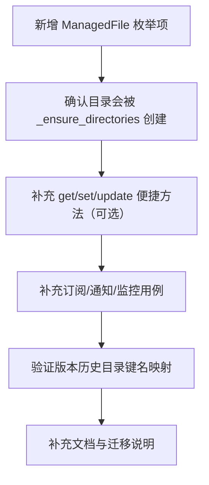

# state_file_contracts 模块文档

## 1. 模块定位与设计动机

`state_file_contracts` 是 State Management 子系统中的“文件契约层”，其核心组件是 `state.manager.ManagedFile` 枚举。这个模块本身不负责读写、缓存、锁、通知或版本控制，而是定义“哪些状态文件被系统视为一等公民，以及它们在 `.loki` 工作目录中的规范路径”。

从工程视角看，`ManagedFile` 的价值在于把“字符串路径常量”提升为“强类型契约”。这带来三类直接收益：第一，调用方不再散落硬编码路径，避免拼写错误和路径漂移；第二，StateManager 的 API（如 `get_state` / `set_state`）可以接受 `ManagedFile`，形成统一入口；第三，跨模块协作时可以围绕稳定枚举做依赖，而不是依赖隐式约定。

如果你把 `StateManager` 理解为“状态运行时引擎”，那么 `ManagedFile` 就是它的“状态地址空间定义”。因此它虽然小，但对整个系统的可维护性、可扩展性和可审计性非常关键。

---

## 2. 核心组件：`ManagedFile`

### 2.1 组件定义

`ManagedFile` 在 `state/manager.py` 中声明为：

```python
class ManagedFile(str, Enum):
    ORCHESTRATOR = "state/orchestrator.json"
    AUTONOMY = "autonomy-state.json"
    QUEUE_PENDING = "queue/pending.json"
    QUEUE_IN_PROGRESS = "queue/in-progress.json"
    QUEUE_COMPLETED = "queue/completed.json"
    QUEUE_FAILED = "queue/failed.json"
    QUEUE_CURRENT = "queue/current-task.json"
    MEMORY_INDEX = "memory/index.json"
    MEMORY_TIMELINE = "memory/timeline.json"
    DASHBOARD = "dashboard-state.json"
    AGENTS = "state/agents.json"
    RESOURCES = "state/resources.json"
```

它同时继承 `str` 和 `Enum`，这意味着：

- 作为枚举成员使用时，具备可读的语义名（如 `ManagedFile.ORCHESTRATOR`）；
- 作为字符串使用时，`value` 可直接参与路径拼接、序列化和日志输出；
- 与 `Union[str, ManagedFile]` 类型签名天然兼容，调用方既可走契约化方式，也可传入自定义路径。

### 2.2 枚举成员语义

`ManagedFile` 当前覆盖了系统运行中最常用的状态域：

- 编排与自治：`ORCHESTRATOR`、`AUTONOMY`
- 队列生命周期：`QUEUE_PENDING`、`QUEUE_IN_PROGRESS`、`QUEUE_COMPLETED`、`QUEUE_FAILED`、`QUEUE_CURRENT`
- 内存索引视图：`MEMORY_INDEX`、`MEMORY_TIMELINE`
- UI / 运行时聚合：`DASHBOARD`
- 资源与执行体：`AGENTS`、`RESOURCES`

这些值都是**相对 `.loki` 根目录的路径**。例如在默认配置下，`ManagedFile.ORCHESTRATOR` 对应实际文件：

```text
.loki/state/orchestrator.json
```

### 2.3 与 `StateManager._resolve_path` 的契合机制

`ManagedFile` 的消费入口主要是 `StateManager._resolve_path(file_ref)`：

1. 如果传入的是 `ManagedFile`，使用 `file_ref.value`；
2. 如果传入的是 `str`，按调用方给出的相对路径处理；
3. 最终统一拼接为 `self.loki_dir / rel_path`。

这使得状态访问 API 可以统一写成：

```python
manager.get_state(ManagedFile.QUEUE_PENDING)
manager.set_state(ManagedFile.AUTONOMY, {"status": "idle"})
```

并由 Manager 内部保证路径解析一致性。

---

## 3. 在系统架构中的角色

### 3.1 组件关系图



`ManagedFile` 不直接触发行为，但它决定了 StateManager 在哪里读写、监听和追踪版本。也就是说，后续所有能力（缓存、watchdog、版本化、冲突检测、通知）都建立在这个文件契约之上。

### 3.2 数据流视角



这个流程强调一个事实：`ManagedFile` 本质是“状态路由键”。它不是业务实体，但它是状态生命周期的入口索引。

---

## 4. 典型使用方式

### 4.1 推荐：始终使用 `ManagedFile` 而非裸字符串

```python
from state.manager import get_state_manager, ManagedFile

manager = get_state_manager()

# 读取
orchestrator_state = manager.get_state(ManagedFile.ORCHESTRATOR, default={})

# 写入
manager.set_state(
    ManagedFile.ORCHESTRATOR,
    {"currentPhase": "planning", "lastUpdated": "2026-01-01T00:00:00Z"},
    source="orchestrator"
)

# 局部更新
manager.update_state(
    ManagedFile.AUTONOMY,
    {"status": "running"},
    source="autonomy-engine"
)
```

这样做的主要好处是重构友好。假如未来路径命名调整，只要更新 `ManagedFile` 即可，调用代码无需全仓替换字符串。

### 4.2 与便捷方法的对应关系

`StateManager` 中已有若干 convenience 方法（如 `get_orchestrator_state`、`set_autonomy_state`、`get_queue_state`），其内部仍然依赖 `ManagedFile`。如果你正在实现新状态域，通常应同时补齐两层：

1. 在 `ManagedFile` 增加新枚举项；
2. 在 `StateManager` 增加对应的语义化便捷方法（可选但推荐）。

### 4.3 在订阅过滤中的应用

订阅 API 的 `file_filter` 支持直接传入 `ManagedFile`：

```python
def on_change(change):
    print(change.file_path, change.change_type)

unsubscribe = manager.subscribe(
    callback=on_change,
    file_filter=[ManagedFile.QUEUE_PENDING, ManagedFile.QUEUE_FAILED],
    change_types=["update", "create"]
)
```

过滤器会将枚举项转换为路径字符串并与 `StateChange.file_path` 对比，因此可以保持强语义同时减少手写路径错误。

---

## 5. 可扩展性：如何新增状态文件契约

新增状态文件时，推荐按下面流程执行，以免只“加了枚举”却没有完整接入：



需要特别注意两个契约点：

第一，`ManagedFile` 的值必须是 `.loki` 下的相对 JSON 路径。虽然技术上可放在任意子目录，但如果目录未在 `_ensure_directories()` 中创建，首次写入时仍会因 `path.parent.mkdir(..., exist_ok=True)` 自动补齐；换句话说，它不会立刻报错，但目录结构可能偏离团队预期。

第二，版本历史目录使用 `_get_file_key()` 将路径转换为下划线命名（例如 `state/orchestrator.json -> state_orchestrator`）。如果你引入路径非常相似的新文件，要关注键名是否易混淆（虽然当前替换规则通常足够稳定）。

---

## 6. 行为边界、错误条件与常见陷阱

### 6.1 `ManagedFile` 只是契约，不保证文件存在

即使使用合法枚举项，文件也可能尚未创建。`get_state()` 在文件不存在时返回 `default`（默认 `None`），这不是错误，而是正常冷启动行为。因此调用方应始终处理 `None` 或显式提供 `default={}`。

### 6.2 枚举路径与变更事件路径必须一致

过滤订阅时比较的是相对路径字符串。如果你在某处混用了不同形式（例如手写路径包含多余前缀），过滤会失效。最安全做法是统一使用 `ManagedFile`。

### 6.3 跨平台锁机制依赖 `fcntl`

当前实现使用 `fcntl.flock`，这在类 Unix 环境表现良好。若在不支持 `fcntl` 的环境运行，需要额外适配。这个限制不属于 `ManagedFile` 本身，但它会影响所有契约文件的读写可靠性。

### 6.4 枚举扩展不会自动完成语义校验

`ManagedFile` 只定义路径，不定义 JSON schema。也就是说，`state/orchestrator.json` 内部字段结构由上层业务约定。如果需要严格结构校验，应在 API contracts 或 service 层补充 schema/validation。

---

## 7. 与其他模块的关系（避免重复）

`state_file_contracts` 文档聚焦“文件枚举契约”。以下主题请参考对应模块文档：

- 状态引擎总体能力（缓存、锁、watch、版本、冲突）：[State Management](State Management.md)
- 通知通道实现细节（File/InMemory）：[Notification Channels](Notification Channels.md)
- 运行时状态监听服务侧行为：`runtime_services` 中的 `api.services.state-watcher.StateWatcher`（参见 [runtime_services](runtime_services.md)）
- API 层状态传播与事件分发：参见 [API Server & Services](API Server & Services.md)

---

## 8. 维护建议

对于维护者而言，`ManagedFile` 的改动应被视为“契约变更”而非普通重构。建议在 PR 中至少说明三件事：变更前后路径映射、是否涉及历史数据迁移、以及对订阅过滤/外部脚本（如 tail 监听）的兼容性影响。这样可以显著降低“路径改了但系统静默失联”的风险。
