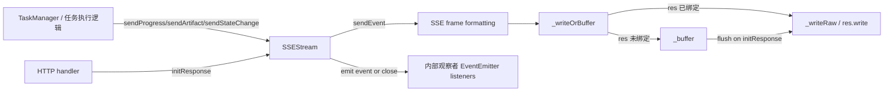

# streaming_event_channel（`src.protocols.a2a.streaming.SSEStream`）技术深潜

`streaming_event_channel` 模块做的事可以用一句话概括：**把 A2A 任务执行过程中的离散状态变化，稳定地变成一条可持续消费的 SSE 事件流**。它解决的不是“怎么发一条消息”这么简单的问题，而是“当连接尚未建立、连接中途抖动、事件高频产生时，如何仍然给调用方一个一致、可观察、可收尾的流式通道”。如果没有这个模块，上层通常会把 HTTP 响应对象和业务事件硬绑在一起，结果是生命周期混乱、丢事件不可控、测试也难做。

## 这个模块为什么存在：先理解问题空间

A2A 任务天然是“长生命周期 + 多阶段”的：任务可能先进入排队，再执行，再产出 artifact，再状态迁移。对调用方（UI、SDK、其他 agent）来说，最有价值的信息恰恰是“过程”，而不是最后一个静态结果。SSE（Server-Sent Events）是这类单向实时推送的合适协议，但直接在业务代码里 `res.write(...)` 会立刻遇到几个实际问题。

第一，业务事件可能早于 HTTP 通道就绪产生。第二，事件格式和协议细节（`event:`、`data:`、分隔空行）会污染业务层。第三，连接关闭语义不统一，容易出现“业务还在写、底层已断开”的隐性错误。`SSEStream` 的设计就是把这些横切问题集中封装，让上层专注“发什么事件”，而不是“如何安全地发”。

## 心智模型：把它想成“有暂存区的广播话筒”

可以把 `SSEStream` 想象成一个现场发布会的话筒系统：

- 业务代码是发言人，只负责说“这是 progress / artifact / state”。
- `SSEStream` 是音控台，负责把内容包装成标准 SSE 帧。
- HTTP `res` 是外放音箱；音箱还没接上时，音控台先把要播的内容放入暂存区（`_buffer`）。
- 音箱接上（`initResponse`）后，先把暂存区清空回放，再继续实时播报。

这个模型解释了模块里最重要的抽象边界：**事件生产与事件传输被解耦**。生产可以先发生，传输可以后绑定。

## 架构与数据流



从执行路径看，有两条“热路径”。第一条是实时路径：`sendProgress/sendArtifact/sendStateChange -> sendEvent -> _writeOrBuffer -> _writeRaw -> res.write`。第二条是延迟绑定路径：当 `_res` 还没准备好时，消息先入 `_buffer`，后续 `initResponse` 一次性 flush。后一条路径是这个模块区别于“裸 SSE 写法”的关键价值。

需要特别说明的是：当前提供的依赖信息只明确了本模块核心组件是 `src.protocols.a2a.streaming.SSEStream`，以及它位于 A2A 协议分层中；并未提供完整函数级 `depends_on/depended_by` 边。因此上图中 `TaskManager / HTTP handler` 是按模块角色进行的架构定位说明，而不是声称某个具体函数签名调用关系。

## 组件深潜：`SSEStream` 如何思考

`SSEStream` 是一个继承 `EventEmitter` 的状态型对象。它的内部状态很少，但每个字段都对应一个明确设计意图：`_res` 表示传输通道是否可写，`_buffer` 解决通道未就绪时的暂存，`_maxBufferSize` 防止内存无限增长，`_closed` 提供幂等关闭语义。

构造函数 `constructor(opts)` 接收 `res` 与 `maxBufferSize`。这里的非显式约束是：`maxBufferSize` 默认 1000，且超限时采用 `shift()` 丢弃最旧事件。这个策略明显偏向“保持最近态可见性”而非“绝对完整历史”。对于实时监控，这通常是合理取舍。

`initResponse(res)` 是传输绑定点。它先写入 SSE 所需响应头（`text/event-stream`、`no-cache`、`keep-alive`），然后按缓冲顺序逐条 `_writeRaw`，最后清空 `_buffer`。这里的隐含契约是：**同一个 `SSEStream` 应视为单消费者通道**。因为 `_res` 只保存一个对象，重新绑定意味着后续写入将面向新的 response。

`sendEvent(event, data)` 是统一出口。它负责把任意业务对象转为 SSE wire format：

- 若 `data` 已是字符串，直接发送。
- 否则 `JSON.stringify(data)`。
- 按 `event: <type>\ndata: <payload>\n\n` 组帧。

之后它不仅写/缓冲，还会 `emit('event', { event, data })`。这一步让流通道同时具备“网络输出”和“进程内观测”两个面向，便于日志、指标、测试探针订阅。

`sendProgress(taskId, message, progress)`、`sendArtifact(taskId, artifact)`、`sendStateChange(taskId, oldState, newState)` 是语义化薄封装。它们将事件类型固定为 `progress` / `artifact` / `state`，并统一注入 `timestamp`。这些方法不是技术必需，而是领域语义层：上游不需要重复拼字段，也减少事件 schema 漂移。

`close()` 的价值是生命周期收敛。它通过 `_closed` 保证幂等；若有 `_res` 则尝试 `end()`（异常吞掉），最后 `emit('close')`。异常吞掉意味着“关闭是尽力而为，不再向调用方抛出传输层细节”，这简化了上层状态机，但也让底层错误不透明。

`isClosed()` 和 `getBuffer()` 是读侧可观测接口。`getBuffer()` 返回拷贝（`slice()`）避免外部篡改内部缓冲，这是一个细小但重要的封装边界。

私有方法 `_writeOrBuffer(msg)` 与 `_writeRaw(msg)` 体现了核心传输策略：先判断是否有可用通道，没有就缓冲；有就直写。`_writeRaw` 在写异常时仅将 `_closed = true`，不主动 `emit('close')`，所以调用方若依赖关闭通知，需要显式调用 `close()` 或自己检测状态变化。

## 依赖与契约分析

从代码层面，`SSEStream` 仅显式依赖 Node.js 的 `events`（`EventEmitter`）。这让它非常轻量，几乎可以在任何 Node HTTP 栈复用。

它对外部对象最关键的契约是 `res`：必须支持 `writeHead(status, headers)`、`write(chunk)`、`end()`，即典型 Node HTTP response 接口。若上游传入的是“类 response”对象，也要满足这些最小方法集。

在被调用方视角，`SSEStream` 对调用者提出的契约同样明确但隐性：

1. 事件 `data` 若不是字符串，需可被 `JSON.stringify` 安全序列化；循环引用会在 `sendEvent` 抛错（该方法未捕获 stringify 异常）。
2. `send*` 在 `_closed` 后是静默 no-op；调用方如果需要“写失败即报错”，需要额外包一层策略。
3. 若期望“全量事件不丢失”，必须合理设置 `maxBufferSize` 并尽早 `initResponse`，否则会按 FIFO 丢弃旧事件。

## 设计决策与权衡

这个模块采取了“最小可用流通道”设计：少依赖、少状态、弱侵入。它牺牲了一些高级能力（重放游标、背压反馈、多订阅路由），换来了可读性和低维护成本。

在正确性与性能的平衡上，`_buffer.shift()` 是 O(n)；高吞吐下不是最优队列实现。但在默认 `1000` 上限和典型任务事件频率下，这个成本通常可接受，且实现直观。若未来事件密度显著上升，可以替换为环形缓冲区而不改变对外 API。

在灵活性与一致性上，模块提供 `sendEvent`（自由）与语义化 `sendProgress/sendArtifact/sendStateChange`（约束）双轨。这样既允许扩展事件类型，也鼓励团队在常见路径上遵循统一 schema。

在错误处理策略上，代码偏向“通道健壮、业务继续”：写异常和 `end()` 异常都被吞掉/降级。这减少了上层崩溃风险，但代价是诊断信息可能不足。生产环境通常会在 `event`/`close` 监听器外加监控埋点补齐可观测性。

## 使用方式与示例

典型使用分两阶段：先产生事件，再绑定或直接绑定响应通道。

```javascript
const { SSEStream } = require('./src/protocols/a2a/streaming');

const stream = new SSEStream({ maxBufferSize: 500 });

// 业务先跑，连接稍后建立也没关系
stream.sendProgress('task-1', 'queued', 0);
stream.sendStateChange('task-1', 'pending', 'running');

// HTTP handler 中绑定 response
stream.initResponse(res);

// 持续推送
stream.sendProgress('task-1', 'processing chunk 1', 20);
stream.sendArtifact('task-1', { type: 'log', content: 'step ok' });

// 收尾
stream.sendStateChange('task-1', 'running', 'completed');
stream.close();
```

如果你做测试或观测，可以订阅内部事件而不依赖网络层：

```javascript
stream.on('event', (evt) => {
  // evt: { event, data }
});

stream.on('close', () => {
  // stream closed
});
```

## 新贡献者最该注意的坑

最容易踩的是“以为它保证可靠投递”。实际上它保证的是“有限缓冲 + 最终尽力发送”，不是消息队列语义。断链重连、按事件 ID 续传、exactly-once 都不在当前设计范围内。

另一个常见误区是忽略 `JSON.stringify` 失败路径。`sendEvent` 没有包裹 stringify 异常，如果数据结构包含循环引用，异常会直接冒泡到调用栈。对于不受控对象，建议调用方先做序列化卫生检查。

还要注意 `initResponse` 的调用时机和幂等性。代码未阻止重复调用，后一次会覆盖 `_res`。如果在多处 handler 中误复用同一个 `SSEStream` 实例，可能导致事件写到错误连接。

最后，`_writeRaw` 发生异常时只把 `_closed` 设为 `true`，不会自动触发 `close` 事件。若你依赖 `close` 作为资源释放触发器，建议在外层检测 `isClosed()` 并主动 `close()` 统一收敛。

## 参考阅读

- [task_lifecycle_orchestration](task_lifecycle_orchestration.md)
- [remote_invocation_client](remote_invocation_client.md)
- [a2a_protocol](a2a_protocol.md)

> 说明：以上链接用于定位 A2A 协议上下文。当前文档仅基于已提供代码与模块结构；未提供的函数级依赖边未做臆测。
