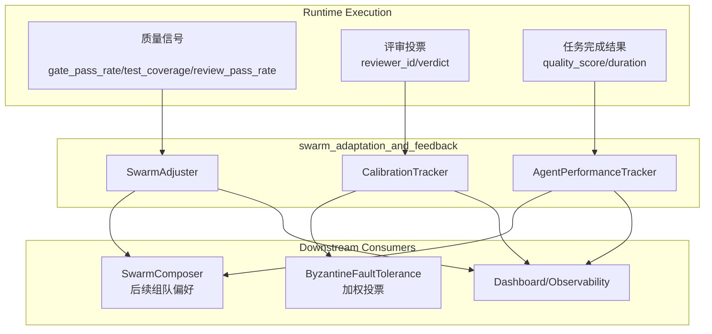
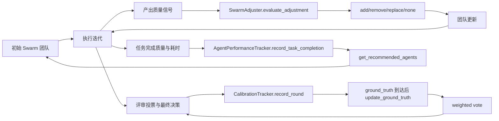
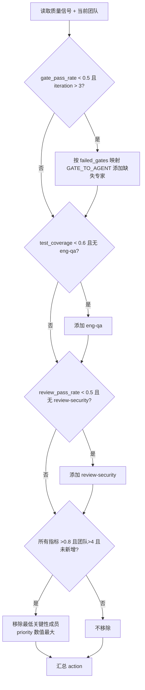
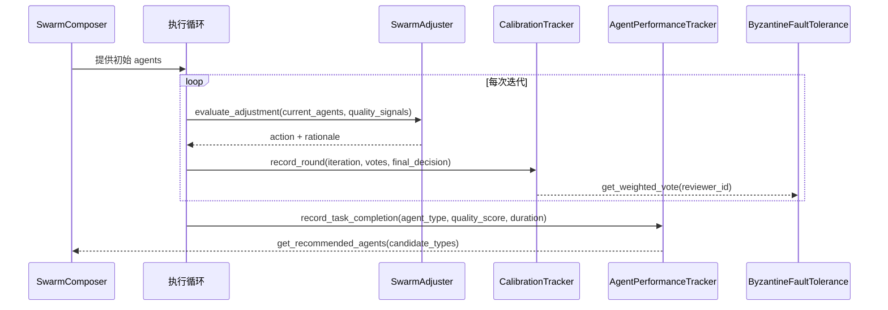

# swarm_adaptation_and_feedback 模块文档

## 1. 模块定位与设计目标

`swarm_adaptation_and_feedback` 是 Swarm Multi-Agent 体系中的“运行期自适应与反馈闭环”模块，包含三个核心组件：`SwarmAdjuster`、`CalibrationTracker`、`AgentPerformanceTracker`。如果说 `swarm_classification_and_composition` 负责在任务开始前给出初始团队，那么本模块负责在任务进行中和任务完成后，持续回答三个关键问题：当前团队是否需要调整、评审者的意见可信度如何变化、哪些代理类型在长期表现更稳定。

这个模块存在的核心原因，是让多代理系统从“一次性静态编排”升级为“可学习、可纠偏、可复盘”的动态系统。它通过质量信号触发中途调队，通过评审校准降低“噪声投票”的影响，通过性能统计反哺后续组队策略，最终形成一个闭环：**执行 -> 反馈 -> 调整 -> 再执行**。

从系统边界看，本模块不直接负责任务分配协议与消息格式（见 [swarm_coordination_and_messages.md](swarm_coordination_and_messages.md)），也不直接负责拜占庭共识过程（见 [拜占庭容错.md](拜占庭容错.md)），而是为这些机制提供动态输入与历史证据。模块全景可参考 [Swarm Multi-Agent.md](Swarm Multi-Agent.md)，初始组队细节可参考 [swarm_classification_and_composition.md](swarm_classification_and_composition.md)。

---

## 2. 架构概览与系统关系



这个架构体现了三个组件的职责分离。`SwarmAdjuster` 使用“当前局势”做短周期调度建议；`CalibrationTracker` 使用“评审历史”更新 reviewer 可信度；`AgentPerformanceTracker` 使用“任务结果历史”给出长期偏好。前两者偏在线决策支持，后者偏离线/跨运行累积。三者都可以被 Dashboard 或 API 层读取用于解释和可视化。

---

## 3. 数据与反馈闭环



这里最重要的设计思想是“快反馈”和“慢反馈”并存。`SwarmAdjuster` 的规则基于当前迭代指标，响应速度快；`AgentPerformanceTracker` 与 `CalibrationTracker` 通过滚动历史形成更稳健的长期信号，防止单次异常造成策略抖动。

---

## 4. 核心组件详解

## 4.1 `swarm.adjuster.SwarmAdjuster`

`SwarmAdjuster` 是一个纯规则决策器。它读取当前团队与质量信号，返回“是否调整团队”的建议，不直接执行增删代理动作。该设计让它可以在不同执行器、不同 orchestration 层复用。

### 4.1.1 核心输入输出

`evaluate_adjustment(current_agents, quality_signals)` 的输入包含两部分：

- `current_agents: List[Dict[str, Any]]`，每个 agent 至少应包含 `type` 与 `priority`。
- `quality_signals: Dict[str, Any]`，核心字段包括 `gate_pass_rate`、`test_coverage`、`review_pass_rate`、`iteration_count`、`failed_gates`。

返回值为结构化建议：

- `action`: `none | add | remove | replace`
- `agents_to_add`: `[{type, reason}, ...]`
- `agents_to_remove`: `[{type, reason}, ...]`
- `rationale`: 可读解释文本

### 4.1.2 规则引擎行为



内部共有四条硬编码规则：

第一条规则面向持续失败场景。当门禁通过率低于 50% 且迭代次数大于 3 时，系统会遍历 `failed_gates`，通过 `GATE_TO_AGENT` 把失败类型映射到专业代理类型，例如 `security -> ops-security`、`lint -> review-code`、`e2e -> eng-qa`。只有当前团队中缺失该类型时才会添加，避免重复建议。

第二条规则关注测试覆盖率。当 `test_coverage < 0.6` 且不存在 `eng-qa`，会强制补 QA 类型代理。这条规则在设计上比 gate 失败更“保底”，即便 failed_gates 未提供具体测试门禁名称，也能触发补强。

第三条规则关注评审通过率。当 `review_pass_rate < 0.5` 且团队里没有 `review-security`，会增加安全审查角色，用于提升评审稳健性。

第四条规则是缩编规则。当三个核心信号都高于 80%，且团队超过 4 人，并且本轮没有新增动作时，系统会从 `priority >= 3` 的“可选成员”中找出优先级数值最大的代理建议移除。这里约定 `priority` 数值越大，关键性越低。

### 4.1.3 `GATE_TO_AGENT` 映射说明

`GATE_TO_AGENT` 是质量门禁到专家角色的静态映射表，是该组件可解释性的核心。它覆盖测试、安全、代码质量、性能、部署、基础设施、数据库、前端、API、文档等常见领域。映射表采用 `gate_name.lower()` 匹配，因此调用方应尽量传递语义清晰、稳定的 gate 名称。

### 4.1.4 复杂度与副作用

`evaluate_adjustment` 时间复杂度近似 O(n + m)，其中 n 为当前团队规模，m 为 failed_gates 数量。该方法本身无 I/O、无外部依赖、无持久化副作用，是纯计算逻辑，便于单元测试和回放。

### 4.1.5 使用示例

```python
from swarm.adjuster import SwarmAdjuster

adjuster = SwarmAdjuster()
current_agents = [
    {"type": "orch-planner", "priority": 1},
    {"type": "eng-backend", "priority": 1},
    {"type": "review-code", "priority": 2},
]
quality_signals = {
    "gate_pass_rate": 0.42,
    "test_coverage": 0.55,
    "review_pass_rate": 0.61,
    "iteration_count": 5,
    "failed_gates": ["security", "e2e"],
}

plan = adjuster.evaluate_adjustment(current_agents, quality_signals)
print(plan["action"])         # add
print(plan["agents_to_add"])  # 可能包含 ops-security, eng-qa
print(plan["rationale"])
```

---

## 4.2 `swarm.calibration.CalibrationTracker`

`CalibrationTracker` 用于衡量 reviewer 与最终决策、以及与真实结果（ground truth）的一致程度。它解决的问题是：不同评审者的判断质量并不一致，系统应逐步学习“谁更可靠”，并将其转化为投票权重。

### 4.2.1 持久化模型

默认文件路径是 `.loki/council/calibration.json`。内部数据有两个顶层键：

- `reviewers`: reviewer 维度的累计统计
- `rounds`: 审查轮次历史（仅保留最近 100 轮）

该设计兼顾了聚合统计与可审计原始轨迹：前者用于快速权重查询，后者用于回溯分析。

### 4.2.2 生命周期方法

`__init__(calibration_file=None)` 会立即触发 `_load()`。若文件不存在或 JSON 损坏，会回退到空结构 `{'reviewers': {}, 'rounds': []}`。

`save()` 负责写回磁盘，会自动创建父目录，但不是原子写入；如果进程在写入中断，可能得到部分文件。

`record_round(iteration, votes, final_decision, ground_truth=None)` 是核心入口。它会为每个 vote 更新 reviewer 统计项，如 `total_reviews`、`agreements_with_final`、`disagreements_with_final`，并用 EMA 更新 `calibration_score`。

### 4.2.3 校准算法（EMA）

组件使用固定学习率 `alpha=0.1`：

`new_score = (1 - alpha) * old_score + alpha * match_score`

其中 `match_score` 由 reviewer 是否与 `final_decision` 一致决定，一致为 1.0，不一致为 0.0。默认初值是 0.5。这意味着系统既保留历史惯性，又能逐步吸收新表现。

### 4.2.4 真实结果回填

`update_ground_truth(iteration, ground_truth)` 用于后验修正：当实际结果晚于评审流程到达时，可补写到对应 round，并更新 reviewer 的 `correct_predictions`、`false_positives`、`false_negatives`。它从最近轮次向前查找匹配 iteration，因此若 iteration 重复，更新的是“最近一条”记录。

### 4.2.5 查询与加权

`get_reviewer_stats(reviewer_id)` 与 `get_all_stats()` 提供读取接口。

`get_weighted_vote(reviewer_id)` 提供投票权重策略：当 reviewer 缺乏足够样本（不存在或 `total_reviews < 5`）时返回 1.0；样本足够后返回 `calibration_score`。这种“冷启动保护”可以避免新 reviewer 因少量偶然结果被过早放大或压制。

### 4.2.6 使用示例

```python
from swarm.calibration import CalibrationTracker

tracker = CalibrationTracker()
tracker.record_round(
    iteration=12,
    votes=[
        {"reviewer_id": "rev-a", "verdict": "approve"},
        {"reviewer_id": "rev-b", "verdict": "reject"},
    ],
    final_decision="approve",
)
tracker.update_ground_truth(iteration=12, ground_truth="approve")
tracker.save()

print(tracker.get_weighted_vote("rev-a"))
```

---

## 4.3 `swarm.performance.AgentPerformanceTracker`

`AgentPerformanceTracker` 跟踪“代理类型级别”的表现，而不是具体实例。它通过质量与耗时的滚动统计，给出下一轮组队可用的排序依据。

### 4.3.1 存储与数据结构

默认路径为 `.loki/memory/agent-performance.json`。每个 `agent_type` 下维护：

- `total_tasks`
- `avg_quality`
- `avg_duration`
- `recent_scores`（窗口长度最多 20）
- `last_updated`

### 4.3.2 记录逻辑

`record_task_completion(agent_type, quality_score, duration_seconds)` 会先进行输入钳制：`quality_score` 限制到 `[0,1]`，`duration_seconds` 下限为 0。然后按增量平均公式更新 `avg_quality` 与 `avg_duration`，并维护最近分数窗口。该方法不自动保存，需要调用方显式 `save()`。

### 4.3.3 趋势计算与推荐排序

`_compute_trend(recent_scores)` 将窗口按前后两半分组，对比 `newer_avg - older_avg` 并截断到 `[-1, 1]`。分数为正表示质量在提升，负值表示下降。

`get_recommended_agents(candidate_types, top_n=5)` 的排序分值是：

`score = avg_quality + trend * 0.1`

无历史数据的候选类型使用中性分 0.5。这样既让历史质量成为主导，也允许趋势在边界决策中起到“微调”作用。

### 4.3.4 持久化安全性

`save()` 使用临时文件 + `os.replace()`，是原子写入，能有效降低写中断导致的数据损坏风险。相比之下，`CalibrationTracker.save()` 不是原子写入，这也是两个组件在可靠性策略上的一个差异点。

### 4.3.5 使用示例

```python
from swarm.performance import AgentPerformanceTracker

perf = AgentPerformanceTracker()
perf.record_task_completion("eng-backend", quality_score=0.91, duration_seconds=145.2)
perf.record_task_completion("eng-backend", quality_score=0.88, duration_seconds=132.0)
perf.record_task_completion("eng-qa", quality_score=0.79, duration_seconds=210.5)
perf.save()

print(perf.get_performance_scores())
print(perf.get_recommended_agents(["eng-backend", "eng-qa", "eng-frontend"], top_n=2))
```

---

## 5. 端到端交互流程（与其他模块协同）



这个流程体现了跨模块协同关系：`SwarmComposer` 负责“起盘”，`SwarmAdjuster` 负责“中途调队”，`CalibrationTracker` 为 `ByzantineFaultTolerance` 提供可信投票权重，`AgentPerformanceTracker` 再把执行结果反馈给下一轮 `SwarmComposer`。这也是 Swarm 系统逐步“越跑越准”的基础机制。

---

## 6. 配置、运维与可观测性建议

本模块的可配置项主要是存储路径：

- `CalibrationTracker(calibration_file=...)`
- `AgentPerformanceTracker(storage_path=...)`

`SwarmAdjuster` 的阈值与映射当前是硬编码（如 0.5/0.6/0.8、`GATE_TO_AGENT`）。如果你的业务希望更细粒度控制，建议在上层包装配置注入或扩展子类，不建议直接在运行时 monkey patch 常量。

在运维层面，建议把 `.loki/council` 与 `.loki/memory` 纳入持久卷，并通过 Dashboard 显示以下指标：调整动作分布（add/remove/replace/none）、reviewer calibration 分布、代理类型趋势分布。相关 UI 组件可参考 [dashboard-ui.components.loki-learning-dashboard](Dashboard UI Components.md) 与 [Monitoring and Observability Components.md](Monitoring and Observability Components.md)。

---

## 7. 边界条件、错误条件与已知限制

首先，`SwarmAdjuster` 对缺失信号采用“乐观默认值”（默认 1.0），这会导致数据缺失时倾向于不调整团队。若你的采集链路可能丢字段，应在调用前做 schema 校验，避免误判“系统健康”。

其次，`failed_gates` 的映射依赖字符串标准化。未出现在 `GATE_TO_AGENT` 中的门禁名称不会触发新增代理，可能造成“明明失败却无补强建议”。实际部署中应维护一份组织内统一 gate 命名规范，并定期扩展映射表。

第三，`CalibrationTracker` 的时间戳写法是 `datetime.now(timezone.utc).isoformat() + 'Z'`，会产生形如 `+00:00Z` 的双时区后缀格式，这在某些严格解析器中并非标准 RFC3339。若下游系统严格校验时间格式，需要做兼容处理。

第四，`CalibrationTracker.save()` 非原子写入，且两个 tracker 都没有内建文件锁；多进程并发写时可能出现覆盖、丢更新或短暂不一致。对于高并发部署，应在上层引入单写者策略或外部存储（如数据库/对象存储）。

第五，`AgentPerformanceTracker` 只看“代理类型”均值，不区分任务难度、上下文长度、依赖波动等混杂因素。它适合做粗粒度偏好，不应被解释为严格因果评估。

第六，`update_ground_truth` 只更新匹配 iteration 的最近一条记录；如果迭代编号重用，会造成历史条目无法被预期更新。生产环境建议保证 iteration 在一个会话内单调递增且唯一。

---

## 8. 扩展指南

扩展 `SwarmAdjuster` 时，推荐把规则拆分为可组合策略函数，例如 `rule_low_gate_pass_rate(...)`、`rule_low_coverage(...)`，再在主流程串联，这样可以为不同行业构建不同规则集。若需要按租户差异化阈值，可在上层注入阈值配置对象，并在调用前转换成统一 `quality_signals`。

扩展 `CalibrationTracker` 时，可以保留当前 EMA 作为快速反馈，同时引入更长期的置信区间或贝叶斯平滑，用于降低样本不足 reviewer 的波动。还可以把 `ground_truth` 从二元 verdict 扩展为多标签结果，但要同步修改误判统计口径。

扩展 `AgentPerformanceTracker` 时，常见方向是引入分场景统计（例如按任务类型、仓库、技术栈分桶），并将 `score = quality + trend*0.1` 升级为可学习排序函数。若要保持与当前接口兼容，可先在内部增加字段，再让 `get_performance_scores()` 向后兼容输出。

---

## 9. 快速实践模板

下面是一个将三个组件串联的最小闭环示例：

```python
from swarm.adjuster import SwarmAdjuster
from swarm.calibration import CalibrationTracker
from swarm.performance import AgentPerformanceTracker

adjuster = SwarmAdjuster()
calib = CalibrationTracker()
perf = AgentPerformanceTracker()

# 1) 运行中调队建议
plan = adjuster.evaluate_adjustment(current_agents, quality_signals)

# 2) 记录评审轮次并持久化
calib.record_round(iteration, votes, final_decision)
if ground_truth_available:
    calib.update_ground_truth(iteration, ground_truth)
calib.save()

# 3) 记录任务完成并更新推荐
for item in completed_tasks:
    perf.record_task_completion(item["agent_type"], item["quality"], item["duration"])
perf.save()
next_round_candidates = perf.get_recommended_agents(candidate_types, top_n=5)
```

当你把这个闭环接入编排层后，系统会逐步形成面向你自身业务的数据特征，而不是长期依赖固定先验。

---

## 10. 相关文档

- 模块全景：[`Swarm Multi-Agent.md`](Swarm Multi-Agent.md)
- 初始分类与组队：[`swarm_classification_and_composition.md`](swarm_classification_and_composition.md)
- 注册表与消息：[`swarm_registry_and_types.md`](swarm_registry_and_types.md)、[`swarm_coordination_and_messages.md`](swarm_coordination_and_messages.md)
- 共识与治理：[`拜占庭容错.md`](拜占庭容错.md)
- API 与服务接入：[`API Server & Services.md`](API Server & Services.md)
