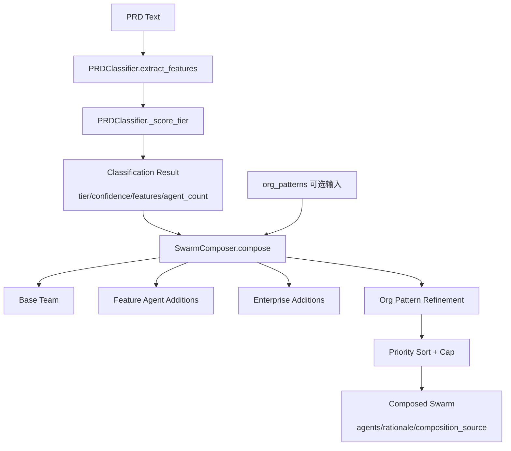
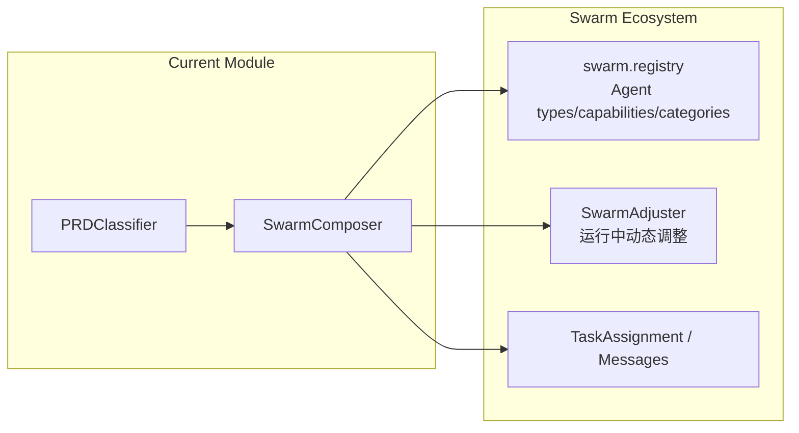
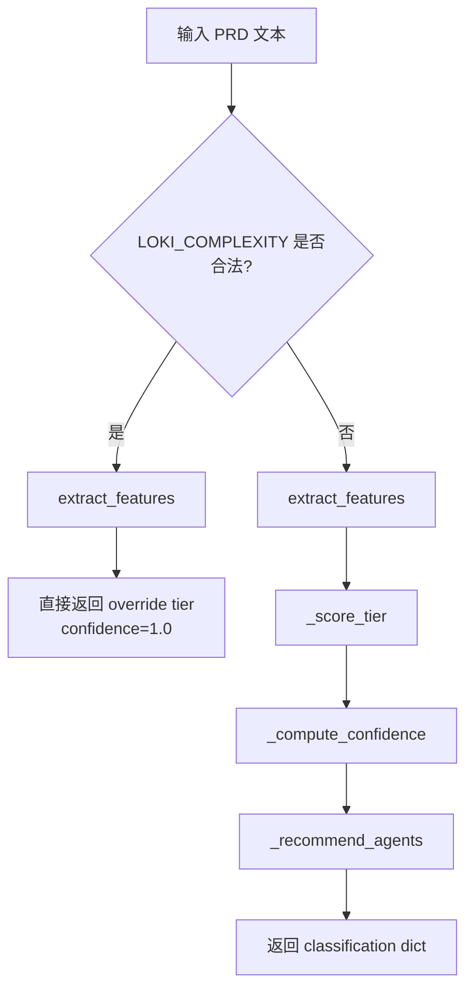
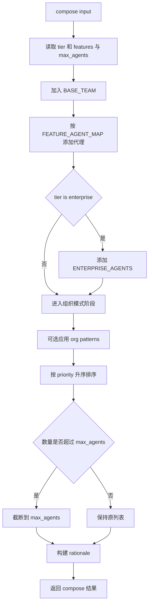

# swarm_classification_and_composition 模块文档

## 1. 模块简介与设计动机

`swarm_classification_and_composition` 是 Swarm Multi-Agent 体系中的“入口决策层”，由 `swarm.classifier.PRDClassifier` 与 `swarm.composer.SwarmComposer` 两个核心组件组成。它的主要职责是：先把 PRD（Product Requirements Document）文本快速归类为复杂度等级，再将该复杂度与特征信号映射为一个可执行的多代理团队配置。

这个模块存在的核心价值是把“需求理解”与“团队编排”从 LLM 推理中剥离出来，使用规则驱动、可解释、可复现的机制做第一轮规划。相比完全依赖模型推断，这种设计具备更低延迟、更稳定结果、更易审计和更便于运维调参的特点，特别适合需要在 API 请求路径中实时完成团队初始化的场景。

从系统分层上看，本模块是 Swarm 生命周期中的前置阶段：它不负责具体任务执行与投票共识，而是输出“谁应该参与执行”。如果你需要了解执行中动态调优，请参考 [Swarm 团队组建](Swarm 团队组建.md) 中的 `SwarmAdjuster`；如果你需要了解代理实体、能力与类型字典，请参考 [代理注册表与消息系统](代理注册表与消息系统.md)；关于模块全貌请参考 [Swarm Multi-Agent](Swarm Multi-Agent.md)。

---

## 2. 架构概览



这条链路展示了本模块的完整数据路径。`PRDClassifier` 负责把非结构化文本转为结构化分类结果；`SwarmComposer` 再把分类结果转为代理列表。分类输出中的 `features` 与 `agent_count` 是组合阶段的直接输入，因此二者之间是强耦合协议关系（通过字典字段契约实现，而非类对象）。

---

## 3. 组件关系与系统定位



虽然本模块仅包含分类与初始组队两部分，但它依赖 `swarm.registry` 中的代理类型生态（如 `SWARM_CATEGORIES`）来推断角色归属，并为后续任务分发（`TaskAssignment`）提供候选团队。换句话说，本模块定义的是“初始编制”，而不是“最终编制”；在项目运行后，`SwarmAdjuster` 可能继续增减成员。

---

## 4. PRDClassifier 深入解析

### 4.1 组件职责

`PRDClassifier` 是一个纯规则、无外部网络调用的复杂度分类器。它通过关键字命中统计来估计项目复杂度 tier，并给出推荐代理数量。其目标不是语义完美理解，而是在工程上提供稳定可解释的“足够好初判”。

### 4.2 输入输出契约

- 输入：`prd_text: str`
- 输出：`Dict[str, Any]`，关键字段包括：
  - `tier`: `simple | standard | complex | enterprise`
  - `confidence`: `0.0 ~ 1.0`
  - `features`: 每个特征维度的命中数
  - `agent_count`: 推荐代理数量
  - `override`: 是否由环境变量强制覆盖

### 4.3 特征体系

分类器维护 7 个特征维度：`service_count`、`external_apis`、`database_complexity`、`deployment_complexity`、`testing_requirements`、`ui_complexity`、`auth_complexity`。每个维度都对应一组关键字列表，检测策略是“大小写归一化后做子串匹配”，并且同一关键字在同一维度内至多计数一次。

此外，存在单独的 `ENTERPRISE_KEYWORDS`，用于强触发 `enterprise`（例如 `soc2`、`hipaa`、`gdpr`、`high availability` 等）。

### 4.4 内部方法行为

`extract_features(prd_text)` 会逐维度扫描关键字并返回计数字典。空文本时返回全 0。

`_score_tier(features, prd_text)` 根据总命中与活跃维度数评分：先判断 enterprise，再判断 complex，再到 standard，最后 simple。它的逻辑优先级非常关键：即使总命中不高，只要命中 enterprise 专属词也会直接升级到企业级。

`_compute_confidence(features)` 使用“到 tier 边界距离”估算置信度。边界定义为 `5/6`、`15/16`、`25/26`（以 5.5、15.5、25.5 计算距离），越靠边界置信度越低。若活跃维度很多会略增，若总命中很低（<=2）会封顶到 0.7。

`classify(prd_text)` 是统一入口。它先读取 `LOKI_COMPLEXITY` 环境变量；若该值是合法 tier，则直接覆盖分类结果并返回 `confidence=1.0`、`override=True`。否则按正常规则计算。

### 4.5 分类流程图



### 4.6 关键工程特性与副作用

`PRDClassifier` 基本是纯函数风格，唯一外部副作用是读取进程环境变量 `LOKI_COMPLEXITY`。这意味着在测试环境、CI、容器运行时，只要环境变量配置不同，就会改变最终分类结果。对于线上系统，建议将该变量纳入配置审计，避免出现“同一 PRD 在不同实例分类不一致”的问题。

---

## 5. SwarmComposer 深入解析

### 5.1 组件职责

`SwarmComposer` 将分类输出变成最终团队配置，目标是在保证最小可执行团队的同时，尽量覆盖特征所需能力。它的设计遵循“基础团队 + 按需增量 + 上限裁剪”的策略。

### 5.2 输入输出契约

- 输入 1：`classification: Dict[str, Any]`（来自 `PRDClassifier.classify`）
- 输入 2：`org_patterns: Optional[List[Dict[str, Any]]]`（组织知识图谱/经验模式）
- 输出：
  - `agents`: `[{type, role, priority}, ...]`
  - `rationale`: 可读解释文本
  - `composition_source`: `classifier | org_knowledge | override`

### 5.3 组队步骤与算法



`BASE_TEAM` 永远包含 3 个关键角色：`orch-planner`、`eng-backend`、`review-code`。随后根据特征映射添加 `eng-database`、`eng-frontend`、`eng-api`、`ops-devops`、`eng-qa`、`ops-security` 等角色。若为企业级再附加 `ops-sre`、`ops-compliance`、`data-analytics`。

### 5.4 org_patterns 机制

`_apply_org_patterns` 会把 `name/pattern/description/category` 拼接成一段小写文本，再用技术词典（如 `react`、`kubernetes`、`terraform`、`stripe`、`flutter`、`machine learning`）做子串匹配，并将匹配结果映射到代理类型。随后通过 `SWARM_CATEGORIES` 反查角色类别（engineering/operations/data 等）。

这一机制提供了“组织经验注入”的能力：即使 PRD 中没有明显提到某技术，只要组织模式中出现，也可以补充对应代理。

### 5.5 优先级与人数上限

`priority` 语义如下：`1=关键`、`2=重要`、`3=可选`。最终会按优先级排序并执行截断。也就是说，当总人数超限时，低优先级成员优先被裁剪。这种策略保证了核心执行链不会被挤掉，但也意味着“后加的高价值低优先级角色”可能被硬截断。

### 5.6 解释文本生成

`_build_rationale` 会输出 tier、活跃特征、团队类型列表和来源。它对可观测性很关键：上层 API 或 Dashboard 可直接展示这段文本，帮助用户理解“为什么是这套团队”。

---

## 6. 典型使用方式

### 6.1 最小可用示例

```python
from swarm.classifier import PRDClassifier
from swarm.composer import SwarmComposer

prd_text = """
Build a SaaS platform with OAuth2 login, PostgreSQL, Docker deployment,
CI/CD, webhook integrations, and dashboard with real-time updates.
"""

classifier = PRDClassifier()
classification = classifier.classify(prd_text)

composer = SwarmComposer()
composition = composer.compose(classification)

print(classification)
print(composition["agents"])
print(composition["rationale"])
```

### 6.2 注入组织知识示例

```python
org_patterns = [
    {
        "name": "Frontend stack",
        "pattern": "We standardize on React + Next.js",
        "description": "All customer-facing apps follow this stack",
        "category": "frontend"
    },
    {
        "name": "Deployment baseline",
        "pattern": "Kubernetes + Terraform",
        "description": "Production infra baseline",
        "category": "operations"
    }
]

composition = composer.compose(classification, org_patterns=org_patterns)
print(composition["composition_source"])  # 可能为 org_knowledge
```

### 6.3 强制覆盖复杂度

```bash
export LOKI_COMPLEXITY=enterprise
```

```python
classification = classifier.classify(prd_text)
assert classification["override"] is True
assert classification["tier"] == "enterprise"
```

该方式常用于压测、演示、应急策略切换，但不建议在常规生产流程中长期开启。

---

## 7. 配置与可扩展点

本模块的配置面主要来自代码常量与环境变量，而非独立配置文件。若需要扩展，请重点关注以下点位。

第一，扩展分类能力时，应优先在 `FEATURE_KEYWORDS` 中新增关键字，并评估是否需要增加新特征维度。新增维度后，`SwarmComposer.FEATURE_AGENT_MAP` 也应同步添加映射，否则特征命中不会影响组队。

第二，扩展团队策略时，可修改 `BASE_TEAM`、`ENTERPRISE_AGENTS` 或 `FEATURE_AGENT_MAP`。建议保持 `BASE_TEAM` 稳定，因为它承载最小执行闭环。

第三，扩展组织知识识别时，维护 `_apply_org_patterns` 内的 `tech_to_agent` 词典即可。若你新增了代理类型，请确保它在注册表分类中可被 `SWARM_CATEGORIES` 识别，否则角色可能回退为默认 `engineering`。

---

## 8. 边界条件、错误场景与限制

### 8.1 文本匹配局限

分类与组织模式均采用 `keyword in text` 子串匹配。这很快，但存在误报与漏报风险。例如，“no docker needed” 仍会命中 `docker`；中文 PRD 若不含英文技术词，命中率会明显下降。

### 8.2 规则阈值的离散跳变

tier 是离散分级，阈值附近（如 5/6、15/16）会出现“文本小改动导致 tier 跳级”。虽然 `_compute_confidence` 已标示不确定性，但上层如果只看 `tier` 可能误判。建议 UI 同时展示 `confidence`。

### 8.3 覆盖模式的治理风险

`LOKI_COMPLEXITY` 覆盖会直接忽略 `_score_tier` 结果。如果运维误配，系统可能长期按错误复杂度组队。建议在 API 层记录 `override` 字段并告警。

### 8.4 组合裁剪导致能力丢失

`compose` 最终只按 `priority` 截断，不做“能力覆盖完整性回检”。在人数受限时，可能裁掉某些对特定任务很关键的专家代理。若你有强约束场景，建议在外层增加二次校验逻辑。

### 8.5 依赖字段的弱契约

`SwarmComposer` 通过 `dict.get` 读取 `classification` 字段，缺失时会使用默认值，这避免了崩溃但也可能掩盖数据问题。例如缺失 `features` 会退化为仅基础团队。生产环境建议在调用前进行 schema 校验。

---

## 9. 与其他模块的协作建议

在端到端系统中，推荐将本模块放在“任务创建”或“会话启动”的同步路径中，并将输出结果写入可观测事件流。之后由执行模块与质量模块接管生命周期。

如果你要实现完整闭环：可先由本模块产出初始团队，再在执行期引入 `SwarmAdjuster`（见 [Swarm 团队组建](Swarm 团队组建.md)）进行动态调优，并结合 `AgentInfo`/`TaskAssignment`（见 [代理注册表与消息系统](代理注册表与消息系统.md)）进行可用代理挑选与任务下发。

---

## 10. 维护者检查清单（建议）

- 每次新增关键字后，验证 tier 分布是否被意外拉高或拉低。
- 每次新增代理类型后，同步检查注册表分类（`SWARM_CATEGORIES`）与 composer 映射。
- 在 CI 中固定若干 PRD 样本做回归测试，确保分类与组队输出稳定。
- 在日志中保留 `classification` 与 `composition_source`，便于线上问题回溯。

这份文档聚焦 `swarm_classification_and_composition` 的实现与行为。关于 Swarm 生态其他能力（容错共识、性能跟踪、消息协议），请按需查阅对应模块文档，避免在本文件中重复展开。
