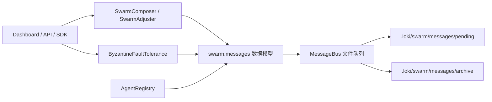
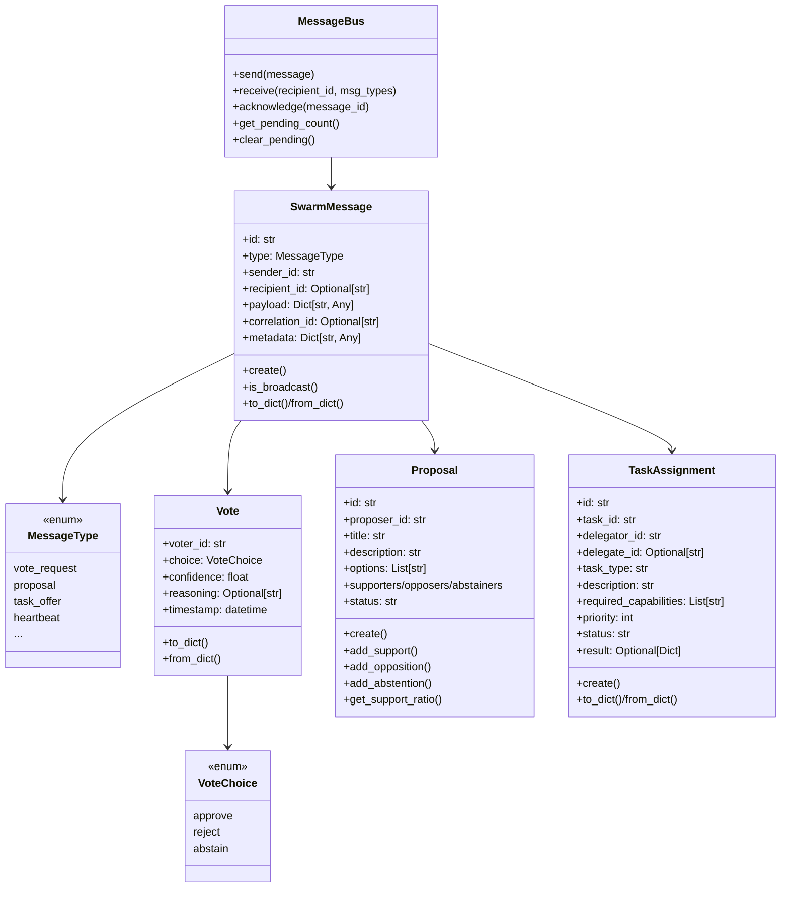
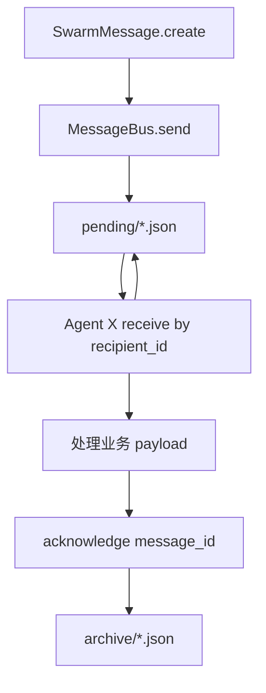
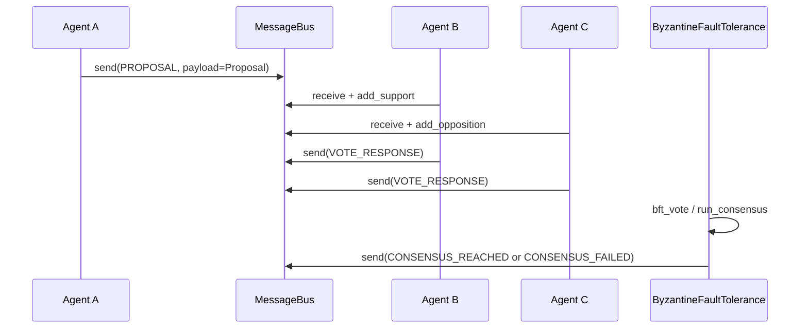
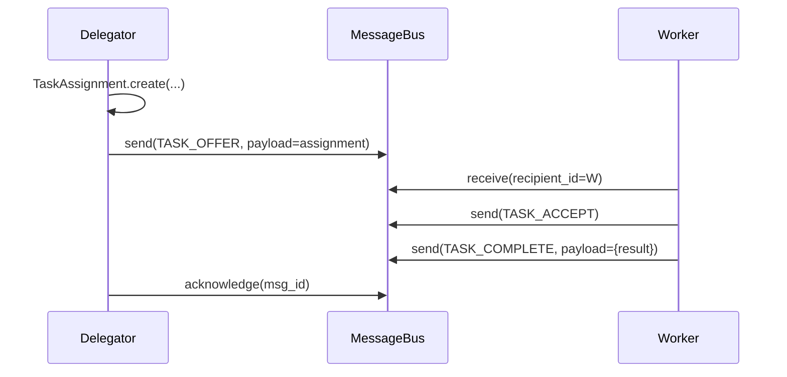

# swarm_coordination_and_messages 模块文档

## 1. 模块简介与设计动机

`swarm_coordination_and_messages`（代码位于 `swarm/messages.py`）是 Swarm 多代理系统中的“通信契约层 + 轻量传输层”。它定义了代理之间如何表达意图（如提案、投票、委派、状态更新），以及这些消息如何被序列化、落盘、读取和归档。这个模块存在的核心价值，是把“协作行为”从具体算法里拆出来，形成统一的消息语义，从而让编队、共识、调度、观测等上层能力都能围绕同一套协议演进。

在工程上，它采用了非常务实的实现方式：消息结构使用 dataclass，协议类型使用 Enum，传输使用基于文件系统的 `MessageBus`。这种设计不依赖外部中间件，便于本地开发、离线运行和故障排查，也非常适合单机/小规模 Swarm 场景。在更大规模部署中，这套协议模型通常会保留，而传输层会被替换为更强一致性的队列或事件总线。

如果你刚接触该系统，可以把本模块理解为“Swarm 的公共语言层”。它不负责决定“选谁做事”（见 [swarm_registry_and_types.md](swarm_registry_and_types.md)），也不负责“如何做拜占庭共识裁决”（见 [拜占庭容错.md](拜占庭容错.md)），但它是这些模块协同运作时共享的消息基础。

---

## 2. 在整体系统中的位置



上图展示了它在系统中的“横向连接”角色。编队与调整模块会产生命令和委派意图，共识模块会产生产案和投票过程信号，注册表模块提供消息涉及的代理身份语义，而 `MessageBus` 则提供最基础的消息交付与归档。对外部系统而言，Dashboard/API/SDK 并不直接依赖文件实现细节，而是通过上层模块间接消费这些消息语义。

需要特别区分两类总线：本模块中的 `MessageBus` 是 Swarm 内部文件消息队列；`api.services.event-bus.EventBus` 是 API 层的内存事件分发器（SSE 订阅历史/过滤模型），两者定位不同，不能互换。

---

## 3. 核心组件总览

虽然你当前关注的核心组件是 `SwarmMessage`、`TaskAssignment`、`Proposal`，但它们依赖一组配套类型共同构成协议。



这张图反映了一个关键设计思想：`Proposal`、`TaskAssignment`、`Vote` 是“业务负载对象”，`SwarmMessage` 是“统一信封”，`MessageBus` 是“最小可用传输层”。也就是说，负载对象可以单独持久化和处理，但在代理间传播时最好统一包裹进 `SwarmMessage.payload`，以便过滤、追踪和关联。

---

## 4. 核心组件详解

## 4.1 `SwarmMessage`

`SwarmMessage` 是 Swarm 协议里的标准消息信封。它通过 `type` 标识消息意图，通过 `sender_id`/`recipient_id` 明确通信方向，通过 `payload` 携带业务数据，并通过 `correlation_id` 连接同一事务链路中的多条消息。

`create(msg_type, sender_id, payload, recipient_id=None, correlation_id=None)` 是推荐入口，会自动生成形如 `msg-xxxxxxxx` 的短 ID。`is_broadcast()` 通过 `recipient_id is None` 判断是否广播。`to_dict`/`from_dict` 用于 JSON 边界转换，保证消息在文件总线和 API 边界上可传输。

字段说明（关键字段）：

- `type: MessageType`：必须是受支持枚举值。
- `recipient_id: Optional[str]`：`None` 表示广播。
- `payload: Dict[str, Any]`：协议本身不约束 schema，由具体消息类型约定。
- `metadata: Dict[str, Any]`：适合放 trace、来源、重试次数等辅助信息。

返回值与副作用方面，`create()` 返回新对象，没有 IO 副作用；`from_dict()` 可能因非法 `type` 值抛出 `ValueError`（代码未在此处捕获），调用方需要防御。

## 4.2 `TaskAssignment`

`TaskAssignment` 描述一次任务委派。它把“谁发起、谁接收、需要什么能力、优先级、完成结果”放在一个稳定对象中，便于在委派、接单、完成、失败等状态间流转。

`create(task_id, delegator_id, task_type, description, required_capabilities=None)` 会创建 `assign-xxxxxxxx` ID，并把 `delegate_id` 初始化为 `None`，表示尚未选定执行者。`to_dict`/`from_dict` 覆盖 `created_at`、`deadline`、`completed_at` 三类时间字段，适用于跨进程恢复。

这个类本身不强制状态机，你可以用 `status` 表示 `pending/accepted/completed/failed` 等，但状态合法性需要上层控制（例如在调度器或 BFT 协调器中约束）。

## 4.3 `Proposal`

`Proposal` 用于表达一个待共识的议题。它包含标题、描述、可选选项、上下文、截止时间，以及三类投票方集合（支持/反对/弃权）。

`create(proposer_id, title, description, options=None)` 生成 `prop-xxxxxxxx` ID。`add_support`、`add_opposition`、`add_abstention` 三个方法实现了互斥维护：同一代理进入某个集合时，会从其他集合移除，避免“一人多票”在对象层面的不一致。`get_support_ratio(total_voters)` 返回支持率；当总人数为 0 时返回 `0.0`，防止除零异常。

注意它不是完整投票系统：没有签名、没有幂等键、没有并发锁，也没有自动根据 `deadline` 改状态。这些治理能力通常由 [拜占庭容错.md](拜占庭容错.md) 补齐。

---

## 5. 协议枚举与语义分层

`MessageType` 把消息分为五类语义域：投票、共识、委派、涌现、协调。这个划分让上层系统可以只订阅自己关心的类型集合，例如调度器重点监听 `TASK_*`，健康检查重点监听 `HEARTBEAT/STATUS_UPDATE`。

`VoteChoice` 则统一了投票值域：`approve/reject/abstain`。统一值域的好处是便于做跨模块统计（例如 BFT 的权重投票），而不必在不同模块间重复做字符串映射。

---

## 6. MessageBus 运行机制

`MessageBus` 是该文件里的传输实现，采用目录约定：

- `.loki/swarm/messages/pending/`：待处理消息
- `.loki/swarm/messages/archive/`：已确认归档消息

初始化时会自动创建目录。`send()` 将消息写为 JSON 文件；`receive()` 按文件名排序读取待处理消息，按接收者与类型过滤；`acknowledge()` 通过重命名把消息移入 archive；`get_pending_count()` 返回待处理数量；`clear_pending()` 批量删除待处理消息（高风险运维操作）。



该流程简单直接，便于调试，但不是“严格队列语义”。同一条广播消息可被多个代理读到；同一条定向消息也可能被多个读取者重复读取（如果并发消费、且尚未 ack）。如果你需要 Exactly-Once，需要在上层加幂等表或替换总线实现。

---

## 7. 典型流程

### 7.1 提案与共识消息流



这里 `Proposal` 负责业务议题承载，`SwarmMessage` 负责传输封装，`BFT` 负责可信决策。模块边界清晰，便于独立测试与替换。

### 7.2 任务委派流



`TaskAssignment` 本身并不自动变更状态，通常由 Delegator 在收到 `TASK_ACCEPT/TASK_COMPLETE/TASK_FAILED` 后更新状态并再次广播。

---

## 8. 使用示例

### 8.1 创建并发送提案消息

```python
from swarm.messages import Proposal, SwarmMessage, MessageType, MessageBus

proposal = Proposal.create(
    proposer_id="agent-arch-001",
    title="Select API style",
    description="Choose REST or GraphQL for public gateway",
    options=["REST", "GraphQL"],
)

msg = SwarmMessage.create(
    msg_type=MessageType.PROPOSAL,
    sender_id=proposal.proposer_id,
    payload=proposal.to_dict(),
    recipient_id=None,  # broadcast
    correlation_id="decision-api-style-2026Q1",
)

bus = MessageBus()
bus.send(msg)
```

### 8.2 接收并确认消息

```python
from swarm.messages import MessageType

messages = bus.receive(
    recipient_id="agent-backend-002",
    msg_types=[MessageType.PROPOSAL, MessageType.TASK_OFFER],
)

for m in messages:
    # 业务处理...
    bus.acknowledge(m.id)
```

### 8.3 任务委派对象序列化

```python
from swarm.messages import TaskAssignment

assignment = TaskAssignment.create(
    task_id="task-42",
    delegator_id="agent-orchestrator-001",
    task_type="code_review",
    description="Review auth middleware",
    required_capabilities=["python", "security", "code_review"],
)

payload = assignment.to_dict()
restored = TaskAssignment.from_dict(payload)
assert restored.task_id == assignment.task_id
```

---

## 9. 配置与扩展建议

这个模块几乎没有复杂配置，主要可调点是 `MessageBus(loki_dir=Path(...))`。生产中建议显式指定独立目录，避免和其他运行实例共享同一路径。

若要扩展协议，建议优先做两件事：第一，新增 `MessageType` 时保持向后兼容，不要重用旧值；第二，在 `payload` 中引入版本字段，例如 `{"schema_version": "1.1", ...}`，便于灰度期间多版本消费者并存。

如果你准备把文件总线替换为 MQ/Kafka/Redis Streams，最好保留 `SwarmMessage`/`Proposal`/`TaskAssignment` 数据结构不变，仅替换 `send/receive/ack` 后端实现，这样对上层编排模块几乎无侵入。

---

## 10. 边界条件、错误处理与限制

本模块的错误处理总体偏“容错继续”。`MessageBus.receive()` 在读取单个文件发生 JSON 解析错误或 IO 错误时会跳过该文件，不会中断整个批次；`acknowledge()` 失败返回 `False`，调用方必须检查。

需要重点关注以下约束：

- 时间戳字符串使用 `isoformat() + "Z"`，对 UTC aware 时间会产生形如 `+00:00Z` 的非严格 ISO 组合，当前代码通过去掉尾部 `Z` 仍可解析，但跨语言解析器可能不兼容。
- `from_dict()` 对 `MessageType` 和 `VoteChoice` 的非法值会抛 `ValueError`（无内部兜底），不可信输入必须先校验。
- `TaskAssignment.priority` 文档语义是 1-10，但代码未强制范围。
- `Proposal.get_support_ratio(total_voters)` 的分母来自外部参数，若调用方传值不正确，结果会失真。
- 文件总线无锁、无事务、无可见性超时机制，多进程并发下可能重复消费或覆盖归档。
- `clear_pending()` 会直接删除所有待处理消息，应限制在测试或灾难恢复脚本中使用。

---

## 11. 维护者实践建议

维护这个模块时，建议把它当作“协议稳定层”而不是“业务策略层”。也就是说，优先保证序列化兼容、字段演进可控、消息类型语义清晰，把调度策略、信誉算法、共识阈值放在上层模块。

排障时建议先检查三个点：消息文件是否落到正确目录、消费者是否按 `recipient_id/msg_types` 正确过滤、消息是否被及时 `acknowledge`。这三项通常能覆盖 80% 的通信异常。

对于跨模块文档，请参考：

- 代理注册与能力匹配： [swarm_registry_and_types.md](swarm_registry_and_types.md)
- 拜占庭容错与共识流程： [拜占庭容错.md](拜占庭容错.md)
- Swarm 总体架构： [Swarm Multi-Agent.md](Swarm Multi-Agent.md)
- API 层事件分发（非本模块总线）： [runtime_services.md](runtime_services.md)
