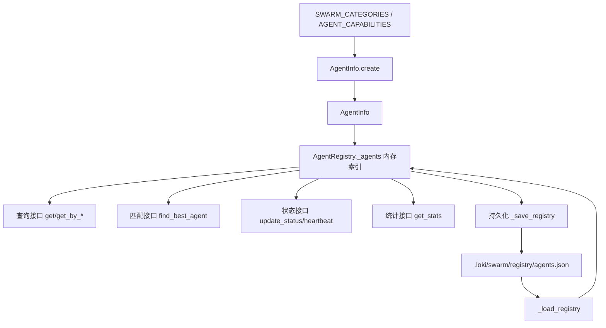
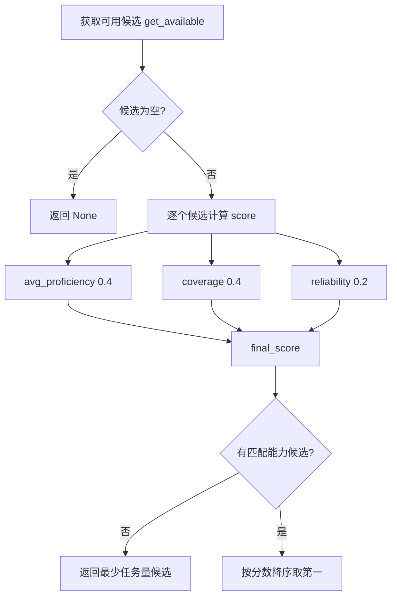
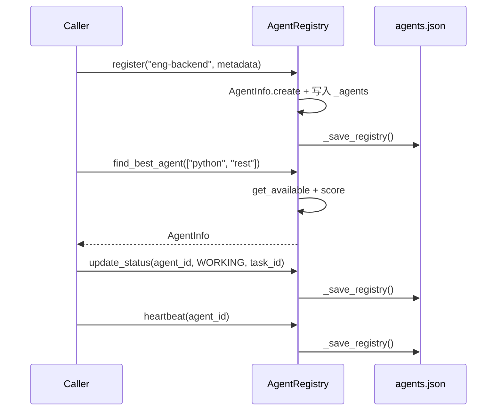

# swarm_registry_and_types 模块文档

## 1. 模块定位与设计目标

`swarm_registry_and_types`（代码位于 `swarm/registry.py`）是 Swarm Multi-Agent 体系中的“代理身份与能力注册中心”。这个模块解决的是一个非常基础但关键的问题：系统如何知道当前有哪些代理可用、它们分别擅长什么、当前是否忙碌、是否健康，以及在接到任务时应该优先把任务分配给谁。

从设计上看，它采用了“静态类型词典 + 动态运行时注册表”的混合方案。静态部分由 `SWARM_CATEGORIES`、`AGENT_TYPES`、`AGENT_CAPABILITIES` 提供，定义平台认可的代理类型与默认能力画像；动态部分由 `AgentInfo` 与 `AgentRegistry` 维护，负责生命周期、心跳、状态、任务统计以及能力匹配评分。这个组合使系统既有可控、可审计的基础能力模型，又能在运行时根据真实执行数据做选择。

在整个 Swarm 子系统里，本模块属于“基础设施层”。它通常被上游编队组件（如分类与组队模块）用于确认角色类型，也被下游协调与消息模块用于定位可执行代理。关于编队策略请参考 [swarm_classification_and_composition.md](swarm_classification_and_composition.md)，关于消息协作与共识请参考 [代理注册表与消息系统.md](代理注册表与消息系统.md) 与 [拜占庭容错.md](拜占庭容错.md)。

---

## 2. 架构与数据关系



这张图展示了模块的核心闭环：静态类型与能力定义驱动 `AgentInfo.create` 生成标准化代理对象，`AgentRegistry` 维护运行态内存表，并通过 JSON 落盘实现进程重启后的状态恢复。需要注意它是“本地文件持久化”，不是分布式一致性存储，因此更偏单进程/单节点场景。

---

## 3. 核心类型与常量

### 3.1 `SWARM_CATEGORIES`

`SWARM_CATEGORIES` 定义了代理大类到具体 agent type 的映射，例如 `engineering` 下包含 `eng-frontend`、`eng-backend` 等。这份映射主要用于两个方向：一是创建代理时自动推导 `swarm` 字段，二是上层系统按大类做资源统计与调度视图聚合。

### 3.2 `AGENT_TYPES`

`AGENT_TYPES` 是对 `SWARM_CATEGORIES` 的扁平化展开。它不是手工维护列表，而是通过遍历类别自动生成，降低了配置重复与漏改风险。实际工程中，如果你新增了类别中的 type，`AGENT_TYPES` 会自动反映。

### 3.3 `AGENT_CAPABILITIES`

`AGENT_CAPABILITIES` 是默认能力画像表，按 agent type 关联 capability 名称列表。`AgentInfo.create` 会据此生成 `AgentCapability` 实例。这个设计把“代理能力的初始先验”放在代码常量中，优点是透明、可审计，缺点是运行时热更新能力较弱（需要改代码/发布）。

---

## 4. 组件详解

## 4.1 `AgentStatus`

`AgentStatus` 是字符串枚举，表示代理生命周期状态，包含 `IDLE`、`WORKING`、`WAITING`、`FAILED`、`TERMINATED`。其中 `IDLE` 和 `WAITING` 被视为可调度状态（见 `get_available`），这意味着系统把“等待依赖中”的代理也当作可分配候选；如果你的运行模型不允许这一点，需要在扩展时覆写可用性判断策略。

## 4.2 `AgentCapability`

`AgentCapability` 描述一个具体能力条目，字段包括 `name`、`proficiency`、`last_used`、`usage_count`。默认熟练度是 `0.8`，意味着系统在没有历史数据时倾向“中高可信”初值。

`to_dict()` 和 `from_dict()` 用于 JSON 序列化/反序列化。时间字段采用 ISO 字符串，并处理尾部 `Z`。这里有一个实际行为要点：`from_dict` 用 `datetime.fromisoformat` 解析，若输入是 naive datetime（无时区），对象也会是 naive；而默认创建时间是 UTC aware。混用时在某些 Python 版本中进行时间差计算可能抛出 aware/naive 比较异常，因此外部写入 JSON 时建议统一时区格式。

## 4.3 `AgentInfo`（当前模块核心组件）

`AgentInfo` 是代理运行态的主实体，记录标识、类型、所属 swarm、状态、能力列表、任务计数、当前任务、心跳与元数据。它既是注册表存储单元，也是调度评分输入对象。

### 创建逻辑

`AgentInfo.create(agent_type)` 会自动完成三件事：先从 `SWARM_CATEGORIES` 推导类别（找不到时标记为 `unknown`），再从 `AGENT_CAPABILITIES` 构建默认能力列表，最后生成形如 `agent-{agent_type}-{8位随机hex}` 的 ID。该 ID 策略简洁且冲突概率低，但并非全局绝对唯一（理论上 8 位截断有碰撞可能）。

### 行为方法

`has_capability(capability)` 与 `get_capability(capability)` 提供能力查询；`update_heartbeat()` 刷新心跳时间；`record_task_completion(success)` 会更新成功/失败计数并自动将代理状态重置为 `IDLE`、清空 `current_task`。这意味着调用该方法后代理会被重新纳入可调度池。

### 序列化契约

`to_dict` 输出稳定字段结构，可直接落盘。`from_dict` 对异常状态值做了容错：若 `status` 不是合法枚举，会回退到 `IDLE`，不会抛错中断加载。优点是鲁棒，缺点是坏数据可能被静默吞掉。

## 4.4 `AgentRegistry`

`AgentRegistry` 是注册中心服务对象，维护 `self._agents: Dict[str, AgentInfo]` 作为内存主索引，并在每次关键变更后落盘到 `.loki/swarm/registry/agents.json`。

### 初始化与恢复

`__init__` 会创建目录并调用 `_load_registry()`。加载过程对 `JSONDecodeError`、`IOError` 直接忽略，因此即便文件损坏也不会阻止系统启动，但会导致历史注册信息丢失在运行态不可见。

### 注册与注销

`register(agent_type, metadata=None)` 创建并写入代理，返回 `AgentInfo`。`deregister(agent_id)` 在删除前会先将状态置为 `TERMINATED`，但因随后立刻 `del`，该终止状态不会保留在注册表文件中，最终效果是“彻底移除”。如果你需要审计终止历史，应改为软删除模型。

### 查询接口

`get`、`get_by_type`、`get_by_swarm`、`get_by_capability`、`list_all` 提供常见筛选维度。它们都是内存遍历，复杂度线性，适合中小规模代理池。

### 可用性与状态管理

`get_available(agent_type=None)` 只返回 `IDLE`/`WAITING`。`update_status` 同时更新状态、当前任务、心跳并持久化。`heartbeat` 只刷新心跳并持久化。

### 失活检测

`get_stale_agents(max_age_seconds=300)` 根据“当前时间 - last_heartbeat”筛选超时代理。该方法只负责查询，不自动变更状态，也不会清理；通常由外层调度器或健康巡检逻辑决定下一步（例如降级、剔除、告警）。

### 智能匹配算法

`find_best_agent(required_capabilities, preferred_type=None)` 是该模块最关键的调度辅助方法。算法流程如下：



它将匹配质量拆成三部分：能力熟练度、能力覆盖率、历史可靠性（失败率反向）。若没有任何候选具备所需能力，会退化为“选总任务数最少者”，体现了“优先可执行而非严格匹配”的保守策略。

---

## 5. 关键流程说明

### 5.1 注册到调度的典型链路



这个流程展示了模块在任务生命周期中的角色：注册、选人、状态推进、健康维持。因为每步都会触发保存，它在可靠性上偏“写后即持久”，但在高频心跳场景会带来磁盘写放大。

---

## 6. 使用示例与配置建议

### 6.1 基础使用

```python
from pathlib import Path
from swarm.registry import AgentRegistry, AgentStatus

registry = AgentRegistry(loki_dir=Path(".loki"))
agent = registry.register("eng-backend", metadata={"region": "ap-southeast-1"})

best = registry.find_best_agent(["python", "rest"], preferred_type="eng-backend")
if best:
    registry.update_status(best.id, AgentStatus.WORKING, task_id="task-42")
```

### 6.2 任务完成回写

```python
agent = registry.get("agent-eng-backend-xxxx")
if agent:
    agent.record_task_completion(success=True)
    # 注意：直接修改 AgentInfo 后需手动触发落盘
    registry._save_registry()  # 生产代码建议封装公开方法而非直接调用私有方法
```

### 6.3 自定义能力扩展

```python
from swarm.registry import AGENT_CAPABILITIES, AgentInfo

AGENT_CAPABILITIES["eng-backend"].append("grpc")
new_agent = AgentInfo.create("eng-backend")
assert new_agent.has_capability("grpc")
```

这个扩展方式简单直接，但只影响“新创建代理”。已存在代理不会自动补齐，需要迁移脚本或重注册。

---

## 7. 边界条件、错误处理与限制

本模块的容错策略偏“静默失败”。`_load_registry` 和 `_save_registry` 在 IO/JSON 异常时直接 `pass`，不会抛出错误，也没有日志。这让核心流程更稳健，但会降低故障可观测性，尤其在磁盘权限、路径失效、文件损坏时，业务层可能只看到“数据没更新”而不知道原因。

另一个容易忽略的点是并发一致性：模块没有文件锁、进程锁或事务语义。如果多个进程同时操作同一路径下的 `agents.json`，可能出现覆盖写与状态回退。对于多实例部署，建议将该模块视为单写者组件，或替换为集中式存储实现。

在算法层面，`find_best_agent` 假设 `required_capabilities` 非空。当传入空列表时，`coverage = matched_caps / len(required_capabilities)` 会触发除零错误。因此调用方必须保证至少一个能力需求，或在外层先做参数保护。

此外，`get_available` 将 `WAITING` 视为可用可能不符合某些业务语义；`deregister` 的硬删除会丢失终态审计；`agent_id` 仅使用 8 位随机后缀在极高规模下存在碰撞理论风险。这些都属于可预见限制，在需要更严格 SLA/审计的部署里应优先改造。

---

## 8. 扩展与维护建议

如果你要扩展这个模块，建议优先保持 `AgentInfo` 序列化字段向后兼容，并避免破坏 `agents.json` 的读取路径。一个常见做法是给文件中的 `version` 字段引入迁移分支，而不是直接改旧字段语义。

在调度能力上，可以把 `find_best_agent` 的权重参数化（例如通过配置中心注入），并引入“近期负载”“任务类型相似度”“租户隔离”等附加因子。若需要跨节点一致性，可将 `AgentRegistry` 抽象成接口并提供 Redis/PostgreSQL 后端实现，保留当前文件后端用于本地开发。

对于与其他模块的协作边界，建议在文档与代码中明确：组队模块负责“决定需要什么类型的代理”，本模块负责“在该类型内选择具体实例”，消息与共识模块负责“实例之间如何协同执行”。这样可以避免职责重叠，降低维护复杂度。
