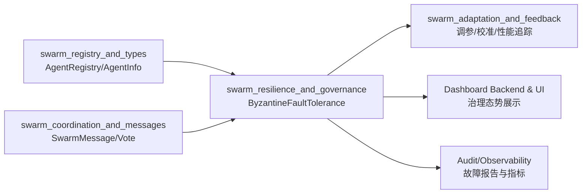
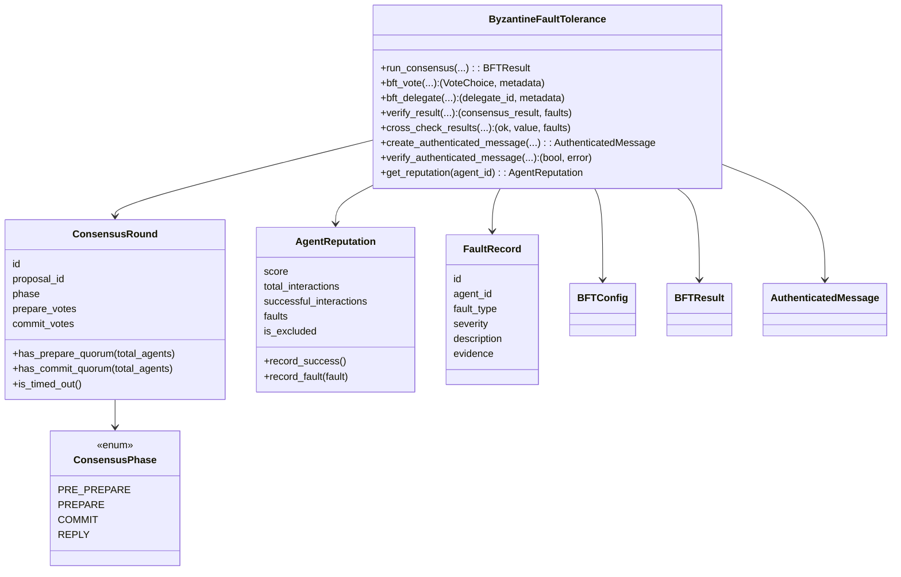
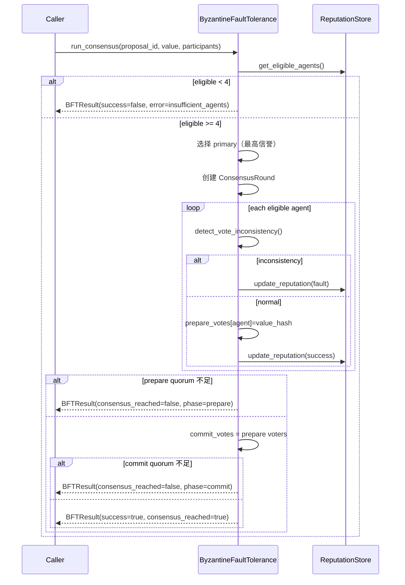
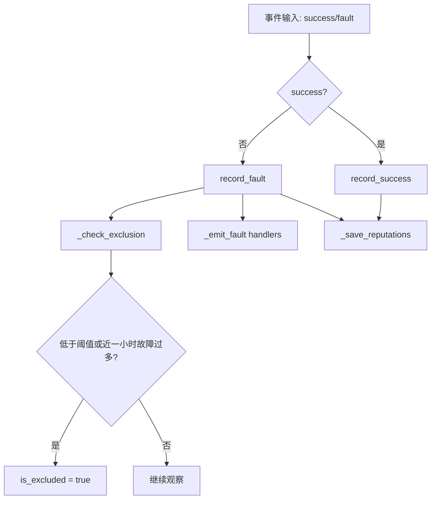
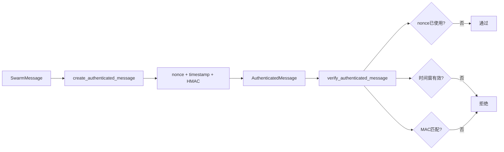

# swarm_resilience_and_governance 模块文档

## 模块定位与存在意义

`swarm_resilience_and_governance` 是 Swarm 多智能体子系统中的“韧性与治理层”，核心实现位于 `swarm/bft.py`，以 `ByzantineFaultTolerance` 和 `ConsensusPhase` 为中心。它要解决的不是“如何让代理协作”这个一般性问题，而是“当部分代理不可靠、恶意、超时或输出冲突时，系统如何仍然做出可接受决策”的可靠性问题。

在真实多代理运行环境里，单个代理可能因为模型幻觉、上下文污染、执行链路抖动、甚至策略规避而给出错误反馈。如果没有治理层，系统会把这些错误等价地当成正常输入，导致任务分派偏移、投票污染、结果冲突放大，最终影响整个运行会话。该模块通过三个机制把风险收敛在可控范围内：第一，PBFT-lite 共识流程；第二，基于故障记录的信誉系统；第三，消息认证与重放防护。三者一起构成“先筛人、再共识、再追责”的闭环。

从工程视角看，这个模块是一个偏“策略执行器 + 状态记账器”的组合体：既负责实时判定（如投票过滤、代表节点选举、共识成败），也负责长期状态沉淀（如 `reputations.json` 中的信誉历史），因此它兼具在线决策与离线审计价值。

---

## 在整体系统中的位置

该模块属于 `Swarm Multi-Agent` 下的 `swarm_resilience_and_governance` 子模块，直接依赖代理注册与消息契约，间接影响任务编排、自适应调节与可观测审计。



上图反映的是控制流和数据流：模块从注册表拿到候选代理的状态与能力，从消息层拿到投票与通信载荷，然后输出“可信参与者集合”“共识结果”“故障记录”“排除列表”。这些输出会反馈给上层编排和运维界面，形成治理闭环。

可参考：
- [swarm_registry_and_types.md](swarm_registry_and_types.md)
- [swarm_coordination_and_messages.md](swarm_coordination_and_messages.md)
- [性能跟踪与校准.md](性能跟踪与校准.md)
- [Swarm Multi-Agent.md](Swarm%20Multi-Agent.md)

---

## 架构与核心对象关系

`ByzantineFaultTolerance` 是唯一的编排入口，围绕它组织了一组数据对象：`ConsensusRound` 管过程，`AgentReputation` 管信誉，`FaultRecord` 管故障证据，`AuthenticatedMessage` 管消息真实性，`BFTConfig` 管策略阈值，`BFTResult` 管执行输出。



这个关系图体现了模块的关键设计：`ByzantineFaultTolerance` 既承担协议推进，又负责状态持久化和故障事件广播，所以它不是“纯算法类”，而是带有基础设施职责的治理组件。

---

## 核心组件详解

## `ConsensusPhase`（核心枚举）

`ConsensusPhase` 定义了 PBFT-lite 的四个阶段：`PRE_PREPARE`、`PREPARE`、`COMMIT`、`REPLY`。在当前实现中，`run_consensus` 会快速从 `PRE_PREPARE` 切换到 `PREPARE` 并模拟广播，不涉及真实网络传输层；但阶段枚举保留完整语义，便于后续接入真实分布式消息通道。

它的工程价值在于两个方面：第一，阶段状态可用于前端态势面板或审计日志；第二，阶段化让失败点可定位（例如失败发生在 prepare quorum 不足，而不是 commit 失败）。

## `ByzantineFaultTolerance`（核心类）

`ByzantineFaultTolerance` 是模块主入口。初始化时注入 `AgentRegistry`，可选注入 `loki_dir`、`BFTConfig` 和 `secret_key`。实例化后会创建 `.loki/swarm/bft/` 目录并尝试加载信誉历史。

### 构造参数

- `registry: AgentRegistry`：用于读取代理状态与能力，特别是 `bft_delegate` 中的候选筛选。
- `loki_dir: Optional[Path]`：持久化目录根路径，默认 `.loki`。
- `config: Optional[BFTConfig]`：治理阈值和惩罚策略。
- `secret_key: Optional[str]`：HMAC 密钥；未提供时使用默认开发密钥。

### 返回与副作用

该类多数方法直接返回决策结果，同时会产生明显副作用：

- 更新内存信誉映射 `_reputations`
- 写入 `reputations.json`
- 触发注册的 fault handler
- 维护 `_used_nonces` 防重放集合
- 管理 `_active_rounds` 共识轮次

### 关键内部状态

- `_reputations: Dict[str, AgentReputation]`
- `_vote_history: Dict[str, List[(proposal_id, vote)]]`
- `_active_rounds: Dict[str, ConsensusRound]`
- `_used_nonces: Set[str]`
- `_fault_handlers: List[Callable[[FaultRecord], None]]`

---

## 共识流程：`run_consensus`

`run_consensus` 是该模块最重要的方法。它接收提案值和参与者列表，基于信誉先过滤，再进行 PBFT-lite 的 prepare/commit 判断，最后返回 `BFTResult`。



这个流程的实现特点是“同步且本地模拟”：没有真实 RPC，也没有网络级超时等待，因此更像一个治理决策器，而非完整分布式协议栈。它适用于单进程多代理编排、离线回放或控制平面快速裁决。

### 方法签名与输出

`run_consensus(proposal_id, value, participants, primary_id=None, timeout_seconds=None) -> BFTResult`

返回结果中最应关注的字段是：

- `consensus_reached`：是否达成共识
- `participating_agents` / `excluded_agents`：实际参与和被治理过滤的代理
- `faults_detected`：本轮检测到的违规
- `metadata`：包含 quorum、fault_tolerance、phase 信息

---

## 信誉与故障治理机制

信誉系统由 `AgentReputation` 与 `FaultRecord` 支撑。每次交互不是简单加减分，而是“成功率 + 最近故障惩罚”的组合评分。`_update_score` 会用成功比率作为基底，再对最近 10 条故障按 `severity * 0.1` 叠加惩罚。这个设计保证了分数既能反映长期表现，又对近期异常保持敏感。



`_check_exclusion` 使用两条规则：信誉分低于 `exclusion_threshold` 或近一小时故障数超过 `max_faults_before_exclusion`。被排除后可通过 `rehabilitate_agent` 尝试恢复，但前提是分数回升到 `rehabilitation_threshold` 以上。

---

## 消息认证与防重放

该模块提供轻量级消息认证：`create_authenticated_message` 使用 HMAC-SHA256 对 `{message, nonce, timestamp}` 进行签名，`verify_authenticated_message` 做三重校验：nonce 未复用、时间窗口有效、MAC 正确。



它不是端到端零信任框架，但可以显著降低“消息被篡改”和“旧消息回放”风险。若要用于生产，需要替换默认密钥管理方案，并将 nonce 存储升级为可过期结构（当前为内存集合）。

---

## 投票与委派能力

`bft_vote` 提供治理增强的投票器。它先过滤掉低信誉或已排除代理，再按 `confidence` 或 `confidence * reputation` 计权，最终返回 `VoteChoice` 和统计元数据。该方法适合审批、策略闸门、模型候选选择等“多意见归一”场景。

`bft_delegate` 则是任务委派器。它结合信誉分和能力匹配分做综合评分（60% reputation + 40% capability），并给出主委派目标和最多两个回退候选。这个方法非常适合在编排层做“优先主执行 + 容灾替补”。

---

## 主要配置项：`BFTConfig`

`BFTConfig` 集中定义治理策略，支持 `to_dict/from_dict` 以及磁盘保存加载。实践中建议把它当作“风险偏好声明”：阈值越严格，系统越安全但吞吐可能下降。

```python
from swarm.bft import ByzantineFaultTolerance, BFTConfig

config = BFTConfig(
    min_reputation_for_consensus=0.4,
    exclusion_threshold=0.25,
    rehabilitation_threshold=0.55,
    consensus_timeout_seconds=20.0,
    max_faults_before_exclusion=2,
    inconsistency_penalty=0.35,
    equivocation_penalty=0.6,
)

bft = ByzantineFaultTolerance(registry=registry, config=config, secret_key="prod-secret")
bft.save_config()
```

需要注意，虽然配置中含 `max_view_changes`、`require_prepare_quorum` 等字段，但当前代码路径尚未完整消费这些开关，属于“接口已预留、行为未完全落地”的状态。

---

## 典型使用模式

### 1) 在任务执行前做共识裁决

```python
result = bft.run_consensus(
    proposal_id="proposal-123",
    value={"plan": "Use TypeScript SDK"},
    participants=["agent-a", "agent-b", "agent-c", "agent-d", "agent-e"],
)

if result.consensus_reached:
    execute_plan(result.value)
else:
    fallback_strategy(result.metadata)
```

### 2) 对多代理结果做交叉核验

```python
ok, value, faults = bft.cross_check_results(
    proposal_id="verify-77",
    results=[
        ("agent-a", {"score": 0.91}),
        ("agent-b", {"score": 0.91}),
        ("agent-c", {"score": 0.62}),
    ],
    min_agreement=0.67,
)
```

### 3) 注册故障事件回调，接入审计/告警

```python
def on_fault_detected(fault):
    print("FAULT", fault.agent_id, fault.fault_type, fault.severity)
    # 可转发到 AuditLog / OTEL / Dashboard websocket

bft.on_fault(on_fault_detected)
```

---

## 持久化与运维要点

模块默认把治理状态写入 `.loki/swarm/bft/`：

- `reputations.json`：信誉与故障历史
- `config.json`：治理配置（需显式 `save_config`）

`_load_reputations` 会在初始化自动执行，但 `load_config` 不会自动调用，需要业务方主动加载。这意味着重启后若未调用 `load_config`，系统会沿用代码默认配置而不是历史配置。

`get_stats` 和 `get_fault_report` 是最直接的运维接口，前者给出整体健康度，后者给出可审计故障明细。若你正在建设治理看板，可优先集成这两个方法作为数据源。

---

## 边界条件、错误场景与限制

当前实现可用且实用，但有几个关键限制需要在设计时明确：

1. 这是 PBFT-lite，不是完整 PBFT 网络协议实现。`run_consensus` 采用本地同步流程，不包含真实消息广播、视图切换协议、异步重试和拜占庭主节点替换。
2. 共识最小参与者硬编码为 `eligible >= 4`。即使业务能接受 `f=0` 场景，代码也会拒绝更小规模共识。
3. `consensus_timeout_seconds` 目前更多是轮次元数据，不驱动等待/超时中断循环。
4. quorum 计算存在两种口径：`run_consensus` 用 `2f+1`，`ConsensusRound.has_*_quorum` 用 `(2n+1)//3`。在 `n=6` 等非 `3f+1` 规模时可能产生语义差异。
5. 故障类型枚举较丰富（如 `MALFORMED_RESPONSE`、`SYCOPHANTIC_AGREEMENT`），但并非全部由现有流程自动检测，需要上层主动接入检测逻辑。
6. 持久化读写异常被静默吞掉（`except ...: pass`），生产环境建议额外埋点，否则故障不可见。
7. 默认密钥 `DEFAULT_SECRET_KEY` 仅适合开发测试，生产必须替换并做好轮换。
8. `_used_nonces` 只在内存中维护，进程重启后丢失，无法跨实例防重放；同时清理策略基于 set 转 list，保留集合不具时间顺序语义。
9. 当前实现未显式加锁，不保证并发线程安全。

---

## 扩展建议

如果你计划扩展该模块，建议按“检测器插拔化 + 协议外置化 + 存储可替换化”推进。具体说，可以先把 `detect_*` 系列抽象成规则插件，再把 `run_consensus` 的阶段推进与消息传输解耦，最后把信誉存储从 JSON 文件切换到统一状态管理或数据库，以支持多实例和审计追溯。

与其他模块集成时，推荐将故障事件桥接到：

- `Audit` 模块做不可抵赖记录（参考 [Audit.md](Audit.md)）
- `Observability` 模块做指标上报（参考 [Observability.md](Observability.md)）
- `Dashboard Backend/UI` 做实时治理可视化（参考 [Dashboard Backend.md](Dashboard%20Backend.md), [Dashboard UI Components.md](Dashboard%20UI%20Components.md)）

这样可以把当前模块从“算法组件”升级为“平台级治理能力”。
