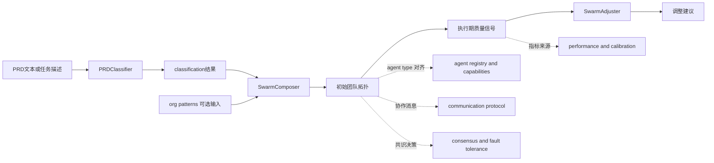
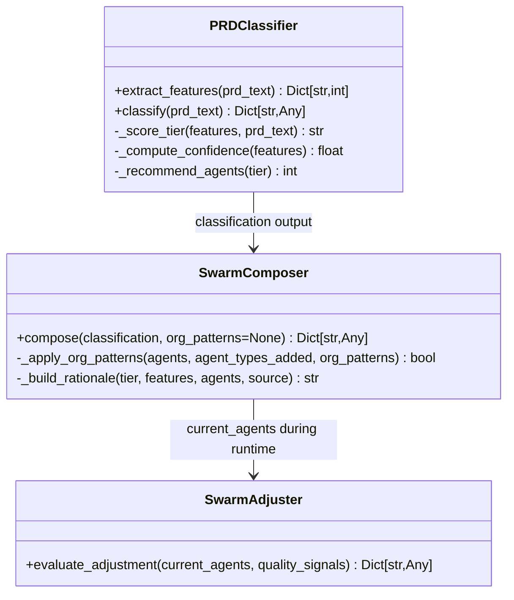
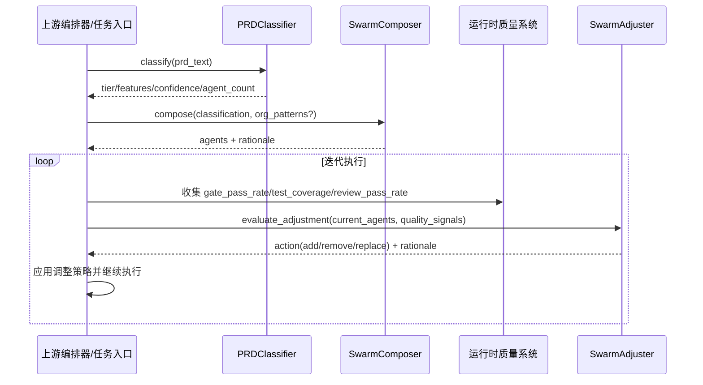
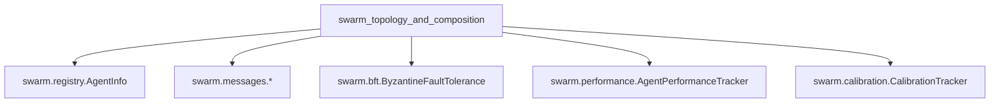
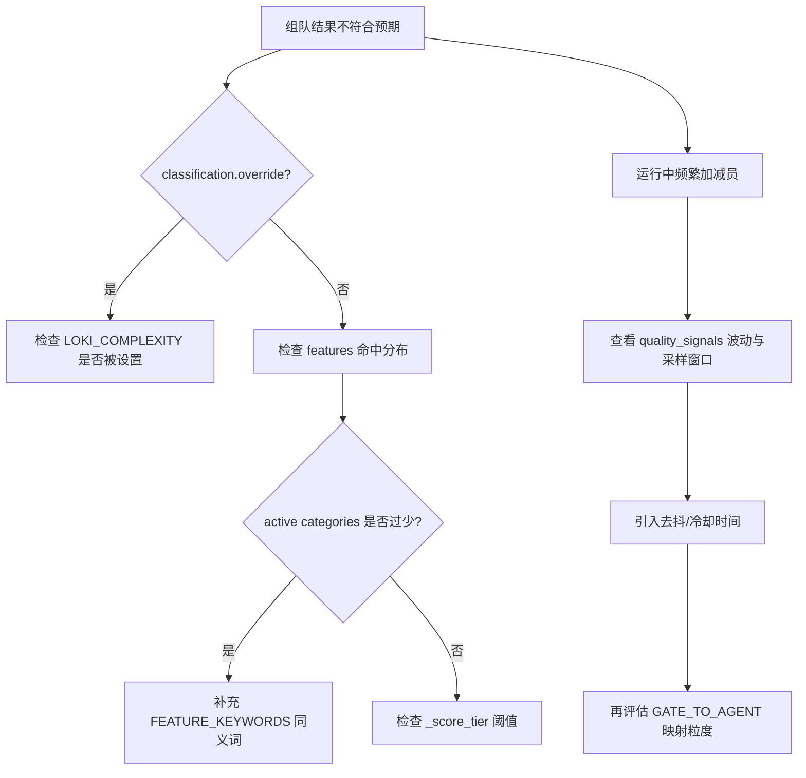

# swarm_topology_and_composition 模块文档

## 模块概述

`swarm_topology_and_composition` 是 Swarm Multi-Agent 子系统中负责“**先定规模、再组团队、运行中再调队形**”的一组核心能力，具体由 `PRDClassifier`、`SwarmComposer`、`SwarmAdjuster` 三个组件协同完成。它存在的根本原因是：在多智能体执行链路里，团队规模和角色分配如果完全手工配置，通常会出现两类典型问题，一类是“配轻了导致质量门反复失败”，另一类是“配重了导致成本与协作开销不成比例”。本模块通过规则化、可解释、可覆盖（override）的方式，把这类决策前置成一个可复用的系统能力。

从设计上看，这个模块刻意没有依赖 LLM 做复杂度打分，而是选择了关键词特征提取 + 分层阈值规则。这种取舍把“分类速度、稳定性、可预测性”放在了第一位，非常适合作为自动化流水线的前置步骤。后续的团队组建逻辑同样遵循可解释路线：先加载基础班底，再按功能特征补位，再吸收组织知识（org patterns）做定制，最后按层级优先级截断到推荐人数。到了执行期，`SwarmAdjuster` 再根据质量信号做增删替换建议，形成一个闭环。

---

## 在整体系统中的位置

该模块属于 `Swarm Multi-Agent` 的“编队与拓扑”层，与通信协议、注册表、共识容错、性能与校准等子模块形成上下游关系。它不直接发送消息、不直接做共识，也不直接持久化性能，但它会输出后续模块可消费的“团队拓扑结果”（agent type / role / priority）和“调整建议”。



上图体现的是“静态编队 + 动态调节”双阶段路径。第一阶段把 PRD 文本转换为可执行团队配置，第二阶段基于真实运行信号做结构修正。这样做能避免一次性决策失误在整个项目周期内被放大。

可参考关联文档：
- [swarm_coordination_and_messages.md](swarm_coordination_and_messages.md)
- [swarm_resilience_and_governance.md](swarm_resilience_and_governance.md)
- [性能跟踪与校准.md](性能跟踪与校准.md)
- [swarm_registry_and_types.md](swarm_registry_and_types.md)

---

## 核心架构与组件关系



这三个组件是串联关系而非继承关系。`PRDClassifier` 负责把自然语言需求映射成结构化复杂度信号；`SwarmComposer` 根据复杂度和特征做团队“初始拓扑”；`SwarmAdjuster` 在迭代中依据质量指标提出修正策略。由于输出/输入都使用普通 `Dict` 与 `List` 结构，系统集成成本低，但同时也意味着调用方需要对字段完整性做防御式校验。

---

## 组件详解

## PRDClassifier（swarm.classifier.PRDClassifier）

`PRDClassifier` 是一个完全规则驱动的复杂度分类器。它预定义了多个特征维度（如 `database_complexity`、`deployment_complexity`、`auth_complexity` 等），通过大小写规整后的子串匹配统计命中数量，再依据总命中数、活跃类别数量以及企业级关键字，推断项目 tier：`simple`、`standard`、`complex`、`enterprise`。

### 工作机制

分类流程先从 `extract_features()` 开始。该方法对每个特征类别遍历关键词列表，只要某个关键词在 PRD 文本中出现就计入一次，并通过 `set()` 去重，避免同一关键词重复出现导致分数膨胀。随后 `_score_tier()` 使用分层规则：高于企业阈值或出现企业级关键词直接归入 `enterprise`；否则根据 total hits 与 active categories 进入 `complex` / `standard` / `simple`。

`_compute_confidence()` 则并不基于概率模型，而是基于与阈值边界（5.5 / 15.5 / 25.5）距离计算置信度，距离越远置信度越高；活跃类别很多时再小幅加分；特征过少时上限压到 0.7，以表达“信息不足下的保守判断”。

### 输入与输出

`classify(prd_text: str) -> Dict[str, Any]` 输出字段包括：
- `tier`: 复杂度层级
- `confidence`: 0~1 置信度
- `features`: 各特征类别命中数
- `agent_count`: 推荐团队人数
- `override`: 是否来自环境变量覆盖

最关键的行为是环境变量覆盖：当 `LOKI_COMPLEXITY` 为合法 tier 时，结果会被强制指定，`confidence=1.0` 且 `override=True`。这为运维与紧急场景提供了“外部强控开关”。

### 示例

```python
from swarm.classifier import PRDClassifier

prd = """
Build a multi-tenant SaaS dashboard with OAuth2, RBAC, PostgreSQL,
Redis cache, webhook integrations, Docker/Kubernetes deployment,
audit log, SOC2 compliance, and disaster recovery.
"""

classifier = PRDClassifier()
result = classifier.classify(prd)
print(result["tier"], result["agent_count"], result["confidence"])
```

如果需要手动覆盖：

```bash
export LOKI_COMPLEXITY=complex
```

---

## SwarmComposer（swarm.composer.SwarmComposer）

`SwarmComposer` 负责把分类结果转换成可执行的团队结构。它本质上是一个“规则编排器”，遵循从保底能力到专项能力逐步扩充的策略。

### 组成策略

它总是先放入 `BASE_TEAM`：`orch-planner`、`eng-backend`、`review-code`。这体现了一个强约束：无论需求多简单，都至少需要编排、实现、审查三种核心角色。

然后它读取 `features`，根据 `FEATURE_AGENT_MAP` 增加对应专项角色。例如检测到 `ui_complexity` 会引入 `eng-frontend`，检测到 `deployment_complexity` 会引入 `ops-devops`。若 tier 为 `enterprise`，额外注入 `ops-sre`、`ops-compliance`、`data-analytics`。

在可选阶段，`_apply_org_patterns()` 会扫描组织知识模式的文本字段（`name/pattern/description/category`），根据技术词典映射补充 agent（例如 pattern 提到 `react` 会增强 frontend，提到 `terraform` 会增强 devops）。这一段逻辑通过 `SWARM_CATEGORIES` 反查 role 分类，因此它与注册表模块存在轻耦合。

最终，团队按 `priority` 升序排序后截断到 `max_agents`，也就是分类阶段给出的推荐人数。优先级越小越关键，截断时优先保留核心角色。

### compose 接口

`compose(classification, org_patterns=None) -> Dict[str, Any]` 主要返回：
- `agents`: `{type, role, priority}` 列表
- `rationale`: 人类可读解释文本
- `composition_source`: `classifier | org_knowledge | override`

### 示例

```python
from swarm.classifier import PRDClassifier
from swarm.composer import SwarmComposer

classification = PRDClassifier().classify("Build REST API with PostgreSQL, OAuth2, CI/CD")

org_patterns = [
    {"name": "frontend stack", "description": "React + Next.js preferred"},
    {"name": "platform", "description": "Docker and Terraform"},
]

team = SwarmComposer().compose(classification, org_patterns=org_patterns)
for a in team["agents"]:
    print(a)
print(team["rationale"])
```

---

## SwarmAdjuster（swarm.adjuster.SwarmAdjuster）

`SwarmAdjuster` 面向项目执行中后期，依据质量信号判断是否需要调整团队结构。与 `SwarmComposer` 的“静态初配”不同，它关注的是“当前团队是否已暴露出能力缺口，或者是否可以在健康状态下收缩成本”。

### 规则逻辑

`evaluate_adjustment(current_agents, quality_signals)` 内部有四组规则：

第一组规则用于处理“长期门禁失败”。当 `gate_pass_rate < 0.5` 且 `iteration_count > 3` 时，会读取 `failed_gates`，通过 `GATE_TO_AGENT` 词典映射专项补位（如 `security` -> `ops-security`，`e2e` -> `eng-qa`）。

第二组规则检查测试覆盖率。当 `test_coverage < 0.6` 且当前无 `eng-qa` 时，强制建议补 QA。

第三组规则检查评审通过率。当 `review_pass_rate < 0.5` 且无 `review-security` 时，建议新增安全审查角色。

第四组规则处理“过度编队”。如果三项核心信号都高于 0.8、团队人数大于 4、且当前无新增建议，则会尝试移除一个可选角色（`priority >= 3` 中优先级数值最大者）。

最后根据增删组合决定 `action`：`none | add | remove | replace`。

### 输出结构

返回对象包含：
- `action`
- `agents_to_add`: `[{type, reason}]`
- `agents_to_remove`: `[{type, reason}]`
- `rationale`: 解释文本

### 示例

```python
from swarm.adjuster import SwarmAdjuster

current_agents = [
    {"type": "orch-planner", "priority": 1},
    {"type": "eng-backend", "priority": 1},
    {"type": "review-code", "priority": 1},
    {"type": "ops-sre", "priority": 3},
]

signals = {
    "gate_pass_rate": 0.42,
    "test_coverage": 0.55,
    "review_pass_rate": 0.61,
    "iteration_count": 5,
    "failed_gates": ["security", "e2e"],
}

decision = SwarmAdjuster().evaluate_adjustment(current_agents, signals)
print(decision)
```

---

## 端到端流程



这个流程最关键的工程意义是把“初始规划”和“运行纠偏”拆开：前者保证启动速度和可解释性，后者保证结果质量和资源效率。

---

## 与其他模块的依赖关系与边界

`swarm_topology_and_composition` 主要依赖 Swarm 内部的类型与注册信息，而不是强绑定通信/共识执行细节。`SwarmComposer` 通过 `swarm.registry` 中的分类信息（如 `SWARM_CATEGORIES`）推断角色；产出的 `agent type` 会被 `AgentInfo.create()` 这样的注册逻辑消费。当进入运行态协作时，这些角色通常会映射到消息与任务对象（如 `SwarmMessage`、`TaskAssignment`、`Proposal`）。



需要强调的是，本模块当前代码并未直接调用 BFT、性能追踪或校准器；它们是运行时常见的协作方。也就是说，团队拓扑结果是这些模块的输入之一，但并不是它们的唯一输入。

---

## 配置与可扩展点

该模块扩展成本主要集中在“词典与映射”层：

- 通过扩展 `FEATURE_KEYWORDS` 可以提高特征识别覆盖面。
- 通过调整 `_score_tier()` 阈值可以改变规模敏感度。
- 通过修改 `TIER_AGENT_COUNTS` 可以控制成本上限。
- 通过扩展 `FEATURE_AGENT_MAP` 与 `tech_to_agent` 可引入新角色。
- 通过维护 `GATE_TO_AGENT` 可让质量门失败更精准地触发补位。

如果系统已启用 `AgentPerformanceTracker`，一个自然扩展方向是在 `compose()` 的候选 agent 决策中引入历史表现排序（当前版本尚未实现该联动）。

---

## 关键行为约束、边界情况与已知限制

本模块是规则引擎，因此它的稳定性很高，但也有可预见限制。首先，`PRDClassifier` 使用简单子串匹配，不处理上下文语义，容易出现“误命中”或“漏命中”，尤其在缩写、同义词、否定表达（例如“无需 OAuth”）场景下。其次，`LOKI_COMPLEXITY` 覆盖会强制 tier，虽然便于运维，但也可能掩盖真实复杂度，调用方应在日志中显式记录 `override=True`。

`SwarmComposer` 在人数截断时只按优先级排序，不考虑角色多样性约束，因此理论上可能出现某些专项角色被截断掉的情况。组织模式匹配同样是关键词子串扫描，面对高噪声文本可能引入不必要角色。此外，它依赖 `SWARM_CATEGORIES` 推断 role，若新 agent type 未正确登记，role 会退化为默认 `engineering` 或匹配失败。

`SwarmAdjuster` 的规则阈值是固定常量（0.5 / 0.6 / 0.8），没有内置自适应机制。在高波动项目中，短期指标抖动可能触发频繁加减员。另一个细节是 `failed_gates` 的 gate 名称需要与 `GATE_TO_AGENT` 键名对齐（大小写会 lower 处理，但别名仍需维护），否则无法触发精准补位。

---

## 实践建议

在生产环境里，建议把该模块放在“任务受理 -> 团队编排 -> 执行监控”的标准流水线中，并落地三类观测数据：分类结果分布（tier/confidence）、组队结果分布（agent types/截断率）、调整结果分布（action 触发频率与效果）。这样可以反向校正关键词词典和阈值，避免规则长期漂移。

对于大组织场景，推荐把 `org_patterns` 当作一等配置资产维护，而不是临时拼接文本。因为该输入直接影响 `composition_source` 与最终团队结构，若治理不到位，会让组队结果在不同项目间波动过大。

---

## API 与内部方法参考（实现级）

这一节按“调用方真正会碰到的接口”和“影响行为的内部函数”分别说明，方便在代码审查、回归测试和二次开发时快速定位风险点。

### PRDClassifier 方法说明

`extract_features(prd_text: str) -> Dict[str, int]` 的输入是原始 PRD 文本，输出是以类别名为键、命中关键词数为值的字典。它的副作用为无（纯函数式行为），但是其结果高度依赖词典质量。需要注意，当前匹配是 `keyword in text_lower` 的子串判断，不是 token/词边界匹配，因此 `api` 这类短词如果被加入词典，误报概率会很高。

`classify(prd_text: str) -> Dict[str, Any]` 是外部主入口。它会先检查环境变量 `LOKI_COMPLEXITY`，命中后直接返回覆盖结果。这个逻辑的副作用是把“部署环境配置”引入了分类结果：同一 PRD 在不同环境中可能得到不同 tier。建议调用方在任务元数据中记录该环境变量快照，便于审计追溯。

`_score_tier(features, prd_text)` 决定层级分桶；`_compute_confidence(features)` 提供置信度标尺；`_recommend_agents(tier)` 执行 tier 到人数的映射。虽然它们是内部方法，但如果你在做自定义分支，优先改这三个点而不是直接改 `classify()` 主流程，可以保持代码可读性。

### SwarmComposer 方法说明

`compose(classification, org_patterns=None) -> Dict[str, Any]` 是组队主入口。输入契约并非强类型对象，而是依赖键名：至少应包含 `tier/features/agent_count`。当字段缺失时会退回默认值（如 `tier=standard`），这种容错提升了兼容性，但也可能“静默吞掉上游错误”。工程上建议在调用 `compose` 前做 schema 校验。

`_apply_org_patterns(...) -> bool` 会就地修改 `agents` 列表并更新 `agent_types_added` 集合。它返回布尔值表示是否因组织知识新增角色。由于是“就地修改”，如果调用方复用了同一个 `agents` 对象做其他逻辑，需要注意可变对象共享带来的副作用。

`_build_rationale(...) -> str` 只负责构建解释文本，不参与决策本身。建议在上层日志中保留该字段，它是线上排障时最直接的“为什么这么组队”证据。

### SwarmAdjuster 方法说明

`evaluate_adjustment(current_agents, quality_signals) -> Dict[str, Any]` 读取当前团队和质量信号，返回动作建议。该方法不会直接修改 `current_agents`，因此输出是“建议”而非“执行”。这意味着调用方必须自行实现幂等应用策略（例如同类 agent 不重复添加、remove 目标存在性校验、变更后重新排序）。

该方法默认值策略偏“保守”：如果信号字段缺失，默认按健康值处理（例如 pass rate 默认 1.0）。这会降低误触发概率，但也会在观测系统异常时掩盖真实问题。若你希望“缺信号即告警”，应在外层先做字段完整性验证。

---

## 数据模型与字段契约建议

虽然当前实现使用 `Dict[str, Any]` 进行松耦合传递，但在大型系统中建议建立显式 DTO（例如 Pydantic/dataclass）来约束字段。推荐最小契约如下。

```python
# 示例：调用方可定义自己的强类型契约
from typing import Dict, List, TypedDict, Any

class ClassificationResult(TypedDict):
    tier: str
    confidence: float
    features: Dict[str, int]
    agent_count: int
    override: bool

class AgentSpec(TypedDict):
    type: str
    role: str
    priority: int
```

这样可以避免 `features` 被错误传成 list、`priority` 被传成字符串等隐性 bug。

---

## 常见故障场景与排查路径



排查时建议先区分“输入问题”还是“规则问题”。输入问题通常表现为关键词不命中、gate 命名不一致、字段缺失；规则问题通常表现为阈值边界频繁抖动、优先级截断误伤关键角色。先修输入再调规则，效率更高。

---

## 扩展实践：新增一个专业角色的最小步骤

假设你要支持 `eng-observability`（可观测性工程）角色，建议按以下顺序扩展：先在 `swarm.registry` 注册 agent type 与能力，再在本模块添加触发映射，最后补回归测试。若只改本模块而不改注册表，组队结果虽然会出现新 type，但运行时可能找不到对应能力定义。

```python
# 1) 在 FEATURE_AGENT_MAP 中增加触发
FEATURE_AGENT_MAP["observability_requirements"] = {
    "type": "eng-observability",
    "role": "operations",
    "priority": 2,
}

# 2) 在 GATE_TO_AGENT 中增加失败门映射
GATE_TO_AGENT["otel"] = "eng-observability"
GATE_TO_AGENT["tracing"] = "eng-observability"
```

这类变更应同时更新文档与引用模块：
- 注册与类型语义见 [swarm_registry_and_types.md](swarm_registry_and_types.md)
- 运行时信号来源见 [性能跟踪与校准.md](性能跟踪与校准.md)
- 消息协作语义见 [swarm_coordination_and_messages.md](swarm_coordination_and_messages.md)

---

## 参考文档

- [swarm_classification_and_composition.md](swarm_classification_and_composition.md)
- [swarm_adaptation_and_feedback.md](swarm_adaptation_and_feedback.md)
- [swarm_registry_and_types.md](swarm_registry_and_types.md)
- [swarm_coordination_and_messages.md](swarm_coordination_and_messages.md)
- [swarm_resilience_and_governance.md](swarm_resilience_and_governance.md)
- [性能跟踪与校准.md](性能跟踪与校准.md)
