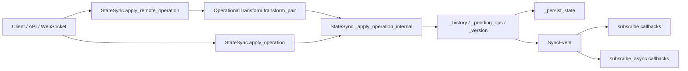

# sync_conflict_resolution 模块深度解析

在多人同时编辑同一份共享状态时，最难的问题不是“怎么改”，而是“谁先改、冲突怎么判、最终如何保证大家收敛到同一个结果”。`collab/sync.py` 里的同步与冲突解决逻辑（以 `OperationalTransform` 为核心）就是这个问题的防抖器：它把并发修改从“不可预测的竞态”变成“可解释、可重放、可收敛”的操作流。你可以把它想成协作系统里的“铁路道岔控制器”——每辆车（operation）都可能同时进站，但轨道切换规则要保证列车最终不会相撞，而且所有调度台看到的是同一条线路状态。

## 这个模块解决了什么问题（以及为什么朴素方案不够）

朴素做法通常是“最后写入覆盖”（last write wins）或“按到达顺序直接应用”。这在单客户端或低冲突场景下可用，但多人协作中会立即暴露问题：同一列表索引被并发插入/删除时，后到达操作的索引语义会失真；同一路径同时 `set` / `delete` 时，简单覆盖会让各客户端最终状态不一致。`sync_conflict_resolution` 的核心价值不是避免冲突，而是在冲突发生时仍然维护**收敛性**：无论操作到达顺序如何，不同参与方通过同样的变换规则，能得到一致的最终状态。

在实现层面，这个模块使用了三件事来达成目标：

1. 用 `Operation` 把修改表达为路径化、可序列化、可重放的最小单元；
2. 用 `OperationalTransform.transform_pair()` 在并发操作间做语义对齐；
3. 用 `StateSync` 维护版本（Lamport 风格单调递增）、历史、pending 队列和事件广播，把“算法”落地为“可运行的同步引擎”。

## 心智模型：把共享状态看作“可重排的操作日志”

理解这段代码最有效的心智模型是：**状态只是结果，操作才是事实**。`StateSync` 并不是“直接存状态然后同步状态”，而是“持续接收操作、在冲突点做变换、再把变换后的操作应用到状态”。

你可以把它类比成多人协作写文档：

- `Operation` 是“编辑指令”（在第 N 行插入、删除某段、替换某字段）；
- `OperationalTransform` 是“编辑合并编辑器”，当两个人都改了同一块时，先把后一条指令重写成在新上下文下仍然语义正确的版本；
- `StateSync._pending_ops` 是“本地已发出但尚未被上游确认的编辑”；
- `acknowledge_operation()` 是“服务器回执：这条编辑已被接纳，可以从待确认队列移除”。

这个模型解释了为什么 `apply_remote_operation()` 会把远端操作逐个对齐到本地 pending 操作之后再应用：远端看到的上下文可能比本地旧，必须先“翻译”再执行。

## 架构与数据流



`StateSync` 在协作子系统里的角色是**状态同步编排器（orchestrator）**，`OperationalTransform` 是它调用的**冲突变换引擎**。上游调用主要来自 `collab/api.py` 与 `collab/websocket.py`：

- 在 `collab/api.py` 中，HTTP 路由会构造 `Operation` 并调用 `sync.apply_operation()`，随后通过 WebSocket manager 广播操作；
- 在 `collab/websocket.py` 中，消息类型 `operation` 进入 `_handle_operation()`，再调用同一个 `apply_operation()`；
- WebSocket manager 在初始化时通过 `self.sync.subscribe_async(self._handle_sync_event)` 订阅 `StateSync` 事件，完成实时广播链路。

从“热路径”看，最频繁且最关键的是：`apply_operation()` / `apply_remote_operation()` → `_apply_operation_internal()` → 事件发射。这条路径同时承载正确性（状态更新）、可观察性（事件）和持久化（`_persist_state()`）。

## 组件深潜

### `SyncEventType`

`SyncEventType` 定义了同步事件类型，包括 `OPERATION_APPLIED`、`OPERATION_REJECTED`、`STATE_SYNCED`、`CONFLICT_RESOLVED`、`VERSION_MISMATCH`。它的设计意图是把同步引擎的内部决策外显为稳定事件协议，便于 WebSocket 广播和外部订阅。

需要注意的是，当前 `StateSync` 的实现会实际发出 `OPERATION_APPLIED`、`OPERATION_REJECTED`、`STATE_SYNCED`，但没有显式发出 `CONFLICT_RESOLVED` 和 `VERSION_MISMATCH`。这意味着事件枚举对未来扩展预留了语义位，但消费方不能假设这些事件现在一定会出现。

### `OperationalTransform`

`OperationalTransform` 是无状态静态工具类，核心入口是 `transform_pair(op1, op2, priority_to_first=True)`。它做的不是“判定冲突是否存在”，而是“如果存在，如何重写两条操作让它们可交换”。

内部机制可以分三层理解。第一层是 `_paths_overlap()`，通过前缀比较判断操作目标是否重叠：路径相等或互为前缀即视为相关；空路径（根路径）与任何路径重叠。第二层是类型分派：列表操作走 `_transform_list_ops()`，`SET/SET`、`DELETE/DELETE`、`SET/DELETE` 走专门分支。第三层是“优先级策略”：`priority_to_first` 允许调用者声明冲突时谁保留语义。当前 `StateSync.apply_remote_operation()` 固定使用 `priority_to_first=True`，等价于“本地 pending 操作优先，远端操作按本地上下文重写”。

`_transform_list_ops()` 是最关键且最容易出错的部分。它通过索引偏移修正并发插入/删除造成的位移。例如两条 `INSERT` 同时命中同列表时，较后索引需要右移；两条 `REMOVE` 同时命中时，较后索引需要左移。这种实现属于 OT 的轻量子集：覆盖常见 list 竞争，但没有扩展到更复杂结构语义（比如跨路径 move 与嵌套结构级联变换）。

### `StateSync`

`StateSync` 把算法变成运行时服务。它维护 `_state`、`_version`、`_history`、`_pending_ops`，并提供同步 API、快照恢复、事件订阅和可选持久化。

`apply_operation()` 处理本地操作。流程是：加锁 → 版本递增并写入 `op.version` → `_apply_operation_internal()` 执行 → 成功后写历史与 pending、持久化 → 释放锁后构造并广播事件。这里“锁内变更、锁外广播”的结构很重要：它避免回调执行阻塞状态临界区。

`apply_remote_operation()` 处理远端操作。与本地路径相比，额外步骤是把远端操作依次对齐到 `_pending_ops`。只有变换完成后才应用到当前状态。成功后版本更新采用 `max(self._version, op.version) + 1`，这是 Lamport 风格“见过更大版本就前移一步”的折中做法。

`sync_state(remote_state, remote_version)` 提供快照级恢复：仅当远端版本更大时接管远端状态，并清空 pending。这个策略强调“版本领先方为准”，适合冷启动和失步恢复，但不做字段级 merge。

`_apply_operation_internal()` 是执行器，覆盖 `SET`、`DELETE`、`INSERT`、`REMOVE`、`MOVE`、`INCREMENT`、`APPEND`。它依赖 `_get_value_at_path()` / `_set_value_at_path()` / `_delete_value_at_path()` 实现路径寻址与结构安全检查。

### `Operation` / `SyncEvent`

`Operation` 是可持久化、可网络传输的操作契约。`to_dict()` / `from_dict()` 保证了传输边界一致性，`__post_init__` 自动填充 `id` 与 `timestamp`，避免调用方遗漏元信息。`version` 字段由 `StateSync` 在应用时赋值，而不是由外部盲填，这减小了版本管理歧义。

`SyncEvent` 承担引擎到外部的通知协议。与 `Operation` 一样，它通过 `to_dict()` 保持输出结构稳定，便于在 WebSocket 层直接转发。

### `get_state_sync()` / `reset_state_sync()`

这是模块级单例入口。好处是协作子系统不同入口（HTTP、WebSocket）天然共享同一状态；代价是全局状态对测试隔离不友好，因此提供了 `reset_state_sync()` 用于测试或重置场景。

## 依赖关系与契约分析

从当前源码可观察到的调用关系：

- 上游调用者：
  - `collab.api.create_collab_routes()` 中的 `/api/collab/operation`、`/api/collab/sync`、`/api/collab/history`、`/api/collab/state*` 端点调用 `StateSync`；
  - `collab.websocket.CollabWebSocketManager._handle_operation()` 与 `_handle_sync_request()` 调用 `StateSync`；
  - `CollabWebSocketManager` 通过 `subscribe_async()` 订阅 `SyncEvent`。

- 下游依赖：
  - `StateSync.apply_remote_operation()` 调用 `OperationalTransform.transform_pair()`；
  - 持久化依赖本地文件 `.loki/collab/sync/state.json`；
  - 异步事件广播依赖 `asyncio.create_task()` 的运行时上下文。

数据契约上有三个隐式约束值得新同学牢记。第一，`Operation.path` 是混合 key/index 的路径数组，list 索引必须是 `int`。第二，`INSERT`/`REMOVE`/`MOVE` 默认把 `path` 指向“目标 list 本身”，而不是 list 元素路径。第三，`apply_operation()` 返回 `(success, SyncEvent)`，即使失败也有事件对象；调用方如果只看异常而不看 `success`，会漏掉失败语义。

## 设计取舍与权衡

这个模块的取舍非常“工程化”：它不是学术上最完整的 OT，而是面向协作场景的可维护最小闭环。

首先是**正确性 vs 复杂度**。实现只对部分冲突类型做显式变换（尤其聚焦 list 插删），大幅降低复杂度；代价是对复杂嵌套冲突没有完整形式化保证。对于当前产品场景，这种选择可接受，因为常见冲突集中在任务列表、状态字段等简单结构。

其次是**一致性 vs 可用性**。本地操作先应用再等待 ack（optimistic update），交互体验更好；对应地需要 `_pending_ops` + 远端变换来补偿。若改成“必须等服务端确认再落地”，实现会更简单但延迟显著上升。

第三是**自治性 vs 耦合度**。`StateSync` 同时负责状态、版本、持久化、事件，单类职责偏多，但换来调用入口统一。模块内聚高，模块间接口少；未来若要水平扩展或替换存储后端，会遇到拆分成本。

第四是**鲁棒性 vs 可观测性**。多处 `except ...: pass`（持久化失败、回调失败、异步调度失败）避免了同步主流程被外围故障拖垮，但也让错误“静默”。线上排障时，建议在上层订阅回调增加日志埋点，或补充可选告警。

## 使用方式与示例

### 1) 本地应用操作

```python
from collab.sync import StateSync, Operation, OperationType

sync = StateSync(enable_persistence=True)

op = Operation(
    type=OperationType.SET,
    path=["tasks", 0, "status"],
    value="done",
    user_id="alice",
)

success, event = sync.apply_operation(op)
print(success, event.to_dict())
```

### 2) 处理远端操作（带 OT 变换）

```python
remote_op = Operation(
    type=OperationType.INSERT,
    path=["tasks"],
    index=1,
    value={"title": "new"},
    user_id="bob",
    version=10,
)

success, event = sync.apply_remote_operation(remote_op, transform_against_pending=True)
```

### 3) 订阅同步事件

```python
def on_sync_event(evt):
    print(evt.type, evt.payload)

unsubscribe = sync.subscribe(on_sync_event)
# ...
unsubscribe()
```

### 4) 快照恢复

```python
merged_state, evt = sync.sync_state(remote_state={"tasks": []}, remote_version=100)
```

## 边界条件与新贡献者易踩坑

- `acknowledge_operation()` 当前无论是否找到 `op_id` 都返回 `True`。如果你在上层把返回值当“确实已确认”的强语义，会产生误判。
- `SyncEventType` 中的 `CONFLICT_RESOLVED` / `VERSION_MISMATCH` 未在 `StateSync` 中实际发射；若前端依赖这些事件驱动 UI，不会收到。
- `sync_state()` 只做“版本领先方覆盖”，不会合并本地更细粒度变更；且远端领先时会清空 `_pending_ops`。
- `_set_value_at_path()` 在路径中遇到不存在的 dict key 会自动创建 `{}`，这对便利性友好，但若调用方误拼 key 可能静默写入错误分支。
- 持久化与事件回调异常默认吞掉；开发阶段建议包装 `subscribe()` 回调并记录错误。
- `subscribe_async()` 通过 `asyncio.create_task()` 调度，若不在可用事件循环上下文中会触发 `RuntimeError` 并被吞掉，表现为“事件没广播但无报错”。

## 与其他模块的关系（参考阅读）

要完整理解协作链路，建议配合阅读：

- [Collaboration](Collaboration.md)
- [Collaboration-API](Collaboration-API.md)
- [Collaboration-Sync](Collaboration-Sync.md)
- [State Management](State Management.md)

这些文档分别覆盖协作域总览、API 面、已有同步文档与状态管理基础设施。本文聚焦的是 `sync_conflict_resolution` 的设计意图与运行机制。