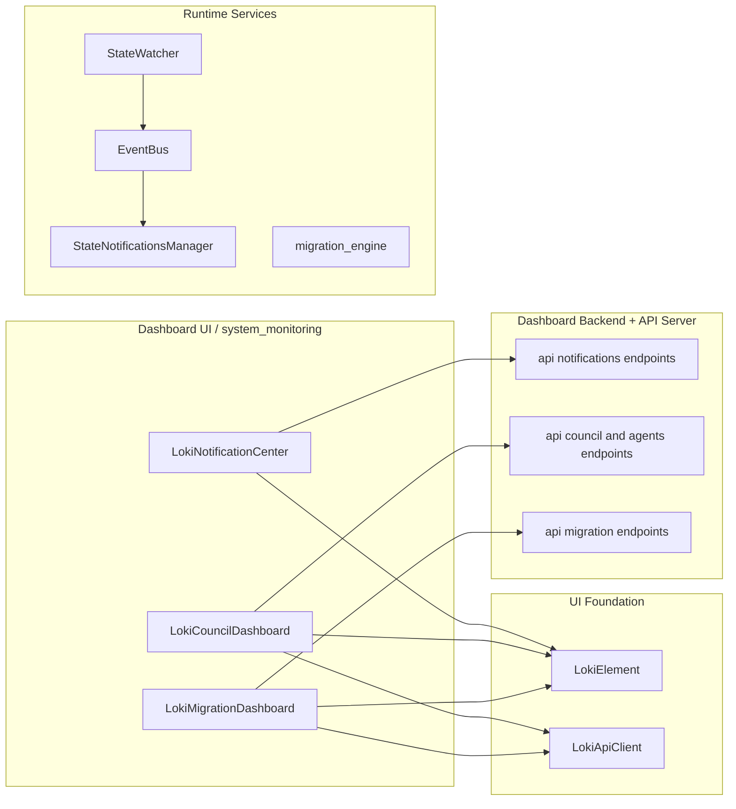
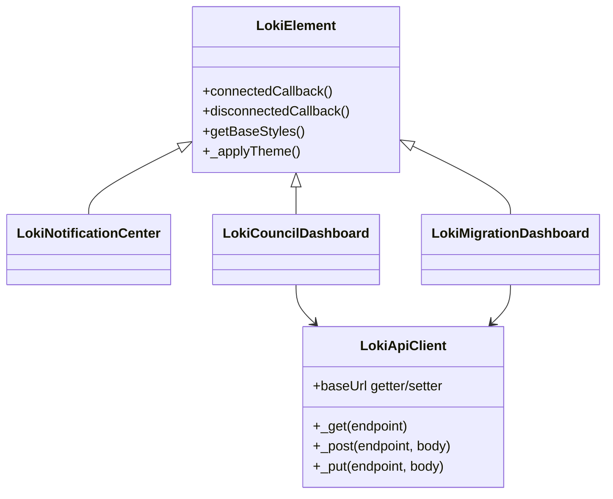
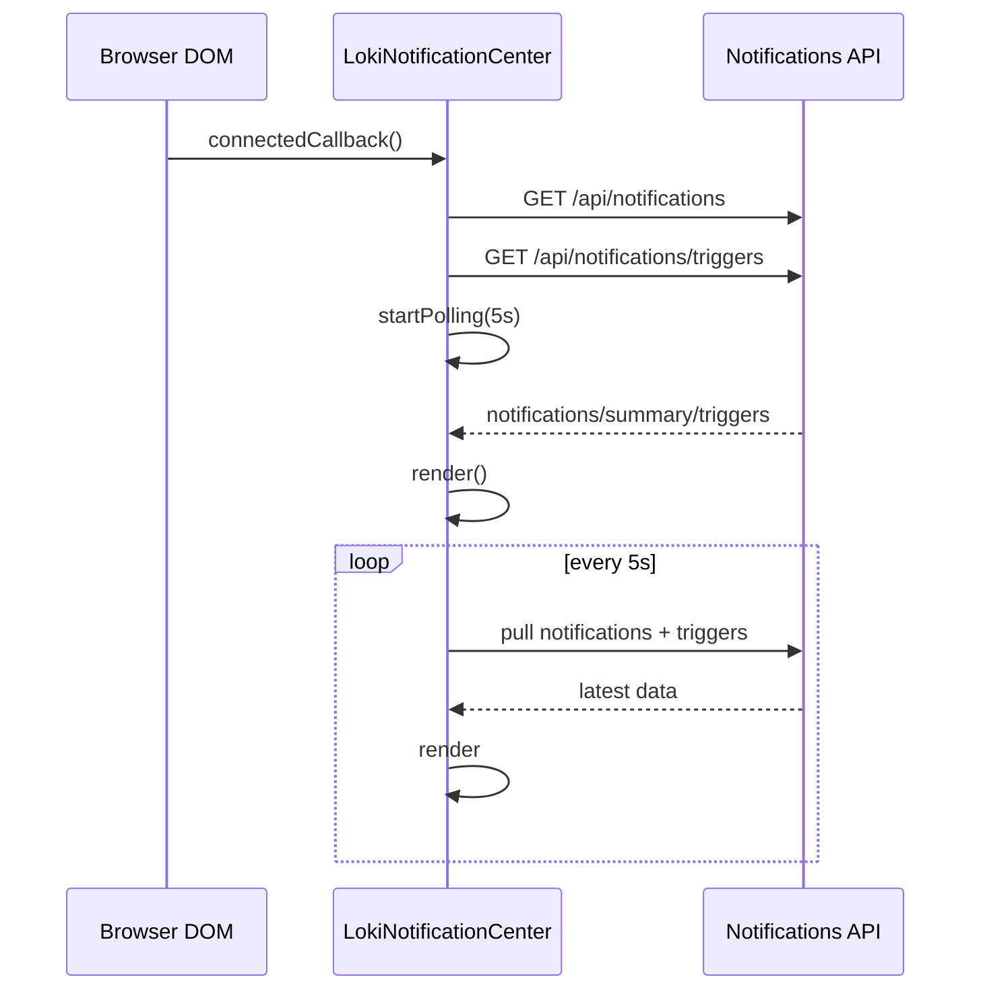
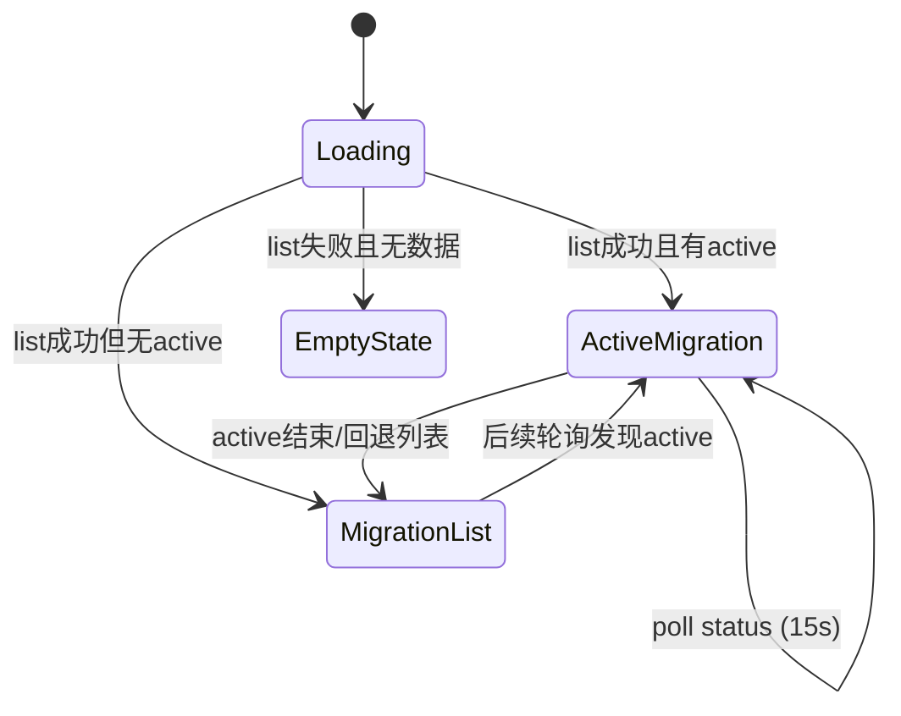
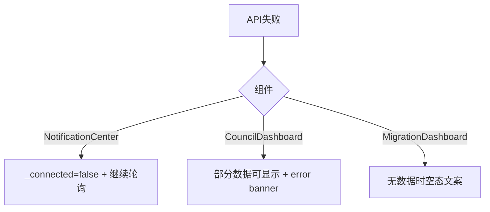

# system_monitoring 模块文档

## 模块定位与存在价值

`system_monitoring` 是 Dashboard UI Components 中 Administration and Infrastructure Components 的子模块，包含三个可独立嵌入的 Web Component：`LokiNotificationCenter`、`LokiCouncilDashboard`、`LokiMigrationDashboard`。它们共同承担“系统运行治理可视化”的职责：通知运营、议会治理观测、迁移过程可观测性。

这个模块存在的核心原因是，运行时系统的健康与治理状态并不只是一条指标曲线，而是由多个操作闭环构成：例如告警是否被确认、议会是否收敛、迁移是否推进到下一个 phase。`system_monitoring` 把这些闭环以 UI 的方式标准化输出，降低了运维和开发人员跨服务排障的认知成本。

在设计上，该模块采取了“**组件内聚、后端解耦**”策略。三个组件都只依赖统一主题基类 `LokiElement` 与 API 访问层（直接 `fetch` 或 `getApiClient`），不会把业务编排逻辑放到前端。这种策略便于复用、测试和嵌入，同时也意味着组件强依赖后端 API 契约稳定性。

---

## 模块边界与系统关系

`system_monitoring` 处于展示层，不生成监控事件，也不执行治理策略。它消费后端 API，并将结果转化为可交互界面。



上图体现了重要边界：三个组件都属于“观测和控制前端”，真正的事件采集、策略判断、任务执行在后端和运行时服务中完成。若需要深入底层机制，请参考 [API Server & Services.md](API%20Server%20&%20Services.md)、[Dashboard Backend.md](Dashboard%20Backend.md)、[State Notifications.md](State%20Notifications.md)、[migration_orchestration.md](migration_orchestration.md)。

---

## 统一技术基座

三个组件都继承 `LokiElement`（主题、Shadow DOM、生命周期基础），其中两个组件使用 `getApiClient()` 获取 `LokiApiClient` 单例。



`LokiElement` 提供了主题 token 与 `connected/disconnected` 规范，确保这些组件在不同宿主页面中具有一致视觉与清理行为。`LokiApiClient` 则统一了超时、错误封装、baseUrl 管理和 API 方法入口，减少了重复请求代码。详细基础能力请参考 [Core Theme.md](Core%20Theme.md) 与 [API 客户端.md](API%20客户端.md)。

---

## 组件一：`LokiNotificationCenter`

`LokiNotificationCenter` 提供两类能力：通知流读取（Feed）与触发器规则开关（Triggers）。它每 5 秒轮询通知与触发器接口，适合“持续值守面板”场景。

### 内部状态与主流程



组件核心状态包括 `_notifications`、`_triggers`、`_summary`、`_connected`、`_activeTab`。其中 `_connected` 只代表最近一次通知请求是否成功，不是完整链路健康状态。

### 关键方法说明

- `observedAttributes(): string[]`：监听 `api-url` 与 `theme`。
- `connectedCallback(): void`：初始化拉取 + 启动轮询。
- `disconnectedCallback(): void`：停止轮询，避免内存泄漏。
- `attributeChangedCallback(name, oldValue, newValue): void`：
  - `api-url` 变化后重新拉取通知和触发器。
  - `theme` 变化后应用主题。
- `_loadNotifications(): Promise<void>`：请求 `/api/notifications`，更新通知和 summary，失败时将 `_connected=false`。
- `_loadTriggers(): Promise<void>`：请求 `/api/notifications/triggers`，失败时保留旧触发器。
- `_acknowledgeNotification(id: string): Promise<void>`：确认单条通知，然后刷新列表。
- `_acknowledgeAll(): Promise<void>`：遍历本地未确认通知逐条 POST，最后刷新。
- `_toggleTrigger(triggerId: string, enabled: boolean): Promise<void>`：构造全量 triggers 并 PUT；本地立即更新并重渲染。
- `_formatTime(timestamp): string`：相对时间显示（`s/m/h/d ago`）。
- `_escapeHTML(str): string`：基础 HTML 转义。

### 使用示例

```html
<loki-notification-center
  api-url="http://localhost:57374"
  theme="dark">
</loki-notification-center>
```

### 行为注意点

`_acknowledgeAll` 采用串行逐条请求，在未确认通知很多时可能产生明显延迟和后端压力。`_toggleTrigger` 属于“近似乐观更新”，若 PUT 失败没有回滚逻辑，UI 与后端可能短暂不一致。

---

## 组件二：`LokiCouncilDashboard`

`LokiCouncilDashboard` 是议会治理观察与干预面板，提供 `Overview / Decision Log / Convergence / Agents` 四个标签。组件每 3 秒轮询数据，并在页面隐藏时暂停轮询以降低资源消耗。

### 数据采集与渲染策略

```mermaid
flowchart TD
  A[loadData] --> B[Promise.allSettled]
  B --> C1[/api/council/state]
  B --> C2[/api/council/verdicts]
  B --> C3[/api/council/convergence]
  B --> C4[/api/agents]
  C1 --> D[merge fulfilled results]
  C2 --> D
  C3 --> D
  C4 --> D
  D --> E[JSON.stringify hash compare]
  E -->|changed| F[render]
  E -->|unchanged| G[skip render]
```

这里最关键的实现是 `Promise.allSettled` + 数据哈希比较。前者保证部分接口失败时仍能展示其他数据，后者避免频繁重渲染打断用户交互。

### 关键方法说明

- `_setupApi(): void`：基于 `api-url` 创建 `LokiApiClient`。
- `_startPolling(): void`：
  - 创建 3 秒 `setInterval`。
  - 注册 `document.visibilitychange`，隐藏时暂停，恢复时立即拉取并重启。
- `_stopPolling(): void`：清理 interval、visibility 监听、待执行 rAF。
- `_loadData(): Promise<void>`：并行读取 4 个 API，合并成功结果，失败不整体中断。
- `_forceReview(): Promise<void>`：POST `/api/council/force-review` 并派发 `council-action` 事件。
- `_killAgent(agentId): Promise<void>`：确认后 POST `/api/agents/{id}/kill`，刷新数据。
- `_pauseAgent(agentId)` / `_resumeAgent(agentId)`：控制 agent 生命周期。
- `_renderAgents()`：通过 `requestAnimationFrame` 延迟绑定 agent 卡片事件，减少 stale DOM 监听问题。

### 自定义事件

组件会冒泡派发 `council-action`：

```javascript
el.addEventListener('council-action', (e) => {
  console.log('action =', e.detail.action, 'agentId =', e.detail.agentId);
});
```

典型 `detail.action` 包括 `force-review`、`kill-agent`。

### 使用示例

```html
<loki-council-dashboard
  api-url="http://localhost:57374"
  theme="light">
</loki-council-dashboard>
```

---

## 组件三：`LokiMigrationDashboard`

`LokiMigrationDashboard` 用于显示迁移运行状态。它先取迁移列表，再判断是否存在 active 迁移；若存在，转入详情轮询（15 秒），否则维持列表视图。

### 视图状态机



### 关键方法说明

- `_fetchMigrations(): Promise<void>`：
  - GET `/api/migration/list`
  - 兼容数组或 `{ migrations: [...] }`
  - 查找 `in_progress/active` 并触发 `_fetchStatus`
- `_fetchStatus(id: string): Promise<void>`：GET `/api/migration/{id}/status`。
- `_fetchData(): Promise<void>`：若当前有 migration id，则刷新 status；否则刷新 list。
- `_renderPhaseBar(currentPhase, completedPhases): string`：渲染四阶段条（understand/guardrail/migrate/verify）。
- `_renderFeatureStats(features)`、`_renderStepProgress(steps)`、`_renderSeamSummary(seams)`：统计卡片。
- `_renderCheckpoint(checkpoint)`：展示 checkpoint 时间与 step id。
- `_escapeHtml(str)`：防注入转义。

### 使用示例

```html
<loki-migration-dashboard
  api-url="http://localhost:57374"
  theme="dark">
</loki-migration-dashboard>
```

---

## 配置与扩展建议

### 可配置项

所有组件均支持 `api-url` 与 `theme`（`LokiMigrationDashboard` 文档注释虽强调 `api-url`，但代码同样监听 `theme`）。`api-url` 默认值为 `window.location.origin`，适合同源部署；跨域部署时需要后端配置 CORS 与鉴权。

### 扩展模式

若需要新增一个 system monitoring 组件，建议遵循当前模式：继承 `LokiElement`、以局部状态驱动 `render()`、在 `connected/disconnected` 成对管理定时器与全局监听、所有字符串插值先转义。对于 API 调用优先复用 `LokiApiClient`，避免重复处理超时与错误格式。

---

## 边界条件、错误行为与限制



主要注意点如下：

- `LokiNotificationCenter` 直接使用 `fetch`，没有统一超时控制；网络阻塞时用户可能只看到“Connecting...”状态。
- `LokiNotificationCenter` 的相对时间文案是英文单位（`ago`），与中文文档/界面可能不一致。
- `LokiCouncilDashboard` 的数据哈希比较使用 `JSON.stringify`，在超大数据集时可能带来额外 CPU 消耗。
- `LokiCouncilDashboard` 的 agent 操作依赖 `agent.id || agent.name`，若后端字段不稳定可能导致控制失败。
- `LokiMigrationDashboard` 只跟踪一个 active 迁移（列表中找到的首个），多活跃迁移场景显示能力有限。
- 三个组件都基于轮询，不是实时流，存在轮询间隔级别的数据延迟。

---

## 实战接入示例（组合页）

```html
<section>
  <loki-notification-center api-url="http://localhost:57374" theme="dark"></loki-notification-center>
  <loki-council-dashboard api-url="http://localhost:57374" theme="dark"></loki-council-dashboard>
  <loki-migration-dashboard api-url="http://localhost:57374" theme="dark"></loki-migration-dashboard>
</section>
```

若在父组件中统一处理治理动作，可监听 `council-action` 并记录审计日志，再联动通知中心刷新。

---

## 关联文档

- 基础主题与组件基类： [Core Theme.md](Core%20Theme.md)
- 统一样式与键盘机制： [Unified Styles.md](Unified%20Styles.md)
- API 客户端设计： [API 客户端.md](API%20客户端.md)
- 议会治理专题： [council_runtime_governance.md](council_runtime_governance.md)
- 通知系统与状态通知： [notification_operations.md](notification_operations.md)、[State Notifications.md](State%20Notifications.md)
- 迁移编排后端： [migration_orchestration.md](migration_orchestration.md)

以上文档应配合阅读：`system_monitoring` 负责“展示与操作入口”，而策略执行、事件生产、持久化与审计逻辑主要位于后端与运行时模块。
