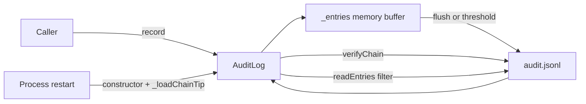

# tamper_evident_audit_log 模块深度解析

`tamper_evident_audit_log` 的核心价值，不是“把操作写进一个日志文件”这么简单，而是要回答一个更难的问题：**当系统出了安全事件、合规审计或责任争议时，我们如何证明历史记录没有被悄悄改过**。普通日志只能告诉你“曾经写过什么”，但不能证明“现在看到的内容还是当时写下的内容”。`src.audit.log.AuditLog` 通过哈希链把每条记录和上一条记录绑定起来，让篡改行为像撕坏装订线一样可检测，这就是这个模块存在的根本原因。

## 为什么需要这个模块：问题空间与朴素方案的缺陷

在工程实践里，“记录审计事件”看上去很直接：把 `who`、`what`、`timestamp` 写到文件或数据库即可。问题在于，这种朴素方案默认信任存储介质本身。一旦有人拥有文件写权限，他不仅可以追加伪造记录，还可以回头改旧记录，甚至把某些不利记录删掉。事后你看到的日志，可能已经不是事实。

`AuditLog` 的设计洞察是：与其完全依赖存储权限控制，不如让**数据自身携带可验证性**。它采用“链式哈希”模型：每条记录都包含 `previousHash`，并把自身关键字段与 `previousHash` 一起做 `sha256` 计算得到 `hash`。这样，任何对中间记录的修改，都会导致从该点开始的链校验失败。你可以把它想象成一本编号且带骑缝章的登记簿：每一页都盖着上一页的一部分章印，改其中一页会破坏后续连续性。

## 心智模型：把它当成“追加式、可验签的事件账本”

理解 `AuditLog` 最好抓住三个抽象：

第一，它是一个**追加账本（append-only ledger）**，通过 `record(entry)` 只追加新条目，不提供修改历史条目的 API。第二，它是一个**内存缓冲 + 磁盘落盘**的双层结构：内存里先积累 `_entries`，达到 `MAX_MEMORY_ENTRIES`（1000）或显式调用时再 `flush()` 批量写入 JSONL 文件。第三，它是一个**可重放验证器**：`verifyChain()` 会从头遍历文件，逐条重新计算哈希并验证链连续性。

所以日常写入路径追求低摩擦，审计验证路径追求正确性。模块不是数据库，也不是分布式账本；它是本地单进程语境下“成本可控的防篡改审计层”。

## 架构与数据流



从 `AuditLog` 的代码可见，关键数据流分成四条主线。

第一条是写入链路。调用方传入 `entry` 后，`record()` 会先校验必填字段 `who` 和 `what`，然后构造标准审计对象：写入 `seq`、`timestamp`、`previousHash`，并对 `metadata` 做一次 `JSON.parse(JSON.stringify(...))` 的深拷贝。接着通过 `_computeHash()` 计算当前条目哈希，更新内存态 `_lastHash` 和 `_entryCount`，并把条目推入 `_entries`。达到阈值就自动 `flush()`。

第二条是持久化链路。`flush()` 会确保日志目录存在（必要时 `mkdirSync(..., { recursive: true })`），然后把内存条目序列化成 JSON Lines（每行一个 JSON）并 `appendFileSync` 到 `audit.jsonl`。写完后清空 `_entries`。这里选择同步 I/O，意味着“写完才返回”，更偏向一致性和简单性，而不是吞吐极限。

第三条是验证链路。`verifyChain()` 先 `flush()`，保证校验范围包含内存中尚未落盘的数据。随后读取整个文件，从 `GENESIS` 作为初始 `expectedPrevHash` 开始逐行验证：先检查 JSON 是否可解析，再检查 `entry.previousHash` 是否等于期望值，再重新计算哈希比对 `entry.hash`。一旦异常，返回 `{ valid: false, entries, brokenAt, error }`；全部通过则返回 `valid: true`。

第四条是恢复链路。进程重启后构造函数调用 `_loadChainTip()`，从文件最后一行读取最后条目的 `hash` 与 `seq`，恢复 `_lastHash` 和 `_entryCount`，让新写入可以无缝接到旧链后面。如果最后一行损坏，会触发 `console.warn` 并标记 `_chainCorrupted = true`（该标记当前仅记录状态，不阻断继续写入）。

## 组件深潜：`src.audit.log.AuditLog`

### `constructor(opts)`

构造函数负责建立运行时上下文。`projectDir` 默认 `process.cwd()`，`logDir` 默认 `path.join(projectDir, '.loki', 'audit')`，日志文件固定是 `audit.jsonl`。初始化时把链头设为 `GENESIS`，计数器为 0，然后执行 `_loadChainTip()` 进行断点续写准备。

设计意图很明确：开箱即用，不要求外部先创建目录或预热状态。

### `record(entry)`

这是最热路径。它通过“最小必填 + 结构标准化”保证条目质量：`who` 和 `what` 缺失立即抛错，其他字段转为字符串或 `null`。`metadata` 深拷贝是一个关键细节，防止调用方后续修改原对象导致“日志内容被引用污染”。

返回值是完整审计条目（包含 `seq`、`timestamp`、`previousHash`、`hash`），方便调用方立即关联显示或回传。

### `flush()`

`flush()` 是批量落盘闸门。空缓冲直接返回，非空才执行文件系统操作。它不做复杂重试与回滚，属于“本地文件写入即真相”的策略。由于使用同步写入，调用线程会阻塞到写入完成。

### `verifyChain()`

`verifyChain()` 的语义是“以当前文件内容为准做完整性证明”。它不会尝试修复链，只负责定位第一个断点。`brokenAt` 用文件行序（从 0 开始循环变量）标识位置，`entries` 表示成功验证的数量。

一个容易忽略的点是：它对“空文件/不存在文件”返回 `valid: true`。这符合“没有证据不等于证据损坏”的工程约定，但在某些强合规场景你可能希望把“无审计数据”单独当成告警。

### `readEntries(filter)`

读取前同样先 `flush()`，确保“读到的是最新视图”。它会容忍坏行：解析失败返回 `null` 并过滤掉，不会整批抛错。过滤支持 `who`、`what`、`since`、`until`，并基于字符串比较时间戳；因为写入使用 ISO 8601，词典序比较在同一格式下可工作。

### `getSummary()`

`getSummary()` 是读路径上的聚合器，通过 `readEntries()` 计算总量、参与者集合、动作集合，以及首尾时间。实现简单直接，代价是每次都会全量读文件。

### `destroy()`

`destroy()` 只做两件事：`flush()` 和清空内存缓冲。它不关闭句柄（因为本实现没有持久打开的 fd），更像一个生命周期末尾的“确保落盘”动作。

### `_computeHash(entry)`

内部哈希函数只纳入这些字段：`seq`、`timestamp`、`who`、`what`、`where`、`why`、`metadata`、`previousHash`。注意它**不把 `hash` 自身纳入哈希输入**，这是自洽所必需的；否则会形成递归定义。

### `_loadChainTip()`

它是“恢复写入连续性”的关键。通过读取最后一行拿到最新 `hash` 和 `seq`，避免每次启动都从 `GENESIS` 重建整链状态。代价是依赖文件尾部健康；尾行损坏时当前策略是告警并继续（状态可继续记录但链连续性语义会变弱）。

## 依赖关系与契约分析

从源码直接可见，这个模块依赖 Node.js 内置库：`fs`（文件存在性、读取、追加写入、建目录）、`path`（路径拼接）、`crypto`（`sha256` 计算）。这是一个非常“自治”的实现，没有引入外部数据库或第三方加密依赖，因此部署简单、可移植性高。

在提供的模块树中，`tamper_evident_audit_log` 隶属 [Audit](Audit.md)，其结果会被上层审计查询与可视化链路消费。可以把调用方向理解为：后端审计 API（见 [Dashboard Backend](Dashboard%20Backend.md) 中审计查询契约）与审计可视化组件（见 [audit_compliance_viewer](audit_compliance_viewer.md)）读取/验证 `AuditLog` 产物；SDK 侧有审计类型契约可承接这些数据（见 [TypeScript SDK](TypeScript%20SDK.md)、[Python SDK](Python%20SDK.md)）。

需要强调一件事：当前提供的代码片段只展示了 `AuditLog` 本体，没有展示具体 HTTP 路由如何实例化和调用它。因此对“谁在何处调用了 `record()`/`verifyChain()`”这类关系，我们只能依据模块树做架构层推断，而不能声称精确到函数级调用点。

## 关键设计取舍

这个实现做了几组很典型、也很务实的取舍。

它选择了**同步文件 I/O**而不是异步队列。好处是状态机简单、时序确定，调用返回时语义清晰；代价是高并发下会阻塞事件循环。对于审计日志这种“正确性优先、吞吐次优先”的场景，这个选择是合理的，但如果未来写入频率显著上升，可能需要后台 worker 或批处理线程。

它选择了**本地哈希链**而不是外部签名服务。好处是零外部依赖、离线可运行；代价是无法防御“攻击者同时改文件并重算整链”的强对手模型。换言之，它是 tamper-evident（可发现篡改），不是 tamper-proof（绝对防篡改）。若要提升对抗强度，通常要引入不可回滚存储、远端时间戳或私钥签名锚定。

它选择了**全量验证与全量读取**而不是增量索引。代码易懂、错误面小；但文件越大，`verifyChain()` 和 `getSummary()` 成本越高。对中小规模项目很好用，对超大体量需要分页索引或分段链策略。

它选择了**宽容读取**（坏行跳过）与**严格验证**（坏行即失败）并存。前者保证业务可继续查看大部分记录，后者保证合规校验不放水。这是一个很清晰的“双模式”策略。

## 使用方式与实践示例

```javascript
const { AuditLog } = require('./src/audit/log');

const audit = new AuditLog({ projectDir: process.cwd() });

audit.record({
  who: 'policy-engine',
  what: 'approve_task',
  where: 'task#123',
  why: 'cost_within_budget',
  metadata: { budget: 10, actual: 6.2 }
});

// 在进程退出前确保落盘
audit.flush();

const verify = audit.verifyChain();
if (!verify.valid) {
  console.error('audit chain broken:', verify);
}
```

如果你在服务中长期持有实例，建议把 `flush()` 绑定到优雅停机流程；如果你做批任务，任务末尾调用 `destroy()` 可以更稳妥地保证缓冲区清空并落盘。

## 新贡献者最该注意的边界与陷阱

第一，`record()` 会把 `metadata` 走 JSON 序列化深拷贝，这意味着 `Date`、`Map`、函数、循环引用对象等都会丢失或报错。调用方应只传可 JSON 序列化的数据结构。

第二，`readEntries()` 的时间过滤是字符串比较，默认建立在 ISO 时间戳格式一致的前提上。若外部写入了非 ISO 格式时间，过滤行为可能偏差。

第三，`_loadChainTip()` 发现尾行损坏时不会阻止继续写入，只是告警并置 `_chainCorrupted`。如果你在强审计模式下工作，可能需要在上层检测这个状态并触发人工介入，而不是静默继续。

第四，当前实现未显式处理多进程并发写同一 `audit.jsonl` 的竞争场景。单进程内行为可预测，多进程共享同一路径会有链序冲突风险。

第五，`verifyChain()` 在调用时会先 `flush()`，因此它不仅是只读检查，也会触发 I/O 写入副作用。若你在延迟敏感路径调用它，要把这点算进预算。

## 参考阅读

若你需要完整理解审计域而不只这一子模块，建议继续阅读：整体审计域文档 [Audit](Audit.md)，审计可视化入口 [audit_compliance_viewer](audit_compliance_viewer.md)，以及承接审计数据契约的 [Dashboard Backend](Dashboard%20Backend.md)、[TypeScript SDK](TypeScript%20SDK.md)、[Python SDK](Python%20SDK.md)。