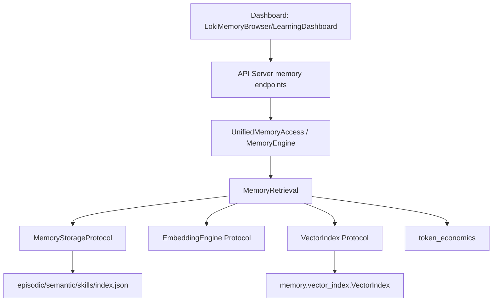
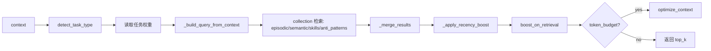
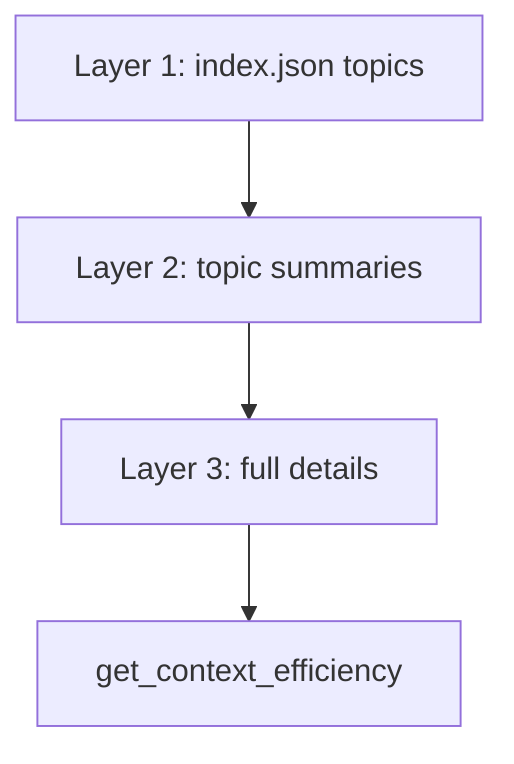
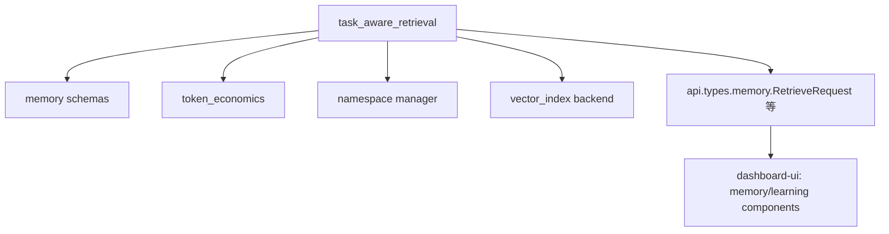

# task_aware_retrieval 模块文档

## 引言：模块目的、存在原因与设计思想

`task_aware_retrieval` 是 Memory System 中负责“把历史记忆按当前任务动态转化为可用上下文”的检索编排模块，对应源码 `memory/retrieval.py`。它的核心价值不在于单次检索速度，而在于**检索决策质量**：在给定任务目标、阶段、动作类型与 token 预算的前提下，选择最有价值的 episodic / semantic / skills / anti-patterns 记忆组合。

这个模块存在的直接原因是，静态检索权重在不同任务中表现不稳定。实现里明确采用 task-aware 策略（不同任务类型使用不同记忆源权重），并叠加重要性、置信度、时效性和预算压缩等机制，使检索结果更贴合任务意图，而非仅依赖单一相似度分数。

从设计上，该模块采用“协议抽象 + 多策略编排 + 可降级执行”的结构。协议抽象通过 `MemoryStorageProtocol` 与 `VectorIndex`（均为 Protocol）隔离底层实现；多策略编排由 `TASK_STRATEGIES` + `detect_task_type` + `_merge_results` 完成；可降级执行体现在 embedding/index 不可用时自动回退关键词检索，确保系统在轻量环境也能工作。

建议结合以下文档交叉阅读，以避免重复理解：
- 记忆对象字段与约束：[`memory_foundation_and_schemas.md`](memory_foundation_and_schemas.md)
- 向量索引实现细节：[`Vector Index.md`](Vector Index.md)
- 检索与渐进加载组合：[`retrieval_and_progressive_loading.md`](retrieval_and_progressive_loading.md)
- 内存系统总览：[`Memory System.md`](Memory System.md)

---

## 1. 模块在整体系统中的位置



该模块位于“记忆数据存储层”和“API/Agent 消费层”之间，是一个检索决策中间层。上层只关心拿到可用上下文；底层只负责读写和索引；而本模块负责把上下文需求映射为检索动作、评分逻辑、预算控制和结果融合。

---

## 2. 核心组件与职责关系

### 2.1 `memory.retrieval.MemoryStorageProtocol`

`MemoryStorageProtocol` 是检索层对存储层的最小契约，定义如下能力：

- `read_json(filepath) -> Optional[Dict[str, Any]]`
- `list_files(subpath, pattern="*.json") -> List[Path]`
- `calculate_importance(memory, task_type=None) -> float`
- `boost_on_retrieval(memory, boost=0.1) -> Dict[str, Any]`

其意义在于：检索逻辑不绑定具体后端（本地文件、数据库、对象存储均可），只要实现这些行为即可。尤其 `boost_on_retrieval` 使“检索命中反馈”可落地到存储层，形成长期记忆强化。

### 2.2 `memory.retrieval.VectorIndex`（Protocol）

这是向量索引后端契约，定义 `add/search/remove/save/load`。检索器依赖该协议，不依赖具体库。默认实现通常来自 `memory.vector_index.VectorIndex`（numpy 版），但也可以替换为外部向量库适配器。

> 注意：协议中的 `search(..., filters=...)` 与默认实现常见的 `filter_fn` 形式存在语义差异，适配器需要统一接口。

### 2.3 实际业务入口：`MemoryRetrieval`

虽然核心组件列表强调了两个协议，但业务主类是 `MemoryRetrieval`。它负责任务识别、跨集合检索、打分融合、recency boost、token 预算优化、跨命名空间检索、索引生命周期管理。

---

## 3. 任务感知检索机制

### 3.1 任务策略矩阵（`TASK_STRATEGIES`）

模块内置 5 类任务类型：`exploration`、`implementation`、`debugging`、`review`、`refactoring`。每类任务对四类记忆集合赋予不同权重：

- `episodic`
- `semantic`
- `skills`
- `anti_patterns`

这意味着同一查询词，在不同任务语义下会得到不同排序结果。例如 debugging 更强调 episodic + anti_patterns，而 implementation 更偏 semantic + skills。

### 3.2 任务类型识别（`detect_task_type`）

`detect_task_type(context)` 从 `goal`、`action_type`、`phase` 三个字段打分：关键词匹配权重 2、动作匹配权重 3、阶段匹配权重 4。返回最高分任务类型；若全为 0，默认回退 `implementation`。

这种设计使系统在上下文字段不完整时仍可运行，但也带来一个操作性约束：若你希望更稳定命中目标策略，应在 context 中明确给出 phase/action_type。

### 3.3 主流程：`retrieve_task_aware`



该流程体现了“先召回、后重排、再压缩”的多阶段检索思想。实现中每个 collection 常先拿 `top_k * 2` 候选，避免过早截断影响跨集合重排。

---

## 4. 检索模式与评分细节

### 4.1 相似度检索与关键词回退

`retrieve_by_similarity(query, collection, top_k)` 仅在 embedding engine 与对应 vector index 同时存在时走向量检索。否则自动回退 `retrieve_by_keyword`。这是模块的高可用保障：embedding 设施不可用时不会整体失效。

关键词检索按集合定制规则：
- episodic：重点匹配 `context.goal`，次级匹配 `phase`
- semantic：匹配 `pattern/category/correct_approach`，并乘 `confidence`
- skills：`name` 权重最高，其次 `description`、`steps`
- anti_patterns：`what_fails` 权重高于 `why/prevention`

### 4.2 融合排序公式

`_score_result` 采用组合评分：

```text
weighted_score = base_score * task_weight * (0.7 + 0.3*importance) * confidence
```

其中 `importance` 不是硬覆盖，而是 30% 动态因子；`confidence` 主要作用于 semantic pattern。这样可避免某单一因子过度主导结果。

### 4.3 新近度加权（`_apply_recency_boost`）

模块对 30 天内条目施加线性增益（默认最大 10%），基于 `timestamp` 或 `last_used`。增益后会重新排序。该逻辑对持续迭代项目尤其有利，因为近期经验通常更贴近当前代码状态。

---

## 5. 命名空间检索：隔离与复用

### 5.1 `with_namespace(namespace)`

创建共享配置的新 `MemoryRetrieval` 实例并切换 namespace。若存储实现支持 `with_namespace`，会使用隔离后的存储视图。

### 5.2 `retrieve_cross_namespace(context, namespaces, ...)`

对多个 namespace 分别检索后合并。每条结果附带 `_namespace`。非当前 namespace 默认加轻微惩罚（`_weighted_score * 0.9`），避免跨项目结果压制本地经验。

### 5.3 `retrieve_with_inheritance(...)`

尝试通过 `NamespaceManager.get_inheritance_chain` 获取继承链（当前 -> 父级 -> global），并沿链检索。若 namespace 模块不可导入，则回退到当前 + global 的简化策略。


这套机制支持“项目隔离优先、组织经验补充”的知识复用模式。

---

## 6. Token 预算与渐进检索

### 6.1 `retrieve_with_budget(context, token_budget, progressive=True)`

返回统一结构：

```python
{
  "memories": [...],
  "metrics": {...},
  "task_type": "..."
}
```

- `progressive=False`：先广泛检索（`top_k=50`），再通过 `optimize_context` 压缩。
- `progressive=True`：走 `_progressive_retrieve` 的分层披露路径。

### 6.2 `_progressive_retrieve` 三层策略



预算分配是启发式的：约 20% 给 topic index、40% 给 summaries，余量用于 full details。每条记忆会附 `_layer`（1/2/3），便于后续统计与调优。

### 6.3 指标观测

`get_token_usage_summary(context, results)` 输出总 token、压缩比、按 source/layer 分布、任务类型等信息。建议在服务端日志或 observability 中长期记录，用于评估检索成本收益。

---

## 7. 索引构建与持久化

### 7.1 `build_indices()`

按 collection 扫描存储并构建 embedding：
- episodic：`goal + phase`
- semantic：`pattern + category + correct_approach`
- skills：`name + description + steps`
- anti_patterns：`what_fails + why + prevention`

### 7.2 `update_index(collection, item_id, embedding, metadata)`

对单条数据增量更新索引；若 collection 未配置索引则静默返回。

### 7.3 `save_indices()` / `load_indices()`

索引默认保存到 `vectors/{collection}_index(.npz/.json)`。若存储实现有 `_resolve_path`，会优先使用以确保 namespace 路径隔离。

---

## 8. 关键接口说明（按开发者最常用路径）

### 8.1 `retrieve_task_aware`

**参数**：
- `context: Dict[str, Any]`（建议包含 `goal/phase/action_type/files`）
- `top_k: int = 5`
- `token_budget: Optional[int] = None`

**返回**：`List[Dict[str, Any]]`，每项含 `_source/_score/_weighted_score` 等元字段。

**副作用**：若存储支持 `boost_on_retrieval`，会提升 top 结果的重要性。

### 8.2 `retrieve_cross_namespace`

**参数**：`context`, `namespaces`, `top_k`, `token_budget`

**返回**：跨命名空间融合结果，带 `_namespace`。

**行为注意**：返回上限是 `top_k * len(namespaces)`，不是单一 `top_k`。

### 8.3 `retrieve_by_temporal`

**参数**：`since`, `until=None`

**返回**：时间窗内结果（episodic + semantic）。

**行为注意**：episodic 依赖日期目录命名（`YYYY-MM-DD`）；目录命名不规范将被跳过。

---

## 9. 使用示例

### 9.1 最小可用初始化（关键词回退模式）

```python
from memory.retrieval import MemoryRetrieval

retrieval = MemoryRetrieval(storage=my_storage)
results = retrieval.retrieve_task_aware(
    context={"goal": "fix failing test in auth middleware", "phase": "debugging"},
    top_k=5,
)
```

### 9.2 向量增强模式

```python
from memory.retrieval import MemoryRetrieval
from memory.vector_index import VectorIndex

indices = {
    "episodic": VectorIndex(dimension=384),
    "semantic": VectorIndex(dimension=384),
    "skills": VectorIndex(dimension=384),
    "anti_patterns": VectorIndex(dimension=384),
}

retrieval = MemoryRetrieval(
    storage=my_storage,
    embedding_engine=my_embedding_engine,
    vector_indices=indices,
    namespace="project-a",
)

retrieval.build_indices()
retrieval.save_indices()
```

### 9.3 带预算检索

```python
payload = retrieval.retrieve_with_budget(
    context={
        "goal": "review architecture changes for API rate limiter",
        "phase": "review",
        "action_type": "review_pr",
    },
    token_budget=1800,
    progressive=True,
)

print(payload["task_type"], payload["metrics"])
```

---

## 10. 扩展指南

### 10.1 扩展新任务类型

需要同时更新：
1. `TASK_STRATEGIES`：定义集合权重；
2. `TASK_SIGNALS`：补关键词、动作、阶段信号。

否则即使识别到新类型，也可能因缺少策略回退到默认 implementation 权重。

### 10.2 替换向量后端

实现 `VectorIndex` 协议并注入 `vector_indices` 即可。建议确保：
- `search` 返回 `(id, score, metadata)` 结构；
- `save/load` 路径语义与当前持久化流程一致；
- 维度校验行为明确，便于快速发现 embedding 维度漂移。

### 10.3 自定义存储后端

实现 `MemoryStorageProtocol` 即可接入。为了获得完整能力，建议额外提供：
- `with_namespace`
- `list_namespaces`
- `ensure_directory`
- `_resolve_path`

这些方法不是协议强制项，但模块通过 `hasattr` 探测并启用增强行为。

---

## 11. 边界条件、错误场景与已知限制

该模块总体采用“容错优先”风格，很多路径是静默降级而非抛异常。维护时应重点关注以下行为：

1. **embedding 不可用时自动回退关键词检索**。这保证可用性，但结果质量可能下降，且不一定有显式告警。
2. **任务识别完全依赖启发式文本匹配**。若 context 稀疏或语言不匹配，可能误判任务类型。
3. **索引加载只检查 `.npz` 是否存在**。若 `.json` 侧车损坏，将在 `index.load` 时抛异常（依赖具体实现）。
4. **时间解析容错会跳过坏数据**。格式不正确的 `timestamp/last_used` 条目会被忽略，可能造成“明明有数据却检不到”的错觉。
5. **跨命名空间结果会原位写入 `_namespace/_weighted_score`**。若上层复用同一对象引用，需注意数据污染风险。
6. **`MemoryStorageProtocol.calculate_importance` 在当前实现中未直接调用**。重要性主要来自 memory 字段本身和 `boost_on_retrieval` 反馈链路。
7. **向量协议与默认实现搜索签名存在差异风险**（`filters` vs `filter_fn`），适配外部后端时请显式兼容。

---

## 12. 与其他模块的依赖与协同



本模块直接依赖 `memory.schemas`（数据结构语义）、`memory.token_economics`（预算优化）、可选 `memory.namespace`（继承链）与 `memory.vector_index`（默认向量实现）。在系统层面，它经由 API memory contracts 暴露给 Dashboard 与 SDK 消费。

---

## 13. 维护建议（实践向）

建议优先建立三类回归测试：
- **策略正确性测试**：同一 query 在不同 task_type 下的 source 分布是否符合预期。
- **降级路径测试**：无 embedding / 无 index / 无 namespace manager 时是否仍返回稳定结果。
- **预算稳定性测试**：给定固定输入和 token_budget，`optimize_context` 是否保持可解释的选择行为。

在运维上，建议把 `task_type`、`by_source`、`compression_ratio`、`layers_used` 纳入 observability 指标，以便持续调优策略矩阵和预算阈值。
