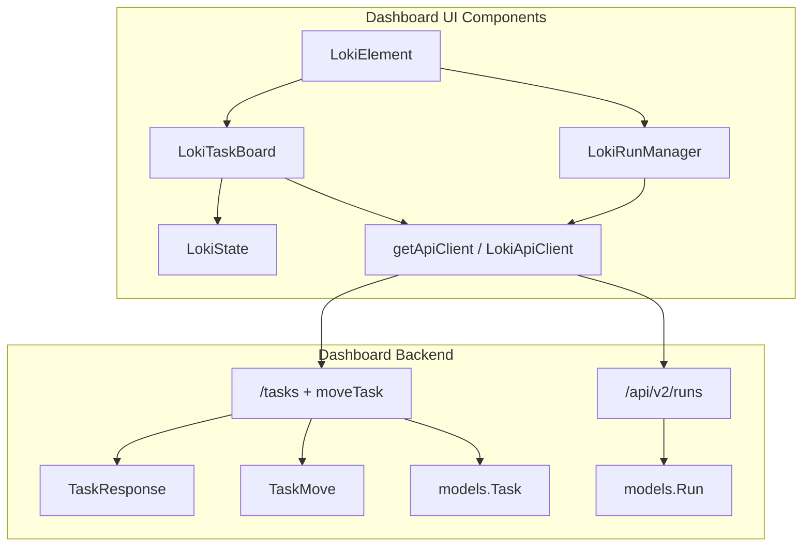
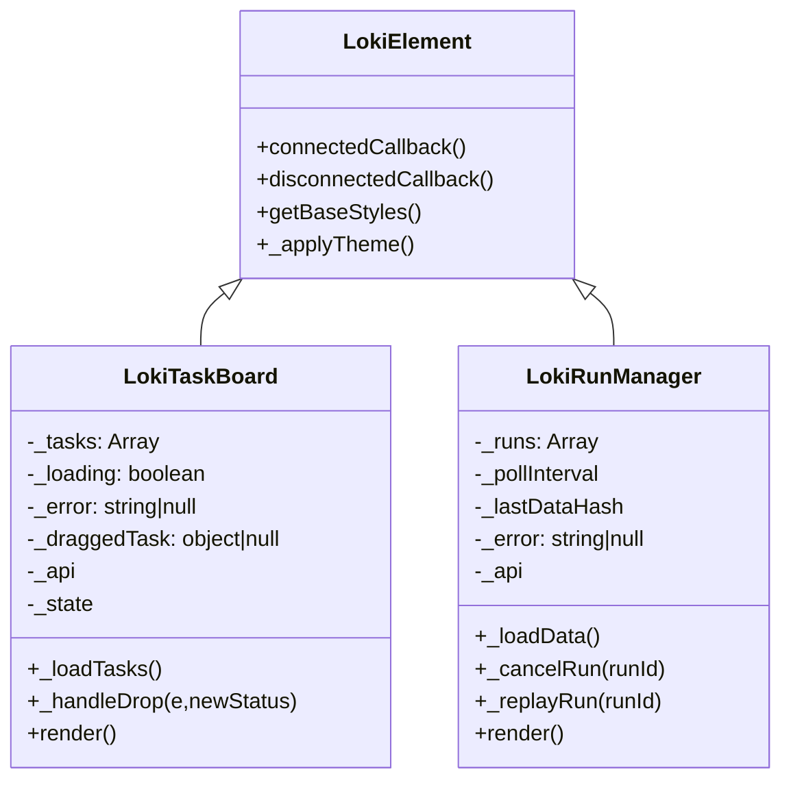
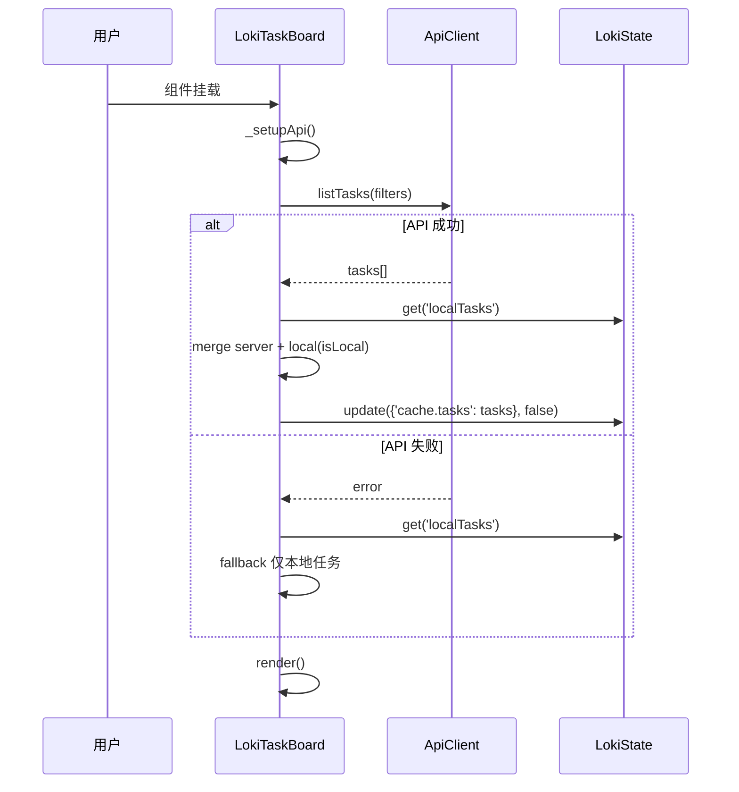
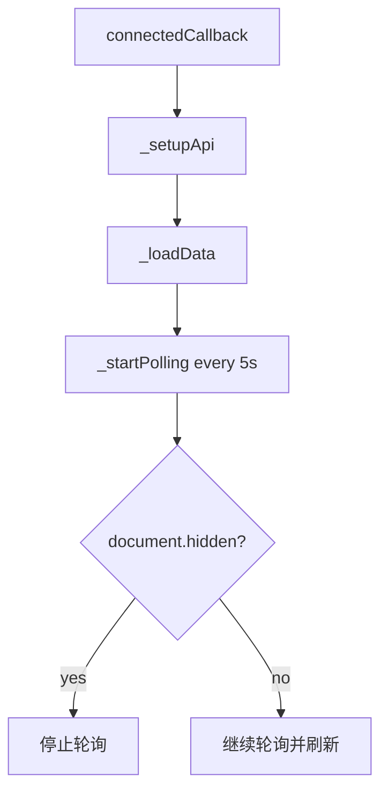
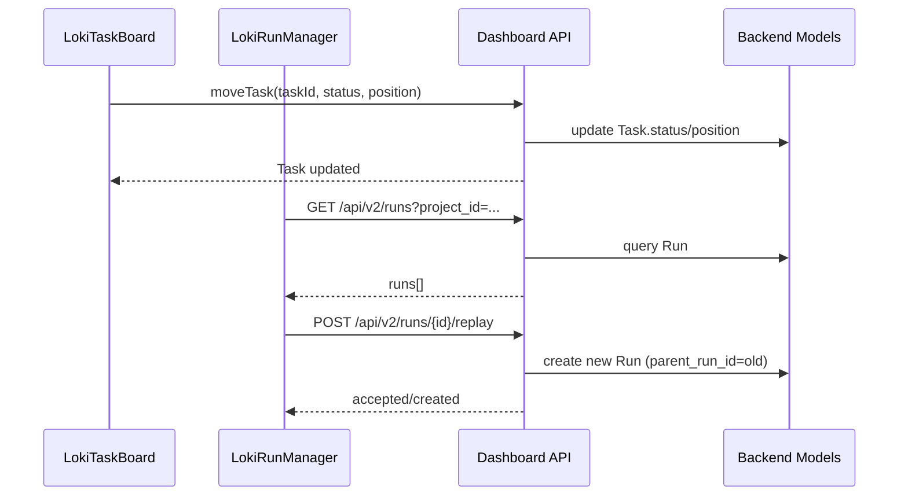
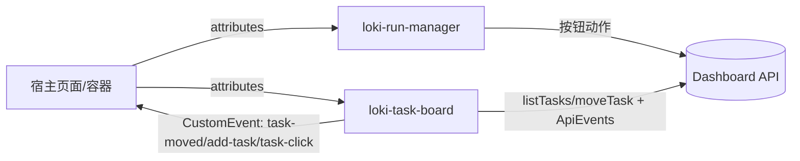

# task_board_and_run_operations 模块文档

## 模块定位与设计目标

`task_board_and_run_operations` 是 `Task and Session Management Components` 子模块中的执行面核心，包含两个互补组件：`LokiTaskBoard`（任务流转）与 `LokiRunManager`（运行记录与运行控制）。前者关注“任务在生命周期中的状态推进”，后者关注“任务/项目触发后形成的运行实例的执行与回放”。两者组合后，形成了从计划到执行再到复盘的闭环操作面板。

该模块存在的核心价值在于：把后端复杂的任务实体、运行实体以及状态机语义，压缩成前端可直接操作的可视化界面，并通过 Web Components 提供跨框架复用能力。对于不了解系统内部结构的开发者来说，这两个组件已经封装了主题系统、API 调用、生命周期管理、可访问性键盘交互、轮询刷新与失败兜底逻辑，使集成方可用较低成本将“任务编排 + 运行控制”能力嵌入任意宿主页面。

从系统层面看，该模块位于 Dashboard UI 的“操作层”，上承统一主题与基础元素能力（`Core Theme`、`Unified Styles`），下接 Dashboard Backend 的任务与运行 API（如 `TaskResponse`、`TaskMove`、`Run` 相关接口），并与前端 API 客户端层（`loki-api-client`）形成清晰边界。

---

## 架构总览



这个架构体现了两个关键设计决策。第一，组件都继承 `LokiElement`，因此主题切换、Shadow DOM 生命周期和基础样式能力统一，不需要在业务组件里重复实现。第二，`LokiTaskBoard` 和 `LokiRunManager` 虽共享 API 客户端，但数据模型与交互模式不同：任务看板以事件驱动 + 乐观更新为主，运行管理以轮询拉取 + 行级命令操作为主。

---

## 组件关系与职责划分



`LokiTaskBoard` 的职责是“任务状态可视化与迁移操作”，包含拖拽、键盘可访问性、本地任务融合和任务事件响应；`LokiRunManager` 的职责是“运行实例列表与控制”，包含状态标签渲染、取消/重放动作、轮询与可见性优化。两者都避免承担业务编排本身（例如任务自动分配策略、运行调度策略），这些策略在后端模型和服务层中实现。

---

## LokiTaskBoard 深入说明

### 1) 组件用途与内部工作流

`LokiTaskBoard` 提供四列固定看板：`pending`、`in_progress`、`review`、`done`。组件挂载后会初始化 API 客户端并加载任务；若 API 失败会回退到本地状态中的 `localTasks`，保证离线/失败场景下至少可展示本地任务。



这个流程说明它并不是纯远程数据视图，而是具备“弱离线可用性”的混合视图组件。

### 2) 关键属性（Attributes）

- `api-url`：API 基地址，默认 `window.location.origin`。
- `project-id`：项目过滤条件，内部通过 `parseInt(projectId)` 传给 `listTasks`。
- `theme`：主题覆盖值，最终由 `LokiElement` 负责应用。
- `readonly`：存在即只读，禁用拖拽和新增按钮。

### 3) 关键事件（输出事件）

- `task-moved`：拖拽迁移成功后触发，`detail: { taskId, oldStatus, newStatus }`。
- `add-task`：点击“+ Add Task”触发，`detail: { status }`。
- `task-click`：点击或键盘激活任务卡片触发，`detail: { task }`。

### 4) 关键方法与行为细节

`_setupApi()` 会注册 `TASK_CREATED/TASK_UPDATED/TASK_DELETED` 监听器，统一回调 `_loadTasks()`。这使任务看板对外部变更具备自动刷新能力。

`_loadTasks()` 的输入是当前属性状态（`project-id` 等），输出是内部 `_tasks` 列表。副作用包括：更新加载态、错误态、触发渲染，以及写入全局状态缓存 `cache.tasks`。

`_handleDrop(e, newStatus)` 采用乐观更新策略：先把 task.status 改为新状态并 `render()`，再调用后端/本地迁移。如果调用失败，会回滚旧状态并再次渲染。该方法的好处是交互响应快，代价是可能出现短暂“看似成功后回退”的视觉闪烁。

`_getTasksByStatus(status)` 会标准化任务状态：`toLowerCase().replace(/-/g, '_')`，以兼容后端可能返回的中划线写法。

### 5) 可访问性与交互

任务卡片带有 `tabindex="0"` 和 `role="button"`，支持键盘 `Enter/Space` 打开详情，`ArrowUp/ArrowDown` 在卡片间移动焦点。这使组件在非鼠标场景下也可操作。

### 6) 与后端契约的对应关系

前端任务项字段与后端 `TaskResponse` 高度对应（如 `id`、`project_id`、`status`、`priority`、`assigned_agent_id` 等），状态迁移语义对应 `TaskMove { status, position }`。需要注意：后端 `TaskStatus` 定义包含 `backlog`，但此组件仅渲染四列，不显示 `backlog`。

---

## LokiRunManager 深入说明

### 1) 组件用途与内部工作流

`LokiRunManager` 用于展示运行记录并提供行级控制（取消、重放）。它采用 5 秒轮询，并在页面不可见时暂停轮询，返回可见后恢复并立即刷新。



这种机制在“实时性”和“资源开销”之间做了平衡：活动页面保持新鲜，后台标签页减少无效请求。

### 2) 关键属性

- `api-url`：API 基地址。
- `project-id`：可选项目过滤；getter/setter 做了 attribute 与 number 互转。
- `theme`：主题覆盖。

### 3) 关键方法与行为细节

`_loadData()` 请求 `/api/v2/runs`（可附加 `?project_id=...`）。它将响应兼容为 `data?.runs || data || []`，适配不同返回包裹结构。随后用 `JSON.stringify(runs)` 计算哈希，与 `_lastDataHash` 比较，若无变化则跳过渲染。

`_cancelRun(runId)` 调用 `/api/v2/runs/{id}/cancel`；`_replayRun(runId)` 调用 `/api/v2/runs/{id}/replay`。两者成功后都会触发重新加载，以反映最新状态。

`render()` 会根据状态渲染三类内容：加载态、空态、数据表格。表格中状态使用 `RUN_STATUS_CONFIG` 渲染颜色和标签，并依据状态控制操作按钮显隐：

- `running` 显示 `Cancel`
- `completed/failed/cancelled` 显示 `Replay`

### 4) 工具函数说明

`formatRunDuration(durationMs, startedAt, endedAt)` 支持三类输入：直接时长、起止时间计算、运行中实时估算（`endedAt` 缺失时用 `Date.now()`）。返回值形如 `512ms`、`12s`、`3m 22s`、`1h 4m`。

`formatRunTime(timestamp)` 把 ISO 时间格式化为本地化短时间（`month/day hour:minute`），若解析异常则回退 `String(timestamp)`。

---

## 任务与运行的协同数据流



这条链路展示了“任务层”与“运行层”各自独立又互补：任务迁移改变任务生命周期状态，运行重放生成新的执行记录。模块自身不强绑定“任务状态变化一定触发运行创建”，是否触发由后端策略决定。

---

## 使用方式与集成示例

### 1) 最小集成

```html
<loki-task-board api-url="http://localhost:57374" project-id="1"></loki-task-board>
<loki-run-manager api-url="http://localhost:57374" project-id="1"></loki-run-manager>
```

### 2) 监听任务看板事件并联动宿主应用

```javascript
const board = document.querySelector('loki-task-board');

board.addEventListener('task-moved', (e) => {
  console.log('moved', e.detail.taskId, e.detail.oldStatus, '->', e.detail.newStatus);
});

board.addEventListener('add-task', (e) => {
  // 打开宿主侧弹窗
  openCreateTaskModal({ defaultStatus: e.detail.status });
});

board.addEventListener('task-click', (e) => {
  openTaskDetailDrawer(e.detail.task);
});
```

### 3) 运行管理按项目切换

```javascript
const runManager = document.querySelector('loki-run-manager');
runManager.projectId = 42; // 触发 attribute 更新并自动 reload
```

### 4) 只读看板（用于审计/展示屏）

```html
<loki-task-board api-url="http://localhost:57374" project-id="7" readonly></loki-task-board>
```

---

## 对外契约与调用约定

在工程实践中，这个模块经常被误解为“纯 UI 组件集合”，但从代码行为看，它实际上定义了一层轻量的前端运行时契约：属性输入约定、事件输出约定、以及对后端接口的最小调用语义。

`LokiTaskBoard` 依赖 `getApiClient().listTasks(filters)` 与 `moveTask(taskId, status, position)`，并订阅 `ApiEvents.TASK_CREATED / TASK_UPDATED / TASK_DELETED`。这意味着它既是一个主动拉取组件，也是一个被动响应组件。若宿主应用替换 API Client 实现，至少要保持这些方法与事件名的兼容。

`LokiRunManager` 则直接调用 `_get('/api/v2/runs')`、`_post('/api/v2/runs/{id}/cancel')`、`_post('/api/v2/runs/{id}/replay')`。这里采用了“薄封装 + 显式路径”策略，好处是可读性高、定位问题快；代价是接口路径变更时需要同步改组件代码，而不是仅改一个高层 SDK 方法映射。



这个契约层的意义在于：即便你不使用完整 Dashboard，也可以单独复用这两个组件，只要满足它们对 API 与事件机制的最小依赖。

---


## 扩展与二次开发建议

如果你需要新增任务列（例如 `backlog`），不要只改 `COLUMNS` 常量，还要同步检查后端 `TaskStatus`、拖拽迁移规则、列级操作按钮以及统计显示逻辑。否则会出现“状态可存储但不可见”的断层。

如果你需要将 `LokiRunManager` 的轮询改为事件推送，建议与 `Dashboard Frontend` 的 `WebSocketClient` 对接，并保留手动 `Refresh` 作为降级路径。轮询可作为兜底机制在 websocket 断线时启用。

如需增强可观测性，推荐在 `_cancelRun` / `_replayRun` / `_handleDrop` 的成功与失败分支中打点（例如接入 [Observability.md](Observability.md) 中的指标和 span 规范）。

---

## 边界条件、错误处理与已知限制

1. `LokiTaskBoard` 仅在“错误且无任务”时显示错误面板。如果 API 失败但本地任务存在，用户只会看到任务，不一定意识到远程失败。
2. `LokiTaskBoard` 的拖拽可用性判断使用 `!task.fromServer`，而数据又通过 `task.isLocal` 标记本地项。若服务端任务没有明确 `fromServer=true`，它们也可能被视为可拖拽。这是一个值得审查的字段语义不一致点。
3. `PRIORITY_COLORS` 常量定义后未实际用于渲染；当前优先级样式由 CSS class 决定。
4. 看板固定四列，不覆盖后端 `TaskStatus.BACKLOG`，如果后端返回 backlog 任务，默认不会落入任何列。
5. `LokiRunManager` 中 `_loading` 默认 `false` 且 `_loadData()` 未在开始时置 `true`，因此“Loading runs...”状态基本不会出现。
6. `_loadData()` 的错误设置逻辑为“仅在当前无错误时设置”。连续错误可能保留旧错误文案，不反映最新失败原因。
7. 使用 `JSON.stringify` 做数据哈希在大数据量时有性能成本，且对字段顺序敏感。
8. 组件每次 `render()` 后重新绑定 DOM 事件。虽然旧 DOM 被替换可避免经典泄漏，但高频渲染下仍有一定绑定开销。

---

## 测试与运维建议

建议至少覆盖以下场景：任务加载失败回退、本地任务拖拽迁移、跨列拖拽回滚、run cancel/replay 失败提示、页面可见性切换下轮询暂停恢复。生产环境应关注 `/api/v2/runs` 轮询频率对后端压力的影响，并结合项目规模调整间隔。

---

## 关键函数参数、返回值与副作用速查

下表聚焦该模块中最关键、最常被扩展或排障时关注的方法。为了避免重复介绍基础 Web Component 生命周期（如 `connectedCallback`/`disconnectedCallback` 通用语义），这里只强调业务差异。

| 组件 | 方法 | 参数 | 返回值 | 主要副作用 |
|---|---|---|---|---|
| `LokiTaskBoard` | `_loadTasks()` | 无（隐式读取 `project-id` attribute） | `Promise<void>` | 置位 `_loading/_error`、请求 `listTasks`、合并 `localTasks`、写入 `cache.tasks`、触发 `render()` |
| `LokiTaskBoard` | `_getTasksByStatus(status)` | `status: string`（如 `pending`） | `Array<TaskLike>` | 无外部副作用；会对任务状态做小写与 `- -> _` 标准化 |
| `LokiTaskBoard` | `_handleDrop(e, newStatus)` | `DragEvent`、`newStatus: string` | `Promise<void>` | 乐观更新任务状态、调用 `moveLocalTask` 或 `api.moveTask`、失败回滚、派发 `task-moved` |
| `LokiTaskBoard` | `_openAddTaskModal(status='pending')` | `status: string` | `void` | 派发 `add-task` 自定义事件 |
| `LokiTaskBoard` | `_openTaskDetail(task)` | `task: object` | `void` | 派发 `task-click` 自定义事件 |
| `LokiRunManager` | `_loadData()` | 无（隐式读取 `project-id`） | `Promise<void>` | GET `/api/v2/runs`、比较 `_lastDataHash`、更新 `_runs/_error`、触发 `render()` |
| `LokiRunManager` | `_cancelRun(runId)` | `runId: string\|number` | `Promise<void>` | POST cancel、成功后刷新列表、失败写 `_error` 并渲染错误条 |
| `LokiRunManager` | `_replayRun(runId)` | `runId: string\|number` | `Promise<void>` | POST replay、成功后刷新列表、失败写 `_error` 并渲染错误条 |
| `LokiRunManager` | `formatRunDuration(durationMs, startedAt, endedAt)` | `number\|null`、`string\|null`、`string\|null` | `string`（如 `3m 11s`） | 纯函数，无副作用 |
| `LokiRunManager` | `formatRunTime(timestamp)` | `string\|null` | `string` | 纯函数，无副作用 |

从维护实践看，`_handleDrop()` 与 `_loadData()` 是排障最频繁的入口：前者对应“为何任务看板状态变化异常”，后者对应“为何运行列表不更新/反复报错”。建议在这两个路径优先加日志与 tracing。

---
## 配置矩阵与可扩展实践

在实际落地时，`LokiTaskBoard` 与 `LokiRunManager` 的配置通常不是孤立的，而是由页面级容器统一下发。推荐在宿主层维护一个共享配置对象（例如 `apiUrl`、`projectId`、`theme`），并通过 attribute 同步给两个组件，避免出现“任务看板和运行管理器看的是不同项目”这类典型错配问题。若需要做多租户切换，建议在租户切换动作后统一刷新两个组件的 `api-url` 与 `project-id`，再触发一次手动 refresh，确保 UI 与后端上下文一致。

```javascript
const board = document.querySelector('loki-task-board');
const runMgr = document.querySelector('loki-run-manager');

function applyContext({ apiUrl, projectId, theme }) {
  board.setAttribute('api-url', apiUrl);
  runMgr.setAttribute('api-url', apiUrl);

  if (projectId != null) {
    board.setAttribute('project-id', String(projectId));
    runMgr.setAttribute('project-id', String(projectId));
  } else {
    board.removeAttribute('project-id');
    runMgr.removeAttribute('project-id');
  }

  if (theme) {
    board.setAttribute('theme', theme);
    runMgr.setAttribute('theme', theme);
  }
}
```

如果要扩展“操作确认”能力（例如 Cancel/Replay 先二次确认），建议在不破坏组件内部 API 的前提下，通过事件代理在宿主层拦截按钮点击并弹出确认框，而不是直接修改组件内部私有方法。这样既能保持升级兼容，也能减少 fork 成本。对于需要强审计的场景，可在宿主层监听 `task-moved` 事件并调用审计接口记录“谁在何时把任务从哪个状态移到哪个状态”，再结合 [Observability.md](Observability.md) 的 tracing 建议补齐端到端链路。

---


## 与其他文档的关联

为了避免重复，以下主题请参考现有文档：

- 组件基础类与主题机制：[`Core Theme.md`](Core Theme.md)、[`Unified Styles.md`](Unified Styles.md)
- 单组件详细文档：[`LokiTaskBoard.md`](LokiTaskBoard.md)、[`LokiRunManager.md`](LokiRunManager.md)
- 所属父模块：[`Task and Session Management Components.md`](Task and Session Management Components.md)
- 后端模型与 API 面：[`Dashboard Backend.md`](Dashboard Backend.md)、[`api_surface_and_transport.md`](api_surface_and_transport.md)
- 可观测性规范：[`Observability.md`](Observability.md)

以上文档与本文共同构成该子模块的完整认知路径：先看本文把握协作关系，再按需深入单组件或跨模块实现。
