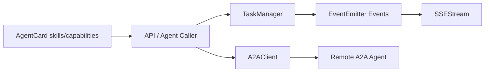
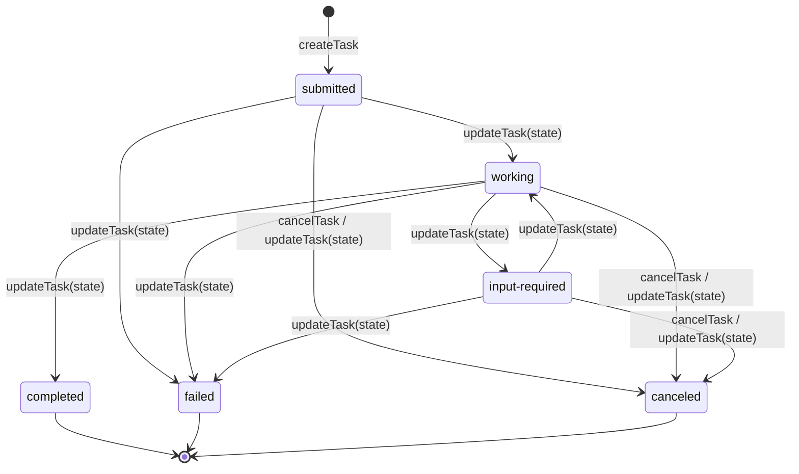
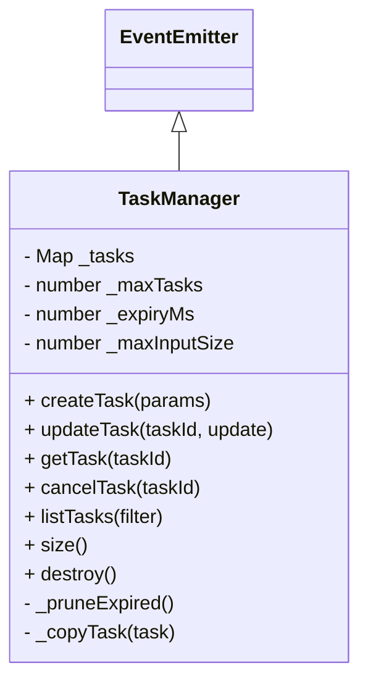
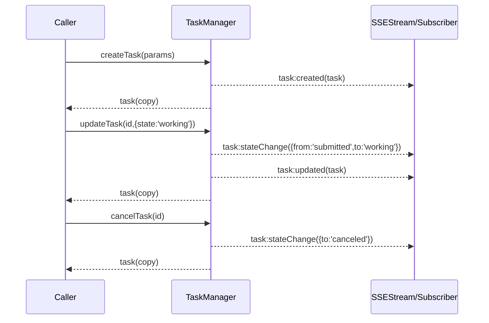

# task_lifecycle_management 模块文档

## 模块简介

`task_lifecycle_management` 是 A2A Protocol 中负责“任务生命周期管理”的基础模块，对应核心实现为 `src.protocols.a2a.task-manager.TaskManager`。它的职责是把 Agent-to-Agent 协作里的任务，从“创建、推进、等待输入、完成/失败/取消”这一整套状态流转抽象成可复用、可观测、可约束的协议原语。模块本身不关心业务语义（例如任务具体如何执行），也不内置鉴权与权限控制；它专注于状态机一致性、事件发射、输入边界控制和内存级任务存储。

从设计上看，这个模块存在的核心原因是：在多智能体环境中，不同执行器和上层服务需要共享一个一致的任务状态模型。如果没有统一状态机，任务可能出现“并发乱序更新”“终态后仍被修改”“超大输入拖垮进程”“历史不可审计”等问题。`TaskManager` 通过显式状态迁移规则、终态保护、更新历史、事件通知和容量限制，给 A2A 上层能力（如 `A2AClient`、`SSEStream`、网关 API）提供稳定的生命周期基座。

---

## 在系统中的位置与边界

`task_lifecycle_management` 位于 **A2A Protocol / task_lifecycle_management** 子模块之下，主要与下列模块协作：

- [A2A Protocol - A2AClient.md](A2A Protocol - A2AClient.md)：远程提交任务、查询状态、取消任务、订阅流式事件。
- [A2A Protocol - SSEStream.md](A2A Protocol - SSEStream.md)：把 `TaskManager` 事件桥接到 SSE 推流给前端或外部消费者。
- [A2A Protocol - AgentCard.md](A2A Protocol - AgentCard.md)：在创建任务前用技能声明（skills）做前置兼容性判断。
- [A2A Protocol.md](A2A Protocol.md)：A2A 总体协议约束与模块总览。

需要强调的是，`TaskManager` 是**进程内内存组件**，不是持久化工作流引擎；当你需要跨进程共享任务、重启恢复、分布式一致性时，应在外层引入数据库、消息系统或编排器。



上图表达了典型关系：调用方通过 `TaskManager` 管理本地任务状态，通过事件机制联动 `SSEStream` 做实时广播；而跨 Agent 通信由 `A2AClient` 负责。`AgentCard` 则常用于任务创建前的“技能匹配”校验。

---

## 核心数据模型与状态机

`TaskManager` 内置了一套最小但严格的任务状态机。允许状态集合为：`submitted`、`working`、`input-required`、`completed`、`failed`、`canceled`。其中 `completed`、`failed`、`canceled` 为终态（terminal states），终态后的任务不可再更新或取消。



这种状态机的价值在于把“合法迁移路径”写死在 `VALID_TRANSITIONS`，使错误更新在协议层被即时拒绝，而不是把不一致留到业务层排查。每次状态变化都会记录到 `history`，形成可追踪轨迹。

任务对象结构（简化）如下：

```javascript
{
  id: "uuid",
  skill: "string",
  state: "submitted|working|input-required|completed|failed|canceled",
  input: object | null,
  output: any,
  artifacts: any[],
  metadata: object,
  history: [{ state: string, timestamp: string }],
  createdAt: "ISO timestamp",
  updatedAt: "ISO timestamp",
  message: "optional"
}
```

---

## 内部架构与关键机制

`TaskManager` 继承自 Node.js `EventEmitter`，内部使用 `Map<string, task>` 存储任务，并通过私有配置控制容量、过期和输入大小。



这里有三个实现细节非常关键。第一，`_pruneExpired()` 只在 `createTask()` 时触发，这意味着“过期清理不是后台定时任务”，而是惰性清理。第二，所有读取/返回都通过 `_copyTask()` 深拷贝（`JSON.parse(JSON.stringify(...))`），防止调用方意外篡改内部状态。第三，`artifacts` 采用 append 语义（`concat`），不会替换旧值，天然保留增量产物轨迹。

---

## API 详解（行为、参数、返回、副作用）

### constructor(opts)

构造函数用于建立任务容器与运行时约束。`opts.maxTasks` 决定最大并发任务数，默认 `1000`；`opts.expiryMs` 决定任务过期窗口，默认 `24h`；`opts.maxInputSize` 限制 `input + metadata` 的序列化总字节数，默认 `1MB`。这些限制直接决定了模块的内存占用上界与防滥用能力。

```javascript
const { TaskManager } = require('./src/protocols/a2a/task-manager');

const tm = new TaskManager({
  maxTasks: 2000,
  expiryMs: 6 * 60 * 60 * 1000,
  maxInputSize: 2 * 1024 * 1024
});
```

副作用方面，构造函数不会启动任何后台线程或定时器，也不会进行 I/O；它只是初始化内存状态。

### createTask(params)

该方法创建任务并立即置为 `submitted`。`params.skill` 是必填字段；缺失时抛出 `Error('Task requires a skill parameter')`。在写入前会序列化 `input` 与 `metadata`，计算两者字节总和，超出 `maxInputSize` 会抛错。随后执行过期任务清理，再检查任务总量是否超过 `maxTasks`，超限同样抛错。

创建成功后会：

1. 生成 `id`（`crypto.randomUUID()`）；
2. 初始化 `history` 首条记录（submitted + timestamp）；
3. 写入 `_tasks`；
4. 触发 `task:created` 事件；
5. 返回深拷贝任务对象。

```javascript
const task = tm.createTask({
  skill: 'summarize',
  input: { text: '...' },
  metadata: { source: 'chat', tenant: 'acme' }
});
```

### updateTask(taskId, update)

`updateTask` 是状态推进与结果写回的主入口。它首先校验任务存在性；不存在抛 `Task not found`。其次校验当前任务是否处于终态，若在终态则拒绝更新。若 `update.state` 提供，则依据 `VALID_TRANSITIONS[currentState]` 校验迁移合法性，不合法抛 `Invalid transition`。

状态更新成功时，会追加 `history`，并触发 `task:stateChange`（包含 `from/to`）。此外，`output` 支持覆盖写入，`artifacts` 仅在传入数组时做追加，`message` 为可选文本字段。最后更新 `updatedAt`，触发 `task:updated`，返回深拷贝。

```javascript
tm.updateTask(task.id, {
  state: 'working',
  message: 'model inference started'
});

tm.updateTask(task.id, {
  state: 'completed',
  output: { summary: 'done' },
  artifacts: [{ type: 'report', uri: 's3://bucket/r1.json' }]
});
```

副作用要点：该方法可能触发两个事件（`task:stateChange` 与 `task:updated`），且对 `artifacts` 是累积写，不是幂等替换。

### getTask(taskId)

读取单个任务，存在则返回深拷贝，不存在返回 `null`。该方法无事件副作用，适合查询路径使用。

```javascript
const found = tm.getTask(task.id);
```

### cancelTask(taskId)

该方法把任务直接推进到 `canceled`。如果任务不存在或已经终态，会抛错。取消成功会更新 `updatedAt`、追加历史、发射 `task:stateChange`。注意：当前实现**不会**发射 `task:updated`，这意味着如果你的订阅逻辑只监听 `task:updated`，将遗漏取消事件。

```javascript
tm.cancelTask(task.id);
```

### listTasks(filter)

遍历全部任务并可按 `state`、`skill` 过滤，返回匹配任务深拷贝数组。方法本身不做排序，结果顺序与 `Map` 插入顺序相关。

```javascript
const working = tm.listTasks({ state: 'working' });
const bySkill = tm.listTasks({ skill: 'summarize' });
```

### size() 与 destroy()

`size()` 返回当前 `Map` 大小。`destroy()` 清空所有任务并移除全部事件监听器，常用于测试 teardown 或进程退出前清理。`destroy()` 是破坏性操作，调用后对象虽可继续使用（可重新注册监听并创建任务），但旧状态和监听全部丢失。

---

## 事件模型与交互流程

`TaskManager` 的可观测性完全基于 EventEmitter 事件。核心事件有三类：

- `task:created`：任务创建后触发，payload 为任务对象。
- `task:stateChange`：状态变更触发，payload 为 `{ taskId, from, to }`。
- `task:updated`：`updateTask` 执行后触发，payload 为任务对象。



一个常见集成模式是把这些事件转发到 SSE：

```javascript
const stream = new SSEStream();

tm.on('task:stateChange', ({ taskId, from, to }) => {
  stream.sendStateChange(taskId, from, to);
});

tm.on('task:updated', (task) => {
  stream.sendProgress(task.id, task.message || 'updated');
});
```

---

## 配置建议与运行策略

在生产环境中，`maxTasks`、`expiryMs`、`maxInputSize` 不应直接使用默认值，而应结合流量模型和进程内存预算设定。例如，对短任务高吞吐场景可以适度增大 `maxTasks` 并缩短 `expiryMs`；对高风险公网入口应降低 `maxInputSize` 防止超大 JSON 压力。

```javascript
const tm = new TaskManager({
  maxTasks: Number(process.env.A2A_MAX_TASKS || 500),
  expiryMs: Number(process.env.A2A_TASK_EXPIRY_MS || 2 * 60 * 60 * 1000),
  maxInputSize: Number(process.env.A2A_MAX_INPUT_SIZE || 512 * 1024)
});
```

如果系统已经有统一状态管理总线，可参考 [State Management.md](State Management.md) 与 [API Server & Services.md](API Server & Services.md) 的事件分发与通知设计，把 `TaskManager` 事件桥接到更上层。

---

## 错误条件、边界行为与已知限制

这个模块的主要错误都以同步 `throw Error` 暴露，因此调用方应在 API 层统一捕获并映射为协议响应码。最常见错误包括：缺失 `skill`、任务不存在、终态更新、非法状态迁移、任务数超限、输入超限。

需要重点注意以下边界行为：

1. 过期清理仅在 `createTask()` 触发。若系统长期只查询/更新不创建，过期任务不会自动移除。
2. 过期判定基于 `createdAt`，而非 `updatedAt`。也就是说，一个持续活跃但创建时间很久的任务，在下一次创建任务时可能被清理。
3. `updateTask` 不校验 `update` 必填性，传入空对象会被视为合法“无状态更新”（仍会触发 `task:updated` 并刷新 `updatedAt`）。
4. `_copyTask` 使用 JSON 深拷贝，`Date`、`Map`、`Set`、`BigInt`、函数等非 JSON 类型会丢失或失败；调用方应保持任务字段 JSON 友好。
5. `cancelTask` 不发 `task:updated`，事件消费方需监听 `task:stateChange` 才能完整捕获取消动作。
6. 并发场景下没有锁或 CAS 机制，若你在多线程/多进程共享调用，需要外层协调避免竞态。

限制方面，本模块不提供持久化、重放恢复、分布式一致性、租户隔离和鉴权，这些能力需由上层基础设施补齐。可结合 [Dashboard Backend.md](Dashboard Backend.md) 中的领域模型与 API 约束，或在集成层引入数据库与审计日志（参见 [Audit.md](Audit.md)）。

---

## 扩展与二次开发建议

扩展时建议遵循“协议核心保持小而稳”的原则，把业务策略放到外围。实践中较常见的扩展方式是：在外层包装 `TaskManager`，对 `createTask/updateTask/cancelTask` 加入鉴权、幂等键、审计埋点与持久化回写，而不要直接修改状态机常量，避免与 A2A 协议期望产生偏差。

```javascript
class PersistentTaskService {
  constructor({ taskManager, repo, audit }) {
    this.tm = taskManager;
    this.repo = repo;
    this.audit = audit;

    this.tm.on('task:created', (t) => this.repo.save(t));
    this.tm.on('task:updated', (t) => this.repo.save(t));
    this.tm.on('task:stateChange', (e) => this.audit.log('task_state_change', e));
  }

  create(ctx, params) {
    // authz / validation / idempotency here
    return this.tm.createTask(params);
  }
}
```

如果你需要跨节点共享任务，建议把 `TaskManager` 视为“本地状态机组件”，将真实状态存入外部存储并借助消息总线分发事件；本地实例仅用于执行迁移校验与事件语义标准化。

---

## 最小可运行示例

```javascript
const { TaskManager } = require('./src/protocols/a2a/task-manager');

const tm = new TaskManager({ maxTasks: 100, expiryMs: 3600_000, maxInputSize: 256 * 1024 });

tm.on('task:created', (t) => console.log('created', t.id));
tm.on('task:stateChange', (e) => console.log('state', e));
tm.on('task:updated', (t) => console.log('updated', t.id, t.state));

const t = tm.createTask({ skill: 'translate', input: { text: 'hello' } });
tm.updateTask(t.id, { state: 'working', message: 'started' });
tm.updateTask(t.id, { state: 'completed', output: { text: '你好' } });

console.log(tm.getTask(t.id));
```

这个示例展示了该模块最核心的使用路径：创建任务、推进状态、写入输出、订阅事件。在真实工程中，你应把它挂到 HTTP/SSE/A2A transport 层，并补齐鉴权、限流和持久化。
