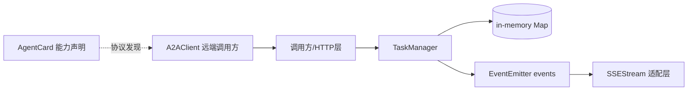

# task_lifecycle_orchestration（A2A `TaskManager`）深度技术解析

`task_lifecycle_orchestration` 这个模块的作用，可以把它想成一个“任务交通管制塔台”：它不负责执行任务本身，也不负责鉴权，而是专门负责**任务从提交到结束这一整段生命周期的秩序**。在 A2A 场景里，多个调用方可能并发提交任务、轮询状态、取消任务、订阅事件；如果没有一个严格、可验证的生命周期管理器，系统很快就会出现“状态乱跳、任务泄漏、最终态被篡改、内存失控”等问题。`TaskManager` 的设计重点不是炫技，而是把这些常见失控点收敛成可预期的状态机与事件协议。

## 架构角色与数据流



在当前代码里，`TaskManager` 是一个**内存态编排器（in-memory orchestrator）**。它维护一个 `Map` 作为任务存储，暴露 `createTask / updateTask / getTask / cancelTask / listTasks` 等生命周期操作，并通过 `EventEmitter` 广播关键变化（`task:created`、`task:stateChange`、`task:updated`）。

从依赖关系看，它位于 A2A 协议栈的“中间层”：上游通常是 transport/route 层（代码中未直接给出具体路由实现），下游不是“执行器”，而是**状态与事件语义本身**。也就是说，它不调度 worker，不做重试，不做分布式一致性；它定义的是任务状态如何合法演化，以及调用方能收到什么信号。

如果按典型请求路径理解，数据流通常是：

1. 调用方提交任务参数到上层接口。
2. 上层调用 `TaskManager.createTask(params)`。
3. `TaskManager` 校验输入大小、容量上限、初始化任务对象并写入 `Map`。
4. 模块发出 `task:created` 事件，供外部桥接到流式通道（例如 [streaming_event_channel](streaming_event_channel.md)）。
5. 执行侧（或编排侧）推进任务时调用 `updateTask`，状态机校验转移合法性，并继续发出 `task:stateChange`/`task:updated`。
6. 查询侧通过 `getTask` / `listTasks` 获取**深拷贝后的快照**，避免外部直接改写内部状态。

> 注意：`TaskManager` 代码中并未直接调用 `SSEStream` 或 `A2AClient`。它们是协议层的相邻模块，靠上层组装在一起，而不是在类内部硬编码耦合。

## 心智模型：把它当作“有限状态机 + 事件日志机”

理解这个模块最有效的方式，不是把它看成 CRUD，而是看成两个并行系统：

- **有限状态机（FSM）**：任务只能按 `VALID_TRANSITIONS` 走，不能随意跳转；终态不可修改。
- **事件日志机**：每次关键变化都发事件并写 `history`，让外部系统可以订阅和追踪。

这和工单系统很像：你可以从“新建”到“处理中”，再到“待补充信息”，但不能直接从“新建”跳到一个不被允许的中间状态。规则越清晰，上下游协作越少歧义。

## 组件深潜：`src.protocols.a2a.task-manager.TaskManager`

### 常量设计：把约束前置成协议边界

模块定义了以下常量：

- `VALID_STATES = ['submitted', 'working', 'input-required', 'completed', 'failed', 'canceled']`
- `TERMINAL_STATES = ['completed', 'failed', 'canceled']`
- `VALID_TRANSITIONS`：仅声明非终态到下一步的合法边。
- `MAX_TASKS = 1000`
- `DEFAULT_EXPIRY_MS = 24h`

设计意图很直接：把“什么是合法生命周期”变成静态、可审计的规则，而不是散落在 if/else 中。新贡献者改状态机时，应该优先改这些常量，再看方法逻辑是否需要同步调整。

### `constructor(opts)`：容量、时效、输入体积三道闸

构造函数接收：

- `opts.maxTasks`
- `opts.expiryMs`
- `opts.maxInputSize`（默认 1MB，按 `input + metadata` 的 JSON 字节数）

这三个配置体现的是“内存编排器”的生存边界：

- `maxTasks` 控并发容量，避免无限增长。
- `expiryMs` 控任务留存时长，避免长期占用。
- `maxInputSize` 控单任务爆炸输入，避免被超大 payload 拖垮。

### `createTask(params)`：创建不是写一条记录，而是建立协议初态

关键步骤：

1. 强制 `params.skill` 存在，否则抛错。
2. `JSON.stringify` 后用 `Buffer.byteLength` 计算 `input + metadata` 真实字节数并限制。
3. 调用 `_pruneExpired()` 先清过期任务，再判断是否达到 `maxTasks`。
4. 构造统一任务结构：`id/skill/state/input/output/artifacts/metadata/history/createdAt/updatedAt`。
5. 写入 `_tasks`，发出 `task:created`，返回 `_copyTask(task)`。

一个非显然但关键的设计是：**先 prune 再判满**。这避免“其实已经有可回收任务，但仍然拒绝新任务”的假性容量不足。

### `updateTask(taskId, update)`：状态机守门员

这是生命周期最核心的方法。它的行为不是“盲更新”，而是带协议约束的 patch：

- 找不到任务直接失败。
- 当前已在 `TERMINAL_STATES` 则拒绝更新。
- 若 `update.state` 存在，必须满足 `VALID_TRANSITIONS[current]`。
- 状态变化会写 `history` 并发 `task:stateChange`。
- `output` 可覆盖更新（包括 `undefined` 判定逻辑）。
- `artifacts` 采用 append（concat）而不是覆盖。
- `message` 存在则写入。
- 最后刷新 `updatedAt`，发 `task:updated`，返回深拷贝。

这里体现了一个取舍：它允许在一次调用中同时改状态和产出，提升易用性；代价是调用方需要自律维护更新语义（例如避免并发覆盖 `output`）。

### `getTask(taskId)` / `listTasks(filter)`：读路径的防御性复制

两者都返回 `_copyTask` 深拷贝结果，避免调用方拿到内部对象引用后“越权修改”内存态。这是典型的封装完整性策略，尤其适合 Node.js 里对象引用容易被误改的场景。

`listTasks` 支持按 `state`、`skill` 过滤，逻辑是线性扫描 `Map`。在当前 `maxTasks` 默认为 1000 的边界下，这个复杂度通常可接受。

### `cancelTask(taskId)`：终止路径的最小特化

取消逻辑与 `updateTask` 部分重叠，但单独暴露成语义化 API，便于上层把“取消”映射为独立 endpoint（例如 `/tasks/:id/cancel`，可参见 [remote_invocation_client](remote_invocation_client.md) 里的客户端调用模型）。

方法会：

- 拒绝不存在任务。
- 拒绝终态任务重复取消。
- 状态置为 `canceled`，写 `history`，更新 `updatedAt`，发 `task:stateChange`。

### `destroy()` / `_pruneExpired()` / `_copyTask()`：生命周期收尾与内部卫生

`destroy()` 会清空任务并 `removeAllListeners()`。这对测试、热重载或进程退出阶段很重要，避免监听器泄漏。

`_pruneExpired()` 目前仅在 `createTask()` 前触发，按 `createdAt` 判断过期。它不是后台定时 GC，而是“创建时顺带清理”的惰性策略。

`_copyTask()` 使用 `JSON.parse(JSON.stringify(task))`。优点是简单稳定；缺点是只适用于 JSON 可序列化字段（当前任务结构正好满足）。

## 依赖与契约分析

`TaskManager` 的外部依赖非常克制：`crypto`、`events`，没有引入数据库、队列或 RPC 客户端。这表明它被刻意保持为**协议核心原语**，方便嵌入不同部署形态。

从模块关系看：

- 与 [remote_invocation_client](remote_invocation_client.md)（`A2AClient`）形成请求-响应语义闭环：客户端有 `submitTask/getTaskStatus/cancelTask/streamTask`，而 `TaskManager` 提供这些操作在服务端落地所需的状态语义。
- 与 [streaming_event_channel](streaming_event_channel.md)（`SSEStream`）形成事件闭环：`TaskManager` 发内部事件，上层可桥接为 SSE `state/progress/artifact` 事件。
- 与 [agent_identity_and_discovery](agent_identity_and_discovery.md)（`AgentCard`）形成能力宣告闭环：`AgentCard` 声明 `stateTransitionHistory`、`streaming` 能力，`TaskManager` 提供对应生命周期基础。

隐式契约（非常重要）包括：

- 上层必须处理认证授权（源码注释已明确 this module 不含 auth）。
- 上层如果要实现可靠流式通知，需要订阅 `task:*` 事件并做断线/重放策略；`TaskManager` 本身不保证消息投递。
- 调用方不得依赖内部引用可变性，因为返回值是深拷贝快照。

## 设计决策与权衡

### 1) 内存存储 vs 持久化存储

当前选择：`Map` 内存存储。

好处是低延迟、零外部依赖、实现简洁，适合作为 A2A 协议参考实现或单进程运行时。代价是进程重启丢失、无法天然多副本共享、容量受单进程内存约束。

### 2) 显式状态机 vs 自由状态字符串

当前选择：显式 `VALID_TRANSITIONS`。

好处是正确性高、行为可预测；代价是灵活性下降（新增状态需要改常量与相关消费方）。对于协议层，这是合理取舍：**先保证互操作一致性，再谈可配置扩展**。

### 3) 惰性过期清理 vs 定时后台清理

当前选择：创建时触发 `_pruneExpired()`。

好处是实现简单，不引入定时器生命周期管理；代价是若长时间没有新建任务，过期项不会主动清除。若系统以查询为主、创建很少，内存回收节奏可能不理想。

### 4) 事件驱动解耦 vs 直接绑定传输层

当前选择：`EventEmitter` 发通用事件，不直接依赖 SSE/HTTP。

好处是模块边界清晰，可替换传输层；代价是需要上层做事件桥接与错误处理，集成复杂度转移给调用者。

## 使用方式与示例

```javascript
const { TaskManager } = require('./src/protocols/a2a/task-manager');

const tm = new TaskManager({
  maxTasks: 500,
  expiryMs: 6 * 60 * 60 * 1000,
  maxInputSize: 512 * 1024,
});

tm.on('task:created', (task) => {
  console.log('created', task.id, task.state);
});

tm.on('task:stateChange', (evt) => {
  console.log('state change', evt.taskId, evt.from, '=>', evt.to);
});

const task = tm.createTask({
  skill: 'summarize',
  input: { text: '...' },
  metadata: { traceId: 'abc-123' },
});

tm.updateTask(task.id, { state: 'working', message: 'started' });
tm.updateTask(task.id, { artifacts: [{ type: 'log', value: 'phase-1 done' }] });
tm.updateTask(task.id, { state: 'completed', output: { summary: 'done' } });

console.log(tm.getTask(task.id));
```

如果你要把它接入 SSE，典型做法是监听 `task:stateChange` / `task:updated`，再调用 `SSEStream.sendStateChange()` 或 `sendEvent()`（详见 [streaming_event_channel](streaming_event_channel.md)）。

## 新贡献者最该注意的坑

第一，`cancelTask()` 当前只发 `task:stateChange`，不会额外发 `task:updated`。如果你的订阅侧只监听 `task:updated`，会漏掉取消事件。要么统一监听两类事件，要么在演进时评估是否补发一致性事件。

第二，`_pruneExpired()` 用 `createdAt` 而不是 `updatedAt` 判断过期，这意味着“长期运行但仍活跃更新”的任务在超过寿命后仍可能被清理策略针对（具体触发取决于后续创建操作）。如果你的业务语义是“活跃任务不该过期”，这需要改策略。

第三，`updateTask` 对 `artifacts` 只接受数组并 append；传入非数组会被静默忽略（不会抛错）。这对鲁棒性是宽松的，但也可能掩盖调用方 bug。

第四，深拷贝方式依赖 JSON 序列化，未来如果任务对象引入 `Date` 实例、`Buffer`、函数或循环引用，会丢失语义或直接失败。当前结构安全，但扩展字段时要警惕。

第五，模块注释明确鉴权由集成方负责。不要把 `TaskManager` 直接暴露到公网接口而不加认证、授权、配额和审计。

## 与其他文档的关联

- A2A 客户端调用模型见：[remote_invocation_client](remote_invocation_client.md)
- A2A 流式事件通道见：[streaming_event_channel](streaming_event_channel.md)
- A2A agent 能力发现见：[agent_identity_and_discovery](agent_identity_and_discovery.md)
- A2A 协议总览见：[A2A Protocol](A2A Protocol.md)

如果你接下来要做“生产级任务生命周期”，优先考虑在此模块外层补齐三件事：持久化存储、鉴权与租户隔离、事件可靠投递（重放/幂等）。`TaskManager` 本身已经把最核心的生命周期语义钉住了。