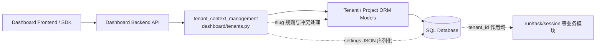
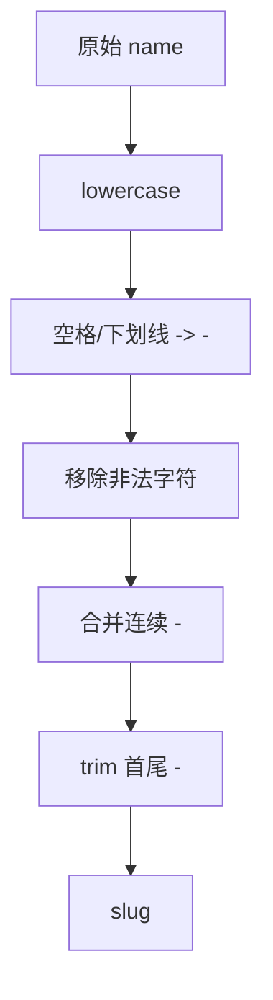
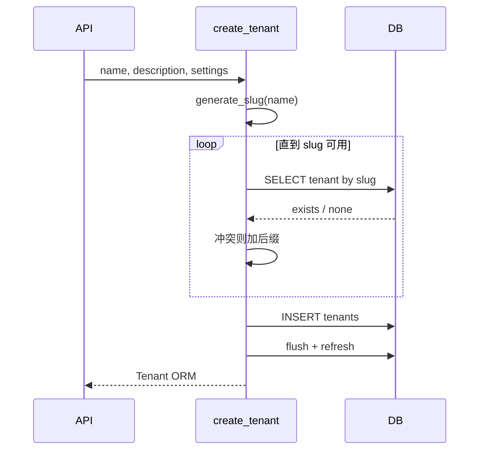
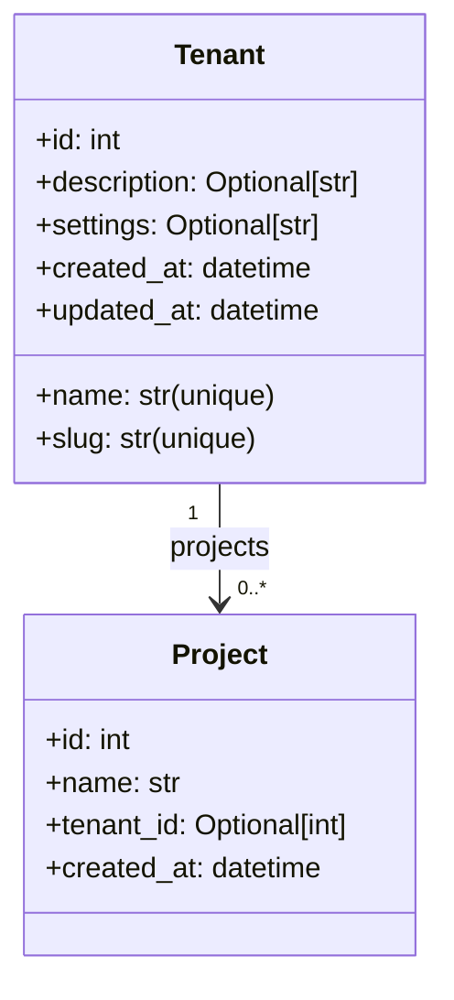
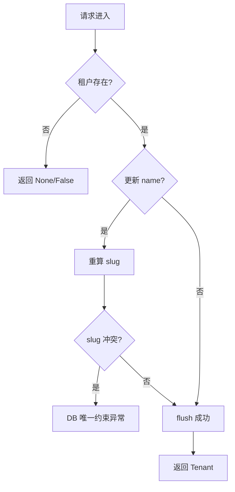

# tenant_context_management 模块文档

## 模块简介与设计动机

`tenant_context_management` 是 Dashboard Backend 中负责“租户上下文定义与租户实体生命周期管理”的基础模块，代码位于 `dashboard/tenants.py`。这个模块的核心价值并不只是提供几个 CRUD 函数，而是将“多租户隔离”这件事从数据库细节中抽象出来，形成一组可复用、可审计、可扩展的服务能力。

在 Loki Mode 的系统设计里，`Project` 支持 `tenant_id=None`，意味着平台兼容历史单租户数据，也允许新数据逐步迁移到多租户模型。`tenant_context_management` 因此承担两个关键目标：第一，提供稳定的租户建模输入契约（`TenantCreate`、`TenantUpdate`）；第二，在服务层落地 slug 生成、settings 序列化、租户查询与级联删除等行为，确保 API 层、SDK 层、前端层不需要重复实现这些规则。

从系统边界上看，该模块是 **领域模型 (`dashboard.models`) 与 API 传输层 (`dashboard.server` / `dashboard.tenants` 路由) 之间的业务桥接层**。它不直接处理认证授权、不直接处理审计记录，也不负责前端租户切换 UI，但它提供了所有这些上层能力所依赖的数据一致性基础。

---

## 在整体系统中的位置



这个结构说明了一个重要事实：`tenant_context_management` 虽然文件体量不大，但属于“横切基础设施”。租户的创建、更新、删除行为会直接影响 `Project` 乃至项目下游 `Task`、`Session`、`Run` 的可见范围和生命周期。

若需要完整理解上下游，可结合阅读：
- [domain_models_and_persistence.md](domain_models_and_persistence.md)
- [api_surface_and_transport.md](api_surface_and_transport.md)
- [run_and_tenant_services.md](run_and_tenant_services.md)

---

## 核心数据契约（Pydantic Schemas）

### `TenantCreate`

`TenantCreate` 是“创建租户”请求的输入模型，定义了租户创建阶段可被外部提交的字段与合法性边界。`name` 是必填字段，长度被限制在 `1..255`；`description` 与 `settings` 可选。`settings` 在输入阶段是 `dict`，服务层会将其转为 JSON 字符串持久化。

```python
class TenantCreate(BaseModel):
    name: str = Field(..., min_length=1, max_length=255)
    description: Optional[str] = None
    settings: Optional[dict] = None
```

这里的设计 rationale 很明确：让 API 在进入数据库前完成第一层结构化校验，避免把“空名称”“超长名称”这类错误拖到数据库约束阶段才暴露。

### `TenantUpdate`

`TenantUpdate` 是“局部更新”模型，所有字段都是可选，符合 PATCH 语义。调用方仅传递需要变更的字段即可。

```python
class TenantUpdate(BaseModel):
    name: Optional[str] = Field(None, min_length=1, max_length=255)
    description: Optional[str] = None
    settings: Optional[dict] = None
```

需要注意一个行为细节：服务层逻辑是“仅应用非 `None` 参数”。因此如果你希望“清空 description/settings”，当前实现无法通过传 `null` 完成，这会被视为“不更新该字段”。这属于常见但容易忽略的 API 语义限制。

### `TenantResponse`（辅助输出模型）

虽然不在当前模块树“核心组件”列表中，但 `dashboard/tenants.py` 内还定义了 `TenantResponse`，用于把 ORM 对象转为 API 可返回结构，并在此阶段执行 settings 的反序列化。它通过 `model_config = {"from_attributes": True}` 支持从 SQLAlchemy 实体直接映射。

---

## 内部实现与关键函数详解

## 1) Slug 生成：`generate_slug(name: str) -> str`

租户 slug 是租户的人类可读 URL 标识符。该函数按固定规则清洗名称：

1. 转小写；
2. 空格与下划线替换为 `-`；
3. 删除非 `[a-z0-9-]` 字符；
4. 连续 `-` 折叠；
5. 去除首尾 `-`。



这个规则让 slug 具备可预测性，但也带来约束：非 ASCII 字符会被移除，某些国际化名称可能退化为空或极短 slug，需要 API 层附加校验策略（例如禁止空 slug）。

## 2) Settings 序列化辅助：`_serialize_settings` / `_deserialize_settings`

`Tenant.settings` 在数据库中是 `Text` 字段，模块通过两个辅助函数在 `dict <-> JSON string` 间转换。

- `_serialize_settings(None)` 返回 `None`；
- `_serialize_settings(dict)` 调用 `json.dumps`；
- `_deserialize_settings(None)` 返回 `None`；
- `_deserialize_settings` 在 JSON 解析失败时返回 `None`（静默容错）。

这种“解析失败不抛错”的策略提升了读取鲁棒性，但会隐藏脏数据，建议结合日志或审计模块做观测。

## 3) ORM 转响应：`_tenant_to_response(tenant)`

该函数把 ORM `Tenant` 组装成 `TenantResponse`，同时反序列化 settings。它是典型的 anti-corruption layer，避免 API 直接暴露底层存储格式。

## 4) 创建租户：`create_tenant(...)`

创建流程是本模块最关键的过程：先生成基础 slug，再循环检查是否冲突；若冲突则追加数字后缀 `-2/-3/...` 直到可用，然后创建并 `flush + refresh` 返回。



此逻辑可以处理大多数正常并发下的冲突，但在高并发极端情况下，两个事务仍可能在检查后同时写入同一 slug，最终由数据库唯一索引兜底抛错。换言之，应用层冲突检查是“优化路径”，不是并发安全的唯一保障。

## 5) 查询接口：`get_tenant` / `get_tenant_by_slug` / `list_tenants`

这些函数都是纯读取：按 `id` 查、按 `slug` 查、按 `name` 排序列全量。`list_tenants` 当前无分页参数，适合中小规模租户列表；若用于公网大规模 SaaS，建议在 API 层做分页封装。

## 6) 更新租户：`update_tenant(...)`

更新逻辑先查目标租户，不存在直接返回 `None`。若 `name` 变化，会同步重算 slug；`description` 与 `settings` 仅在传入非 `None` 时覆盖；最后 `flush + refresh`。

这里有一个高价值注意点：**更新路径没有像创建路径那样做 slug 冲突探测**。因此改名可能触发数据库唯一约束错误，需要 API 层捕获并转成明确的业务错误码（例如 409 Conflict）。

## 7) 删除租户：`delete_tenant(...)`

删除先查存在性，不存在返回 `False`。存在时执行 `db.delete` 并 `flush`，返回 `True`。由于 `Tenant.projects` 关系配置了 `cascade="all, delete-orphan"`，且 `Project.tenant_id` 外键定义 `ondelete="CASCADE"`，删除租户会级联删除其项目。

这意味着删除操作不是“仅删除一个租户壳”，而是高破坏性操作。生产环境建议始终配合审计日志与二次确认流程。

## 8) 作用域查询：`get_tenant_projects(db, tenant_id)`

按 `tenant_id` 过滤并按 `Project.created_at` 升序返回项目列表，是租户详情、迁移评估、配额统计等场景的基础接口。

---

## 与领域模型的关系



`Tenant` 与 `Project` 的关系是此模块设计的基础：租户是命名空间边界，项目是核心业务载体。通过 `tenant_id` 可空设计，系统保留了“无租户项目”兼容能力，这让老系统迁移可渐进进行，而不是一次性重构。

---

## 典型使用方式（服务层与 API 层）

服务层调用示例：

```python
payload = TenantCreate(
    name="Acme Corp",
    description="Enterprise tenant",
    settings={"region": "us-east-1", "quota": {"projects": 20}},
)

tenant = await create_tenant(
    db,
    name=payload.name,
    description=payload.description,
    settings=payload.settings,
)
```

更新示例（局部变更）：

```python
patch = TenantUpdate(name="Acme Global")
updated = await update_tenant(db, tenant_id=42, name=patch.name)
if updated is None:
    # 404 Not Found
    ...
```

删除示例：

```python
deleted = await delete_tenant(db, tenant_id=42)
if not deleted:
    # 404 Not Found
    ...
```

在 API 端，推荐做三层处理：请求校验（Pydantic）→ 服务调用（本模块）→ 异常翻译（唯一约束/外键错误到 HTTP 语义）。

---

## 配置与行为注意事项

这个模块本身没有独立配置文件，但运行行为受数据库与事务管理策略影响很大。

首先，所有写操作都只做 `flush`，不做 `commit`。这允许上层把多个服务调用放进同一事务，但也要求调用方显式控制提交与回滚。其次，唯一性约束依赖数据库层（`Tenant.name`、`Tenant.slug` unique），应用层逻辑只能减少冲突概率，不能替代约束。最后，`settings` 以文本存储，若需要按键查询或策略过滤，后续可考虑迁移为原生 JSON 类型字段。

---

## 边界条件、错误场景与已知限制



需要重点关注以下问题：

- slug 生成可能得到空字符串（例如名称全是符号或非 ASCII 字符），当前代码未显式拦截；
- `update_tenant` 不做 slug 去重预检查，冲突靠 DB 抛错；
- `TenantUpdate` 无法通过 `None` 清空字段；
- `list_tenants` 无分页，不适合超大租户规模直出；
- `_deserialize_settings` 解析失败时静默返回 `None`，可能掩盖数据质量问题；
- 删除租户会级联删除项目，是不可逆高风险操作。

---

## 扩展建议

如果你要扩展 `tenant_context_management`，建议优先考虑以下方向：

1. 在 `update_tenant` 中补齐 slug 冲突检测逻辑，与 `create_tenant` 行为对齐；
2. 新增可选参数支持“显式清空字段”（例如使用哨兵值而不是 `None`）；
3. 为 `list_tenants` 增加分页和按更新时间排序能力；
4. 将 settings 迁移为 JSON 列并增加 schema 校验（例如 region、quota 的结构约束）；
5. 为 slug 生成增加国际化 transliteration 策略，减少空 slug 风险。

---

## 测试建议

建议最少覆盖以下测试路径：

- `TenantCreate` / `TenantUpdate` 的长度与空值校验；
- `generate_slug` 的常规、特殊字符、连续分隔符、前后空白场景；
- `create_tenant` 的 slug 冲突递增逻辑；
- `update_tenant` 改名时的唯一约束冲突异常；
- `_serialize_settings` / `_deserialize_settings` 的非法 JSON 容错；
- `delete_tenant` 的级联删除行为验证；
- `get_tenant_projects` 的过滤和排序正确性。

---

## 参考文档

- [domain_models_and_persistence.md](domain_models_and_persistence.md)
- [api_surface_and_transport.md](api_surface_and_transport.md)
- [run_and_tenant_services.md](run_and_tenant_services.md)
- [Dashboard Backend.md](Dashboard%20Backend.md)

如需继续深入“租户上下文如何传递到前端交互层”，可另行阅读租户切换 UI 文档 [loki-tenant-switcher.md](loki-tenant-switcher.md)（该文档属于前端组件范畴，与本模块职责不同）。
