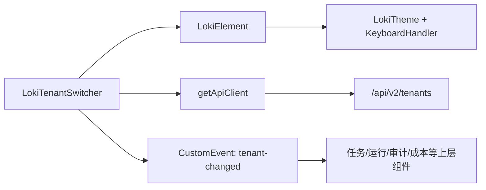
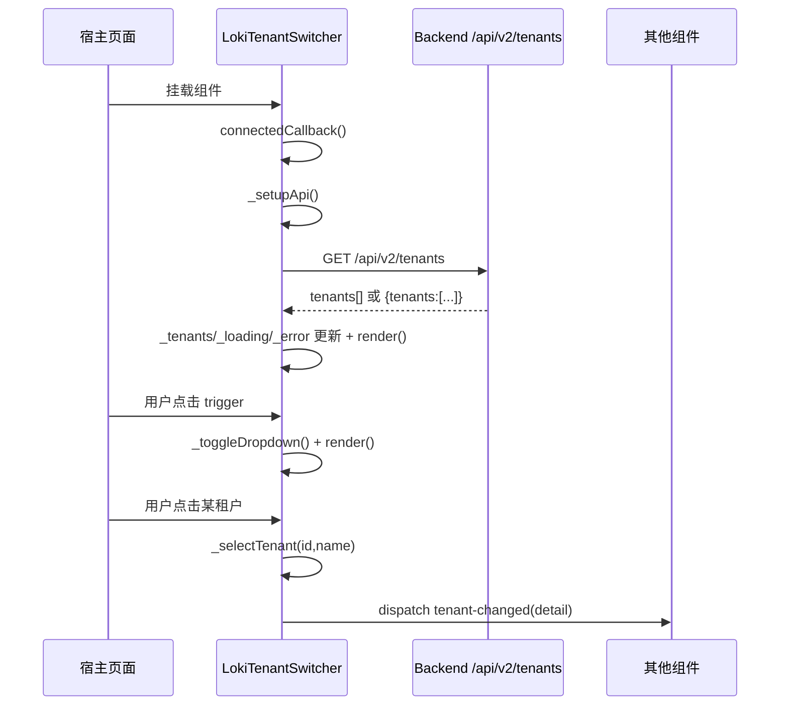
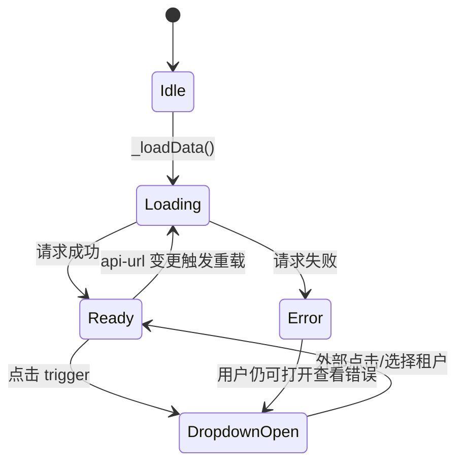

# tenant_context_switching 模块文档

## 模块定位与设计目标

`tenant_context_switching` 模块是 Dashboard UI 在多租户场景中的“上下文入口”，核心实现为 Web Component：`<loki-tenant-switcher>`（`dashboard-ui.components.loki-tenant-switcher.LokiTenantSwitcher`）。它的职责不是做权限判断或租户生命周期管理，而是在前端界面层提供一个稳定、可复用、事件驱动的租户上下文切换器，让用户可以在“全部租户视图”和“指定租户视图”之间快速切换。

从系统设计上看，这个模块存在的原因是：在多租户产品里，绝大多数页面（任务面板、运行态看板、审计查询、成本与质量视图）都需要一个“当前租户上下文”。如果每个业务组件都自行维护租户列表拉取、选中态管理和切换通知，会产生重复逻辑和状态不一致。`LokiTenantSwitcher` 通过统一的组件状态模型 + 统一的 `tenant-changed` 事件，将“租户上下文切换”从业务组件里剥离出来，形成可组合基础能力。

该模块处于 **Administration and Infrastructure Components** 下的 `tenant_context_switching` 子域，在职责上连接了三个方向：一是通过 Dashboard Backend 的租户 API 获取可选租户；二是通过主题基类 `LokiElement` 复用 UI 主题和基础行为；三是向其他 UI 组件广播租户变更事件，触发页面级过滤或重载。

---

## 组件与依赖关系

### 核心组件

本模块只有一个业务核心组件和一个辅助函数：

- `LokiTenantSwitcher`：租户切换下拉组件，负责拉取、渲染、选择与事件派发。
- `formatTenantLabel(tenant)`：用于把租户对象转成触发器按钮中的可读标签。

### 架构关系图



`LokiTenantSwitcher` 继承 `LokiElement`，因此天然拥有主题应用能力与组件基础生命周期行为；它通过 `getApiClient` 请求 `/api/v2/tenants`，得到租户集合后进行渲染。当用户选择不同租户时，它不直接修改全局 store，而是发出 `tenant-changed` 事件，使宿主应用可按自己的状态管理策略（本地 state、全局 store、URL 查询参数、路由状态）完成后续动作。

### 与系统其他模块的边界

该模块专注“UI 选择器与上下文事件”，并与其他模块形成明确边界：

- 后端租户实体创建/更新逻辑见 [tenant_context_management.md](tenant_context_management.md)。
- 后端 API 入口与请求约束见 [api_surface_and_transport.md](api_surface_and_transport.md)。
- UI 主题与基类行为见 [Core Theme.md](Core%20Theme.md)。
- Administration 大盘层级关系见 [Administration and Infrastructure Components.md](Administration%20and%20Infrastructure%20Components.md)。

---

## 运行流程与状态流转

### 生命周期与交互时序



整个流程体现了“拉取与展示分离、选择与消费分离”。模块在内部只维护展示态和选中态，不耦合消费方的业务决策。

### 内部状态机



该状态机的关键在于：`_selectedTenantId === null` 被定义为“全部租户”，因此 Ready 态天然支持“无过滤视图”；另外，错误态并不阻止组件交互，但下拉内容会显示错误文本。

---

## 核心实现详解

## `formatTenantLabel(tenant)`

`formatTenantLabel` 用于生成触发按钮文案。其策略是优先输出 `name (slug)`，其次退化为 `name` 或 `slug`，全部缺失时返回 `Unknown`。这个函数的价值在于把“可读标签规则”集中在一个地方，避免模板字符串散落在渲染逻辑中。

**签名：**

```javascript
formatTenantLabel(tenant: Object | null | undefined): string
```

**输入与返回：**

- 输入参数 `tenant` 期望是包含 `name`、`slug` 的对象，但函数容忍空值和字段缺失。
- 返回值是可直接渲染到 UI 的纯文本标签。

**副作用：** 无。

---

## `LokiTenantSwitcher` 类

### 继承与可观察属性

`LokiTenantSwitcher` 继承 `LokiElement`，并声明 `observedAttributes = ['api-url', 'theme']`。这意味着组件支持通过 HTML attribute 在运行时改变后端地址与主题，且变更能即时反映到组件行为和样式。

### 内部状态字段

组件使用以下私有状态组织逻辑：

- `_loading`: 是否正在请求租户数据。
- `_error`: 请求失败时保存错误文本。
- `_api`: 由 `getApiClient` 返回的客户端实例。
- `_tenants`: 当前租户列表缓存。
- `_selectedTenantId`: 当前选中租户；`null` 表示 All Tenants。
- `_dropdownOpen`: 下拉面板展开状态。

这些字段没有暴露为公开 API，因此当前实现默认“受用户交互驱动”，不是“外部受控组件”。

### `connectedCallback()`

组件挂载时执行三件事：调用父类生命周期、初始化 API 客户端并加载数据、注册 document 级别的点击监听用于“点击外部关闭下拉”。document 监听是常见的弹层交互实现，但需要配合卸载清理避免泄漏。

### `disconnectedCallback()`

组件卸载时会移除外部点击监听，同时调用父类卸载逻辑（父类会移除主题监听与键盘处理绑定）。这一点保证了组件多次挂载/卸载时不会累积监听器。

### `attributeChangedCallback(name, oldValue, newValue)`

当 `api-url` 变化且 `_api` 已初始化时，组件会更新 `baseUrl` 并重新拉取租户；当 `theme` 变化时，调用 `_applyTheme()` 立即刷新主题变量。这个设计允许宿主应用在不重建组件的前提下切换环境与主题。

### `_setupApi()`

该方法读取 `api-url` attribute；若未设置，则回退到 `window.location.origin`。随后通过 `getApiClient({ baseUrl })` 构造客户端。回退策略让组件在同源部署时零配置可用。

### `async _loadData()`

这是数据加载核心。方法会先置 `_loading=true`，再请求 `GET /api/v2/tenants`。返回数据兼容两种结构：直接数组，或对象包裹的 `data.tenants`。异常时把错误消息保存到 `_error`，最后统一 `render()`。

该方法的重要行为是“无论成功失败都渲染”，因此 UI 总能进入可见状态（加载提示、错误提示或列表），不会因异常卡死在旧 DOM。

### `_toggleDropdown()`

纯状态翻转方法，切换 `_dropdownOpen` 后立即渲染。它不包含权限或数据判断，因此即便当前是 error 态也能展开显示错误内容。

### `_selectTenant(tenantId, tenantName)`

该方法负责更新选中值、关闭下拉、重渲染，并发出关键事件：

```javascript
new CustomEvent('tenant-changed', {
  detail: { tenantId, tenantName },
  bubbles: true,
  composed: true,
})
```

`bubbles: true` + `composed: true` 的组合意味着事件可以穿透 Shadow DOM 边界并向上冒泡，便于页面级容器统一监听。

### `_getSelectedTenant()`

依据 `_selectedTenantId` 在 `_tenants` 里寻找匹配项，匹配键是 `(t.id || t.slug)`。如果选中为空则返回 `null`，对应 All Tenants。

这里隐含了一个约束：如果后端同时缺失 `id` 与 `slug`，该租户将无法被稳定选中。

### `_escapeHtml(str)`

渲染模板前对文本进行 HTML 转义（`& < > "`），用于防御基础注入风险。组件在插入 tenant name/slug 和错误文本时都通过该函数处理，避免把后端返回字符串直接拼进 `innerHTML`。

### `_getStyles()` 与 `render()`

`_getStyles()` 返回局部 CSS；`render()` 负责拼装 Shadow DOM 内容并绑定事件。最终样式由 `this.getBaseStyles()`（来自 `LokiElement`，含主题 token）与 `_getStyles()` 叠加。渲染逻辑分三种分支：加载态、错误态、正常列表态。

一个重要实现细节是：`render()` 每次重写 `shadowRoot.innerHTML` 后都会调用 `_attachEventListeners()` 重新绑定点击处理。因为旧 DOM 节点已被替换，必须重新绑定。

### `_attachEventListeners()`

该方法给 trigger 按钮和每个 `.dropdown-item` 绑定 click 事件，并使用 `stopPropagation()` 防止点击事件冒泡到 document 导致“刚打开就立刻关闭”的闪烁行为。

---

## 输入输出契约与集成方式

### 后端响应格式契约

组件能处理以下两种租户响应：

```javascript
// 形式 A：数组
[{ id: 't1', name: 'Tenant 1', slug: 'tenant-1' }]

// 形式 B：对象包裹
{ tenants: [{ id: 't1', name: 'Tenant 1', slug: 'tenant-1' }] }
```

租户对象建议至少包含 `id` 或 `slug`，并提供 `name` 以改善可读性。

### 事件契约

`tenant-changed` 的 `detail` 结构如下：

```javascript
{
  tenantId: string | null,
  tenantName: string
}
```

当用户选择 “All Tenants” 时，`tenantId` 为 `null`，消费方应把它解释为“清除租户过滤”。

### 典型用法

```html
<loki-tenant-switcher
  api-url="https://dashboard.example.com"
  theme="dark">
</loki-tenant-switcher>

<script type="module">
  const switcher = document.querySelector('loki-tenant-switcher');

  switcher.addEventListener('tenant-changed', (e) => {
    const { tenantId } = e.detail;
    // 推荐：统一走页面状态层，再触发数据刷新
    appStore.setTenantContext(tenantId); // tenantId 为 null 表示 All Tenants
    reloadPanels();
  });
</script>
```

如果宿主使用路由，可在事件触发时同步 URL 参数（例如 `?tenant=t1`），实现刷新后上下文恢复。

---

## 可配置项与扩展建议

### 可配置项

当前公开配置主要通过 attribute 完成：

- `api-url`：后端 API 基地址。
- `theme`：主题值（如 `light`、`dark`，具体支持集合由 `LokiTheme` / `UnifiedThemeManager` 决定）。

此外，组件样式可通过 `--loki-*` CSS 变量覆盖，实现视觉定制。

### 扩展点建议

如果需要增强功能，推荐在保持事件契约不变的前提下扩展：

- 增加“受控模式”API（例如公开 `value` setter）以支持外部强制选中。
- 增加搜索框和虚拟列表以支持大规模租户集合。
- 增加键盘导航与 ARIA 模式，提升可访问性。
- 增加重试按钮与空态文案，改善失败与无数据体验。

保持 `tenant-changed` 兼容可以避免破坏已有页面集成。

---

## 边界条件、错误处理与已知限制

该模块已经覆盖基础异常与清理逻辑，但仍有一些需要注意的行为约束。

当 API 请求失败时，组件只显示错误文本，不自动重试；恢复依赖用户重新打开页面、外部改动 `api-url` 或你在宿主侧重建组件。其次，选中状态以 `id || slug` 匹配，如果后端字段类型在不同请求间不一致（比如第一次是数字 ID，后续变成字符串），可能导致“已选中项丢失高亮”。再者，当前实现不包含并发请求防抖与取消；若 `api-url` 快速连续变化，后返回的旧请求理论上可能覆盖新状态。

另外，组件使用 `innerHTML` 重绘，每次 render 都会重建事件绑定；在当前小规模列表下问题不大，但如果租户量非常大，渲染与绑定成本会上升。最后，组件仅做展示层切换，不做权限过滤，默认信任后端返回结果。

---

## 测试与运维建议

在工程实践中，建议至少覆盖三类测试：其一是契约测试，确保数组响应与对象响应都能正常渲染；其二是交互测试，覆盖展开、外部点击关闭、选择后事件内容；其三是异常测试，验证错误文案会被转义且不会注入 DOM。

在联调阶段，建议重点观察两项指标：一是切换事件是否被页面统一接收并驱动所有依赖面板刷新；二是 All Tenants 语义是否在后端查询层被正确解释为“无租户过滤”。

---

## 总结

`tenant_context_switching` 模块的价值不在复杂算法，而在多租户 UI 的一致性治理。它通过一个轻量、解耦、事件化的切换组件，把“租户上下文来源”标准化，降低了 Dashboard 各功能面板之间的耦合。对于维护者而言，最关键的是守住两个稳定面：**后端租户数据契约** 与 **`tenant-changed` 事件契约**。只要这两个接口保持稳定，模块可持续演进样式、交互与性能实现，而不破坏上层业务。
