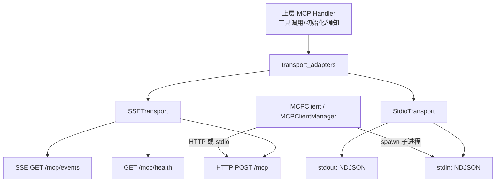
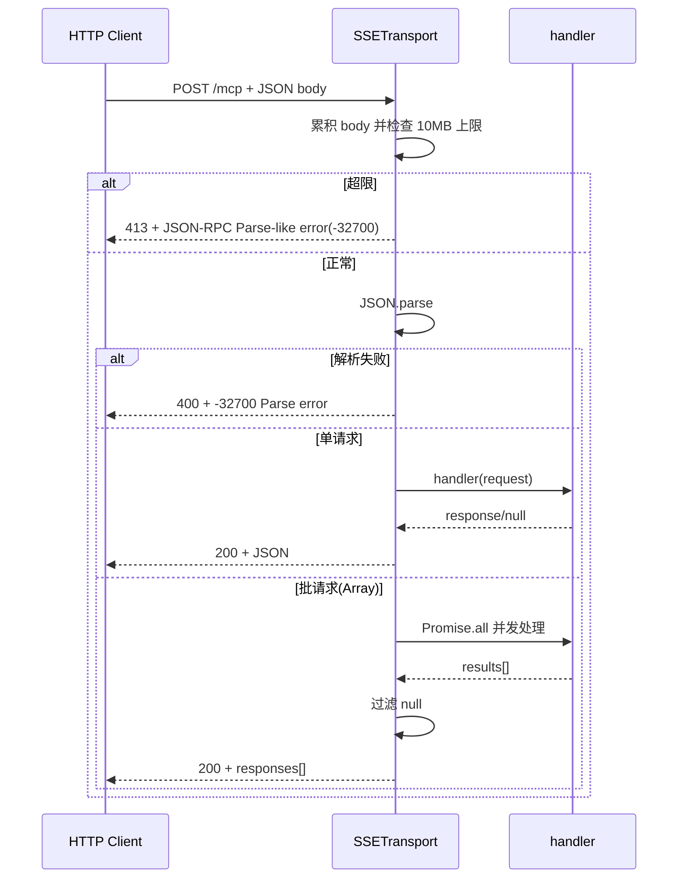
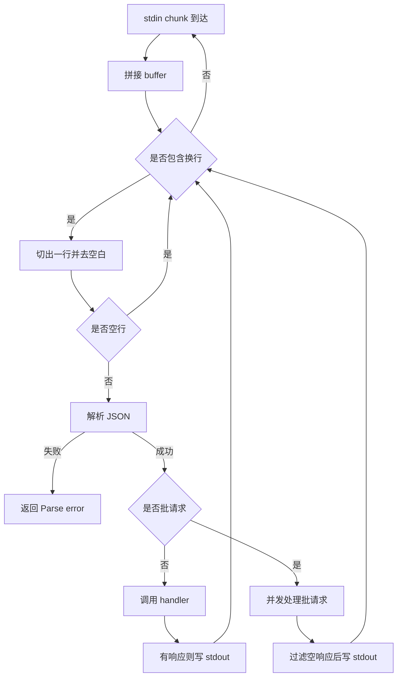
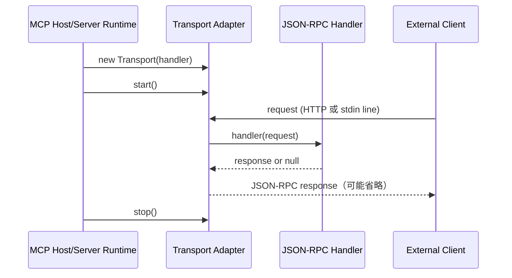

# transport_adapters 模块文档

## 模块定位与设计动机

`transport_adapters` 是 MCP Protocol 中“传输适配层”的最小核心模块，当前包含两个实现：`SSETransport` 与 `StdioTransport`。它的职责并不是解释或实现 MCP 业务语义，而是把上层 JSON-RPC 2.0 请求处理函数（`handler`）安全、稳定地挂载到不同 I/O 通道上。换句话说，这个模块解决的是“消息如何进出进程”的问题，而不是“消息代表什么业务动作”的问题。

在系统分层上，它位于 MCP Server 侧边界：向上承接 MCP method handler，向下对接 Node.js 原生流或 HTTP。这个设计让协议处理逻辑与运行时环境解耦。你可以在本地 CLI/子进程模式下使用 `StdioTransport`，也可以在 HTTP + 实时事件推送场景下使用 `SSETransport`，而无需重写同一套业务 handler。

从整体架构看，它与客户端编排层形成互补关系：客户端侧由 [client_orchestration](client_orchestration.md)（`MCPClient` / `MCPClientManager`）决定如何连接服务端；服务端侧由本模块决定如何暴露连接入口。两者通过 JSON-RPC 消息格式对齐，而不是通过共享实现耦合。

---

## 在系统中的位置



这张图体现了模块的核心价值：同一个 handler 能被多种 transport 复用。`SSETransport` 适合浏览器/远程接入和服务端推送通知，`StdioTransport` 适合受控进程通信（例如本地工具、插件宿主、IDE 扩展桥接）。

---

## 核心组件概览

`transport_adapters` 包含两个类：

- `src.protocols.transport.sse.SSETransport`
- `src.protocols.transport.stdio.StdioTransport`

两者都采用“构造注入 handler + start/stop 生命周期管理”的统一模式。handler 的责任是接收 JSON-RPC 请求对象并返回响应对象（或 `null`，通常用于 notification）。适配器本身负责：

1. 输入流切分与反序列化；
2. 错误包装为 JSON-RPC 错误响应；
3. 输出流序列化与写回；
4. 连接生命周期与资源清理。

---

## SSETransport 详细说明

## 1）职责与能力边界

`SSETransport` 是一个内置 HTTP server 的传输实现，提供三个端点：

- `POST /mcp`：接收 JSON-RPC 请求（含 batch）并返回 JSON；
- `GET /mcp/events`：建立 SSE 长连接，供服务端主动广播通知；
- `GET /mcp/health`：轻量健康检查。

它的实现刻意保持“薄层”：不做鉴权、不做业务路由、不做 JSON-RPC method 语义验证；这些应由上层 handler 或外围网关负责。

## 2）构造参数

```js
new SSETransport(handler, {
  port: 8421,
  host: '127.0.0.1',
  corsOrigin: 'http://localhost:8421'
})
```

- `handler: Function`：必需。每个请求都会被转发到该函数。
- `options.port: number`：可选，默认 `8421`。
- `options.host: string`：可选，默认 `127.0.0.1`，即默认仅本机可访问。
- `options.corsOrigin: string`：可选。默认是 `http://localhost:<port>`，避免无意开放跨域。

返回值是实例对象本身；类方法无显式返回业务数据（`start/stop/broadcast` 主要产生副作用）。

## 3）请求处理流程（内部机制）



其中几个关键实现点值得注意：

第一，body 采用流式拼接，并使用 `MAX_BODY_BYTES = 10MB` 限制输入体积；超过即 `req.destroy()` 并返回 413。这是针对大包/恶意输入的基础防护。

第二，batch 请求通过 `Promise.all` 并发执行，意味着同一批次内无顺序保障。如果某些 method 具有先后依赖关系，应在业务层显式约束，而不是依赖数组顺序。

第三，batch 结果会过滤 `null`。这与 JSON-RPC notification 行为一致：无 `id` 的请求通常不返回响应。

## 4）SSE 连接与广播机制

`_handleSSE` 会把每个响应对象（`res`）加入 `_sseClients: Set`，并在请求 `close` 事件触发时移除。`broadcast(event, data)` 会把消息编码为标准 SSE 帧：

```text
event: <eventName>
data: <json-string>

```

然后对所有当前连接执行 `write`。这是“best effort”广播：

- 没有单客户端背压管理；
- 没有消息持久化与重放；
- 没有按客户端筛选。

因此它适合轻量实时通知，而不是高可靠消息总线。

## 5）CORS 与网络暴露策略

`_onRequest` 会为所有响应设置：

- `Access-Control-Allow-Origin`
- `Access-Control-Allow-Methods: GET, POST, OPTIONS`
- `Access-Control-Allow-Headers: Content-Type, Authorization`
- `Vary: Origin`

并处理 `OPTIONS` 预检为 `204`。默认配置偏保守（localhost + 同端口 origin）。若你将 `host` 改为 `0.0.0.0` 且 `corsOrigin='*'`，等同于显著扩大攻击面，应与网关鉴权策略一起评估。

## 6）健康检查与未知路由

- `GET /mcp/health` 返回 `{ status: 'ok', transport: 'sse' }`。
- 其它未知路由返回 404 + JSON-RPC 风格 `-32600` 错误对象。

这里把 HTTP 路由错误包装成 JSON-RPC 错误格式，能让调用侧更统一地消费错误。

---

## StdioTransport 详细说明

## 1）职责与通道模型

`StdioTransport` 面向进程内/进程间管道通信，使用“每行一个 JSON”（newline-delimited JSON, NDJSON）协议：

- 从 `stdin` 读入 UTF-8 文本；
- 按 `\n` 切分完整消息；
- 解析后交给 handler；
- 将响应写到 `stdout`（同样一行一个 JSON）；
- 约定日志必须写 `stderr` 以避免污染 RPC 输出。

这与 [client_orchestration](client_orchestration.md) 中 `MCPClient` 的 stdio 读取逻辑天然兼容：客户端也按换行分帧。

## 2）构造与生命周期

```js
const transport = new StdioTransport(handler)
transport.start()
// ...
transport.stop()
```

- `constructor(handler)`：保存处理函数，初始化 `_buffer` 与 `_running`。
- `start()`：设置 `stdin` 编码、注册 `data/end` 监听并 `resume()`。
- `stop()`：设置 `_running=false` 并 `pause()` stdin。

`_running` 是输出侧保护阀：`_send` 在 stop 后不会再写 stdout。

## 3）流式切包与解析流程



该流程对“粘包/拆包”是鲁棒的：只要发送方保证换行分隔，chunk 边界如何切分都不会影响逻辑正确性。

## 4）批处理语义

与 `SSETransport` 类似，batch 使用 `Promise.all` 并发处理，返回时过滤 `null`。不同点在于：若过滤后为空数组，`StdioTransport` 不会写任何输出行（避免发送无意义空响应）。

---

## 组件关系与调用时序



这个时序强调了扩展原则：transport 只负责 I/O 与协议包裹，handler 才是业务核心。未来增加 WebSocket/Unix Socket/MessagePort 传输时，建议保持同样边界。

---

## 与其他模块的协作

在 MCP 子系统中，`transport_adapters` 与以下模块联系最紧密：

- [client_orchestration](client_orchestration.md)：客户端根据配置选择 `stdio` 或 `http` 路径发起 JSON-RPC。`StdioTransport` 与 `MCPClient._onStdioData` 的换行协议完全一致；`SSETransport` 的 `POST /mcp` 可被 HTTP 客户端路径对接。
- [CircuitBreaker](CircuitBreaker.md)：位于客户端管理层，负责失败隔离。传输层本身不内建熔断；若服务端不稳定，防护通常由调用端 breaker 提供。
- [MCP Protocol](MCP Protocol.md)：本模块是协议实现的“通道层”；协议语义、能力声明、工具路由等由上层实现。

---

## 使用示例

## 1）SSETransport：对外 HTTP + 事件广播

```js
const { SSETransport } = require('./src/protocols/transport/sse');

async function handler(req) {
  if (req.method === 'ping') {
    return { jsonrpc: '2.0', id: req.id, result: { pong: true } };
  }
  return {
    jsonrpc: '2.0',
    id: req.id ?? null,
    error: { code: -32601, message: 'Method not found' }
  };
}

const t = new SSETransport(handler, {
  port: 8421,
  host: '127.0.0.1',
  corsOrigin: 'http://localhost:8421'
});

t.start();

setInterval(() => {
  t.broadcast('heartbeat', { ts: Date.now() });
}, 5000);
```

## 2）StdioTransport：本地子进程模式

```js
const { StdioTransport } = require('./src/protocols/transport/stdio');

async function handler(req) {
  return { jsonrpc: '2.0', id: req.id, result: { ok: true, method: req.method } };
}

const t = new StdioTransport(handler);
t.start();

process.on('SIGTERM', () => t.stop());
```

---

## 错误处理、边界条件与运维注意事项

该模块的错误策略是“尽量把输入错误局部化为 JSON-RPC 错误输出”，并在 transport 级别避免进程崩溃。实际运行中需要重点关注以下行为：

- 解析失败：两种传输都会返回 `-32700 Parse error`。`SSETransport` 还会带上 `err.message` 到 `error.data`。
- 处理器异常：两者都包装为 `-32603 Internal error`。
- 体积限制：仅 `SSETransport` 对请求体有 10MB 上限。`StdioTransport` 当前没有输入大小限制，如果上游持续发送超长无换行数据，可能导致 `_buffer` 增长。
- 并发模型：batch 是并发执行，不保证按输入顺序串行副作用。
- 生命周期幂等：代码未显式防重复 `start()`。调用方应避免重复启动同一实例，尤其是 `StdioTransport`（可能重复注册 stdin 监听）。
- 输出通道纯净性：在 stdio 模式下，任何写入 stdout 的日志都可能破坏 JSON-RPC framing；务必把日志写到 stderr。

---

## 已知限制

当前实现是“轻量传输层”，并未覆盖企业级网关常见需求：

1. `SSETransport` 未提供认证/授权中间件；
2. 未提供请求级速率限制、IP 限流或审计钩子；
3. SSE 广播无背压与重放机制；
4. `StdioTransport` 无输入尺寸上限与协议级心跳；
5. 两个实现都依赖外部 handler 保证 JSON-RPC 对象结构完整性。

因此在生产部署时，推荐把该模块放在受控边界后：例如反向代理、API 网关、进程监管器之后，并通过上层策略引擎和审计模块补齐治理能力。

---

## 扩展建议：如何新增一个 Transport

若你计划新增 `WebSocketTransport` 或 `UnixSocketTransport`，建议遵循现有约定：

- 构造函数注入 `handler`；
- 提供 `start()/stop()`；
- 支持单请求与 batch；
- 对 notification（`null` 响应）不回包；
- 统一错误映射（解析失败 `-32700`，内部错误 `-32603`）；
- 明确资源清理路径（连接、timer、监听器）。

可以把这视为 transport 的“最小兼容接口”，保证其可被现有 MCP 运行时无缝替换。

---

## 参考文档

- [MCP Protocol](MCP Protocol.md)
- [client_orchestration](client_orchestration.md)
- [MCPClient](MCPClient.md)
- [MCPClientManager](MCPClientManager.md)
- [CircuitBreaker](CircuitBreaker.md)
- [Transport](Transport.md)
