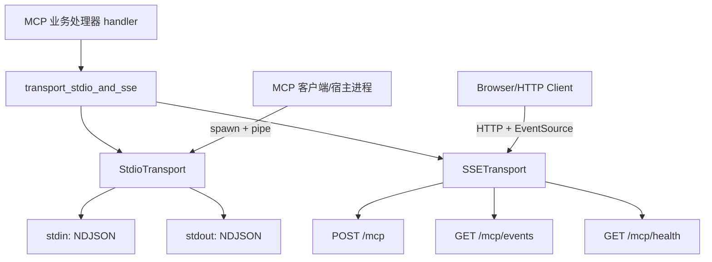
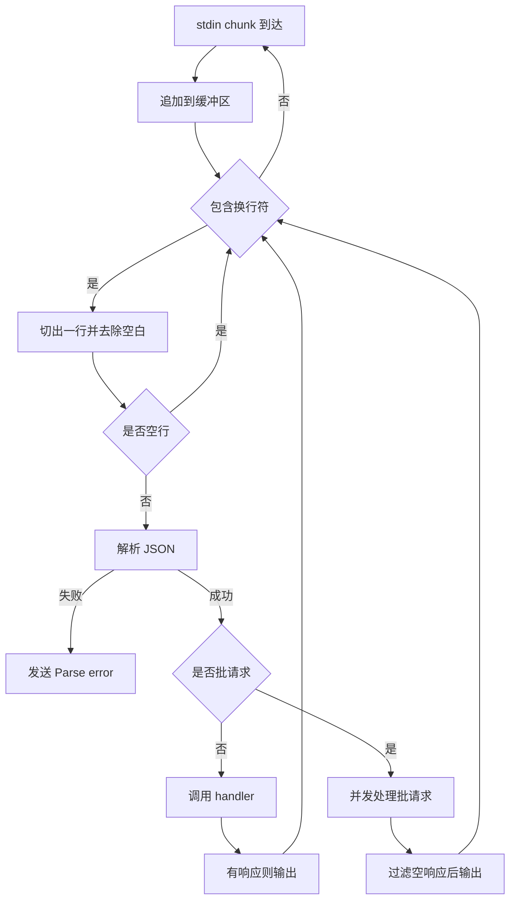
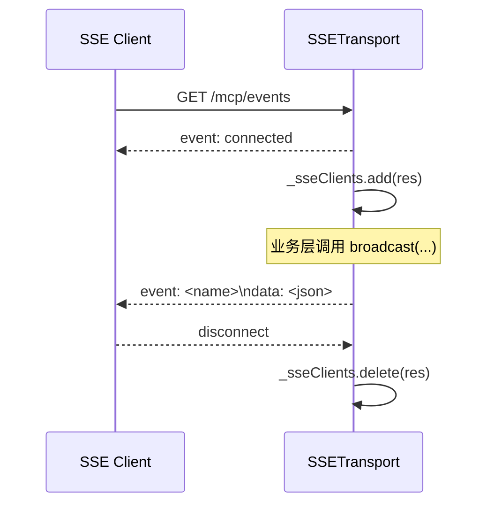
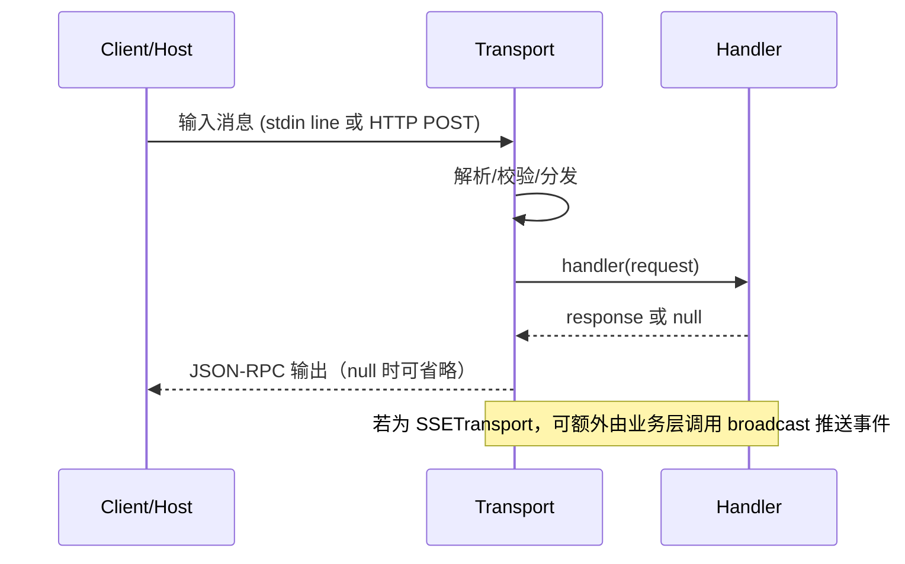

# transport_stdio_and_sse 模块文档

## 模块定位与存在意义

`transport_stdio_and_sse` 是 MCP Protocol 子系统中的传输层模块，对应两个核心实现：`src.protocols.transport.stdio.StdioTransport` 与 `src.protocols.transport.sse.SSETransport`。它解决的不是“业务方法如何执行”，而是“JSON-RPC 2.0 消息如何在不同 I/O 通道上可靠传输”。

在实际系统中，MCP 服务端往往需要同时支持两类运行形态：一种是本地子进程/CLI 场景，最适合使用标准输入输出（stdio）进行低开销通信；另一种是 HTTP 接入和浏览器可见的实时通知场景，适合使用 POST + SSE。该模块将这两类形态统一在“注入同一个 `handler` 回调”模型下，让上层业务逻辑不需要关心传输差异。

从模块边界来看，它是 MCP Runtime 的“协议边缘适配器”：向上对接 JSON-RPC request handler，向下对接 Node.js `stdin/stdout` 或 `http` server。你可以把它理解为“可替换的传输插槽”，而不是业务执行引擎。

---

## 在整体系统中的位置



这个结构的关键设计点是：同一个 handler 可以被不同 transport 复用。这样做的收益是部署灵活性高；成本是 transport 需要严格保持“薄层”职责，不把业务耦合进来。

如果需要了解客户端如何消费这些通道，建议参考 [MCPClient](MCPClient.md)、[MCPClientManager](MCPClientManager.md) 与 [client_orchestration](client_orchestration.md)。

---

## 统一抽象与行为约定

两个传输类都遵循同一组隐式契约。构造函数都接收 `handler(request)`，其中 `request` 是 JSON-RPC 请求对象；`handler` 可以返回响应对象、`null`（notification 场景）或 Promise。传输层负责解析输入、调用 handler、序列化输出，并在异常时返回标准 JSON-RPC 错误。

在错误映射上，两个实现都使用 `-32700`（Parse error）和 `-32603`（Internal error）作为核心错误码。`SSETransport` 额外有 HTTP 语义层面的 404/413 状态码。该策略保证调用方能在“HTTP 状态”和“JSON-RPC 错误对象”两层都获得可解释反馈。

---

## 核心组件一：StdioTransport

### 设计目标

`StdioTransport` 面向本地进程通信，采用 newline-delimited JSON（每行一个 JSON 消息）作为分帧协议。选择这一设计的原因是实现简单、跨语言容易、调试成本低，并且与常见 CLI/插件宿主模型天然兼容。

### 构造与状态

```javascript
const t = new StdioTransport(handler)
```

构造后保存三个内部状态：`_handler`（请求处理回调）、`_buffer`（流式拼接缓冲）、`_running`（运行标记，控制是否允许输出）。

### 生命周期方法

`start()` 会把 `stdin` 编码设置为 `utf8`，注册 `data`/`end` 事件并调用 `resume()`。`stop()` 会把 `_running` 置为 `false` 并 `pause()` stdin。该类没有显式移除监听器，因此调用方应避免对同一实例重复执行 `start()`。

### 数据处理流程



这里有两个实现细节值得注意。第一，基于换行分帧可以正确处理“粘包/拆包”，只要发送端遵守一行一消息即可。第二，batch 处理使用并发 `Promise.all`，因此不保证副作用按数组顺序串行执行。

### 关键方法说明

#### `start()`

- **参数**：无
- **返回值**：无
- **副作用**：开始消费 stdin，并使 transport 进入可写状态。

#### `stop()`

- **参数**：无
- **返回值**：无
- **副作用**：停止继续读取 stdin；后续 `_send()` 不再输出。

#### `_onData(chunk)`

- **参数**：`chunk: string`
- **返回值**：无
- **行为**：将 chunk 累加到缓冲区并按换行循环拆包。

#### `_processLine(line)`

- **参数**：`line: string`
- **返回值**：无
- **行为**：解析 JSON；支持单请求和 batch；将异常包装为 JSON-RPC 错误。

#### `_send(data)`

- **参数**：`data: any`
- **返回值**：无
- **行为**：`JSON.stringify(data)` 后写入 `stdout + '\n'`；若 `_running=false` 则静默丢弃。

---

## 核心组件二：SSETransport

### 设计目标

`SSETransport` 为 MCP 提供 HTTP 接入和服务端主动通知能力。它不仅支持 `POST /mcp` 请求-响应模式，也提供 `GET /mcp/events` 的 SSE 长连接，用于推送 server-initiated notification。这是浏览器、Dashboard 或远程代理场景中的关键能力。

### 构造参数与默认安全策略

```javascript
const t = new SSETransport(handler, {
  port: 8421,
  host: '127.0.0.1',
  corsOrigin: 'http://localhost:8421'
})
```

默认值体现了“安全默认”原则：绑定 `127.0.0.1` 防止意外 LAN 暴露，CORS 默认仅允许本地同端口来源。若你把 `host` 改为 `0.0.0.0` 且 `corsOrigin='*'`，应配合网关鉴权与访问控制。

### 路由与职责

- `POST /mcp`：接收 JSON-RPC 请求（含 batch）
- `GET /mcp/events`：建立 SSE 连接
- `GET /mcp/health`：返回健康状态
- 其他路径：返回 404 + JSON-RPC 风格错误体

### 请求处理与 body 限制

`_handlePost` 采用流式读取 body，并使用 `MAX_BODY_BYTES = 10MB` 做大小保护。超限时立刻 `req.destroy()` 并返回 413。成功读取后执行 JSON 解析，再交给 handler。batch 依然是并发 `Promise.all`，结果中过滤掉 `null`。

### SSE 客户端管理与广播

模块内部维护 `_sseClients: Set<ServerResponse>`。每次 `GET /mcp/events` 建连后，会先发送一个 `connected` 事件，然后把 `res` 放入集合；当请求关闭时自动移除。`broadcast(event, data)` 会将 payload 编码为 SSE 文本帧并写给所有当前连接。



这个广播机制是轻量 best-effort 模型，不提供消息重放、确认或慢客户端背压处理，适用于状态通知而非强可靠消息队列。

### 关键方法说明

#### `start()`

- **参数**：无
- **返回值**：无
- **副作用**：创建并启动 HTTP server；向 `stderr` 输出监听信息。

#### `stop()`

- **参数**：无
- **返回值**：无
- **副作用**：结束所有 SSE 连接并关闭 server。

#### `broadcast(event, data)`

- **参数**：`event: string`, `data: any`
- **返回值**：无
- **副作用**：向所有活跃 SSE 客户端发送事件。

#### `_onRequest(req, res)`

- **行为**：统一设置 CORS 头并分派路由；处理 OPTIONS 预检。

#### `_handleSSE(req, res)`

- **行为**：写入 SSE 响应头、发送连接确认、注册 close 清理。

#### `_handlePost(req, res)`

- **行为**：读取并校验 body，解析 JSON，调用 handler，写回 JSON-RPC 响应。

---

## 端到端交互流程



该流程展示了模块最重要的边界：transport 不理解 method 语义，也不维护业务状态；它只负责 I/O 可靠传递和错误包装。

---

## 使用模式与示例

### Stdio 模式（本地子进程）

```javascript
const { StdioTransport } = require('./src/protocols/transport/stdio')

async function handler(req) {
  if (req.method === 'ping') {
    return { jsonrpc: '2.0', id: req.id, result: { pong: true } }
  }
  return { jsonrpc: '2.0', id: req.id ?? null, error: { code: -32601, message: 'Method not found' } }
}

const t = new StdioTransport(handler)
t.start()
process.on('SIGTERM', () => t.stop())
```

### SSE 模式（HTTP + 实时推送）

```javascript
const { SSETransport } = require('./src/protocols/transport/sse')

async function handler(req) {
  return { jsonrpc: '2.0', id: req.id ?? null, result: { ok: true } }
}

const t = new SSETransport(handler, { port: 8421, host: '127.0.0.1' })
t.start()

setInterval(() => {
  t.broadcast('heartbeat', { ts: Date.now() })
}, 5000)
```

---

## 行为边界、错误条件与运维注意事项

该模块在实现上偏“轻薄”，因此有一些明确的运行约束。首先，两个 transport 都依赖外部 handler 的正确性；如果 handler 抛异常，transport 只会映射成 `-32603`，并不会自动恢复业务状态。其次，batch 请求是并发执行，对有顺序依赖的操作并不安全，调用方应在 handler 内自行串行化。

在资源与稳定性方面，`SSETransport` 对 HTTP body 有 10MB 上限保护，但 `StdioTransport` 没有类似长度阈值；若上游持续发送超长且无换行的数据，`_buffer` 可能持续增长。SSE 广播没有背压控制与重试机制，慢客户端可能导致写入风险在高并发下放大。`

最后，stdio 场景中必须保持 `stdout` 纯净，只能输出 JSON-RPC 帧；任何普通日志都应写入 `stderr`，否则会破坏协议分帧并导致客户端解析失败。

---

## 扩展指南：如何新增传输实现

若需要新增 `WebSocketTransport` 或 `UnixSocketTransport`，建议保持与现有实现一致的最小契约：构造注入 `handler`，提供 `start()/stop()` 生命周期，支持单请求与 batch，notification (`null`) 不回包，并复用当前错误码语义（解析失败 `-32700`，内部异常 `-32603`）。

这样可以保证新传输在不改动上层业务处理器的前提下替换接入，也便于与现有客户端编排层对接。

---

## 与其他文档的关系

为了避免重复，以下主题请直接参考对应文档：

- MCP 协议整体与子模块导航： [MCP Protocol](MCP Protocol.md)
- 客户端侧连接编排与调用路径： [client_orchestration](client_orchestration.md)
- MCP 客户端细节： [MCPClient](MCPClient.md)、[MCPClientManager](MCPClientManager.md)
- 传输层总览（跨模块角度）： [Transport](Transport.md)
- 可靠性治理（客户端侧熔断）： [CircuitBreaker](CircuitBreaker.md)
