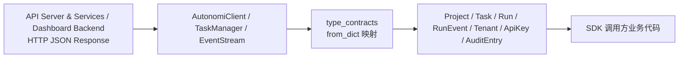
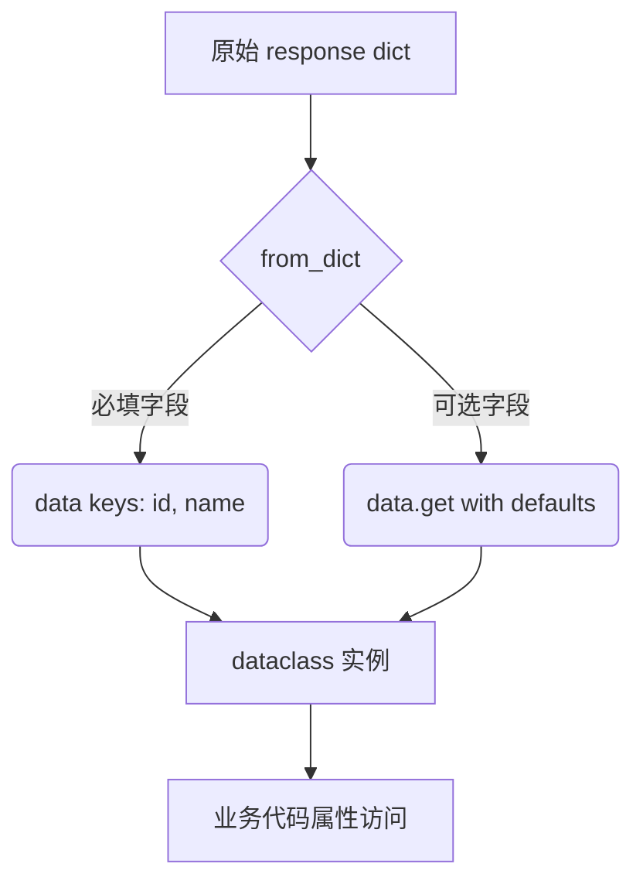
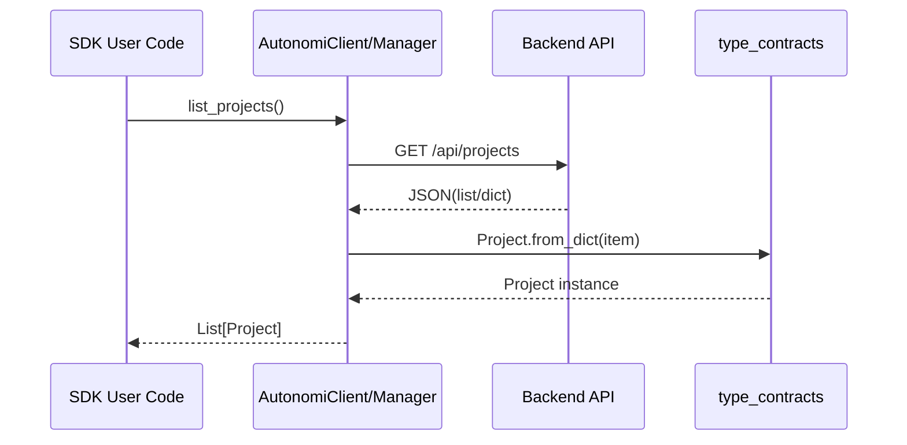
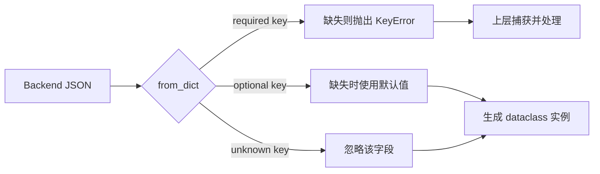
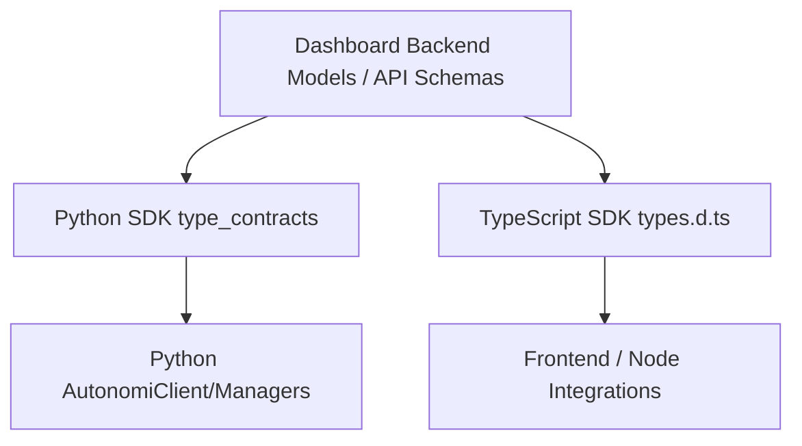

# type_contracts 模块文档

## 模块定位与设计背景

`type_contracts` 模块（代码位于 `sdk/python/loki_mode_sdk/types.py`）是 Python SDK 的“数据契约层”。它不负责网络请求、不负责鉴权、不负责业务流程编排，而是专门负责把 API 返回的 JSON 字典转换为 SDK 内部可读、可提示、可静态分析的数据对象。这个模块存在的核心价值，是在“后端响应的不确定性”和“业务代码需要稳定对象模型”之间建立一个薄而明确的边界。

从系统设计角度看，Python SDK 的 `AutonomiClient`、`TaskManager`、`SessionManager`、`EventStream` 都依赖这些类型对象作为返回值或中间表示。没有这个模块时，调用方需要在业务代码里直接处理原始 `dict`，导致字段名散落、默认值策略不统一、维护成本高。引入 `dataclass` 类型后，调用方可以以属性访问方式使用数据，并且能借助 IDE 类型提示和静态检查提升开发效率。

需要强调的是：该模块是“契约映射层（mapping layer）”，不是“严格校验层（validation layer）”。它几乎不做数据合法性检查，也不做复杂类型转换；它更偏向轻量、快速、低依赖的对象化封装。这一取舍与 Python SDK 整体“stdlib-only、低耦合”设计一致（参见 [Python SDK.md](Python SDK.md)）。

---

## 在整体系统中的角色

在模块树里，这个模块属于：`Python SDK -> type_contracts (current module)`。其上游是 Dashboard Backend/API Server 暴露的数据结构，下游是 Python SDK 的客户端和管理器。



这条链路说明了一个关键点：`type_contracts` 不直接访问网络，也不持有会话状态，它只在“响应解析”阶段介入。也正因如此，模块非常纯粹，几乎没有外部依赖（仅 `dataclasses` 与 `typing`）。

---

## 架构与组件关系

### 组件关系图

```mermaid
classDiagram
    class Project {
      +str id
      +str name
      +Optional[str] description
      +str status = "active"
      +Optional[str] tenant_id
      +Optional[str] created_at
      +Optional[str] updated_at
      +from_dict(data) Project
    }

    class Task {
      +str id
      +str project_id
      +str title
      +Optional[str] description
      +str status = "pending"
      +str priority = "medium"
      +Optional[str] assigned_agent_id
      +Optional[str] created_at
      +from_dict(data) Task
    }

    class Run {
      +str id
      +str project_id
      +str status = "pending"
      +Optional[str] trigger
      +Optional[Dict[str, Any]] config
      +Optional[str] started_at
      +Optional[str] ended_at
      +from_dict(data) Run
    }

    class RunEvent {
      +str id
      +str run_id
      +str event_type
      +Optional[str] phase
      +Optional[Dict[str, Any]] details
      +Optional[str] timestamp
      +from_dict(data) RunEvent
    }

    class Tenant {
      +str id
      +str name
      +Optional[str] slug
      +Optional[str] description
      +Optional[str] created_at
      +from_dict(data) Tenant
    }

    class ApiKey {
      +str id
      +str name
      +Optional[List[str]] scopes
      +str role = "viewer"
      +Optional[str] created_at
      +Optional[str] expires_at
      +Optional[str] last_used
      +from_dict(data) ApiKey
    }

    class AuditEntry {
      +str timestamp
      +str action
      +str resource_type
      +str resource_id
      +Optional[str] user_id
      +bool success = true
      +from_dict(data) AuditEntry
    }

    Tenant --> Project : tenant_id
    Project --> Task : project_id
    Project --> Run : project_id
    Run --> RunEvent : run_id
```



这些类型之间并未实现运行期对象引用（例如 `Project.tasks` 这种导航属性在 SDK 类型里不存在），关系只通过 ID 字段体现。这种“扁平契约”设计避免了循环依赖与复杂反序列化逻辑，代价是调用方需要自行组织跨实体聚合。

### 与后端模型的契约对应

后端 `dashboard.models` 中相应实体字段更丰富，且数据库层常使用 `int` 主键与 `datetime` 类型；Python SDK 这边统一以 `str` / `Optional[str]` 接收。也就是说，该模块承担了“跨语言、跨存储细节的简化传输契约”角色，而不是后端 ORM 的一比一镜像。

---

## 统一行为模型：`dataclass` + `from_dict`

每个类型都遵循同一构造策略：

1. 使用 `@dataclass` 定义属性、默认值与可选字段。
2. 提供 `@classmethod from_dict(cls, data)` 作为标准反序列化入口。
3. 必填字段通常使用 `data["key"]`（缺失会抛 `KeyError`）。
4. 可选字段使用 `data.get("key")` 或 `data.get("key", default)`。
5. 对可变默认值（如 `dict`、`list`）使用 `field(default_factory=...)`。

这个统一模式使 SDK 调用端形成稳定心智模型：只要拿到 API JSON，就调用对应类型的 `from_dict`。



---

## 核心类型详解

## `Project`

`Project` 表示控制平面的项目实体。它是任务与运行的逻辑容器，也是多租户域中最常见的业务对象。

`from_dict(data)` 的输入参数 `data: Dict[str, Any]` 应至少包含 `id` 与 `name`。返回值为 `Project` 实例。若缺失 `id` 或 `name`，会直接抛 `KeyError`。该方法无 I/O 副作用，但会将 `status` 缺省为 `"active"`，从而在上游未返回状态时维持可用对象。

```python
project = Project.from_dict({
    "id": "p_123",
    "name": "Platform Upgrade",
    "tenant_id": "t_1"
})
print(project.status)  # active
```

## `Task`

`Task` 表示项目中的可执行工作项。它携带状态、优先级、指派代理等任务调度信息。

`from_dict(data)` 的必填读取只有 `id`，而 `project_id`、`title` 在缺失时会回落为空字符串。这是一个非常实用但需要谨慎的宽松策略：它避免了解析阶段失败，但可能把数据质量问题延后到业务阶段（例如空标题任务在 UI 展示时才暴露异常）。返回值为 `Task` 实例，无外部副作用。

```python
task = Task.from_dict({"id": "task_9"})
print(task.project_id)  # ""
print(task.title)       # ""
```

## `Run`

`Run` 表示一次执行运行，承载执行状态、触发来源、运行配置与起止时间。

`from_dict(data)` 返回 `Run`，对 `status` 使用默认 `"pending"`。`config` 字段声明为 `Optional[Dict[str, Any]]`，类定义默认通过 `default_factory=dict` 初始化；但如果响应中显式给出 `"config": null`，实例中的 `config` 会是 `None`。调用方应按“可能是 `dict` 也可能是 `None`”编写处理逻辑。

```python
run = Run.from_dict({"id": "r1", "project_id": "p1", "config": None})
if run.config:
    print(run.config.get("mode"))
```

## `RunEvent`

`RunEvent` 表示运行中的时间线事件，常用于日志流、阶段进度和问题追踪。

`from_dict(data)` 只强制 `id`，其余如 `run_id`、`event_type` 缺失时可为空字符串。`details` 采用与 `Run.config` 相同的“可空字典”语义。返回值为 `RunEvent`，无 I/O 副作用。

```python
event = RunEvent.from_dict({
    "id": "e_1",
    "run_id": "r_1",
    "event_type": "phase_changed",
    "phase": "analysis"
})
```

## `Tenant`

`Tenant` 表示组织级租户，是多租户隔离的顶层业务边界。`from_dict(data)` 需要 `id` 与 `name`；`slug`、`description`、`created_at` 可选。返回 `Tenant` 实例。

由于 SDK 类型未建模租户配置细节（后端模型里可能有 `settings` 等字段），调用方如需完整租户配置，需要直接读取原始响应或扩展类型。

## `ApiKey`

`ApiKey` 表示 API 密钥元信息。它用于列举和管理密钥，但不会包含原始 token 明文（这通常只在创建/轮换时由其他 API 返回）。

`from_dict(data)` 必须含 `id` 与 `name`。`scopes` 缺省为空列表，`role` 缺省为 `"viewer"`。这符合最小权限默认值策略。返回 `ApiKey` 实例。

需要注意与后端响应契约的差异：后端 `ApiKeyResponse` 可能包含 `revoked`、`allowed_ips`、`usage_count` 等字段，但当前 Python SDK 类型未覆盖这些字段，解析时会被静默忽略。

## `AuditEntry`

`AuditEntry` 表示审计日志记录，是合规与追责场景的核心数据结构。

`from_dict(data)` 强制读取 `timestamp` 与 `action`，对 `resource_type` / `resource_id` 缺失时回落为空字符串，`success` 缺省为 `True`。返回 `AuditEntry` 实例。

此类型为轻量摘要模型，不包含分页游标、签名校验状态等扩展信息；这些能力应由查询接口层或上层工具承担。

---

## 模块与 SDK 其余组件的交互方式

下面的流程图展示了典型调用路径：



这个交互模式在 `TaskManager.list_tasks -> Task.from_dict`、`EventStream.poll_events -> RunEvent.from_dict`、`AutonomiClient.query_audit -> AuditEntry.from_dict` 中完全复用。模块的高复用性来自于“构造协议一致”而不是“继承层次复杂”。

---

## 使用与扩展示例

### 基础使用

```python
from sdk.python.loki_mode_sdk.client import AutonomiClient

client = AutonomiClient(base_url="http://localhost:57374", token="loki_xxx")

projects = client.list_projects()  # List[Project]
for p in projects:
    print(p.id, p.name, p.status)
```

### 安全解析（应对字段缺失）

因为 `from_dict` 可能抛 `KeyError`，建议在集成第三方网关或非标准后端时显式兜底：

```python
def safe_project(data: dict):
    try:
        return Project.from_dict(data)
    except KeyError as e:
        # 记录告警并进行降级处理
        return None
```

### 扩展新类型的推荐模板

新增类型时应保持当前模块风格一致，避免引入非对称行为：

```python
from dataclasses import dataclass
from typing import Any, Dict, Optional

@dataclass
class Session:
    id: str
    project_id: str
    status: str = "active"
    created_at: Optional[str] = None

    @classmethod
    def from_dict(cls, data: Dict[str, Any]) -> "Session":
        return cls(
            id=data["id"],
            project_id=data.get("project_id", ""),
            status=data.get("status", "active"),
            created_at=data.get("created_at"),
        )
```

---

## 字段契约与默认值策略（深入说明）

虽然这些类型看起来只是简单的数据容器，但它们背后隐含了一套统一的契约哲学：**“必填字段尽早失败，可选字段宽松兜底，未知字段静默忽略”**。这套哲学决定了 SDK 在面对后端演进时的稳定性，也决定了调用方应把哪些校验职责放在业务层。



这个行为模型在七个类型中保持一致，但“严格程度”并不完全相同。`Project`、`Tenant`、`ApiKey`、`AuditEntry` 对关键主键或标识字段更严格；`Task`、`Run`、`RunEvent` 为了流式或增量场景兼容性，允许更多字段为空字符串或默认值。维护者在扩展新类型时，建议先回答一个问题：该资源是否用于关键控制面操作，还是主要用于运行态观测信息；前者宜更严格，后者可适度宽松。

下面是字段层面的默认策略总结（仅列举最关键差异）：

- `Task.project_id`、`Task.title` 缺失时回退 `""`。
- `Run.config`、`RunEvent.details` 缺失时回退 `{}`，但若上游显式传 `null`，则可能得到 `None`。
- `ApiKey.scopes` 缺失时回退 `[]`，与最小权限展示场景一致。
- `AuditEntry.success` 缺失时回退 `True`，意味着审计查询结果默认按成功事件处理，业务侧如需严格统计失败率，应显式确认原始字段存在性。

这些默认值都属于“展示与消费友好”的设计，并不等价于真实业务事实。尤其在审计、计费、策略判定等严肃场景，建议对关键字段做二次验证。

---

## 与其他 SDK/后端契约的对齐关系

`type_contracts` 并不是系统里唯一的类型层。它与 Dashboard Backend 的请求/响应模型、TypeScript SDK 的声明文件共同构成跨语言契约网络。为了避免重复，本文不展开这些模块的完整内容，但建议在维护时将它们一起审视。



在实际演进中，如果后端新增字段但 Python `dataclass` 尚未补充，SDK 通常不会立即崩溃（因为未知字段会被忽略），这提供了前向兼容性；但同时也可能让调用方误以为后端并未返回该字段。因此，建议在版本发布流程中加入“契约漂移检查”：对比后端 OpenAPI（或等价 schema）与 `types.py` 的字段覆盖率，再决定是否补充类型字段。

---

## 边界条件、错误行为与已知限制

这个模块的主要风险不在复杂算法，而在“过于轻量”带来的契约松弛。实践中建议重点关注以下问题：

- 当必填键缺失时，`data["..."]` 会抛 `KeyError`。模块本身不捕获，异常会向上冒泡到调用方。
- 类型注解并不会在运行时强制校验。后端即使返回 `id: 123`（int），对象也会照常创建，直到业务代码依赖字符串语义时才可能出错。
- 时间字段全部是 `str`，模块不负责解析为 `datetime`，也不做时区标准化。
- `Task.from_dict`、`RunEvent.from_dict` 的空字符串回退策略会掩盖字段缺失，建议在业务层加数据质量检查。
- `ApiKey`、`AuditEntry` 是简化视图，后端新增字段默认被忽略；这在前向兼容上是优点，但会造成“字段存在却不可见”的认知差。
- 模块没有 `to_dict()`、`schema`、`validate()` 能力；若要将对象安全回写 API，需要在上层显式构造 payload。

---

## 设计取舍总结

`type_contracts` 模块的价值不在“功能多”，而在“契约稳定且成本低”。它用最少机制实现了 Python SDK 的数据对象统一，保障了管理器/客户端返回值的一致性，并在不引入外部依赖的前提下提供了可维护的类型体验。它的局限同样清晰：缺少强校验、缺少序列化协议、对复杂后端字段覆盖有限。对 SDK 维护者而言，最佳实践不是把所有逻辑塞进该模块，而是让它继续保持轻量，把校验、策略、变换放在更上层。

---

## 相关文档

为避免重复，以下主题请直接参考对应模块文档：

- Python SDK 总览与客户端能力：[`Python SDK.md`](Python SDK.md)
- Python SDK 管理器（`TaskManager`/`SessionManager`/`EventStream`）：[`Python SDK - 管理器类.md`](Python SDK - 管理器类.md)
- API 侧类型契约：[`api_type_contracts.md`](api_type_contracts.md)
- Dashboard 请求/响应契约：[`request_response_contracts.md`](request_response_contracts.md)
- TypeScript 对应类型体系：[`TypeScript SDK.md`](TypeScript SDK.md)
