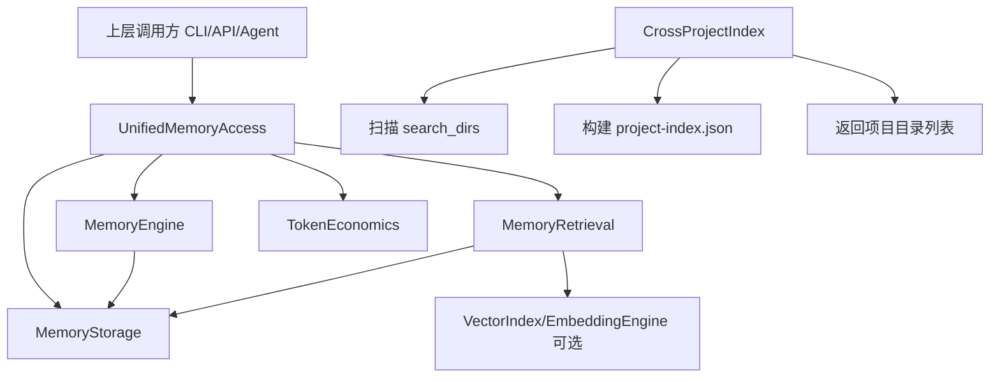
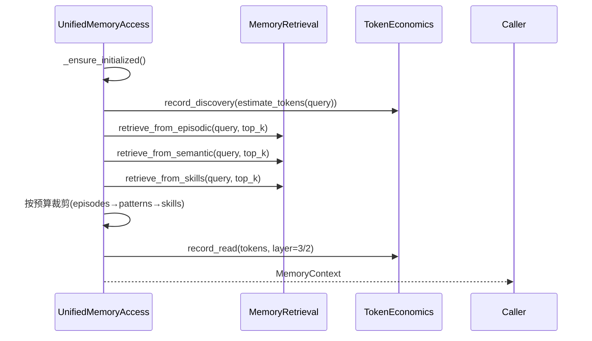
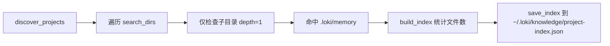

# unified_access_and_cross_project 模块文档

## 概述与设计动机

`unified_access_and_cross_project` 是 Memory System 中面向“统一入口 + 多项目发现”的关键组合模块，核心由 `memory.unified_access.UnifiedMemoryAccess` 与 `memory.cross_project.CrossProjectIndex` 两个组件构成。它存在的根本原因是：上层调用方（CLI、API、Agent runtime、Dashboard 后端服务）并不希望理解 episodic / semantic / procedural 三层内存的差异，也不应直接处理 token 预算、检索策略、时间线记录与会话统计等底层细节。

在该设计中，`UnifiedMemoryAccess` 负责“单项目内的一站式访问”，将检索、记录、建议、统计统一成稳定 API；`CrossProjectIndex` 负责“跨项目可见性”，通过扫描本地目录发现多个项目的 `.loki/memory` 存储并汇总全局索引。这种拆分使得模块既能保持调用面的简洁，也能逐步演进跨项目知识复用能力。

从系统位置看，本模块处于 Memory Engine 与上层应用之间：向下依赖 `MemoryStorage`、`MemoryEngine`、`MemoryRetrieval`、`TokenEconomics`，向上为 API 层、SDK 与 UI 组件提供可消费的数据形态。关于底层引擎、检索与向量机制的细节，建议分别参考 [Memory Engine.md](Memory%20Engine.md)、[Retrieval.md](Retrieval.md)、[Vector Index.md](Vector%20Index.md) 与 [Embeddings.md](Embeddings.md)。

---

## 模块架构



该架构体现了两个核心路径：第一条是“单项目执行路径”，围绕 `UnifiedMemoryAccess` 进行检索与写入；第二条是“多项目发现路径”，由 `CrossProjectIndex` 独立运行并输出跨项目元索引。二者目前是松耦合关系：`CrossProjectIndex` 不直接参与 `UnifiedMemoryAccess` 的检索流程，而是为上层编排器提供跨项目入口信息。

---

## 组件详解

## 1) `UnifiedMemoryAccess`

### 1.1 职责边界

`UnifiedMemoryAccess` 的核心职责是把复杂内存系统包装成统一服务面，提供四类高频能力：

- 面向任务的上下文检索（`get_relevant_context`）
- 交互与完整 episode 记录（`record_interaction` / `record_episode`）
- 基于上下文的行动建议（`get_suggestions`）
- 运行统计与会话持久化（`get_stats` / `save_session`）

它本身不实现底层搜索算法与持久化协议，而是编排 `MemoryEngine`、`MemoryRetrieval`、`MemoryStorage` 与 `TokenEconomics`。

### 1.2 初始化与生命周期

构造函数参数：

- `base_path: str = ".loki/memory"`：内存根目录。
- `engine: Optional[MemoryEngine]`：可注入预配置引擎。
- `session_id: Optional[str]`：用于 token 经济追踪。

对象采用懒初始化模式：多数公开方法会先调用 `_ensure_initialized()`，首次触发 `engine.initialize()` 建立目录与基础文件。此模式减少启动成本，但也意味着第一次请求可能承担初始化延迟。

### 1.3 `MemoryContext` 数据容器

`MemoryContext` 是统一检索结果的数据契约，包含 `relevant_episodes`、`applicable_patterns`、`suggested_skills`、`token_budget`、`task_type` 与 `retrieval_stats`。其 `to_dict/from_dict` 便于 API 透传；`is_empty`、`total_items` 和 `estimated_tokens` 则用于上层判断上下文质量与开销。

值得注意的是，`estimated_tokens()` 依赖 `estimate_memory_tokens` 做估算，属于近似值，适合预算控制而非计费精算。

### 1.4 上下文检索内部流程



`get_relevant_context` 的执行重点并不在“检索出最多结果”，而在“预算内可用结果”。它先按类别拿候选，再按固定顺序（episodes → patterns → skills）逐项试装入 token 预算。该顺序是可预测的，但也带来一个行为特征：若 episodic 数据过大，后续 semantic/skills 可能被预算挤出。

### 1.5 交互记录与 Episode 记录

`record_interaction` 面向轻量行为日志：写入 timeline action，并记录 discovery token；失败时仅记日志不抛异常。`record_episode` 面向完整轨迹：将动作字典转为 `ActionEntry`，通过 `EpisodeTrace.create(...)` 生成标准 episode，再调用 `engine.store_episode(...)` 持久化并返回 `episode_id`。

`record_episode` 中动作时间戳若缺失会使用 `i * 10` 作为相对秒，适合作为降级默认值，但不应被解释为真实 wall-clock 时间。

### 1.6 建议生成机制

`get_suggestions` 采用轻量启发式：先由 `retrieval.detect_task_type` 判定任务类型，再取少量 pattern 与 skill 生成文本建议，最后叠加 `_get_task_type_suggestions` 中的任务模板提示。该机制可解释性强、开销低，但不是推理型规划器。

### 1.7 工具方法

- `get_stats()`：合并 `engine.get_stats()` 与 `token_economics.get_summary()`。
- `save_session()`：持久化 token 经济数据。
- `get_index()` / `get_timeline()`：透传引擎索引与时间线。

---

## 2) `CrossProjectIndex`

### 2.1 目标与适用场景

`CrossProjectIndex` 用于发现“哪些项目拥有可用 memory store”，并统计每个项目的 episodic/semantic/skills 数量。它适合 Dashboard 的全局视图、迁移规划、知识资产盘点等场景。

### 2.2 核心流程



默认扫描目录为 `~/git`、`~/projects`、`~/src`。`build_index()` 会为每个项目统计：

- `episodic_count`：`episodic/*.json`
- `semantic_count`：`semantic/*.json`
- `skills_count`：`skills/*.json`

并聚合总量字段 `total_episodes / total_patterns / total_skills`。

### 2.3 持久化与读取

`save_index()` 将 `_index` 以 JSON 写入 `index_file`，`load_index()` 从磁盘恢复，`get_project_dirs()` 则返回已索引项目路径列表（必要时触发构建）。

---

## 与系统其他模块的关系

在 Memory System 内部，本模块是“对外入口层”，直接依赖引擎与检索实现；在 API Server & Services 侧，它可作为 runtime service 的内存读写桥接点；在 Dashboard Backend 侧，`CrossProjectIndex` 的输出可支持多项目治理与可视化统计；在 Dashboard UI（如 `loki-memory-browser`、`loki-learning-dashboard`）侧，可消费 `MemoryContext` 及统计结果做呈现。

建议避免在此文档重复底层协议细节，相关内容请参考 [Memory System.md](Memory%20System.md) 与 [API Server & Services.md](API%20Server%20%26%20Services.md)。

---

## 使用示例

```python
from memory.unified_access import UnifiedMemoryAccess

access = UnifiedMemoryAccess(base_path=".loki/memory", session_id="sess-001")

# 1) 检索上下文
ctx = access.get_relevant_context(
    task_type="implementation",
    query="实现 OAuth token 刷新逻辑",
    token_budget=3000,
    top_k=5,
)
print(ctx.to_dict())

# 2) 记录交互
access.record_interaction(
    source="cli",
    action={"action": "read_file", "target": "auth/service.py", "result": "ok"},
    outcome="success",
)

# 3) 记录完整 episode
episode_id = access.record_episode(
    task_id="task-123",
    agent="coder-agent",
    goal="实现 refresh token endpoint",
    actions=[
        {"action": "read_file", "target": "auth/routes.py", "result": "loaded"},
        {"action": "write_file", "target": "auth/service.py", "result": "updated"},
    ],
)
print("episode:", episode_id)

# 4) 获取建议和统计
print(access.get_suggestions("调试 401 unauthorized"))
print(access.get_stats())
access.save_session()
```

```python
from memory.cross_project import CrossProjectIndex

idx = CrossProjectIndex(
    search_dirs=["~/git", "~/workspaces"],
    index_file="~/.loki/knowledge/project-index.json",
)
index_data = idx.build_index()
idx.save_index()
print(index_data["total_episodes"], len(index_data["projects"]))
```

---

## 配置与扩展建议

`UnifiedMemoryAccess` 的主要配置入口是 `base_path`、`session_id`、`token_budget/top_k`。若你需要更复杂能力（命名空间继承、跨 namespace 合并、预算分层优化），建议向下直接使用 `MemoryRetrieval` 的 `retrieve_with_inheritance`、`retrieve_cross_namespace`、`retrieve_with_budget` 能力。

`CrossProjectIndex` 可通过自定义 `search_dirs` 适配团队目录结构。若项目规模较大，建议把“全量扫描”改为定时任务并结合缓存/增量更新，避免高频 I/O。

---

## 边界条件、错误处理与已知限制

1. `UnifiedMemoryAccess.get_relevant_context()` 在异常时返回空 `MemoryContext`（`retrieval_stats.error`），不会抛出；调用方若只看返回类型而不检查 `retrieval_stats`，容易误判为“确实无数据”。
2. 预算裁剪按固定类别顺序执行，可能导致后序类别饥饿；如果你的业务更依赖 pattern/skill，建议在外层改造排序策略或分配子预算。
3. `record_interaction()` 和 `save_session()` 采用“记录错误日志但不中断流程”，适合鲁棒执行，但会弱化故障显式性。
4. `CrossProjectIndex.discover_projects()` 仅扫描一级子目录（depth=1），嵌套仓库不会被发现。
5. `CrossProjectIndex` 的计数逻辑基于文件数量，不验证内容有效性；损坏 JSON 仍会被计入。
6. `CrossProjectIndex` 使用 `datetime.now(timezone.utc).isoformat() + 'Z'`，可能产生形如 `+00:00Z` 的冗余时区后缀，这是格式层面的兼容性风险。
7. `CrossProjectIndex.save_index()` 没有像 `MemoryStorage` 那样的原子写/锁机制，在并发写入下存在竞争窗口。

---

## 维护者备注

如果你准备扩展本模块，优先保持 `UnifiedMemoryAccess` 的“薄编排”定位：把检索算法和存储策略继续放在 `retrieval`/`storage` 层。这样可以保证上层 API 稳定，并降低多模块联动修改的风险。跨项目能力方面，建议逐步把 `CrossProjectIndex` 与 namespace 检索能力衔接，形成“发现 -> 检索 -> 迁移/复用”的闭环。