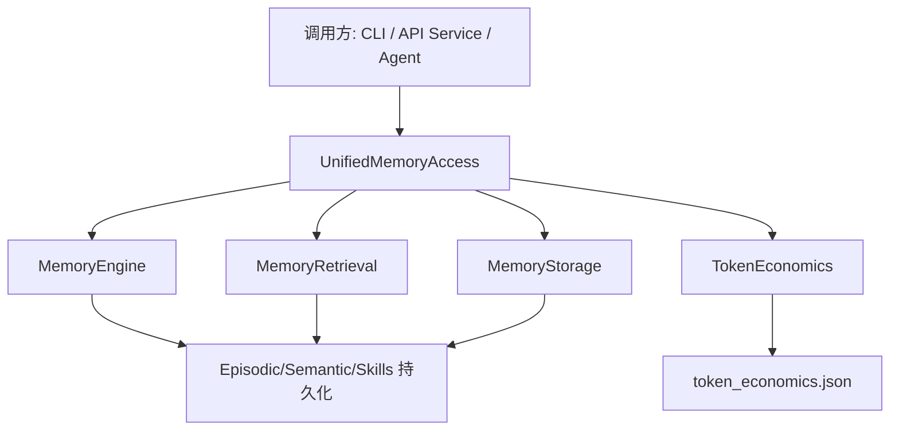
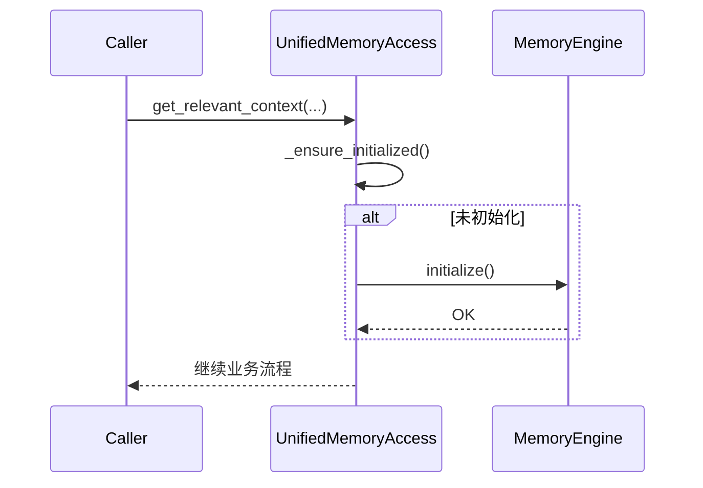
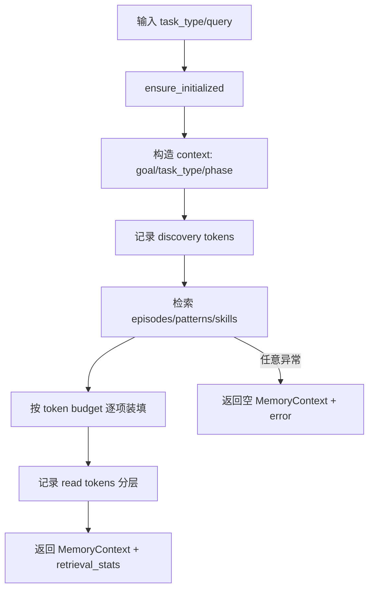
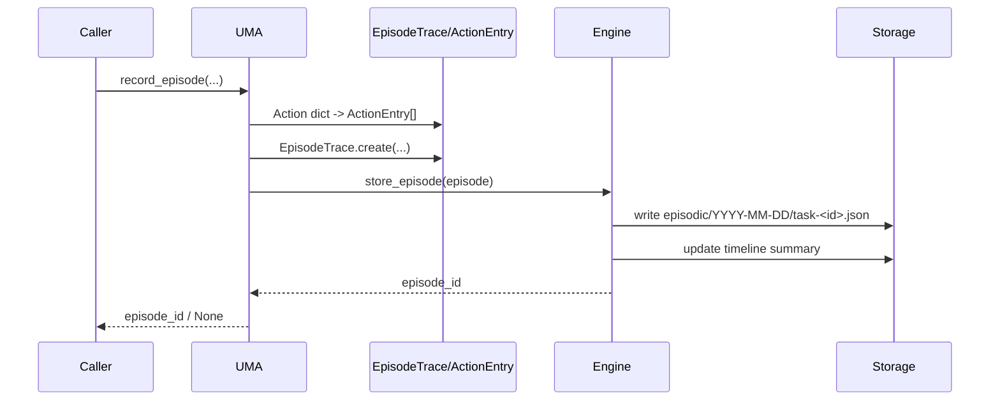
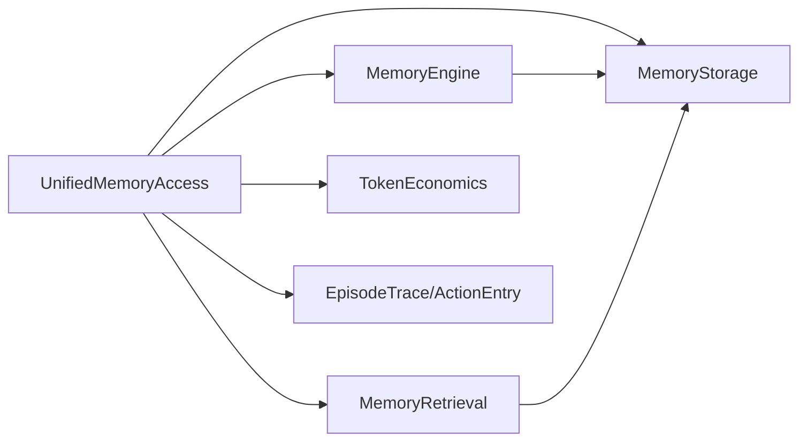

# unified_memory_access 模块文档

## 概述

`unified_memory_access`（对应代码文件 `memory/unified_access.py`）是 Memory System 的统一门面层，核心目标是把分散在 episodic / semantic / procedural 三类记忆中的读写能力，收敛成一个对上层调用方稳定、低认知负担的 API。它存在的价值不在于替代 `MemoryEngine` 或 `MemoryRetrieval` 的底层能力，而在于将“初始化、检索、预算控制、交互记录、建议生成、会话统计”这些跨组件工作流整合到一个单点入口中。

从系统设计角度看，这个模块主要解决两个现实问题。第一，上层模块（CLI、API、Agent Runtime、Dashboard 后端服务）不应该了解内存目录结构、检索策略细节、token 统计口径，否则会造成耦合爆炸。第二，记忆检索不是简单搜索，而是受任务类型、token 预算、上下文状态影响的组合流程。`UnifiedMemoryAccess` 将这些过程显式封装，使调用侧更容易在“效果、成本、稳定性”三者之间取得平衡。

在整个项目模块树中，该模块位于 **Memory System → unified_memory_access**，直接依赖 `memory.engine`, `memory.retrieval`, `memory.storage`, `memory.schemas`, `memory.token_economics`。如果你需要先理解底层存储格式和检索细节，建议先阅读：[Memory Engine.md](Memory%20Engine.md)、[retrieval_and_vector_indexing.md](retrieval_and_vector_indexing.md)、[schemas_and_task_context.md](schemas_and_task_context.md)、[progressive_loading_and_cross_project_index.md](progressive_loading_and_cross_project_index.md)。本文重点放在统一接入层本身，而不重复底层模块文档内容。

---

## 模块定位与架构关系



`UnifiedMemoryAccess` 不是纯代理层，它有自己的编排责任。它会在调用检索前构造任务上下文、记录 discovery/read token、按预算截断结果、统一异常降级返回。对于写入路径，它会将轻量动作写入 timeline，将完整任务过程写入 episode。也就是说，它既承担读路径的“裁剪与统计”，也承担写路径的“标准化记录”。

---

## 核心数据结构：`MemoryContext`

`MemoryContext` 是该模块对外返回的标准上下文容器，目的是给调用方一个结构稳定、可序列化、可预算追踪的结果对象。它包含三种记忆结果列表与元数据，不要求调用者直接理解底层 schema 的全部细节。

### 字段说明

- `relevant_episodes: List[Dict[str, Any]]`：相关的 episodic 记忆条目。
- `applicable_patterns: List[Dict[str, Any]]`：相关 semantic pattern。
- `suggested_skills: List[Dict[str, Any]]`：相关 procedural skill。
- `token_budget: int`：剩余预算（不是原始预算）。
- `task_type: str`：当前任务类型（调用者传入或推断后的使用值）。
- `retrieval_stats: Dict[str, Any]`：检索统计与错误信息。

### 关键方法行为

`to_dict()` / `from_dict()` 提供对 API 层和持久化层友好的序列化能力。`is_empty()` 用于快速判断检索是否命中。`total_items()` 用于 UI 或日志展示总条数。`estimated_tokens()` 会对三类结果逐条调用 `estimate_memory_tokens`，给出上下文体积估算。

这里的 token 估算是 JSON 长度近似法（约 4 字符/Token），属于工程估算而非模型 tokenizer 精确值，因此更适合预算控制与趋势监控，不适合精确计费。

---

## 核心类：`UnifiedMemoryAccess`

## 初始化与生命周期

### `__init__(base_path=".loki/memory", engine=None, session_id=None)`

构造函数会创建并关联四个关键子系统：

1. `MemoryStorage`：文件级存储与 timeline 更新。
2. `MemoryEngine`：episode/pattern/skill 的读写与统计。
3. `MemoryRetrieval`：检索策略执行器。
4. `TokenEconomics`：会话内 token 经济性追踪。

如果外部传入 `engine`，则复用已有引擎；但检索器仍使用当前实例创建的 `_storage`。这意味着“注入 engine 与 storage 不一致”在工程上是可能发生的，属于扩展时需要注意的一致性风险（详见后文“限制与陷阱”）。

`session_id` 未传入时，会使用 UTC 时间戳字符串生成（`%Y%m%d%H%M%S`），用于 token 统计会话标识。

### `initialize()` 与 `_ensure_initialized()`

`initialize()` 会调用 `engine.initialize()` 来确保目录和基础文件就绪，且通过 `_initialized` 保护实现幂等。`_ensure_initialized()` 被几乎所有公开操作先调用，确保调用方无需显式管理生命周期。



---

## 读取路径：上下文检索

### `get_relevant_context(task_type, query, token_budget=None, top_k=5) -> MemoryContext`

这是最关键的入口方法。它把一个“任务类型 + 查询文本”转成可直接拼接到提示词或决策上下文中的记忆包。

执行流程如下：



其内部机制有几个关键点：

第一，它会将任务类型映射为 RARV phase（例如 `implementation -> ACT`, `review -> REFLECT`），并把 `phase` 放入检索上下文，便于下游策略使用。

第二，它会分别调用 `_retrieve_episodes/_retrieve_patterns/_retrieve_skills`，每个子步骤都单独 try/except，失败返回空列表，因此局部检索失败不会直接中断整个流程。

第三，它采用顺序预算装填：先 episodes，再 patterns，再 skills。每个条目都用 `estimate_memory_tokens` 估算体积，不超预算才纳入结果，同时将 read token 记入 `TokenEconomics`。这意味着返回结果具有“前序类别优先”偏置，而不是全局最优打包。

### 参数与返回

- `task_type`：建议使用 `exploration/implementation/debugging/review/refactoring`。
- `query`：任务描述或检索语句。
- `token_budget`：可选，未传用 `DEFAULT_TOKEN_BUDGET=4000`。
- `top_k`：每个类别的最大候选数，不是总数上限。

返回 `MemoryContext`，其中 `token_budget` 字段是“剩余额度”，`retrieval_stats` 包含各类别命中数与已用 token。

### 侧效应

该方法不是纯函数，会修改 `TokenEconomics` 计数器（discovery/read）。如果你在高频请求中调用它，需注意会话统计增长速度和落盘策略（通过 `save_session()`）。

---

## 写入路径：交互记录与 episode 记录

### `record_interaction(source, action, outcome=None)`

这个方法用于记录细粒度运行行为，主要写入 timeline（`timeline.json`）。它会标准化动作结构（`type/source/target/result/timestamp/outcome`），然后调用 `MemoryStorage.update_timeline()`。

它适合记录“工具动作流”（如 `read_file`, `write_file`），而不是完整任务复盘。完整复盘应使用 `record_episode`。

### `record_episode(task_id, agent, goal, actions, outcome="success", phase="ACT", duration_seconds=0) -> Optional[str]`

该方法将一次任务执行封装为 `EpisodeTrace` 并持久化。它先把输入 `actions`（dict）转换为 `ActionEntry` 列表，再通过 `EpisodeTrace.create()` 生成合规 ID 和时间戳，最后调用 `engine.store_episode()`。



如果中途异常，该方法返回 `None` 并记录错误日志，不抛出异常。

### 两个写入入口的分工

`record_interaction` 强调实时轨迹与可观测性；`record_episode` 强调任务级沉淀和后续检索价值。实际落地时通常二者并用：先持续记录 interaction，再在任务结束时写入 episode 汇总。

---

## 建议生成路径

### `get_suggestions(context, max_suggestions=5) -> List[str]`

该方法用于轻量建议，而非严格可执行计划。它先调用 `retrieval.detect_task_type` 识别任务类型，再抽取少量 pattern/skill 文本片段，最后附加任务类型模板建议。

生成顺序如下：

1. pattern 建议（最多 2 条，来源 `correct_approach`）。
2. skill 建议（最多 2 条，来源技能首步）。
3. task-type 模板建议（最多 2 条）。
4. 全局截断到 `max_suggestions`。

因为它拼接的是摘要文本而非结构化执行计划，所以更适合在 UI 面板、CLI 提示、Agent pre-flight 阶段提供启发式指导。

---

## 统计与辅助接口

### `get_stats()`

组合返回 `engine.get_stats()` 与 `token_economics.get_summary()`，并附带 `session_id`。适合做 Dashboard 统计面板和健康巡检。

### `save_session()`

将 token 会话统计保存到 `{base_path}/token_economics.json`。该方法吞掉异常并仅打日志，因此在严格审计场景下，建议上层补充失败告警。

### `get_index()` / `get_timeline()`

直接委托给 `MemoryEngine`，返回记忆索引与时间线原始结构。这两个方法是读取“记忆系统状态视图”的便捷入口。

---

## 任务类型与 RARV Phase 映射

`_task_type_to_phase()` 的映射关系如下：

- `exploration -> REASON`
- `implementation -> ACT`
- `debugging -> ACT`
- `review -> REFLECT`
- `refactoring -> ACT`
- 其他未知值 -> `ACT`

这个映射影响检索上下文构造，也间接影响下游策略判断。若你扩展新的任务类型，建议同步更新此映射，并与 `MemoryRetrieval.detect_task_type` 的信号体系保持一致。

---

## 关键依赖关系与协作说明



`UnifiedMemoryAccess` 与 `MemoryRetrieval` 的关系是“编排者与执行器”。前者控制预算与会话统计，后者负责检索算法细节。`UnifiedMemoryAccess` 与 `MemoryEngine` 的关系是“门面与核心存储逻辑”。前者定义对外 API，后者管理具体文件组织、索引、统计。`MemoryStorage` 则是底层 I/O 支撑，被多个组件共享。

---

## 使用示例

### 基础检索与记录

```python
from memory.unified_access import UnifiedMemoryAccess

uma = UnifiedMemoryAccess(base_path=".loki/memory")

ctx = uma.get_relevant_context(
    task_type="implementation",
    query="Build REST API authentication middleware",
    token_budget=2500,
    top_k=5,
)

if not ctx.is_empty():
    print("items:", ctx.total_items())
    print("remaining:", ctx.token_budget)

uma.record_interaction(
    source="cli",
    action={"action": "read_file", "target": "api/auth.py", "result": "ok"},
    outcome="success",
)

episode_id = uma.record_episode(
    task_id="task-123",
    agent="coder",
    goal="Implement auth middleware",
    actions=[
        {"action": "read_file", "target": "api/routes.py", "result": "done"},
        {"action": "write_file", "target": "api/auth.py", "result": "patched"},
    ],
    outcome="success",
    phase="ACT",
    duration_seconds=95,
)

print("episode:", episode_id)
uma.save_session()
```

### 作为 API Service 中的共享组件

```python
# pseudo-code
class MemoryService:
    def __init__(self):
        self.uma = UnifiedMemoryAccess(base_path="/var/lib/app/memory")

    def retrieve(self, task_type: str, query: str):
        context = self.uma.get_relevant_context(task_type, query, token_budget=3000)
        return context.to_dict()
```

在服务化部署中建议将 `UnifiedMemoryAccess` 作为长生命周期单例，以复用 session 统计和减少重复初始化。

---

## 配置与扩展建议

`UnifiedMemoryAccess` 本身可配置项较少，但它的行为受下游组件强烈影响。你可以从三个层面扩展：

1. **预算策略扩展**：调整 `default_token_budget`，或重写 `get_relevant_context` 的装填顺序（例如按 `_weighted_score` 全局排序后装填）。
2. **检索策略扩展**：注入带 embedding/vector index 的 `MemoryRetrieval` 配置（详见 [retrieval_and_vector_indexing.md](retrieval_and_vector_indexing.md)）。
3. **记录策略扩展**：在 `record_interaction` 中增加额外字段（例如 tenant/project/session tags）以支持多租户审计。

如果你需要 namespace 继承、跨项目检索等能力，优先在 `MemoryRetrieval` 和 `MemoryStorage` 层实现，然后通过 `UnifiedMemoryAccess` 暴露简化入口。

---

## 异常处理、边界条件与已知限制

该模块整体采取“日志记录 + 尽量返回可用结果”的容错风格。这样做有利于在线服务稳定性，但会降低失败显著性，因此需要上层监控补齐。

### 1) token_budget 的 truthy 处理

`budget = token_budget or self.default_token_budget` 会导致 `token_budget=0` 被当作未设置，最终回落到默认预算。这可能与调用者“显式禁用上下文”的意图不一致。若需要严格语义，建议改为 `if token_budget is None` 判断。

### 2) 装填顺序偏置

预算裁剪顺序固定为 episodes -> patterns -> skills，可能让后两类在小预算下长期饥饿。对于强调技能复用的场景，可引入配额或全局排序策略。

### 3) engine 注入与 storage 一致性

构造时允许注入外部 `engine`，但 `retrieval` 仍绑定本实例创建的 `_storage`。若注入的 engine 使用不同 `base_path/namespace`，读写可能分裂到不同数据源。

### 4) record_interaction 不抛错

写 timeline 失败仅记录日志，不会抛异常。审计强一致场景下应在上层增加落盘确认与补偿队列。

### 5) suggestions 是启发式文本

`get_suggestions` 只做简化拼接，不保证去重、可执行性或事实完整性。它适合作为“提示”，不适合作为自动执行计划。

### 6) token 估算是近似

`estimate_tokens/estimate_memory_tokens` 基于长度估算，不等同于模型真实 tokenizer。预算控制可用，但不要直接用于精确成本结算。

---

## 与系统其他模块的集成位置

在模块树语义中，该模块通常被以下路径消费：

- **API Server & Services**：作为 memory 相关 API（retrieve/suggestions/consolidate）的后端门面。
- **Dashboard Backend**：用于 memory 浏览、学习建议、时间线展示等接口数据来源。
- **Dashboard UI Components / Memory and Learning Components**：通过后端接口消费 `MemoryContext`、timeline、stats。
- **SDK（Python/TypeScript）**：通常不直接依赖该类，而是经 API 间接访问。

如果你正在写 API 合同，建议同时参考 `api.types.memory.*`（如 `RetrieveRequest`, `MemorySummary`, `TimelineLayer`）对应文档，避免把内部结构直接暴露给客户端。

---

## 维护建议

长期维护时，优先关注三条演进主线：

- 检索质量：任务类型识别、跨集合排序、去重与召回质量。
- token 经济性：预算命中率、无效读取比例、layer 分层读取效率。
- 可观测性：失败显著化（不仅日志）、检索统计可视化、会话级审计闭环。

`UnifiedMemoryAccess` 的价值在于稳定“体验层 API”，所以扩展时尽量保持方法签名稳定，把策略变化下沉到 `MemoryRetrieval` 与 `MemoryEngine`，可减少上层联动成本。
