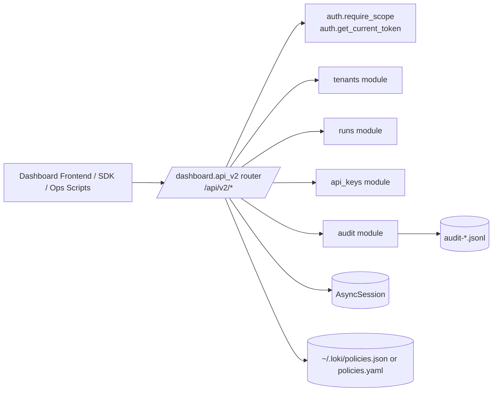
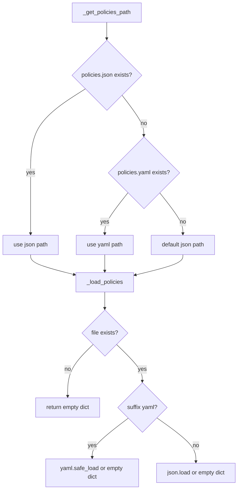
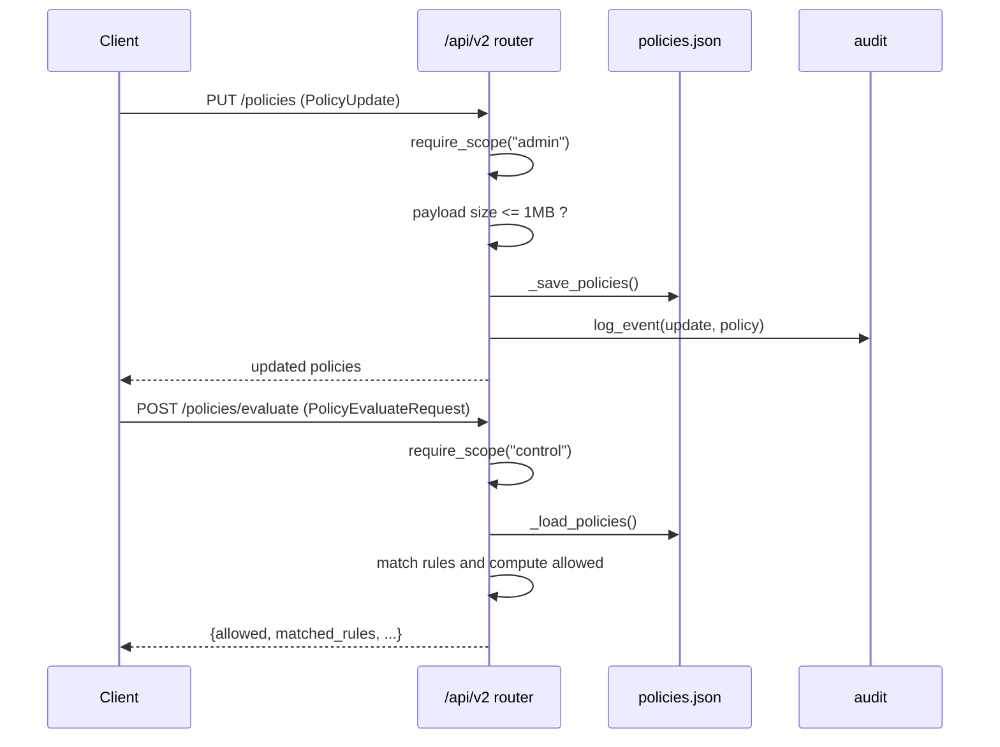
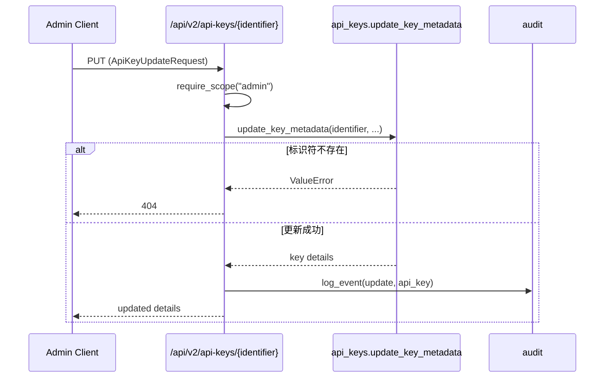

# v2_admin_and_governance_api 模块文档

## 模块简介：它解决了什么问题，为什么存在

`v2_admin_and_governance_api` 对应 `dashboard/api_v2.py` 中的 `/api/v2` 路由层，是 Dashboard Backend 在“多租户治理、运行控制、API Key 管理、策略评估、审计可追溯”上的统一入口。这个模块的核心价值不是实现底层领域逻辑本身，而是把多个后端子系统（`tenants`、`runs`、`api_keys`、`auth`、`audit`）编排成一套一致的 v2 REST API：统一鉴权（scope）、统一错误语义（HTTPException）、统一审计写入（`audit.log_event`）、统一输入模型（Pydantic）。

从设计上看，这是一层“治理外壳（governance facade）”。它把内部能力暴露给 UI、SDK 与自动化工具，同时尽可能把高风险操作（更新策略、旋转密钥、删除资源）包裹在可审计和可授权的边界内。这就是它存在的根本原因：让系统的“可操作性”与“可治理性”同时成立。

在模块树中，当前文档聚焦于 `v2_admin_and_governance_api` 子模块的核心类型：

- `dashboard.api_v2.PolicyEvaluateRequest`
- `dashboard.api_v2.ApiKeyUpdateRequest`
- `dashboard.api_v2.PolicyUpdate`

不过这些类型只在完整路由上下文中才有意义，因此本文会同时解释它们所在的 API 流程。

---

## 在整体系统中的位置



这张图的重点是：`api_v2.py` 本身是“路由编排层”，并不直接承载全部业务细节。比如租户和运行态管理落在 `tenants` / `runs`，认证与 token 在 `auth`，而审计存储在 `audit`。这样拆分有两个好处：第一，边界清晰；第二，能够在不破坏 API 入口的前提下独立演进内部实现。

如果你希望深入各子域，请参考：

- [api_surface_and_transport.md](api_surface_and_transport.md)
- [api_key_management.md](api_key_management.md)
- [tenant_context_management.md](tenant_context_management.md)
- [Dashboard Backend.md](Dashboard Backend.md)

---

## 核心组件详解（本模块定义的 3 个 Pydantic 模型）

## `PolicyUpdate`

`PolicyUpdate` 是 `PUT /api/v2/policies` 的请求体模型，结构极简：

```python
class PolicyUpdate(BaseModel):
    policies: dict = Field(..., description="Policy configuration dict")
```

它的作用是把一整份策略配置作为字典提交给服务端。路由逻辑会先做序列化大小校验（UTF-8 编码后不超过 1MB），再落盘为 `policies.json`。这个模型没有定义细粒度字段约束，意味着策略 schema 具备很强的灵活性，但也把“语义正确性”留给调用方或后续策略引擎处理。

**参数与行为语义**：
- `policies`：任意 JSON 对象；在更新接口中会整体覆盖保存。

**返回值**：
- 成功时直接返回提交的 `policies` 内容。

**副作用**：
- 写文件到 `${LOKI_DATA_DIR or ~/.loki}/policies.json`
- 记录审计事件（`action="update", resource_type="policy"`）

---

## `PolicyEvaluateRequest`

`PolicyEvaluateRequest` 对应 `POST /api/v2/policies/evaluate`：

```python
class PolicyEvaluateRequest(BaseModel):
    action: str
    resource_type: str
    resource_id: Optional[str] = None
    context: Optional[dict] = None
```

该模型表达一次“策略检查请求”：调用方给出动作（如 `create`、`delete`）和资源类型（如 `tenant`、`run`），可附加资源 ID 和上下文。当前实现的评估逻辑是轻量匹配器：遍历 `policies.rules`，按 `action/resource_type`（支持 `*`）匹配，若命中任意 `effect=deny` 则拒绝。

**参数与行为语义**：
- `action`：待验证动作。
- `resource_type`：资源类别。
- `resource_id`：可选，当前评估逻辑未强依赖。
- `context`：可选上下文，当前逻辑保留但未参与判定。

**返回值**：
- `allowed: bool`
- `matched_rules: list`
- 回显 `action/resource_type`

**副作用**：
- 无数据库写入；仅读取策略文件。

> 重要限制：`resource_id` 与 `context` 在当前实现中主要是“前瞻字段”，并未进入实际判定路径。

---

## `ApiKeyUpdateRequest`

`ApiKeyUpdateRequest` 用于 `PUT /api/v2/api-keys/{identifier}`，负责更新密钥元数据：

```python
class ApiKeyUpdateRequest(BaseModel):
    description: Optional[str] = None
    allowed_ips: Optional[list[str]] = None
    rate_limit: Optional[int] = None
```

这不是密钥值轮换模型（轮换用 `ApiKeyRotateRequest`，定义在 `api_keys` 模块），而是“治理元信息”更新模型。它允许管理员在不重发密钥的情况下调整说明、IP 白名单与速率限制。

**参数与行为语义**：
- `description`：人类可读描述。
- `allowed_ips`：允许访问的 IP 列表。
- `rate_limit`：单 key 限流额度。

**返回值**：
- 由 `api_keys.update_key_metadata(...)` 返回的更新后详情。

**副作用**：
- 修改 token 元数据存储
- 写审计日志（`action="update", resource_type="api_key"`）

---

## 模块内部关键机制（理解三类模型必须知道）

## 1) 策略文件解析与保存



策略读取优先级是 `.json` > `.yaml`。如果两个都不存在，默认返回空策略；如果文件损坏或解析失败，也回退 `{}`。这是一种“高可用优先”的设计：即使策略文件异常，API 不会因为解析错误而整体崩溃，但安全语义会偏向默认放行（见后文风险说明）。

保存策略统一写入 JSON（`_save_policies`），这意味着一旦调用更新接口，最终会标准化到 `policies.json`。

## 2) 审计上下文提取

`_audit_context(request, token_info)` 会提取：

- `ip_address`
- `user_agent`
- `user_id`（token 名称）
- `token_id`

随后被各写操作路由传入 `audit.log_event`。该机制让治理动作具备“谁、从哪、做了什么”的基本可追踪性。

## 3) Scope 鉴权边界

`api_v2` 广泛使用 `auth.require_scope(...)`：

- `read`：查询型接口（列表、详情）
- `control`：运行控制与策略评估
- `admin`：高风险管理（API key create/update/delete/rotate、策略更新）
- `audit`：审计查询与导出

这让接口权限模型在路由层可读、可审查。

---

## 关键流程（治理场景）

## 策略更新与评估流程



这个流程体现了“写-读分离”的治理模式：策略更新是高权限动作，评估是控制动作。评估接口不写状态，因此可被更频繁地调用。

## API Key 元数据更新流程



这里体现了一个约定：`ValueError` 在路由层映射为业务型 HTTP 错误（404/400），防止内部异常细节直接泄露给调用方。

---

## API 使用示例

## 挂载路由

```python
from .api_v2 import router as api_v2_router
app.include_router(api_v2_router)
```

## 更新策略

```bash
curl -X PUT http://localhost:8000/api/v2/policies \
  -H "Authorization: Bearer <admin-token>" \
  -H "Content-Type: application/json" \
  -d '{
    "policies": {
      "rules": [
        {"action": "delete", "resource_type": "tenant", "effect": "deny"},
        {"action": "*", "resource_type": "run", "effect": "allow"}
      ]
    }
  }'
```

## 评估策略

```bash
curl -X POST http://localhost:8000/api/v2/policies/evaluate \
  -H "Authorization: Bearer <control-token>" \
  -H "Content-Type: application/json" \
  -d '{
    "action": "delete",
    "resource_type": "tenant",
    "resource_id": "42",
    "context": {"env": "prod"}
  }'
```

## 更新 API Key 元数据

```bash
curl -X PUT http://localhost:8000/api/v2/api-keys/key_123 \
  -H "Authorization: Bearer <admin-token>" \
  -H "Content-Type: application/json" \
  -d '{
    "description": "CI key for nightly jobs",
    "allowed_ips": ["10.0.0.10", "10.0.0.11"],
    "rate_limit": 500
  }'
```

---

## 错误条件、边界行为与已知限制

当前实现有几个需要特别注意的工程细节。

第一，策略载入失败会返回空字典 `{}`，而评估逻辑默认 `allowed=True`。这意味着“策略文件损坏/缺失”在安全语义上会更接近放行，而不是失败关闭（fail-closed）。如果你的环境强调强安全，建议在网关层增加保护，或修改评估逻辑为 fail-closed。

第二，`PolicyUpdate` 不校验策略 schema，仅限制 payload 大小（1MB）。调用方可能提交语法正确但语义错误的规则，导致评估结果与预期偏离。实践中应配合离线 schema 校验、CI 检查或策略编辑器。

第三，`PolicyEvaluateRequest.context` 与 `resource_id` 当前未用于判定，只是保留字段。不要误以为提交上下文后就自动具备 ABAC 级别策略能力。

第四，策略文件路径优先读取 YAML（当 JSON 不存在）但保存只写 JSON。长期运行后可能出现“历史 YAML + 新 JSON 并存”的状态，应通过运维规范统一策略文件来源。

第五，审计导出 CSV 会把 dict/list 字段 `json.dumps` 后扁平化，方便下载但不保证与原始 JSONL 完全同构；做自动化解析时应优先用 JSON 导出。

第六，部分端点的错误映射不完全一致：例如 rotate API 对 `ValueError` 返回 400，而 update metadata 对 `ValueError` 返回 404。调用 SDK 时建议按接口级别处理，不要假设统一错误码。

---

## 扩展与演进建议

如果你准备扩展本模块，建议沿着“路由薄层、子模块厚逻辑”的原则推进。

一个常见扩展是策略评估增强：可在 `evaluate_policy` 中引入 `resource_id/context` 参与条件匹配，支持租户、环境、时间窗口等属性条件，并把 evaluator 下沉到独立策略引擎模块，避免路由函数持续膨胀。

另一个扩展方向是策略 schema 显式化：为 `PolicyUpdate.policies` 建立版本化 schema（例如 `version`, `rules[]`, `conditions[]`），配合迁移器兼容旧策略文档，可显著降低生产误配风险。

对于 API Key 治理，可考虑在 `ApiKeyUpdateRequest` 增加字段级校验（IP 格式、rate_limit 正值范围）并返回统一错误码模型，以提升客户端体验和可测试性。

---

## 与其他文档的关系

为避免重复，本文不展开以下主题的底层实现：

- 通用 API 边界、WebSocket 与传输层：见 [api_surface_and_transport.md](api_surface_and_transport.md)
- API Key 生命周期管理（创建/轮换等更多上下文）：见 [api_key_management.md](api_key_management.md)
- 租户上下文在 UI 侧的传播：见 [tenant_context_management.md](tenant_context_management.md)
- 后端整体模型与持久化：见 [Dashboard Backend.md](Dashboard Backend.md)

本文件的定位是：解释 `v2_admin_and_governance_api` 作为治理入口层，尤其是 `PolicyEvaluateRequest`、`ApiKeyUpdateRequest`、`PolicyUpdate` 三个核心类型在实际流程中的职责与约束。
