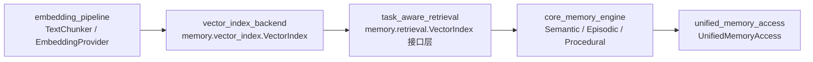
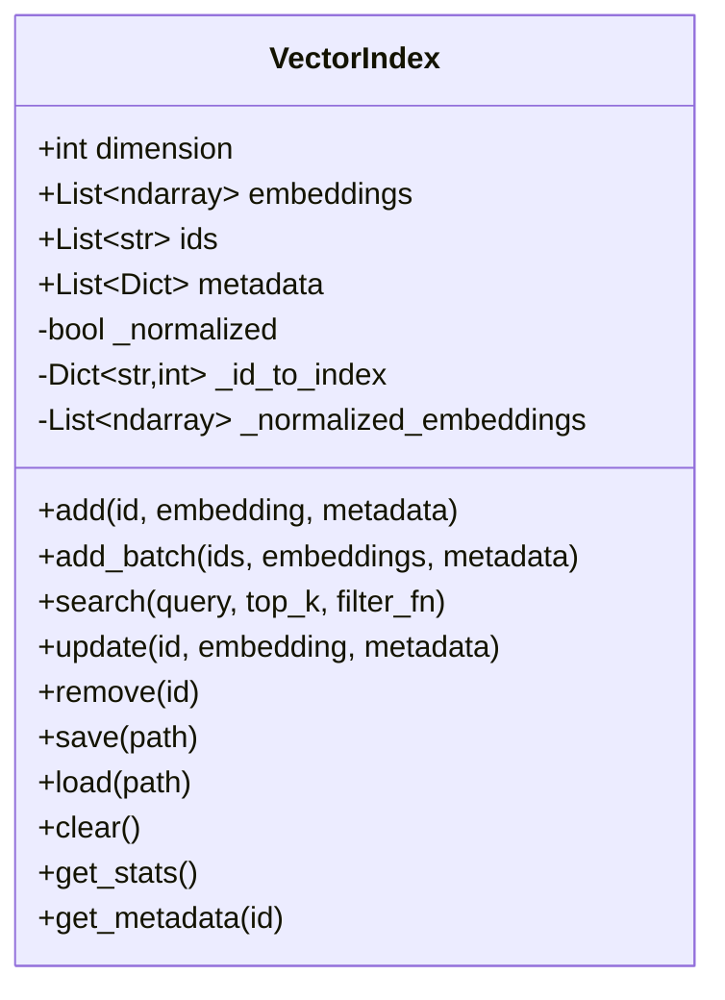
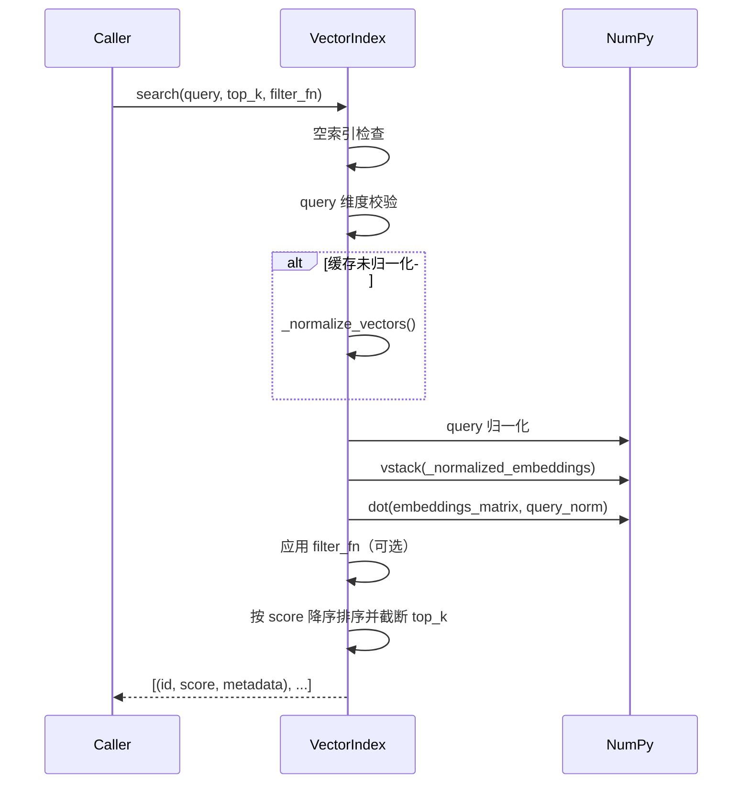

# vector_index_backend 模块文档（`memory.vector_index.VectorIndex`）

## 引言：这个模块做什么、为什么存在

`vector_index_backend` 对应的核心实现是 `memory.vector_index.VectorIndex`。它是一个**纯 NumPy 的向量索引后端**，为内存系统提供最基础的向量存储与相似度检索能力。该模块的定位很明确：在不依赖 FAISS、Milvus、Qdrant 等外部向量数据库的前提下，提供一个轻量、可本地持久化、可直接嵌入 Python 运行时的语义检索底座。

从系统设计角度看，这个模块的价值在于“可用性优先”和“依赖最小化”。在许多开发、测试、离线分析或单机部署场景里，团队并不希望引入重量级索引服务。`VectorIndex` 通过简单的数据结构（`List[np.ndarray]`、ID 列表、metadata 列表）和明确的 API（`add/search/update/remove/save/load`）提供了可预测、可调试的行为，使上层 `Memory System` 可以快速获得 embedding 检索能力。

它并不试图成为超大规模 ANN（Approximate Nearest Neighbor）引擎，而是强调：

- 一致的向量维度约束；
- 基于余弦相似度的可靠排序；
- 本地 `.npz + .json` 持久化；
- 与 metadata 过滤逻辑的直接结合。

如果你希望先搭建一个端到端记忆检索链路，再逐步替换底层索引后端，这个模块就是非常合适的“第一层实现”。

---

## 在整体系统中的位置

`VectorIndex` 位于 `Memory System` 下的 `vector_index_backend` 子模块。它通常会被上层检索与记忆编排模块调用，例如任务感知检索、统一内存访问等流程会把 embedding 结果交给它进行相似度排序。



上图表达的是常见职责分层：`embedding_pipeline` 负责把文本变成向量，`vector_index_backend` 负责存和查向量，上层 retrieval/engine 负责业务语义与记忆策略。这种分层使你在未来替换底层索引实现时，不必整体重写记忆系统。

建议联读：

- [embedding_pipeline.md](embedding_pipeline.md)
- [task_aware_retrieval.md](task_aware_retrieval.md)
- [unified_memory_access.md](unified_memory_access.md)
- [Memory System.md](Memory System.md)

---

## 核心架构与内部数据模型

`VectorIndex` 的内部结构非常直接，但实现上有几个关键设计点：

1. 向量本体以 `self.embeddings: List[np.ndarray]` 保存。
2. `self.ids` 与 `self.metadata` 与向量列表保持同下标对齐。
3. `self._id_to_index` 维护 ID 到下标的映射，支持 O(1) 定位更新/删除。
4. `self._normalized` + `self._normalized_embeddings` 构成一个“延迟归一化缓存”。只有在检索时才会归一化；只要数据变更，缓存失效。



这种实现风格的好处是易懂、调试成本低。代价是删除元素会触发列表重排并重建索引映射，在高频删除、大规模数据集场景下可能出现性能瓶颈。

---

## 检索流程详解（余弦相似度）

`search` 方法是模块的核心路径。它的处理顺序是：



这里的关键点是“缓存归一化向量”。它避免了每次检索都对全量原始向量重复归一化。只要你不进行 `add/update/remove/clear/load` 等修改，连续查询会重复利用缓存，降低 CPU 开销。

---

## `VectorIndex` API 全量行为说明

### 1) `__init__(dimension: int = 384)`

构造函数初始化索引维度和内部存储。默认 384 对应 MiniLM 常见 embedding 维度。这个维度是索引级别的强约束，后续所有向量与查询都必须严格匹配。

### 2) `add(id, embedding, metadata=None)`

`add` 用于写入单条向量记录。方法先做维度校验，再判断 ID 是否已存在。若已存在，它不会报错，而是转为 `update` 语义（覆盖 embedding 与 metadata）；若不存在则追加新记录。该设计减少了上层调用方显式“先查再写”的负担。

副作用包括：

- 新增或更新后会将 `_normalized` 设为 `False`，使后续查询重新构建归一化缓存。
- 新增时会写入 `_id_to_index`。

### 3) `add_batch(ids, embeddings, metadata=None)`

批量写入入口，要求 `embeddings` 为二维数组 `(n_vectors, dimension)`，并且 `ids`、`metadata`（如提供）长度严格一致。内部实现实际上逐条调用 `add`，因此它继承了重复 ID 自动更新的行为。

这意味着“批量写入不是事务性的”：如果中途某条记录触发异常（例如维度错误），之前成功写入的条目不会自动回滚。

### 4) `search(query, top_k=5, filter_fn=None)`

返回 `(id, score, metadata)` 的列表，按相似度降序。相似度使用余弦计算，向量与查询均做归一化（查询归一化时加 `1e-10` 避免除零）。`filter_fn` 是 metadata 级过滤钩子，可用于租户隔离、类型筛选、时间窗筛选等。

需要注意：如果 `top_k` 大于命中数量，返回实际命中数；若索引为空，直接返回空列表而非异常。

### 5) `remove(id)`

按 ID 删除记录，成功返回 `True`，不存在返回 `False`。删除后会重建 `_id_to_index`，并使归一化缓存失效。因为底层是列表删除，这一步的时间复杂度包含元素搬移成本。

### 6) `update(id, embedding=None, metadata=None)`

更新已有记录。可只改 embedding、只改 metadata，或同时改。若 ID 不存在返回 `False`。若提供 embedding 会做维度校验，并使归一化缓存失效。metadata 是“替换语义”而不是 merge。

### 7) `save(path)` / `load(path)` / `from_file(path)`

持久化采用双文件：

- `path.npz`：保存 embeddings 与 dimension；
- `path.json`：保存 ids、metadata、dimension。

`load` 会检查两个文件存在性，否则抛 `FileNotFoundError`。加载后重建 ID 索引并失效归一化缓存。`from_file` 是便捷工厂，内部流程是 `cls()` 后调用 `load()`。

### 8) 查询与运维辅助方法

- `__len__`：返回向量数量；
- `__contains__`：支持 `id in index` 判断；
- `get_ids()`：返回 ID 列表副本；
- `get_metadata(id)`：按 ID 查 metadata，不存在返回 `None`；
- `clear()`：清空索引；
- `get_stats()`：返回数量、维度、估算内存（字节）。

`get_stats()` 的内存统计是估算值，不等同于 Python 实际进程占用。

---

## 典型使用方式

### 基础写入与检索

```python
import numpy as np
from memory.vector_index import VectorIndex

index = VectorIndex(dimension=384)

index.add(
    id="doc-1",
    embedding=np.random.rand(384).astype(np.float32),
    metadata={"tenant": "acme", "type": "episode"}
)

query = np.random.rand(384).astype(np.float32)
results = index.search(query, top_k=3)

for item_id, score, meta in results:
    print(item_id, score, meta)
```

### 带 metadata 过滤的检索

```python
results = index.search(
    query=query,
    top_k=10,
    filter_fn=lambda m: m.get("tenant") == "acme" and m.get("type") == "episode"
)
```

### 落盘与恢复

```python
index.save("./data/memory_index")

restored = VectorIndex.from_file("./data/memory_index")
print(len(restored), restored.get_stats())
```

---

## 配置与扩展建议

这个模块的显式配置项很少，核心只有 `dimension`。但在工程实践中，你仍应把以下策略视为“外部配置”并在调用层统一管理：

- embedding 模型与维度绑定策略（防止索引与模型错配）；
- metadata 规范（如 tenant、project、memory_type、timestamp 字段约定）；
- 检索参数（`top_k` 默认值、过滤函数工厂）；
- 持久化路径与快照策略（何时 `save`、如何版本化）。

如果要扩展该后端，常见方向包括：

1. 增量持久化与 WAL（避免全量重写）。
2. 更高效的删除策略（如 tombstone + 周期 compact）。
3. 并发安全封装（读写锁、复制快照）。
4. 替换/桥接 ANN 后端，同时保持 `VectorIndex` 兼容接口，降低上层改动。

---

## 边界条件、错误条件与已知限制

### 维度与数据形状

最常见异常来自维度不匹配：`add/update/search` 都会做严格检查并抛 `ValueError`。`add_batch` 还会验证二维形状和长度一致性。

### 零向量行为

- 数据向量在 `_normalize_vectors` 中若范数为 0，会保留为零向量；
- 查询向量归一化使用 `+1e-10`，零向量查询会得到全 0 相似度；
- `_cosine_similarity`（当前内部未用于主检索路径）对零范数返回 `0.0`。

这保证了数值稳定性，但语义上“零向量查询”基本没有检索价值。

### 持久化一致性

`save` 会写两个文件；若进程在中间失败，可能只写成功其中一个，后续 `load` 会因缺失文件失败。生产环境建议写入临时文件并原子 rename，或由外层做快照完整性检查。

### 并发与线程安全

该实现没有锁。多线程同时读写时可能出现竞态（例如一个线程在 `search`，另一个线程 `remove`）。在并发场景请由上层加锁或采用单线程写、多线程只读快照。

### 性能上限

检索是全量点积（`np.dot`）+ Python 层排序，复杂度近似 O(N·D + NlogN)。当 N 很大时，延迟会明显增加。该模块更适合中小规模或开发环境；超大规模检索可考虑专用向量引擎。

### `NUMPY_AVAILABLE` 标记

模块顶部设置了 `NUMPY_AVAILABLE`，但 `VectorIndex` 方法本身依赖 `np`。若环境未安装 numpy，实例化后调用相关方法将失败。实践上应把 numpy 作为运行时必需依赖。

---

## 与其他模块的关系（避免重复）

`vector_index_backend` 只负责“向量索引后端”这一层，不负责文本切分、embedding 生成、记忆分层策略或任务语义编排。请将这些职责分别参考以下文档：

- 文本切分与 embedding：[`embedding_pipeline.md`](embedding_pipeline.md)
- 检索接口与任务感知逻辑：[`task_aware_retrieval.md`](task_aware_retrieval.md)
- 统一访问与跨域编排：[`unified_memory_access.md`](unified_memory_access.md)
- 内存系统全景：[`Memory System.md`](Memory System.md)

这种“后端实现与业务策略分离”的架构，是该模块能够被替换或复用的关键。

---

## 维护者快速检查清单

在维护或扩展 `VectorIndex` 时，建议优先验证三件事：第一，所有写路径都正确失效 `_normalized` 缓存；第二，`ids/embeddings/metadata` 三个列表在任何异常路径下都保持对齐；第三，`save/load` 后维度、数量与 ID 映射完全一致。只要这三条不破坏，模块的核心行为通常可保持稳定。
