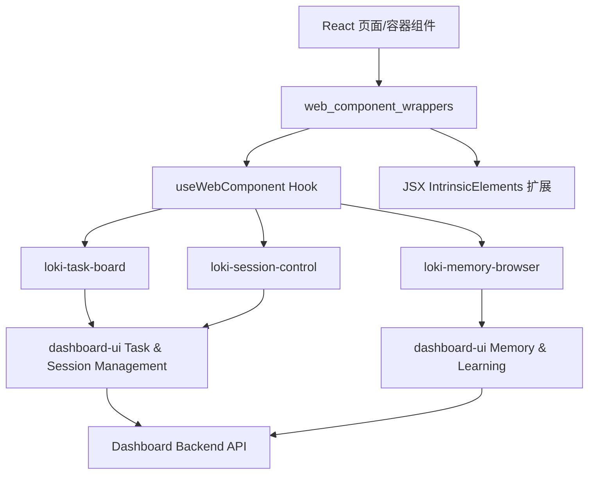
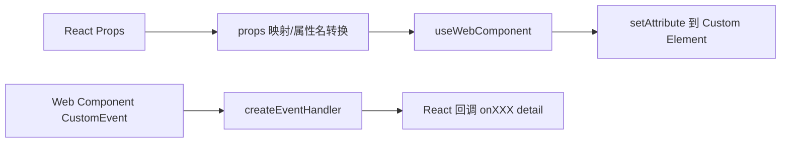
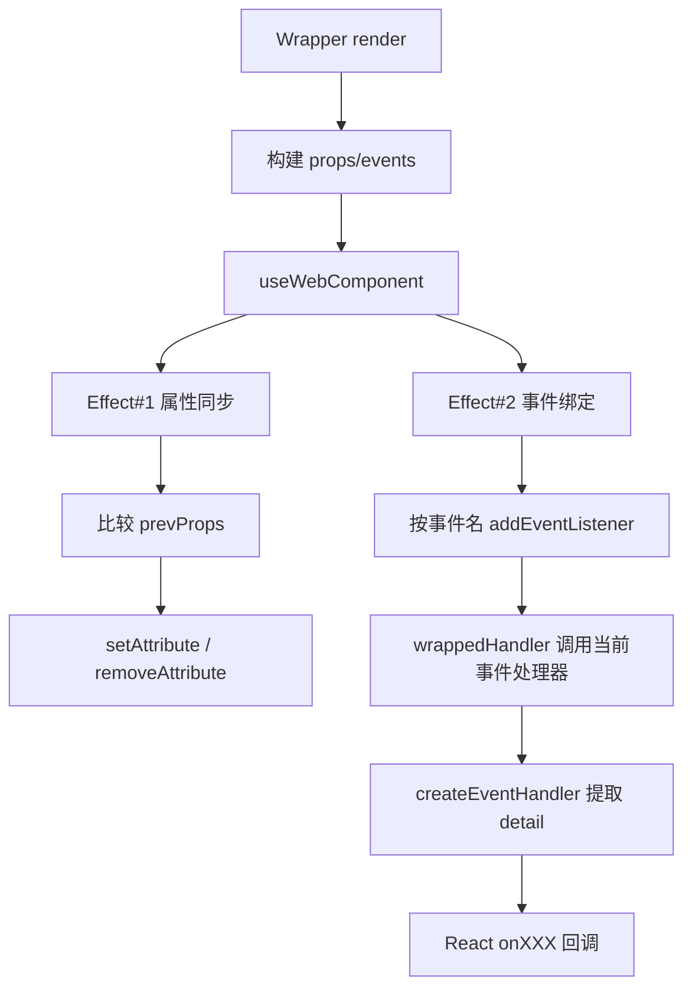
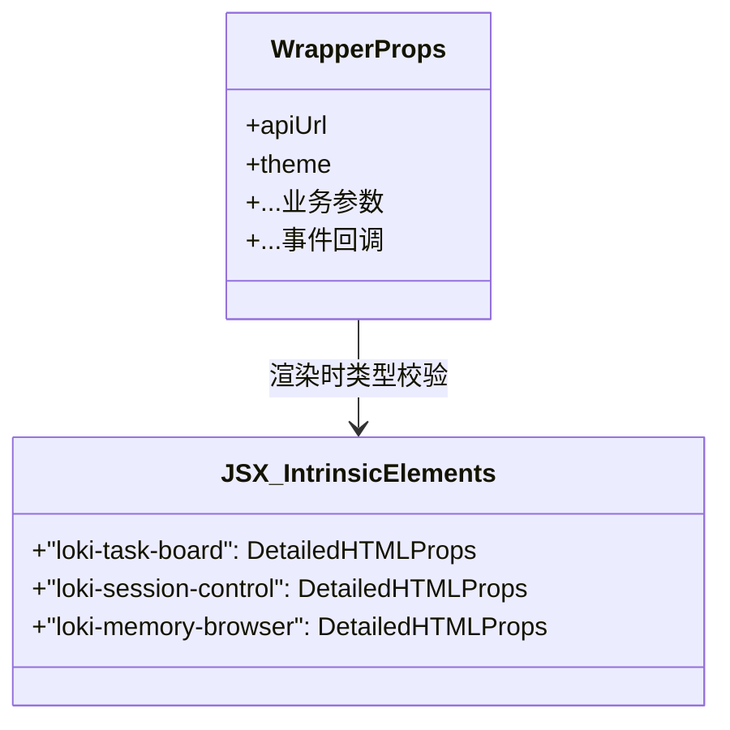
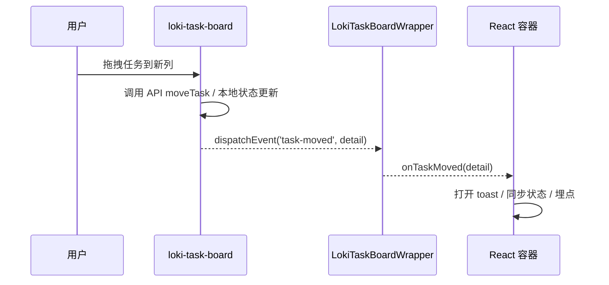
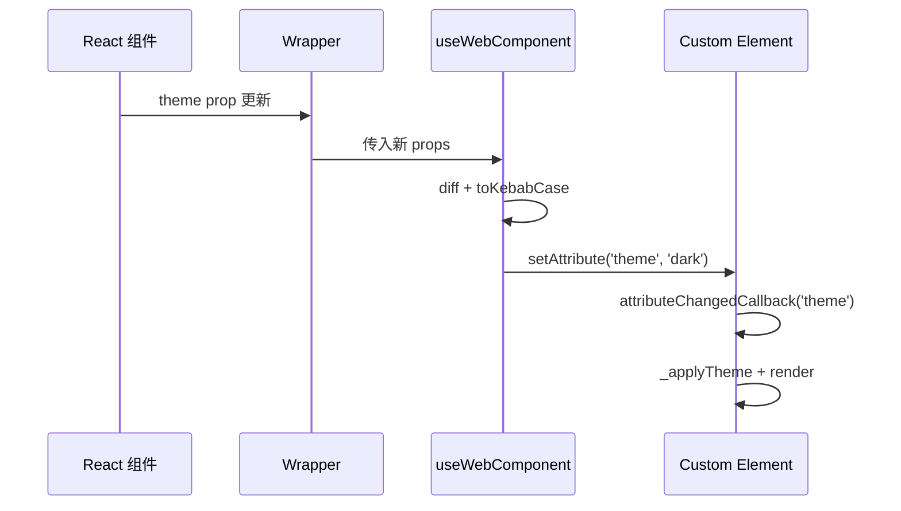

# web_component_wrappers 模块文档

## 概述：模块目的与存在价值

`web_component_wrappers` 是 Dashboard Frontend 中一个非常关键但经常被低估的“桥接层”模块。它的核心职责不是实现业务 UI，而是把 `dashboard-ui` 中基于 Web Components（Custom Elements）的组件，包装成 React 应用可以自然使用、具备 TypeScript 类型提示、且事件处理符合 React 开发习惯的接口。

这个模块存在的根本原因是：React 与 Web Components 在属性传递、事件监听、类型系统（尤其是 JSX `IntrinsicElements`）上并不是天然无缝的。直接在 React 里写 `<loki-task-board />` 虽然可行，但很容易遇到这些问题：属性名格式不一致（camelCase vs kebab-case）、CustomEvent 细节类型丢失、回调细节不明确、IDE 无法感知组件属性，甚至在团队协作中出现隐式契约漂移。`web_component_wrappers` 通过统一封装，降低了这些集成成本。

当前模块包含 3 个包装器：

- `LokiTaskBoardWrapper`
- `LokiSessionControlWrapper`
- `LokiMemoryBrowserWrapper`

它们分别对应 `dashboard-ui` 的三个核心业务组件（任务看板、会话控制、记忆浏览器）。如果你把 Dashboard Frontend 看成“React 应用壳 + Web Component 功能内核”，那么本模块就是两者之间的标准适配层。

---

## 在整体系统中的位置

从模块树看，`web_component_wrappers` 隶属于 **Dashboard Frontend**，它的上游是 React 页面与容器组件，下游是 `dashboard-ui.components.*` 中的自定义元素，再往下会通过 API client 访问 Dashboard Backend。



上图体现了模块的设计边界：包装器本身不负责数据存储和业务决策，而是负责“正确传参与事件转译”。真正的数据拉取与业务行为由 `dashboard-ui` 的 Web Component 实现。

可参考的相关文档（避免重复阅读同一层内容）：

- [Dashboard Frontend.md](Dashboard Frontend.md)
- [Dashboard UI Components.md](Dashboard UI Components.md)
- [Task and Session Management Components.md](Task and Session Management Components.md)
- [Memory and Learning Components.md](Memory and Learning Components.md)
- [Web Component 包装器.md](Web Component 包装器.md)（如存在历史文档）

---

## 模块架构与核心机制

### 1) 包装器统一模式

三个包装器都遵循同一模式：

1. 定义与 Web Component 对齐的 TypeScript 类型（`Props`、事件 detail 类型、主题枚举等）。
2. 在 `declare global` 中扩展 JSX `IntrinsicElements`，让 React/TS 识别自定义标签。
3. 将 React props 映射为 Web Component attributes，通过 `useWebComponent` 自动同步。
4. 将 Web Component 的 `CustomEvent` 通过 `createEventHandler` 转成“只暴露 detail”的 React 风格回调。



这个模式最重要的价值是稳定契约：前端页面只面对“普通 React 组件”，不必知道底层 DOM API 细节。

### 2) 与 `useWebComponent` 的协作

包装器严重依赖 `../../hooks/useWebComponent`，关键行为包括：

- `toKebabCase`：把属性名规范化成 kebab-case。
- `setAttribute`：处理 `string/number/boolean/null/undefined/复杂对象` 的 attribute 同步策略。
- `events` 绑定：仅绑定声明的事件名，且用内部 ref 保证 handler 可热更新。
- `updateProp` 与 `dispatchEvent`：提供手动更新与主动发事件能力（当前包装器主要使用 `ref`）。

这意味着包装器是“轻逻辑层”，核心通用机制在 hook 中。

---

### 3) `useWebComponent` 在本模块中的真实调用语义

从这三个 wrapper 的实际调用方式看，`useWebComponent` 的参数和返回值在工程上具有明确分工。`tagName` 当前被保留用于未来校验/调试（函数体中以 `void _tagName` 消费），并不参与运行时查询元素；`props` 是属性同步的主入口；`events` 是事件绑定声明；`serializeComplexValues` 默认开启，在本模块中虽然未显式传值，但会沿用默认行为。

`useWebComponent` 返回 `{ ref, updateProp, dispatchEvent }`。当前三个 wrapper 只使用了 `ref`，因为它们的目标是“声明式包装”，不暴露命令式 API。但你在扩展 wrapper（例如需要主动触发某些控制事件）时，可以安全使用 `dispatchEvent`，而无需直接操作 `ref.current.dispatchEvent(...)`。

`useWebComponent` 的副作用主要体现在两类 `useEffect`：第一类在 `props` 变化时执行 attribute diff（新增/更新/删除），并把 `prevProps` 记录到 `prevPropsRef`；第二类在“事件名集合变化”时重绑监听器。注意第二类 effect 的依赖是 `Object.keys(events).join(',')`，这意味着**同名事件的回调函数发生变化时不会重绑监听器**，而是通过 `eventsRef.current` 读取最新 handler，这是一种显式的性能与一致性优化。



这个机制解释了为什么 wrapper 可以做到“每次 render 都传新闭包，但监听器无需频繁卸载重绑”。


## 核心组件详解

> 虽然模块树把核心点标记为 `IntrinsicElements`，但在工程实践中，真正可复用接口是三个 Wrapper 组件本身。`IntrinsicElements` 是类型系统层面的关键支撑。

## `LokiTaskBoardWrapper`

`LokiTaskBoardWrapper` 为 `<loki-task-board>` 提供 React 语义入口，主要解决任务看板的属性注入与事件回调转译。

### 内部工作方式

组件会根据是否提供 `onTaskMoved`、`onAddTask`、`onTaskClick` 来构建 `events` 字典，只注册必要监听器。随后调用：

- `tagName: 'loki-task-board'`
- `props`: `api-url`、`project-id`、`theme`、`readonly`
- `events`: `task-moved`、`add-task`、`task-click`

最终渲染的是原生 custom element：

```tsx
<loki-task-board ref={ref} className={className} style={style} />
```

### Props 与行为说明

- `apiUrl?: string`：API 基地址，默认 `http://localhost:57374`。
- `projectId?: string`：项目过滤条件。
- `theme?: ThemeName`：主题。
- `readonly?: boolean`：只读模式，禁用拖拽与编辑交互（依赖底层组件实现）。
- `onTaskMoved?(detail)`：任务状态迁移事件。
- `onAddTask?(detail)`：用户触发新增任务动作。
- `onTaskClick?(detail)`：用户点击任务卡片。

事件 detail 类型：

- `TaskMovedEventDetail`: `{ taskId, oldStatus, newStatus }`
- `AddTaskEventDetail`: `{ status }`
- `TaskClickEventDetail`: `{ task }`

### 与底层 Web Component 的对应

底层 `LokiTaskBoard` 会在拖拽成功后 dispatch `task-moved`，在“新增任务”按钮 dispatch `add-task`，在点击卡片时 dispatch `task-click`。包装器不改写语义，仅把 `event.detail` 提取出来。

---

## `LokiSessionControlWrapper`

`LokiSessionControlWrapper` 对应 `<loki-session-control>`，用于会话生命周期控制面板的集成。

### 内部工作方式

与 TaskBoardWrapper 类似，它将 props 注入到 `api-url/theme/compact`，并把 session 事件映射为 React 回调：

- `session-start`
- `session-pause`
- `session-resume`
- `session-stop`

### Props 与行为说明

- `compact?: boolean`：是否紧凑布局，默认 `false`。
- `onSessionStart/onSessionPause/onSessionResume/onSessionStop`：会话状态操作回调。
- 其他基础项与 TaskBoardWrapper 一致（`apiUrl/theme/className/style`）。

`SessionEventDetail` 提供运行模式、phase、iteration、连接状态、uptime、活跃 agent 数、待处理任务数等信息。

### 与底层组件的关键耦合点

底层 `LokiSessionControl` 内部会轮询 `getStatus`（每 3 秒）并监听连接状态事件，同时在 pause/resume/stop 时调用 API 后触发对应 CustomEvent。包装器拿到的是“最终事件 detail”。

**重要注意**：当前底层渲染代码中没有实际可点击的 `start-btn`，但仍保留 `session-start` 相关方法与监听逻辑。也就是说，`onSessionStart` 在当前 UI 下可能不会被自然触发，除非未来 UI 增加 start 按钮或外部主动触发。

---

## `LokiMemoryBrowserWrapper`

`LokiMemoryBrowserWrapper` 对应 `<loki-memory-browser>`，用于浏览 summary/episodes/patterns/skills 四类记忆数据。

### 内部工作方式

包装器把 React 层的：

- `apiUrl`
- `theme`
- `tab`

映射到 Web Component 属性：

- `api-url`
- `theme`
- `tab`

并提供三类选择事件回调：

- `episode-select`
- `pattern-select`
- `skill-select`

### Props 与事件 detail

- `tab?: 'summary' | 'episodes' | 'patterns' | 'skills'`：初始 tab。
- `onEpisodeSelect(episode)`：详情面板选择 episode。
- `onPatternSelect(pattern)`：选择 pattern。
- `onSkillSelect(skill)`：选择 skill。

底层 `LokiMemoryBrowser` 还包含“Consolidate Memory”动作与刷新机制，但包装器当前没有专门暴露 consolidate 事件；该行为由 Web Component 内部直接调用 API。

---

## `IntrinsicElements`：类型系统层的核心组件

三个包装文件都通过 `declare global { namespace JSX { interface IntrinsicElements { ... }}}` 扩展了 JSX 标签定义。这一步是使 TypeScript 识别 `<loki-task-board>` 等标签的关键，否则会出现“JSX element implicitly has type 'any'”类错误。

这也是模块树中把 `IntrinsicElements` 标记为核心组件的原因：它定义了 React 编译期对自定义元素的合法性与属性类型约束。



其设计取舍是“局部声明 + 文件内自包含”，优点是阅读单个 wrapper 即可理解约束，缺点是多个 wrapper 重复声明主题类型，长期可能出现漂移。

---

## 关键数据流与交互流程

### 任务拖拽事件端到端流程



包装器在这个链路中不做业务判定，只负责“把 CustomEvent.detail 安全地递交给 React 回调”。

### 属性同步流程（以 `theme` 变更为例）



---

## 使用方式与典型示例

在 React 页面中通常直接使用 wrapper，而不是直接写 custom element。

```tsx
import {
  LokiTaskBoardWrapper,
  LokiSessionControlWrapper,
  LokiMemoryBrowserWrapper,
} from './components/wrappers';

export function DashboardPage() {
  return (
    <>
      <LokiSessionControlWrapper
        apiUrl={import.meta.env.VITE_API_URL}
        theme="dark"
        onSessionPause={(detail) => console.log('paused', detail.mode)}
        onSessionResume={(detail) => console.log('resume', detail.mode)}
      />

      <LokiTaskBoardWrapper
        apiUrl={import.meta.env.VITE_API_URL}
        projectId="42"
        onTaskMoved={({ taskId, oldStatus, newStatus }) => {
          console.log(`Task ${taskId}: ${oldStatus} -> ${newStatus}`);
        }}
      />

      <LokiMemoryBrowserWrapper
        apiUrl={import.meta.env.VITE_API_URL}
        tab="episodes"
        onEpisodeSelect={(episode) => console.log(episode.id)}
      />
    </>
  );
}
```

建议将 `apiUrl` 抽为统一配置，避免各处默认值分散。

---

## 配置与扩展建议

如果你要新增一个新的 Web Component Wrapper（例如 `LokiRunManagerWrapper`），建议遵循现有模板：

1. 在 wrapper 中定义与底层事件 detail 对齐的类型。
2. 声明 JSX `IntrinsicElements`，写明 attribute 类型（尤其 boolean 与 kebab-case 属性）。
3. 使用 `useWebComponent` 统一同步 props/events。
4. 只在有回调时注册事件，避免无效监听。
5. 在注释中提供最小可运行示例。

简化模板如下：

```tsx
const events: Record<string, WebComponentEventHandler> = {};
if (onSomething) {
  events['something'] = createEventHandler(onSomething) as WebComponentEventHandler;
}

const { ref } = useWebComponent({
  tagName: 'my-element',
  props: { 'api-url': apiUrl, theme },
  events,
});

return <my-element ref={ref as React.RefObject<HTMLElement>} />;
```

---

## 边界条件、错误场景与已知限制

这个模块本身逻辑较薄，但有一些工程上非常重要的“坑位”：

- 默认 `apiUrl` 固定为 `http://localhost:57374`。在生产环境如果忘记覆盖，会导致跨域或连接失败。
- wrapper 中 `ThemeName` 在多个文件重复定义；若 `dashboard-ui` 新增主题而 wrapper 未同步，会出现“底层支持但类型报错”的漂移。
- `onSessionStart` 目前可能不触发（底层界面缺 start 按钮）。
- `readonly`、`compact` 作为 boolean attribute 受 HTML 语义影响：存在即 true。`useWebComponent` 已做处理（false 时移除 attribute），但自定义直接操作 DOM 时要注意。
- 事件回调严格依赖 `CustomEvent.detail`。如果底层改成普通 Event 或 detail 结构变化，TypeScript 在 wrapper 侧不一定能第一时间发现运行时不一致。
- `projectId` 是字符串传入，底层 `LokiTaskBoard` 会 `parseInt`。非数字字符串可能导致过滤行为异常。
- `useWebComponent` 对 props 采用浅比较与 attribute 同步；传入复杂对象时会序列化（默认开启）。当前三个 wrapper 主要传基本类型，因此风险较小，但扩展新 wrapper 时要评估 JSON 序列化成本与兼容性。

---

## 维护建议

从维护角度看，`web_component_wrappers` 最需要关注的是“契约一致性”：

- 与 `dashboard-ui` 的 attribute 名、事件名、detail 结构保持同步。
- 与 `dashboard-ui/types` 保持类型镜像一致（可考虑提取共享类型包，减少手工镜像）。
- 新增 wrapper 时优先复用 `useWebComponent`，避免出现“某个 wrapper 用 DOM API 手工绑定”造成行为不一致。

当你发现 React 页面里频繁直接使用 `ref.current?.dispatchEvent(...)` 或 `setAttribute(...)` 时，通常意味着包装器接口还不够完整，应回到本模块进行能力补全，而不是让页面层承担桥接细节。

---

## 总结

`web_component_wrappers` 是 Dashboard Frontend 中承上启下的适配层。它不直接创造业务功能，却决定了 React 与 Web Components 的协作质量。通过类型化 props、标准事件转译、JSX 标签声明与统一 hook 机制，该模块显著降低了跨技术栈集成的心智负担，也为后续组件扩展提供了稳定模板。

如果你是首次接手该模块，建议先读 `useWebComponent` 的实现，再对照三个 wrapper 与对应 `dashboard-ui` 组件行为核对一遍契约，就能快速建立完整认知闭环。