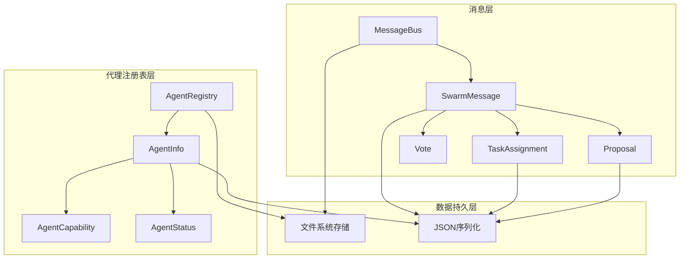
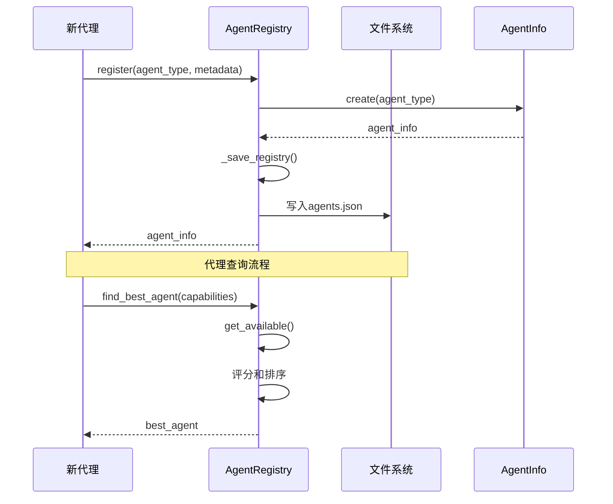
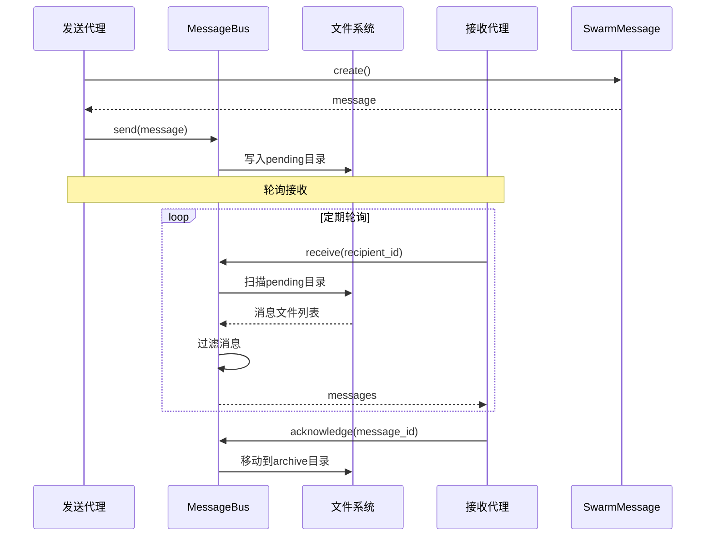
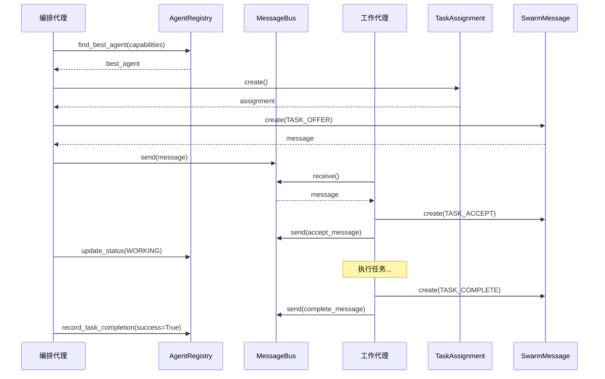

# 代理注册表与消息系统

## 概述

代理注册表与消息系统是Swarm多代理框架的核心基础设施模块，负责管理代理的注册、发现和通信。该模块提供了一套完整的机制，用于跟踪活跃代理、基于能力进行代理匹配、以及实现代理间的可靠消息传递。

### 核心功能

- **代理注册表**：维护代理的生命周期、能力和状态信息
- **能力匹配**：基于任务需求智能选择最合适的代理
- **消息总线**：实现代理间的异步通信
- **共识机制**：支持代理间的投票和决策
- **任务委派**：提供任务分配和执行跟踪

### 设计理念

该模块采用了分布式系统设计原则，支持动态代理加入和离开，通过文件系统实现持久化存储，确保在系统重启后能够恢复状态。消息传递采用异步模式，避免了代理间的直接耦合，提高了系统的可扩展性和可靠性。

## 模块架构



## 核心组件详解

### AgentInfo - 代理信息

`AgentInfo` 类是代理注册表的核心数据结构，用于存储和管理单个代理的完整信息。

#### 主要属性

- **id**: 代理的唯一标识符，格式为 `agent-{type}-{uuid}`
- **agent_type**: 代理类型，如 `eng-frontend`、`ops-devops` 等
- **swarm**: 代理所属的群体类别，如 `engineering`、`operations` 等
- **status**: 代理当前状态（IDLE、WORKING、WAITING、FAILED、TERMINATED）
- **capabilities**: 代理能力列表，包含能力名称、熟练度等信息
- **tasks_completed**: 已完成任务计数
- **tasks_failed**: 失败任务计数
- **current_task**: 当前正在处理的任务ID
- **created_at**: 代理创建时间
- **last_heartbeat**: 最后心跳时间
- **metadata**: 附加元数据字典

#### 关键方法

```python
@classmethod
def create(cls, agent_type: str) -> AgentInfo:
    """工厂方法创建新代理，自动设置群类别和默认能力"""
```

```python
def has_capability(self, capability: str) -> bool:
    """检查代理是否具有特定能力"""
```

```python
def get_capability(self, capability: str) -> Optional[AgentCapability]:
    """获取特定能力的详细信息"""
```

```python
def update_heartbeat(self) -> None:
    """更新最后心跳时间戳"""
```

```python
def record_task_completion(self, success: bool) -> None:
    """记录任务完成情况，更新统计信息和状态"""
```

#### 使用示例

```python
from swarm.registry import AgentInfo

# 创建新的前端工程师代理
agent = AgentInfo.create("eng-frontend")
print(f"Agent ID: {agent.id}")
print(f"Capabilities: {[c.name for c in agent.capabilities]}")

# 检查能力
has_react = agent.has_capability("react")
react_cap = agent.get_capability("react")
print(f"React capability: {react_cap.proficiency if react_cap else 'N/A'}")

# 记录任务完成
agent.record_task_completion(success=True)
```

### AgentRegistry - 代理注册表

`AgentRegistry` 类是代理管理的核心服务，提供代理的注册、发现和查询功能。

#### 主要功能

- **代理注册与注销**：管理代理的加入和离开
- **代理查询**：按类型、群类别、能力等条件查询代理
- **智能匹配**：基于任务需求选择最佳代理
- **状态管理**：跟踪代理状态变更
- **心跳监控**：检测并处理失活代理
- **持久化存储**：自动保存和加载注册表状态

#### 关键方法

```python
def register(self, agent_type: str, metadata: Optional[Dict[str, Any]] = None) -> AgentInfo:
    """注册新代理，返回创建的AgentInfo对象"""
```

```python
def deregister(self, agent_id: str) -> bool:
    """注销代理，返回是否成功"""
```

```python
def find_best_agent(
    self,
    required_capabilities: List[str],
    preferred_type: Optional[str] = None,
) -> Optional[AgentInfo]:
    """
    查找最适合任务的代理
    
    评分算法：
    - 40%: 匹配能力的平均熟练度
    - 40%: 能力覆盖度
    - 20%: 可靠性（基于历史成功率）
    """
```

```python
def get_available(self, agent_type: Optional[str] = None) -> List[AgentInfo]:
    """获取可用代理（IDLE或WAITING状态）"""
```

```python
def get_stale_agents(self, max_age_seconds: int = 300) -> List[AgentInfo]:
    """获取超过指定时间未发送心跳的代理"""
```

```python
def get_stats(self) -> Dict[str, Any]:
    """获取注册表统计信息"""
```

#### 使用示例

```python
from swarm.registry import AgentRegistry, AgentStatus
from pathlib import Path

# 初始化注册表
registry = AgentRegistry(loki_dir=Path(".loki"))

# 注册多个代理
frontend_agent = registry.register("eng-frontend")
backend_agent = registry.register("eng-backend")
devops_agent = registry.register("ops-devops")

# 查询可用代理
available = registry.get_available()
print(f"Available agents: {len(available)}")

# 基于能力查找最佳代理
best_agent = registry.find_best_agent(
    required_capabilities=["react", "typescript"],
    preferred_type="eng-frontend"
)
if best_agent:
    print(f"Best agent: {best_agent.id}")

# 更新代理状态
registry.update_status(
    frontend_agent.id,
    AgentStatus.WORKING,
    task_id="task-123"
)

# 获取统计信息
stats = registry.get_stats()
print(f"Total agents: {stats['total_agents']}")
print(f"By status: {stats['by_status']}")
```

### SwarmMessage - 群体消息

`SwarmMessage` 类是代理间通信的基础消息结构，支持点对点和广播模式。

#### 主要属性

- **id**: 消息唯一标识符
- **type**: 消息类型（见MessageType枚举）
- **sender_id**: 发送者代理ID
- **recipient_id**: 接收者代理ID（None表示广播）
- **payload**: 消息负载字典
- **timestamp**: 消息发送时间
- **correlation_id**: 相关消息的关联ID
- **metadata**: 附加元数据

#### 消息类型

系统支持以下消息类型：

- **投票类**：VOTE_REQUEST、VOTE_RESPONSE、VOTE_RESULT
- **共识类**：PROPOSAL、PROPOSAL_SUPPORT、PROPOSAL_OPPOSE、CONSENSUS_REACHED、CONSENSUS_FAILED
- **委派类**：TASK_OFFER、TASK_ACCEPT、TASK_REJECT、TASK_COMPLETE、TASK_FAILED
- **涌现类**：INSIGHT_SHARE、INSIGHT_COMBINE、INSIGHT_VALIDATE
- **协调类**：HEARTBEAT、STATUS_UPDATE、ESCALATE

#### 使用示例

```python
from swarm.messages import SwarmMessage, MessageType

# 创建点对点消息
message = SwarmMessage.create(
    msg_type=MessageType.TASK_OFFER,
    sender_id="agent-orch-123",
    recipient_id="agent-frontend-456",
    payload={
        "task_id": "task-789",
        "description": "Build login page",
        "priority": 8
    },
    correlation_id="workflow-001"
)

# 创建广播消息
broadcast = SwarmMessage.create(
    msg_type=MessageType.STATUS_UPDATE,
    sender_id="agent-orch-123",
    payload={
        "status": "phase-complete",
        "phase": "design"
    }
)

# 检查是否为广播
is_broadcast = message.is_broadcast()  # False
is_broadcast = broadcast.is_broadcast()  # True
```

### MessageBus - 消息总线

`MessageBus` 类提供基于文件系统的消息传递基础设施，实现异步、可靠的消息交换。

#### 存储结构

消息存储在 `.loki/swarm/messages/` 目录下：
- **pending/**: 待处理消息
- **archive/**: 已处理消息归档

#### 关键方法

```python
def send(self, message: SwarmMessage) -> str:
    """发送消息，返回消息ID"""
```

```python
def receive(
    self,
    recipient_id: str,
    msg_types: Optional[List[MessageType]] = None,
) -> List[SwarmMessage]:
    """接收指定接收者的消息，可按类型过滤"""
```

```python
def acknowledge(self, message_id: str) -> bool:
    """确认并归档消息"""
```

#### 使用示例

```python
from swarm.messages import MessageBus, SwarmMessage, MessageType
from pathlib import Path

# 初始化消息总线
bus = MessageBus(loki_dir=Path(".loki"))

# 发送消息
message = SwarmMessage.create(
    msg_type=MessageType.TASK_OFFER,
    sender_id="agent-1",
    recipient_id="agent-2",
    payload={"task": "do something"}
)
msg_id = bus.send(message)

# 接收消息
messages = bus.receive(
    recipient_id="agent-2",
    msg_types=[MessageType.TASK_OFFER, MessageType.TASK_ACCEPT]
)

for msg in messages:
    print(f"Received: {msg.type} from {msg.sender_id}")
    # 处理消息...
    # 确认消息
    bus.acknowledge(msg.id)

# 获取待处理消息数
pending = bus.get_pending_count()
print(f"Pending messages: {pending}")
```

### TaskAssignment - 任务分配

`TaskAssignment` 类用于表示任务委派信息，包含任务详情、优先级、截止时间等。

#### 主要属性

- **id**: 分配唯一标识符
- **task_id**: 任务ID
- **delegator_id**: 委派者代理ID
- **delegate_id**: 被委派者代理ID
- **task_type**: 任务类型
- **description**: 任务描述
- **required_capabilities**: 所需能力列表
- **priority**: 优先级（1-10）
- **deadline**: 截止时间
- **status**: 状态（pending、accepted、in_progress、completed、failed）
- **result**: 任务结果字典

#### 使用示例

```python
from swarm.messages import TaskAssignment
from datetime import datetime, timedelta, timezone

# 创建任务分配
assignment = TaskAssignment.create(
    task_id="task-123",
    delegator_id="agent-orch-456",
    task_type="frontend-development",
    description="Build responsive landing page with React",
    required_capabilities=["react", "typescript", "responsive-design"]
)

# 设置优先级和截止时间
assignment.priority = 8
assignment.deadline = datetime.now(timezone.utc) + timedelta(days=3)

# 更新状态
assignment.status = "in_progress"
assignment.delegate_id = "agent-frontend-789"

# 完成任务
assignment.status = "completed"
assignment.completed_at = datetime.now(timezone.utc)
assignment.result = {
    "success": True,
    "files_created": ["src/pages/Landing.tsx"],
    "tests_passed": 15
}
```

### Proposal - 提案

`Proposal` 类用于实现代理间的共识决策，支持提案创建、支持/反对投票等。

#### 主要属性

- **id**: 提案唯一标识符
- **proposer_id**: 提案者代理ID
- **title**: 提案标题
- **description**: 详细描述
- **options**: 可选选项列表
- **context**: 决策上下文
- **deadline**: 响应截止时间
- **supporters**: 支持者代理ID列表
- **opposers**: 反对者代理ID列表
- **abstainers**: 弃权者代理ID列表
- **status**: 状态（open、approved、rejected、timeout）

#### 关键方法

```python
def add_support(self, agent_id: str) -> None:
    """添加支持"""
```

```python
def add_opposition(self, agent_id: str) -> None:
    """添加反对"""
```

```python
def add_abstention(self, agent_id: str) -> None:
    """添加弃权"""
```

```python
def get_support_ratio(self, total_voters: int) -> float:
    """获取支持率"""
```

#### 使用示例

```python
from swarm.messages import Proposal
from datetime import datetime, timedelta, timezone

# 创建提案
proposal = Proposal.create(
    proposer_id="agent-orch-123",
    title="Adopt TypeScript for new projects",
    description="Should we use TypeScript for all new frontend development?",
    options=["Yes", "No", "Need more discussion"]
)

# 设置截止时间
proposal.deadline = datetime.now(timezone.utc) + timedelta(hours=24)

# 收集投票
proposal.add_support("agent-frontend-456")
proposal.add_support("agent-frontend-789")
proposal.add_opposition("agent-backend-012")
proposal.add_abstention("agent-devops-345")

# 计算支持率
total_voters = len(proposal.supporters) + len(proposal.opposers) + len(proposal.abstainers)
support_ratio = proposal.get_support_ratio(total_voters)
print(f"Support ratio: {support_ratio:.2%}")

# 更新状态
if support_ratio >= 0.66:
    proposal.status = "approved"
else:
    proposal.status = "rejected"
```

## 代理类型与能力体系

### 群体分类

系统将代理分为8个主要群体类别：

1. **engineering**: 工程技术类
2. **operations**: 运维操作类
3. **business**: 业务运营类
4. **data**: 数据相关类
5. **product**: 产品管理类
6. **growth**: 增长相关类
7. **review**: 评审审核类
8. **orchestration**: 编排协调类

### 代理类型详解

#### 工程类代理

| 代理类型 | 主要能力 | 适用场景 |
|---------|---------|---------|
| eng-frontend | React、Vue、TypeScript、Tailwind、响应式设计 | 前端应用开发 |
| eng-backend | Node、Python、Go、REST、GraphQL、认证授权 | 后端服务开发 |
| eng-database | PostgreSQL、MySQL、MongoDB、Redis、查询优化 | 数据库设计与优化 |
| eng-mobile | React Native、Flutter、Swift、Kotlin | 移动应用开发 |
| eng-api | OpenAPI、SDK生成、版本控制、Webhooks | API设计与开发 |
| eng-qa | 单元测试、集成测试、E2E测试、测试自动化 | 质量保证 |
| eng-perf | 性能分析、基准测试、优化、缓存策略 | 性能优化 |
| eng-infra | Docker、Kubernetes、Terraform、安全加固 | 基础设施建设 |

#### 运维类代理

| 代理类型 | 主要能力 | 适用场景 |
|---------|---------|---------|
| ops-devops | CI/CD、GitHub Actions、GitLab CI、GitOps | DevOps流程建设 |
| ops-sre | 可靠性、SLO/SLI、容量规划、混沌工程 | 站点可靠性工程 |
| ops-security | SAST、DAST、渗透测试、漏洞扫描 | 安全保障 |
| ops-monitor | 可观测性、Datadog、Grafana、告警追踪 | 监控告警 |
| ops-incident | 事件响应、Runbooks、自动修复、RCA | 事件管理 |
| ops-release | 版本控制、功能开关、蓝绿部署、回滚 | 发布管理 |
| ops-cost | 成本分析、资源优化、Spot实例、FinOps | 成本管理 |
| ops-compliance | SOC2、GDPR、HIPAA、PCI-DSS | 合规管理 |

其他类别的代理类型请参考源代码中的完整定义。

## 工作流程

### 代理注册与发现流程



### 消息传递流程



### 任务委派执行流程



## 配置与部署

### 目录结构

```
.loki/
└── swarm/
    ├── registry/
    │   └── agents.json          # 代理注册表持久化
    └── messages/
        ├── pending/              # 待处理消息
        │   ├── 2024-01-15T10-30-00_msg-abc123.json
        │   └── ...
        └── archive/              # 已归档消息
            ├── 2024-01-15T10-25-00_msg-def456.json
            └── ...
```

### 初始化配置

```python
from swarm.registry import AgentRegistry
from swarm.messages import MessageBus
from pathlib import Path

# 自定义存储位置
loki_dir = Path("/path/to/custom/.loki")

# 初始化注册表
registry = AgentRegistry(loki_dir=loki_dir)

# 初始化消息总线
bus = MessageBus(loki_dir=loki_dir)
```

## 最佳实践

### 代理管理

1. **定期心跳**：确保所有活跃代理定期发送心跳（建议间隔30-60秒）
2. **状态更新**：及时更新代理状态，避免任务分配给已忙碌的代理
3. **清理 stale 代理**：定期检查并清理超过5分钟未发送心跳的代理
4. **能力维护**：根据代理实际表现动态调整能力熟练度

### 消息传递

1. **使用 correlation_id**：为相关消息设置关联ID，便于追踪工作流
2. **及时确认**：接收消息后尽快处理并确认，避免重复处理
3. **消息过滤**：使用类型过滤减少处理开销
4. **定期清理**：定期归档或清理已处理的消息

### 任务分配

1. **设置合理优先级**：使用1-10的优先级范围，避免所有任务都是最高优先级
2. **设置截止时间**：为重要任务设置截止时间，便于调度决策
3. **提供足够上下文**：在任务描述和上下文中提供充分信息
4. **跟踪结果**：记录任务结果用于代理评分和改进

## 扩展与集成

### 自定义代理类型

要添加新的代理类型，需要在 `swarm/registry.py` 中更新两个地方：

1. 在 `SWARM_CATEGORIES` 中添加到相应类别
2. 在 `AGENT_CAPABILITIES` 中定义其能力

```python
SWARM_CATEGORIES = {
    # ... 现有类别 ...
    "new_category": ["new-agent-type"],
}

AGENT_CAPABILITIES = {
    # ... 现有类型 ...
    "new-agent-type": ["capability1", "capability2", "capability3"],
}
```

### 自定义消息类型

在 `swarm/messages.py` 的 `MessageType` 枚举中添加新类型：

```python
class MessageType(str, Enum):
    # ... 现有类型 ...
    CUSTOM_MESSAGE = "custom_message"
```

## 注意事项与限制

### 性能考虑

1. **文件系统依赖**：当前实现基于文件系统，在高并发场景下可能成为瓶颈
2. **消息轮询**：接收者需要定期轮询，可能产生延迟
3. **注册表大小**：大量代理时，注册表加载和保存可能较慢

### 错误处理

1. **消息丢失**：系统崩溃时，pending目录中的消息可能丢失
2. **并发冲突**：多个进程同时操作注册表可能导致数据不一致
3. **序列化错误**：复杂对象序列化可能失败，建议保持payload简单

### 已知限制

1. 不支持消息优先级队列
2. 没有消息重试机制
3. 不支持消息持久化确认（at-least-once语义）
4. 没有内置的消息加密机制

## 相关模块

- [Swarm 团队组建](Swarm 团队组建.md) - 了解如何组建和优化代理团队
- [性能跟踪与校准](性能跟踪与校准.md) - 了解如何跟踪和改进代理性能
- [拜占庭容错](拜占庭容错.md) - 了解高级共识机制
