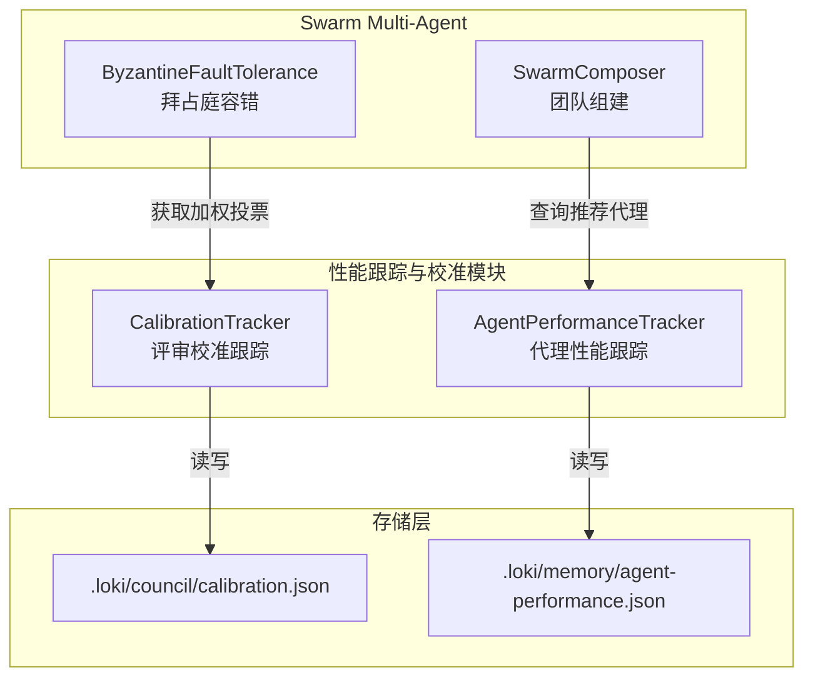
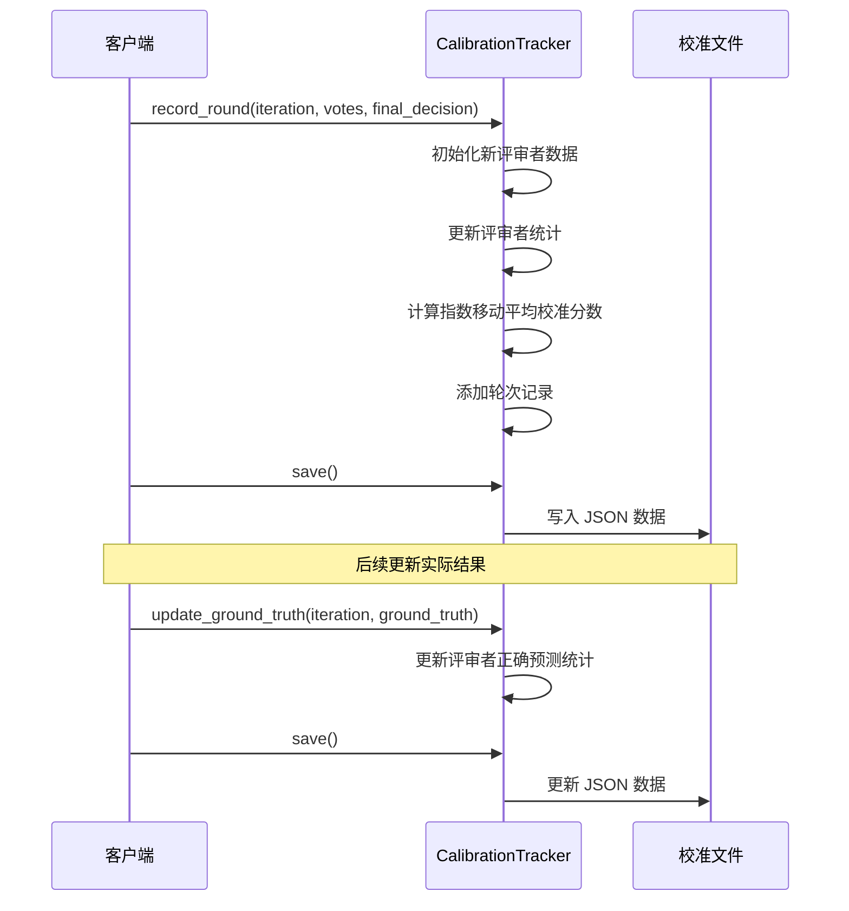
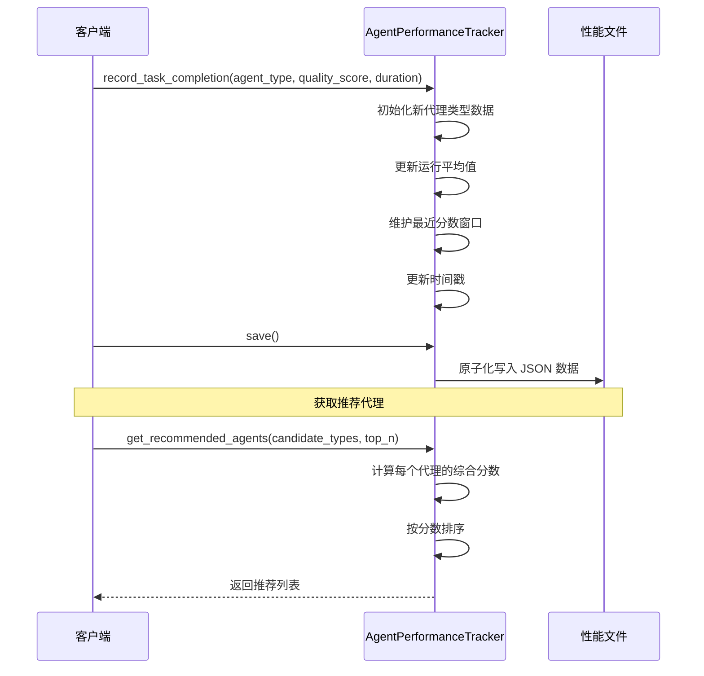

# 性能跟踪与校准模块

## 概述

性能跟踪与校准模块是 Swarm Multi-Agent 系统的核心组件，负责跟踪和评估代理的性能表现，为团队组建和决策提供数据驱动的依据。该模块包含两个主要组件：`CalibrationTracker`（校准跟踪器）和 `AgentPerformanceTracker`（代理性能跟踪器）。

`CalibrationTracker` 专注于跟踪评审者（reviewer）的准确性和一致性，通过历史表现来加权投票，提高决策质量。而 `AgentPerformanceTracker` 则负责跟踪不同类型代理的任务完成质量和耗时，为智能团队组建提供性能数据支持。

## 架构与组件关系

### 模块架构图



### 组件关系说明

性能跟踪与校准模块与 Swarm Multi-Agent 系统的其他组件紧密协作：

- **与 SwarmComposer 协作**：`AgentPerformanceTracker` 为 `SwarmComposer` 提供代理性能数据和推荐代理列表，帮助组建高效的多代理团队。
- **与拜占庭容错组件协作**：`CalibrationTracker` 为拜占庭容错机制提供评审者的校准分数，用于加权投票，提高决策的可靠性。
- **持久化存储**：两个组件都使用 JSON 文件进行数据持久化，确保性能数据在系统重启后不会丢失。

## 核心组件详解

### CalibrationTracker

`CalibrationTracker` 负责跟踪评审者在多轮审查中的准确性和一致性，通过历史表现计算校准分数，用于加权投票决策。

#### 主要功能

- 记录每轮审查的投票情况和最终决策
- 计算评审者与最终决策的一致性
- 使用指数移动平均更新校准分数
- 支持后续更新实际结果（ground truth）以进一步校准
- 提供评审者统计信息和加权投票权重

#### 数据结构

校准数据存储在 JSON 文件中，包含以下结构：

```json
{
  "reviewers": {
    "reviewer_id": {
      "total_reviews": 0,
      "agreements_with_final": 0,
      "disagreements_with_final": 0,
      "correct_predictions": 0,
      "false_positives": 0,
      "false_negatives": 0,
      "calibration_score": 0.5,
      "first_seen": "2023-01-01T00:00:00Z",
      "last_seen": "2023-01-01T00:00:00Z"
    }
  },
  "rounds": [
    {
      "iteration": 1,
      "timestamp": "2023-01-01T00:00:00Z",
      "final_decision": "approve",
      "ground_truth": null,
      "votes": [
        {
          "reviewer_id": "reviewer_id",
          "verdict": "approve",
          "agreed_with_final": true
        }
      ]
    }
  ]
}
```

#### 核心方法

##### `__init__(calibration_file=None)`

初始化校准跟踪器。

**参数：**
- `calibration_file` (可选): 校准数据文件路径，默认为 `.loki/council/calibration.json`

**示例：**
```python
from swarm.calibration import CalibrationTracker

# 使用默认路径
tracker = CalibrationTracker()

# 使用自定义路径
tracker = CalibrationTracker('/path/to/custom/calibration.json')
```

##### `record_round(iteration, votes, final_decision, ground_truth=None)`

记录一轮审查的投票情况。

**参数：**
- `iteration`: RARV 迭代编号
- `votes`: 投票列表，每个投票包含 `reviewer_id` 和 `verdict`
- `final_decision`: 最终决策（'approve' 或 'reject'）
- `ground_truth` (可选): 实际结果，用于后续校准

**示例：**
```python
votes = [
    {'reviewer_id': 'agent-1', 'verdict': 'approve'},
    {'reviewer_id': 'agent-2', 'verdict': 'reject'},
    {'reviewer_id': 'agent-3', 'verdict': 'approve'}
]

tracker.record_round(
    iteration=1,
    votes=votes,
    final_decision='approve',
    ground_truth=None
)
tracker.save()
```

##### `update_ground_truth(iteration, ground_truth)`

更新某轮审查的实际结果。

**参数：**
- `iteration`: 迭代编号
- `ground_truth`: 实际结果（'approve' 或 'reject'）

**示例：**
```python
# 后续发现实际结果
tracker.update_ground_truth(iteration=1, ground_truth='approve')
tracker.save()
```

##### `get_weighted_vote(reviewer_id)`

获取评审者的加权投票权重。

**参数：**
- `reviewer_id`: 评审者 ID

**返回值：**
- 浮点数，表示投票权重。新评审者或评审次数少于 5 次的返回 1.0，否则返回校准分数

**示例：**
```python
weight = tracker.get_weighted_vote('agent-1')
print(f"Agent 1 的投票权重: {weight}")
```

### AgentPerformanceTracker

`AgentPerformanceTracker` 负责跟踪不同类型代理的任务完成质量和耗时，为智能团队组建提供数据支持。

#### 主要功能

- 记录代理类型的任务完成情况
- 计算平均质量分数和平均耗时
- 维护最近分数历史以计算趋势
- 提供代理性能排名和推荐
- 原子化写入确保数据一致性

#### 数据结构

性能数据存储在 JSON 文件中，包含以下结构：

```json
{
  "agent_type": {
    "total_tasks": 0,
    "avg_quality": 0.0,
    "avg_duration": 0.0,
    "recent_scores": [],
    "last_updated": "2023-01-01T00:00:00Z"
  }
}
```

#### 核心方法

##### `__init__(storage_path=None)`

初始化代理性能跟踪器。

**参数：**
- `storage_path` (可选): 性能数据文件路径，默认为 `.loki/memory/agent-performance.json`

**示例：**
```python
from swarm.performance import AgentPerformanceTracker

# 使用默认路径
tracker = AgentPerformanceTracker()

# 使用自定义路径
tracker = AgentPerformanceTracker('/path/to/custom/performance.json')
```

##### `record_task_completion(agent_type, quality_score, duration_seconds)`

记录代理类型的任务完成情况。

**参数：**
- `agent_type`: 代理类型标识符（如 "eng-frontend"）
- `quality_score`: 质量分数，范围 0.0 到 1.0
- `duration_seconds`: 任务耗时（秒）

**示例：**
```python
tracker.record_task_completion(
    agent_type="eng-frontend",
    quality_score=0.85,
    duration_seconds=120.5
)
tracker.save()
```

##### `get_performance_scores()`

获取所有跟踪代理类型的性能分数。

**返回值：**
- 字典，映射代理类型到性能数据，包含平均质量、平均耗时、任务数量和趋势

**示例：**
```python
scores = tracker.get_performance_scores()
for agent_type, data in scores.items():
    print(f"{agent_type}: 质量={data['avg_quality']}, 耗时={data['avg_duration']}秒, 趋势={data['trend']}")
```

##### `get_recommended_agents(candidate_types, top_n=5)`

从候选代理类型中返回排名前 N 的推荐代理。

**参数：**
- `candidate_types`: 候选代理类型列表
- `top_n`: 返回的最大代理数量，默认为 5

**返回值：**
- 代理类型标识符列表，按性能从高到低排序

**示例：**
```python
candidates = ["eng-frontend", "eng-backend", "eng-fullstack", "designer"]
recommended = tracker.get_recommended_agents(candidates, top_n=3)
print(f"推荐代理: {recommended}")
```

## 工作流程

### CalibrationTracker 工作流程



### AgentPerformanceTracker 工作流程



## 使用示例

### 基本使用场景

#### 1. 评审者校准跟踪

```python
from swarm.calibration import CalibrationTracker

# 初始化跟踪器
tracker = CalibrationTracker()

# 模拟多轮审查
for iteration in range(1, 6):
    votes = [
        {'reviewer_id': 'senior-reviewer', 'verdict': 'approve' if iteration % 2 == 0 else 'reject'},
        {'reviewer_id': 'junior-reviewer', 'verdict': 'approve'},
        {'reviewer_id': 'careful-reviewer', 'verdict': 'reject'}
    ]
    final_decision = 'approve' if iteration % 2 == 0 else 'reject'
    
    tracker.record_round(iteration, votes, final_decision)

# 保存数据
tracker.save()

# 获取评审者统计
print("所有评审者统计:")
all_stats = tracker.get_all_stats()
for reviewer_id, stats in all_stats.items():
    print(f"\n{reviewer_id}:")
    print(f"  总评审数: {stats['total_reviews']}")
    print(f"  校准分数: {stats['calibration_score']:.2f}")
    print(f"  与最终决策一致: {stats['agreements_with_final']}")

# 获取加权投票
print("\n加权投票权重:")
for reviewer_id in all_stats.keys():
    weight = tracker.get_weighted_vote(reviewer_id)
    print(f"{reviewer_id}: {weight:.2f}")
```

#### 2. 代理性能跟踪

```python
from swarm.performance import AgentPerformanceTracker
import random

# 初始化跟踪器
tracker = AgentPerformanceTracker()

# 模拟不同代理类型的任务完成
agent_types = ["eng-frontend", "eng-backend", "eng-fullstack", "designer", "qa-engineer"]

for _ in range(50):
    agent_type = random.choice(agent_types)
    # 模拟质量分数（某些代理类型表现更好）
    if agent_type == "eng-fullstack":
        quality = random.uniform(0.7, 0.95)
    elif agent_type == "qa-engineer":
        quality = random.uniform(0.6, 0.9)
    else:
        quality = random.uniform(0.5, 0.85)
    
    duration = random.uniform(60, 300)
    
    tracker.record_task_completion(agent_type, quality, duration)

# 保存数据
tracker.save()

# 获取性能分数
print("代理性能分数:")
scores = tracker.get_performance_scores()
for agent_type, data in scores.items():
    print(f"\n{agent_type}:")
    print(f"  平均质量: {data['avg_quality']:.4f}")
    print(f"  平均耗时: {data['avg_duration']:.2f}秒")
    print(f"  任务数量: {data['task_count']}")
    print(f"  趋势: {data['trend']:.4f}")

# 获取推荐代理
print("\n推荐代理 (前3名):")
recommended = tracker.get_recommended_agents(agent_types, top_n=3)
for i, agent_type in enumerate(recommended, 1):
    print(f"{i}. {agent_type}")
```

### 高级使用场景

#### 3. 集成到团队组建流程

```python
from swarm.composer import SwarmComposer
from swarm.performance import AgentPerformanceTracker

class DataDrivenSwarmComposer(SwarmComposer):
    def __init__(self, performance_tracker):
        super().__init__()
        self.performance_tracker = performance_tracker
    
    def compose_team(self, task_requirements, candidate_agents):
        # 根据任务需求筛选候选代理
        relevant_agents = self._filter_relevant_agents(candidate_agents, task_requirements)
        
        # 使用性能跟踪器获取推荐代理
        agent_types = [agent['type'] for agent in relevant_agents]
        recommended_types = self.performance_tracker.get_recommended_agents(agent_types, top_n=5)
        
        # 组建团队
        team = []
        for agent_type in recommended_types:
            agents_of_type = [agent for agent in relevant_agents if agent['type'] == agent_type]
            if agents_of_type:
                team.append(agents_of_type[0])
                if len(team) >= task_requirements['team_size']:
                    break
        
        return team

# 使用示例
tracker = AgentPerformanceTracker()
composer = DataDrivenSwarmComposer(tracker)

task_requirements = {
    'team_size': 3,
    'skills': ['frontend', 'backend', 'testing']
}

candidate_agents = [
    {'id': 'agent-1', 'type': 'eng-frontend', 'skills': ['frontend']},
    {'id': 'agent-2', 'type': 'eng-backend', 'skills': ['backend']},
    {'id': 'agent-3', 'type': 'eng-fullstack', 'skills': ['frontend', 'backend']},
    {'id': 'agent-4', 'type': 'qa-engineer', 'skills': ['testing']}
]

team = composer.compose_team(task_requirements, candidate_agents)
print("组建的团队:", [agent['id'] for agent in team])
```

## 配置与部署

### 文件存储位置

- **校准数据**: 默认存储在 `.loki/council/calibration.json`
- **性能数据**: 默认存储在 `.loki/memory/agent-performance.json`

可以通过构造函数参数自定义这些路径。

### 数据保留策略

- `CalibrationTracker` 保留最近 100 轮审查记录
- `AgentPerformanceTracker` 为每个代理类型保留最近 20 个质量分数

这些限制可以通过修改代码中的常量来调整：
- `CalibrationTracker` 中的轮次保留逻辑
- `AgentPerformanceTracker` 中的 `MAX_RECENT_SCORES` 常量

### 部署注意事项

1. **目录权限**: 确保应用程序对存储目录有读写权限
2. **备份策略**: 定期备份 JSON 数据文件，以防数据丢失
3. **并发访问**: 两个组件都没有内置并发控制机制，在多线程环境中使用时需要外部同步
4. **磁盘空间**: 监控磁盘空间使用情况，确保有足够空间存储性能数据

## 注意事项与限制

### 边界情况

1. **新评审者/代理**: 对于没有足够历史数据的评审者或代理，系统会使用默认值（新评审者投票权重为 1.0，新代理中性分数为 0.5）
2. **质量分数范围**: `AgentPerformanceTracker` 会自动将质量分数限制在 0.0 到 1.0 之间
3. **负耗时**: 耗时会被自动限制为非负值
4. **空候选列表**: 当候选代理列表为空时，`get_recommended_agents` 返回空列表

### 错误处理

1. **JSON 解析错误**: 如果存储文件损坏，组件会重置为空数据结构而不是崩溃
2. **IO 错误**: 读取或写入文件时发生错误会被捕获并处理
3. **原子写入**: `AgentPerformanceTracker` 使用临时文件和原子替换确保数据一致性

### 性能考虑

1. **内存使用**: 数据完全加载到内存中，对于非常大的数据集可能需要考虑内存使用
2. **写入频率**: 频繁调用 `save()` 可能影响性能，建议批量操作后再保存
3. **趋势计算**: 趋势计算基于最近分数的简单比较，对于复杂趋势可能需要更高级的算法

### 已知限制

1. **单文件存储**: 数据存储在单个 JSON 文件中，不适合分布式环境
2. **无版本控制**: 数据格式变更时没有自动迁移机制
3. **有限的统计指标**: 当前只跟踪基本的统计指标，可能需要更丰富的分析
4. **无实时监控**: 不提供实时性能监控和警报功能

## 与其他模块的关系

性能跟踪与校准模块与 Swarm Multi-Agent 系统的其他模块紧密协作：

- **Swarm 团队组建**: 详见 [Swarm 团队组建](Swarm 团队组建.md) 模块，了解如何使用性能数据进行智能团队组建
- **拜占庭容错**: 详见 [拜占庭容错](拜占庭容错.md) 模块，了解如何使用校准分数提高决策可靠性
- **代理注册表与消息系统**: 详见 [代理注册表与消息系统](代理注册表与消息系统.md) 模块，了解代理信息的管理和通信机制

## 总结

性能跟踪与校准模块为 Swarm Multi-Agent 系统提供了数据驱动的决策支持，通过持续跟踪和评估代理及评审者的表现，不断优化团队组建和决策过程。该模块设计简洁但功能强大，具有良好的可扩展性，可以根据实际需求进行定制和增强。

通过合理使用该模块，系统可以实现：
- 提高决策质量和可靠性
- 优化团队组成，提升整体性能
- 持续学习和改进，适应变化的需求
- 透明的性能评估和反馈机制
