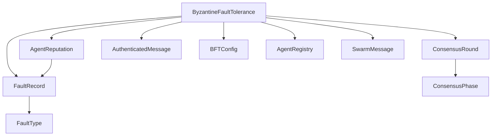
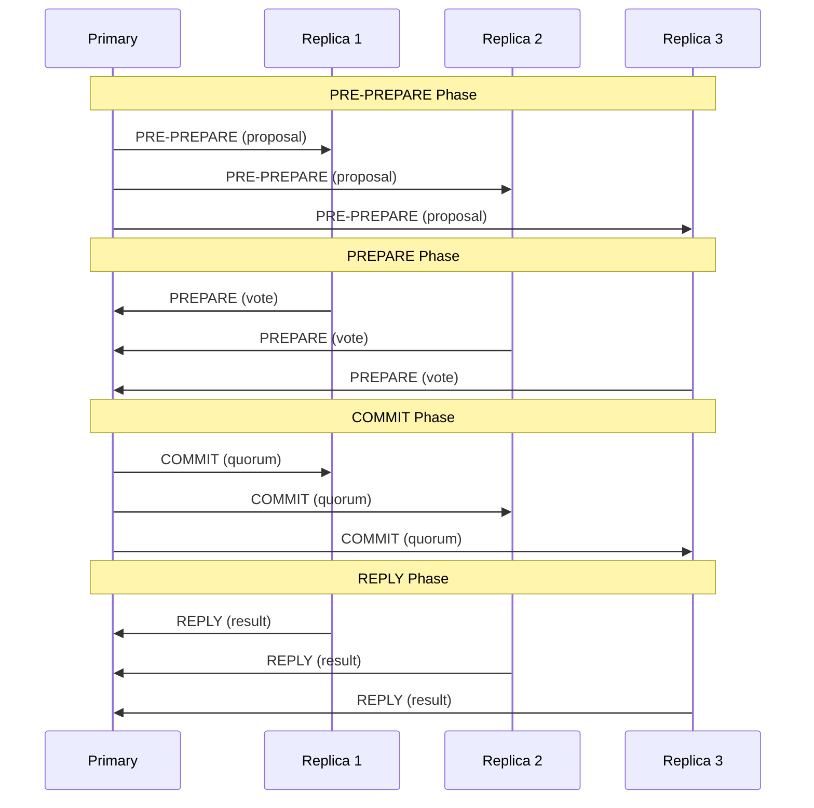

# 拜占庭容错模块文档

## 概述

拜占庭容错（Byzantine Fault Tolerance, BFT）模块是Swarm Multi-Agent系统的核心安全组件，实现了PBFT-lite共识协议，确保在存在恶意或故障代理的情况下，系统仍能保持正确性和一致性。该模块通过代理信誉跟踪、故障检测机制、消息认证和自动排除恶意行为者，为多代理协作提供了强大的可靠性保障。

本模块的设计遵循经典的拜占庭容错理论，确保系统在n个代理中最多可以容忍f个故障代理，其中n > 3f（例如，4个代理可以容忍1个故障，7个代理可以容忍2个故障等）。

## 架构与核心组件

### 模块架构



### 核心组件说明

#### ByzantineFaultTolerance
主类，提供完整的BFT功能实现，包括共识协议、信誉管理、故障检测和消息认证等核心功能。

#### ConsensusPhase
枚举类型，定义PBFT-lite共识协议的各个阶段：PRE_PREPARE、PREPARE、COMMIT和REPLY。

#### AgentReputation
数据类，管理代理的信誉分数，包括成功交互次数、故障记录等信息。

#### FaultRecord
数据类，记录检测到的代理故障，包括故障类型、严重程度和证据。

#### ConsensusRound
数据类，管理单次共识轮次的状态，包括提案、投票情况、阶段和结果。

#### AuthenticatedMessage
数据类，提供消息认证功能，使用HMAC确保消息完整性和防止重放攻击。

## 共识协议详解

### PBFT-lite共识流程



### 共识阶段说明

1. **PRE_PREPARE：主代理广播提案值
2. **PREPARE：副本确认接收并投票
3. **COMMIT：如果获得2f+1个准备投票后，副本提交
4. **REPLY：如果获得2f+1个提交投票后，达成共识

## 核心功能

### 1. 消息认证

模块使用HMAC-SHA256提供消息认证，确保：

```python
# 创建认证消息
auth_msg = bft.create_authenticated_message(message)

# 验证认证消息
is_valid, error = bft.verify_authenticated_message(auth_msg)
```

**安全特性：**
- 防止消息篡改
- 防止重放攻击（使用nonce）
- 验证消息新鲜度（时间戳检查）

### 2. 信誉管理

每个代理都有一个信誉分数（0.0到1.0），基于：
- 成功交互次数
- 故障记录
- 最近行为

```python
# 获取代理信誉
rep = bft.get_reputation(agent_id)

# 更新信誉
bft.update_reputation(agent_id, success=True)

# 尝试恢复被排除的代理
rehabilitated = bft.rehabilitate_agent(agent_id)
```

### 3. 故障检测

模块可以检测多种类型的故障：

| 故障类型 | 描述 | 严重程度 |
|---------|------|---------|
| INCONSISTENT_VOTE | 代理对同一提案投不同票 | 0.3 |
| TIMEOUT | 代理未在时限内响应 | 0.1 |
| INVALID_MESSAGE | 消息认证失败 | 0.2 |
| CONFLICTING_RESULT | 结果与共识不一致 | 0.3 |
| EQUIVOCATION | 向不同代理发送不同消息 | 0.5 |
| MALFORMED_RESPONSE | 响应格式不正确 | 0.2 |
| SYCOPHANTIC_AGREEMENT | 无独立评估的橡皮图章 | 0.3 |

### 4. 共识执行

```python
result = bft.run_consensus(
    proposal_id="proposal-123",
    value="TypeScript",
    participants=["agent-1", "agent-2", "agent-3", "agent-4"],
)

if result.consensus_reached:
    print(f"达成共识：{result.value}")
```

### 5. 结果验证

```python
# 验证多个代理的结果
consensus_result, faults = bft.verify_result(
    proposal_id="task-123",
    agent_results={
        "agent-1": "result-a",
        "agent-2": "result-a", 
        "agent-3": "result-b",
    }
)

# 交叉检查结果
agreement, value, faults = bft.cross_check_results(
    proposal_id="task-456",
    results=[("agent-1", res1],
    min_agreement=0.67
)
```

### 6. BFT感知投票

```python
winning_choice, metadata = bft.bft_vote(
    proposal_id="vote-789",
    votes=votes_list,
    weighted_by_reputation=True
)
```

### 7. BFT感知任务委派

```python
delegate_id, metadata = bft.bft_delegate(
    task_id="task-001",
    required_capabilities=["code_review"],
    candidates=["agent-1", "agent-2", "agent-3"],
)
```

## 配置选项

### BFTConfig配置参数

| 参数 | 默认值 | 说明 |
|-----|--------|------|
| min_reputation_for_consensus | 0.3 | 参与共识的最低信誉 |
| exclusion_threshold | 0.2 | 排除代理的信誉阈值 |
| rehabilitation_threshold | 0.5 | 恢复代理的信誉阈值 |
| consensus_timeout_seconds | 30.0 | 共识超时时间 |
| max_view_changes | 3 | 最大视图变更次数 |
| vote_consistency_window | 10 | 投票一致性检查窗口 |
| message_validity_window_seconds | 60.0 | 消息有效时间窗口 |
| max_faults_before_exclusion | 3 | 排除前的最大故障数 |

### 配置使用示例：

```python
from swarm.bft import BFTConfig, ByzantineFaultTolerance

config = BFTConfig(
    min_reputation_for_consensus=0.4,
    exclusion_threshold=0.15,
    consensus_timeout_seconds=60.0,
)

bft = ByzantineFaultTolerance(registry, config=config)
```

## 使用指南

### 基本使用流程

```python
from swarm.bft import ByzantineFaultTolerance
from swarm.registry import AgentRegistry

# 1. 初始化
registry = AgentRegistry()
bft = ByzantineFaultTolerance(registry)

# 2. 运行共识
result = bft.run_consensus(
    proposal_id="proposal-123",
    value="important-decision",
    participants=["agent-1", "agent-2", "agent-3", "agent-4"],
)

# 3. 处理结果
if result.consensus_reached:
    print(f"Consensus reached: {result.value}")
else:
    print(f"Consensus failed: {result.metadata}")

# 4. 检查代理信誉
for agent_id in result.participating_agents:
    rep = bft.get_reputation(agent_id)
    print(f"Agent {agent_id} reputation: {rep.score}")

# 5. 获取统计信息
stats = bft.get_stats()
print(f"Total faults: {stats['total_faults_recorded}")
```

### 事件处理

```python
def on_fault_detected(fault):
    print(f"Fault detected: {fault.fault_type} for agent {fault.agent_id}")

# 注册故障处理函数
bft.on_fault(on_fault_detected)
```

### 持久化

```python
# 保存配置
bft.save_config()

# 加载配置
bft.load_config()

# 信誉数据自动保存和加载
# （在初始化时自动加载，更新时自动保存）
```

## 边缘情况与注意事项

### 系统限制

1. **最少代理数量：系统需要至少4个代理才能提供任何容错能力（n > 3f，f >= 1）

2. **网络延迟敏感：共识过程对网络延迟敏感，需要合理设置超时时间

3. **信誉恢复：被排除的代理需要通过`rehabilitate_agent()`手动尝试恢复

4. **密钥管理：生产环境中必须使用安全的密钥管理，不要使用默认密钥

### 错误处理

```python
result = bft.run_consensus(...)
if not result.success:
    if "error" in result.metadata:
        error_msg = result.metadata["error"]
        if error_msg == "Insufficient eligible agents for BFT (need >= 4)":
            # 处理代理不足的情况
        else:
            # 处理其他错误
```

### 性能考虑

- 共识轮次会消耗资源，避免不必要的共识
- 合理设置超时时间，平衡响应性和容错性
- 定期清理旧的nonce和投票历史
- 监控代理信誉，及时处理故障代理

## 与其他模块的关系

本模块与Swarm Multi-Agent系统的其他模块紧密协作：

1. **代理注册表**：通过`AgentRegistry`获取代理信息和状态
2. **消息系统**：使用`SwarmMessage`进行通信
3. **性能跟踪**：与`AgentPerformanceTracker`配合工作
4. **Swarm组建**：为SwarmComposer提供容错支持

详细信息请参考相关模块文档：
- [Swarm Multi-Agent](Swarm Multi-Agent.md)
- [代理注册表](Swarm Multi-Agent.md#代理注册表与消息系统)

## 实际应用场景

### 1. **代码审查共识

在多代理代码审查系统中，使用BFT确保审查结果的可靠性：

```python
# 多个代理对代码变更进行审查
review_result = bft.run_consensus(
    proposal_id=f"review-{pr_id}",
    value={"approved": True, "comments": [...]},
    participants=reviewers,
)
```

### 2. **任务结果验证**

验证多个代理执行同一任务的结果：

```python
# 让多个代理执行相同任务
results = []
for agent in agents:
    result = agent.execute_task(task)
    results.append((agent.id, result)

# 交叉验证结果
agreement, consensus_value, faults = bft.cross_check_results(
    proposal_id=task.id, results=results)
```

### 3. **重要决策投票**

在多代理系统中进行重要决策：

```python
votes = []
for agent in decision_makers:
    vote = agent.vote_on_decision(proposal)
    votes.append(vote)

# BFT感知投票
winning_choice, metadata = bft.bft_vote(
    proposal_id=decision_id,
    votes=votes,
    weighted_by_reputation=True
)
```

## 总结

拜占庭容错模块为Swarm Multi-Agent系统提供了强大的容错能力，通过PBFT-lite共识协议、代理信誉管理和故障检测机制，确保系统在存在恶意或故障代理时仍能保持正确性和一致性。该模块是构建可靠多代理系统的核心基础设施。
