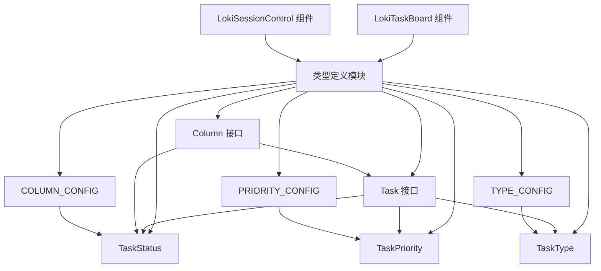

# 类型定义模块文档

## 模块概述

类型定义模块（dashboard.frontend.src.components.types）是 Dashboard Frontend 子系统中的核心类型定义模块，主要为看板（Kanban board）组件提供完整的类型系统支持。该模块定义了任务状态、优先级、类型以及相关的数据结构，是前端任务管理界面的基础类型基础设施。

### 设计理念

本模块采用 TypeScript 的类型系统，通过联合类型、接口和配置对象的组合，为看板组件提供了类型安全且易于扩展的定义。核心设计思路是将任务状态、优先级和类型等枚举值与它们的视觉表现（颜色、标签）分离，同时保持强类型约束，确保在组件使用过程中的类型一致性。

## 核心类型定义

### 任务状态（TaskStatus）

```typescript
export type TaskStatus = 'backlog' | 'pending' | 'in_progress' | 'review' | 'done';
```

`TaskStatus` 是一个字符串联合类型，定义了任务在看板流程中可能处于的所有状态：

- **backlog**：待办事项，任务尚未开始处理
- **pending**：待定，任务已准备好但尚未开始执行
- **in_progress**：进行中，任务正在处理中
- **review**：审核中，任务已完成但需要审核
- **done**：已完成，任务已完成并通过审核

这个类型与看板的列直接对应，每个状态值代表看板中的一个列。

### 任务优先级（TaskPriority）

```typescript
export type TaskPriority = 'critical' | 'high' | 'medium' | 'low';
```

`TaskPriority` 定义了任务的紧急程度和重要性级别：

- **critical**：关键，最高优先级，需要立即处理
- **high**：高，重要任务，应优先处理
- **medium**：中，普通优先级任务
- **low**：低，最低优先级，可以延后处理

### 任务类型（TaskType）

```typescript
export type TaskType = 'feature' | 'bug' | 'chore' | 'docs' | 'test';
```

`TaskType` 定义了任务的性质分类：

- **feature**：功能，新功能开发任务
- **bug**：缺陷，bug 修复任务
- **chore**：杂务，日常维护或构建相关任务
- **docs**：文档，文档编写或更新任务
- **test**：测试，测试相关任务

### 任务接口（Task）

```typescript
export interface Task {
  id: string;
  title: string;
  description: string;
  status: TaskStatus;
  priority: TaskPriority;
  type: TaskType;
  assignee?: string;
  createdAt: string;
  updatedAt: string;
  tags?: string[];
  estimatedHours?: number;
  completedAt?: string;
}
```

`Task` 接口是任务数据的核心定义，包含以下字段：

| 字段名 | 类型 | 必填 | 描述 |
|--------|------|------|------|
| id | string | 是 | 任务的唯一标识符 |
| title | string | 是 | 任务的标题 |
| description | string | 是 | 任务的详细描述 |
| status | TaskStatus | 是 | 任务当前状态 |
| priority | TaskPriority | 是 | 任务优先级 |
| type | TaskType | 是 | 任务类型 |
| assignee | string | 否 | 任务负责人（可选） |
| createdAt | string | 是 | 任务创建时间（ISO 格式字符串） |
| updatedAt | string | 是 | 任务最后更新时间（ISO 格式字符串） |
| tags | string[] | 否 | 任务标签数组（可选） |
| estimatedHours | number | 否 | 预估完成时间（小时，可选） |
| completedAt | string | 否 | 任务完成时间（ISO 格式字符串，可选） |

### 看板列接口（Column）

```typescript
export interface Column {
  id: TaskStatus;
  title: string;
  tasks: Task[];
}
```

`Column` 接口定义了看板中的列结构：

- **id**：列的唯一标识符，使用 `TaskStatus` 类型确保与任务状态的对应关系
- **title**：列的显示标题
- **tasks**：该列中包含的任务数组

## 配置对象

模块除了提供类型定义外，还提供了三个重要的配置对象，用于将类型值映射到视觉表现。

### 列配置（COLUMN_CONFIG）

```typescript
export const COLUMN_CONFIG: Record<TaskStatus, { title: string; color: string }> = {
  backlog: { title: 'Backlog', color: 'bg-gray-100 dark:bg-gray-800' },
  pending: { title: 'Pending', color: 'bg-amber-50 dark:bg-amber-900/20' },
  in_progress: { title: 'In Progress', color: 'bg-blue-50 dark:bg-blue-900/20' },
  review: { title: 'Review', color: 'bg-purple-50 dark:bg-purple-900/20' },
  done: { title: 'Done', color: 'bg-green-50 dark:bg-green-900/20' },
};
```

`COLUMN_CONFIG` 是一个映射对象，将每个 `TaskStatus` 值映射到对应的显示标题和背景颜色类名：

- **title**：列的可读标题
- **color**：Tailwind CSS 类名，定义了列在浅色和深色模式下的背景颜色

### 优先级配置（PRIORITY_CONFIG）

```typescript
export const PRIORITY_CONFIG: Record<TaskPriority, { label: string; color: string; bgColor: string }> = {
  critical: { label: 'Critical', color: 'text-red-700 dark:text-red-400', bgColor: 'bg-red-100 dark:bg-red-900/40' },
  high: { label: 'High', color: 'text-orange-700 dark:text-orange-400', bgColor: 'bg-orange-100 dark:bg-orange-900/40' },
  medium: { label: 'Medium', color: 'text-yellow-700 dark:text-yellow-400', bgColor: 'bg-yellow-100 dark:bg-yellow-900/40' },
  low: { label: 'Low', color: 'text-green-700 dark:text-green-400', bgColor: 'bg-green-100 dark:bg-green-900/40' },
};
```

`PRIORITY_CONFIG` 将每个 `TaskPriority` 值映射到显示标签和颜色样式：

- **label**：优先级的可读标签
- **color**：文本颜色的 Tailwind CSS 类名
- **bgColor**：背景颜色的 Tailwind CSS 类名

### 类型配置（TYPE_CONFIG）

```typescript
export const TYPE_CONFIG: Record<TaskType, { label: string; color: string; bgColor: string }> = {
  feature: { label: 'Feature', color: 'text-blue-700 dark:text-blue-400', bgColor: 'bg-blue-100 dark:bg-blue-900/40' },
  bug: { label: 'Bug', color: 'text-red-700 dark:text-red-400', bgColor: 'bg-red-100 dark:bg-red-900/40' },
  chore: { label: 'Chore', color: 'text-gray-700 dark:text-gray-400', bgColor: 'bg-gray-100 dark:bg-gray-800' },
  docs: { label: 'Docs', color: 'text-purple-700 dark:text-purple-400', bgColor: 'bg-purple-100 dark:bg-purple-900/40' },
  test: { label: 'Test', color: 'text-teal-700 dark:text-teal-400', bgColor: 'bg-teal-100 dark:bg-teal-900/40' },
};
```

`TYPE_CONFIG` 将每个 `TaskType` 值映射到显示标签和颜色样式：

- **label**：任务类型的可读标签
- **color**：文本颜色的 Tailwind CSS 类名
- **bgColor**：背景颜色的 Tailwind CSS 类名

## 架构与组件关系

### 模块依赖关系图



### 数据流程

类型定义模块作为基础类型库，为前端组件提供了完整的类型支持。数据流程如下：

1. 后端 API 返回任务数据
2. 前端 API 客户端将数据转换为 `Task` 类型
3. 看板组件（如 LokiTaskBoard）使用 `Task` 和 `Column` 类型渲染界面
4. 用户交互时，组件更新任务状态并使用类型安全的方式传递数据
5. 配置对象（COLUMN_CONFIG、PRIORITY_CONFIG、TYPE_CONFIG）用于渲染视觉样式

## 使用示例

### 创建任务

```typescript
import { Task, TaskStatus, TaskPriority, TaskType } from './components/types';

const newTask: Task = {
  id: 'task-123',
  title: 'Implement user authentication',
  description: 'Add login and registration functionality',
  status: TaskStatus.Backlog,
  priority: TaskPriority.High,
  type: TaskType.Feature,
  assignee: 'john.doe',
  createdAt: new Date().toISOString(),
  updatedAt: new Date().toISOString(),
  tags: ['auth', 'security'],
  estimatedHours: 8
};
```

### 初始化看板列

```typescript
import { Column, TaskStatus, COLUMN_CONFIG } from './components/types';

const initializeColumns = (): Column[] => {
  return Object.keys(COLUMN_CONFIG).map(status => ({
    id: status as TaskStatus,
    title: COLUMN_CONFIG[status as TaskStatus].title,
    tasks: []
  }));
};
```

### 渲染任务优先级

```typescript
import { TaskPriority, PRIORITY_CONFIG } from './components/types';

const renderPriorityBadge = (priority: TaskPriority) => {
  const config = PRIORITY_CONFIG[priority];
  return (
    <span className={`${config.color} ${config.bgColor} px-2 py-1 rounded text-xs font-medium`}>
      {config.label}
    </span>
  );
};
```

### 按状态分组任务

```typescript
import { Task, Column, TaskStatus, COLUMN_CONFIG } from './components/types';

const groupTasksByStatus = (tasks: Task[]): Column[] => {
  const columns: Record<TaskStatus, Task[]> = {
    backlog: [],
    pending: [],
    in_progress: [],
    review: [],
    done: []
  };
  
  tasks.forEach(task => {
    columns[task.status].push(task);
  });
  
  return Object.entries(columns).map(([status, tasks]) => ({
    id: status as TaskStatus,
    title: COLUMN_CONFIG[status as TaskStatus].title,
    tasks
  }));
};
```

## 扩展与自定义

### 添加新的任务状态

如果需要添加新的任务状态，需要更新以下内容：

1. 扩展 `TaskStatus` 类型
2. 在 `COLUMN_CONFIG` 中添加对应的配置

```typescript
// 扩展 TaskStatus 类型
export type TaskStatus = 'backlog' | 'pending' | 'in_progress' | 'review' | 'done' | 'blocked';

// 更新 COLUMN_CONFIG
export const COLUMN_CONFIG: Record<TaskStatus, { title: string; color: string }> = {
  // ... 现有配置
  blocked: { title: 'Blocked', color: 'bg-red-50 dark:bg-red-900/20' },
};
```

### 自定义颜色主题

可以通过修改配置对象中的 Tailwind CSS 类名来自定义颜色主题：

```typescript
export const PRIORITY_CONFIG: Record<TaskPriority, { label: string; color: string; bgColor: string }> = {
  critical: { 
    label: 'Critical', 
    color: 'text-rose-700 dark:text-rose-400', 
    bgColor: 'bg-rose-100 dark:bg-rose-900/40' 
  },
  // ... 其他优先级配置
};
```

## 注意事项与限制

### 类型安全

- 所有类型定义都是 TypeScript 编译时类型，不会在运行时进行验证
- 如果从外部 API 接收数据，建议添加运行时数据验证来确保类型安全

### 配置对象使用

- 配置对象中的颜色类名基于 Tailwind CSS，确保项目中已正确配置 Tailwind
- 修改配置对象后，需要重新编译才能看到效果

### 时间格式

- `createdAt`、`updatedAt` 和 `completedAt` 字段使用 ISO 格式字符串，建议使用 `Date.toISOString()` 生成
- 在显示时需要根据用户所在时区进行格式化

### 可选字段处理

- `assignee`、`tags`、`estimatedHours` 和 `completedAt` 是可选字段，使用时需要进行空值检查
- 建议使用可选链操作符（`?.`）和空值合并操作符（`??`）来安全访问这些字段

## 相关模块

- [Dashboard Frontend API 客户端](API 客户端.md)：提供与后端通信的类型安全 API
- [LokiTaskBoard 组件](Dashboard UI Components.md)：使用本模块类型的看板组件
- [Dashboard Backend 类型定义](Dashboard Backend.md)：后端对应的类型定义，确保前后端类型一致性

## 总结

类型定义模块为 Dashboard Frontend 提供了完整的看板类型系统，通过 TypeScript 的强类型特性确保了代码的类型安全性。模块采用类型与配置分离的设计，既提供了严格的类型约束，又保持了足够的灵活性来支持自定义和扩展。所有组件都应该基于这些类型定义来构建，以确保整个系统的类型一致性和可维护性。
